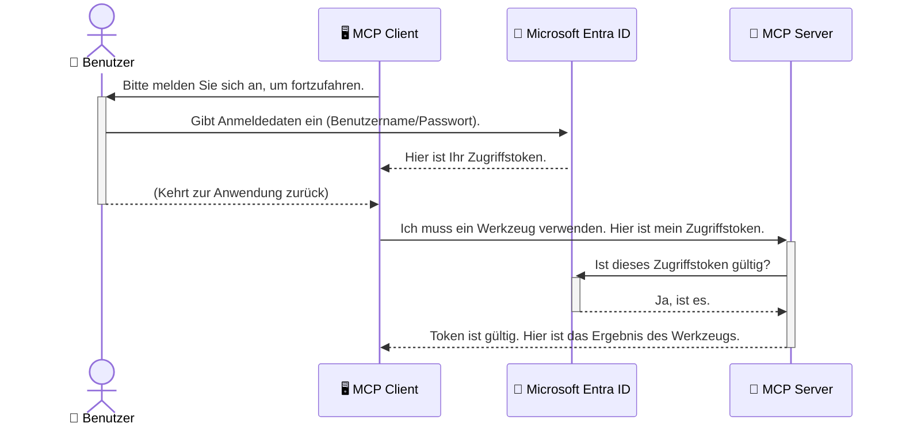

# Absicherung von KI-Workflows: Entra ID-Authentifizierung für Model Context Protocol-Server

## Einführung
Die Absicherung Ihres Model Context Protocol (MCP)-Servers ist genauso wichtig wie das Abschließen der Haustür. Ein offener MCP-Server setzt Ihre Tools und Daten unbefugtem Zugriff aus, was zu Sicherheitsverletzungen führen kann. Microsoft Entra ID bietet eine robuste cloudbasierte Identitäts- und Zugriffsverwaltungslösung, die sicherstellt, dass nur autorisierte Benutzer und Anwendungen mit Ihrem MCP-Server interagieren können. In diesem Abschnitt lernen Sie, wie Sie Ihre KI-Workflows mit Entra ID-Authentifizierung schützen.

## Lernziele
Am Ende dieses Abschnitts können Sie:

- Die Bedeutung der Sicherung von MCP-Servern verstehen.
- Die Grundlagen von Microsoft Entra ID und OAuth 2.0-Authentifizierung erklären.
- Den Unterschied zwischen öffentlichen und vertraulichen Clients erkennen.
- Die Entra ID-Authentifizierung in lokalen (öffentlichen Client) und Remote-(vertraulichen Client) MCP-Server-Szenarien implementieren.
- Sicherheits-Best-Practices bei der Entwicklung von KI-Workflows anwenden.

## Sicherheit und MCP

So wie Sie die Haustür Ihres Hauses nicht unverschlossen lassen würden, sollten Sie Ihren MCP-Server auch nicht frei zugänglich machen. Die Absicherung Ihrer KI-Workflows ist entscheidend, um robuste, vertrauenswürdige und sichere Anwendungen zu erstellen. Dieses Kapitel führt Sie in die Verwendung von Microsoft Entra ID ein, um Ihre MCP-Server zu schützen und sicherzustellen, dass nur autorisierte Benutzer und Anwendungen mit Ihren Tools und Daten interagieren können.

## Warum Sicherheit für MCP-Server wichtig ist

Stellen Sie sich vor, Ihr MCP-Server verfügt über ein Tool, das E-Mails versenden oder auf eine Kundendatenbank zugreifen kann. Ein ungesicherter Server würde bedeuten, dass jeder dieses Tool nutzen könnte, was zu unbefugtem Datenzugriff, Spam oder anderen böswilligen Aktivitäten führen kann.

Durch die Implementierung von Authentifizierung stellen Sie sicher, dass jede Anfrage an Ihren Server verifiziert wird und die Identität des Benutzers oder der Anwendung, die die Anfrage stellt, bestätigt wird. Dies ist der erste und wichtigste Schritt zur Absicherung Ihrer KI-Workflows.

## Einführung in Microsoft Entra ID

[**Microsoft Entra ID**](https://adoption.microsoft.com/microsoft-security/entra/) ist ein cloudbasierter Dienst für Identitäts- und Zugriffsverwaltung. Stellen Sie sich Entra ID als universellen Sicherheitsdienst für Ihre Anwendungen vor. Es übernimmt den komplexen Prozess der Benutzeridentitätsüberprüfung (Authentifizierung) und bestimmt, was sie tun dürfen (Autorisierung).

Mit Entra ID können Sie:

- Sichere Anmeldungen für Benutzer ermöglichen.
- APIs und Dienste schützen.
- Zugriffspolitiken zentral verwalten.

Für MCP-Server bietet Entra ID eine robuste und weithin vertraute Lösung, um zu verwalten, wer auf die Fähigkeiten Ihres Servers zugreifen kann.

---

## Das Verständnis der Magie: Wie Entra ID-Authentifizierung funktioniert

Entra ID verwendet offene Standards wie **OAuth 2.0** zur Handhabung der Authentifizierung. Obwohl die Details komplex sein können, ist das Kernkonzept einfach und lässt sich mit einer Analogie verdeutlichen.

### Eine sanfte Einführung in OAuth 2.0: Der Parkschlüssel

Denken Sie an OAuth 2.0 wie an einen Parkservice für Ihr Auto. Wenn Sie im Restaurant ankommen, geben Sie dem Parkservice nicht Ihren Generalschlüssel. Stattdessen geben Sie einen **Parkschlüssel**, der eingeschränkte Berechtigungen hat – er kann das Auto starten und die Türen verriegeln, aber nicht den Kofferraum oder das Handschuhfach öffnen.

In dieser Analogie:

- **Sie** sind der **Benutzer**.
- **Ihr Auto** ist der **MCP-Server** mit seinen wertvollen Tools und Daten.
- Der **Parkservice** ist **Microsoft Entra ID**.
- Der **Parkplatzwächter** ist der **MCP-Client** (die Anwendung, die auf den Server zugreifen will).
- Der **Parkschlüssel** ist das **Access Token**.

Das Access Token ist eine sichere Textfolge, die der MCP-Client von Entra ID erhält, nachdem Sie sich angemeldet haben. Der Client stellt dieses Token dann bei jeder Anfrage an den MCP-Server vor. Der Server kann das Token verifizieren, um sicherzustellen, dass die Anfrage legitim ist und der Client die erforderlichen Berechtigungen besitzt, ohne jemals Ihre tatsächlichen Anmeldedaten (wie Ihr Passwort) verwenden zu müssen.

### Der Authentifizierungsablauf

So funktioniert der Prozess in der Praxis:



### Einführung in die Microsoft Authentication Library (MSAL)

Bevor wir in den Code eintauchen, ist es wichtig, eine Schlüsselkomponente vorzustellen, die Sie in den Beispielen sehen werden: die **Microsoft Authentication Library (MSAL)**.

MSAL ist eine von Microsoft entwickelte Bibliothek, die es Entwicklern deutlich erleichtert, Authentifizierung zu handhaben. Anstatt selbst den komplexen Code zur Verwaltung von Sicherheitstoken, Anmeldungen und Sitzungsaktualisierungen schreiben zu müssen, übernimmt MSAL diese schwere Arbeit.

Die Verwendung einer Bibliothek wie MSAL wird dringend empfohlen, weil:

- **Sie sicher ist:** MSAL implementiert industrieweite Standards und Sicherheits-Best-Practices und reduziert so das Risiko von Sicherheitslücken in Ihrem Code.
- **Sie die Entwicklung vereinfacht:** Sie abstrahiert die Komplexität der OAuth 2.0- und OpenID Connect-Protokolle, sodass Sie mit nur wenigen Codezeilen eine robuste Authentifizierung hinzufügen können.
- **Sie gepflegt wird:** Microsoft pflegt und aktualisiert MSAL aktiv, um auf neue Sicherheitsbedrohungen und Plattformänderungen zu reagieren.

MSAL unterstützt eine Vielzahl von Sprachen und Anwendungsframeworks, darunter .NET, JavaScript/TypeScript, Python, Java, Go sowie mobile Plattformen wie iOS und Android. So können Sie konsistente Authentifizierungsmuster über Ihren gesamten Technologie-Stack hinweg verwenden.

Weitere Informationen zu MSAL finden Sie in der offiziellen [MSAL-Übersichtsdokumentation](https://learn.microsoft.com/entra/identity-platform/msal-overview).

---

## Absicherung Ihres MCP-Servers mit Entra ID: Schritt-für-Schritt-Anleitung

Lassen Sie uns nun durchgehen, wie Sie einen lokalen MCP-Server (der über `stdio` kommuniziert) mit Entra ID absichern. Dieses Beispiel verwendet einen **öffentlichen Client**, der sich für Anwendungen eignet, die auf dem Computer eines Benutzers laufen, wie z. B. eine Desktop-Anwendung oder ein lokaler Entwicklungsserver.

### Szenario 1: Absicherung eines lokalen MCP-Servers (mit öffentlichem Client)

In diesem Szenario betrachten wir einen lokal laufenden MCP-Server, der über `stdio` kommuniziert und Entra ID verwendet, um den Benutzer vor der Werkzeugnutzung zu authentifizieren. Der Server verfügt über ein einzelnes Tool, das die Profilinformationen des Benutzers von der Microsoft Graph API abruft.

#### 1. Einrichten der Anwendung in Entra ID

Bevor Sie Code schreiben, müssen Sie Ihre Anwendung in Microsoft Entra ID registrieren. Dies teilt Entra ID mit, dass es Ihre Anwendung gibt und gewährt ihr die Berechtigung, den Authentifizierungsdienst zu nutzen.

1. Navigieren Sie zum **[Microsoft Entra-Portal](https://entra.microsoft.com/)**.
2. Gehen Sie zu **App-Registrierungen** und klicken Sie auf **Neue Registrierung**.
3. Geben Sie Ihrer Anwendung einen Namen (z.B. "Mein lokaler MCP-Server").
4. Wählen Sie bei **Unterstützte Kontotypen** die Option **Konten in diesem Organisationsverzeichnis**.
5. Sie können die **Redirect-URI** für dieses Beispiel leer lassen.
6. Klicken Sie auf **Registrieren**.

Nach der Registrierung merken Sie sich die **Anwendungs-(Client-)ID** und die **Verzeichnis-(Mandanten-)ID**. Diese benötigen Sie im Code.

#### 2. Der Code: Eine Übersicht

Schauen wir uns die Schlüsselstellen im Code an, die die Authentifizierung handhaben. Der vollständige Code für dieses Beispiel ist im Ordner [Entra ID - Local - WAM](https://github.com/Azure-Samples/mcp-auth-servers/tree/main/src/entra-id-local-wam) des [mcp-auth-servers GitHub-Repository](https://github.com/Azure-Samples/mcp-auth-servers) verfügbar.

**`AuthenticationService.cs`**

Diese Klasse ist für die Interaktion mit Entra ID zuständig.

- **`CreateAsync`**: Diese Methode initialisiert die `PublicClientApplication` aus der MSAL (Microsoft Authentication Library). Sie wird mit Ihrer `clientId` und `tenantId` der Anwendung konfiguriert.
- **`WithBroker`**: Diese Option aktiviert die Verwendung eines Brokers (wie den Windows Web Account Manager), der eine sicherere und nahtlose Single-Sign-On-Erfahrung bietet.
- **`AcquireTokenAsync`**: Dies ist die Kernmethode. Sie versucht zuerst, ein Token stillschweigend zu erhalten (damit der Benutzer sich nicht erneut anmelden muss, falls bereits eine gültige Sitzung besteht). Wenn kein stillschweigendes Token verfügbar ist, fordert sie den Benutzer zur interaktiven Anmeldung auf.

```csharp
// Simplified for clarity
public static async Task<AuthenticationService> CreateAsync(ILogger<AuthenticationService> logger)
{
    var msalClient = PublicClientApplicationBuilder
        .Create(_clientId) // Your Application (client) ID
        .WithAuthority(AadAuthorityAudience.AzureAdMyOrg)
        .WithTenantId(_tenantId) // Your Directory (tenant) ID
        .WithBroker(new BrokerOptions(BrokerOptions.OperatingSystems.Windows))
        .Build();

    // ... cache registration ...

    return new AuthenticationService(logger, msalClient);
}

public async Task<string> AcquireTokenAsync()
{
    try
    {
        // Try silent authentication first
        var accounts = await _msalClient.GetAccountsAsync();
        var account = accounts.FirstOrDefault();

        AuthenticationResult? result = null;

        if (account != null)
        {
            result = await _msalClient.AcquireTokenSilent(_scopes, account).ExecuteAsync();
        }
        else
        {
            // If no account, or silent fails, go interactive
            result = await _msalClient.AcquireTokenInteractive(_scopes).ExecuteAsync();
        }

        return result.AccessToken;
    }
    catch (Exception ex)
    {
        _logger.LogError(ex, "An error occurred while acquiring the token.");
        throw; // Optionally rethrow the exception for higher-level handling
    }
}
```

**`Program.cs`**

Hier wird der MCP-Server eingerichtet und der Authentifizierungsdienst integriert.

- **`AddSingleton<AuthenticationService>`**: Registriert den `AuthenticationService` im Dependency Injection-Container, damit er von anderen Teilen der Anwendung (wie unserem Tool) verwendet werden kann.
- **`GetUserDetailsFromGraph`-Tool**: Dieses Tool benötigt eine Instanz von `AuthenticationService`. Bevor es etwas tut, ruft es `authService.AcquireTokenAsync()` auf, um ein gültiges Zugriffstoken zu erhalten. Wenn die Authentifizierung erfolgreich ist, verwendet es das Token, um die Microsoft Graph API aufzurufen und Benutzerdetails abzurufen.

```csharp
// Simplified for clarity
[McpServerTool(Name = "GetUserDetailsFromGraph")]
public static async Task<string> GetUserDetailsFromGraph(
    AuthenticationService authService)
{
    try
    {
        // This will trigger the authentication flow
        var accessToken = await authService.AcquireTokenAsync();

        // Use the token to create a GraphServiceClient
        var graphClient = new GraphServiceClient(
            new BaseBearerTokenAuthenticationProvider(new TokenProvider(authService)));

        var user = await graphClient.Me.GetAsync();

        return System.Text.Json.JsonSerializer.Serialize(user);
    }
    catch (Exception ex)
    {
        return $"Error: {ex.Message}";
    }
}
```

#### 3. Wie alles zusammenarbeitet

1. Wenn der MCP-Client versucht, das `GetUserDetailsFromGraph`-Tool zu verwenden, ruft das Tool zuerst `AcquireTokenAsync` auf.
2. `AcquireTokenAsync` veranlasst die MSAL-Bibliothek, nach einem gültigen Token zu suchen.
3. Wenn kein Token gefunden wird, fordert MSAL über den Broker den Benutzer zur Anmeldung mit seinem Entra ID-Konto auf.
4. Nach der Anmeldung gibt Entra ID ein Zugriffstoken aus.
5. Das Tool erhält das Token und nutzt es für einen sicheren Aufruf der Microsoft Graph API.
6. Die Benutzerdaten werden an den MCP-Client zurückgegeben.

Dieser Prozess stellt sicher, dass nur authentifizierte Benutzer das Tool benutzen können und schützt so effektiv Ihren lokalen MCP-Server.

### Szenario 2: Absicherung eines Remote-MCP-Servers (mit vertraulichem Client)

Wenn Ihr MCP-Server auf einem entfernten Rechner (z. B. einem Cloud-Server) läuft und über ein Protokoll wie HTTP Streaming kommuniziert, sind die Sicherheitsanforderungen anders. In diesem Fall sollten Sie einen **vertraulichen Client** und den **Authorization Code Flow** verwenden. Dies ist eine sicherere Methode, da die Geheimnisse der Anwendung nie dem Browser ausgesetzt werden.

Dieses Beispiel verwendet einen typisierten MCP-Server, der Express.js zur Handhabung von HTTP-Anfragen einsetzt.

#### 1. Einrichten der Anwendung in Entra ID

Die Einrichtung in Entra ID ähnelt der für den öffentlichen Client, allerdings mit einem wichtigen Unterschied: Sie müssen ein **Client-Geheimnis** erstellen.

1. Navigieren Sie zum **[Microsoft Entra-Portal](https://entra.microsoft.com/)**.
2. Gehen Sie in Ihrer App-Registrierung zum Tab **Zertifikate & Geheimnisse**.
3. Klicken Sie auf **Neues Clientschlüssel**, geben Sie eine Beschreibung ein und klicken Sie auf **Hinzufügen**.
4. **Wichtig:** Kopieren Sie den Geheimniswert sofort. Später können Sie ihn nicht mehr einsehen.
5. Zusätzlich müssen Sie eine **Redirect-URI** konfigurieren. Gehen Sie zum Tab **Authentifizierung**, klicken Sie auf **Plattform hinzufügen**, wählen Sie **Web** aus und geben Sie die Redirect-URI für Ihre Anwendung ein (z.B. `http://localhost:3001/auth/callback`).

> **⚠️ Wichtiger Sicherheitshinweis:** Für Produktionsanwendungen empfiehlt Microsoft dringend die Verwendung von **authentifizierungsfreien Methoden** wie **Managed Identity** oder **Workload Identity Federation** anstelle von Client-Geheimnissen. Client-Geheimnisse bergen Sicherheitsrisiken, da sie exponiert oder kompromittiert werden können. Verwaltete Identitäten bieten einen sichereren Ansatz, da sie das Speichern von Anmeldedaten im Code oder in der Konfiguration eliminieren.
>
> Weitere Informationen zu verwalteten Identitäten und deren Implementierung finden Sie unter [Managed Identities für Azure-Ressourcen Überblick](https://learn.microsoft.com/entra/identity/managed-identities-azure-resources/overview).

#### 2. Der Code: Eine Übersicht

Dieses Beispiel verwendet einen sitzungsbasierten Ansatz. Wenn sich der Benutzer authentifiziert, speichert der Server das Zugriffstoken und das Aktualisierungstoken in einer Sitzung und gibt dem Benutzer ein Sitzungstoken. Dieses Sitzungstoken wird dann für nachfolgende Anfragen verwendet. Der vollständige Code dieses Beispiels ist im Ordner [Entra ID - Confidential client](https://github.com/Azure-Samples/mcp-auth-servers/tree/main/src/entra-id-cca-session) des [mcp-auth-servers GitHub-Repository](https://github.com/Azure-Samples/mcp-auth-servers) verfügbar.

**`Server.ts`**

Diese Datei richtet den Express-Server und die MCP-Transportschicht ein.

- **`requireBearerAuth`**: Middleware, die die Endpunkte `/sse` und `/message` schützt. Sie prüft im `Authorization`-Header der Anfrage auf ein gültiges Bearer-Token.
- **`EntraIdServerAuthProvider`**: Eine benutzerdefinierte Klasse, die das Interface `McpServerAuthorizationProvider` implementiert. Sie ist zuständig für die Handhabung des OAuth 2.0-Flows.
- **`/auth/callback`**: Dieser Endpunkt behandelt die Umleitung von Entra ID, nachdem sich der Benutzer angemeldet hat. Er tauscht den Autorisierungscode gegen ein Zugriffstoken und ein Aktualisierungstoken aus.

```typescript
// Vereinfacht zur Klarheit
const app = express();
const { server } = createServer();
const provider = new EntraIdServerAuthProvider();

// Schützen Sie den SSE-Endpunkt
app.get("/sse", requireBearerAuth({
  provider,
  requiredScopes: ["User.Read"]
}), async (req, res) => {
  // ... zum Transport verbinden ...
});

// Schützen Sie den Nachrichten-Endpunkt
app.post("/message", requireBearerAuth({
  provider,
  requiredScopes: ["User.Read"]
}), async (req, res) => {
  // ... die Nachricht verarbeiten ...
});

// Behandeln Sie den OAuth 2.0-Rückruf
app.get("/auth/callback", (req, res) => {
  provider.handleCallback(req.query.code, req.query.state)
    .then(result => {
      // ... Erfolg oder Fehler behandeln ...
    });
});
```

**`Tools.ts`**

Diese Datei definiert die Tools, die der MCP-Server bereitstellt. Das `getUserDetails`-Tool ähnelt dem aus dem vorherigen Beispiel, bezieht das Zugriffstoken jedoch aus der Sitzung.

```typescript
// Zur Vereinfachung
server.setRequestHandler(CallToolRequestSchema, async (request) => {
  const { name } = request.params;
  const context = request.params?.context as { token?: string } | undefined;
  const sessionToken = context?.token;

  if (name === ToolName.GET_USER_DETAILS) {
    if (!sessionToken) {
      throw new AuthenticationError("Authentication token is missing or invalid. Ensure the token is provided in the request context.");
    }

    // Hole das Entra-ID-Token aus dem Sitzungsspeicher
    const tokenData = tokenStore.getToken(sessionToken);
    const entraIdToken = tokenData.accessToken;

    const graphClient = Client.init({
      authProvider: (done) => {
        done(null, entraIdToken);
      }
    });

    const user = await graphClient.api('/me').get();

    // ... gebe Benutzerdetails zurück ...
  }
});
```

**`auth/EntraIdServerAuthProvider.ts`**

Diese Klasse übernimmt folgende Logik:

- Weiterleitung des Benutzers zur Entra ID-Anmeldeseite.
- Austausch des Autorisierungscodes gegen ein Zugriffstoken.
- Speicherung der Token im `tokenStore`.
- Aktualisierung des Zugriffstokens bei Ablauf.

#### 3. Wie alles zusammenarbeitet

1. Wenn ein Benutzer sich erstmals mit dem MCP-Server verbinden möchte, erkennt die Middleware `requireBearerAuth`, dass keine gültige Sitzung besteht, und leitet den Benutzer zur Anmeldeseite von Entra ID weiter.
2. Der Benutzer meldet sich mit seinem Entra ID-Konto an.
3. Entra ID leitet den Benutzer zurück zum Endpunkt `/auth/callback` mit einem Autorisierungscode.
4. Der Server tauscht den Code gegen ein Zugriffstoken und ein Aktualisierungstoken aus, speichert diese und erstellt ein Sitzungstoken, das an den Client gesendet wird.
5. Der Client kann dieses Sitzungstoken nun im `Authorization`-Header für alle zukünftigen Anfragen an den MCP-Server verwenden.
6. Wenn das Tool `getUserDetails` aufgerufen wird, verwendet es das Sitzungstoken, um das Entra ID Zugriffstoken nachzuschlagen, und nutzt dieses dann, um die Microsoft Graph API aufzurufen.

Dieser Ablauf ist komplexer als der Public-Client-Flow, ist aber für internetfähige Endpunkte erforderlich. Da entfernte MCP-Server über das öffentliche Internet zugänglich sind, benötigen sie stärkere Sicherheitsmaßnahmen, um sich gegen unbefugten Zugriff und potenzielle Angriffe zu schützen.


## Sicherheits-Best Practices

- **Verwenden Sie immer HTTPS**: Verschlüsseln Sie die Kommunikation zwischen Client und Server, um Token vor Abfangen zu schützen.
- **Implementieren Sie rollenbasierte Zugriffskontrolle (RBAC)**: Prüfen Sie nicht nur, *ob* ein Benutzer authentifiziert ist, sondern *was* er berechtigt ist zu tun. Sie können Rollen in Entra ID definieren und diese in Ihrem MCP-Server abfragen.
- **Überwachen und auditieren**: Protokollieren Sie alle Authentifizierungsereignisse, damit Sie verdächtiges Verhalten erkennen und darauf reagieren können.
- **Umgang mit Rate Limiting und Throttling**: Microsoft Graph und andere APIs wenden Rate-Limiting an, um Missbrauch zu verhindern. Implementieren Sie exponentielles Backoff und Wiederholungslogik in Ihrem MCP-Server, um HTTP-429-Antworten (Too Many Requests) elegant zu handhaben. Erwägen Sie das Caching häufig abgefragter Daten, um API-Aufrufe zu reduzieren.
- **Sichere Tokenlagerung**: Speichern Sie Zugriffstoken und Aktualisierungstoken sicher. Für lokale Anwendungen verwenden Sie die sicheren Speichermechanismen des Systems. Für Serveranwendungen sollten Sie verschlüsselten Speicher oder sichere Schlüsselverwaltungsdienste wie Azure Key Vault in Betracht ziehen.
- **Umgang mit Tokenablauf**: Zugriffstoken sind nur begrenzt gültig. Implementieren Sie eine automatische Token-Aktualisierung mittels Aktualisierungstoken, um eine nahtlose Benutzererfahrung ohne erneute Authentifizierung zu gewährleisten.
- **Erwägen Sie den Einsatz von Azure API Management**: Während die direkte Umsetzung von Sicherheit in Ihrem MCP-Server feinkörnige Kontrolle ermöglicht, können API-Gateways wie Azure API Management viele dieser Sicherheitsaspekte automatisch handhaben, einschließlich Authentifizierung, Autorisierung, Rate Limiting und Überwachung. Sie bieten eine zentrale Sicherheitsschicht zwischen Ihren Clients und MCP-Servern. Für weitere Details zur Verwendung von API-Gateways mit MCP siehe unseren [Azure API Management Your Auth Gateway For MCP Servers](https://techcommunity.microsoft.com/blog/integrationsonazureblog/azure-api-management-your-auth-gateway-for-mcp-servers/4402690).


## Wichtige Erkenntnisse

- Die Sicherung Ihres MCP-Servers ist entscheidend zum Schutz Ihrer Daten und Tools.
- Microsoft Entra ID bietet eine robuste und skalierbare Lösung für Authentifizierung und Autorisierung.
- Verwenden Sie einen **Public Client** für lokale Anwendungen und einen **Confidential Client** für entfernte Server.
- Der **Authorization Code Flow** ist die sicherste Option für Webanwendungen.


## Übung

1. Denken Sie über einen MCP-Server nach, den Sie erstellen könnten. Wäre es ein lokaler Server oder ein entfernter Server?
2. Basierend auf Ihrer Antwort, würden Sie einen Public oder Confidential Client verwenden?
3. Welche Berechtigung würde Ihr MCP-Server für Aktionen gegen Microsoft Graph anfordern?


## Praktische Übungen

### Übung 1: Registrierung einer Anwendung in Entra ID
Navigieren Sie zum Microsoft Entra-Portal.  
Registrieren Sie eine neue Anwendung für Ihren MCP-Server.  
Notieren Sie die Anwendungs-ID (Client-ID) und Verzeichnis-ID (Mandanten-ID).

### Übung 2: Absicherung eines lokalen MCP-Servers (Public Client)
- Folgen Sie dem Codebeispiel zur Integration von MSAL (Microsoft Authentication Library) für die Benutzer-Authentifizierung.
- Testen Sie den Authentifizierungsablauf, indem Sie das MCP-Tool aufrufen, das Benutzerdetails aus Microsoft Graph abruft.

### Übung 3: Absicherung eines entfernten MCP-Servers (Confidential Client)
- Registrieren Sie einen Confidential Client in Entra ID und erstellen Sie ein Client-Secret.
- Konfigurieren Sie Ihren Express.js MCP-Server so, dass der Authorization Code Flow verwendet wird.
- Testen Sie die geschützten Endpunkte und bestätigen Sie den tokenbasierten Zugriff.

### Übung 4: Anwenden von Sicherheits-Best Practices
- Aktivieren Sie HTTPS für Ihren lokalen oder entfernten Server.
- Implementieren Sie rollenbasierte Zugriffskontrolle (RBAC) in der Serverlogik.
- Fügen Sie eine Behandlung des Tokenablaufs und sichere Tokenlagerung hinzu.

## Ressourcen

1. **MSAL Überblicksdokumentation**  
   Erfahren Sie, wie die Microsoft Authentication Library (MSAL) sicheren Tokenerwerb plattformübergreifend ermöglicht:  
   [MSAL Overview on Microsoft Learn](https://learn.microsoft.com/en-gb/entra/msal/overview)

2. **Azure-Samples/mcp-auth-servers GitHub Repository**  
   Referenzimplementierungen von MCP-Servern, die Authentifizierungsflows demonstrieren:  
   [Azure-Samples/mcp-auth-servers on GitHub](https://github.com/Azure-Samples/mcp-auth-servers)

3. **Managed Identities für Azure-Ressourcen Überblick**  
   Verstehen Sie, wie Sie Geheimnisse durch system- oder benutzerzugewiesene verwaltete Identitäten eliminieren können:  
   [Managed Identities Overview on Microsoft Learn](https://learn.microsoft.com/en-us/entra/identity/managed-identities-azure-resources/)

4. **Azure API Management: Ihr Auth-Gateway für MCP-Server**  
   Ein tiefer Einblick in die Verwendung von APIM als sicheres OAuth2-Gateway für MCP-Server:  
   [Azure API Management Your Auth Gateway For MCP Servers](https://techcommunity.microsoft.com/blog/integrationsonazureblog/azure-api-management-your-auth-gateway-for-mcp-servers/4402690)

5. **Microsoft Graph Berechtigungen Referenz**  
   Umfassende Übersicht über delegierte und Anwendungsberechtigungen für Microsoft Graph:  
   [Microsoft Graph Permissions Reference](https://learn.microsoft.com/zh-tw/graph/permissions-reference)


## Lernziele
Nach Abschluss dieses Abschnitts können Sie:

- Erläutern, warum Authentifizierung für MCP-Server und KI-Workflows entscheidend ist.
- Entra ID-Authentifizierung für lokale und entfernte MCP-Server-Szenarien einrichten und konfigurieren.
- Den richtigen Client-Typ (public oder confidential) je nach Serverbereitstellung auswählen.
- Sichere Programmierpraktiken umsetzen, einschließlich Tokenlagerung und rollenbasierter Autorisierung.
- Ihren MCP-Server und seine Tools sicher vor unbefugtem Zugriff schützen.

## Wie geht es weiter

- [5.13 Model Context Protocol (MCP) Integration mit Microsoft Foundry](../mcp-foundry-agent-integration/README.md)

---

<!-- CO-OP TRANSLATOR DISCLAIMER START -->
**Haftungsausschluss**:
Dieses Dokument wurde mit dem KI-Übersetzungsdienst [Co-op Translator](https://github.com/Azure/co-op-translator) übersetzt. Obwohl wir uns um Genauigkeit bemühen, beachten Sie bitte, dass automatisierte Übersetzungen Fehler oder Ungenauigkeiten enthalten können. Das Originaldokument in seiner Ursprungssprache gilt als maßgebliche Quelle. Bei kritischen Informationen wird eine professionelle menschliche Übersetzung empfohlen. Wir übernehmen keine Haftung für Missverständnisse oder Fehlinterpretationen, die aus der Verwendung dieser Übersetzung entstehen.
<!-- CO-OP TRANSLATOR DISCLAIMER END -->