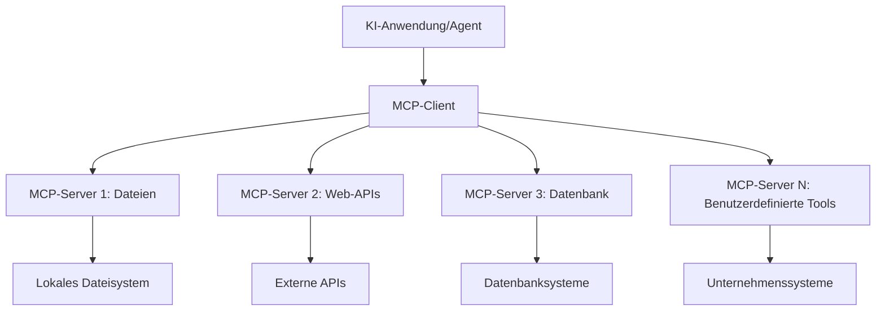

# 🌐 Modul 2: MCP mit Microsoft Foundry Toolkit Grundlagen

[]()
[]()
[]()

## 📋 Lernziele

Am Ende dieses Moduls werden Sie in der Lage sein:
- ✅ Die Architektur und Vorteile des Model Context Protocol (MCP) zu verstehen
- ✅ Das MCP-Server-Ökosystem von Microsoft zu erkunden
- ✅ MCP-Server mit Microsoft Foundry Toolkit Agent Builder zu integrieren
- ✅ Einen funktionalen Browserautomatisierungsagenten mit Playwright MCP zu erstellen
- ✅ MCP-Tools innerhalb Ihrer Agenten zu konfigurieren und zu testen
- ✅ MCP-gestützte Agenten für den Produktionseinsatz zu exportieren und bereitzustellen

## 🎯 Aufbauend auf Modul 1

In Modul 1 haben wir die Grundlagen des Microsoft Foundry Toolkit gemeistert und unseren ersten Python-Agenten erstellt. Jetzt werden wir Ihre Agenten **superladen**, indem wir sie über das revolutionäre **Model Context Protocol (MCP)** mit externen Tools und Diensten verbinden.

Stellen Sie sich das vor wie ein Upgrade von einem einfachen Taschenrechner zu einem vollwertigen Computer – Ihre KI-Agenten erhalten die Fähigkeit:
- 🌐 Websites zu durchsuchen und mit ihnen zu interagieren
- 📁 Auf Dateien zuzugreifen und diese zu bearbeiten
- 🔧 Sich in Unternehmenssysteme zu integrieren
- 📊 Echtzeitdaten von APIs zu verarbeiten

## 🧠 Verständnis des Model Context Protocol (MCP)

### 🔍 Was ist MCP?

Model Context Protocol (MCP) ist der **„USB-C für KI-Anwendungen“** – ein revolutionärer offener Standard, der Große Sprachmodelle (LLMs) mit externen Tools, Datenquellen und Diensten verbindet. So wie USB-C das Kabelchaos durch einen universellen Anschluss beseitigte, beseitigt MCP die Komplexität der KI-Integration durch ein standardisiertes Protokoll.

### 🎯 Das Problem, das MCP löst

**Vor MCP:**
- 🔧 Individuelle Integrationen für jedes Tool
- 🔄 Vendor-Lock-in mit proprietären Lösungen
- 🔒 Sicherheitslücken durch ad-hoc Verbindungen
- ⏱️ Monate Entwicklungszeit für einfache Integrationen

**Mit MCP:**
- ⚡ Plug-and-Play Tool-Integration
- 🔄 Anbieterunabhängige Architektur
- 🛡️ Eingebaute Sicherheits-Best-Practices
- 🚀 Minuten, um neue Funktionen hinzuzufügen

### 🏗️ MCP Architektur im Detail

MCP folgt einer **Client-Server-Architektur**, die ein sicheres, skalierbares Ökosystem schafft:



**🔧 Kernkomponenten:**

| Komponente | Rolle | Beispiele |
|-----------|------|----------|
| **MCP Hosts** | Anwendungen, die MCP-Dienste nutzen | Claude Desktop, VS Code, Microsoft Foundry Toolkit |
| **MCP Clients** | Protokoll-Handler (1:1 zu Servern) | In Host-Anwendungen eingebaut |
| **MCP Server** | Stellen Funktionen über Standardprotokoll bereit | Playwright, Files, Azure, GitHub |
| **Transportschicht** | Kommunikationsmethoden | stdio, HTTP, WebSockets |


## 🏢 Microsofts MCP Server-Ökosystem

Microsoft führt das MCP-Ökosystem mit einer umfassenden Suite von Unternehmensservern an, die reale Geschäftsanforderungen adressieren.

### 🌟 Vorgestellte Microsoft MCP Server

#### 1. ☁️ Azure MCP Server
**🔗 Repository**: [azure/azure-mcp](https://github.com/azure/azure-mcp)
**🎯 Zweck**: Umfassendes Azure-Ressourcenmanagement mit KI-Integration

**✨ Hauptmerkmale:**
- Deklarative Infrastruktur-Bereitstellung
- Echtzeit-Ressourcenüberwachung
- Kostenoptimierungsempfehlungen
- Sicherheits-Compliance-Prüfung

**🚀 Anwendungsfälle:**
- Infrastructure-as-Code mit KI-Unterstützung
- Automatisches Skalieren von Ressourcen
- Cloud-Kostenoptimierung
- Automatisierung von DevOps-Workflows

#### 2. 📊 Microsoft Dataverse MCP
**📚 Dokumentation**: [Microsoft Dataverse Integration](https://go.microsoft.com/fwlink/?linkid=2320176)
**🎯 Zweck**: Natürliche Sprachschnittstelle für Geschäftsdaten

**✨ Hauptmerkmale:**
- Abfragen der Datenbank in natürlicher Sprache
- Verständnis des Geschäftskontexts
- Benutzerdefinierte Prompt-Vorlagen
- Unternehmensweite Datenverwaltung

**🚀 Anwendungsfälle:**
- Business-Intelligence-Berichterstattung
- Analyse von Kundendaten
- Erkenntnisse im Vertriebspipeline-Management
- Compliance-Datenabfragen

#### 3. 🌐 Playwright MCP Server
**🔗 Repository**: [microsoft/playwright-mcp](https://github.com/microsoft/playwright-mcp)
**🎯 Zweck**: Browserautomatisierung und Web-Interaktionsfunktionen

**✨ Hauptmerkmale:**
- Browserübergreifende Automatisierung (Chrome, Firefox, Safari)
- Intelligente Elementerkennung
- Screenshot- und PDF-Erstellung
- Überwachung des Netzwerkverkehrs

**🚀 Anwendungsfälle:**
- Automatisierte Test-Workflows
- Web Scraping und Datenerfassung
- UI/UX-Monitoring
- Automatisierung von Wettbewerbsanalysen

#### 4. 📁 Files MCP Server
**🔗 Repository**: [microsoft/files-mcp-server](https://github.com/microsoft/files-mcp-server)
**🎯 Zweck**: Intelligente Dateisystem-Operationen

**✨ Hauptmerkmale:**
- Deklarative Dateiverwaltung
- Inhaltssynchronisierung
- Integration der Versionskontrolle
- Metadatenextraktion

**🚀 Anwendungsfälle:**
- Dokumentenverwaltung
- Organisation von Code-Repositories
- Workflows für Content-Publishing
- Dateiverwaltung in Datenpipelines

#### 5. 📝 MarkItDown MCP Server
**🔗 Repository**: [microsoft/markitdown](https://github.com/microsoft/markitdown)
**🎯 Zweck**: Erweiterte Markdown-Verarbeitung und -Manipulation

**✨ Hauptmerkmale:**
- Umfangreiche Markdown-Analyse
- Formatkonvertierung (MD ↔ HTML ↔ PDF)
- Inhaltsstruktur-Analyse
- Template-Verarbeitung

**🚀 Anwendungsfälle:**
- Technische Dokumentations-Workflows
- Content-Management-Systeme
- Berichtserstellung
- Automatisierung von Wissensdatenbanken

#### 6. 📈 Clarity MCP Server
**📦 Paket**: [@microsoft/clarity-mcp-server](https://www.npmjs.com/package/@microsoft/clarity-mcp-server)
**🎯 Zweck**: Webanalyse und Erkenntnisse zum Benutzerverhalten

**✨ Hauptmerkmale:**
- Heatmap-Datenanalyse
- Aufzeichnungen von Benutzersitzungen
- Performance-Metriken
- Analyse des Conversion-Funnels

**🚀 Anwendungsfälle:**
- Webseitenoptimierung
- Forschung zur Benutzererfahrung
- A/B-Test-Analysen
- Business-Intelligence-Dashboards

### 🌍 Community-Ökosystem

Über Microsofts Server hinaus umfasst das MCP-Ökosystem:
- **🐙 GitHub MCP**: Repository-Verwaltung und Codeanalyse
- **🗄️ Datenbank-MCPs**: PostgreSQL, MySQL, MongoDB-Integrationen
- **☁️ Cloud-Provider-MCPs**: AWS, GCP, Digital Ocean Tools
- **📧 Kommunikations-MCPs**: Slack-, Teams-, Email-Integrationen

## 🛠️ Praxislabor: Erstellung eines Browser-Automatisierungsagenten

**🎯 Projektziel**: Erstellen Sie einen intelligenten Browser-Automatisierungsagenten mit dem Playwright MCP-Server, der Websites navigieren, Informationen extrahieren und komplexe Webinteraktionen durchführen kann.

### 🚀 Phase 1: Grundlagen des Agenten einrichten

#### Schritt 1: Ihren Agenten initialisieren
1. **Öffnen Sie Microsoft Foundry Toolkit Agent Builder**
2. **Erstellen Sie einen neuen Agenten** mit folgender Konfiguration:
   - **Name**: `BrowserAgent`
   - **Modell**: Wählen Sie GPT-4o 


### 🔧 Phase 2: MCP-Integrationsworkflow

#### Schritt 3: MCP-Server-Integration hinzufügen
1. **Wechseln Sie zum Bereich Tools** im Agent Builder
2. **Klicken Sie auf „Tool hinzufügen“**, um das Integrationsmenü zu öffnen
3. **Wählen Sie „MCP Server“** aus den verfügbaren Optionen


**🔍 Verständnis der Tooltypen:**
- **Eingebaute Tools**: Vorgefertigte Microsoft Foundry Toolkit Funktionen
- **MCP Server**: Integration externer Dienste
- **Eigene APIs**: Eigene Service-Endpunkte
- **Funktionsaufrufe**: Direkter Zugriff auf Modellfunktionen

#### Schritt 4: MCP-Server auswählen
1. **Wählen Sie die Option „MCP Server“**, um fortzufahren


2. **Durchsuchen Sie den MCP-Katalog**, um verfügbare Integrationen zu erkunden


### 🎮 Phase 3: Playwright MCP Konfiguration

#### Schritt 5: Playwright auswählen und konfigurieren
1. **Klicken Sie auf „Verifizierte MCP-Server verwenden“**, um auf Microsofts geprüfte Server zuzugreifen
2. **Wählen Sie „Playwright“** aus der vorgestellten Liste
3. **Akzeptieren Sie die Standard-MCP-ID** oder passen Sie diese für Ihre Umgebung an


#### Schritt 6: Playwright-Fähigkeiten aktivieren
**🔑 Kritischer Schritt**: Wählen Sie **ALLE** verfügbaren Playwright-Methoden für maximale Funktionalität aus


**🛠️ Wesentliche Playwright-Tools:**
- **Navigation**: `goto`, `goBack`, `goForward`, `reload`
- **Interaktion**: `click`, `fill`, `press`, `hover`, `drag`
- **Extraktion**: `textContent`, `innerHTML`, `getAttribute`
- **Validierung**: `isVisible`, `isEnabled`, `waitForSelector`
- **Erfassung**: `screenshot`, `pdf`, `video`
- **Netzwerk**: `setExtraHTTPHeaders`, `route`, `waitForResponse`

#### Schritt 7: Erfolgreiche Integration überprüfen
**✅ Erfolgskriterien:**
- Alle Tools erscheinen in der Agent Builder-Oberfläche
- Keine Fehlermeldungen im Integrationsbereich
- Playwright-Serverstatus zeigt „Verbunden“


**🔧 Häufige Probleme und Lösungen:**
- **Verbindung fehlgeschlagen**: Überprüfen Sie Internetverbindung und Firewall-Einstellungen
- **Fehlende Tools**: Stellen Sie sicher, dass alle Funktionen bei der Einrichtung ausgewählt wurden
- **Berechtigungsfehler**: Vergewissern Sie sich, dass VS Code erforderliche Systemberechtigungen hat

### 🎯 Phase 4: Fortgeschrittene Prompt-Entwicklung

#### Schritt 8: Intelligente System-Prompts entwerfen
Erstellen Sie ausgefeilte Prompts, die die volle Funktionalität von Playwright nutzen:

```markdown
# Web Automation Expert System Prompt

## Core Identity
You are an advanced web automation specialist with deep expertise in browser automation, web scraping, and user experience analysis. You have access to Playwright tools for comprehensive browser control.

## Capabilities & Approach
### Navigation Strategy
- Always start with screenshots to understand page layout
- Use semantic selectors (text content, labels) when possible
- Implement wait strategies for dynamic content
- Handle single-page applications (SPAs) effectively

### Error Handling
- Retry failed operations with exponential backoff
- Provide clear error descriptions and solutions
- Suggest alternative approaches when primary methods fail
- Always capture diagnostic screenshots on errors

### Data Extraction
- Extract structured data in JSON format when possible
- Provide confidence scores for extracted information
- Validate data completeness and accuracy
- Handle pagination and infinite scroll scenarios

### Reporting
- Include step-by-step execution logs
- Provide before/after screenshots for verification
- Suggest optimizations and alternative approaches
- Document any limitations or edge cases encountered

## Ethical Guidelines
- Respect robots.txt and rate limiting
- Avoid overloading target servers
- Only extract publicly available information
- Follow website terms of service
```

#### Schritt 9: Dynamische Benutzer-Prompts erstellen
Entwerfen Sie Prompts, die verschiedene Fähigkeiten demonstrieren:

**🌐 Beispiel Webanalyse:**
```markdown
Navigate to github.com/kinfey and provide a comprehensive analysis including:
1. Repository structure and organization
2. Recent activity and contribution patterns  
3. Documentation quality assessment
4. Technology stack identification
5. Community engagement metrics
6. Notable projects and their purposes

Include screenshots at key steps and provide actionable insights.
```


### 🚀 Phase 5: Ausführung und Test

#### Schritt 10: Starten Sie Ihre erste Automatisierung
1. **Klicken Sie auf „Ausführen“**, um die Automatisierungssequenz zu starten
2. **Überwachen Sie die Echtzeit-Ausführung**:
   - Chrome-Browser startet automatisch
   - Agent navigiert zur Zielwebseite
   - Screenshots erfassen jeden wichtigen Schritt
   - Analyseergebnisse werden in Echtzeit gestreamt


#### Schritt 11: Ergebnisse und Erkenntnisse analysieren
Überprüfen Sie die umfassende Analyse in der Agent Builder-Oberfläche:


### 🌟 Phase 6: Erweiterte Fähigkeiten und Bereitstellung

#### Schritt 12: Exportieren und Produktionsbereitstellung
Agent Builder unterstützt verschiedene Bereitstellungsoptionen:


## 🎓 Modul 2 Zusammenfassung & nächste Schritte

### 🏆 Errungenschaft freigeschaltet: MCP-Integrationsmeister

**✅ Erlernte Fähigkeiten:**
- [ ] Verständnis der MCP-Architektur und -Vorteile
- [ ] Navigation im MCP-Server-Ökosystem von Microsoft
- [ ] Integration von Playwright MCP mit Microsoft Foundry Toolkit
- [ ] Erstellung ausgefeilter Browserautomatisierungsagenten
- [ ] Fortgeschrittene Prompt-Entwicklung für Webautomatisierung

### 📚 Zusätzliche Ressourcen

- **🔗 MCP-Spezifikation**: [Offizielle Protokolldokumentation](https://modelcontextprotocol.io/)
- **🛠️ Playwright API**: [Vollständige Methodendokumentation](https://playwright.dev/docs/api/class-playwright)
- **🏢 Microsoft MCP-Server**: [Enterprise-Integrationsleitfaden](https://github.com/microsoft/mcp-servers)
- **🌍 Community-Beispiele**: [MCP Server Galerie](https://github.com/modelcontextprotocol/servers)

**🎉 Herzlichen Glückwunsch!** Sie haben die MCP-Integration erfolgreich gemeistert und können jetzt produktionsreife KI-Agenten mit externen Tool-Fähigkeiten erstellen!


### 🔜 Weiter zum nächsten Modul

Bereit, Ihre MCP-Kenntnisse auf die nächste Stufe zu heben? Fahren Sie fort mit **[Modul 3: Fortgeschrittene MCP-Entwicklung mit Microsoft Foundry Toolkit](../lab3/README.md)**, wo Sie lernen werden:
- Eigene benutzerdefinierte MCP-Server zu erstellen
- Das neueste MCP Python SDK zu konfigurieren und zu verwenden
- Den MCP Inspector für Debugging einzurichten
- Fortgeschrittene Entwicklungs-Workflows für MCP-Server zu beherrschen
- Einen Wetter-MCP-Server von Grund auf zu bauen

---

<!-- CO-OP TRANSLATOR DISCLAIMER START -->
**Haftungsausschluss**:
Dieses Dokument wurde mit dem KI-Übersetzungsdienst [Co-op Translator](https://github.com/Azure/co-op-translator) übersetzt. Obwohl wir uns um Genauigkeit bemühen, beachten Sie bitte, dass automatisierte Übersetzungen Fehler oder Ungenauigkeiten enthalten können. Das Originaldokument in seiner Ursprungssprache gilt als maßgebliche Quelle. Bei kritischen Informationen wird eine professionelle menschliche Übersetzung empfohlen. Wir übernehmen keine Haftung für Missverständnisse oder Fehlinterpretationen, die aus der Verwendung dieser Übersetzung entstehen.
<!-- CO-OP TRANSLATOR DISCLAIMER END -->