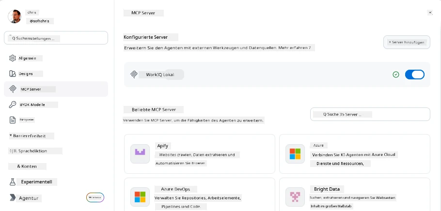
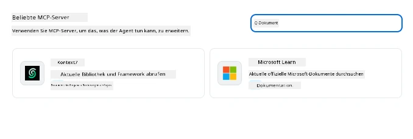
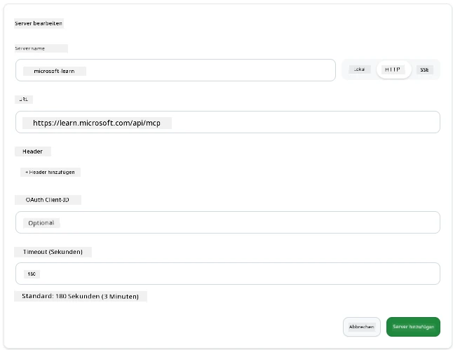
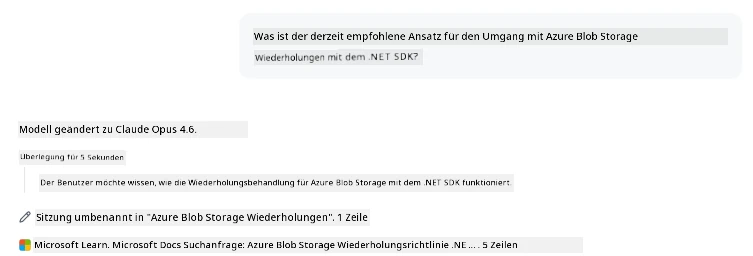
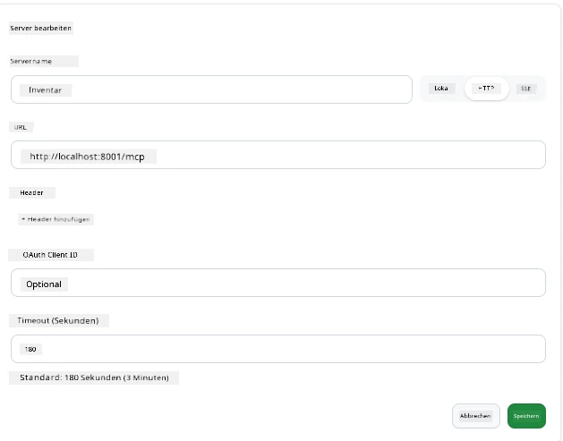
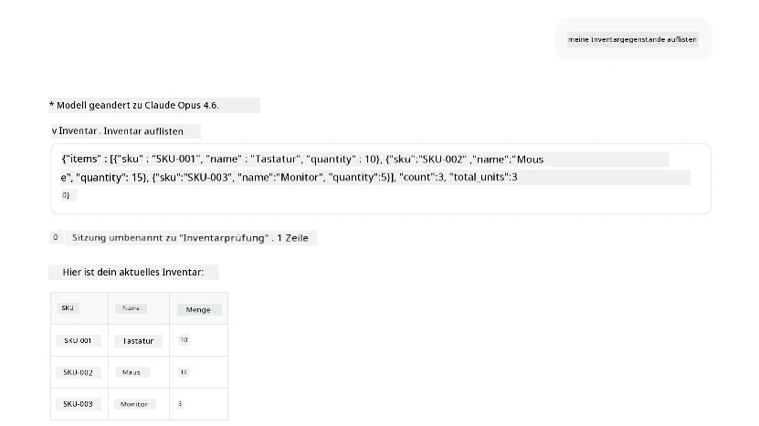
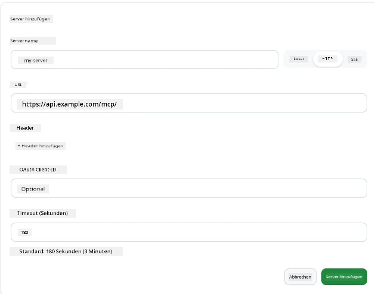
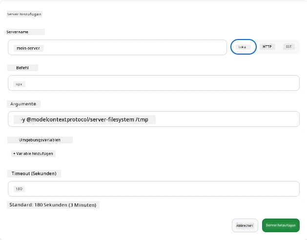

# Verwendung von MCP-Servern in der GitHub Copilot App

Mittlerweile wissen Sie, wie MCP funktioniert. Sie haben Server gebaut, Werkzeuge und Ressourcen definiert und Clients verbunden. Was wir noch nicht gemacht haben, ist die Perspektive zu wechseln: Anstatt dass Sie den Server bauen, wie sieht es aus, auf der *verbrauchenden* Seite zu sein – als Nutzer einer KI-gestützten App, die MCP unterstützt?

[GitHub Copilot App](https://github.com/github/app) ist eine Desktop-App, die MCP-Server verwenden kann. Durch das Verbinden von MCP-Servern mit ihr schalten Sie ein neues Level frei: Copilot kann nun in Ihre Dokumentation eintauchen, Ihre internen APIs aufrufen, Ihre Datenbank abfragen oder mit jedem Dienst kommunizieren, den Sie in einem Server eingebunden haben. Die App wird zum Gastgeber; Ihre MCP-Server werden zu ihren Werkzeugen.

Diese Lektion führt Sie durch diese Erfahrung von Anfang bis Ende – vom Finden des MCP-Einstellungs-Panels bis hin zum Verbinden eines echten Dokumentationsservers und dem Anlegen eines eigenen benutzerdefinierten Servers.

## Lernziele

Am Ende dieser Lektion werden Sie in der Lage sein:

- Das MCP-Server-Panel in den Einstellungen der Copilot App zu finden und zu navigieren.
- Einen gehosteten Dokumentationsserver zu verbinden und in einer Sitzung zu verwenden.
- Einen benutzerdefinierten Server zu registrieren und zu überprüfen, dass Copilot dessen Werkzeuge aufrufen kann.
- Zu konfigurieren, wie ein Server aufgerufen wird, indem Sie entweder Umgebungsvariablen oder benutzerdefinierte Header (bei HTTP) bereitstellen.

## Die Copilot App als MCP-Host

Die grundlegende Idee ist: **Die Agenten von Copilot sind intelligent, aber sie wissen nur, was Sie ihnen mitteilen.** Standardmäßig kann ein Agent Dateien in Ihrem Arbeitsbereich lesen und Terminalbefehle ausführen, aber er kann ohne Hilfe nicht Ihre Datenbank abfragen, in Ihren Kalender schauen oder eine benutzerdefinierte API aufrufen. Hier kommen MCP-Server ins Spiel. Sie fungieren als Brücken zwischen Copilot und Ihren Systemen – Datenbanken, Versionskontrolle, APIs, Design-Tools – und geben den Agenten Zugriff auf die Informationen und Aktionen, die sie benötigen, um ihre Arbeit zu erledigen.

Fangen wir damit an, diese Einstellungen zum Verwalten Ihrer MCP-Server in der App zu finden.

## Schritt 1: Das MCP-Einstellungs-Panel finden

Öffnen Sie die Copilot App und suchen Sie unten links nach einem Zahnrad-Symbol und klicken Sie darauf.


Stellen Sie sicher, dass Sie „MCP Servers“ auswählen, und Sie sollten jetzt Ihre bereits konfigurierten Server oben sehen, einen Marktplatz beliebter Server unten und oben eine Schaltfläche „Add Server“ wie folgt:



Dies ist Ihre Kommandozentrale. Hier fügen Sie Server hinzu, entfernen, aktivieren und deaktivieren sie. Änderungen wirken sich auf neue Sitzungen aus; wenn Sie eine Sitzung offen haben, müssen Sie nach Änderungen eine neue starten.

## Schritt 2: Einen Dokumentationsserver verbinden

Lassen Sie uns etwas sofort Nützliches tun. Der Microsoft Docs MCP-Server gibt Copilot Zugriff auf offizielle Microsoft-Dokumentationen. Dazu gehören Azure, .NET, TypeScript und mehr. Anstatt dass der Agent sich auf sein Trainingsdaten stützt (die ein Ablaufdatum haben), kann er aktuelle Dokumentationen zur Abfragezeit abrufen.

So fügen Sie ihn hinzu:

1. Geben Sie im Raster der beliebten Server **learn** ein und wählen Sie den Server namens „Microsoft Learn“ aus.

   

   Nach einem Klick wird Ihnen ein Formular präsentiert, in dem Name, Transporttyp und URL vorausgefüllt sind – alles, was Sie tun müssen, ist auf „Add Server“ zu klicken.

2. Klicken Sie auf „Add Server“, die Verbindung zum Server dauert ein paar Sekunden.

   

   Nach dem Hinzufügen sollte er oben als konfigurierter Server angezeigt werden. Probieren wir ihn als Nächstes aus.

3. Schließen Sie den Dialog und wählen Sie „Quick chat“ aus.

4. Geben Sie folgenden Prompt ein, um ein Werkzeug auf dem Microsoft Learn-Server auszulösen.

   ```text
   What's the current recommended approach for handling Azure Blob Storage 
   retries using the .NET SDK?
   ```

   

Sie sollten sehen, wie auf den MCP-Server verwiesen wird, den wir gerade hinzugefügt haben.

## Schritt 3: Einen benutzerdefinierten stdio-Server verbinden

Die Voreinstellungen sind praktisch, aber die wahre Stärke liegt darin, eigene Server zu verbinden. Angenommen, Sie haben einen Server gebaut (oder einen bereitgestellt bekommen), der Ihre interne API oder Wissensdatenbank Ihres Unternehmens anbietet. In diesem Fall verwenden wir einen MCP-Server, den wir gebaut haben, der das Inventarmanagement unseres Unternehmens handhabt.

1. Klicken Sie auf das Zahnrad und wählen Sie erneut „MCP servers“.

2. Wählen Sie die Schaltfläche „Add Server“ und dann „+ Add Custom server“ und geben Sie folgende Werte ein:

   - Name: `Inventory Server`
   - Wählen Sie rechts den Transporttyp, **http**

   Klicken Sie auf „Add Server“ und er sollte in Ihrer Liste der konfigurierten Server erscheinen.

   

4. Um ihn zu testen, führen Sie einen Prompt wie folgt aus:

    ```
    list inventory
    ```

   

   Sie sollten jetzt eine Liste von Inventarartikeln von Ihrem selbstgebauten Server zurückbekommen.

Super, Sie sollten jetzt ein gutes Verständnis davon haben, wie man externe sowie eigene MCP-Server zur Copilot App hinzufügt. Als Nächstes sprechen wir über den Umgang mit Geheimnissen und Umgebungsvariablen.

## Schritt 4: Erweiterte Einstellungen

Bisher haben Sie gesehen, wie man MCP-Server hinzufügt, indem man einfach Name und URL angibt. Aber was, wenn Ihr Server einen API-Schlüssel oder einen anderen Wert benötigt? Je nach Transporttyp können wir ihm das Notwendige bereitstellen.

- **http oder SSE Transport**: Hier können wir bei Bedarf Header setzen.

   Für Authentifizierung können Sie z.B. einen Authorization-Header angeben. Der Wert kann ein statischer String sein. Wenn Sie OAuth nutzen, können Sie stattdessen eine OAuth-Client-ID angeben.

   

- **stdio Transport**: Es können Umgebungsvariablen gesetzt werden.

   Hier können Sie beliebig viele Umgebungsvariablen angeben, die in den Server übergeben werden sollen, wenn Sie ihn starten.

   

## Zusammenfassung

Die Copilot App behandelt MCP-Server als gleichwertige Erweiterungen der Fähigkeiten des Agenten. Sie haben in dieser Lektion die komplette Reise gesehen – vom Hinzufügen von MCP-Servern bis zur Nutzung in einer Sitzung. Sie können nun Verbindungen zu öffentlichen Servern, internen APIs und benutzerdefinierten Werkzeugen herstellen, wodurch Ihre Agenten Zugriff auf die Informationen und Aktionen erhalten, die sie benötigen, um Aufgaben autonom abzuschließen.

## 📚 Zusätzliche Ressourcen

### Offizielle Dokumentation

- [GitHub Copilot App](https://github.com/github/app)
- [MCP-Spezifikation](https://modelcontextprotocol.io/specification/2025-03-26) – Model Context Protocol Spezifikation

### Community
- [MCP Community Discord](https://discord.com/invite/ByRwuEEgH4) – Live-Diskussionen
- [GitHub Discussions](https://github.com/microsoft/MCP-Server-and-PostgreSQL-Sample-Retail/discussions) – Fragen & Antworten und Austausch
- [Stack Overflow](https://stackoverflow.com/questions/tagged/model-context-protocol) – Technische Fragen

---

<!-- CO-OP TRANSLATOR DISCLAIMER START -->
**Haftungsausschluss**:
Dieses Dokument wurde mit dem KI-Übersetzungsdienst [Co-op Translator](https://github.com/Azure/co-op-translator) übersetzt. Obwohl wir uns um Genauigkeit bemühen, beachten Sie bitte, dass automatisierte Übersetzungen Fehler oder Ungenauigkeiten enthalten können. Das Originaldokument in seiner Ursprungssprache gilt als maßgebliche Quelle. Bei kritischen Informationen wird eine professionelle menschliche Übersetzung empfohlen. Wir übernehmen keine Haftung für Missverständnisse oder Fehlinterpretationen, die aus der Verwendung dieser Übersetzung entstehen.
<!-- CO-OP TRANSLATOR DISCLAIMER END -->