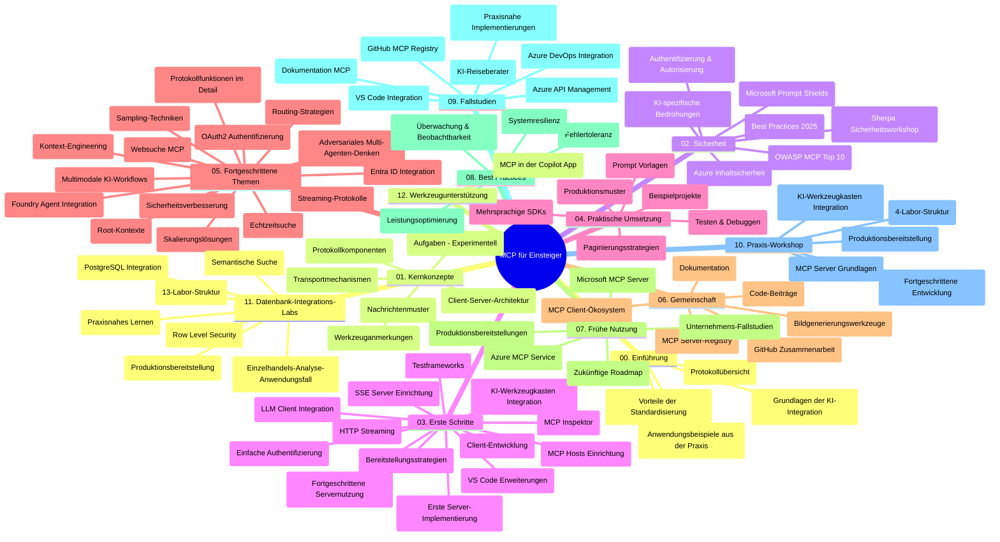

# Model Context Protocol (MCP) für Einsteiger – Studienführer

Dieser Studienführer bietet einen Überblick über die Repository-Struktur und den Inhalt des Curriculums „Model Context Protocol (MCP) für Einsteiger“. Verwenden Sie diesen Leitfaden, um sich effizient im Repository zurechtzufinden und die verfügbaren Ressourcen optimal zu nutzen.

## Überblick über das Repository

Das Model Context Protocol (MCP) ist ein standardisierter Rahmen für die Interaktion zwischen KI-Modellen und Client-Anwendungen. Ursprünglich von Anthropic erstellt, wird MCP jetzt von der breiteren MCP-Community über die offizielle GitHub-Organisation gepflegt. Dieses Repository bietet ein umfassendes Curriculum mit praxisnahen Codebeispielen in C#, Java, JavaScript, Python und TypeScript, das sich an KI-Entwickler, Systemarchitekten und Softwareingenieure richtet.

## Visuelle Curriculum-Karte

## Repository-Struktur

Das Repository ist in zwölf Hauptabschnitte gegliedert, die sich jeweils auf verschiedene Aspekte von MCP konzentrieren:

1. **Einführung (00-Introduction/)**
   - Überblick über das Model Context Protocol
   - Warum Standardisierung in KI-Pipelines wichtig ist
   - Praktische Anwendungsfälle und Vorteile

2. **Kernkonzepte (01-CoreConcepts/)**
   - Client-Server-Architektur
   - Zentrale Protokollkomponenten
   - Messaging-Muster in MCP

3. **Sicherheit (02-Security/)**
   - Sicherheitsbedrohungen in MCP-basierten Systemen
   - Best Practices zur Absicherung von Implementierungen
   - Authentifizierungs- und Autorisierungsstrategien
   - **Umfassende Sicherheitsdokumentation**:
     - MCP Security Best Practices 2025
     - Azure Content Safety Implementierungsleitfaden
     - MCP Security Controls und Techniken
     - MCP Best Practices Schnellreferenz
   - **Wichtige Sicherheitsthemen**:
     - Prompt Injection und Tool Poisoning-Angriffe
     - Session Hijacking und Confused Deputy-Probleme
     - Token-Passthrough-Schwachstellen
     - Übermäßige Berechtigungen und Zugriffskontrolle
     - Supply-Chain-Sicherheit für KI-Komponenten
     - Integration von Microsoft Prompt Shields

4. **Erste Schritte (03-GettingStarted/)**
   - Einrichtung und Konfiguration der Umgebung
   - Erstellen von einfachen MCP-Servern und Clients
   - Integration in vorhandene Anwendungen
   - Enthält Abschnitte zu:
     - Erste Serverimplementierung
     - Client-Entwicklung
     - LLM-Client-Integration
     - VS Code-Integration
     - Server-Sent Events (SSE) Server
     - Erweiterte Servernutzung
     - HTTP-Streaming
     - AI Toolkit-Integration
     - Teststrategien
     - Bereitstellungsrichtlinien

5. **Praxisnahe Implementierung (04-PracticalImplementation/)**
   - Verwendung von SDKs in verschiedenen Programmiersprachen
   - Debugging-, Test- und Validierungstechniken
   - Erstellung wiederverwendbarer Prompt-Vorlagen und Workflows
   - Beispielprojekte mit Implementierungsbeispielen

6. **Fortgeschrittene Themen (05-AdvancedTopics/)**
   - Techniken des Context Engineerings
   - Foundry-Agent-Integration
   - Multi-modale KI-Workflows
   - OAuth2-Authentifizierungs-Demos
   - Echtzeit-Suchfunktionen
   - Echtzeit-Streaming
   - Implementierung von Root-Contexts
   - Routing-Strategien
   - Sampling-Techniken
   - Skalierungsansätze
   - Sicherheitsüberlegungen
   - Entra ID-Sicherheitsintegration
   - Web-Suche-Integration
   - Adversarial Multi-Agent Reasoning (Debattenmuster)

7. **Community-Beiträge (06-CommunityContributions/)**
   - Wie man Code und Dokumentation beisteuert
   - Zusammenarbeit via GitHub
   - Community-getriebene Erweiterungen und Feedback
   - Nutzung verschiedener MCP-Clients (Claude Desktop, Cline, VSCode)
   - Arbeiten mit beliebten MCP-Servern inklusive Bildgenerierung

8. **Erfahrungen aus der frühen Einführung (07-LessonsfromEarlyAdoption/)**
   - Praxisnahe Implementierungen und Erfolgsgeschichten
   - Aufbau und Bereitstellung von MCP-basierten Lösungen
   - Trends und zukünftige Roadmap
   - **Leitfaden zu Microsoft MCP Servern**: Umfassender Leitfaden zu 10 produktionsreifen Microsoft MCP Servern, darunter:
     - Microsoft Learn Docs MCP Server
     - Azure MCP Server (15+ spezialisierte Konnektoren)
     - GitHub MCP Server
     - Azure DevOps MCP Server
     - MarkItDown MCP Server
     - SQL Server MCP Server
     - Playwright MCP Server
     - Dev Box MCP Server
     - Microsoft Foundry MCP Server
     - Microsoft 365 Agents Toolkit MCP Server

9. **Best Practices (08-BestPractices/)**
   - Performance-Tuning und Optimierung
   - Entwurf fehlertoleranter MCP-Systeme
   - Test- und Resilienz-Strategien

10. **Fallstudien (09-CaseStudy/)**
    - **Sieben umfassende Fallstudien**, die die Vielseitigkeit von MCP in verschiedenen Szenarien zeigen:
    - **Azure AI Travel Agents**: Multi-Agenten-Orchestrierung mit Azure OpenAI und AI Search
    - **Azure DevOps Integration**: Automatisierung von Workflow-Prozessen mit YouTube-Datenaktualisierungen
    - **Echtzeit-Dokumentenabruf**: Python-Konsolen-Client mit Streaming-HTTP
    - **Interaktiver Studienplan-Generator**: Chainlit-Web-App mit konversationaler KI
    - **In-Editor-Dokumentation**: VS Code-Integration mit GitHub Copilot Workflows
    - **Azure API Management**: Enterprise-API-Integration mit MCP-Servererstellung
    - **GitHub MCP Registry**: Ökosystementwicklung und agentenbasierte Integrationsplattform
    - Implementierungsbeispiele aus den Bereichen Unternehmensintegration, Entwicklerproduktivität und Ökosystementwicklung

11. **Praktischer Workshop (10-StreamliningAIWorkflowsBuildingAnMCPServerWithAIToolkit/)**
    - Umfassender praxisorientierter Workshop zur Kombination von MCP mit AI Toolkit
    - Aufbau intelligenter Anwendungen, die KI-Modelle mit realen Werkzeugen verbinden
    - Praktische Module zu Grundlagen, Entwicklung benutzerdefinierter Server und Produktionsbereitstellungsstrategien
    - **Laborstruktur**:
      - Labor 1: MCP Server Grundlagen
      - Labor 2: Fortgeschrittene MCP Server Entwicklung
      - Labor 3: AI Toolkit Integration
      - Labor 4: Produktionsbereitstellung und Skalierung
    - Laborbasierter Lernansatz mit Schritt-für-Schritt-Anleitungen

12. **MCP Server Datenbank-Integrationslabore (11-MCPServerHandsOnLabs/)**
    - **Umfassender 13-Lab-Pfad** zum Aufbau produktionsreifer MCP-Server mit PostgreSQL-Integration
    - **Praxisnahe Umsetzung im Einzelhandelsanalytik-Szenario** mit dem Zava Retail Use Case
    - **Unternehmensgerechte Muster** einschließlich Row Level Security (RLS), semantischer Suche und Multi-Tenant-Datenzugriff
    - **Komplette Laborstruktur**:
      - **Labs 00-03: Grundlagen** – Einführung, Architektur, Sicherheit, Einrichtung der Umgebung
      - **Labs 04-06: Aufbau des MCP Servers** – Datenbankdesign, Implementierung des MCP Servers, Tool-Entwicklung
      - **Labs 07-09: Erweiterte Funktionen** – Semantische Suche, Tests & Debugging, VS Code-Integration
      - **Labs 10-12: Produktion & Best Practices** – Bereitstellung, Monitoring, Optimierung
    - **Abgedeckte Technologien**: FastMCP-Framework, PostgreSQL, Azure OpenAI, Azure Container Apps, Application Insights
    - **Lernergebnisse**: Produktionsreife MCP-Server, Datenbank-Integrationsmuster, KI-gestützte Analytik, Unternehmenssicherheit

13. **Werkzeuge (12-tooling/)**
    - Anleitung zur Nutzung von MCP in der Copilot-App und anderen Tools

## Zusätzliche Ressourcen

Das Repository enthält unterstützende Ressourcen:

- **Bilderordner**: Enthält Diagramme und Illustrationen, die im Curriculum verwendet werden
- **Übersetzungen**: Mehrsprachige Unterstützung mit automatisierten Übersetzungen der Dokumentation
- **Offizielle MCP-Ressourcen**:
  - [MCP Dokumentation](https://modelcontextprotocol.io/)
  - [MCP Spezifikation](https://spec.modelcontextprotocol.io/)
  - [MCP GitHub Repository](https://github.com/modelcontextprotocol)

## Wie man dieses Repository nutzt

1. **Sequenzielles Lernen**: Folgen Sie den Kapiteln in der Reihenfolge (00 bis 11) für ein strukturiertes Lernerlebnis.
2. **Sprachspezifischer Fokus**: Wenn Sie an einer bestimmten Programmiersprache interessiert sind, erkunden Sie die Proben-Verzeichnisse mit Implementierungen in Ihrer bevorzugten Sprache.
3. **Praktische Umsetzung**: Beginnen Sie mit dem Abschnitt „Erste Schritte“, um Ihre Umgebung einzurichten und Ihren ersten MCP-Server und Client zu erstellen.
4. **Vertiefte Erkundung**: Sobald Sie mit den Grundlagen vertraut sind, tauchen Sie in die fortgeschrittenen Themen ein, um Ihr Wissen zu erweitern.
5. **Community-Engagement**: Treten Sie der MCP-Community über GitHub-Diskussionen und Discord-Kanäle bei, um sich mit Experten und anderen Entwicklern auszutauschen.

## MCP-Clients und Werkzeuge

Das Curriculum behandelt verschiedene MCP-Clients und Werkzeuge:

1. **Offizielle Clients**:
   - Visual Studio Code
   - MCP in Visual Studio Code
   - Claude Desktop
   - Claude in VSCode
   - Claude API

2. **Community-Clients**:
   - Cline (terminalbasiert)
   - Cursor (Code-Editor)
   - ChatMCP
   - Windsurf

3. **MCP-Verwaltungstools**:
   - MCP CLI
   - MCP Manager
   - MCP Linker
   - MCP Router

## Beliebte MCP Server

Das Repository stellt verschiedene MCP Server vor, darunter:

1. **Offizielle Microsoft MCP Server**:
   - Microsoft Learn Docs MCP Server
   - Azure MCP Server (15+ spezialisierte Konnektoren)
   - GitHub MCP Server
   - Azure DevOps MCP Server
   - MarkItDown MCP Server
   - SQL Server MCP Server
   - Playwright MCP Server
   - Dev Box MCP Server
   - Microsoft Foundry MCP Server
   - Microsoft 365 Agents Toolkit MCP Server

2. **Offizielle Referenzserver**:
   - Filesystem
   - Fetch
   - Memory
   - Sequential Thinking

3. **Bildgenerierung**:
   - Azure OpenAI DALL-E 3
   - Stable Diffusion WebUI
   - Replicate

4. **Entwicklungswerkzeuge**:
   - Git MCP
   - Terminal Control
   - Code Assistant

5. **Spezialisierte Server**:
   - Salesforce
   - Microsoft Teams
   - Jira & Confluence

## Beiträge leisten

Dieses Repository begrüßt Beiträge aus der Community. Siehe den Abschnitt Community-Beiträge für Anleitungen, wie man effektiv zum MCP-Ökosystem beitragen kann.

----

*Dieser Studienführer wurde zuletzt am 5. Februar 2026 aktualisiert, entsprechend der neuesten MCP-Spezifikation 2025-11-25, und bietet einen Überblick über das Repository zu diesem Zeitpunkt. Der Repository-Inhalt kann nach diesem Datum aktualisiert worden sein.*

---

<!-- CO-OP TRANSLATOR DISCLAIMER START -->
**Haftungsausschluss**:
Dieses Dokument wurde mit dem KI-Übersetzungsdienst [Co-op Translator](https://github.com/Azure/co-op-translator) übersetzt. Obwohl wir uns um Genauigkeit bemühen, beachten Sie bitte, dass automatisierte Übersetzungen Fehler oder Ungenauigkeiten enthalten können. Das Originaldokument in seiner Ursprungssprache gilt als maßgebliche Quelle. Bei kritischen Informationen wird eine professionelle menschliche Übersetzung empfohlen. Wir übernehmen keine Haftung für Missverständnisse oder Fehlinterpretationen, die aus der Verwendung dieser Übersetzung entstehen.
<!-- CO-OP TRANSLATOR DISCLAIMER END -->