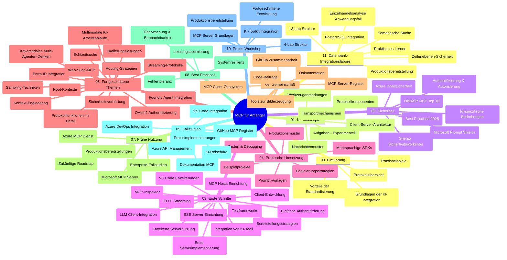

# Model Context Protocol (MCP) für Anfänger – Studienleitfaden

Dieser Studienleitfaden bietet einen Überblick über die Repository-Struktur und den Inhalt des Curriculums „Model Context Protocol (MCP) für Anfänger“. Verwenden Sie diesen Leitfaden, um sich effizient im Repository zu orientieren und die verfügbaren Ressourcen optimal zu nutzen.

## Repository-Übersicht

Das Model Context Protocol (MCP) ist ein standardisierter Rahmen für die Interaktion zwischen KI-Modellen und Client-Anwendungen. Ursprünglich von Anthropic erstellt, wird MCP nun von der breiteren MCP-Community über die offizielle GitHub-Organisation gepflegt. Dieses Repository stellt ein umfassendes Curriculum mit praxisnahen Codebeispielen in C#, Java, JavaScript, Python und TypeScript bereit, das sich an KI-Entwickler, Systemarchitekten und Softwareingenieure richtet.

## Visuelle Curriculum-Karte

## Repository-Struktur

Das Repository ist in elf Hauptabschnitte gegliedert, die sich jeweils auf verschiedene Aspekte von MCP konzentrieren:

1. **Einführung (00-Introduction/)**
   - Überblick über das Model Context Protocol
   - Warum Standardisierung in KI-Pipelines wichtig ist
   - Praktische Anwendungsfälle und Vorteile

2. **Grundkonzepte (01-CoreConcepts/)**
   - Client-Server-Architektur
   - Schlüsselkomponenten des Protokolls
   - Messaging-Muster im MCP

3. **Sicherheit (02-Security/)**
   - Sicherheitsbedrohungen in MCP-basierten Systemen
   - Best Practices zur Sicherung von Implementierungen
   - Authentifizierungs- und Autorisierungsstrategien
   - **Umfassende Sicherheitsdokumentation**:
     - MCP Security Best Practices 2025
     - Azure Content Safety Implementierungsleitfaden
     - MCP Sicherheitskontrollen und Techniken
     - MCP Best Practices Schnellreferenz
   - **Wichtige Sicherheitsthemen**:
     - Prompt Injection und Tool Poisoning Angriffe
     - Session Hijacking und Confused Deputy Probleme
     - Token Passthrough Schwachstellen
     - Übermäßige Berechtigungen und Zugriffskontrolle
     - Lieferkettensicherheit für KI-Komponenten
     - Integration von Microsoft Prompt Shields

4. **Erste Schritte (03-GettingStarted/)**
   - Einrichtung und Konfiguration der Umgebung
   - Erstellung grundlegender MCP-Server und -Clienten
   - Integration in vorhandene Anwendungen
   - Beinhaltet Abschnitte für:
     - Erste Server-Implementierung
     - Client-Entwicklung
     - LLM-Client-Integration
     - VS Code Integration
     - Server-Sent Events (SSE) Server
     - Erweiterte Server-Nutzung
     - HTTP-Streaming
     - AI Toolkit Integration
     - Teststrategien
     - Bereitstellungsrichtlinien

5. **Praktische Umsetzung (04-PracticalImplementation/)**
   - Verwendung von SDKs in verschiedenen Programmiersprachen
   - Debugging-, Test- und Validierungstechniken
   - Erstellung wiederverwendbarer Prompt-Vorlagen und Workflows
   - Beispielprojekte mit Implementierungsbeispielen

6. **Fortgeschrittene Themen (05-AdvancedTopics/)**
   - Techniken des Context Engineering
   - Foundry-Agent-Integration
   - Multimodale KI-Workflows
   - OAuth2-Authentifizierungsdemos
   - Echtzeitsuche-Funktionalitäten
   - Echtzeit-Streaming
   - Implementierung von Root Contexts
   - Routing-Strategien
   - Sampling-Techniken
   - Skalierungsansätze
   - Sicherheitsaspekte
   - Entra ID Sicherheitsintegration
   - Websuche-Integration
   - Adversarial Multi-Agent Reasoning (Debattenmuster)

7. **Community-Beiträge (06-CommunityContributions/)**
   - Wie man Code und Dokumentation beiträgt
   - Zusammenarbeit über GitHub
   - Community-getriebene Erweiterungen und Feedback
   - Nutzung verschiedener MCP-Clients (Claude Desktop, Cline, VSCode)
   - Arbeiten mit beliebten MCP-Servern einschließlich Bildgenerierung

8. **Erfahrungen aus der Frühadaption (07-LessonsfromEarlyAdoption/)**
   - Real-World-Implementationen und Erfolgsgeschichten
   - Aufbau und Bereitstellung MCP-basierter Lösungen
   - Trends und zukünftige Roadmap
   - **Microsoft MCP Server Guide**: Umfassender Leitfaden zu 10 produktionsreifen Microsoft MCP Servern, darunter:
     - Microsoft Learn Docs MCP Server
     - Azure MCP Server (15+ spezialisierte Connectoren)
     - GitHub MCP Server
     - Azure DevOps MCP Server
     - MarkItDown MCP Server
     - SQL Server MCP Server
     - Playwright MCP Server
     - Dev Box MCP Server
     - Microsoft Foundry MCP Server
     - Microsoft 365 Agents Toolkit MCP Server

9. **Best Practices (08-BestPractices/)**
   - Performance-Tuning und Optimierung
   - Entwurf fehlertoleranter MCP-Systeme
   - Test- und Resilienzstrategien

10. **Fallstudien (09-CaseStudy/)**
    - **Sieben umfassende Fallstudien**, die die Vielseitigkeit von MCP in unterschiedlichen Szenarien demonstrieren:
    - **Azure AI Travel Agents**: Multi-Agent-Orchestrierung mit Azure OpenAI und AI Search
    - **Azure DevOps Integration**: Automatisierung von Workflow-Prozessen mit YouTube-Datenupdates
    - **Echtzeit-Dokumentenabfrage**: Python-Konsolenclient mit Streaming-HTTP
    - **Interaktiver Studienplan-Generator**: Chainlit-Web-App mit konversationaler KI
    - **Dokumentation im Editor**: VS Code Integration mit GitHub Copilot Workflows
    - **Azure API Management**: Enterprise API-Integration mit MCP-Server-Erstellung
    - **GitHub MCP Registry**: Ökosystem-Entwicklung und agentische Integrationsplattform
    - Implementierungsbeispiele zu Unternehmensintegration, Entwicklerproduktivität und Ökosystementwicklung

11. **Praktischer Workshop (10-StreamliningAIWorkflowsBuildingAnMCPServerWithAIToolkit/)**
    - Umfassender Praxis-Workshop zur Kombination von MCP mit AI Toolkit
    - Aufbau intelligenter Anwendungen, die KI-Modelle mit realen Werkzeugen verbinden
    - Praktische Module zu Grundlagen, individueller Serverentwicklung und Produktions-Bereitstellung
    - **Lab-Struktur**:
      - Lab 1: Grundlagen MCP Server
      - Lab 2: Fortgeschrittene MCP Server-Entwicklung
      - Lab 3: AI Toolkit Integration
      - Lab 4: Produktions-Bereitstellung und Skalierung
    - Lernansatz mit Labs und Schritt-für-Schritt-Anleitungen

12. **MCP Server Datenbank-Integrations-Labs (11-MCPServerHandsOnLabs/)**
    - **Umfassender 13-Lab-Lernpfad** zum Aufbau produktionsreifer MCP-Server mit PostgreSQL-Integration
    - **Praxisbeispiel im Einzelhandel** anhand des Zava Retail Use Cases
    - **Enterprise-Grade Muster** inklusive Row Level Security (RLS), semantischer Suche und Multi-Tenant-Datenzugriff
    - **Komplette Lab-Struktur**:
      - **Labs 00-03: Grundlagen** – Einführung, Architektur, Sicherheit, Umgebungseinrichtung
      - **Labs 04-06: MCP Server Aufbau** – Datenbankdesign, MCP Server-Implementierung, Toolentwicklung
      - **Labs 07-09: Erweiterte Funktionen** – Semantische Suche, Testing & Debugging, VS Code Integration
      - **Labs 10-12: Produktion & Best Practices** – Deployment, Monitoring, Optimierung
    - **Abgedeckte Technologien**: FastMCP Framework, PostgreSQL, Azure OpenAI, Azure Container Apps, Application Insights
    - **Lernziele**: Produktive MCP-Server, Datenbank-Integrationsmuster, KI-gestützte Analytik, Unternehmenssicherheit

## Zusätzliche Ressourcen

Das Repository enthält unterstützende Ressourcen:

- **Images-Ordner**: Enthält Diagramme und Illustrationen, die im gesamten Curriculum verwendet werden
- **Übersetzungen**: Mehrsprachige Unterstützung mit automatisierten Übersetzungen der Dokumentation
- **Offizielle MCP-Ressourcen**:
  - [MCP Documentation](https://modelcontextprotocol.io/)
  - [MCP Specification](https://spec.modelcontextprotocol.io/)
  - [MCP GitHub Repository](https://github.com/modelcontextprotocol)

## Wie Sie dieses Repository nutzen

1. **Sequentielles Lernen**: Folgen Sie den Kapiteln in der Reihenfolge (00 bis 11) für eine strukturierte Lernerfahrung.
2. **Sprachspezifischer Fokus**: Wenn Sie an einer bestimmten Programmiersprache interessiert sind, durchsuchen Sie die Verzeichnisse mit Beispielen für Implementierungen in Ihrer bevorzugten Sprache.
3. **Praktische Umsetzung**: Beginnen Sie mit dem Abschnitt „Erste Schritte“, um Ihre Umgebung einzurichten und Ihren ersten MCP-Server und -Client zu erstellen.
4. **Fortgeschrittenes Erkunden**: Tauchen Sie nach den Grundlagen in die fortgeschrittenen Themen ein, um Ihr Wissen zu erweitern.
5. **Community-Engagement**: Treten Sie der MCP-Community über GitHub-Diskussionen und Discord-Kanäle bei, um sich mit Experten und anderen Entwicklern zu vernetzen.

## MCP-Clients und Werkzeuge

Das Curriculum behandelt verschiedene MCP-Clients und Werkzeuge:

1. **Offizielle Clients**:
   - Visual Studio Code
   - MCP in Visual Studio Code
   - Claude Desktop
   - Claude in VSCode
   - Claude API

2. **Community-Clients**:
   - Cline (terminalbasiert)
   - Cursor (Code-Editor)
   - ChatMCP
   - Windsurf

3. **MCP-Verwaltungstools**:
   - MCP CLI
   - MCP Manager
   - MCP Linker
   - MCP Router

## Beliebte MCP-Server

Das Repository stellt verschiedene MCP-Server vor, darunter:

1. **Offizielle Microsoft MCP-Server**:
   - Microsoft Learn Docs MCP Server
   - Azure MCP Server (15+ spezialisierte Connectoren)
   - GitHub MCP Server
   - Azure DevOps MCP Server
   - MarkItDown MCP Server
   - SQL Server MCP Server
   - Playwright MCP Server
   - Dev Box MCP Server
   - Microsoft Foundry MCP Server
   - Microsoft 365 Agents Toolkit MCP Server

2. **Offizielle Referenzserver**:
   - Filesystem
   - Fetch
   - Memory
   - Sequential Thinking

3. **Bildgenerierung**:
   - Azure OpenAI DALL-E 3
   - Stable Diffusion WebUI
   - Replicate

4. **Entwicklertools**:
   - Git MCP
   - Terminal Control
   - Code Assistant

5. **Spezialisierte Server**:
   - Salesforce
   - Microsoft Teams
   - Jira & Confluence

## Mitwirken

Dieses Repository freut sich über Beiträge aus der Community. Siehe Abschnitt Community-Beiträge für Hinweise, wie Sie effektiv zum MCP-Ökosystem beitragen können.

----

*Dieser Studienleitfaden wurde zuletzt am 5. Februar 2026 aktualisiert und spiegelt die neueste MCP Specification 2025-11-25 sowie den Stand des Repositories zu diesem Datum wider. Der Inhalt des Repositories kann nach diesem Datum aktualisiert werden.*

---

<!-- CO-OP TRANSLATOR DISCLAIMER START -->
**Haftungsausschluss**:
Dieses Dokument wurde mit dem KI-Übersetzungsdienst [Co-op Translator](https://github.com/Azure/co-op-translator) übersetzt. Obwohl wir uns um Genauigkeit bemühen, beachten Sie bitte, dass automatisierte Übersetzungen Fehler oder Ungenauigkeiten enthalten können. Das Originaldokument in seiner Ursprungssprache gilt als maßgebliche Quelle. Bei kritischen Informationen wird eine professionelle menschliche Übersetzung empfohlen. Wir übernehmen keine Haftung für Missverständnisse oder Fehlinterpretationen, die aus der Verwendung dieser Übersetzung entstehen.
<!-- CO-OP TRANSLATOR DISCLAIMER END -->