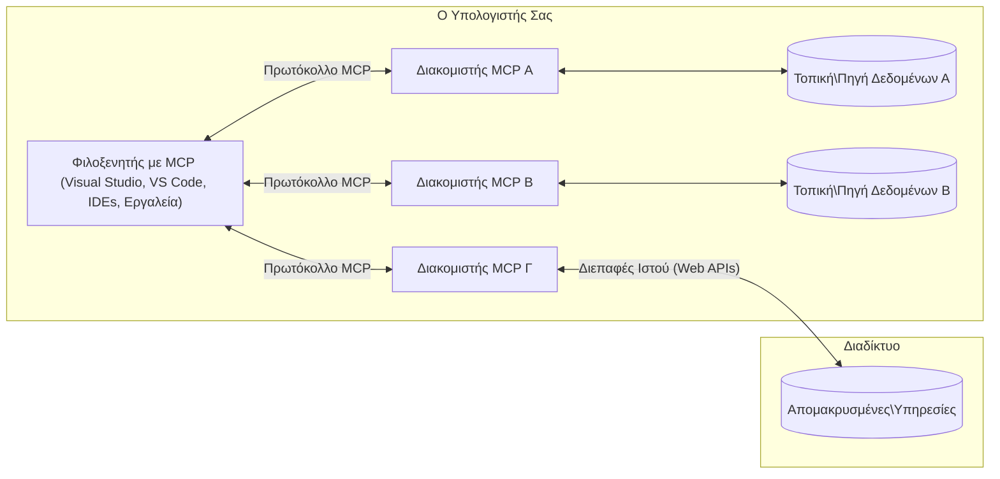

# MCP Core Concepts: Κατακτώντας το Πρωτόκολλο Πλαισίου Μοντέλου για Ενσωμάτωση AI

[](https://youtu.be/earDzWGtE84)

_(Κάντε κλικ στην εικόνα παραπάνω για να δείτε το βίντεο αυτού του μαθήματος)_

Το [Πρωτόκολλο Πλαισίου Μοντέλου (MCP)](https://github.com/modelcontextprotocol) είναι ένα ισχυρό, τυποποιημένο πλαίσιο που βελτιστοποιεί την επικοινωνία μεταξύ Μεγάλων Γλωσσικών Μοντέλων (LLMs) και εξωτερικών εργαλείων, εφαρμογών και πηγών δεδομένων.  
Αυτός ο οδηγός θα σας καθοδηγήσει μέσα από τις βασικές έννοιες του MCP. Θα μάθετε για την αρχιτεκτονική πελάτη-διακομιστή, τα βασικά στοιχεία, τους μηχανισμούς επικοινωνίας και τις βέλτιστες πρακτικές υλοποίησης.

- **Ρητή Συγκατάθεση Χρήστη**: Όλη η πρόσβαση και οι λειτουργίες δεδομένων απαιτούν ρητή έγκριση χρήστη πριν την εκτέλεση. Οι χρήστες πρέπει να κατανοούν σαφώς ποια δεδομένα θα προσεγγιστούν και ποιες ενέργειες θα εκτελεστούν, με λεπτομερή έλεγχο δικαιωμάτων και αδειοδοτήσεων.

- **Προστασία Ιδιωτικότητας Δεδομένων**: Τα δεδομένα των χρηστών αποκαλύπτονται μόνο με ρητή συγκατάθεση και πρέπει να προστατεύονται από ισχυρούς ελέγχους πρόσβασης καθ’ όλη τη διάρκεια της αλληλεπίδρασης. Οι υλοποιήσεις πρέπει να αποτρέπουν μη εξουσιοδοτημένες μεταδόσεις δεδομένων και να διατηρούν αυστηρά όρια ιδιωτικότητας.

- **Ασφάλεια Εκτέλεσης Εργαλείων**: Κάθε κλήση εργαλείου απαιτεί ρητή συγκατάθεση χρήστη με σαφή κατανόηση της λειτουργίας, των παραμέτρων και της πιθανής επίπτωσης του εργαλείου. Αυστηρά όρια ασφαλείας πρέπει να αποτρέπουν ακούσιες, μη ασφαλείς ή κακόβουλες εκτελέσεις εργαλείων.

- **Ασφάλεια Επίπεδου Μεταφοράς**: Όλα τα κανάλια επικοινωνίας πρέπει να χρησιμοποιούν κατάλληλους μηχανισμούς κρυπτογράφησης και πιστοποίησης. Οι απομακρυσμένες συνδέσεις πρέπει να υλοποιούν ασφαλή πρωτόκολλα μεταφοράς και σωστή διαχείριση διαπιστευτηρίων.

#### Οδηγίες Υλοποίησης:

- **Διαχείριση Δικαιωμάτων**: Υλοποιήστε συστήματα λεπτομερούς ελέγχου δικαιωμάτων που επιτρέπουν στους χρήστες να ελέγχουν ποιοι διακομιστές, εργαλεία και πόροι είναι προσβάσιμοι  
- **Πιστοποίηση & Εξουσιοδότηση**: Χρησιμοποιήστε ασφαλείς μεθόδους πιστοποίησης (OAuth, API keys) με σωστή διαχείριση και λήξη των token  
- **Επικύρωση Εισόδου**: Επικυρώστε όλες τις παραμέτρους και δεδομένα σύμφωνα με ορισμένα σχήματα για να αποτρέψετε επιθέσεις ένεσης  
- **Καταγραφή Ελέγχου**: Διατηρήστε ολοκληρωμένα αρχεία όλων των λειτουργιών για παρακολούθηση ασφαλείας και συμμόρφωση

## Επισκόπηση

Αυτό το μάθημα εξερευνά την θεμελιώδη αρχιτεκτονική και τα στοιχεία που αποτελούν το οικοσύστημα του Πρωτοκόλλου Πλαισίου Μοντέλου (MCP). Θα μάθετε για την αρχιτεκτονική πελάτη-διακομιστή, τα βασικά στοιχεία και τους μηχανισμούς επικοινωνίας που λειτουργούν τις αλληλεπιδράσεις MCP.

## Κύριοι Στόχοι Μάθησης

Στο τέλος αυτού του μαθήματος, θα:

- Κατανοείτε την αρχιτεκτονική πελάτη-διακομιστή MCP.  
- Αναγνωρίζετε τους ρόλους και τις ευθύνες των Χορηγών, Πελατών και Διακομιστών.  
- Αναλύετε τα βασικά χαρακτηριστικά που καθιστούν το MCP ευέλικτο επίπεδο ενσωμάτωσης.  
- Μαθαίνετε πώς ρέει η πληροφορία μέσα στο οικοσύστημα MCP.  
- Αποκτάτε πρακτικές γνώσεις μέσω παραδειγμάτων κώδικα σε .NET, Java, Python και JavaScript.

## Αρχιτεκτονική MCP: Μια Βαθύτερη Ματιά

Το οικοσύστημα MCP βασίζεται σε μοντέλο πελάτη-διακομιστή. Αυτή η αρθρωτή δομή επιτρέπει στις εφαρμογές AI να αλληλεπιδρούν με εργαλεία, βάσεις δεδομένων, APIs και περιβαλλοντικούς πόρους με αποδοτικό τρόπο. Ας αναλύσουμε αυτή την αρχιτεκτονική στα βασικά της στοιχεία.

Στον πυρήνα του, το MCP ακολουθεί μια αρχιτεκτονική πελάτη-διακομιστή όπου μια εφαρμογή-χορηγός μπορεί να συνδεθεί με πολλαπλούς διακομιστές:


- **MCP Χορηγοί**: Προγράμματα όπως το VSCode, Claude Desktop, IDEs ή εργαλεία AI που θέλουν να έχουν πρόσβαση σε δεδομένα μέσω MCP  
- **MCP Πελάτες**: Πελάτες πρωτοκόλλου που διατηρούν συνδέσεις 1:1 με διακομιστές  
- **MCP Διακομιστές**: Ελαφριά προγράμματα που εκθέτουν συγκεκριμένες δυνατότητες μέσω του τυποποιημένου Πρωτοκόλλου Πλαισίου Μοντέλου  
- **Τοπικές Πηγές Δεδομένων**: Αρχεία, βάσεις δεδομένων και υπηρεσίες του υπολογιστή σας που οι MCP διακομιστές μπορούν να προσεγγίσουν με ασφάλεια  
- **Απομακρυσμένες Υπηρεσίες**: Εξωτερικά συστήματα διαθέσιμα μέσω διαδικτύου που οι MCP διακομιστές μπορούν να συνδεθούν μέσω APIs.

Το Πρωτόκολλο MCP είναι ένα εξελισσόμενο πρότυπο που χρησιμοποιεί εκδόσεις βάσει ημερομηνίας (μορφή YYYY-MM-DD). Η τρέχουσα έκδοση πρωτοκόλλου είναι **2025-11-25**. Μπορείτε να δείτε τις τελευταίες ενημερώσεις στις [προδιαγραφές του πρωτοκόλλου](https://modelcontextprotocol.io/specification/2025-11-25/)

### 1. Χορηγοί

Στο Πρωτόκολλο Πλαισίου Μοντέλου (MCP), οι **Χορηγοί** είναι εφαρμογές AI που λειτουργούν ως η κύρια διεπαφή μέσω της οποίας οι χρήστες αλληλεπιδρούν με το πρωτόκολλο. Οι χορηγοί συντονίζουν και διαχειρίζονται συνδέσεις με πολλούς MCP διακομιστές, δημιουργώντας αποκλειστικούς MCP πελάτες για κάθε σύνδεση διακομιστή. Παραδείγματα Χορηγών είναι:

- **Εφαρμογές AI**: Claude Desktop, Visual Studio Code, Claude Code  
- **Περιβάλλοντα Ανάπτυξης**: IDEs και επεξεργαστές κώδικα με ολοκλήρωση MCP  
- **Προσαρμοσμένες Εφαρμογές**: Ειδικά κατασκευασμένοι πράκτορες AI και εργαλεία

Οι **Χορηγοί** είναι εφαρμογές που συντονίζουν αλληλεπιδράσεις με μοντέλα AI. Αυτοί:

- **Οργανώνουν τα Μοντέλα AI**: Εκτελούν ή αλληλεπιδρούν με LLMs για τη δημιουργία απαντήσεων και τη συντονισμό ροών εργασίας AI  
- **Διαχειρίζονται Συνδέσεις Πελατών**: Δημιουργούν και διατηρούν έναν MCP πελάτη για κάθε σύνδεση MCP διακομιστή  
- **Ελέγχουν το Περιβάλλον Χρήστη**: Διαχειρίζονται τη ροή συνομιλίας, τις αλληλεπιδράσεις χρηστών και την παρουσίαση απαντήσεων  
- **Επιβάλλουν Ασφάλεια**: Ελέγχουν δικαιώματα, περιορισμούς ασφαλείας και πιστοποίηση  
- **Διαχειρίζονται τη Συγκατάθεση Χρήστη**: Διαχειρίζονται την έγκριση του χρήστη για κοινή χρήση δεδομένων και εκτέλεση εργαλείων

### 2. Πελάτες

Οι **Πελάτες** είναι βασικά στοιχεία που διατηρούν αποκλειστικές συνδέσεις ένας προς έναν ανάμεσα σε Χορηγούς και MCP διακομιστές. Κάθε MCP πελάτης δημιουργείται από τον Χορηγό για να συνδεθεί σε συγκεκριμένο MCP διακομιστή, εξασφαλίζοντας οργανωμένα και ασφαλή κανάλια επικοινωνίας. Πολλοί πελάτες επιτρέπουν στους Χορηγούς να συνδεθούν ταυτόχρονα με πολλούς διακομιστές.

Οι **Πελάτες** είναι εξαρτήματα σύνδεσης μέσα στην εφαρμογή-χορηγό. Αυτοί:

- **Επικοινωνία Πρωτοκόλλου**: Στέλνουν αιτήματα JSON-RPC 2.0 προς τους διακομιστές με εντολές και οδηγίες  
- **Διαπραγμάτευση Δυνατοτήτων**: Διαπραγματεύονται υποστηριζόμενα χαρακτηριστικά και εκδόσεις πρωτοκόλλου με τους διακομιστές κατά την αρχικοποίηση  
- **Εκτέλεση Εργαλείων**: Διαχειρίζονται αιτήματα εκτέλεσης εργαλείων από μοντέλα και επεξεργάζονται τις απαντήσεις  
- **Ενημερώσεις σε Πραγματικό Χρόνο**: Διαχειρίζονται ειδοποιήσεις και ενημερώσεις σε πραγματικό χρόνο από διακομιστές  
- **Επεξεργασία Απαντήσεων**: Επεξεργάζονται και διαμορφώνουν απαντήσεις διακομιστή για εμφάνιση στους χρήστες

### 3. Διακομιστές

Οι **Διακομιστές** είναι προγράμματα που παρέχουν πλαίσιο, εργαλεία και δυνατότητες σε MCP πελάτες. Μπορούν να εκτελούνται τοπικά (στον ίδιο υπολογιστή με τον Χορηγό) ή απομακρυσμένα (σε εξωτερικές πλατφόρμες), και είναι υπεύθυνοι για την διαχείριση αιτημάτων πελατών και την παροχή δομημένων απαντήσεων. Οι διακομιστές εκθέτουν συγκεκριμένη λειτουργικότητα μέσω του τυποποιημένου Πρωτοκόλλου Πλαισίου Μοντέλου.

Οι **Διακομιστές** είναι υπηρεσίες που παρέχουν πλαίσιο και δυνατότητες. Αυτοί:

- **Καταχώριση Χαρακτηριστικών**: Καταγράφουν και εκθέτουν διαθέσιμα πρωτόγονα στοιχεία (πόροι, προτροπές, εργαλεία) προς τους πελάτες  
- **Επεξεργασία Αιτημάτων**: Λαμβάνουν και εκτελούν κλήσεις εργαλείων, αιτήματα πόρων και αιτήματα προτροπών από πελάτες  
- **Παροχή Πλαισίου**: Παρέχουν περιβαλλοντικές πληροφορίες και δεδομένα για βελτίωση των απαντήσεων μοντέλου  
- **Διαχείριση Κατάστασης**: Διατηρούν κατάσταση συνεδρίας και χειρίζονται αλληλεπιδράσεις διατήρησης κατάστασης όπου απαιτείται  
- **Ειδοποιήσεις σε Πραγματικό Χρόνο**: Στέλνουν ειδοποιήσεις σχετικά με αλλαγές ικανοτήτων και ενημερώσεις προς συνδεδεμένους πελάτες

Οι διακομιστές μπορούν να αναπτυχθούν από οποιονδήποτε για να επεκτείνουν τις δυνατότητες μοντέλου με εξειδικευμένη λειτουργικότητα και υποστηρίζουν τόσο τοπικά όσο και απομακρυσμένα σενάρια ανάπτυξης.

### 4. Πρωτόγονα Διακομιστών

Οι διακομιστές στο Πρωτόκολλο Πλαισίου Μοντέλου (MCP) παρέχουν τρία βασικά **πρωτόγονα** που ορίζουν τα θεμελιώδη δομικά στοιχεία για πλούσιες αλληλεπιδράσεις μεταξύ πελατών, χορηγών και γλωσσικών μοντέλων. Αυτά τα πρωτόγονα καθορίζουν τους τύπους περιβαλλοντικών πληροφοριών και ενεργειών που είναι διαθέσιμες μέσω του πρωτοκόλλου.

Οι MCP διακομιστές μπορούν να εκθέσουν οποιονδήποτε συνδυασμό από τα ακόλουθα τρία βασικά πρωτόγονα:

#### Πόροι

Οι **Πόροι** είναι πηγές δεδομένων που παρέχουν περιβαλλοντικές πληροφορίες σε εφαρμογές AI. Αντιπροσωπεύουν στατικό ή δυναμικό περιεχόμενο που μπορεί να βελτιώσει την κατανόηση και τη λήψη αποφάσεων του μοντέλου:

- **Περιβαλλοντικά Δεδομένα**: Δομημένες πληροφορίες και πλαίσιο για κατανάλωση από AI μοντέλο  
- **Βάσεις Γνώσης**: Αποθετήρια εγγράφων, άρθρα, εγχειρίδια και ερευνητικές εργασίες  
- **Τοπικές Πηγές Δεδομένων**: Αρχεία, βάσεις δεδομένων και πληροφορίες τοπικού συστήματος  
- **Εξωτερικά Δεδομένα**: Απαντήσεις API, διαδικτυακές υπηρεσίες και δεδομένα απομακρυσμένων συστημάτων  
- **Δυναμικό Περιεχόμενο**: Δεδομένα σε πραγματικό χρόνο που ενημερώνονται με βάση εξωτερικές συνθήκες

Οι Πόροι αναγνωρίζονται από URIs και υποστηρίζουν την ανακάλυψη μέσω των μεθόδων `resources/list` και την ανάκτηση μέσω `resources/read`:

```text
file://documents/project-spec.md
database://production/users/schema
api://weather/current
```

#### Προτροπές

Οι **Προτροπές** είναι επαναχρησιμοποιήσιμα πρότυπα που βοηθούν στη δομή των αλληλεπιδράσεων με γλωσσικά μοντέλα. Παρέχουν τυποποιημένα μοτίβα αλληλεπίδρασης και προτυπωμένες ροές εργασίας:

- **Αλληλεπιδράσεις Βασισμένες σε Πρότυπο**: Προ-δομημένα μηνύματα και έναρξη συνομιλιών  
- **Προτυπωμένες Ροές Εργασίας**: Τυποποιημένες ακολουθίες για κοινές εργασίες και αλληλεπιδράσεις  
- **Παραδείγματα με Μερικά Παραδείγματα**: Πρότυπα βασισμένα σε παραδείγματα για εκπαίδευση μοντέλου  
- **Συστήματα Προτροπών**: Θεμελιώδεις προτροπές που ορίζουν τη συμπεριφορά και το πλαίσιο του μοντέλου  
- **Δυναμικά Πρότυπα**: Παραμετροποιημένες προτροπές που προσαρμόζονται σε συγκεκριμένα πλαίσια

Οι Προτροπές υποστηρίζουν αντικατάσταση μεταβλητών και μπορούν να ανακαλυφθούν μέσω `prompts/list` και να ανακτηθούν με `prompts/get`:

```markdown
Generate a {{task_type}} for {{product}} targeting {{audience}} with the following requirements: {{requirements}}
```

#### Εργαλεία

Τα **Εργαλεία** είναι εκτελέσιμες λειτουργίες που τα μοντέλα AI μπορούν να επικαλεστούν για να εκτελέσουν συγκεκριμένες ενέργειες. Αντιπροσωπεύουν τα "ρήματα" του οικοσυστήματος MCP, επιτρέποντας στα μοντέλα να αλληλεπιδρούν με εξωτερικά συστήματα:

- **Εκτελέσιμες Λειτουργίες**: Απομονωμένες ενέργειες που τα μοντέλα μπορούν να επικαλεστούν με συγκεκριμένες παραμέτρους  
- **Ενσωμάτωση Εξωτερικών Συστημάτων**: Κλήσεις API, ερωτήματα βάσεων δεδομένων, λειτουργίες αρχείων, υπολογισμοί  
- **Μοναδική Ταυτότητα**: Κάθε εργαλείο έχει ξεχωριστό όνομα, περιγραφή και σχήμα παραμέτρων  
- **Δομημένη Είσοδος/Έξοδος**: Τα εργαλεία δέχονται επικυρωμένες παραμέτρους και επιστρέφουν δομημένες, τυποποιημένες απαντήσεις  
- **Δυνατότητες Ενέργειας**: Επιτρέπουν στα μοντέλα να εκτελούν πραγματικές ενέργειες και να ανακτούν ζωντανά δεδομένα

Τα Εργαλεία ορίζονται με JSON Schema για επικύρωση παραμέτρων και ανακαλύπτονται μέσω `tools/list` και εκτελούνται μέσω `tools/call`. Τα εργαλεία μπορούν επίσης να περιλαμβάνουν **εικονίδια** ως επιπλέον μεταδεδομένα για καλύτερη παρουσίαση στην διεπαφή χρήστη.

**Σχολιασμοί Εργαλείων**: Τα εργαλεία υποστηρίζουν συμπεριφορικούς σχολιασμούς (π.χ. `readOnlyHint`, `destructiveHint`) που περιγράφουν εάν ένα εργαλείο είναι μόνο για ανάγνωση ή καταστρεπτικό, βοηθώντας τους πελάτες να λάβουν ενημερωμένες αποφάσεις για την εκτέλεση εργαλείων.

Παράδειγμα ορισμού εργαλείου:

```typescript
server.tool(
  "search_products", 
  {
    query: z.string().describe("Search query for products"),
    category: z.string().optional().describe("Product category filter"),
    max_results: z.number().default(10).describe("Maximum results to return")
  }, 
  async (params) => {
    // Εκτέλεση αναζήτησης και επιστροφή δομημένων αποτελεσμάτων
    return await productService.search(params);
  }
);
```

## Πρωτόγονα Πελατών

Στο Πρωτόκολλο Πλαισίου Μοντέλου (MCP), οι **πελάτες** μπορούν να εκθέτουν πρωτόγονα που επιτρέπουν στους διακομιστές να ζητούν επιπλέον δυνατότητες από την εφαρμογή-χορηγό. Αυτά τα πρωτόγονα πλευράς πελάτη επιτρέπουν πλουσιότερες, πιο διαδραστικές υλοποιήσεις διακομιστών που μπορούν να προσπελάσουν δυνατότητες μοντέλων AI και αλληλεπιδράσεις χρηστών.

### Δειγματοληψία

Η **δειγματοληψία** επιτρέπει στους διακομιστές να ζητούν συμπληρώσεις γλωσσικού μοντέλου από την εφαρμογή AI του πελάτη. Αυτό το πρωτόγονο δίνει τη δυνατότητα στους διακομιστές να προσπελάσουν δυνατότητες LLM χωρίς να ενσωματώνουν τις δικές τους εξαρτήσεις μοντέλου:

- **Ανεξάρτητη Πρόσβαση σε Μοντέλο**: Οι διακομιστές μπορούν να ζητούν συμπληρώσεις χωρίς να περιλαμβάνουν SDKs LLM ή να διαχειρίζονται πρόσβαση μοντέλου  
- **AI με Πρωτοβουλία Διακομιστή**: Επιτρέπει στους διακομιστές να παράγουν αυτόνομα περιεχόμενο χρησιμοποιώντας το μοντέλο AI του πελάτη  
- **Αναδρομικές Αλληλεπιδράσεις LLM**: Υποστηρίζει σύνθετα σενάρια όπου οι διακομιστές χρειάζονται βοήθεια AI για επεξεργασία  
- **Δυναμική Δημιουργία Περιεχομένου**: Επιτρέπει στους διακομιστές να δημιουργούν απαντήσεις πλαισίου χρησιμοποιώντας το μοντέλο του χορηγού  
- **Υποστήριξη Κλήσης Εργαλείων**: Οι διακομιστές μπορούν να συμπεριλαμβάνουν τις παραμέτρους `tools` και `toolChoice` για να δώσουν δυνατότητα στο μοντέλο του πελάτη να επικαλεστεί εργαλεία κατά τη δειγματοληψία

Η δειγματοληψία ενεργοποιείται μέσω της μεθόδου `sampling/complete`, όπου οι διακομιστές στέλνουν αιτήματα συμπλήρωσης στους πελάτες.

### Ρίζες

Οι **Ρίζες** παρέχουν έναν τυποποιημένο τρόπο για τους πελάτες να εκθέτουν όρια συστήματος αρχείων στους διακομιστές, βοηθώντας τους διακομιστές να κατανοήσουν σε ποιους καταλόγους και αρχεία έχουν πρόσβαση:

- **Όρια Συστήματος Αρχείων**: Ορίζουν τα όρια εντός των οποίων οι διακομιστές μπορούν να λειτουργούν μέσα στο σύστημα αρχείων  
- **Έλεγχος Πρόσβασης**: Βοηθούν τους διακομιστές να καταλάβουν σε ποιους καταλόγους και αρχεία έχουν δικαίωμα πρόσβασης  
- **Δυναμικές Ενημερώσεις**: Οι πελάτες μπορούν να ειδοποιούν τους διακομιστές όταν αλλάζει η λίστα των ριζών  
- **Αναγνώριση Βασισμένη σε URI**: Οι ρίζες χρησιμοποιούν URIs `file://` για να αναγνωρίζουν προσβάσιμους καταλόγους και αρχεία

Οι ρίζες ανακαλύπτονται μέσω της μεθόδου `roots/list`, με τους πελάτες να στέλνουν ειδοποιήσεις `notifications/roots/list_changed` όταν αλλάζουν οι ρίζες.

### Εξαγωγή Πληροφοριών

Η **εξαγωγή πληροφοριών** επιτρέπει στους διακομιστές να ζητούν επιπλέον πληροφορίες ή επιβεβαίωση από τους χρήστες μέσω της διεπαφής πελάτη:

- **Αιτήματα Εισαγωγής Χρήστη**: Οι διακομιστές μπορούν να ζητούν επιπλέον πληροφορίες όταν χρειάζονται για εκτέλεση εργαλείων  
- **Πλαίσια Επιβεβαίωσης**: Ζητούν έγκριση χρήστη για ευαίσθητες ή δρώσες λειτουργίες  
- **Διαδραστικές Ροές Εργασίας**: Επιτρέπουν στους διακομιστές να δημιουργούν βήμα-προς-βήμα αλληλεπιδράσεις με τους χρήστες  
- **Δυναμική Συλλογή Παραμέτρων**: Συγκεντρώνουν ελλιπείς ή προαιρετικές παραμέτρους κατά την εκτέλεση εργαλείων

Τα αιτήματα εξαγωγής γίνονται μέσω της μεθόδου `elicitation/request` για συγκέντρωση εισόδου χρήστη μέσω της διεπαφής πελάτη.

**Εξαγωγή σε Λειτουργία URL**: Οι διακομιστές μπορούν επίσης να ζητούν αλληλεπιδράσεις χρηστών βασισμένες σε URL, επιτρέποντας στους διακομιστές να κατευθύνουν τους χρήστες σε εξωτερικές ιστοσελίδες για πιστοποίηση, επιβεβαίωση ή είσοδο δεδομένων.

### Καταγραφή

Η **καταγραφή** επιτρέπει στους διακομιστές να στέλνουν δομημένα μηνύματα καταγραφής στους πελάτες για αποσφαλμάτωση, παρακολούθηση και ορατότητα λειτουργίας:

- **Υποστήριξη Αποσφαλμάτωσης**: Επιτρέπει στους διακομιστές να παρέχουν λεπτομερή αρχεία εκτέλεσης για επίλυση προβλημάτων  
- **Παρακολούθηση Λειτουργίας**: Στέλνει ενημερώσεις κατάστασης και μετρικές απόδοσης προς τους πελάτες  
- **Αναφορά Σφαλμάτων**: Παρέχει λεπτομερείς πληροφορίες σφαλμάτων και διαγνωστικά στοιχεία  
- **Αρχεία Ελέγχου**: Δημιουργεί ολοκληρωμένα αρχεία λειτουργιών και αποφάσεων διακομιστή

Τα μηνύματα καταγραφής στέλνονται στους πελάτες για να παρέχουν διαφάνεια στις λειτουργίες διακομιστή και να διευκολύνουν την αποσφαλμάτωση.

## Ροή Πληροφοριών στο MCP

Το Πρωτόκολλο Πλαισίου Μοντέλου (MCP) ορίζει μια δομημένη ροή πληροφοριών μεταξύ χορηγών, πελατών, διακομιστών και μοντέλων. Η κατανόηση αυτής της ροής βοηθά να διευκρινιστεί πώς επεξεργάζονται τα αιτήματα χρηστών και πώς εξωτερικά εργαλεία και δεδομένα ενσωματώνονται στις απαντήσεις των μοντέλων.
- **Η οικοδεσπότης ξεκινάει τη σύνδεση**  
  Η εφαρμογή οικοδεσπότης (όπως ένα IDE ή διεπαφή συνομιλίας) δημιουργεί μια σύνδεση με έναν διακομιστή MCP, συνήθως μέσω STDIO, WebSocket ή άλλου υποστηριζόμενου μεταφορικού μέσου.

- **Διαπραγμάτευση δυνατοτήτων**  
  Ο πελάτης (ενσωματωμένος στον οικοδεσπότη) και ο διακομιστής ανταλλάσσουν πληροφορίες για τις υποστηριζόμενες δυνατότητές τους, εργαλεία, πόρους και εκδόσεις πρωτοκόλλου. Αυτό εξασφαλίζει ότι και οι δύο πλευρές κατανοούν ποιες δυνατότητες είναι διαθέσιμες για τη συνεδρία.

- **Αίτημα χρήστη**  
  Ο χρήστης αλληλεπιδρά με τον οικοδεσπότη (π.χ. εισάγει προτροπή ή εντολή). Ο οικοδεσπότης συλλέγει αυτή την είσοδο και τη μεταβιβάζει στον πελάτη για επεξεργασία.

- **Χρήση Πόρων ή Εργαλείων**  
  - Ο πελάτης μπορεί να ζητήσει πρόσθετο πλαίσιο ή πόρους από τον διακομιστή (όπως αρχεία, καταχωρήσεις βάσης δεδομένων ή άρθρα βάσης γνώσεων) για να εμπλουτίσει την κατανόηση του μοντέλου.  
  - Εάν το μοντέλο διαπιστώσει ότι χρειάζεται ένα εργαλείο (π.χ. για ανάκτηση δεδομένων, εκτέλεση υπολογισμού ή κλήση API), ο πελάτης αποστέλλει αίτημα κλήσης εργαλείου στον διακομιστή, προσδιορίζοντας το όνομα του εργαλείου και τις παραμέτρους.

- **Εκτέλεση διακομιστή**  
  Ο διακομιστής λαμβάνει το αίτημα πόρου ή εργαλείου, εκτελεί τις απαραίτητες λειτουργίες (όπως εκτέλεση συνάρτησης, ερώτημα σε βάση δεδομένων ή ανάκτηση αρχείου) και επιστρέφει τα αποτελέσματα στον πελάτη σε δομημένη μορφή.

- **Δημιουργία απάντησης**  
  Ο πελάτης ενσωματώνει τις απαντήσεις του διακομιστή (δεδομένα πόρων, εξόδους εργαλείων, κλπ.) στην τρέχουσα αλληλεπίδραση με το μοντέλο. Το μοντέλο χρησιμοποιεί αυτές τις πληροφορίες για να δημιουργήσει μια ολοκληρωμένη και συμφραζόμενα σχετική απάντηση.

- **Παρουσίαση αποτελεσμάτων**  
  Ο οικοδεσπότης λαμβάνει την τελική έξοδο από τον πελάτη και την παρουσιάζει στον χρήστη, συχνά συμπεριλαμβάνοντας τόσο το κείμενο που παράχθηκε από το μοντέλο όσο και τυχόν αποτελέσματα από την εκτέλεση εργαλείων ή αναζητήσεις πόρων.

Αυτή η ροή επιτρέπει στο MCP να υποστηρίζει προηγμένες, διαδραστικές και με επίγνωση πλαισίου εφαρμογές AI, συνδέοντας αβίαστα τα μοντέλα με εξωτερικά εργαλεία και πηγές δεδομένων.

## Αρχιτεκτονική Πρωτοκόλλου & Επίπεδα

Το MCP αποτελείται από δύο ξεχωριστά αρχιτεκτονικά επίπεδα που συνεργάζονται για να παρέχουν ένα πλήρες πλαίσιο επικοινωνίας:

### Επίπεδο Δεδομένων

Το **Επίπεδο Δεδομένων** υλοποιεί βασικό πρωτόκολλο MCP χρησιμοποιώντας **JSON-RPC 2.0** ως θεμέλιο. Αυτό το επίπεδο ορίζει τη δομή μηνυμάτων, τη σημασιολογία και τα προτύπα αλληλεπίδρασης:

#### Κύρια Συστατικά:

- **Πρωτόκολλο JSON-RPC 2.0**: Όλη η επικοινωνία χρησιμοποιεί τυποποιημένη μορφή μηνυμάτων JSON-RPC 2.0 για κλήσεις μεθόδων, απαντήσεις και ειδοποιήσεις  
- **Διαχείριση Κύκλου Ζωής**: Χειρίζεται το ξεκίνημα σύνδεσης, τη διαπραγμάτευση δυνατοτήτων και τον τερματισμό συνεδρίας μεταξύ πελατών και διακομιστών  
- **Βασικές Λειτουργίες Διακομιστή**: Επιτρέπει στους διακομιστές να παρέχουν βασική λειτουργικότητα μέσω εργαλείων, πόρων και προτροπών  
- **Βασικές Λειτουργίες Πελάτη**: Επιτρέπει στους διακομιστές να ζητούν δειγματοληψία από LLMs, να ζητούν είσοδο χρήστη και να αποστέλλουν μηνύματα καταγραφής  
- **Ειδοποιήσεις σε Πραγματικό Χρόνο**: Υποστηρίζει ασύγχρονες ειδοποιήσεις για δυναμικές ενημερώσεις χωρίς polling

#### Βασικά Χαρακτηριστικά:

- **Διαπραγμάτευση Έκδοσης Πρωτοκόλλου**: Χρησιμοποιεί χρονολογημένη έκδοση (YYYY-MM-DD) για να εξασφαλίσει συμβατότητα  
- **Ανακάλυψη Δυνατοτήτων**: Οι πελάτες και οι διακομιστές ανταλλάσσουν πληροφορίες για τις υποστηριζόμενες λειτουργίες κατά την αρχικοποίηση  
- **Συνεδρίες με Κατάσταση**: Διατηρεί την κατάσταση της σύνδεσης σε πολλαπλές αλληλεπιδράσεις για συνεχή πλαίσιο

### Επίπεδο Μεταφοράς

Το **Επίπεδο Μεταφοράς** διαχειρίζεται τα κανάλια επικοινωνίας, τον καθορισμό πλαισίων μηνυμάτων και τον έλεγχο ταυτότητας μεταξύ των συμμετεχόντων MCP:

#### Υποστηριζόμενοι Μηχανισμοί Μεταφοράς:

1. **Μεταφορά STDIO**:  
   - Χρησιμοποιεί ροές εισόδου/εξόδου για άμεση επικοινωνία διεργασιών  
   - Βέλτιστο για τοπικές διεργασίες στην ίδια μηχανή χωρίς φόρτο δικτύου  
   - Συνήθως χρησιμοποιείται για τοπικές υλοποιήσεις διακομιστών MCP  

2. **Μεταφορά HTTP με Ροή**:  
   - Χρησιμοποιεί HTTP POST για μηνύματα πελάτη προς διακομιστή  
   - Προαιρετικά Server-Sent Events (SSE) για ροή από διακομιστή προς πελάτη  
   - Επιτρέπει απομακρυσμένη επικοινωνία διακομιστή διαμέσου δικτύων  
   - Υποστηρίζει τυπικό έλεγχο ταυτότητας HTTP (tokens bearer, κλειδιά API, προσαρμοσμένες κεφαλίδες)  
   - Το MCP προτείνει OAuth για ασφαλή token-based έλεγχο ταυτότητας

#### Αφαίρεση Μεταφοράς:

Το επίπεδο μεταφοράς απομονώνει τις λεπτομέρειες επικοινωνίας από το επίπεδο δεδομένων, επιτρέποντας την ίδια μορφή μηνυμάτων JSON-RPC 2.0 σε όλους τους μηχανισμούς μεταφοράς. Αυτή η αφαίρεση επιτρέπει σε εφαρμογές να εναλλάσσονται ομαλά μεταξύ τοπικών και απομακρυσμένων διακομιστών.

### Ασφαλείας Συμβουλές

Οι υλοποιήσεις MCP πρέπει να τηρούν αρκετές κρίσιμες αρχές ασφάλειας για να διασφαλίσουν ασφαλείς, αξιόπιστες και ασφαλείς αλληλεπιδράσεις σε όλες τις λειτουργίες του πρωτοκόλλου:

- **Συναίνεση και Έλεγχος Χρήστη**: Οι χρήστες πρέπει να παρέχουν ρητή συγκατάθεση πριν από την πρόσβαση σε δεδομένα ή εκτέλεση λειτουργιών. Πρέπει να έχουν σαφή έλεγχο για το τι δεδομένα μοιράζονται και ποιες ενέργειες εγκρίνονται, υποστηριζόμενο από διαισθητικές διεπαφές χρήστη για επανεξέταση και έγκριση δραστηριοτήτων.

- **Απόρρητο δεδομένων**: Τα δεδομένα χρήστη πρέπει να εμφανίζονται μόνο με ρητή συγκατάθεση και να προστατεύονται με κατάλληλους μηχανισμούς πρόσβασης. Οι υλοποιήσεις MCP πρέπει να προστατεύουν από μη εξουσιοδοτημένη μετάδοση δεδομένων και να διασφαλίζουν ότι το απόρρητο διατηρείται σε όλη τη διάρκεια των αλληλεπιδράσεων.

- **Ασφάλεια εργαλείων**: Πριν κληθεί οποιοδήποτε εργαλείο, απαιτείται ρητή συγκατάθεση χρήστη. Οι χρήστες πρέπει να έχουν σαφή κατανόηση της λειτουργικότητας κάθε εργαλείου, και πρέπει να εφαρμόζονται αυστηρά όρια ασφαλείας για να αποτραπεί η ακούσια ή μη ασφαλής εκτέλεση εργαλείων.

Ακολουθώντας αυτές τις αρχές ασφάλειας, το MCP διασφαλίζει την εμπιστοσύνη, το απόρρητο και την ασφάλεια του χρήστη σε όλες τις αλληλεπιδράσεις του πρωτοκόλλου, ενώ παράλληλα επιτρέπει ισχυρές ολοκληρώσεις AI.

## Παραδείγματα Κώδικα: Κύρια Συστατικά

Παρακάτω παρουσιάζονται παραδείγματα κώδικα σε διάφορες δημοφιλείς γλώσσες προγραμματισμού που απεικονίζουν πώς να υλοποιήσετε βασικά συστατικά και εργαλεία MCP διακομιστών.

### Παράδειγμα .NET: Δημιουργία Απλού MCP Διακομιστή με Εργαλεία

Ακολουθεί ένα πρακτικό παράδειγμα .NET που δείχνει πώς να υλοποιήσετε έναν απλό MCP διακομιστή με προσαρμοσμένα εργαλεία. Το παράδειγμα επιδεικνύει πώς να ορίσετε και να καταχωρήσετε εργαλεία, να χειριστείτε αιτήματα, και να συνδέσετε τον διακομιστή χρησιμοποιώντας το Πρωτόκολλο Πλαισίου Μοντέλου.

```csharp
using System;
using System.Threading.Tasks;
using ModelContextProtocol.Server;
using ModelContextProtocol.Server.Transport;
using ModelContextProtocol.Server.Tools;

public class WeatherServer
{
    public static async Task Main(string[] args)
    {
        // Create an MCP server
        var server = new McpServer(
            name: "Weather MCP Server",
            version: "1.0.0"
        );
        
        // Register our custom weather tool
        server.AddTool<string, WeatherData>("weatherTool", 
            description: "Gets current weather for a location",
            execute: async (location) => {
                // Call weather API (simplified)
                var weatherData = await GetWeatherDataAsync(location);
                return weatherData;
            });
        
        // Connect the server using stdio transport
        var transport = new StdioServerTransport();
        await server.ConnectAsync(transport);
        
        Console.WriteLine("Weather MCP Server started");
        
        // Keep the server running until process is terminated
        await Task.Delay(-1);
    }
    
    private static async Task<WeatherData> GetWeatherDataAsync(string location)
    {
        // This would normally call a weather API
        // Simplified for demonstration
        await Task.Delay(100); // Simulate API call
        return new WeatherData { 
            Temperature = 72.5,
            Conditions = "Sunny",
            Location = location
        };
    }
}

public class WeatherData
{
    public double Temperature { get; set; }
    public string Conditions { get; set; }
    public string Location { get; set; }
}
```

### Παράδειγμα Java: Συστατικά MCP Διακομιστή

Αυτό το παράδειγμα επιδεικνύει τον ίδιο διακομιστή MCP και την καταχώριση εργαλείων όπως στο παραπάνω παράδειγμα .NET, αλλά υλοποιημένο σε Java.

```java
import io.modelcontextprotocol.server.McpServer;
import io.modelcontextprotocol.server.McpToolDefinition;
import io.modelcontextprotocol.server.transport.StdioServerTransport;
import io.modelcontextprotocol.server.tool.ToolExecutionContext;
import io.modelcontextprotocol.server.tool.ToolResponse;

public class WeatherMcpServer {
    public static void main(String[] args) throws Exception {
        // Δημιουργήστε έναν διακομιστή MCP
        McpServer server = McpServer.builder()
            .name("Weather MCP Server")
            .version("1.0.0")
            .build();
            
        // Καταχωρήστε ένα εργαλείο καιρού
        server.registerTool(McpToolDefinition.builder("weatherTool")
            .description("Gets current weather for a location")
            .parameter("location", String.class)
            .execute((ToolExecutionContext ctx) -> {
                String location = ctx.getParameter("location", String.class);
                
                // Λάβετε δεδομένα καιρού (απλοποιημένα)
                WeatherData data = getWeatherData(location);
                
                // Επιστρέψτε τη μορφοποιημένη απόκριση
                return ToolResponse.content(
                    String.format("Temperature: %.1f°F, Conditions: %s, Location: %s", 
                    data.getTemperature(), 
                    data.getConditions(), 
                    data.getLocation())
                );
            })
            .build());
        
        // Συνδέστε τον διακομιστή χρησιμοποιώντας μεταφορά stdio
        try (StdioServerTransport transport = new StdioServerTransport()) {
            server.connect(transport);
            System.out.println("Weather MCP Server started");
            // Κρατήστε τον διακομιστή σε λειτουργία μέχρι να τερματιστεί η διαδικασία
            Thread.currentThread().join();
        }
    }
    
    private static WeatherData getWeatherData(String location) {
        // Η υλοποίηση θα καλεί ένα API καιρού
        // Απλοποιημένο για σκοπούς παραδείγματος
        return new WeatherData(72.5, "Sunny", location);
    }
}

class WeatherData {
    private double temperature;
    private String conditions;
    private String location;
    
    public WeatherData(double temperature, String conditions, String location) {
        this.temperature = temperature;
        this.conditions = conditions;
        this.location = location;
    }
    
    public double getTemperature() {
        return temperature;
    }
    
    public String getConditions() {
        return conditions;
    }
    
    public String getLocation() {
        return location;
    }
}
```

### Παράδειγμα Python: Δημιουργία Διακομιστή MCP

Αυτό το παράδειγμα χρησιμοποιεί fastmcp, οπότε παρακαλείστε να το εγκαταστήσετε πρώτα:

```python
pip install fastmcp
```
Παράδειγμα Κώδικα:

```python
#!/usr/bin/env python3
import asyncio
from fastmcp import FastMCP
from fastmcp.transports.stdio import serve_stdio

# Δημιουργία διακομιστή FastMCP
mcp = FastMCP(
    name="Weather MCP Server",
    version="1.0.0"
)

@mcp.tool()
def get_weather(location: str) -> dict:
    """Gets current weather for a location."""
    return {
        "temperature": 72.5,
        "conditions": "Sunny",
        "location": location
    }

# Εναλλακτική προσέγγιση χρησιμοποιώντας μια κλάση
class WeatherTools:
    @mcp.tool()
    def forecast(self, location: str, days: int = 1) -> dict:
        """Gets weather forecast for a location for the specified number of days."""
        return {
            "location": location,
            "forecast": [
                {"day": i+1, "temperature": 70 + i, "conditions": "Partly Cloudy"}
                for i in range(days)
            ]
        }

# Καταχώριση εργαλείων κλάσης
weather_tools = WeatherTools()

# Εκκίνηση του διακομιστή
if __name__ == "__main__":
    asyncio.run(serve_stdio(mcp))
```

### Παράδειγμα JavaScript: Δημιουργία Διακομιστή MCP

Αυτό το παράδειγμα δείχνει τη δημιουργία διακομιστή MCP σε JavaScript και πώς να καταχωρήσετε δύο εργαλεία καιρού.

```javascript
// Χρήση του επίσημου SDK του Πρωτοκόλλου Συμφραζόμενου Μοντέλου
import { McpServer } from "@modelcontextprotocol/sdk/server/mcp.js";
import { StdioServerTransport } from "@modelcontextprotocol/sdk/server/stdio.js";
import { z } from "zod"; // Για την επαλήθευση παραμέτρων

// Δημιουργία ενός διακομιστή MCP
const server = new McpServer({
  name: "Weather MCP Server",
  version: "1.0.0"
});

// Ορισμός εργαλείου καιρού
server.tool(
  "weatherTool",
  {
    location: z.string().describe("The location to get weather for")
  },
  async ({ location }) => {
    // Κανονικά αυτό θα καλούσε ένα API καιρού
    // Απλοποιημένο για επίδειξη
    const weatherData = await getWeatherData(location);
    
    return {
      content: [
        { 
          type: "text", 
          text: `Temperature: ${weatherData.temperature}°F, Conditions: ${weatherData.conditions}, Location: ${weatherData.location}` 
        }
      ]
    };
  }
);

// Ορισμός εργαλείου πρόγνωσης
server.tool(
  "forecastTool",
  {
    location: z.string(),
    days: z.number().default(3).describe("Number of days for forecast")
  },
  async ({ location, days }) => {
    // Κανονικά αυτό θα καλούσε ένα API καιρού
    // Απλοποιημένο για επίδειξη
    const forecast = await getForecastData(location, days);
    
    return {
      content: [
        { 
          type: "text", 
          text: `${days}-day forecast for ${location}: ${JSON.stringify(forecast)}` 
        }
      ]
    };
  }
);

// Βοηθητικές συναρτήσεις
async function getWeatherData(location) {
  // Προσομοίωση κλήσης API
  return {
    temperature: 72.5,
    conditions: "Sunny",
    location: location
  };
}

async function getForecastData(location, days) {
  // Προσομοίωση κλήσης API
  return Array.from({ length: days }, (_, i) => ({
    day: i + 1,
    temperature: 70 + Math.floor(Math.random() * 10),
    conditions: i % 2 === 0 ? "Sunny" : "Partly Cloudy"
  }));
}

// Σύνδεση του διακομιστή χρησιμοποιώντας stdio μεταφορά
const transport = new StdioServerTransport();
server.connect(transport).catch(console.error);

console.log("Weather MCP Server started");
```

Αυτό το παράδειγμα JavaScript επιδεικνύει πώς να δημιουργήσετε έναν MCP διακομιστή χρησιμοποιώντας το SDK του Πρωτοκόλλου Πλαισίου Μοντέλου. Δείχνει πώς να καταχωρήσετε δύο εργαλεία με ονόματα `weatherTool` και `forecastTool` και να τα κάνετε διαθέσιμα στους MCP πελάτες μέσω του `StdioServerTransport`.

## Ασφάλεια και Εξουσιοδότηση

Το MCP περιλαμβάνει αρκετές ενσωματωμένες έννοιες και μηχανισμούς για τη διαχείριση της ασφάλειας και της εξουσιοδότησης καθ' όλη τη διάρκεια του πρωτοκόλλου:

1. **Έλεγχος δικαιωμάτων εργαλείων**:  
  Οι πελάτες μπορούν να καθορίσουν ποια εργαλεία επιτρέπεται να χρησιμοποιεί ένα μοντέλο κατά τη διάρκεια μιας συνεδρίας. Αυτό εξασφαλίζει ότι μόνο ρητά εξουσιοδοτημένα εργαλεία είναι προσβάσιμα, μειώνοντας τον κίνδυνο ακούσιων ή μη ασφαλών λειτουργιών. Τα δικαιώματα μπορούν να ρυθμίζονται δυναμικά βάσει προτιμήσεων χρήστη, οργανωτικών πολιτικών ή πλαισίου αλληλεπίδρασης.

2. **Έλεγχος ταυτότητας**:  
  Οι διακομιστές μπορούν να απαιτήσουν έλεγχο ταυτότητας πριν από την παροχή πρόσβασης σε εργαλεία, πόρους ή ευαίσθητες λειτουργίες. Αυτό μπορεί να περιλαμβάνει κλειδιά API, tokens OAuth ή άλλα σχήματα ελέγχου ταυτότητας. Ο σωστός έλεγχος ταυτότητας διασφαλίζει ότι μόνο αξιόπιστοι πελάτες και χρήστες μπορούν να ενεργοποιήσουν δυνατότητες διακομιστή.

3. **Επικύρωση**:  
  Επιβάλλεται επικύρωση παραμέτρων για όλες τις κλήσεις εργαλείων. Κάθε εργαλείο ορίζει τους αναμενόμενους τύπους, φορμά και περιορισμούς για τις παραμέτρους του, και ο διακομιστής επικυρώνει αναλόγως τα εισερχόμενα αιτήματα. Αυτό αποτρέπει την αποστολή κακής ή κακόβουλης εισόδου στις υλοποιήσεις εργαλείων και βοηθά στη διατήρηση της ακεραιότητας των λειτουργιών.

4. **Περιορισμός ρυθμού**:  
  Για την αποφυγή καταχρήσεων και την εξασφάλιση δίκαιης χρήσης πόρων διακομιστή, οι διακομιστές MCP μπορούν να εφαρμόζουν περιορισμό ρυθμού για τις κλήσεις εργαλείων και την πρόσβαση σε πόρους. Οι περιορισμοί μπορούν να ισχύουν ανά χρήστη, ανά συνεδρία ή σε παγκόσμιο επίπεδο, και βοηθούν στην προστασία από επιθέσεις άρνησης υπηρεσίας ή υπερβολική κατανάλωση πόρων.

Συνδυάζοντας αυτούς τους μηχανισμούς, το MCP παρέχει μια ασφαλή βάση για την ενσωμάτωση γλωσσικών μοντέλων με εξωτερικά εργαλεία και πηγές δεδομένων, δίνοντας στους χρήστες και τους προγραμματιστές λεπτομερή έλεγχο πρόσβασης και χρήσης.

## Μηνύματα Πρωτοκόλλου & Ροή Επικοινωνίας

Η επικοινωνία MCP χρησιμοποιεί δομημένα μηνύματα **JSON-RPC 2.0** για να διευκολύνει καθαρές και αξιόπιστες αλληλεπιδράσεις μεταξύ οικοδεσποτών, πελατών και διακομιστών. Το πρωτόκολλο ορίζει συγκεκριμένα πρότυπα μηνυμάτων για διάφορους τύπους λειτουργιών:

### Κύριοι Τύποι Μηνυμάτων:

#### **Μηνύματα Αρχικοποίησης**
- **Αίτημα `initialize`**: Εγκαθιστά σύνδεση και διαπραγματεύεται έκδοση πρωτοκόλλου και δυνατότητες  
- **Απάντηση `initialize`**: Επιβεβαιώνει τις υποστηριζόμενες λειτουργίες και πληροφορίες διακομιστή  
- **`notifications/initialized`**: Σηματοδοτεί ότι η αρχικοποίηση ολοκληρώθηκε και η συνεδρία είναι έτοιμη

#### **Μηνύματα Ανακάλυψης**
- **Αίτημα `tools/list`**: Ανακαλύπτει διαθέσιμα εργαλεία από τον διακομιστή  
- **Αίτημα `resources/list`**: Καταγράφει διαθέσιμους πόρους (πηγές δεδομένων)  
- **Αίτημα `prompts/list`**: Ανακτά διαθέσιμα πρότυπα προτροπών

#### **Μηνύματα Εκτέλεσης**  
- **Αίτημα `tools/call`**: Εκτελεί συγκεκριμένο εργαλείο με παρασχεθείσες παραμέτρους  
- **Αίτημα `resources/read`**: Ανακτά περιεχόμενο από συγκεκριμένο πόρο  
- **Αίτημα `prompts/get`**: Λαμβάνει πρότυπο προτροπής με προαιρετικές παραμέτρους

#### **Μηνύματα πελάτη**
- **Αίτημα `sampling/complete`**: Ο διακομιστής ζητά συμπλήρωση LLM από τον πελάτη  
- **`elicitation/request`**: Ο διακομιστής ζητά είσοδο χρήστη μέσω διεπαφής πελάτη  
- **Μηνύματα καταγραφής**: Ο διακομιστής αποστέλλει δομημένα μηνύματα καταγραφής στον πελάτη

#### **Μηνύματα Ειδοποιήσεων**
- **`notifications/tools/list_changed`**: Ο διακομιστής ενημερώνει τον πελάτη για αλλαγές εργαλείων  
- **`notifications/resources/list_changed`**: Ο διακομιστής ενημερώνει τον πελάτη για αλλαγές πόρων  
- **`notifications/prompts/list_changed`**: Ο διακομιστής ενημερώνει τον πελάτη για αλλαγές προτροπών

### Δομή Μηνύματος:

Όλα τα μηνύματα MCP ακολουθούν το πρότυπο JSON-RPC 2.0 με:
- **Μηνύματα Αίτησης**: Περιλαμβάνουν `id`, `method` και προαιρετικά `params`  
- **Μηνύματα Απάντησης**: Περιλαμβάνουν `id` και είτε `result` είτε `error`  
- **Μηνύματα Ειδοποίησης**: Περιλαμβάνουν `method` και προαιρετικά `params` (χωρίς `id` ή αναμενόμενη απάντηση)

Αυτή η δομημένη επικοινωνία εξασφαλίζει αξιόπιστες, ανιχνεύσιμες και επεκτάσιμες αλληλεπιδράσεις, υποστηρίζοντας σύνθετα σενάρια όπως ενημερώσεις σε πραγματικό χρόνο, αλληλουχία εργαλείων και στιβαρό χειρισμό σφαλμάτων.

### Εργασίες (Πειραματικές)

Οι **Εργασίες** είναι ένα πειραματικό χαρακτηριστικό που παρέχει ανθεκτικούς περιτυλίγματα εκτέλεσης επιτρέποντας αναδρομική ανάκτηση αποτελεσμάτων και παρακολούθηση κατάστασης για αιτήματα MCP:

- **Μακροχρόνιες λειτουργίες**: Παρακολουθούν ακριβούς υπολογισμούς, αυτοματοποίηση ροής εργασίας και μαζική επεξεργασία  
- **Αναβαλλόμενα αποτελέσματα**: Επιτρέπουν polling για κατάσταση εργασίας και ανάκτηση αποτελεσμάτων όταν ολοκληρωθούν οι λειτουργίες  
- **Παρακολούθηση κατάστασης**: Επισκοπούν την πρόοδο εργασίας μέσω ορισμένων σταδίων κύκλου ζωής  
- **Πολύ-βηματικές λειτουργίες**: Υποστηρίζουν σύνθετες ροές εργασίας που εκτείνονται σε πολλαπλές αλληλεπιδράσεις

Οι εργασίες περιτυλίγουν τυπικά αιτήματα MCP για να επιτρέψουν ασύγχρονα πρότυπα εκτέλεσης σε λειτουργίες που δεν μπορούν να ολοκληρωθούν άμεσα.

## Κύρια Συμπεράσματα

- **Αρχιτεκτονική**: Το MCP χρησιμοποιεί αρχιτεκτονική πελάτη-διακομιστή όπου οι οικοδεσπότες διαχειρίζονται πολλαπλές συνδέσεις πελατών προς διακομιστές  
- **Συμμετέχοντες**: Το οικοσύστημα περιλαμβάνει οικοδεσπότες (εφαρμογές AI), πελάτες (συνδέσμους πρωτοκόλλου) και διακομιστές (παρόχους δυνατοτήτων)  
- **Μηχανισμοί Μεταφοράς**: Η επικοινωνία υποστηρίζει STDIO (τοπικό) και Streamable HTTP με προαιρετικά SSE (απομακρυσμένο)  
- **Βασικές Λειτουργίες**: Οι διακομιστές εκθέτουν εργαλεία (εκτελέσιμες λειτουργίες), πόρους (πηγές δεδομένων) και προτροπές (πρότυπα)  
- **Βασικές Λειτουργίες Πελάτη**: Οι διακομιστές μπορούν να ζητούν δειγματοληψία (LLM συμπληρώσεις με υποστήριξη κλήσης εργαλείων), είσοδο (συμπεριλαμβανομένου τρόπου URL), όρια στο σύστημα αρχείων και καταγραφή από τους πελάτες  
- **Πειραματικά Χαρακτηριστικά**: Οι εργασίες παρέχουν ανθεκτικά περιτυλίγματα εκτέλεσης για μακροχρόνιες λειτουργίες  
- **Θεμέλιο Πρωτοκόλλου**: Βασίζεται σε JSON-RPC 2.0 με χρονολογημένη έκδοση (τρέχουσα: 2025-11-25)  
- **Δυνατότητες σε Πραγματικό Χρόνο**: Υποστηρίζει ειδοποιήσεις για δυναμικές ενημερώσεις και συγχρονισμό σε πραγματικό χρόνο  
- **Ασφάλεια Πρώτα**: Ρητή συναίνεση χρήστη, προστασία απορρήτου δεδομένων, και ασφαλής μεταφορά είναι βασικές απαιτήσεις

## Άσκηση

Σχεδιάστε ένα απλό εργαλείο MCP που θα ήταν χρήσιμο στον τομέα σας. Καθορίστε:  
1. Πώς θα ονομάζεται το εργαλείο  
2. Ποιες παραμέτρους θα δέχεται  
3. Ποια έξοδο θα επιστρέφει  
4. Πώς ένα μοντέλο θα μπορούσε να χρησιμοποιήσει αυτό το εργαλείο για την επίλυση προβλημάτων χρήστη


---

## Τι ακολουθεί

Επόμενο: [Κεφάλαιο 2: Ασφάλεια](../02-Security/README.md)

---

<!-- CO-OP TRANSLATOR DISCLAIMER START -->
**Αποποίηση ευθυνών**:  
Αυτό το έγγραφο έχει μεταφραστεί χρησιμοποιώντας την υπηρεσία αυτόματης μετάφρασης AI [Co-op Translator](https://github.com/Azure/co-op-translator). Παρόλο που επιδιώκουμε την ακρίβεια, παρακαλούμε να σημειώσετε ότι οι αυτόματες μεταφράσεις ενδέχεται να περιέχουν λάθη ή ανακρίβειες. Το πρωτότυπο έγγραφο στη μητρική του γλώσσα πρέπει να θεωρείται η αυθεντική πηγή. Για κρίσιμες πληροφορίες συνιστάται η επαγγελματική μετάφραση από ανθρώπους. Δεν φέρουμε ευθύνη για τυχόν παρερμηνείες ή παρανοήσεις που προκύπτουν από τη χρήση αυτής της μετάφρασης.
<!-- CO-OP TRANSLATOR DISCLAIMER END -->