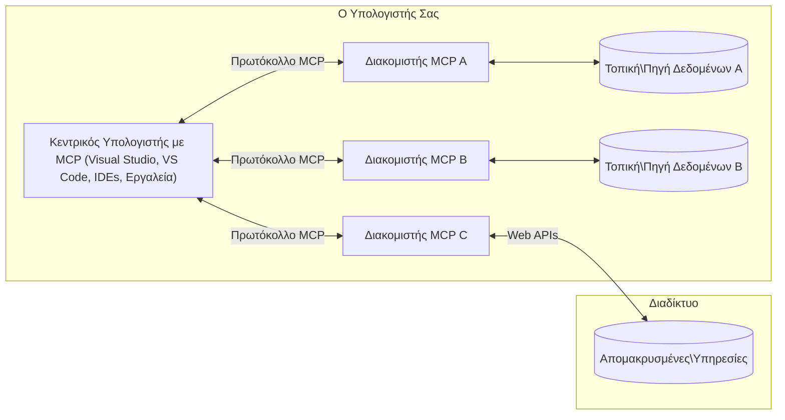

# Βασικές Έννοιες MCP: Κατακτώντας το Πρωτόκολλο Πλαισίου Μοντέλου για Ενσωμάτωση AI

[](https://youtu.be/earDzWGtE84)

_(Κάντε κλικ στην εικόνα παραπάνω για να δείτε το βίντεο αυτού του μαθήματος)_

Το [Πρωτόκολλο Πλαισίου Μοντέλου (MCP)](https://github.com/modelcontextprotocol) είναι ένα ισχυρό, τυποποιημένο πλαίσιο που βελτιστοποιεί την επικοινωνία μεταξύ Μεγάλων Γλωσσικών Μοντέλων (LLMs) και εξωτερικών εργαλείων, εφαρμογών και πηγών δεδομένων.  
Αυτός ο οδηγός θα σας καθοδηγήσει μέσα από τις βασικές έννοιες του MCP. Θα μάθετε για την αρχιτεκτονική πελάτη-διακομιστή, τα ουσιώδη συστατικά, τους μηχανισμούς επικοινωνίας και τις βέλτιστες πρακτικές υλοποίησης.

- **Ρητή Συγκατάθεση Χρήστη**: Όλη η πρόσβαση σε δεδομένα και οι ενέργειες απαιτούν ρητή έγκριση από τον χρήστη πριν την εκτέλεση. Οι χρήστες πρέπει να κατανοούν σαφώς ποια δεδομένα θα προσπελαστούν και ποιες ενέργειες θα εκτελεστούν, με λεπτομερή έλεγχο των αδειών και εξουσιοδοτήσεων.

- **Προστασία Απορρήτου Δεδομένων**: Τα δεδομένα χρήστη αποκαλύπτονται μόνο με ρητή συγκατάθεση και πρέπει να προστατεύονται από ισχυρούς ελέγχους πρόσβασης καθ' όλη τη διάρκεια της αλληλεπίδρασης. Οι υλοποιήσεις πρέπει να αποτρέπουν μη εξουσιοδοτημένη αποστολή δεδομένων και να διατηρούν αυστηρά όρια απορρήτου.

- **Ασφάλεια Εκτέλεσης Εργαλείων**: Κάθε κλήση εργαλείου απαιτεί ρητή συγκατάθεση του χρήστη με σαφή κατανόηση της λειτουργίας, των παραμέτρων και της ενδεχόμενης επίδρασης του εργαλείου. Ισχυρά όρια ασφάλειας πρέπει να αποτρέπουν μη προγραμματισμένη, μη ασφαλή ή κακόβουλη εκτέλεση εργαλείων.

- **Ασφάλεια Επίπεδου Μεταφοράς**: Όλα τα κανάλια επικοινωνίας πρέπει να χρησιμοποιούν κατάλληλους μηχανισμούς κρυπτογράφησης και ταυτοποίησης. Οι απομακρυσμένες συνδέσεις πρέπει να υλοποιούν ασφαλή πρωτόκολλα μεταφοράς και σωστή διαχείριση διαπιστευτηρίων.

#### Οδηγίες Υλοποίησης:

- **Διαχείριση Αδειών**: Υλοποιήστε συστήματα λεπτομερούς διαχείρισης αδειών που επιτρέπουν στους χρήστες να ελέγχουν ποιους διακομιστές, εργαλεία και πόρους μπορούν να προσπελάσουν.  
- **Ταυτοποίηση & Εξουσιοδότηση**: Χρησιμοποιήστε ασφαλείς μεθόδους ταυτοποίησης (OAuth, API keys) με σωστή διαχείριση και λήξη διακριτικών.  
- **Επικύρωση Εισόδου**: Επικυρώστε όλες τις παραμέτρους και τις εισροές δεδομένων σύμφωνα με ορισμένα σχήματα για να αποτρέψετε επιθέσεις ένεσης.  
- **Καταγραφή Επιθεώρησης**: Διατηρήστε εκτενή αρχεία όλων των λειτουργιών για παρακολούθηση ασφαλείας και συμμόρφωση.  

## Επισκόπηση

Αυτό το μάθημα εξερευνά τη βασική αρχιτεκτονική και τα συστατικά που απαρτίζουν το οικοσύστημα του Πρωτοκόλλου Πλαισίου Μοντέλου (MCP). Θα μάθετε για την αρχιτεκτονική πελάτη-διακομιστή, τα βασικά στοιχεία και τους μηχανισμούς επικοινωνίας που υποστηρίζουν τις αλληλεπιδράσεις MCP.

## Κύριοι Στόχοι Μάθησης

Μέχρι το τέλος αυτού του μαθήματος, θα:

- Κατανοείτε την αρχιτεκτονική πελάτη-διακομιστή MCP.  
- Αναγνωρίζετε τους ρόλους και τις ευθύνες των Φιλοξενώντων, Πελατών και Διακομιστών.  
- Αναλύετε τα βασικά χαρακτηριστικά που καθιστούν το MCP μια ευέλικτη στιβάδα ενσωμάτωσης.  
- Μαθαίνετε πώς ρέει η πληροφορία μέσα στο οικοσύστημα MCP.  
- Αποκτάτε πρακτικές γνώσεις μέσα από παραδείγματα κώδικα σε .NET, Java, Python και JavaScript.  

## Αρχιτεκτονική MCP: Μια Πιο Βαθιά Ματιά

Το οικοσύστημα MCP βασίζεται σε ένα μοντέλο πελάτη-διακομιστή. Αυτή η αρθρωτή δομή επιτρέπει στις εφαρμογές AI να αλληλεπιδρούν αποτελεσματικά με εργαλεία, βάσεις δεδομένων, APIs και συμφραζόμενους πόρους. Ας αναλύσουμε αυτήν την αρχιτεκτονική στα βασικά της συστατικά.

Στον πυρήνα του, το MCP ακολουθεί μια αρχιτεκτονική πελάτη-διακομιστή όπου μια εφαρμογή φιλοξενίας μπορεί να συνδεθεί με πολλαπλούς διακομιστές:


- **MCP Hosts**: Προγράμματα όπως το VSCode, Claude Desktop, IDEs ή εργαλεία AI που θέλουν να έχουν πρόσβαση σε δεδομένα μέσω MCP  
- **MCP Clients**: Πελάτες πρωτοκόλλου που διατηρούν 1:1 συνδέσεις με διακομιστές  
- **MCP Servers**: Ελαφριά προγράμματα που εκθέτουν συγκεκριμένες λειτουργίες μέσω του τυποποιημένου Πρωτοκόλλου Πλαισίου Μοντέλου  
- **Τοπικές Πηγές Δεδομένων**: Αρχεία, βάσεις δεδομένων και υπηρεσίες του υπολογιστή σας που οι MCP servers μπορούν να προσπελάσουν με ασφάλεια  
- **Απομακρυσμένες Υπηρεσίες**: Εξωτερικά συστήματα διαθέσιμα μέσω διαδικτύου με τα οποία οι MCP servers μπορούν να συνδεθούν μέσω APIs.

Το Πρωτόκολλο MCP είναι ένα εξελισσόμενο πρότυπο που χρησιμοποιεί ημερολογιακή εκδοχή (μορφή YYYY-MM-DD). Η τρέχουσα έκδοση πρωτοκόλλου είναι **2025-11-25**. Μπορείτε να δείτε τις πιο πρόσφατες ενημερώσεις στην [τεχνική προδιαγραφή](https://modelcontextprotocol.io/specification/2025-11-25/)

### 1. Φιλοξενούντες (Hosts)

Στο Πρωτόκολλο Πλαισίου Μοντέλου (MCP), οι **Hosts** είναι εφαρμογές AI που λειτουργούν ως η κύρια διεπαφή μέσω της οποίας οι χρήστες αλληλεπιδρούν με το πρωτόκολλο. Οι Hosts συντονίζουν και διαχειρίζονται τις συνδέσεις με πολλούς MCP servers δημιουργώντας αφιερωμένους MCP πελάτες για κάθε σύνδεση server. Παραδείγματα Hosts περιλαμβάνουν:

- **Εφαρμογές AI**: Claude Desktop, Visual Studio Code, Claude Code  
- **Περιβάλλοντα Ανάπτυξης**: IDEs και επεξεργαστές κώδικα με ενσωμάτωση MCP  
- **Προσαρμοσμένες Εφαρμογές**: Ειδικά δημιουργημένοι πράκτορες και εργαλεία AI

Οι **Hosts** είναι εφαρμογές που συντονίζουν τις αλληλεπιδράσεις με μοντέλα AI. Αυτοί:

- **Ορχηστρώνουν Μοντέλα AI**: Εκτελούν ή αλληλεπιδρούν με LLMs για τη δημιουργία απαντήσεων και το συντονισμό ροών εργασίας AI  
- **Διαχειρίζονται Συνδέσεις Πελατών**: Δημιουργούν και διατηρούν έναν MCP πελάτη ανά σύνδεση MCP server  
- **Ελέγχουν το UI**: Διαχειρίζονται τη ροή της συνομιλίας, τις αλληλεπιδράσεις χρήστη και την παρουσίαση απαντήσεων  
- **Επιβάλλουν Ασφάλεια**: Ελέγχουν δικαιώματα, περιορισμούς ασφαλείας και ταυτοποίηση  
- **Διαχειρίζονται τη Συγκατάθεση του Χρήστη**: Διαχειρίζονται την έγκριση χρήστη για κοινή χρήση δεδομένων και εκτέλεση εργαλείων  

### 2. Πελάτες (Clients)

Οι **Clients** είναι ουσιώδη συστατικά που διατηρούν αποκλειστικές μονοσήμαντες συνδέσεις μεταξύ Hosts και MCP servers. Κάθε MCP client δημιουργείται από τον Host για να συνδεθεί με έναν συγκεκριμένο MCP διακομιστή, εξασφαλίζοντας οργανωμένα και ασφαλή κανάλια επικοινωνίας. Πολλαπλοί πελάτες επιτρέπουν στους Hosts να συνδέονται ταυτόχρονα με πολλούς servers.

Οι **Clients** είναι στοιχεία σύνδεσης μέσα στην εφαρμογή φιλοξενίας. Αυτοί:

- **Επικοινωνία Πρωτοκόλλου**: Στέλνουν αιτήματα JSON-RPC 2.0 προς τους διακομιστές με προτροπές και οδηγίες  
- **Διαπραγμάτευση Δυνατοτήτων**: Διαπραγματεύονται τα υποστηριζόμενα χαρακτηριστικά και εκδόσεις πρωτοκόλλου με τους διακομιστές κατά την αρχικοποίηση  
- **Εκτέλεση Εργαλείων**: Διαχειρίζονται αιτήματα εκτέλεσης εργαλείων από μοντέλα και επεξεργάζονται τις απαντήσεις  
- **Ενημερώσεις σε Πραγματικό Χρόνο**: Διαχειρίζονται ειδοποιήσεις και ενημερώσεις real-time από διακομιστές  
- **Επεξεργασία Απαντήσεων**: Επεξεργάζονται και μορφοποιούν τις απαντήσεις των διακομιστών για εμφάνιση στους χρήστες  

### 3. Διακομιστές (Servers)

Οι **Servers** είναι προγράμματα που παρέχουν πλαίσιο, εργαλεία και δυνατότητες στους MCP clients. Μπορούν να εκτελούνται τοπικά (στον ίδιο υπολογιστή με τον Host) ή απομακρυσμένα (σε εξωτερικές πλατφόρμες) και είναι υπεύθυνοι για τη διαχείριση αιτημάτων πελατών και την παροχή δομημένων απαντήσεων. Οι servers εκθέτουν συγκεκριμένη λειτουργικότητα μέσω του τυποποιημένου Πρωτοκόλλου Πλαισίου Μοντέλου.

Οι **Servers** είναι υπηρεσίες που παρέχουν πλαίσιο και δυνατότητες. Αυτοί:

- **Καταχώριση Χαρακτηριστικών**: Καταχωρούν και εκθέτουν διαθέσιμες προϊοντικές λειτουργίες (πόρους, προτροπές, εργαλεία) στους πελάτες  
- **Επεξεργασία Αιτημάτων**: Λαμβάνουν και εκτελούν κλήσεις εργαλείων, αιτήματα πόρων και προτροπών από πελάτες  
- **Παροχή Πλαισίου**: Παρέχουν συμφραζόμενες πληροφορίες και δεδομένα για την ενίσχυση των απαντήσεων μοντέλου  
- **Διαχείριση Κατάστασης**: Διατηρούν την κατάσταση συνεδρίας και χειρίζονται αλληλεπιδράσεις με κατάσταση όπου απαιτείται  
- **Ειδοποιήσεις σε Πραγματικό Χρόνο**: Στέλνουν ειδοποιήσεις για αλλαγές δυνατοτήτων και ενημερώσεις σε συνδεδεμένους πελάτες  

Οι διακομιστές μπορούν να υλοποιηθούν από οποιονδήποτε για να επεκτείνουν τις δυνατότητες μοντέλων με εξειδικευμένη λειτουργικότητα, και υποστηρίζουν τόσο τοπική όσο και απομακρυσμένη ανάπτυξη.

### 4. Πρωτόγονα Διακομιστή (Server Primitives)

Οι servers στο Πρωτόκολλο Πλαισίου Μοντέλου παρέχουν τρία βασικά **πρωτογενή στοιχεία** που ορίζουν τα θεμελιώδη δομικά στοιχεία για πλούσιες αλληλεπιδράσεις μεταξύ πελατών, hosts και γλωσσικών μοντέλων. Αυτά τα πρωτόγονα καθορίζουν τους τύπους συμφραζόμενης πληροφορίας και δράσεων που είναι διαθέσιμες μέσω του πρωτοκόλλου.

Οι MCP servers μπορούν να εκθέτουν οποιονδήποτε συνδυασμό των παρακάτω τριών βασικών πρωτογενών:

#### Πόροι (Resources) 

Οι **Πόροι** είναι πηγές δεδομένων που παρέχουν συμφραζόμενη πληροφορία στις εφαρμογές AI. Αντιπροσωπεύουν στατικό ή δυναμικό περιεχόμενο που μπορεί να ενισχύσει την κατανόηση του μοντέλου και τη λήψη αποφάσεων:

- **Συμφραζόμενα Δεδομένα**: Δομημένη πληροφορία και πλαίσιο για κατανάλωση από το μοντέλο AI  
- **Βάσεις Γνώσης**: Αρχεία εγγράφων, άρθρα, εγχειρίδια και επιστημονικά κείμενα  
- **Τοπικές Πηγές Δεδομένων**: Αρχεία, βάσεις δεδομένων και τοπικές συστημικές πληροφορίες  
- **Εξωτερικά Δεδομένα**: Απαντήσεις API, διαδικτυακές υπηρεσίες και δεδομένα απομακρυσμένων συστημάτων  
- **Δυναμικό Περιεχόμενο**: Δεδομένα σε πραγματικό χρόνο που ενημερώνονται βάσει εξωτερικών συνθηκών

Οι Πόροι ταυτοποιούνται μέσω URI και υποστηρίζουν αναζήτηση μέσω των μεθόδων `resources/list` και ανάκτηση με `resources/read`:

```text
file://documents/project-spec.md
database://production/users/schema
api://weather/current
```
  
#### Προτροπές (Prompts)

Οι **Προτροπές** είναι επαναχρησιμοποιούμενα πρότυπα που βοηθούν στη δομή των αλληλεπιδράσεων με γλωσσικά μοντέλα. Παρέχουν τυποποιημένα πρότυπα αλληλεπίδρασης και ροές εργασίας με πρότυπα:

- **Αλληλεπιδράσεις Βασισμένες σε Πρότυπα**: Προ-διαμορφωμένα μηνύματα και έναρξη συνομιλιών  
- **Πρότυπα Ροής Εργασίας**: Τυποποιημένες ακολουθίες για κοινές εργασίες και αλληλεπιδράσεις  
- **Παραδείγματα Λίγων Λήψεων**: Πρότυπα βασισμένα σε παραδείγματα για καθοδήγηση μοντέλου  
- **Συστημικές Προτροπές**: Θεμελιώδεις προτροπές που ορίζουν τη συμπεριφορά και το πλαίσιο του μοντέλου  
- **Δυναμικά Πρότυπα**: Παραμετροποιημένες προτροπές που προσαρμόζονται σε συγκεκριμένα συμφραζόμενα

Οι Προτροπές υποστηρίζουν υποκατάσταση μεταβλητών και μπορούν να ανακαλυφθούν μέσω `prompts/list` και να ανακτηθούν με `prompts/get`:

```markdown
Generate a {{task_type}} for {{product}} targeting {{audience}} with the following requirements: {{requirements}}
```
  
#### Εργαλεία (Tools)

Τα **Εργαλεία** είναι εκτελέσιμες λειτουργίες τις οποίες τα μοντέλα AI μπορούν να καλέσουν για να εκτελέσουν συγκεκριμένες ενέργειες. Αντιπροσωπεύουν τα "ρήματα" του οικοσυστήματος MCP, επιτρέποντας στα μοντέλα να αλληλεπιδρούν με εξωτερικά συστήματα:

- **Εκτελέσιμες Λειτουργίες**: Διακριτές ενέργειες που τα μοντέλα μπορούν να καλέσουν με συγκεκριμένες παραμέτρους  
- **Ενσωμάτωση Εξωτερικών Συστημάτων**: Κλήσεις API, ερωτήματα βάσεων δεδομένων, λειτουργίες αρχείων, υπολογισμοί  
- **Μοναδική Ταυτότητα**: Κάθε εργαλείο έχει διακριτό όνομα, περιγραφή και σχήμα παραμέτρων  
- **Δομημένη Εισροή/Εκροή**: Τα εργαλεία δέχονται επικυρωμένες παραμέτρους και επιστρέφουν δομημένες, τυποποιημένες απαντήσεις  
- **Δυνατότητες Ενεργειών**: Επιτρέπουν στα μοντέλα να εκτελούν πραγματικές ενέργειες και να ανακτούν ζωντανά δεδομένα

Τα εργαλεία ορίζονται με JSON Schema για επικύρωση παραμέτρων και ανακαλύπτονται μέσω `tools/list` και εκτελούνται με `tools/call`. Τα εργαλεία μπορούν επίσης να περιλαμβάνουν **εικόνες** ως πρόσθετα μεταδεδομένα για καλύτερη παρουσίαση στο UI.

**Σημειώσεις Εργαλείων**: Τα εργαλεία υποστηρίζουν συμπεριφορικές σημειώσεις (π.χ. `readOnlyHint`, `destructiveHint`) που περιγράφουν αν ένα εργαλείο είναι μόνο για ανάγνωση ή καταστροφικό, βοηθώντας τους πελάτες να λαμβάνουν ενημερωμένες αποφάσεις σχετικά με την εκτέλεση εργαλείων.

Παράδειγμα ορισμού εργαλείου:

```typescript
server.tool(
  "search_products", 
  {
    query: z.string().describe("Search query for products"),
    category: z.string().optional().describe("Product category filter"),
    max_results: z.number().default(10).describe("Maximum results to return")
  }, 
  async (params) => {
    // Εκτέλεση αναζήτησης και επιστροφή δομημένων αποτελεσμάτων
    return await productService.search(params);
  }
);
```
  
## Πρωτόγονα Πελάτη (Client Primitives)

Στο Πρωτόκολλο Πλαισίου Μοντέλου (MCP), οι **πελάτες** μπορούν να εκθέτουν πρωτόγονα που επιτρέπουν στους διακομιστές να ζητούν επιπλέον δυνατότητες από την εφαρμογή φιλοξενίας. Αυτά τα πρωτόγονα πελάτη επιτρέπουν πλουσιότερες, πιο διαδραστικές υλοποιήσεις διακομιστών που μπορούν να προσπελάσουν δυνατότητες μοντέλου AI και αλληλεπιδράσεις χρήστη.

### Δειγματοληψία (Sampling)

Η **δειγματοληψία** επιτρέπει στους διακομιστές να ζητούν συμπληρώσεις γλωσσικού μοντέλου από την εφαρμογή AI του πελάτη. Αυτό το πρωτόγονο δίνει τη δυνατότητα στους διακομιστές να προσπελάζουν δυνατότητες LLM χωρίς να ενσωματώνουν τις δικές τους εξαρτήσεις μοντέλου:

- **Ανεξάρτητη Πρόσβαση στο Μοντέλο**: Οι διακομιστές μπορούν να ζητούν συμπληρώσεις χωρίς να συμπεριλαμβάνουν SDKs LLM ή να διαχειρίζονται πρόσβαση μοντέλου  
- **AI με Εκκίνηση από Διακομιστή**: Επιτρέπει στους διακομιστές να παράγουν αυτόνομα περιεχόμενο χρησιμοποιώντας το μοντέλο AI του πελάτη  
- **Αναδρομικές Αλληλεπιδράσεις LLM**: Υποστηρίζει σύνθετα σενάρια όπου οι διακομιστές χρειάζονται βοήθεια AI για επεξεργασία  
- **Δημιουργία Δυναμικού Περιεχομένου**: Επιτρέπει στους διακομιστές να δημιουργούν συμφραζόμενες απαντήσεις χρησιμοποιώντας το μοντέλο φιλοξενίας  
- **Υποστήριξη Κλήσης Εργαλείων**: Οι διακομιστές μπορούν να συμπεριλαμβάνουν παραμέτρους `tools` και `toolChoice` για να επιτρέψουν στο μοντέλο πελάτη να καλεί εργαλεία κατά τη δειγματοληψία

Η δειγματοληψία ξεκινά μέσω της μεθόδου `sampling/complete`, όπου οι διακομιστές στέλνουν αιτήματα συμπλήρωσης στους πελάτες.

### Ρίζες (Roots)

Οι **Ρίζες** παρέχουν έναν τυποποιημένο τρόπο για τους πελάτες να εκθέτουν όρια συστήματος αρχείων στους διακομιστές, βοηθώντας τους να κατανοήσουν σε ποιους καταλόγους και αρχεία έχουν πρόσβαση:

- **Όρια Συστήματος Αρχείων**: Ορίζουν τα όρια εντός των οποίων μπορούν να λειτουργούν οι διακομιστές στο σύστημα αρχείων  
- **Έλεγχος Πρόσβασης**: Βοηθούν τους διακομιστές να κατανοήσουν σε ποιους φακέλους και αρχεία έχουν δικαίωμα πρόσβασης  
- **Δυναμικές Ενημερώσεις**: Οι πελάτες μπορούν να ειδοποιούν τους διακομιστές όταν αλλάζει η λίστα ριζών  
- **Ταυτοποίηση με URI**: Οι ρίζες χρησιμοποιούν URI τύπου `file://` για να ταυτοποιούν προσβάσιμους φακέλους και αρχεία

Οι ρίζες ανιχνεύονται μέσω της μεθόδου `roots/list`, με τους πελάτες να στέλνουν ειδοποιήσεις `notifications/roots/list_changed` όταν οι ρίζες αλλάζουν.

### Ζήτηση Πληροφορίας (Elicitation)

Η **Ζήτηση Πληροφορίας** επιτρέπει στους διακομιστές να ζητούν επιπλέον πληροφορίες ή επιβεβαίωση από τους χρήστες μέσω της διεπαφής πελάτη:

- **Αιτήματα Εισόδου Χρήστη**: Οι διακομιστές μπορούν να ζητούν επιπλέον στοιχεία όταν χρειάζεται για εκτέλεση εργαλείου  
- **Διάλογοι Επιβεβαίωσης**: Ζητούν έγκριση χρήστη για ευαίσθητες ή σημαντικές ενέργειες  
- **Διαδραστικές Ροές Εργασίας**: Επιτρέπουν στους διακομιστές να δημιουργούν βήμα-βήμα αλληλεπιδράσεις με τον χρήστη  
- **Δυναμική Συλλογή Παραμέτρων**: Συλλογή ελλιπών ή προαιρετικών παραμέτρων κατά την εκτέλεση εργαλείου

Τα αιτήματα ζήτησης γίνονται με τη μέθοδο `elicitation/request` για τη συλλογή εισόδου του χρήστη μέσω της διεπαφής πελάτη.

**Ζήτηση σε Κατάσταση URL**: Οι διακομιστές μπορούν επίσης να ζητούν αλληλεπιδράσεις χρήστη βασισμένες σε URL, οδηγώντας τους χρήστες σε εξωτερικές ιστοσελίδες για αυθεντικοποίηση, επιβεβαίωση ή εισαγωγή δεδομένων.

### Καταγραφή (Logging)

Η **Καταγραφή** επιτρέπει στους διακομιστές να στέλνουν δομημένα μηνύματα καταγραφής προς τους πελάτες για αποσφαλμάτωση, παρακολούθηση και ορατότητα λειτουργιών:

- **Υποστήριξη Αποσφαλμάτωσης**: Επιτρέπει στους διακομιστές να παρέχουν λεπτομερή αρχεία εκτέλεσης για αντιμετώπιση προβλημάτων  
- **Παρακολούθηση Λειτουργίας**: Στέλνει ενημερώσεις κατάστασης και μετρήσεις απόδοσης προς τους πελάτες  
- **Αναφορές Σφαλμάτων**: Παρέχει λεπτομερή περιεχόμενο σφαλμάτων και διαγνωστικές πληροφορίες  
- **Αρχεία Επιθεώρησης**: Δημιουργεί εκτενή αρχεία λειτουργιών και αποφάσεων διακομιστή

Τα μηνύματα καταγραφής στέλνονται στους πελάτες για διαφάνεια στη λειτουργία των διακομιστών και διευκόλυνση της αποσφαλμάτωσης.

## Ροή Πληροφορίας στο MCP

Το Πρωτόκολλο Πλαισίου Μοντέλου (MCP) ορίζει μια δομημένη ροή πληροφορίας μεταξύ φιλοξενώντων, πελατών, διακομιστών και μοντέλων. Η κατανόηση αυτής της ροής βοηθά να γίνει σαφές πώς επεξεργάζονται τα αιτήματα των χρηστών και πώς ενσωματώνονται εξωτερικά εργαλεία και δεδομένα στις απαντήσεις των μοντέλων.
- **Ο κεντρικός υπολογιστής ξεκινά τη σύνδεση**  
  Η εφαρμογή υποδοχής (όπως ένα IDE ή περιβάλλον συνομιλίας) δημιουργεί σύνδεση με έναν διακομιστή MCP, συνήθως μέσω STDIO, WebSocket ή άλλου υποστηριζόμενου μέσου μεταφοράς.

- **Διαπραγμάτευση Δυνατοτήτων**  
  Ο πελάτης (ενσωματωμένος στον κεντρικό υπολογιστή) και ο διακομιστής ανταλλάσσουν πληροφορίες σχετικά με τις υποστηριζόμενες λειτουργίες, εργαλεία, πόρους και εκδόσεις πρωτοκόλλου. Αυτό διασφαλίζει ότι και οι δύο πλευρές κατανοούν ποιες δυνατότητες είναι διαθέσιμες για τη συνεδρία.

- **Αίτημα Χρήστη**  
  Ο χρήστης αλληλεπιδρά με τον κεντρικό υπολογιστή (π.χ. εισάγει μια εντολή ή προτροπή). Ο κεντρικός υπολογιστής συλλέγει αυτή την είσοδο και την περνάει στον πελάτη για επεξεργασία.

- **Χρήση Πόρων ή Εργαλείων**  
  - Ο πελάτης μπορεί να ζητήσει πρόσθετο πλαίσιο ή πόρους από τον διακομιστή (όπως αρχεία, εγγραφές βάσης δεδομένων ή άρθρα βάσης γνώσεων) για να εμπλουτίσει την κατανόηση του μοντέλου.  
  - Εάν το μοντέλο διαπιστώσει ότι απαιτείται ένα εργαλείο (π.χ. για ανάκτηση δεδομένων, εκτέλεση υπολογισμού ή κλήση API), ο πελάτης στέλνει αίτημα κλήσης εργαλείου στον διακομιστή, καθορίζοντας το όνομα και τις παραμέτρους του εργαλείου.

- **Εκτέλεση από τον Διακομιστή**  
  Ο διακομιστής λαμβάνει το αίτημα για τον πόρο ή το εργαλείο, εκτελεί τις απαραίτητες ενέργειες (όπως την εκτέλεση μιας λειτουργίας, ερώτημα βάσης δεδομένων ή ανάκτηση αρχείου) και επιστρέφει τα αποτελέσματα στον πελάτη σε δομημένη μορφή.

- **Δημιουργία Απάντησης**  
  Ο πελάτης ενσωματώνει τις απαντήσεις του διακομιστή (δεδομένα πόρων, εξόδους εργαλείων κτλ.) στην τρέχουσα αλληλεπίδραση με το μοντέλο. Το μοντέλο χρησιμοποιεί αυτές τις πληροφορίες για να παράγει μια ολοκληρωμένη και συμφραζόμενη απάντηση.

- **Παρουσίαση Αποτελέσματος**  
  Ο κεντρικός υπολογιστής λαμβάνει την τελική έξοδο από τον πελάτη και την παρουσιάζει στον χρήστη, συχνά συμπεριλαμβάνοντας τόσο το παραγόμενο κείμενο του μοντέλου όσο και τα αποτελέσματα από εκτελέσεις εργαλείων ή αναζητήσεις πόρων.

Αυτή η ροή επιτρέπει στο MCP να υποστηρίζει προηγμένες, διαδραστικές και ευαίσθητες στο πλαίσιο εφαρμογές AI συνδέοντας απρόσκοπτα μοντέλα με εξωτερικά εργαλεία και πηγές δεδομένων.

## Αρχιτεκτονική & Επίπεδα Πρωτοκόλλου

Το MCP αποτελείται από δύο ξεχωριστά αρχιτεκτονικά επίπεδα που συνεργάζονται για να παρέχουν ένα πλήρες πλαίσιο επικοινωνίας:

### Επίπεδο Δεδομένων

Το **Επίπεδο Δεδομένων** υλοποιεί τον βασικό πρωτόκολλο MCP χρησιμοποιώντας **JSON-RPC 2.0** ως θεμέλιο. Αυτό το επίπεδο ορίζει τη δομή των μηνυμάτων, τη σημασιολογία και τα πρότυπα αλληλεπίδρασης:

#### Βασικά Συστατικά:

- **Πρωτόκολλο JSON-RPC 2.0**: Όλη η επικοινωνία χρησιμοποιεί το τυποποιημένο μήνυμα JSON-RPC 2.0 για κλήσεις μεθόδων, απαντήσεις και ειδοποιήσεις  
- **Διαχείριση Κύκλου Ζωής**: Χειρίζεται την αρχικοποίηση σύνδεσης, τη διαπραγμάτευση δυνατοτήτων και τη λήξη συνεδρίας μεταξύ πελατών και διακομιστών  
- **Πρωτόγονα Διακομιστή**: Δυνατότητα παροχής βασικής λειτουργικότητας μέσω εργαλείων, πόρων και προτροπών  
- **Πρωτόγονα Πελάτη**: Δυνατότητα αιτήματος δειγματοληψίας από LLMs, προτροπής χρήστη και αποστολής μηνυμάτων καταγραφής  
- **Ειδοποιήσεις σε Πραγματικό Χρόνο**: Υποστηρίζει ασύγχρονες ειδοποιήσεις για δυναμικές ενημερώσεις χωρίς polling

#### Κύρια Χαρακτηριστικά:

- **Διαπραγμάτευση Έκδοσης Πρωτοκόλλου**: Χρησιμοποιεί χρονολογική έκδοση (YYYY-MM-DD) για διασφάλιση συμβατότητας  
- **Ανακάλυψη Δυνατοτήτων**: Οι πελάτες και διακομιστές ανταλλάσσουν πληροφορίες υποστηριζόμενων λειτουργιών κατά την αρχικοποίηση  
- **Κατάστατικές Συνεδρίες**: Διατηρεί την κατάσταση σύνδεσης σε πολλαπλές αλληλεπιδράσεις για συνέπεια πλαισίου

### Επίπεδο Μεταφοράς

Το **Επίπεδο Μεταφοράς** διαχειρίζεται τα κανάλια επικοινωνίας, την καδροποίηση μηνυμάτων και τον έλεγχο ταυτότητας μεταξύ των συμμετεχόντων MCP:

#### Υποστηριζόμενοι Μηχανισμοί Μεταφοράς:

1. **Μεταφορά STDIO**:  
   - Χρησιμοποιεί ροές εισόδου/εξόδου για άμεση επικοινωνία διεργασιών  
   - Βέλτιστη για τοπικές διεργασίες στο ίδιο μηχάνημα χωρίς δικτυακό φορτίο  
   - Συχνά χρησιμοποιείται για τοπικές υλοποιήσεις MCP διακομιστών

2. **Μεταφορά HTTP με Συνεχόμενη Ροή**:  
   - Χρησιμοποιεί HTTP POST για μηνύματα από πελάτη προς διακομιστή  
   - Προαιρετικά Server-Sent Events (SSE) για ροή από διακομιστή προς πελάτη  
   - Επιτρέπει απομακρυσμένη επικοινωνία διακομιστή μέσω δικτύων  
   - Υποστηρίζει τυπικό έλεγχο ταυτότητας HTTP (tokens bearer, κλειδιά API, προσαρμοσμένες κεφαλίδες)  
   - Το MCP συνιστά το OAuth για ασφαλή έλεγχο ταυτότητας με βάση tokens

#### Αφαίρεση Μεταφοράς:

Το επίπεδο μεταφοράς αφαιρεί τις λεπτομέρειες επικοινωνίας από το επίπεδο δεδομένων, επιτρέποντας το ίδιο φορμάτ μηνυμάτων JSON-RPC 2.0 σε όλους τους μηχανισμούς μεταφοράς. Αυτή η αφαίρεση επιτρέπει στα προγράμματα να εναλλάσσονται εύκολα μεταξύ τοπικών και απομακρυσμένων διακομιστών.

### Θέματα Ασφαλείας

Οι υλοποιήσεις MCP πρέπει να τηρούν κρίσιμες αρχές ασφάλειας για να εξασφαλίσουν ασφαλείς, αξιόπιστες και ασφαλείς αλληλεπιδράσεις σε όλη τη λειτουργία του πρωτοκόλλου:

- **Συναίνεση και Έλεγχος Χρήστη**: Οι χρήστες πρέπει να παρέχουν ρητή συναίνεση πριν την πρόσβαση σε δεδομένα ή την εκτέλεση ενεργειών. Πρέπει να έχουν σαφή έλεγχο για το ποια δεδομένα μοιράζονται και ποιες ενέργειες εξουσιοδοτούνται, υποστηριζόμενοι από εύχρηστες διεπαφές για επισκόπηση και έγκριση δραστηριοτήτων.

- **Ιδιωτικότητα Δεδομένων**: Τα δεδομένα του χρήστη θα πρέπει να εκτίθενται μόνο με ρητή συναίνεση και να προστατεύονται με κατάλληλους μηχανισμούς ελέγχου πρόσβασης. Οι υλοποιήσεις MCP πρέπει να αποτρέπουν μη εξουσιοδοτημένη διακίνηση δεδομένων και να διασφαλίζουν τη διατήρηση της ιδιωτικότητας κατά τη διάρκεια όλων των αλληλεπιδράσεων.

- **Ασφάλεια Εργαλείων**: Πριν την κλήση οποιουδήποτε εργαλείου απαιτείται ρητή συναίνεση χρήστη. Οι χρήστες πρέπει να κατανοούν τη λειτουργικότητα κάθε εργαλείου, και πρέπει να επιβάλλονται αυστηρά όρια ασφαλείας για την αποτροπή αναίτιας ή μη ασφαλούς εκτέλεσης εργαλείων.

Ακολουθώντας αυτές τις αρχές ασφάλειας, το MCP διασφαλίζει την εμπιστοσύνη του χρήστη, την προστασία της ιδιωτικότητας και την ασφάλεια σε όλους τους διαχειριζόμενους διαύλους ενώ ενισχύει τις ισχυρές ενσωματώσεις AI.

## Παραδείγματα Κώδικα: Βασικά Συστατικά

Παρακάτω παρουσιάζονται παραδείγματα κώδικα σε διάφορες δημοφιλείς γλώσσες προγραμματισμού που δείχνουν πώς να υλοποιηθούν βασικά στοιχεία MCP διακομιστή και εργαλεία.

### Παράδειγμα .NET: Δημιουργία Απλού Διακομιστή MCP με Εργαλεία

Εδώ είναι ένα πρακτικό παράδειγμα .NET που δείχνει πώς να υλοποιήσετε έναν απλό διακομιστή MCP με προσαρμοσμένα εργαλεία. Το παράδειγμα επιδεικνύει τον τρόπο ορισμού και καταγραφής εργαλείων, χειρισμό αιτημάτων και σύνδεση διακομιστή μέσω του πρωτοκόλλου Model Context.

```csharp
using System;
using System.Threading.Tasks;
using ModelContextProtocol.Server;
using ModelContextProtocol.Server.Transport;
using ModelContextProtocol.Server.Tools;

public class WeatherServer
{
    public static async Task Main(string[] args)
    {
        // Create an MCP server
        var server = new McpServer(
            name: "Weather MCP Server",
            version: "1.0.0"
        );
        
        // Register our custom weather tool
        server.AddTool<string, WeatherData>("weatherTool", 
            description: "Gets current weather for a location",
            execute: async (location) => {
                // Call weather API (simplified)
                var weatherData = await GetWeatherDataAsync(location);
                return weatherData;
            });
        
        // Connect the server using stdio transport
        var transport = new StdioServerTransport();
        await server.ConnectAsync(transport);
        
        Console.WriteLine("Weather MCP Server started");
        
        // Keep the server running until process is terminated
        await Task.Delay(-1);
    }
    
    private static async Task<WeatherData> GetWeatherDataAsync(string location)
    {
        // This would normally call a weather API
        // Simplified for demonstration
        await Task.Delay(100); // Simulate API call
        return new WeatherData { 
            Temperature = 72.5,
            Conditions = "Sunny",
            Location = location
        };
    }
}

public class WeatherData
{
    public double Temperature { get; set; }
    public string Conditions { get; set; }
    public string Location { get; set; }
}
```

### Παράδειγμα Java: Συστατικά Διακομιστή MCP

Αυτό το παράδειγμα παρουσιάζει τον ίδιο διακομιστή MCP και καταγραφή εργαλείων όπως το παράδειγμα .NET παραπάνω, υλοποιημένο σε Java.

```java
import io.modelcontextprotocol.server.McpServer;
import io.modelcontextprotocol.server.McpToolDefinition;
import io.modelcontextprotocol.server.transport.StdioServerTransport;
import io.modelcontextprotocol.server.tool.ToolExecutionContext;
import io.modelcontextprotocol.server.tool.ToolResponse;

public class WeatherMcpServer {
    public static void main(String[] args) throws Exception {
        // Δημιουργήστε έναν διακομιστή MCP
        McpServer server = McpServer.builder()
            .name("Weather MCP Server")
            .version("1.0.0")
            .build();
            
        // Εγγραφή ενός εργαλείου καιρού
        server.registerTool(McpToolDefinition.builder("weatherTool")
            .description("Gets current weather for a location")
            .parameter("location", String.class)
            .execute((ToolExecutionContext ctx) -> {
                String location = ctx.getParameter("location", String.class);
                
                // Λήψη δεδομένων καιρού (απλοποιημένη)
                WeatherData data = getWeatherData(location);
                
                // Επιστροφή μορφοποιημένης απάντησης
                return ToolResponse.content(
                    String.format("Temperature: %.1f°F, Conditions: %s, Location: %s", 
                    data.getTemperature(), 
                    data.getConditions(), 
                    data.getLocation())
                );
            })
            .build());
        
        // Σύνδεση του διακομιστή χρησιμοποιώντας μεταφορά stdio
        try (StdioServerTransport transport = new StdioServerTransport()) {
            server.connect(transport);
            System.out.println("Weather MCP Server started");
            // Διατήρηση του διακομιστή σε λειτουργία μέχρι να τερματιστεί η διαδικασία
            Thread.currentThread().join();
        }
    }
    
    private static WeatherData getWeatherData(String location) {
        // Η υλοποίηση θα καλούσε ένα API καιρού
        // Απλοποιημένο για σκοπούς παραδείγματος
        return new WeatherData(72.5, "Sunny", location);
    }
}

class WeatherData {
    private double temperature;
    private String conditions;
    private String location;
    
    public WeatherData(double temperature, String conditions, String location) {
        this.temperature = temperature;
        this.conditions = conditions;
        this.location = location;
    }
    
    public double getTemperature() {
        return temperature;
    }
    
    public String getConditions() {
        return conditions;
    }
    
    public String getLocation() {
        return location;
    }
}
```

### Παράδειγμα Python: Κατασκευή Διακομιστή MCP

Αυτό το παράδειγμα χρησιμοποιεί fastmcp, οπότε παρακαλούμε να το εγκαταστήσετε πρώτα:

```python
pip install fastmcp
```
Παράδειγμα Κώδικα:

```python
#!/usr/bin/env python3
import asyncio
from fastmcp import FastMCP
from fastmcp.transports.stdio import serve_stdio

# Δημιουργία διακομιστή FastMCP
mcp = FastMCP(
    name="Weather MCP Server",
    version="1.0.0"
)

@mcp.tool()
def get_weather(location: str) -> dict:
    """Gets current weather for a location."""
    return {
        "temperature": 72.5,
        "conditions": "Sunny",
        "location": location
    }

# Εναλλακτική προσέγγιση χρησιμοποιώντας μια κλάση
class WeatherTools:
    @mcp.tool()
    def forecast(self, location: str, days: int = 1) -> dict:
        """Gets weather forecast for a location for the specified number of days."""
        return {
            "location": location,
            "forecast": [
                {"day": i+1, "temperature": 70 + i, "conditions": "Partly Cloudy"}
                for i in range(days)
            ]
        }

# Καταχώρηση εργαλείων κλάσης
weather_tools = WeatherTools()

# Εκκίνηση του διακομιστή
if __name__ == "__main__":
    asyncio.run(serve_stdio(mcp))
```

### Παράδειγμα JavaScript: Δημιουργία Διακομιστή MCP

Αυτό το παράδειγμα δείχνει τη δημιουργία διακομιστή MCP σε JavaScript και πώς να καταχωρήσετε δύο εργαλεία που σχετίζονται με τον καιρό.

```javascript
// Χρησιμοποιώντας το επίσημο SDK του Πρωτοκόλλου Συμφραζόμενου Μοντέλου
import { McpServer } from "@modelcontextprotocol/sdk/server/mcp.js";
import { StdioServerTransport } from "@modelcontextprotocol/sdk/server/stdio.js";
import { z } from "zod"; // Για την επικύρωση παραμέτρων

// Δημιουργία διακομιστή MCP
const server = new McpServer({
  name: "Weather MCP Server",
  version: "1.0.0"
});

// Ορισμός εργαλείου καιρού
server.tool(
  "weatherTool",
  {
    location: z.string().describe("The location to get weather for")
  },
  async ({ location }) => {
    // Αυτό κανονικά θα καλούσε ένα API καιρού
    // Απλοποιημένο για επίδειξη
    const weatherData = await getWeatherData(location);
    
    return {
      content: [
        { 
          type: "text", 
          text: `Temperature: ${weatherData.temperature}°F, Conditions: ${weatherData.conditions}, Location: ${weatherData.location}` 
        }
      ]
    };
  }
);

// Ορισμός εργαλείου πρόγνωσης
server.tool(
  "forecastTool",
  {
    location: z.string(),
    days: z.number().default(3).describe("Number of days for forecast")
  },
  async ({ location, days }) => {
    // Αυτό κανονικά θα καλούσε ένα API καιρού
    // Απλοποιημένο για επίδειξη
    const forecast = await getForecastData(location, days);
    
    return {
      content: [
        { 
          type: "text", 
          text: `${days}-day forecast for ${location}: ${JSON.stringify(forecast)}` 
        }
      ]
    };
  }
);

// Βοηθητικές συναρτήσεις
async function getWeatherData(location) {
  // Προσομοίωση κλήσης API
  return {
    temperature: 72.5,
    conditions: "Sunny",
    location: location
  };
}

async function getForecastData(location, days) {
  // Προσομοίωση κλήσης API
  return Array.from({ length: days }, (_, i) => ({
    day: i + 1,
    temperature: 70 + Math.floor(Math.random() * 10),
    conditions: i % 2 === 0 ? "Sunny" : "Partly Cloudy"
  }));
}

// Σύνδεση του διακομιστή χρησιμοποιώντας stdio μεταφορά
const transport = new StdioServerTransport();
server.connect(transport).catch(console.error);

console.log("Weather MCP Server started");
```

Αυτό το παράδειγμα JavaScript παρουσιάζει πώς να δημιουργήσετε έναν διακομιστή MCP που καταχωρεί εργαλεία καιρού και συνδέεται χρησιμοποιώντας μεταφορά stdio για να χειριστεί εισερχόμενα αιτήματα πελάτη.

## Ασφάλεια και Εξουσιοδότηση

Το MCP περιλαμβάνει αρκετές ενσωματωμένες έννοιες και μηχανισμούς για τη διαχείριση ασφάλειας και εξουσιοδότησης σε όλο το πρωτόκολλο:

1. **Έλεγχος Άδειας Εργαλείων**:  
  Οι πελάτες μπορούν να καθορίσουν ποια εργαλεία επιτρέπεται να χρησιμοποιεί ένα μοντέλο κατά τη διάρκεια μιας συνεδρίας. Αυτό διασφαλίζει ότι μόνο εργαλεία με ρητή εξουσιοδότηση είναι προσβάσιμα, μειώνοντας τον κίνδυνο ανεπιθύμητων ή μη ασφαλών ενεργειών. Οι άδειες μπορούν να ρυθμιστούν δυναμικά βάσει προτιμήσεων χρήστη, πολιτικών οργανισμού ή συμφραζομένων αλληλεπίδρασης.

2. **Έλεγχος Ταυτότητας**:  
  Οι διακομιστές μπορούν να απαιτούν έλεγχο ταυτότητας πριν παρέχουν πρόσβαση σε εργαλεία, πόρους ή ευαίσθητες λειτουργίες. Αυτό μπορεί να περιλαμβάνει κλειδιά API, tokens OAuth ή άλλα σχήματα ελέγχου ταυτότητας. Ο σωστός έλεγχος ταυτότητας εξασφαλίζει ότι μόνο αξιόπιστοι πελάτες και χρήστες μπορούν να ενεργοποιήσουν λειτουργίες διακομιστή.

3. **Επικύρωση**:  
  Η επικύρωση παραμέτρων εφαρμόζεται σε όλες τις κλήσεις εργαλείων. Κάθε εργαλείο ορίζει τους αναμενόμενους τύπους, μορφές και περιορισμούς για τις παραμέτρους του, και ο διακομιστής επικυρώνει τα εισερχόμενα αιτήματα αναλόγως. Αυτό αποτρέπει κακόβουλη ή δυσμορφική είσοδο από το να φτάσει στις υλοποιήσεις εργαλείων, διατηρώντας την ακεραιότητα των λειτουργιών.

4. **Περιορισμός Ροής (Rate Limiting)**:  
  Για να αποφευχθεί η κατάχρηση και να διασφαλιστεί δίκαιη χρήση των πόρων διακομιστή, οι διακομιστές MCP μπορούν να εφαρμόζουν περιορισμούς κλήσεων εργαλείων και πρόσβασης πόρων. Οι περιορισμοί μπορούν να ισχύουν ανά χρήστη, ανά συνεδρία ή καθολικά, και βοηθούν στην προστασία από επιθέσεις άρνησης υπηρεσίας ή υπερβολική κατανάλωση πόρων.

Συνδυάζοντας αυτούς τους μηχανισμούς, το MCP παρέχει ένα ασφαλές θεμέλιο για την ενσωμάτωση γλωσσικών μοντέλων με εξωτερικά εργαλεία και πηγές δεδομένων, δίνοντας παράλληλα σε χρήστες και προγραμματιστές λεπτομερή έλεγχο πρόσβασης και χρήσης.

## Μηνύματα Πρωτοκόλλου & Ροή Επικοινωνίας

Η επικοινωνία MCP χρησιμοποιεί δομημένα μηνύματα **JSON-RPC 2.0** για να διευκολύνει καθαρές και αξιόπιστες αλληλεπιδράσεις μεταξύ κεντρικών υπολογιστών, πελατών και διακομιστών. Το πρωτόκολλο ορίζει συγκεκριμένα πρότυπα μηνυμάτων για διαφορετικούς τύπους λειτουργιών:

### Κύριοι Τύποι Μηνυμάτων:

#### **Μηνύματα Αρχικοποίησης**
- **Αίτημα `initialize`**: Εγκαθιστά τη σύνδεση και διαπραγματεύεται έκδοση πρωτοκόλλου και δυνατότητες  
- **Απάντηση `initialize`**: Επιβεβαιώνει υποστηριζόμενες λειτουργίες και πληροφορίες διακομιστή  
- **`notifications/initialized`**: Υποδηλώνει ότι η αρχικοποίηση ολοκληρώθηκε και η συνεδρία είναι έτοιμη

#### **Μηνύματα Ανακάλυψης**
- **Αίτημα `tools/list`**: Ανακαλύπτει διαθέσιμα εργαλεία από τον διακομιστή  
- **Αίτημα `resources/list`**: Λίστα διαθέσιμων πόρων (πηγαίων δεδομένων)  
- **Αίτημα `prompts/list`**: Επιστρέφει διαθέσιμα πρότυπα προτροπών

#### **Μηνύματα Εκτέλεσης**  
- **Αίτημα `tools/call`**: Εκτελεί συγκεκριμένο εργαλείο με παραμέτρους  
- **Αίτημα `resources/read`**: Ανάκτηση περιεχομένου συγκεκριμένου πόρου  
- **Αίτημα `prompts/get`**: Λήψη προτύπου προτροπής με προαιρετικές παραμέτρους

#### **Μηνύματα από Πελάτη**
- **Αίτημα `sampling/complete`**: Ο διακομιστής ζητά ολοκλήρωση LLM από πελάτη  
- **`elicitation/request`**: Ο διακομιστής ζητά είσοδο χρήστη μέσω της διεπαφής πελάτη  
- **Μηνύματα Καταγραφής**: Ο διακομιστής στέλνει δομημένα μηνύματα καταγραφής στον πελάτη

#### **Ειδοποιήσεις**
- **`notifications/tools/list_changed`**: Ο διακομιστής ενημερώνει για αλλαγές στα εργαλεία  
- **`notifications/resources/list_changed`**: Ο διακομιστής ενημερώνει για αλλαγές στους πόρους  
- **`notifications/prompts/list_changed`**: Ο διακομιστής ενημερώνει για αλλαγές στις προτροπές

### Δομή Μηνυμάτων:

Όλα τα μηνύματα MCP ακολουθούν το φορμάτ JSON-RPC 2.0 με:  
- **Μηνύματα Αιτήματος**: Περιλαμβάνουν `id`, `method` και προαιρετικά `params`  
- **Μηνύματα Απάντησης**: Περιλαμβάνουν `id` και είτε `result` είτε `error`  
- **Μηνύματα Ειδοποίησης**: Περιλαμβάνουν `method` και προαιρετικά `params` (χωρίς `id` ή αναμενόμενη απάντηση)

Αυτή η δομημένη επικοινωνία εξασφαλίζει αξιόπιστες, ιχνηλάσιμες και επεκτάσιμες αλληλεπιδράσεις που υποστηρίζουν προηγμένα σενάρια όπως ενημερώσεις σε πραγματικό χρόνο, αλυσίδωση εργαλείων και στιβαρό χειρισμό σφαλμάτων.

### Εργασίες (Πειραματικό)

Οι **Εργασίες** είναι πειραματικό χαρακτηριστικό που προσφέρει ανθεκτικά περιτυλίγματα εκτέλεσης για καθυστερημένη ανάκτηση αποτελεσμάτων και παρακολούθηση κατάστασης για αιτήματα MCP:

- **Μεγάλες σε Διάρκεια Λειτουργίες**: Παρακολούθηση απαιτητικών υπολογισμών, αυτοματοποίηση ροής εργασίας και ομαδική επεξεργασία  
- **Καθυστερημένα Αποτελέσματα**: Polling για κατάσταση εργασίας και ανάκτηση αποτελεσμάτων όταν ολοκληρωθούν οι λειτουργίες  
- **Παρακολούθηση Κατάστασης**: Εποπτεία προόδου εργασίας μέσω καθορισμένων καταστάσεων κύκλου ζωής  
- **Πολυβηματικές Λειτουργίες**: Υποστήριξη σύνθετων ροών εργασιών που εκτείνονται σε πολλαπλές αλληλεπιδράσεις

Οι εργασίες τυλίγουν τυπικά αιτήματα MCP για να επιτρέψουν ασύγχρονα πρότυπα εκτέλεσης για λειτουργίες που δεν μπορούν να ολοκληρωθούν άμεσα.

## Βασικά Σημεία

- **Αρχιτεκτονική**: Το MCP χρησιμοποιεί αρχιτεκτονική πελάτη-διακομιστή όπου οι κεντρικοί υπολογιστές διαχειρίζονται πολλαπλές συνδέσεις πελατών προς διακομιστές  
- **Συμμετέχοντες**: Το οικοσύστημα περιλαμβάνει κεντρικούς υπολογιστές (AI εφαρμογές), πελάτες (συνδέσμους πρωτοκόλλου), και διακομιστές (παρόχους λειτουργιών)  
- **Μηχανισμοί Μεταφοράς**: Η επικοινωνία υποστηρίζει STDIO (τοπική) και Streamable HTTP με προαιρετικό SSE (απομακρυσμένη)  
- **Βασικά Πρωτόγονα**: Οι διακομιστές εκθέτουν εργαλεία (εκτελέσιμες λειτουργίες), πόρους (πηγές δεδομένων) και προτροπές (πρότυπα)  
- **Πρωτόγονα Πελάτη**: Οι διακομιστές μπορούν να ζητούν δειγματοληψία (ολοκληρώσεις LLM με υποστήριξη κλήσης εργαλείων), προτροπή (είσοδο χρήστη συμπεριλαμβανομένου του URL mode), ρίζες (όρια συστήματος αρχείων) και καταγραφή από τους πελάτες  
- **Πειραματικά Χαρακτηριστικά**: Οι εργασίες προσφέρουν ανθεκτικά περιτυλίγματα εκτέλεσης για μακροχρόνιες λειτουργίες  
- **Θεμέλιο Πρωτοκόλλου**: Βασισμένο σε JSON-RPC 2.0 με ημερομηνιακή έκδοση (τρέχουσα: 2025-11-25)  
- **Δυνατότητες σε Πραγματικό Χρόνο**: Υποστηρίζει ειδοποιήσεις για δυναμικές ενημερώσεις και συγχρονισμό σε πραγματικό χρόνο  
- **Πρώτα η Ασφάλεια**: Ρητή συναίνεση χρήστη, προστασία ιδιωτικότητας και ασφαλής μεταφορά είναι βασικές απαιτήσεις

## Άσκηση

Σχεδιάστε ένα απλό εργαλείο MCP που θα ήταν χρήσιμο στον τομέα σας. Ορίστε:  
1. Πώς θα ονομάζεται το εργαλείο  
2. Ποιες παραμέτρους θα δέχεται  
3. Τι έξοδο θα επιστρέφει  
4. Πώς ένα μοντέλο θα μπορούσε να χρησιμοποιήσει αυτό το εργαλείο για να επιλύσει προβλήματα χρήστη

---

## Τι ακολουθεί

Επόμενο: [Κεφάλαιο 2: Ασφάλεια](../02-Security/README.md)

---

<!-- CO-OP TRANSLATOR DISCLAIMER START -->
**Αποποιήση Ευθυνών**:  
Αυτό το έγγραφο έχει μεταφραστεί χρησιμοποιώντας την υπηρεσία αυτόματης μετάφρασης AI [Co-op Translator](https://github.com/Azure/co-op-translator). Παρότι επιδιώκουμε την ακρίβεια, παρακαλούμε να έχετε υπόψη ότι οι αυτόματες μεταφράσεις ενδέχεται να περιέχουν λάθη ή ανακρίβειες. Το αρχικό έγγραφο στη μητρική του γλώσσα πρέπει να θεωρείται η επίσημη πηγή. Για κρίσιμες πληροφορίες, συνιστάται η επαγγελματική μετάφραση από ανθρώπινο μεταφραστή. Δεν φέρουμε ευθύνη για τυχόν παρεξηγήσεις ή λανθασμένες ερμηνείες που προκύπτουν από τη χρήση αυτής της μετάφρασης.
<!-- CO-OP TRANSLATOR DISCLAIMER END -->