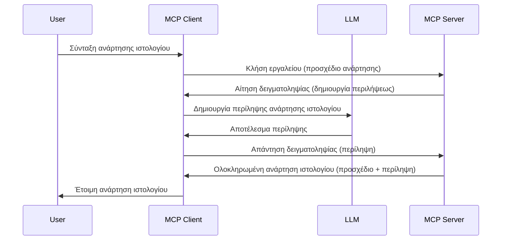

# Δειγματοληψία - εξουσιοδότηση δυνατοτήτων στον Πελάτη

Μερικές φορές, χρειάζεστε ο Πελάτης MCP και ο Διακομιστής MCP να συνεργαστούν για να πετύχουν έναν κοινό στόχο. Μπορεί να έχετε μια περίπτωση όπου ο Διακομιστής απαιτεί τη βοήθεια ενός LLM που βρίσκεται στον πελάτη. Για αυτή την κατάσταση, η δειγματοληψία είναι το εργαλείο που πρέπει να χρησιμοποιήσετε.

Ας εξερευνήσουμε μερικές περιπτώσεις χρήσης και πώς να δημιουργήσουμε μια λύση που περιλαμβάνει δειγματοληψία.

## Επισκόπηση

Σε αυτό το μάθημα, εστιάζουμε στην εξήγηση πότε και πού να χρησιμοποιείται η δειγματοληψία και πώς να τη διαμορφώσουμε.

## Στόχοι Μάθησης

Σε αυτό το κεφάλαιο, θα:

- Εξηγήσουμε τι είναι η δειγματοληψία και πότε να τη χρησιμοποιείτε.
- Δείξουμε πώς να διαμορφώσετε τη δειγματοληψία στο MCP.
- Παρέχουμε παραδείγματα δειγματοληψίας σε δράση.

## Τι είναι η δειγματοληψία και γιατί να τη χρησιμοποιήσετε;

Η δειγματοληψία είναι μια προηγμένη λειτουργία που δουλεύει με τον εξής τρόπο:



### Αίτημα δειγματοληψίας

Εντάξει, τώρα που έχουμε μια γενική εικόνα ενός αξιόπιστου σεναρίου, ας μιλήσουμε για το αίτημα δειγματοληψίας που ο διακομιστής στέλνει πίσω στον πελάτη. Δείτε πώς μπορεί να μοιάζει ένα τέτοιο αίτημα σε μορφή JSON-RPC:

```json
{
  "jsonrpc": "2.0",
  "id": 1,
  "method": "sampling/createMessage",
  "params": {
    "messages": [
      {
        "role": "user",
        "content": {
          "type": "text",
          "text": "Create a blog post summary of the following blog post: <BLOG POST>"
        }
      }
    ],
    "modelPreferences": {
      "hints": [
        {
          "name": "claude-3-sonnet"
        }
      ],
      "intelligencePriority": 0.8,
      "speedPriority": 0.5
    },
    "systemPrompt": "You are a helpful assistant.",
    "maxTokens": 100
  }
}
```

Υπάρχουν μερικά σημεία που αξίζει να επισημανθούν:

- Το Prompt, κάτω από content -> text, είναι το prompt μας που αποτελεί οδηγία για το LLM να συνοψίσει το περιεχόμενο ενός άρθρου blog.

- **modelPreferences**. Αυτή η ενότητα είναι ακριβώς αυτό, μια προτίμηση, μια σύσταση για το ποια διαμόρφωση να χρησιμοποιηθεί με το LLM. Ο χρήστης μπορεί να επιλέξει αν θα ακολουθήσει αυτές τις συστάσεις ή θα τις αλλάξει. Σε αυτή την περίπτωση υπάρχουν συστάσεις για το μοντέλο που θα χρησιμοποιηθεί και την προτεραιότητα ταχύτητας και ευφυΐας.
- **systemPrompt**, αυτό είναι το κανονικό σας σύστημα prompt που δίνει στο LLM σας μια προσωπικότητα και περιέχει οδηγίες καθοδήγησης.
- **maxTokens**, αυτή είναι μια ακόμη ιδιότητα που χρησιμοποιείται για να δηλώσει πόσα tokens συνιστώνται να χρησιμοποιηθούν για αυτήν την εργασία.

### Απάντηση δειγματοληψίας

Αυτή η απάντηση είναι το αποτέλεσμα που ο Πελάτης MCP στέλνει πίσω στον Διακομιστή MCP και προκύπτει από την κλήση του LLM από τον πελάτη, την αναμονή για αυτή την απάντηση και στη συνέχεια τη σύνθεση αυτού του μηνύματος. Δείτε πώς μπορεί να μοιάζει σε JSON-RPC:

```json
{
  "jsonrpc": "2.0",
  "id": 1,
  "result": {
    "role": "assistant",
    "content": {
      "type": "text",
      "text": "Here's your abstract <ABSTRACT>"
    },
    "model": "gpt-5",
    "stopReason": "endTurn"
  }
}
```

Σημειώστε πώς η απάντηση είναι μια περίληψη του άρθρου στο blog όπως ζητήσαμε. Επίσης, προσέξτε πώς το χρησιμοποιημένο `model` δεν είναι αυτό που ζητήσαμε αλλά "gpt-5" αντί για "claude-3-sonnet". Αυτό δείχνει ότι ο χρήστης μπορεί να αλλάξει γνώμη σχετικά με το τι θα χρησιμοποιήσει και ότι το αίτημα δειγματοληψίας σας είναι μια σύσταση.

Εντάξει, τώρα που καταλαβαίνουμε τη βασική ροή και τη χρήσιμη εργασία για να τη χρησιμοποιήσουμε "δημιουργία άρθρου blog + περίληψη", ας δούμε τι πρέπει να κάνουμε για να λειτουργήσει.

### Τύποι μηνυμάτων

Τα μηνύματα δειγματοληψίας δεν περιορίζονται μόνο σε κείμενο αλλά μπορείτε επίσης να στείλετε εικόνες και ήχο. Δείτε πώς διαφέρει η μορφή JSON-RPC:

**Κείμενο**

```json
{
  "type": "text",
  "text": "The message content"
}
```

**Περιεχόμενο εικόνας**

```json
{
  "type": "image",
  "data": "base64-encoded-image-data",
  "mimeType": "image/jpeg"
}
```

**Περιεχόμενο ήχου**

```json
{
  "type": "audio",
  "data": "base64-encoded-audio-data",
  "mimeType": "audio/wav"
}
```

> NOTE: για πιο λεπτομερείς πληροφορίες για τη Δειγματοληψία, δείτε τα [επίσημα έγγραφα](https://modelcontextprotocol.io/specification/2025-11-25/client/sampling)

## Πώς να διαμορφώσετε τη Δειγματοληψία στον Πελάτη

> Σημείωση: αν φτιάχνετε μόνο διακομιστή, δεν χρειάζεται να κάνετε πολλά εδώ.

Σε έναν πελάτη, πρέπει να ορίσετε την παρακάτω δυνατότητα έτσι:

```json
{
  "capabilities": {
    "sampling": {}
  }
}
```

Αυτό θα αναγνωριστεί όταν ο επιλεγμένος πελάτης σας ξεκινήσει σύνδεση με τον διακομιστή.

## Παράδειγμα Δειγματοληψίας σε Δράση - Δημιουργία Άρθρου Blog

Ας προγραμματίσουμε έναν διακομιστή δειγματοληψίας μαζί, θα χρειαστεί να κάνουμε τα εξής:

1. Δημιουργήστε ένα εργαλείο στον Διακομιστή.
1. Το εργαλείο αυτό πρέπει να δημιουργήσει ένα αίτημα δειγματοληψίας.
1. Το εργαλείο πρέπει να περιμένει την απάντηση του αιτήματος δειγματοληψίας από τον πελάτη.
1. Στη συνέχεια, να παραχθεί το αποτέλεσμα του εργαλείου.

Ας δούμε τον κώδικα βήμα-βήμα:

### -1- Δημιουργία του εργαλείου

**python**

```python
@mcp.tool()
async def create_blog(title: str, content: str, ctx: Context[ServerSession, None]) -> str:
    """Create a blog post and generate a summary"""

```

### -2- Δημιουργία αιτήματος δειγματοληψίας

Επέκτεινε το εργαλείο σου με τον ακόλουθο κώδικα:

**python**

```python
post = BlogPost(
        id=len(posts) + 1,
        title=title,
        content=content,
        abstract=""
    )

prompt = f"Create an abstract of the following blog post: title: {title} and draft: {content} "

result = await ctx.session.create_message(
        messages=[
            SamplingMessage(
                role="user",
                content=TextContent(type="text", text=prompt),
            )
        ],
        max_tokens=100,
)

```

### -3- Περιμένετε την απάντηση και επιστρέψτε την απάντηση

**python**

```python
post.abstract = result.content.text

posts.append(post)

# επιστρέψτε το ολοκληρωμένο προϊόν
return json.dumps({
    "id": post.title,
    "abstract": post.abstract
})
```

### -4- Πλήρης κώδικας

**python**

```python
from starlette.applications import Starlette
from starlette.routing import Mount, Host

from mcp.server.fastmcp import Context, FastMCP

from mcp.server.session import ServerSession
from mcp.types import SamplingMessage, TextContent

import json


from uuid import uuid4
from typing import List
from pydantic import BaseModel


mcp = FastMCP("Blog post generator")

# app = FastAPI()

posts = []

class BlogPost(BaseModel):
    id: int
    title: str
    content: str
    abstract: str

posts: List[BlogPost] = []

@mcp.tool()
async def create_blog(title: str, content: str, ctx: Context[ServerSession, None]) -> str:
    """Create a blog post and generate a summary"""

    post = BlogPost(
        id=len(posts) + 1,
        title=title,
        content=content,
        abstract=""
    )

    prompt = f"Create an abstract of the following blog post: title: {title} and draft: {content} "

    result = await ctx.session.create_message(
        messages=[
            SamplingMessage(
                role="user",
                content=TextContent(type="text", text=prompt),
            )
        ],
        max_tokens=100,
    )

    post.abstract = result.content.text

    posts.append(post)

    # επιστρέφει ολόκληρη την ανάρτηση ιστολογίου
    return json.dumps({
        "id": post.title,
        "abstract": post.abstract
    })

if __name__ == "__main__":
    print("Starting server...")
    # mcp.run()
    mcp.run(transport="streamable-http")

# εκτελέστε την εφαρμογή με: python server.py
```

### -5- Δοκιμή στο Visual Studio Code

Για να το δοκιμάσετε στο Visual Studio Code, κάντε τα εξής:

1. Ξεκινήστε τον διακομιστή στο τερματικό
1. Προσθέστε τον στο *mcp.json* (και βεβαιωθείτε ότι έχει ξεκινήσει) π.χ κάτι τέτοιο:

   ```json
   "servers": {
      "blog-server": {
        "type": "http",
        "url": "http://localhost:8000/mcp"
      }
   }
   ```

1. Πληκτρολογήστε ένα prompt:

   ```text
   create a blog post named "Where Python comes from", the content is "Python is actually named after Monty Python Flying Circus"
   ```

1. Επιτρέψτε να εκτελεστεί η δειγματοληψία. Την πρώτη φορά που θα το δοκιμάσετε, θα σας εμφανιστεί ένας επιπλέον διάλογος που πρέπει να αποδεχτείτε, μετά θα δείτε τον κανονικό διάλογο που σας ζητά να τρέξετε ένα εργαλείο.

1. Εξετάστε τα αποτελέσματα. Θα δείτε τα αποτελέσματα τόσο όμορφα παρουσιασμένα στο GitHub Copilot Chat όσο και μπορείτε να ελέγξετε την ακατέργαστη απάντηση JSON.

**Μπόνους**. Το Visual Studio Code διαθέτει εξαιρετική υποστήριξη για τη δειγματοληψία. Μπορείτε να διαμορφώσετε την πρόσβαση στη δειγματοληψία στον εγκατεστημένο διακομιστή σας ακολουθώντας τα εξής:

1. Μεταβείτε στην ενότητα επεκτάσεων.
1. Επιλέξτε το εικονίδιο γραναζιού για τον εγκατεστημένο διακομιστή στην ενότητα "MCP SERVERS - INSTALLED".
1. Επιλέξτε "Configure Model Access", εδώ μπορείτε να επιλέξετε ποια Μοντέλα επιτρέπεται να χρησιμοποιεί ο GitHub Copilot κατά την εκτέλεση δειγματοληψίας. Μπορείτε επίσης να δείτε όλα τα αιτήματα δειγματοληψίας που έγιναν πρόσφατα επιλέγοντας "Show Sampling requests".

## Ανάθεση εργασίας

Σε αυτή την ανάθεση, θα δημιουργήσετε μια ελαφρώς διαφορετική δειγματοληψία, συγκεκριμένα μια ενσωμάτωση δειγματοληψίας που υποστηρίζει τη δημιουργία περιγραφής προϊόντος. Ιδού το σενάριό σας:

**Σενάριο**: Ο υπάλληλος γραφείου σε ένα ηλεκτρονικό κατάστημα χρειάζεται βοήθεια, του παίρνει πάρα πολύ χρόνο να δημιουργήσει περιγραφές προϊόντων. Επομένως, πρέπει να δημιουργήσετε μια λύση όπου μπορείτε να καλέσετε ένα εργαλείο "create_product" με "title" και "keywords" ως παραμέτρους και να παράγει ένα πλήρες προϊόν που να περιλαμβάνει πεδίο "description" το οποίο θα γεμίζει από το LLM του πελάτη.

ΤΥΠ: χρησιμοποιήστε όσα μάθατε νωρίτερα για να κατασκευάσετε αυτόν τον διακομιστή και το εργαλείο του χρησιμοποιώντας ένα αίτημα δειγματοληψίας.

## Λύση

[Λύση](./solution/README.md)

## Κύρια σημεία

Η δειγματοληψία είναι μια ισχυρή δυνατότητα που επιτρέπει στον διακομιστή να αναθέτει εργασίες στον πελάτη όταν χρειάζεται τη βοήθεια ενός LLM.

## Τι ακολουθεί

- [Κεφάλαιο 4 - Πρακτική εφαρμογή](../../04-PracticalImplementation/README.md)

---

<!-- CO-OP TRANSLATOR DISCLAIMER START -->
**Αποποίηση ευθυνών**:
Αυτό το έγγραφο έχει μεταφραστεί χρησιμοποιώντας την υπηρεσία μετάφρασης με τεχνητή νοημοσύνη [Co-op Translator](https://github.com/Azure/co-op-translator). Ενώ επιδιώκουμε την ακρίβεια, παρακαλούμε να έχετε υπόψη ότι οι αυτοματοποιημένες μεταφράσεις ενδέχεται να περιέχουν λάθη ή ανακρίβειες. Το πρωτότυπο έγγραφο στη μητρική του γλώσσα πρέπει να θεωρείται η αυθεντική πηγή. Για κρίσιμες πληροφορίες, συνιστάται επαγγελματική ανθρώπινη μετάφραση. Δεν φέρουμε ευθύνη για τυχόν παρεξηγήσεις ή λανθασμένες ερμηνείες που προκύπτουν από τη χρήση αυτής της μετάφρασης.
<!-- CO-OP TRANSLATOR DISCLAIMER END -->