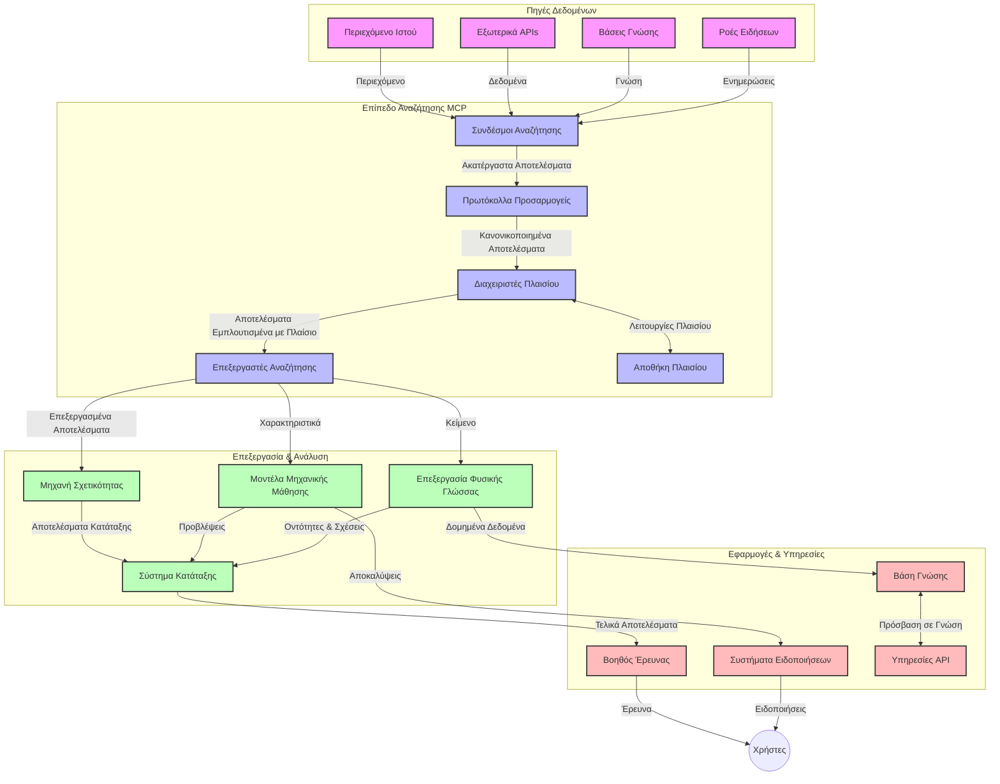
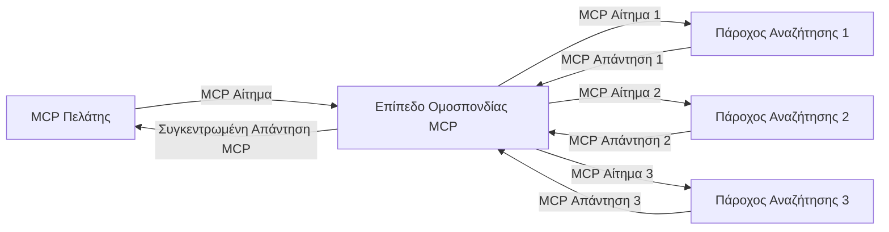
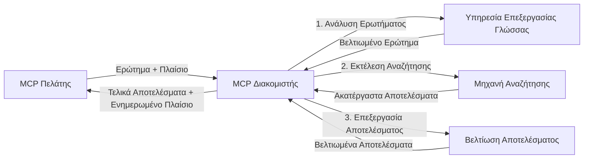

# Πρωτόκολλο Πλαισίου Μοντέλου για Αναζήτηση Ιστού σε Πραγματικό Χρόνο

## Επισκόπηση

Η αναζήτηση ιστού σε πραγματικό χρόνο έχει γίνει απαραίτητη στο σύγχρονο περιβάλλον πληροφόρησης, όπου οι εφαρμογές χρειάζονται άμεση πρόσβαση σε ενημερωμένες πληροφορίες από το διαδίκτυο για να παρέχουν σχετικές και έγκαιρες απαντήσεις. Το Πρωτόκολλο Πλαισίου Μοντέλου (MCP) αντιπροσωπεύει μια σημαντική πρόοδο στην βελτιστοποίηση αυτών των διαδικασιών αναζήτησης σε πραγματικό χρόνο, βελτιώνοντας την αποδοτικότητα της αναζήτησης, διατηρώντας την εγκυρότητα του πλαισίου και ενισχύοντας τη συνολική απόδοση του συστήματος.

Αυτό το μάθημα εξετάζει πώς το MCP μετασχηματίζει την αναζήτηση ιστού σε πραγματικό χρόνο παρέχοντας μια τυποποιημένη προσέγγιση στη διαχείριση του πλαισίου μεταξύ μοντέλων τεχνητής νοημοσύνης, μηχανών αναζήτησης και εφαρμογών.

### Τι θα Μάθετε

Σε αυτόν τον ολοκληρωμένο οδηγό, θα ανακαλύψετε:

- Πώς το MCP δημιουργεί ένα αδιάκοπο γέφυρα μεταξύ μοντέλων ΤΝ και δυνατοτήτων αναζήτησης ιστού σε πραγματικό χρόνο
- Αρχιτεκτονικά πρότυπα για την υλοποίηση αποδοτικών και επεκτάσιμων λύσεων αναζήτησης με MCP
- Τεχνικές για τη διατήρηση του πλαισίου αναζήτησης σε πολλαπλές ερωτήσεις και αλληλεπιδράσεις
- Πρακτικές υλοποιήσεις κώδικα σε Python και JavaScript για διάφορα σενάρια αναζήτησης
- Μεθόδους για την εξισορρόπηση της σχετικότητας, της σύγχρονης πληροφορίας και της απόδοσης σε συστήματα αναζήτησης με MCP

## Εισαγωγή στην Αναζήτηση Ιστού σε Πραγματικό Χρόνο

Η αναζήτηση ιστού σε πραγματικό χρόνο είναι μια τεχνολογική προσέγγιση που επιτρέπει τη συνεχή υποβολή, επεξεργασία και ανάλυση πληροφοριών από τον ιστό καθώς αυτές δημοσιεύονται ή ανανεώνονται, δίνοντας τη δυνατότητα στα συστήματα να παρέχουν φρέσκιες και σχετικές πληροφορίες με ελάχιστη καθυστέρηση. Σε αντίθεση με τα παραδοσιακά συστήματα αναζήτησης που λειτουργούν σε δεδομένα ευρετηριασμένα και ενδεχομένως παλιά μερικές ώρες ή ημέρες, η αναζήτηση σε πραγματικό χρόνο επεξεργάζεται ζωντανά δεδομένα από τον ιστό, προσφέροντας πληροφορίες που αντανακλούν την τρέχουσα κατάσταση του διαδικτυακού περιεχομένου.

### Βασικές Έννοιες της Αναζήτησης Ιστού σε Πραγματικό Χρόνο:

- **Συνεχής Επεξεργασία Ερωτημάτων**: Τα ερωτήματα αναζήτησης επεξεργάζονται σε δεδομένα που ενημερώνονται συνεχώς
- **Προτεραιότητα στην Ενημερότητα**: Τα συστήματα σχεδιάζονται για να δίνουν προτεραιότητα σε φρέσκιες πληροφορίες
- **Εξισορρόπηση Σχετικότητας**: Διατήρηση ισορροπίας μεταξύ σχετικότητας και σύγχρονης πληροφορίας
- **Επεκτάσιμη Αρχιτεκτονική**: Τα συστήματα πρέπει να διαχειρίζονται μεταβαλλόμενο φόρτο ερωτημάτων και όγκους δεδομένων
- **Κατανόηση Πλαισίου**: Η διατήρηση του πλαισίου χρήστη κατά τις επαναλαμβανόμενες αναζητήσεις είναι κρίσιμη για ουσιαστικά αποτελέσματα
- **Δυναμική Αναδιατύπωση Ερωτημάτων**: Προσαρμογή των ερωτημάτων με βάση το πλαίσιο και προηγούμενα αποτελέσματα
- **Πολυπηγή Ενσωμάτωση**: Συνδυασμός αποτελεσμάτων από πολλούς παρόχους αναζήτησης και πηγές του ιστού
- **Σημασιολογική Κατανόηση**: Επεξεργασία ερωτημάτων και περιεχομένου βάσει νοήματος και όχι απλώς λέξεων-κλειδιών
- **Βαθμολόγηση σε Πραγματικό Χρόνο**: Συνεχής προσαρμογή της ιεράρχησης αποτελεσμάτων καθώς νέες πληροφορίες γίνονται διαθέσιμες

### Το Πρωτόκολλο Πλαισίου Μοντέλου και η Αναζήτηση Ιστού σε Πραγματικό Χρόνο

Το Πρωτόκολλο Πλαισίου Μοντέλου (MCP) αντιμετωπίζει σημαντικές προκλήσεις σε περιβάλλοντα αναζήτησης ιστού σε πραγματικό χρόνο:

1. **Διατήρηση Πλαισίου Αναζήτησης**: Το MCP τυποποιεί τον τρόπο διατήρησης του πλαισίου ανάμεσα σε διανεμημένα συστατικά αναζήτησης, διασφαλίζοντας την πρόσβαση των μοντέλων ΤΝ και των κόμβων επεξεργασίας σε σχετικό ιστορικό ερωτημάτων και προτιμήσεις χρήστη.

2. **Αποτελεσματική Διαχείριση Ερωτημάτων**: Παρέχοντας δομημένους μηχανισμούς μετάδοσης πλαισίου, το MCP μειώνει το κόστος επανάληψης του πλαισίου σε κάθε επανάληψη αναζήτησης.

3. **Διαλειτουργικότητα**: Το MCP δημιουργεί μια κοινή γλώσσα για ανταλλαγή πλαισίου μεταξύ διαφορετικών τεχνολογιών αναζήτησης και μοντέλων ΤΝ, επιτρέποντας πιο ευέλικτες και επεκτάσιμες αρχιτεκτονικές.

4. **Βελτιστοποιημένο Πλαίσιο για Αναζήτηση**: Οι υλοποιήσεις MCP μπορούν να δώσουν προτεραιότητα στα πιο σχετικά στοιχεία πλαισίου για αποτελεσματική αναζήτηση, βελτιώνοντας τόσο την απόδοση όσο και την ακρίβεια.

5. **Προσαρμοστική Επεξεργασία Αναζήτησης**: Με σωστή διαχείριση πλαισίου μέσω MCP, τα συστήματα αναζήτησης μπορούν να προσαρμόζουν δυναμικά την επεξεργασία βάσει των εξελισσόμενων αναγκών και του πληθυσμού πληροφοριών.

Σε σύγχρονες εφαρμογές, από συγκεντρωτικά νέα έως βοηθούς έρευνας, η ενσωμάτωση του MCP με τις τεχνολογίες αναζήτησης ιστού επιτρέπει πιο έξυπνη, με επίγνωση πλαισίου αναζήτηση που παρέχει ολοένα και πιο σχετικά αποτελέσματα καθώς συνεχίζονται οι αλληλεπιδράσεις των χρηστών.

## Στόχοι Μαθήματος

Στο τέλος αυτού του μαθήματος, θα μπορείτε να:

- Κατανοήσετε τα θεμελιώδη στοιχεία της αναζήτησης ιστού σε πραγματικό χρόνο και τις προκλήσεις της σε σύγχρονες εφαρμογές
- Εξηγήσετε πώς το Πρωτόκολλο Πλαισίου Μοντέλου (MCP) ενισχύει τις δυνατότητες αναζήτησης ιστού σε πραγματικό χρόνο
- Υλοποιήσετε λύσεις αναζήτησης βασισμένες σε MCP χρησιμοποιώντας δημοφιλή πλαίσια και API
- Σχεδιάσετε και αναπτύξετε επεκτάσιμες, υψηλής απόδοσης αρχιτεκτονικές αναζήτησης με MCP
- Εφαρμόσετε τις έννοιες MCP σε διάφορες χρήσεις που περιλαμβάνουν σημασιολογική αναζήτηση, υποστήριξη έρευνας και περιήγηση ενισχυμένη με ΤΝ
- Αξιολογήσετε αναδυόμενες τάσεις και μελλοντικές καινοτομίες σε τεχνολογίες αναζήτησης βασισμένες σε MCP
- Αναπτύξετε συστήματα αναζήτησης με επίγνωση πλαισίου που μαθαίνουν από τις αλληλεπιδράσεις των χρηστών
- Ενσωματώσετε δυνατότητες αναζήτησης ιστού σε βοηθούς ΤΝ χρησιμοποιώντας τυποποιημένα πρωτόκολλα MCP
- Δημιουργήσετε πολυσταδιακές ροές αναζήτησης που εξελίσσουν σταδιακά τα αποτελέσματα βάσει πλαισίου
- Βελτιστοποιήσετε την απόδοση αναζήτησης διατηρώντας πλήρη επίγνωση πλαισίου

### Ορισμός και Σημασία

Η αναζήτηση ιστού σε πραγματικό χρόνο περιλαμβάνει τη συνεχή υποβολή, ανάκτηση και παράδοση πληροφοριών από τον ιστό με ελάχιστη καθυστέρηση. Σε αντίθεση με τις παραδοσιακές μηχανές αναζήτησης που ανιχνεύουν και ευρετηριάζουν περιοδικά τον ιστό, η αναζήτηση σε πραγματικό χρόνο στοχεύει στην ανάδειξη πληροφοριών αμέσως μόλις γίνονται διαθέσιμες, επιτρέποντας άμεση πρόσβαση στο πιο τωρινό περιεχόμενο.

Κύρια χαρακτηριστικά της αναζήτησης ιστού σε πραγματικό χρόνο περιλαμβάνουν:

- **Φρεσκάδα**: Προτεραιότητα σε πρόσφατο περιεχόμενο και ενημερώσεις
- **Συνεχής Επεξεργασία**: Διαρκής παρακολούθηση για νέες πληροφορίες
- **Προσαρμογή Ερωτήματος**: Βελτίωση ερωτημάτων αναζήτησης βάσει πλαισίου και ανατροφοδότησης
- **Άμεση Παράδοση**: Παροχή αποτελεσμάτων αναζήτησης με ελάχιστη καθυστέρηση
- **Διατήρηση Πλαισίου**: Οικοδόμηση πάνω σε προηγούμενα ερωτήματα για μεγαλύτερη σχετικότητα

### Προκλήσεις στην Παραδοσιακή Αναζήτηση Ιστού

Οι παραδοσιακές μέθοδοι αναζήτησης αντιμετωπίζουν αρκετούς περιορισμούς όταν εφαρμόζονται σε σενάρια πραγματικού χρόνου:

1. **Κατάτμηση Πλαισίου**: Δυσκολία στη διατήρηση του πλαισίου αναζήτησης σε πολλαπλές ερωτήσεις
2. **Φρεσκάδα Πληροφορίας**: Προκλήσεις στην πρόσβαση και προτεραιότητα των πιο πρόσφατων πληροφοριών
3. **Πολυπλοκότητα Ενσωμάτωσης**: Προβλήματα διαλειτουργικότητας μεταξύ συστημάτων αναζήτησης και εφαρμογών
4. **Ζητήματα Καθυστέρησης**: Ισορροπία μεταξύ ολοκληρωμένης αναζήτησης και απαιτήσεων χρόνου απόκρισης
5. **Ρύθμιση Σχετικότητας**: Εξασφάλιση ακρίβειας και σχετικότητας ενώ δίνεται προτεραιότητα στη φρεσκάδα

## Κατανόηση του Πρωτοκόλλου Πλαισίου Μοντέλου (MCP) για Αναζήτηση

### Τι είναι το MCP σε Πλαίσια Αναζήτησης;

Το Πρωτόκολλο Πλαισίου Μοντέλου (MCP) είναι ένα τυποποιημένο πρωτόκολλο επικοινωνίας σχεδιασμένο να διευκολύνει αποδοτική αλληλεπίδραση μεταξύ μοντέλων ΤΝ και εφαρμογών. Στο πλαίσιο της αναζήτησης ιστού σε πραγματικό χρόνο, το MCP παρέχει ένα πλαίσιο για:

- Την διατήρηση του πλαισίου αναζήτησης καθ’ όλη τη διάρκεια ακολουθιών ερωτημάτων
- Την τυποποίηση των μορφών ερωτημάτων και αποτελεσμάτων αναζήτησης
- Τη βελτιστοποίηση της μετάδοσης παραμέτρων και αποτελεσμάτων αναζήτησης
- Την ενίσχυση της επικοινωνίας μεταξύ μοντέλων και μηχανών αναζήτησης

### Βασικά Συστατικά και Αρχιτεκτονική

Η αρχιτεκτονική MCP για αναζήτηση ιστού σε πραγματικό χρόνο αποτελείται από βασικά συστατικά:

1. **Διαχειριστές Πλαισίου Ερωτημάτων**: Διαχειρίζονται και διατηρούν το πλαίσιο αναζήτησης σε πολλαπλά ερωτήματα
2. **Επεξεργαστές Αναζήτησης**: Επεξεργάζονται εισερχόμενα αιτήματα αναζήτησης με τεχνικές ευαισθησίας στο πλαίσιο
3. **Μετατροπείς Πρωτοκόλλου**: Μετατρέπουν μεταξύ διαφορετικών API αναζήτησης διατηρώντας το πλαίσιο
4. **Αποθηκευτικό Πλαίσιο**: Αποθηκεύει και ανακτά αποδοτικά το ιστορικό αναζήτησης και τις προτιμήσεις
5. **Συνδέσεις Αναζήτησης**: Συνδέεται με διάφορες μηχανές αναζήτησης και API του ιστού



### Πώς το MCP Βελτιώνει την Αναζήτηση Ιστού σε Πραγματικό Χρόνο

Το MCP αντιμετωπίζει τις παραδοσιακές προκλήσεις αναζήτησης ιστού μέσω:

- **Συνέχειας Πλαισίου**: Διατηρεί τις σχέσεις μεταξύ ερωτημάτων σε όλη τη διάρκεια της συνεδρίας αναζήτησης
- **Βελτιστοποιημένης Μετάδοσης**: Μειώνει την επανάληψη στις παραμέτρους αναζήτησης μέσω έξυπνης διαχείρισης πλαισίου
- **Τυποποιημένων Διεπαφών**: Παρέχει συνεπή API για τα συστατικά αναζήτησης
- **Μείωση Καθυστέρησης**: Ελαχιστοποιεί το κόστος επεξεργασίας μέσω αποδοτικής διαχείρισης πλαισίου
- **Ενίσχυση Σχετικότητας**: Βελτιώνει τη σχετικότητα της αναζήτησης διατηρώντας την πρόθεση του χρήστη σε πολλαπλά ερωτήματα

## Ενσωμάτωση και Υλοποίηση

Τα συστήματα αναζήτησης ιστού σε πραγματικό χρόνο απαιτούν προσεκτικό σχεδιασμό και υλοποίηση αρχιτεκτονικής για να διατηρούν τόσο την απόδοση όσο και την ακεραιότητα του πλαισίου. Το Πρωτόκολλο Πλαισίου Μοντέλου προσφέρει μια τυποποιημένη προσέγγιση για την ενσωμάτωση μοντέλων ΤΝ και τεχνολογιών αναζήτησης, επιτρέποντας πιο εξελιγμένες, με επίγνωση πλαισίου ροές αναζήτησης.

### Επισκόπηση Ενσωμάτωσης MCP σε Αρχιτεκτονικές Αναζήτησης

Η υλοποίηση του MCP σε περιβάλλοντα αναζήτησης ιστού σε πραγματικό χρόνο περιλαμβάνει βασικές πτυχές:

1. **Σειριοποίηση Πλαισίου Αναζήτησης**: Το MCP προσφέρει αποδοτικούς μηχανισμούς κωδικοποίησης πληροφοριών πλαισίου εντός αιτημάτων αναζήτησης, εξασφαλίζοντας την μετάδοση σημαντικού πλαισίου καθ’ όλη τη διαδικασία επεξεργασίας. Περιλαμβάνει τυποποιημένα φορμά σειριοποίησης βελτιστοποιημένα για metadata σχετικό με αναζήτηση.

2. **Κατάστασή Επεξεργασία Αναζήτησης**: Το MCP επιτρέπει πιο έξυπνη κατάστασιμη επεξεργασία διατηρώντας συνεπείς αναπαραστάσεις πλαισίου σε όλες τις επαναλήψεις αναζήτησης. Αυτό είναι ιδιαίτερα χρήσιμο σε πολυσταδιακές ροές όπου η βελτίωση του πλαισίου βελτιώνει τα αποτελέσματα.

3. **Επέκταση και Βελτίωση Ερωτημάτων**: Οι υλοποιήσεις MCP μπορούν να διευκολύνουν την πολύπλοκη επέκταση και βελτίωση των ερωτημάτων βάσει συσσωρευμένου πλαισίου, επιτρέποντας όλο και πιο σχετικά αποτελέσματα καθώς προχωρά η συνεδρία αναζήτησης.

4. **Αποθήκευση και Προτεραιοποίηση Αποτελεσμάτων**: Με την τυποποίηση της διαχείρισης πλαισίου, το MCP βοηθά στη διαχείριση της αποθήκευσης αποτελεσμάτων και της προτεραιοποίησης, δίνοντας τη δυνατότητα στα συστατικά να προσαρμόζονται βάσει του εξελισσόμενου πλαισίου αναζήτησης.

5. **Φορέας και Συγκέντρωση Αναζήτησης**: Το MCP διευκολύνει πιο πολύπλοκη διαμοίραση της αναζήτησης ανάμεσα σε πολλαπλούς υποβάθρους παρέχοντας δομημένες αναπαραστάσεις του πλαισίου, επιτρέποντας πιο ουσιαστική συγκέντρωση αποτελεσμάτων από διάφορες πηγές.

Η υλοποίηση του MCP σε διάφορες τεχνολογίες αναζήτησης δημιουργεί μια ενιαία προσέγγιση στη διαχείριση πλαισίου, μειώνοντας την ανάγκη για προσαρμοσμένο κώδικα ενσωμάτωσης ενώ ενισχύει την ικανότητα του συστήματος να διατηρεί ουσιαστικό πλαίσιο καθώς εξελίσσονται τα ερωτήματα.

### MCP σε Διάφορες Υλοποιήσεις Αναζήτησης Ιστού

Αυτά τα παραδείγματα ακολουθούν την τρέχουσα προδιαγραφή MCP που εστιάζει σε ένα πρωτόκολλο βασισμένο σε JSON-RPC με ξεχωριστούς μηχανισμούς μεταφοράς. Ο κώδικας δείχνει πώς μπορείτε να υλοποιήσετε προσαρμοσμένες ενσωματώσεις αναζήτησης ενώ διατηρείτε πλήρη συμβατότητα με το πρωτόκολλο MCP.


<details>
<summary>Υλοποίηση σε Python με Γενικό Search API</summary>

```python
import asyncio
import json
import aiohttp
from typing import Dict, Any, Optional, List
from contextlib import asynccontextmanager
from collections.abc import AsyncIterator

# Εισαγωγή στάνταρ βιβλιοθηκών MCP
from mcp.client.session import ClientSession
from mcp.client.streamable_http import streamablehttp_client
from mcp.types import TextContent, CreateMessageRequestParams, CreateMessageResult
from mcp.server.fastmcp import FastMCP

# Δημιουργία FastMCP διακομιστή για αναζήτηση στο διαδίκτυο
search_server = FastMCP("WebSearch")

# Κλάση για διαχείριση λειτουργιών αναζήτησης στο διαδίκτυο
class WebSearchHandler:
    def __init__(self, api_endpoint: str, api_key: str):
        self.api_endpoint = api_endpoint
        self.api_key = api_key
        self.session = None
        
    async def initialize(self):
        """Initialize the HTTP session"""
        self.session = aiohttp.ClientSession(
            headers={"Authorization": f"Bearer {self.api_key}"}
        )
    
    async def close(self):
        """Close the HTTP session"""
        if self.session:
            await self.session.close()
            
    async def perform_search(self, query: str, max_results: int = 5, 
                           include_domains: List[str] = None, 
                           exclude_domains: List[str] = None,
                           time_period: str = "any") -> Dict[str, Any]:
        """Perform web search using the search API"""
        # Κατασκευή παραμέτρων αναζήτησης
        search_params = {
            "q": query,
            "limit": max_results,
            "time": time_period
        }
        
        if include_domains:
            search_params["site"] = ",".join(include_domains)
            
        if exclude_domains:
            search_params["exclude_site"] = ",".join(exclude_domains)
        
        # Εκτέλεση του αιτήματος αναζήτησης
        try:
            async with self.session.get(
                self.api_endpoint,
                params=search_params
            ) as response:
                if response.status != 200:
                    error_text = await response.text()
                    raise Exception(f"Search API error: {response.status} - {error_text}")
                
                search_data = await response.json()
                
                # Μετατροπή της απάντησης ειδικής για API σε στάνταρ μορφή
                results = []
                for item in search_data.get("results", []):
                    results.append({
                        "title": item.get("title", ""),
                        "url": item.get("url", ""),
                        "snippet": item.get("snippet", ""),
                        "date": item.get("published_date", ""),
                        "source": item.get("source", "")
                    })
                
                return {
                    "query": query,
                    "totalResults": len(results),
                    "results": results
                }
        except Exception as e:
            print(f"Search API request error: {e}")
            raise

# Αρχικοποίηση του χειριστή αναζήτησης
search_handler = WebSearchHandler(
    api_endpoint="https://api.search-service.example/search",
    api_key="your-api-key-here"
)

# Ρύθμιση διάρκειας ζωής για διαχείριση του χειριστή αναζήτησης
@asyncio.asynccontextmanager
async def app_lifespan(server: FastMCP):
    """Manage application lifecycle"""
    await search_handler.initialize()
    try:
        yield {"search_handler": search_handler}
    finally:
        await search_handler.close()

# Ρύθμιση διάρκειας ζωής για τον διακομιστή
search_server = FastMCP("WebSearch", lifespan=app_lifespan)

# Καταχώρηση εργαλείου αναζήτησης στο διαδίκτυο
@search_server.tool()
async def web_search(query: str, max_results: int = 5, 
                   include_domains: List[str] = None,
                   exclude_domains: List[str] = None,
                   time_period: str = "any") -> Dict[str, Any]:
    """
    Search the web for information
    
    Args:
        query: The search query
        max_results: Maximum number of results to return (default: 5)
        include_domains: List of domains to include in search results
        exclude_domains: List of domains to exclude from search results
        time_period: Time period for results ("day", "week", "month", "any")
        
    Returns:
        Dictionary containing search results
    """
    ctx = search_server.get_context()
    search_handler = ctx.request_context.lifespan_context["search_handler"]
    
    results = await search_handler.perform_search(
        query=query,
        max_results=max_results,
        include_domains=include_domains,
        exclude_domains=exclude_domains,
        time_period=time_period
    )
    
    return results

# Παράδειγμα χρήσης από πελάτη
async def client_example():
    # Σύνδεση στον διακομιστή αναζήτησης χρησιμοποιώντας μεταφορά Streamable HTTP
    async with streamablehttp_client("http://localhost:8000/mcp") as (read, write, _):
        async with ClientSession(read, write) as session:
            # Αρχικοποίηση της σύνδεσης
            await session.initialize()
            
            # Κλήση του εργαλείου web_search
            search_results = await session.call_tool(
                "web_search", 
                {
                    "query": "latest developments in AI and Model Context Protocol",
                    "max_results": 5,
                    "time_period": "day",
                    "include_domains": ["github.com", "microsoft.com"]
                }
            )
            
            print(f"Search results: {search_results}")

# Παράδειγμα εκτέλεσης διακομιστή
if __name__ == "__main__":
    # Εκτέλεση του διακομιστή με μεταφορά Streamable HTTP
    search_server.run(transport="streamable-http")
```
</details> 

<details>
<summary>Υλοποίηση σε JavaScript με Αναζήτηση Βάσει Προγράμματος Περιήγησης</summary>


```javascript
// Υλοποίηση διακομιστή MCP για αναζήτηση ιστού
import { McpServer, ResourceTemplate } from '@modelcontextprotocol/sdk/server/mcp.js';
import { StreamableHTTPServerTransport } from '@modelcontextprotocol/sdk/server/streamableHttp.js';
import { z } from 'zod';

// Δημιουργία διακομιστή MCP για αναζήτηση ιστού
const searchServer = new McpServer({
    name: "BrowserSearch",
    description: "A server that provides web search capabilities"
});

// Κλάση υπηρεσίας αναζήτησης
class SearchService {
    constructor(searchApiUrl, apiKey) {
        this.searchApiUrl = searchApiUrl;
        this.apiKey = apiKey;
    }

    async performSearch(parameters) {
        const {
            query = '',
            maxResults = 5,
            includeDomains = [],
            excludeDomains = [],
            timePeriod = 'any'
        } = parameters;
        
        // Κατασκευή URL αναζήτησης με παραμέτρους
        const url = new URL(this.searchApiUrl);
        url.searchParams.append('q', query);
        url.searchParams.append('limit', maxResults);
        url.searchParams.append('time', timePeriod);
        
        if (includeDomains.length > 0) {
            url.searchParams.append('site', includeDomains.join(','));
        }
        
        if (excludeDomains.length > 0) {
            url.searchParams.append('exclude_site', excludeDomains.join(','));
        }
        
        try {
            const response = await fetch(url.toString(), {
                method: 'GET',
                headers: {
                    'Authorization': `Bearer ${this.apiKey}`,
                    'Content-Type': 'application/json'
                }
            });
            
            if (!response.ok) {
                const errorText = await response.text();
                throw new Error(`Search API error: ${response.status} - ${errorText}`);
            }
            
            const searchData = await response.json();
            
            // Μετατροπή API-ειδικής απάντησης σε τυποποιημένη μορφή
            const results = searchData.results?.map(item => ({
                title: item.title || '',
                url: item.url || '',
                snippet: item.snippet || '',
                date: item.published_date || '',
                source: item.source || ''
            })) || [];
            
            return {
                query,
                totalResults: results.length,
                results
            };
        } catch (error) {
            console.error('Search API request error:', error);
            throw error;
        }
    }
}

// Αρχικοποίηση της υπηρεσίας αναζήτησης
const searchService = new SearchService(
    'https://api.search-service.example/search',
    'your-api-key-here'
);

// Ρύθμιση του παρόχου πλαισίου για τον διακομιστή
searchServer.setContextProvider(() => {
    return {
        searchService
    };
});

// Εγγραφή εργαλείου αναζήτησης ιστού
searchServer.tool({
    name: 'web_search',
    description: 'Search the web for information',
    parameters: {
        type: 'object',
        properties: {
            query: {
                type: 'string',
                description: 'The search query'
            },
            maxResults: {
                type: 'integer',
                description: 'Maximum number of results to return',
                default: 5
            },
            includeDomains: {
                type: 'array',
                items: { type: 'string' },
                description: 'List of domains to include in search results'
            },
            excludeDomains: {
                type: 'array',
                items: { type: 'string' },
                description: 'List of domains to exclude from search results'
            },
            timePeriod: {
                type: 'string',
                description: 'Time period for results',
                enum: ['day', 'week', 'month', 'any'],
                default: 'any'
            }
        },
        required: ['query']
    },
    handler: async (params, context) => {
        const { searchService } = context;
        return await searchService.performSearch(params);
    }
});

// Παράδειγμα κώδικα πελάτη για σύνδεση με το διακομιστή αναζήτησης
import { Client } from '@modelcontextprotocol/sdk/client/index.js';
import { StreamableHTTPClientTransport } from '@modelcontextprotocol/sdk/client/streamableHttp.js';

async function connectToSearchServer() {
    // Σύνδεση με τον διακομιστή αναζήτησης
    const transport = new StreamableHTTPClientTransport(
        new URL('http://localhost:8000/mcp')
    );
    
    const client = new Client({
        name: 'search-client',
        version: '1.0.0'
    });
    
    await client.connect(transport);
    
    // Εκτέλεση του εργαλείου αναζήτησης
    const searchResults = await client.callTool({
        name: 'web_search',
        arguments: {
            query: 'Model Context Protocol implementation examples',
            maxResults: 10,
            timePeriod: 'week',
            includeDomains: ['github.com', 'docs.microsoft.com']
        }
    });
    
    console.log('Search results:', searchResults);
    
    // Καθαρισμός
    await client.disconnect();
}

// Εκκίνηση του διακομιστή
const transport = new StreamableHTTPServerTransport();
await searchServer.connect(transport);
console.log('Search server running at http://localhost:8000/mcp');

// Σε ξεχωριστή διαδικασία ή μετά την εκκίνηση του διακομιστή
// connectToSearchServer().catch(console.error);
```
</details> 


## Δήλωση Ανησυχίας Παραδειγμάτων Κώδικα

> **Σημαντική Σημείωση**: Τα παρακάτω παραδείγματα κώδικα δείχνουν την ενσωμάτωση του Πρωτοκόλλου Πλαισίου Μοντέλου (MCP) με τη λειτουργικότητα αναζήτησης ιστού. Παρότι ακολουθούν τα πρότυπα και τις δομές των επίσημων SDK MCP, έχουν απλοποιηθεί για εκπαιδευτικούς σκοπούς.
> 
> Αυτά τα παραδείγματα περιλαμβάνουν:
> 
> 1. **Υλοποίηση σε Python**: Έναν εξυπηρετητή FastMCP που παρέχει εργαλείο αναζήτησης ιστού και συνδέεται με εξωτερικό API αναζήτησης. Το παράδειγμα δείχνει σωστή διαχείριση διάρκειας ζωής, διαχείριση πλαισίου και υλοποίηση εργαλείου ακολουθώντας τα πρότυπα του [επίσημου MCP Python SDK](https://github.com/modelcontextprotocol/python-sdk). Ο εξυπηρετητής χρησιμοποιεί τον προτεινόμενο Streamable HTTP transport που έχει αντικαταστήσει το παλαιότερο SSE transport στις παραγωγικές υλοποιήσεις.
> 
> 2. **Υλοποίηση σε JavaScript**: Υλοποίηση TypeScript/JavaScript που χρησιμοποιεί το πρότυπο FastMCP από το [επίσημο MCP TypeScript SDK](https://github.com/modelcontextprotocol/typescript-sdk) για δημιουργία εξυπηρετητή αναζήτησης με σωστούς ορισμούς εργαλείων και συνδέσεις πελατών. Ακολουθεί τα πιο πρόσφατα προτεινόμενα πρότυπα για διαχείριση συνεδριών και διατήρηση πλαισίου.
> 
> Τα παραδείγματα αυτά απαιτούν περαιτέρω χειρισμό σφαλμάτων, αυθεντικοποίηση και συγκεκριμένο κώδικα ενσωμάτωσης API για χρήση σε παραγωγή. Τα τελικά σημεία API αναζήτησης που εμφανίζονται (`https://api.search-service.example/search`) είναι υποκατάστατα και πρέπει να αντικατασταθούν με τα πραγματικά endpoints υπηρεσιών αναζήτησης.
> 
> Για πλήρεις λεπτομέρειες υλοποίησης και τις πιο ενημερωμένες προσεγγίσεις, παρακαλούμε ανατρέξτε στην [επίσημη προδιαγραφή MCP](https://spec.modelcontextprotocol.io/) και τεκμηρίωση SDK.

## Βασικές Έννοιες

### Το Πλαίσιο Πρωτοκόλλου Πλαισίου Μοντέλου (MCP)

Στον πυρήνα του, το Πρωτόκολλο Πλαισίου Μοντέλου παρέχει έναν τυποποιημένο τρόπο με τον οποίο μοντέλα ΤΝ, εφαρμογές και υπηρεσίες ανταλλάσσουν πλαίσιο. Στην αναζήτηση ιστού σε πραγματικό χρόνο, αυτό το πλαίσιο είναι ουσιώδες για τη δημιουργία συνεκτικών εμπειριών αναζήτησης με πολλαπλούς γύρους. Κύρια στοιχεία περιλαμβάνουν:

1. **Αρχιτεκτονική Πελάτη-Εξυπηρετητή**: Το MCP καθιερώνει σαφή διαχωρισμό μεταξύ πελατών αναζήτησης (αιτούντων) και εξυπηρετητών (παρόχων), επιτρέποντας ευέλικτα μοντέλα ανάπτυξης.

2. **Επικοινωνία JSON-RPC**: Το πρωτόκολλο χρησιμοποιεί JSON-RPC για ανταλλαγή μηνυμάτων, καθιστώντας το συμβατό με τεχνολογίες ιστού και εύκολο στην υλοποίηση σε διαφορετικές πλατφόρμες.

3. **Διαχείριση Πλαισίου**: Το MCP ορίζει δομημένες μεθόδους για τη διατήρηση, ενημέρωση και αξιοποίηση του πλαισίου αναζήτησης σε πολλαπλές αλληλεπιδράσεις.

4. **Ορισμοί Εργαλείων**: Οι δυνατότητες αναζήτησης εκτίθενται ως τυποποιημένα εργαλεία με καλά ορισμένες παραμέτρους και τιμές επιστροφής.

5. **Υποστήριξη Streaming**: Το πρωτόκολλο υποστηρίζει ροή αποτελεσμάτων, ουσιώδη για την αναζήτηση σε πραγματικό χρόνο όπου τα αποτελέσματα μπορεί να φτάνουν σταδιακά.

### Πρότυπα Ενσωμάτωσης Αναζήτησης Ιστού

Κατά την ενσωμάτωση MCP με την αναζήτηση ιστού, προκύπτουν διάφορα πρότυπα:

#### 1. Άμεση Ενσωμάτωση Παρόχου Αναζήτησης


Σε αυτό το πρότυπο, ο εξυπηρετητής MCP απευθείας συνδέεται με ένα ή περισσότερα API αναζήτησης, μετατρέποντας αιτήματα MCP σε κλήσεις ειδικές για το API και διαμορφώνοντας τα αποτελέσματα ως αποκρίσεις MCP.

#### 2. Ομοσπονδιακή Αναζήτηση με Διατήρηση Πλαισίου



Αυτό το πρότυπο διανέμει ερωτήματα αναζήτησης σε πολλούς παρόχους αναζήτησης συμβατούς με MCP, κάθε ένας από τους οποίους μπορεί να ειδικεύεται σε διαφορετικού τύπου περιεχόμενο ή δυνατότητες αναζήτησης, διατηρώντας ενιαίο πλαίσιο.

#### 3. Αλυσίδα Αναζήτησης Βελτιωμένη με Πλαίσιο



Σε αυτό το πρότυπο, η διαδικασία αναζήτησης χωρίζεται σε πολλαπλά στάδια, με το πλαίσιο να εμπλουτίζεται σε κάθε βήμα, οδηγώντας σε προοδευτικά πιο σχετικά αποτελέσματα.

### Συστατικά Πλαισίου Αναζήτησης

Σε αναζητήσεις ιστού βάσει MCP, το πλαίσιο συνήθως περιλαμβάνει:

- **Ιστορικό Ερωτημάτων**: Προηγούμενα ερωτήματα στη συνεδρία
- **Προτιμήσεις Χρήστη**: Γλώσσα, περιοχή, ρυθμίσεις ασφαλούς αναζήτησης
- **Ιστορικό Αλληλεπίδρασης**: Ποια αποτελέσματα κλικάρισαν, χρόνος παραμονής στα αποτελέσματα
- **Παράμετροι Αναζήτησης**: Φίλτρα, διαταγές ταξινόμησης και άλλοι τροποποιητές αναζήτησης
- **Εξειδίκευση Τομέα**: Θεματικό πλαίσιο σχετικό με την αναζήτηση
- **Χρονικό Πλαίσιο**: Παράγοντες σχετικότητας βάσει χρόνου
- **Προτιμήσεις Πηγών**: Αξιόπιστες ή προτιμώμενες πηγές πληροφορίας

## Σενάρια Χρήσης και Εφαρμογές

### Έρευνα και Συλλογή Πληροφοριών

Το MCP ενισχύει τις ροές εργασίας έρευνας μέσω:

- Διατήρησης πλαισίου έρευνας ανά συνεδρίες
- Επιτρέποντας πιο πολύπλοκα και σχετιζόμενα ερωτήματα
- Υποστήριξης πολυπηγής ομοσπονδιακής αναζήτησης
- Διευκόλυνσης εξαγωγής γνώσης από τα αποτελέσματα αναζήτησης

### Παρακολούθηση Νέων και Τάσεων σε Πραγματικό Χρόνο

Η αναζήτηση με MCP προσφέρει πλεονεκτήματα για την παρακολούθηση ειδήσεων:

- Ανακάλυψη σχεδόν σε πραγματικό χρόνο αναδυόμενων ειδησεογραφικών ιστοριών
- Φιλτράρισμα σχετικών πληροφοριών με επίγνωση πλαισίου
- Παρακολούθηση θεμάτων και οντοτήτων σε πολλαπλές πηγές
- Εξατομικευμένες ειδοποιήσεις ειδήσεων βάσει πλαισίου χρήστη

### Περιήγηση και Έρευνα Ενισχυμένη με ΤΝ

Το MCP δημιουργεί νέες δυνατότητες στην περιήγηση ενισχυμένη με ΤΝ:

- Σημειώσεις αναζήτησης με επίγνωση πλαισίου βάσει τρέχουσας δραστηριότητας περιηγητή
- Αδιάκοπη ενσωμάτωση αναζήτησης ιστού με βοηθούς βασισμένους σε μεγάλα μοντέλα γλώσσας
- Πολυσταδιακή βελτίωση αναζήτησης με διατήρηση πλαισίου
- Βελτιωμένος έλεγχος αληθείας και επαλήθευση πληροφοριών

## Μελλοντικές Τάσεις και Καινοτομίες

### Εξέλιξη του MCP στην Αναζήτηση Ιστού

Κοιτώντας προς το μέλλον, αναμένουμε ότι το MCP θα εξελιχθεί ώστε να αντιμετωπίσει:
- **Πολυμορφική Αναζήτηση**: Ενσωμάτωση αναζήτησης κειμένου, εικόνας, ήχου και βίντεο με διατηρημένο το πλαίσιο
- **Αποκεντρωμένη Αναζήτηση**: Υποστήριξη κατανεμημένων και ομοσπονδιακών οικοσυστημάτων αναζήτησης
- **Απόρρητο Αναζήτησης**: Μηχανισμοί αναζήτησης που διαφυλάσσουν το απόρρητο με επίγνωση του πλαισίου
- **Κατανόηση Ερωτήματος**: Βαθιά σημασιολογική ανάλυση ερωτημάτων φυσικής γλώσσας για αναζήτηση

### Πιθανοί Τεχνολογικοί Προορισμοί

Αναδυόμενες τεχνολογίες που θα διαμορφώσουν το μέλλον της αναζήτησης MCP:

1. **Νευρωνικές Αρχιτεκτονικές Αναζήτησης**: Συστήματα αναζήτησης βασισμένα σε ενσωματώσεις βελτιστοποιημένα για MCP
2. **Προσωποποιημένο Πλαίσιο Αναζήτησης**: Μάθηση ατομικών προτύπων αναζήτησης του χρήστη με την πάροδο του χρόνου
3. **Ενσωμάτωση Γραφημάτων Γνώσης**: Ενίσχυση της αναζήτησης με πλαίσιο μέσω γνωστικών γραφημάτων ειδικής γνώσης
4. **Διαμορφικό Πλαίσιο**: Διατήρηση πλαισίου μεταξύ διαφορετικών μορφών αναζήτησης

## Πρακτικές Ασκήσεις

### Άσκηση 1: Ρύθμιση Βασικής Αλυσίδας Αναζήτησης MCP

Σε αυτή την άσκηση, θα μάθετε πώς να:
- Διαμορφώσετε ένα βασικό περιβάλλον αναζήτησης MCP
- Υλοποιήσετε χειριστές πλαισίου για αναζήτηση στο διαδίκτυο
- Δοκιμάσετε και επαληθεύσετε τη διατήρηση του πλαισίου κατά τις επαναλήψεις αναζήτησης

### Άσκηση 2: Δημιουργία Ερευνητικού Βοηθού με Αναζήτηση MCP

Δημιουργήστε μια ολοκληρωμένη εφαρμογή που:
- Επεξεργάζεται ερωτήσεις έρευνας σε φυσική γλώσσα
- Πραγματοποιεί αναζητήσεις στο διαδίκτυο με επίγνωση πλαισίου
- Συνθέτει πληροφορίες από πολλαπλές πηγές
- Παρουσιάζει οργανωμένα ευρήματα έρευνας

### Άσκηση 3: Υλοποίηση Ομοσπονδίας Πολυ-Πηγών Αναζήτησης με MCP

Προχωρημένη άσκηση που καλύπτει:
- Παραπομπή ερωτημάτων με επίγνωση πλαισίου σε πολλούς μηχανές αναζήτησης
- Κατάταξη και συνάθροιση αποτελεσμάτων
- Πλαίσιο-βασισμένη απώλεια διπλοτύπων στα αποτελέσματα αναζήτησης
- Διαχείριση μεταδεδομένων ειδικών για κάθε πηγή

## Πρόσθετοι Πόροι

- [Model Context Protocol Specification](https://spec.modelcontextprotocol.io/) - Επίσημη προδιαγραφή MCP και λεπτομερής τεκμηρίωση πρωτοκόλλου
- [Model Context Protocol Documentation](https://modelcontextprotocol.io/) - Αναλυτικά σεμινάρια και οδηγοί υλοποίησης
- [MCP Python SDK](https://github.com/modelcontextprotocol/python-sdk) - Επίσημη υλοποίηση MCP σε Python
- [MCP TypeScript SDK](https://github.com/modelcontextprotocol/typescript-sdk) - Επίσημη υλοποίηση MCP σε TypeScript
- [MCP Reference Servers](https://github.com/modelcontextprotocol/servers) - Αναφορικές υλοποιήσεις διακομιστών MCP
- [Bing Web Search API Documentation](https://learn.microsoft.com/en-us/bing/search-apis/bing-web-search/overview) - Η API αναζήτησης ιστού της Microsoft
- [Google Custom Search JSON API](https://developers.google.com/custom-search/v1/overview) - Προγραμματιζόμενη μηχανή αναζήτησης της Google
- [SerpAPI Documentation](https://serpapi.com/search-api) - API αποτελεσμάτων μηχανών αναζήτησης
- [Meilisearch Documentation](https://www.meilisearch.com/docs) - Ανοιχτού κώδικα μηχανή αναζήτησης
- [Elasticsearch Documentation](https://www.elastic.co/guide/index.html) - Κατανεμημένη μηχανή αναζήτησης και ανάλυσης
- [LangChain Documentation](https://python.langchain.com/docs/get_started/introduction) - Δημιουργία εφαρμογών με LLMs

## Μαθησιακά Αποτελέσματα

Ολοκληρώνοντας αυτό το μάθημα θα μπορείτε να:

- Κατανοήσετε τα θεμελιώδη της αναζήτησης ιστού σε πραγματικό χρόνο και τις προκλήσεις της
- Εξηγήσετε πώς το Model Context Protocol (MCP) βελτιώνει τις δυνατότητες αναζήτησης σε πραγματικό χρόνο
- Υλοποιήσετε λύσεις αναζήτησης βασισμένες σε MCP χρησιμοποιώντας δημοφιλή πλαίσια και APIs
- Σχεδιάσετε και αναπτύξετε επεκτάσιμες, υψηλής απόδοσης αρχιτεκτονικές αναζήτησης με MCP
- Εφαρμόσετε έννοιες MCP σε διάφορες περιπτώσεις χρήσης, όπως σημασιολογική αναζήτηση, βοηθό έρευνας και περιήγηση με ενίσχυση AI
- Αξιολογήσετε αναδυόμενες τάσεις και μελλοντικές καινοτομίες σε τεχνολογίες αναζήτησης βασισμένες σε MCP

### Θεωρήσεις Ασφάλειας και Εμπιστοσύνης

Κατά την υλοποίηση λύσεων αναζήτησης ιστού βασισμένων σε MCP, λάβετε υπόψη σας τις σημαντικές αρχές από την προδιαγραφή MCP:

1. **Συναίνεση και Έλεγχος Χρήστη**: Οι χρήστες πρέπει να παρέχουν ρητή συναίνεση και να κατανοούν όλες τις προσβάσεις και τις λειτουργίες δεδομένων. Αυτό είναι ιδιαίτερα σημαντικό για εφαρμογές αναζήτησης που μπορεί να έχουν πρόσβαση σε εξωτερικές πηγές δεδομένων.

2. **Απόρρητο Δεδομένων**: Εξασφαλίστε κατάλληλο χειρισμό των ερωτημάτων και των αποτελεσμάτων αναζήτησης, ειδικά όταν περιέχουν ευαίσθητες πληροφορίες. Εφαρμόστε κατάλληλους μηχανισμούς ελέγχου πρόσβασης για την προστασία των δεδομένων των χρηστών.

3. **Ασφάλεια Εργαλείων**: Υλοποιήστε σωστή εξουσιοδότηση και επικύρωση για τα εργαλεία αναζήτησης, καθώς ενδέχεται να αποτελούν πιθανές απειλές ασφαλείας μέσω εκτέλεσης αυθαίρετου κώδικα. Περιγραφές συμπεριφοράς εργαλείων πρέπει να θεωρούνται αναξιόπιστες εκτός αν προέρχονται από αξιόπιστο διακομιστή.

4. **Καθαρή Τεκμηρίωση**: Παρέχετε σαφή τεκμηρίωση για τις δυνατότητες, τους περιορισμούς και τις παραμέτρους ασφάλειας της υλοποίησης αναζήτησης MCP, ακολουθώντας τις οδηγίες υλοποίησης της προδιαγραφής MCP.

5. **Αξιόπιστες Ροές Συναίνεσης**: Δημιουργήστε αξιόπιστες ροές συναίνεσης και εξουσιοδότησης που εξηγούν με σαφήνεια τι κάνει κάθε εργαλείο πριν επιτραπεί η χρήση του, ειδικά για εργαλεία που αλληλεπιδρούν με εξωτερικούς διαδικτυακούς πόρους.

Για πλήρεις λεπτομέρειες σχετικά με την ασφάλεια και τις παραμέτρους εμπιστοσύνης του MCP, ανατρέξτε στην [επίσημη τεκμηρίωση](https://modelcontextprotocol.io/specification/2025-11-25/basic/security_best_practices).

## Τι έπεται

- [5.12 Επαλήθευση ταυτότητας Entra ID για διακομιστές Model Context Protocol](../mcp-security-entra/README.md)

---

<!-- CO-OP TRANSLATOR DISCLAIMER START -->
**Αποποίηση ευθυνών**:
Αυτό το έγγραφο έχει μεταφραστεί χρησιμοποιώντας την υπηρεσία μετάφρασης με τεχνητή νοημοσύνη [Co-op Translator](https://github.com/Azure/co-op-translator). Ενώ επιδιώκουμε την ακρίβεια, παρακαλούμε να έχετε υπόψη ότι οι αυτοματοποιημένες μεταφράσεις ενδέχεται να περιέχουν λάθη ή ανακρίβειες. Το πρωτότυπο έγγραφο στη μητρική του γλώσσα πρέπει να θεωρείται η αυθεντική πηγή. Για κρίσιμες πληροφορίες, συνιστάται επαγγελματική ανθρώπινη μετάφραση. Δεν φέρουμε ευθύνη για τυχόν παρεξηγήσεις ή λανθασμένες ερμηνείες που προκύπτουν από τη χρήση αυτής της μετάφρασης.
<!-- CO-OP TRANSLATOR DISCLAIMER END -->