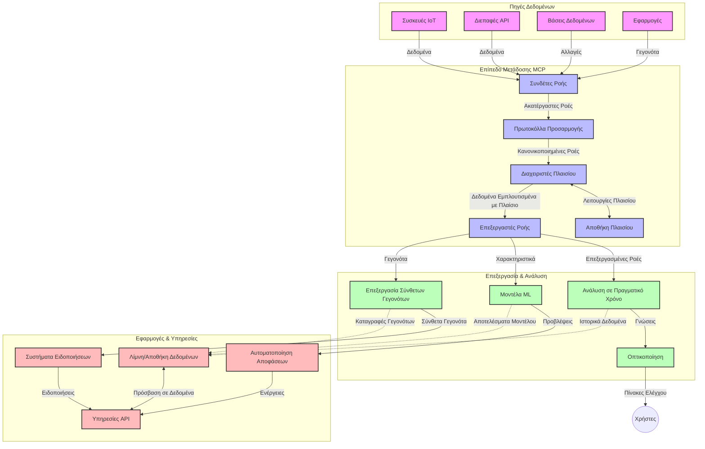

# Πρωτόκολλο Πλαισίου Μοντέλου για Ροή Δεδομένων σε Πραγματικό Χρόνο

## Επισκόπηση

Η ροή δεδομένων σε πραγματικό χρόνο έχει γίνει απαραίτητη στον σύγχρονο κόσμο που βασίζεται στα δεδομένα, όπου οι επιχειρήσεις και οι εφαρμογές απαιτούν άμεση πρόσβαση σε πληροφορίες για να λαμβάνουν έγκαιρες αποφάσεις. Το Πρωτόκολλο Πλαισίου Μοντέλου (MCP) αντιπροσωπεύει μια σημαντική πρόοδο στη βελτιστοποίηση αυτών των διαδικασιών ροής σε πραγματικό χρόνο, ενισχύοντας την αποδοτικότητα της επεξεργασίας δεδομένων, διατηρώντας την ακεραιότητα του πλαισίου και βελτιώνοντας την συνολική απόδοση του συστήματος.

Αυτό το μάθημα εξερευνά πώς το MCP μετασχηματίζει τη ροή δεδομένων σε πραγματικό χρόνο, παρέχοντας μια τυποποιημένη προσέγγιση στη διαχείριση πλαισίου μεταξύ μοντέλων τεχνητής νοημοσύνης, πλατφορμών ροής και εφαρμογών.

## Εισαγωγή στη Ροή Δεδομένων σε Πραγματικό Χρόνο

Η ροή δεδομένων σε πραγματικό χρόνο είναι ένα τεχνολογικό παράδειγμα που επιτρέπει τη συνεχή μετάδοση, επεξεργασία και ανάλυση δεδομένων καθώς παράγονται, δίνοντας τη δυνατότητα στα συστήματα να ανταποκρίνονται άμεσα σε νέες πληροφορίες. Σε αντίθεση με την παραδοσιακή επεξεργασία πακέτων που λειτουργεί σε στατικά σύνολα δεδομένων, η ροή επεξεργάζεται δεδομένα εν κινήσει, παρέχοντας ιδέες και ενέργειες με ελάχιστη καθυστέρηση.

### Βασικές Έννοιες της Ροής Δεδομένων σε Πραγματικό Χρόνο:

- **Συνεχής Ροή Δεδομένων**: Τα δεδομένα επεξεργάζονται ως μια συνεχής, αδιάκοπη ροή γεγονότων ή εγγραφών.
- **Επεξεργασία Χαμηλής Καθυστέρησης**: Τα συστήματα σχεδιάζονται για να ελαχιστοποιούν το χρόνο μεταξύ της παραγωγής και της επεξεργασίας των δεδομένων.
- **Κλιμακωσιμότητα**: Οι αρχιτεκτονικές ροής πρέπει να διαχειρίζονται μεταβλητούς όγκους και ταχύτητες δεδομένων.
- **Ανοχή σε Σφάλματα**: Τα συστήματα πρέπει να είναι ανθεκτικά σε αποτυχίες για να εξασφαλίζουν αδιάλειπτη ροή δεδομένων.
- **Κατάσταση Επεξεργασίας**: Η διατήρηση του πλαισίου ανάμεσα σε γεγονότα είναι κρίσιμη για ουσιαστική ανάλυση.

### Το Πρωτόκολλο Πλαισίου Μοντέλου και η Ροή σε Πραγματικό Χρόνο

Το Πρωτόκολλο Πλαισίου Μοντέλου (MCP) αντιμετωπίζει ορισμένες κρίσιμες προκλήσεις σε περιβάλλοντα ροής σε πραγματικό χρόνο:

1. **Συνέχεια Πλαισίου**: Το MCP τυποποιεί τον τρόπο με τον οποίο διατηρείται το πλαίσιο ανάμεσα σε κατανεμημένα στοιχεία ροής, διασφαλίζοντας ότι τα μοντέλα τεχνητής νοημοσύνης και οι κόμβοι επεξεργασίας έχουν πρόσβαση σε σχετικό ιστορικό και περιβαλλοντικό πλαίσιο.

2. **Αποδοτική Διαχείριση Κατάστασης**: Παρέχοντας δομημένους μηχανισμούς για τη μετάδοση πλαισίου, το MCP μειώνει το κόστος διαχείρισης κατάστασης στις γραμμές ροής.

3. **Διαλειτουργικότητα**: Το MCP δημιουργεί μια κοινή γλώσσα για τη διαμοίραση πλαισίου ανάμεσα σε διαφορετικές τεχνολογίες ροής και μοντέλα τεχνητής νοημοσύνης, επιτρέποντας πιο ευέλικτες και επεκτάσιμες αρχιτεκτονικές.

4. **Πλαίσιο Βελτιστοποιημένο για Ροή**: Οι υλοποιήσεις MCP μπορούν να δίνουν προτεραιότητα στα πλαίσια που είναι πιο σχετικά για τη λήψη αποφάσεων σε πραγματικό χρόνο, βελτιώνοντας τόσο την απόδοση όσο και την ακρίβεια.

5. **Προσαρμοστική Επεξεργασία**: Με κατάλληλη διαχείριση πλαισίου μέσω MCP, τα συστήματα ροής μπορούν να προσαρμόζουν δυναμικά την επεξεργασία βάσει εξελισσόμενων συνθηκών και προτύπων στα δεδομένα.

Σε σύγχρονες εφαρμογές που εκτείνονται από δίκτυα αισθητήρων IoT έως χρηματοοικονομικές πλατφόρμες συναλλαγών, η ενσωμάτωση του MCP με τις τεχνολογίες ροής επιτρέπει πιο έξυπνη, ευφυή επεξεργασία με επίγνωση πλαισίου που μπορεί να ανταποκριθεί κατάλληλα σε πολύπλοκες, εξελισσόμενες καταστάσεις σε πραγματικό χρόνο.

## Μαθησιακοί Στόχοι

Μέχρι το τέλος αυτής της ενότητας, θα είστε σε θέση να:

- Κατανοήσετε τις βασικές αρχές της ροής δεδομένων σε πραγματικό χρόνο και τις προκλήσεις της
- Εξηγήσετε πώς το Πρωτόκολλο Πλαισίου Μοντέλου (MCP) βελτιώνει τη ροή δεδομένων σε πραγματικό χρόνο
- Υλοποιήσετε λύσεις ροής βασισμένες στο MCP χρησιμοποιώντας δημοφιλή πλαίσια όπως Kafka και Pulsar
- Σχεδιάσετε και αναπτύξετε ανθεκτικές σε σφάλματα, υψηλής απόδοσης αρχιτεκτονικές ροής με MCP
- Εφαρμόσετε τις έννοιες MCP σε περιπτώσεις χρήσης IoT, χρηματοοικονομικών συναλλαγών και αναλύσεων που βασίζονται σε AI
- Αξιολογήσετε τις αναδυόμενες τάσεις και τις μελλοντικές καινοτομίες στις τεχνολογίες ροής βασισμένες σε MCP

### Ορισμός και Σημασία

Η ροή δεδομένων σε πραγματικό χρόνο περιλαμβάνει τη συνεχή παραγωγή, επεξεργασία και παράδοση δεδομένων με ελάχιστη καθυστέρηση. Σε αντίθεση με την επεξεργασία πακέτων, όπου τα δεδομένα συλλέγονται και επεξεργάζονται ομαδικά, η ροή δεδομένων επεξεργάζεται σταδιακά καθώς αυτά φτάνουν, παρέχοντας άμεσες ιδέες και ενέργειες.

Βασικά χαρακτηριστικά της ροής δεδομένων σε πραγματικό χρόνο περιλαμβάνουν:

- **Χαμηλή Καθυστέρηση**: Επεξεργασία και ανάλυση δεδομένων μέσα σε χιλιοστά του δευτερολέπτου έως δευτερόλεπτα
- **Συνεχής Ροή**: Αδιάκοπες ροές δεδομένων από διάφορες πηγές
- **Άμεση Επεξεργασία**: Ανάλυση δεδομένων καθώς φτάνουν και όχι σε παρτίδες
- **Αρχιτεκτονική Προσανατολισμένη σε Γεγονότα**: Αντίδραση σε γεγονότα καθώς συμβαίνουν

### Προκλήσεις στην Παραδοσιακή Ροή Δεδομένων

Οι παραδοσιακές προσεγγίσεις ροής δεδομένων αντιμετωπίζουν αρκετούς περιορισμούς:

1. **Απώλεια Πλαισίου**: Δυσκολία διατήρησης πλαισίου σε κατανεμημένα συστήματα
2. **Προβλήματα Κλιμάκωσης**: Προκλήσεις στην κλιμάκωση για διαχείριση μεγάλου όγκου και υψηλής ταχύτητας δεδομένων
3. **Πολυπλοκότητα Ενσωμάτωσης**: Δυσκολίες στη διαλειτουργικότητα ανάμεσα σε διαφορετικά συστήματα
4. **Διαχείριση Καθυστέρησης**: Ισορροπία ανάμεσα στην απόδοση και το χρόνο επεξεργασίας
5. **Συνέπεια Δεδομένων**: Εξασφάλιση ακρίβειας και πληρότητας δεδομένων σε όλη τη ροή

## Κατανόηση του Πρωτοκόλλου Πλαισίου Μοντέλου (MCP)

### Τι είναι το MCP;

Το Πρωτόκολλο Πλαισίου Μοντέλου (MCP) είναι ένα τυποποιημένο πρωτόκολλο επικοινωνίας σχεδιασμένο να διευκολύνει την αποδοτική αλληλεπίδραση ανάμεσα σε μοντέλα τεχνητής νοημοσύνης και εφαρμογές. Στο πλαίσιο της ροής δεδομένων σε πραγματικό χρόνο, το MCP παρέχει ένα πλαίσιο για:

- Τη διατήρηση του πλαισίου καθόλη τη διαδρομή των δεδομένων
- Την τυποποίηση των φορμά ανταλλαγής δεδομένων
- Τη βελτιστοποίηση της μετάδοσης μεγάλων συνόλων δεδομένων
- Την ενίσχυση της επικοινωνίας μοντέλου-προς-μοντέλο και μοντέλου-προς-εφαρμογή

### Κύρια Στοιχεία και Αρχιτεκτονική

Η αρχιτεκτονική του MCP για ροή δεδομένων σε πραγματικό χρόνο περιλαμβάνει διάφορα βασικά στοιχεία:

1. **Διαχειριστές Πλαισίου**: Διαχειρίζονται και διατηρούν τις πληροφορίες πλαισίου σε όλη τη γραμμή ροής
2. **Επεξεργαστές Ροής**: Επεξεργάζονται εισερχόμενες ροές δεδομένων με τεχνικές επίγνωσης πλαισίου
3. **Προσαρμογείς Πρωτοκόλλου**: Μετατρέπουν ανάμεσα σε διαφορετικά πρωτόκολλα ροής διατηρώντας το πλαίσιο
4. **Αποθήκη Πλαισίου**: Αποθηκεύει και ανακτά αποδοτικά τις πληροφορίες πλαισίου
5. **Συνδετήρες Ροής**: Συνδέονται με διάφορες πλατφόρμες ροής (Kafka, Pulsar, Kinesis κ.ά.)




### Πώς το MCP Βελτιώνει τη Διαχείριση Δεδομένων σε Πραγματικό Χρόνο

Το MCP αντιμετωπίζει τις παραδοσιακές προκλήσεις της ροής μέσω:

- **Ακεραιότητας Πλαισίου**: Διατήρηση σχέσεων μεταξύ σημείων δεδομένων σε όλη τη γραμμή ροής
- **Βελτιστοποίηση Μετάδοσης**: Μείωση της υπερβολής στην ανταλλαγή δεδομένων μέσω έξυπνης διαχείρισης πλαισίου
- **Τυποποιημένων Διεπαφών**: Παροχή συνεπών API για τα στοιχεία της ροής
- **Μείωση Καθυστέρησης**: Ελαχιστοποίηση του κόστους επεξεργασίας μέσω αποδοτικής διαχείρισης πλαισίου
- **Αυξημένη Κλιμακωσιμότητα**: Υποστήριξη οριζόντιας κλιμάκωσης με διατήρηση πλαισίου

## Ενσωμάτωση και Υλοποίηση

Τα συστήματα ροής δεδομένων σε πραγματικό χρόνο απαιτούν προσεκτικό σχεδιασμό και υλοποίηση για τη διατήρηση τόσο της απόδοσης όσο και της ακεραιότητας του πλαισίου. Το Πρωτόκολλο Πλαισίου Μοντέλου προσφέρει μια τυποποιημένη προσέγγιση για την ενσωμάτωση μοντέλων τεχνητής νοημοσύνης και τεχνολογιών ροής, επιτρέποντας δημιουργία πιο εξελιγμένων, με επίγνωση του πλαισίου, αγωγών επεξεργασίας.

### Επισκόπηση της Ενσωμάτωσης MCP σε Αρχιτεκτονικές Ροής

Η υλοποίηση του MCP σε περιβάλλοντα ροής σε πραγματικό χρόνο περιλαμβάνει βασικές παραμέτρους:

1. **Σειριοποίηση και Μεταφορά Πλαισίου**: Το MCP παρέχει αποδοτικούς μηχανισμούς κωδικοποίησης των πληροφοριών πλαισίου μέσα σε πακέτα δεδομένων ροής, διασφαλίζοντας ότι το ουσιώδες πλαίσιο ακολουθεί τα δεδομένα μέχρι το τέλος της γραμμής επεξεργασίας. Αυτό περιλαμβάνει τυποποιημένα φορμά σειριοποίησης βελτιστοποιημένα για μεταφορά ροής.

2. **Κατάσταση-εξαρτώμενη Επεξεργασία Ροής**: Το MCP επιτρέπει πιο ευφυή κατάσταση-εξαρτώμενη επεξεργασία μέσω διατήρησης συνεπούς αναπαράστασης πλαισίου σε κόμβους επεξεργασίας. Αυτό είναι ιδιαίτερα πολύτιμο σε κατανεμημένες αρχιτεκτονικές όπου η διαχείριση κατάστασης είναι συνήθως δύσκολη.

3. **Χρόνος Γεγονότος έναντι Χρόνου Επεξεργασίας**: Οι υλοποιήσεις MCP σε συστήματα ροής πρέπει να αντιμετωπίζουν την κοινή πρόκληση της διάκρισης μεταξύ της στιγμής που συνέβησαν τα γεγονότα και της στιγμής που επεξεργάζονται. Το πρωτόκολλο μπορεί να ενσωματώνει χρονικό πλαίσιο που διατηρεί τη σημασιολογία του χρόνου γεγονότος.

4. **Διαχείριση Πίεσης Πίσω (Backpressure)**: Τυποποιώντας τη διαχείριση πλαισίου, το MCP βοηθά στη ρύθμιση της πίεσης πίσω στα συστήματα ροής, επιτρέποντας στα στοιχεία να επικοινωνούν τις δυνατότητες επεξεργασίας τους και να προσαρμόζουν τη ροή ανάλογα.

5. **Παράθυρα και Συγκεντρώσεις Πλαισίου**: Το MCP διευκολύνει πιο εξελιγμένες λειτουργίες παραθύρων, παρέχοντας δομημένες αναπαραστάσεις χρονικών και σχεσιακών πλαισίων, επιτρέποντας πιο ουσιαστικές συγκεντρώσεις σε ροές γεγονότων.

6. **Επεξεργασία Ακριβώς Μία Φορά (Exactly-Once)**: Σε συστήματα ροής που απαιτούν ακριβώς-μία-φορά σημασιολογία, το MCP μπορεί να ενσωματώνει μεταδεδομένα επεξεργασίας για να βοηθήσει στον εντοπισμό και την επαλήθευση της κατάστασης επεξεργασίας σε κατανεμημένα μέρη.

Η υλοποίηση του MCP σε διάφορες τεχνολογίες ροής δημιουργεί μια ενιαία προσέγγιση στη διαχείριση πλαισίου, μειώνοντας την ανάγκη για ειδικό κώδικα ενσωμάτωσης ενώ βελτιώνει την ικανότητα του συστήματος να διατηρεί ουσιαστικό πλαίσιο καθώς τα δεδομένα ρέουν μέσα από την αγωγό επεξεργασίας.

### MCP σε Διάφορα Πλαίσια Ροής Δεδομένων

Αυτά τα παραδείγματα ακολουθούν την τρέχουσα προδιαγραφή MCP που εστιάζει σε ένα πρωτόκολλο βασισμένο σε JSON-RPC με διακριτούς μηχανισμούς μεταφοράς. Ο κώδικας δείχνει πώς μπορείτε να υλοποιήσετε προσαρμοσμένα μέσα μεταφοράς που ενσωματώνουν πλατφόρμες ροής όπως Kafka και Pulsar, διατηρώντας πλήρη συμβατότητα με το πρωτόκολλο MCP.

Τα παραδείγματα έχουν σχεδιαστεί για να δείξουν πώς οι πλατφόρμες ροής μπορούν να ενσωματωθούν με το MCP για να παρέχουν επεξεργασία δεδομένων σε πραγματικό χρόνο διατηρώντας την επίγνωση του πλαισίου που είναι κεντρική στο MCP. Αυτή η προσέγγιση διασφαλίζει ότι τα δείγματα κώδικα αντανακλούν με ακρίβεια την τρέχουσα κατάσταση της προδιαγραφής MCP έως τον Ιούνιο 2025.

Το MCP μπορεί να ενσωματωθεί με δημοφιλή πλαίσια ροής όπως:

#### Ενσωμάτωση Apache Kafka

```python
import asyncio
import json
from typing import Dict, Any, Optional
from confluent_kafka import Consumer, Producer, KafkaError
from mcp.client import Client, ClientCapabilities
from mcp.core.message import JsonRpcMessage
from mcp.core.transports import Transport

# Προσαρμοσμένη κλάση μεταφοράς για τη σύνδεση MCP με Kafka
class KafkaMCPTransport(Transport):
    def __init__(self, bootstrap_servers: str, input_topic: str, output_topic: str):
        self.bootstrap_servers = bootstrap_servers
        self.input_topic = input_topic
        self.output_topic = output_topic
        self.producer = Producer({'bootstrap.servers': bootstrap_servers})
        self.consumer = Consumer({
            'bootstrap.servers': bootstrap_servers,
            'group.id': 'mcp-client-group',
            'auto.offset.reset': 'earliest'
        })
        self.message_queue = asyncio.Queue()
        self.running = False
        self.consumer_task = None
        
    async def connect(self):
        """Connect to Kafka and start consuming messages"""
        self.consumer.subscribe([self.input_topic])
        self.running = True
        self.consumer_task = asyncio.create_task(self._consume_messages())
        return self
        
    async def _consume_messages(self):
        """Background task to consume messages from Kafka and queue them for processing"""
        while self.running:
            try:
                msg = self.consumer.poll(1.0)
                if msg is None:
                    await asyncio.sleep(0.1)
                    continue
                
                if msg.error():
                    if msg.error().code() == KafkaError._PARTITION_EOF:
                        continue
                    print(f"Consumer error: {msg.error()}")
                    continue
                
                # Ανάλυση της τιμής μηνύματος ως JSON-RPC
                try:
                    message_str = msg.value().decode('utf-8')
                    message_data = json.loads(message_str)
                    mcp_message = JsonRpcMessage.from_dict(message_data)
                    await self.message_queue.put(mcp_message)
                except Exception as e:
                    print(f"Error parsing message: {e}")
            except Exception as e:
                print(f"Error in consumer loop: {e}")
                await asyncio.sleep(1)
    
    async def read(self) -> Optional[JsonRpcMessage]:
        """Read the next message from the queue"""
        try:
            message = await self.message_queue.get()
            return message
        except Exception as e:
            print(f"Error reading message: {e}")
            return None
    
    async def write(self, message: JsonRpcMessage) -> None:
        """Write a message to the Kafka output topic"""
        try:
            message_json = json.dumps(message.to_dict())
            self.producer.produce(
                self.output_topic,
                message_json.encode('utf-8'),
                callback=self._delivery_report
            )
            self.producer.poll(0)  # Εκκίνηση callbacks
        except Exception as e:
            print(f"Error writing message: {e}")
    
    def _delivery_report(self, err, msg):
        """Kafka producer delivery callback"""
        if err is not None:
            print(f'Message delivery failed: {err}')
        else:
            print(f'Message delivered to {msg.topic()} [{msg.partition()}]')
    
    async def close(self) -> None:
        """Close the transport"""
        self.running = False
        if self.consumer_task:
            self.consumer_task.cancel()
            try:
                await self.consumer_task
            except asyncio.CancelledError:
                pass
        self.consumer.close()
        self.producer.flush()

# Παράδειγμα χρήσης της μεταφοράς Kafka MCP
async def kafka_mcp_example():
    # Δημιουργία πελάτη MCP με μεταφορά Kafka
    client = Client(
        {"name": "kafka-mcp-client", "version": "1.0.0"},
        ClientCapabilities({})
    )
    
    # Δημιουργία και σύνδεση της μεταφοράς Kafka
    transport = KafkaMCPTransport(
        bootstrap_servers="localhost:9092",
        input_topic="mcp-responses",
        output_topic="mcp-requests"
    )
    
    await client.connect(transport)
    
    try:
        # Αρχικοποίηση της συνεδρίας MCP
        await client.initialize()
        
        # Παράδειγμα εκτέλεσης εργαλείου μέσω MCP
        response = await client.execute_tool(
            "process_data",
            {
                "data": "sample data",
                "metadata": {
                    "source": "sensor-1",
                    "timestamp": "2025-06-12T10:30:00Z"
                }
            }
        )
        
        print(f"Tool execution response: {response}")
        
        # Καθαρό τερματισμό
        await client.shutdown()
    finally:
        await transport.close()

# Εκτέλεση του παραδείγματος
if __name__ == "__main__":
    asyncio.run(kafka_mcp_example())
```


#### Υλοποίηση Apache Pulsar

```python
import asyncio
import json
import pulsar
from typing import Dict, Any, Optional
from mcp.core.message import JsonRpcMessage
from mcp.core.transports import Transport
from mcp.server import Server, ServerOptions
from mcp.server.tools import Tool, ToolExecutionContext, ToolMetadata

# Δημιουργήστε μια προσαρμοσμένη μεταφορά MCP που χρησιμοποιεί το Pulsar
class PulsarMCPTransport(Transport):
    def __init__(self, service_url: str, request_topic: str, response_topic: str):
        self.service_url = service_url
        self.request_topic = request_topic
        self.response_topic = response_topic
        self.client = pulsar.Client(service_url)
        self.producer = self.client.create_producer(response_topic)
        self.consumer = self.client.subscribe(
            request_topic,
            "mcp-server-subscription",
            consumer_type=pulsar.ConsumerType.Shared
        )
        self.message_queue = asyncio.Queue()
        self.running = False
        self.consumer_task = None
    
    async def connect(self):
        """Connect to Pulsar and start consuming messages"""
        self.running = True
        self.consumer_task = asyncio.create_task(self._consume_messages())
        return self
    
    async def _consume_messages(self):
        """Background task to consume messages from Pulsar and queue them for processing"""
        while self.running:
            try:
                # Μη αποκλειστική λήψη με χρονικό όριο
                msg = self.consumer.receive(timeout_millis=500)
                
                # Επεξεργαστείτε το μήνυμα
                try:
                    message_str = msg.data().decode('utf-8')
                    message_data = json.loads(message_str)
                    mcp_message = JsonRpcMessage.from_dict(message_data)
                    await self.message_queue.put(mcp_message)
                    
                    # Επιβεβαιώστε το μήνυμα
                    self.consumer.acknowledge(msg)
                except Exception as e:
                    print(f"Error processing message: {e}")
                    # Αρνητική επιβεβαίωση εάν υπήρξε σφάλμα
                    self.consumer.negative_acknowledge(msg)
            except Exception as e:
                # Διαχειριστείτε χρονικό όριο ή άλλες εξαιρέσεις
                await asyncio.sleep(0.1)
    
    async def read(self) -> Optional[JsonRpcMessage]:
        """Read the next message from the queue"""
        try:
            message = await self.message_queue.get()
            return message
        except Exception as e:
            print(f"Error reading message: {e}")
            return None
    
    async def write(self, message: JsonRpcMessage) -> None:
        """Write a message to the Pulsar output topic"""
        try:
            message_json = json.dumps(message.to_dict())
            self.producer.send(message_json.encode('utf-8'))
        except Exception as e:
            print(f"Error writing message: {e}")
    
    async def close(self) -> None:
        """Close the transport"""
        self.running = False
        if self.consumer_task:
            self.consumer_task.cancel()
            try:
                await self.consumer_task
            except asyncio.CancelledError:
                pass
        self.consumer.close()
        self.producer.close()
        self.client.close()

# Ορίστε ένα δείγμα εργαλείου MCP που επεξεργάζεται ροή δεδομένων
@Tool(
    name="process_streaming_data",
    description="Process streaming data with context preservation",
    metadata=ToolMetadata(
        required_capabilities=["streaming"]
    )
)
async def process_streaming_data(
    ctx: ToolExecutionContext,
    data: str,
    source: str,
    priority: str = "medium"
) -> Dict[str, Any]:
    """
    Process streaming data while preserving context
    
    Args:
        ctx: Tool execution context
        data: The data to process
        source: The source of the data
        priority: Priority level (low, medium, high)
        
    Returns:
        Dict containing processed results and context information
    """
    # Παράδειγμα επεξεργασίας που αξιοποιεί το πλαίσιο MCP
    print(f"Processing data from {source} with priority {priority}")
    
    # Πρόσβαση στο πλαίσιο συνομιλίας από το MCP
    conversation_id = ctx.conversation_id if hasattr(ctx, 'conversation_id') else "unknown"
    
    # Επιστροφή αποτελεσμάτων με βελτιωμένο πλαίσιο
    return {
        "processed_data": f"Processed: {data}",
        "context": {
            "conversation_id": conversation_id,
            "source": source,
            "priority": priority,
            "processing_timestamp": ctx.get_current_time_iso()
        }
    }

# Παράδειγμα υλοποίησης διακομιστή MCP χρησιμοποιώντας τη μεταφορά Pulsar
async def run_mcp_server_with_pulsar():
    # Δημιουργία διακομιστή MCP
    server = Server(
        {"name": "pulsar-mcp-server", "version": "1.0.0"},
        ServerOptions(
            capabilities={"streaming": True}
        )
    )
    
    # Καταχώριση του εργαλείου μας
    server.register_tool(process_streaming_data)
    
    # Δημιουργία και σύνδεση μεταφοράς Pulsar
    transport = PulsarMCPTransport(
        service_url="pulsar://localhost:6650",
        request_topic="mcp-requests",
        response_topic="mcp-responses"
    )
    
    try:
        # Εκκίνηση του διακομιστή με τη μεταφορά Pulsar
        await server.run(transport)
    finally:
        await transport.close()

# Εκτέλεση του διακομιστή
if __name__ == "__main__":
    asyncio.run(run_mcp_server_with_pulsar())
```


### Καλές Πρακτικές για Ανάπτυξη

Όταν εφαρμόζετε το MCP για ροή σε πραγματικό χρόνο:

1. **Σχεδιάστε για Ανοχή σε Σφάλματα**:
   - Υλοποιήστε σωστή διαχείριση σφαλμάτων
   - Χρησιμοποιήστε ουρές dead-letter για αποτυχημένα μηνύματα
   - Σχεδιάστε επεξεργαστές που δεν παράγουν αλλαγές από πολλαπλές κλήσεις (idempotent)

2. **Βελτιστοποιήστε για Απόδοση**:
   - Διαμορφώστε κατάλληλα μεγέθη buffer
   - Χρησιμοποιήστε παρτίδες όπου είναι σκόπιμο
   - Υλοποιήστε μηχανισμούς πίεσης πίσω (backpressure)

3. **Παρακολουθήστε και Επιθεωρήστε**:
   - Παρακολουθήστε μετρικές επεξεργασίας ροής
   - Ελέγξτε τη διάδοση του πλαισίου
   - Ρυθμίστε ειδοποιήσεις για ανωμαλίες

4. **Ασφαλίστε τις Ροές σας**:
   - Εφαρμόστε κρυπτογράφηση για ευαίσθητα δεδομένα
   - Χρησιμοποιήστε πιστοποίηση και εξουσιοδότηση
   - Εφαρμόστε κατάλληλους ελέγχους πρόσβασης

### MCP στο IoT και την Περιφερειακή Υπολογιστική (Edge Computing)

Το MCP ενισχύει τη ροή δεδομένων IoT με:

- Διατήρηση του πλαισίου της συσκευής σε όλη τη γραμμή επεξεργασίας
- Δυνατότητα αποδοτικής ροής δεδομένων από άκρη στο σύννεφο
- Υποστήριξη ανάλυσης σε πραγματικό χρόνο σε ροές IoT
- Διευκόλυνση επικοινωνίας συσκευής προς συσκευή με πλαίσιο

Παράδειγμα: Δίκτυα Αισθητήρων Εξυπνών Πόλεων  
```
Sensors → Edge Gateways → MCP Stream Processors → Real-time Analytics → Automated Responses
```


### Ρόλος στις Χρηματοοικονομικές Συναλλαγές και Συναλλαγές Υψηλής Συχνότητας

Το MCP παρέχει σημαντικά πλεονεκτήματα στη ροή χρηματοοικονομικών δεδομένων:

- Επεξεργασία με εξαιρετικά χαμηλή καθυστέρηση για αποφάσεις συναλλαγών
- Διατήρηση του πλαισίου συναλλαγής καθ’ όλη τη διάρκεια της επεξεργασίας
- Υποστήριξη σύνθετης επεξεργασίας γεγονότων με επίγνωση πλαισίου
- Εξασφάλιση συνέπειας δεδομένων σε κατανεμημένα συστήματα συναλλαγών

### Ενίσχυση των Αναλύσεων με Οδήγηση από Τεχνητή Νοημοσύνη

Το MCP δημιουργεί νέες δυνατότητες για αναλύσεις ροής:

- Εκπαίδευση και συμπερασματολογία μοντέλων σε πραγματικό χρόνο
- Συνεχής μάθηση από ροές δεδομένων
- Εξαγωγή χαρακτηριστικών με επίγνωση πλαισίου
- Αγωγοί πολλαπλών μοντέλων συμπερασμάτων με διατηρημένο πλαίσιο

## Μελλοντικές Τάσεις και Καινοτομίες

### Εξέλιξη του MCP σε Περιβάλλοντα Πραγματικού Χρόνου

Κοιτώντας μπροστά, προβλέπουμε ότι το MCP θα εξελιχθεί για να αντιμετωπίσει:

- **Ενσωμάτωση Κβαντικού Υπολογισμού**: Προετοιμασία για συστήματα ροής βασισμένα σε κβαντική υπολογιστική
- **Επεξεργασία Αυτόχθονη στην Άκρη (Edge-Native)**: Μεταφορά περισσότερης επεξεργασίας επίγνωσης πλαισίου σε συσκευές άκρης
- **Αυτόνομη Διαχείριση Ροής**: Αυτοβελτιστοποιούμενοι αγωγοί ροής
- **Ομοσπονδιακή Ροή**: Κατανεμημένη επεξεργασία με διατήρηση της ιδιωτικότητας

### Δυνατές Προόδους σε Τεχνολογία

Αναδυόμενες τεχνολογίες που θα διαμορφώσουν το μέλλον του MCP στη ροή:

1. **Πρωτόκολλα Ροής Βελτιστοποιημένα για AI**: Ειδικά σχεδιασμένα πρωτόκολλα για φορτία εργασίας AI
2. **Ενσωμάτωση Νευρομορφικής Υπολογιστικής**: Υπολογιστική εμπνευσμένη από τον εγκέφαλο για επεξεργασία ροής
3. **Ροή χωρίς Διακομιστή (Serverless Streaming)**: Ροές κλιμακούμενες και προσανατολισμένες σε γεγονότα χωρίς διαχείριση υποδομής
4. **Κατανεμημένες Αποθήκες Πλαισίου**: Παγκοσμίως κατανεμημένη αλλά εξαιρετικά συνεπής διαχείριση πλαισίου

## Πρακτικές Ασκήσεις

### Άσκηση 1: Ρύθμιση Βασικού Αγωγού Ροής MCP

Σε αυτή την άσκηση, θα μάθετε πώς να:  
- Διαμορφώσετε ένα βασικό περιβάλλον ροής MCP  
- Υλοποιήσετε διαχειριστές πλαισίου για επεξεργασία ροής  
- Δοκιμάσετε και επαληθεύσετε τη διατήρηση πλαισίου

### Άσκηση 2: Δημιουργία Πίνακα Ελέγχου Αναλύσεων σε Πραγματικό Χρόνο

Δημιουργήστε μια πλήρη εφαρμογή που:  
- Εισάγει δεδομένα ροής χρησιμοποιώντας MCP  
- Επεξεργάζεται τη ροή διατηρώντας το πλαίσιο  
- Οπτικοποιεί τα αποτελέσματα σε πραγματικό χρόνο

### Άσκηση 3: Υλοποίηση Σύνθετης Επεξεργασίας Γεγονότων με MCP

Προχωρημένη άσκηση που καλύπτει:  
- Ανίχνευση προτύπων σε ροές  
- Πλασμτική συσχέτιση μεταξύ πολλαπλών ροών  
- Παραγωγή σύνθετων γεγονότων με διατηρημένο πλαίσιο

## Πρόσθετοι Πόροι

- [Model Context Protocol Specification](https://modelcontextprotocol.io) - Επίσημη προδιαγραφή και τεκμηρίωση MCP  
- [Apache Kafka Documentation](https://kafka.apache.org/documentation/) - Μάθετε για το Kafka για επεξεργασία ροής  
- [Apache Pulsar](https://pulsar.apache.org/) - Ενοποιημένη πλατφόρμα μηνυμάτων και ροής  
- [Streaming Systems: The What, Where, When, and How of Large-Scale Data Processing](https://www.oreilly.com/library/view/streaming-systems/9781491983867/) - Εκτενές βιβλίο για αρχιτεκτονικές ροής  
- [Microsoft Azure Event Hubs](https://learn.microsoft.com/azure/event-hubs/event-hubs-about) - Διαχειριζόμενη υπηρεσία ροής γεγονότων  
- [MLflow Documentation](https://mlflow.org/docs/latest/index.html) - Για παρακολούθηση και ανάπτυξη μοντέλων ML  
- [Real-Time Analytics with Apache Storm](https://storm.apache.org/releases/current/index.html) - Πλαίσιο επεξεργασίας σε πραγματικό χρόνο  
- [Flink ML](https://nightlies.apache.org/flink/flink-ml-docs-master/) - Βιβλιοθήκη μηχανικής μάθησης για Apache Flink  
- [LangChain Documentation](https://python.langchain.com/docs/get_started/introduction) - Δημιουργία εφαρμογών με Μεγάλα Γλωσσικά Μοντέλα (LLMs)  

## Μαθησιακά Αποτελέσματα

Ολοκληρώνοντας αυτή την ενότητα, θα μπορείτε να:

- Κατανοείτε τις βασικές αρχές της ροής δεδομένων σε πραγματικό χρόνο και τις προκλήσεις της  
- Εξηγείτε πώς το Πρωτόκολλο Πλαισίου Μοντέλου (MCP) βελτιώνει τη ροή δεδομένων σε πραγματικό χρόνο  
- Υλοποιείτε λύσεις ροής βασισμένες στο MCP χρησιμοποιώντας δημοφιλή πλαίσια όπως Kafka και Pulsar  
- Σχεδιάζετε και αναπτύσσετε ανθεκτικές σε σφάλματα, υψηλής απόδοσης αρχιτεκτονικές ροής με MCP  
- Εφαρμόζετε έννοιες MCP σε περιπτώσεις χρήσης IoT, χρηματοοικονομικών συναλλαγών και AI  
- Αξιολογείτε νέες τάσεις και καινοτομίες σε τεχνολογίες ροής βασισμένες σε MCP  

## Τι ακολουθεί

- [5.11 Αναζήτηση σε Πραγματικό Χρόνο](../mcp-realtimesearch/README.md)

---

<!-- CO-OP TRANSLATOR DISCLAIMER START -->
**Αποποίηση ευθυνών**:
Αυτό το έγγραφο έχει μεταφραστεί χρησιμοποιώντας την υπηρεσία μετάφρασης με τεχνητή νοημοσύνη [Co-op Translator](https://github.com/Azure/co-op-translator). Ενώ επιδιώκουμε την ακρίβεια, παρακαλούμε να έχετε υπόψη ότι οι αυτοματοποιημένες μεταφράσεις ενδέχεται να περιέχουν λάθη ή ανακρίβειες. Το πρωτότυπο έγγραφο στη μητρική του γλώσσα πρέπει να θεωρείται η αυθεντική πηγή. Για κρίσιμες πληροφορίες, συνιστάται επαγγελματική ανθρώπινη μετάφραση. Δεν φέρουμε ευθύνη για τυχόν παρεξηγήσεις ή λανθασμένες ερμηνείες που προκύπτουν από τη χρήση αυτής της μετάφρασης.
<!-- CO-OP TRANSLATOR DISCLAIMER END -->