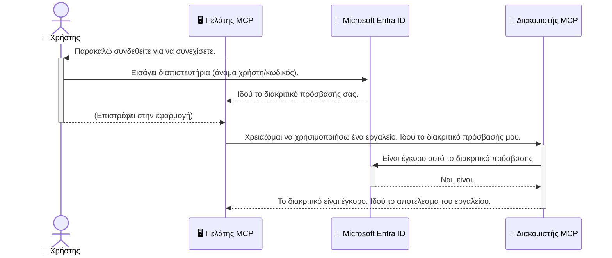

# Ασφάλεια Ροών Εργασίας AI: Πιστοποίηση Entra ID για Διακομιστές Πρωτοκόλλου Συμφραζομένων Μοντέλου

## Εισαγωγή
Η ασφάλεια του διακομιστή Πρωτοκόλλου Συμφραζομένων Μοντέλου (MCP) είναι εξίσου σημαντική με το να κλειδώσεις την μπροστινή πόρτα του σπιτιού σου. Το να αφήσεις τον διακομιστή MCP ανοιχτό εκθέτει τα εργαλεία και τα δεδομένα σου σε μη εξουσιοδοτημένη πρόσβαση, κάτι που μπορεί να οδηγήσει σε παραβιάσεις ασφαλείας. Το Microsoft Entra ID παρέχει μια ισχυρή λύση διαχείρισης ταυτότητας και πρόσβασης βασισμένη στο cloud, βοηθώντας να διασφαλίσεις ότι μόνο εξουσιοδοτημένοι χρήστες και εφαρμογές μπορούν να αλληλεπιδράσουν με τον διακομιστή MCP σου. Σε αυτή την ενότητα, θα μάθεις πώς να προστατεύεις τις ροές εργασίας AI χρησιμοποιώντας την πιστοποίηση Entra ID.

## Μαθησιακοί Στόχοι
Στο τέλος αυτής της ενότητας, θα είσαι ικανός να:

- Κατανοείς τη σημασία της ασφάλειας των διακομιστών MCP.
- Εξηγείς τις βασικές αρχές του Microsoft Entra ID και της πιστοποίησης OAuth 2.0.
- Αναγνωρίζεις τη διαφορά μεταξύ δημόσιων και εμπιστευτικών πελατών.
- Εφαρμόζεις την πιστοποίηση Entra ID τόσο σε τοπικά (δημόσιοι πελάτες) όσο και σε απομακρυσμένα (εμπιστευτικοί πελάτες) σενάρια διακομιστών MCP.
- Εφαρμόζεις τις βέλτιστες πρακτικές ασφαλείας κατά την ανάπτυξη ροών εργασίας AI.

## Ασφάλεια και MCP

Όπως δεν θα άφηνες την μπροστινή πόρτα του σπιτιού σου ξεκλείδωτη, έτσι δεν πρέπει να αφήνεις τον διακομιστή MCP σου ανοιχτό για πρόσβαση από οποιονδήποτε. Η ασφάλεια των ροών εργασίας AI είναι απαραίτητη για τη δημιουργία ανθεκτικών, αξιόπιστων και ασφαλών εφαρμογών. Αυτό το κεφάλαιο θα σε εισαγάγει στη χρήση του Microsoft Entra ID για την ασφάλεια των διακομιστών MCP σου, εξασφαλίζοντας ότι μόνο εξουσιοδοτημένοι χρήστες και εφαρμογές μπορούν να αλληλεπιδράσουν με τα εργαλεία και τα δεδομένα σου.

## Γιατί η Ασφάλεια Έχει Σημασία για τους Διακομιστές MCP

Φαντάσου ότι ο διακομιστής MCP σου έχει ένα εργαλείο που μπορεί να στείλει emails ή να αποκτήσει πρόσβαση σε μια βάση δεδομένων πελατών. Ένας μη ασφαλής διακομιστής θα σήμαινε ότι οποιοσδήποτε θα μπορούσε θεωρητικά να χρησιμοποιήσει αυτό το εργαλείο, οδηγώντας σε μη εξουσιοδοτημένη πρόσβαση σε δεδομένα, ανεπιθύμητα μηνύματα ή άλλες κακόβουλες δραστηριότητες.

Με την υλοποίηση πιστοποίησης, διασφαλίζεις ότι κάθε αίτημα προς τον διακομιστή σου επαληθεύεται, επιβεβαιώνοντας την ταυτότητα του χρήστη ή της εφαρμογής που κάνει το αίτημα. Αυτό είναι το πρώτο και πιο κρίσιμο βήμα στην ασφάλεια των ροών εργασίας AI σου.

## Εισαγωγή στο Microsoft Entra ID

[**Microsoft Entra ID**](https://adoption.microsoft.com/microsoft-security/entra/) είναι μια υπηρεσία διαχείρισης ταυτότητας και πρόσβασης βασισμένη στο cloud. Σκέψου την ως έναν καθολικό φύλακα ασφαλείας για τις εφαρμογές σου. Αναλαμβάνει τη σύνθετη διαδικασία επαλήθευσης ταυτοτήτων χρηστών (πιστοποίηση) και καθορισμού τι επιτρέπεται να κάνουν (εξουσιοδότηση).

Χρησιμοποιώντας το Entra ID, μπορείς να:

- Ενεργοποιήσεις ασφαλές σύνδεση χρηστών.
- Προστατεύσεις APIs και υπηρεσίες.
- Διαχειριστείς πολιτικές πρόσβασης από ένα κεντρικό σημείο.

Για τους διακομιστές MCP, το Entra ID παρέχει μια ισχυρή και ευρέως αξιόπιστη λύση για τη διαχείριση ποιος μπορεί να αποκτήσει πρόσβαση στις δυνατότητες του διακομιστή σου.

---

## Κατανόηση της Μαγείας: Πώς Λειτουργεί η Πιστοποίηση Entra ID

Το Entra ID χρησιμοποιεί ανοιχτά πρότυπα όπως το **OAuth 2.0** για τη διαχείριση της πιστοποίησης. Αν και οι λεπτομέρειες μπορεί να είναι πολύπλοκες, η βασική ιδέα είναι απλή και μπορεί να κατανοηθεί με μια αναλογία.

### Μια Απαλή Εισαγωγή στο OAuth 2.0: Το Κλειδί Βαλέτ

Σκέψου το OAuth 2.0 ως μια υπηρεσία βαλέτ για το αυτοκίνητό σου. Όταν φτάνεις σε ένα εστιατόριο, δεν δίνεις στον βαλέτ το κύριο κλειδί σου. Αντίθετα, παρέχεις ένα **κλειδί βαλέτ** που έχει περιορισμένες εξουσιοδοτήσεις — μπορεί να ξεκινήσει το αυτοκίνητο και να κλειδώσει τις πόρτες, αλλά δεν μπορεί να ανοίξει το πορτ μπαγκάζ ή το ντουλαπάκι.

Σε αυτή την αναλογία:

- **Εσύ** είσαι ο **Χρήστης**.
- **Το αυτοκίνητό σου** είναι ο **Διακομιστής MCP** με τα πολύτιμα εργαλεία και δεδομένα του.
- Ο **Βαλέτ** είναι το **Microsoft Entra ID**.
- Ο **Φύλακας Στάθμευσης** είναι ο **Πελάτης MCP** (η εφαρμογή που προσπαθεί να αποκτήσει πρόσβαση στον διακομιστή).
- Το **Κλειδί Βαλέτ** είναι το **Access Token**.

Το access token είναι μια ασφαλής αλυσίδα κειμένου που λαμβάνει ο πελάτης MCP από το Entra ID μετά τη σύνδεσή σου. Ο πελάτης στη συνέχεια παρουσιάζει αυτό το token στον διακομιστή MCP με κάθε αίτημα. Ο διακομιστής μπορεί να επαληθεύσει το token για να βεβαιωθεί ότι το αίτημα είναι νόμιμο και ότι ο πελάτης έχει τις απαραίτητες εξουσιοδοτήσεις, όλα αυτά χωρίς να χρειάζεται ποτέ να χειριστεί τα πραγματικά στοιχεία σύνδεσής σου (όπως ο κωδικός σου).

### Η Ροή Πιστοποίησης

Ορίστε πώς λειτουργεί η διαδικασία στην πράξη:



### Εισαγωγή στην Βιβλιοθήκη Πιστοποίησης της Microsoft (MSAL)

Πριν εμβαθύνουμε στον κώδικα, είναι σημαντικό να παρουσιάσουμε ένα βασικό στοιχείο που θα δεις στα παραδείγματα: τη **Βιβλιοθήκη Πιστοποίησης της Microsoft (MSAL)**.

Το MSAL είναι μια βιβλιοθήκη που έχει αναπτύξει η Microsoft και που καθιστά πολύ πιο εύκολο για τους προγραμματιστές να χειρίζονται την πιστοποίηση. Αντί να χρειάζεται να γράψεις όλο τον πολύπλοκο κώδικα για να χειριστείς τα security tokens, τη διαχείριση εισόδου και την ανανέωση των συνεδριών, το MSAL αναλαμβάνει όλη τη δύσκολη δουλειά.

Η χρήση μιας βιβλιοθήκης σαν το MSAL συνιστάται έντονα επειδή:

- **Είναι Ασφαλές:** Υλοποιεί πρωτόκολλα στάνταρ του κλάδου και βέλτιστες πρακτικές ασφαλείας, μειώνοντας τον κίνδυνο ευπαθειών στον κώδικά σου.
- **Απλοποιεί την Ανάπτυξη:** Αφαιρεί την πολυπλοκότητα των πρωτοκόλλων OAuth 2.0 και OpenID Connect, επιτρέποντάς σου να προσθέσεις αξιόπιστη πιστοποίηση στην εφαρμογή σου με λίγες μόνο γραμμές κώδικα.
- **Συντηρείται Διαρκώς:** Η Microsoft διατηρεί και ενημερώνει ενεργά το MSAL για να ανταποκρίνεται σε νέες απειλές ασφαλείας και αλλαγές πλατφορμών.

Το MSAL υποστηρίζει μια μεγάλη ποικιλία γλωσσών και πλαισίων εφαρμογών, συμπεριλαμβανομένων των .NET, JavaScript/TypeScript, Python, Java, Go και κινητών πλατφορμών όπως iOS και Android. Αυτό σημαίνει ότι μπορείς να χρησιμοποιήσεις τα ίδια συνεπή μοτίβα πιστοποίησης σε ολόκληρο το τεχνολογικό σου stack.

Για να μάθεις περισσότερα για το MSAL, μπορείς να δεις την επίσημη [τεκμηρίωση περί επισκόπησης MSAL](https://learn.microsoft.com/entra/identity-platform/msal-overview).

---

## Ασφαλίζοντας τον Διακομιστή MCP με το Entra ID: Οδηγός Βήμα-βήμα

Τώρα, ας δούμε πώς να ασφαλίσουμε έναν τοπικό διακομιστή MCP (έναν που επικοινωνεί μέσω `stdio`) χρησιμοποιώντας το Entra ID. Αυτό το παράδειγμα χρησιμοποιεί έναν **δημόσιο πελάτη**, που είναι κατάλληλος για εφαρμογές που τρέχουν στη συσκευή ενός χρήστη, όπως μια επιτραπέζια εφαρμογή ή ένας τοπικός διακομιστής ανάπτυξης.

### Σενάριο 1: Ασφάλεια Τοπικού Διακομιστή MCP (με Δημόσιο Πελάτη)

Σε αυτό το σενάριο, θα εξετάσουμε έναν διακομιστή MCP που τρέχει τοπικά, επικοινωνεί μέσω `stdio` και χρησιμοποιεί το Entra ID για να πιστοποιήσει τον χρήστη πριν επιτρέψει την πρόσβαση στα εργαλεία του. Ο διακομιστής θα έχει ένα μόνο εργαλείο που αντλεί το προφίλ του χρήστη από το Microsoft Graph API.

#### 1. Ρύθμιση της Εφαρμογής στο Entra ID

Πριν γράψεις οποιονδήποτε κώδικα, πρέπει να καταχωρίσεις την εφαρμογή σου στο Microsoft Entra ID. Αυτό ενημερώνει το Entra ID για την εφαρμογή σου και της παραχωρεί δικαιώματα για χρήση της υπηρεσίας πιστοποίησης.

1. Πήγαινε στο **[Microsoft Entra portal](https://entra.microsoft.com/)**.
2. Πήγαινε στις **Εγγραφές εφαρμογών** και κάνε κλικ στο **Νέα εγγραφή**.
3. Δώσε ένα όνομα στην εφαρμογή σου (π.χ. "Ο Τοπικός MCP Διακομιστής Μου").
4. Στα **Υποστηριζόμενοι τύποι λογαριασμών**, επίλεξε **Λογαριασμοί μόνο σε αυτόν τον οργανωσιακό κατάλογο**.
5. Μπορείς να αφήσεις το **URI Ανακατεύθυνσης** κενό για αυτό το παράδειγμα.
6. Πάτησε **Καταχώριση**.

Μόλις καταχωρηθεί, κράτα σημειώσεις για το **Application (client) ID** και το **Directory (tenant) ID**. Θα τα χρειαστείς στον κώδικά σου.

#### 2. Ο Κώδικας: Ανάλυση

Ας δούμε τα βασικά τμήματα του κώδικα που χειρίζονται την πιστοποίηση. Ο πλήρης κώδικας για αυτό το παράδειγμα είναι διαθέσιμος στο φάκελο [Entra ID - Local - WAM](https://github.com/Azure-Samples/mcp-auth-servers/tree/main/src/entra-id-local-wam) του [αποθετηρίου mcp-auth-servers στο GitHub](https://github.com/Azure-Samples/mcp-auth-servers).

**`AuthenticationService.cs`**

Αυτή η κλάση είναι υπεύθυνη για τη διαχείριση της αλληλεπίδρασης με το Entra ID.

- **`CreateAsync`**: Αυτή η μέθοδος αρχικοποιεί το `PublicClientApplication` από το MSAL (Microsoft Authentication Library). Ρυθμίζεται με το `clientId` και το `tenantId` της εφαρμογής σου.
- **`WithBroker`**: Ενεργοποιεί τη χρήση ενός broker (όπως ο Windows Web Account Manager), που παρέχει μια πιο ασφαλή και ομαλή εμπειρία σύνδεσης ενός χρήστη.
- **`AcquireTokenAsync`**: Αυτή είναι η βασική μέθοδος. Προσπαθεί πρώτα να αποκτήσει ένα token σιωπηλά (δηλαδή ο χρήστης δεν χρειάζεται να συνδεθεί ξανά αν ήδη έχει έγκυρη συνεδρία). Αν δεν μπορεί να αποκτηθεί σιωπηλά token, τότε ζητάει από τον χρήστη να συνδεθεί διαδραστικά.

```csharp
// Simplified for clarity
public static async Task<AuthenticationService> CreateAsync(ILogger<AuthenticationService> logger)
{
    var msalClient = PublicClientApplicationBuilder
        .Create(_clientId) // Your Application (client) ID
        .WithAuthority(AadAuthorityAudience.AzureAdMyOrg)
        .WithTenantId(_tenantId) // Your Directory (tenant) ID
        .WithBroker(new BrokerOptions(BrokerOptions.OperatingSystems.Windows))
        .Build();

    // ... cache registration ...

    return new AuthenticationService(logger, msalClient);
}

public async Task<string> AcquireTokenAsync()
{
    try
    {
        // Try silent authentication first
        var accounts = await _msalClient.GetAccountsAsync();
        var account = accounts.FirstOrDefault();

        AuthenticationResult? result = null;

        if (account != null)
        {
            result = await _msalClient.AcquireTokenSilent(_scopes, account).ExecuteAsync();
        }
        else
        {
            // If no account, or silent fails, go interactive
            result = await _msalClient.AcquireTokenInteractive(_scopes).ExecuteAsync();
        }

        return result.AccessToken;
    }
    catch (Exception ex)
    {
        _logger.LogError(ex, "An error occurred while acquiring the token.");
        throw; // Optionally rethrow the exception for higher-level handling
    }
}
```

**`Program.cs`**

Εδώ ρυθμίζεται ο διακομιστής MCP και ενσωματώνεται η υπηρεσία πιστοποίησης.

- **`AddSingleton<AuthenticationService>`**: Καταχωρίζει την `AuthenticationService` στο container εξάρτησης, ώστε να μπορεί να χρησιμοποιηθεί από άλλα μέρη της εφαρμογής (όπως το εργαλείο μας).
- Το εργαλείο **`GetUserDetailsFromGraph`**: Αυτό το εργαλείο χρειάζεται ένα instance της `AuthenticationService`. Πριν κάνει οτιδήποτε, καλεί το `authService.AcquireTokenAsync()` για να λάβει ένα έγκυρο access token. Αν η πιστοποίηση είναι επιτυχής, χρησιμοποιεί το token για να καλέσει το Microsoft Graph API και να πάρει τα στοιχεία του χρήστη.

```csharp
// Simplified for clarity
[McpServerTool(Name = "GetUserDetailsFromGraph")]
public static async Task<string> GetUserDetailsFromGraph(
    AuthenticationService authService)
{
    try
    {
        // This will trigger the authentication flow
        var accessToken = await authService.AcquireTokenAsync();

        // Use the token to create a GraphServiceClient
        var graphClient = new GraphServiceClient(
            new BaseBearerTokenAuthenticationProvider(new TokenProvider(authService)));

        var user = await graphClient.Me.GetAsync();

        return System.Text.Json.JsonSerializer.Serialize(user);
    }
    catch (Exception ex)
    {
        return $"Error: {ex.Message}";
    }
}
```

#### 3. Πώς Λειτουργούν όλα Μαζί

1. Όταν ο πελάτης MCP προσπαθεί να χρησιμοποιήσει το εργαλείο `GetUserDetailsFromGraph`, το εργαλείο καλεί πρώτα το `AcquireTokenAsync`.
2. Το `AcquireTokenAsync` ενεργοποιεί τη βιβλιοθήκη MSAL να ελέγξει για ένα έγκυρο token.
3. Αν δεν βρεθεί token, το MSAL μέσω του broker ζητάει από τον χρήστη να συνδεθεί με το λογαριασμό του Entra ID.
4. Μόλις ο χρήστης συνδεθεί, το Entra ID εκδίδει ένα access token.
5. Το εργαλείο λαμβάνει το token και το χρησιμοποιεί για να κάνει μια ασφαλή κλήση στο Microsoft Graph API.
6. Τα στοιχεία του χρήστη επιστρέφονται στον πελάτη MCP.

Αυτή η διαδικασία διασφαλίζει ότι μόνο πιστοποιημένοι χρήστες μπορούν να χρησιμοποιήσουν το εργαλείο, εξασφαλίζοντας ουσιαστικά την ασφάλεια του τοπικού διακομιστή MCP σου.

### Σενάριο 2: Ασφάλεια Απομακρυσμένου Διακομιστή MCP (με Εμπιστευτικό Πελάτη)

Όταν ο διακομιστής MCP σου τρέχει σε απομακρυσμένη μηχανή (π.χ. διακομιστής cloud) και επικοινωνεί μέσω πρωτοκόλλου όπως HTTP Streaming, οι απαιτήσεις ασφαλείας είναι διαφορετικές. Σε αυτή την περίπτωση, πρέπει να χρησιμοποιήσεις έναν **εμπιστευτικό πελάτη** και τη **Ροή Κωδικού Εξουσιοδότησης (Authorization Code Flow)**. Πρόκειται για μια πιο ασφαλή μέθοδο επειδή τα μυστικά της εφαρμογής δεν εκτίθενται ποτέ στον browser.

Αυτό το παράδειγμα χρησιμοποιεί έναν MCP διακομιστή βασισμένο σε TypeScript που χρησιμοποιεί το Express.js για τη διαχείριση αιτημάτων HTTP.

#### 1. Ρύθμιση της Εφαρμογής στο Entra ID

Η ρύθμιση στο Entra ID είναι παρόμοια με αυτή του δημόσιου πελάτη, αλλά με μια βασική διαφορά: χρειάζεται να δημιουργήσεις ένα **client secret**.

1. Πήγαινε στο **[Microsoft Entra portal](https://entra.microsoft.com/)**.
2. Στην εγγραφή της εφαρμογής σου, πήγαινε στην καρτέλα **Πιστοποιητικά & μυστικά**.
3. Κάνε κλικ στο **Νέο μυστικό πελάτη**, δώσε το περιγραφή και πάτησε **Προσθήκη**.
4. **Σημαντικό:** Αντέγραψε αμέσως την τιμή του μυστικού. Δεν θα μπορείς να την δεις ξανά.
5. Πρέπει επίσης να ρυθμίσεις ένα **URI Ανακατεύθυνσης**. Πήγαινε στην καρτέλα **Πιστοποίηση**, κάνε κλικ στο **Προσθήκη πλατφόρμας**, επίλεξε **Web** και εισήγαγε το URI ανακατεύθυνσης για την εφαρμογή σου (π.χ. `http://localhost:3001/auth/callback`).

> **⚠️ Σημαντική Σημείωση Ασφαλείας:** Για παραγωγικές εφαρμογές, η Microsoft συστήνει έντονα τη χρήση **πιστοποίησης χωρίς μυστικά** όπως **Managed Identity** ή **Workload Identity Federation** αντί για client secrets. Τα client secrets αποτελούν κίνδυνο ασφαλείας καθώς μπορούν να εκτεθούν ή να παραβιαστούν. Οι managed identities παρέχουν μια πιο ασφαλή προσέγγιση εξαλείφοντας την ανάγκη αποθήκευσης διαπιστευτηρίων στον κώδικα ή τη ρύθμισή σου.
>
> Για περισσότερες πληροφορίες σχετικά με τις managed identities και την υλοποίησή τους, δες το [Managed identities for Azure resources overview](https://learn.microsoft.com/entra/identity/managed-identities-azure-resources/overview).

#### 2. Ο Κώδικας: Ανάλυση

Αυτό το παράδειγμα χρησιμοποιεί προσέγγιση βασισμένη σε sessions. Όταν ο χρήστης πιστοποιείται, ο διακομιστής αποθηκεύει το access token και το refresh token σε μια συνεδρία και δίνει στον χρήστη ένα session token. Αυτό το session token χρησιμοποιείται σε επόμενα αιτήματα. Ο πλήρης κώδικας για αυτό το παράδειγμα είναι διαθέσιμος στο φάκελο [Entra ID - Confidential client](https://github.com/Azure-Samples/mcp-auth-servers/tree/main/src/entra-id-cca-session) του [αποθετηρίου mcp-auth-servers στο GitHub](https://github.com/Azure-Samples/mcp-auth-servers).

**`Server.ts`**

Αυτό το αρχείο ρυθμίζει τον Express server και το επίπεδο μεταφοράς MCP.

- **`requireBearerAuth`**: Αυτό είναι middleware που προστατεύει τα endpoints `/sse` και `/message`. Ελέγχει την ύπαρξη έγκυρου bearer token στην κεφαλίδα `Authorization` του αιτήματος.
- **`EntraIdServerAuthProvider`**: Αυτή είναι μια προσαρμοσμένη κλάση που υλοποιεί το interface `McpServerAuthorizationProvider`. Είναι υπεύθυνη για τη διαχείριση της ροής OAuth 2.0.
- **`/auth/callback`**: Αυτό το endpoint χειρίζεται την ανακατεύθυνση από το Entra ID μετά τη σύνδεση του χρήστη. Ανταλλάσσει τον κωδικό εξουσιοδότησης με ένα access token και refresh token.

```typescript
// Απλοποιημένο για καθαρότητα
const app = express();
const { server } = createServer();
const provider = new EntraIdServerAuthProvider();

// Προστατέψτε το σημείο τερματισμού SSE
app.get("/sse", requireBearerAuth({
  provider,
  requiredScopes: ["User.Read"]
}), async (req, res) => {
  // ... συνδεθείτε με το μεταφορικό μέσο ...
});

// Προστατέψτε το σημείο τερματισμού μηνυμάτων
app.post("/message", requireBearerAuth({
  provider,
  requiredScopes: ["User.Read"]
}), async (req, res) => {
  // ... χειριστείτε το μήνυμα ...
});

// Διαχειριστείτε την επιστροφή κλήσης OAuth 2.0
app.get("/auth/callback", (req, res) => {
  provider.handleCallback(req.query.code, req.query.state)
    .then(result => {
      // ... χειριστείτε την επιτυχία ή την αποτυχία ...
    });
});
```

**`Tools.ts`**

Αυτό το αρχείο ορίζει τα εργαλεία που παρέχει ο διακομιστής MCP. Το εργαλείο `getUserDetails` είναι παρόμοιο με αυτό του προηγούμενου παραδείγματος, αλλά λαμβάνει το access token από τη συνεδρία.

```typescript
// Απλοποιημένο για σαφήνεια
server.setRequestHandler(CallToolRequestSchema, async (request) => {
  const { name } = request.params;
  const context = request.params?.context as { token?: string } | undefined;
  const sessionToken = context?.token;

  if (name === ToolName.GET_USER_DETAILS) {
    if (!sessionToken) {
      throw new AuthenticationError("Authentication token is missing or invalid. Ensure the token is provided in the request context.");
    }

    // Λάβετε το διακριτικό Entra ID από το κατάστημα συνεδρίας
    const tokenData = tokenStore.getToken(sessionToken);
    const entraIdToken = tokenData.accessToken;

    const graphClient = Client.init({
      authProvider: (done) => {
        done(null, entraIdToken);
      }
    });

    const user = await graphClient.api('/me').get();

    // ... επιστροφή στοιχείων χρήστη ...
  }
});
```

**`auth/EntraIdServerAuthProvider.ts`**

Αυτή η κλάση χειρίζεται τη λογική για:

- Ανακατεύθυνση του χρήστη στη σελίδα σύνδεσης του Entra ID.
- Ανταλλαγή του κωδικού εξουσιοδότησης με ένα access token.
- Αποθήκευση των tokens στο `tokenStore`.
- Ανανέωση του access token όταν λήγει.

#### 3. Πώς Λειτουργούν όλα Μαζί

1. Όταν ένας χρήστης προσπαθήσει να συνδεθεί για πρώτη φορά στον διακομιστή MCP, το middleware `requireBearerAuth` θα διαπιστώσει ότι δεν έχει έγκυρη συνεδρία και θα τον ανακατευθύνει στη σελίδα σύνδεσης του Entra ID.
2. Ο χρήστης συνδέεται με τον λογαριασμό του Entra ID.
3. Το Entra ID ανακατευθύνει τον χρήστη πίσω στο endpoint `/auth/callback` με έναν κωδικό εξουσιοδότησης.  
4. Ο διακομιστής ανταλλάσσει τον κωδικό με ένα access token και ένα refresh token, τα αποθηκεύει και δημιουργεί ένα session token που αποστέλλεται στον πελάτη.  
5. Ο πελάτης μπορεί τώρα να χρησιμοποιήσει αυτό το session token στην κεφαλίδα `Authorization` για όλα τα μελλοντικά αιτήματα προς τον διακομιστή MCP.  
6. Όταν καλείται το εργαλείο `getUserDetails`, χρησιμοποιεί το session token για να εντοπίσει το access token του Entra ID και στη συνέχεια το χρησιμοποιεί για να καλέσει το Microsoft Graph API.  

Αυτή η ροή είναι πιο πολύπλοκη από τη ροή του δημόσιου πελάτη, αλλά απαιτείται για endpoints που εκτίθενται στο διαδίκτυο. Δεδομένου ότι οι απομακρυσμένοι διακομιστές MCP είναι προσβάσιμοι μέσω του δημόσιου διαδικτύου, χρειάζονται ισχυρότερα μέτρα ασφαλείας για την προστασία από μη εξουσιοδοτημένη πρόσβαση και πιθανές επιθέσεις.

## Βέλτιστες Πρακτικές Ασφαλείας

- **Χρησιμοποιείτε πάντα HTTPS**: Κρυπτογραφήστε την επικοινωνία μεταξύ πελάτη και διακομιστή για να προστατέψετε τα tokens από υποκλοπή.  
- **Εφαρμόστε Έλεγχο Πρόσβασης με Βάση τους Ρόλους (RBAC)**: Μην ελέγχετε απλώς *αν* ένας χρήστης έχει πιστοποιηθεί· ελέγξτε *τι* έχει εξουσιοδότηση να κάνει. Μπορείτε να ορίσετε ρόλους στο Entra ID και να τους ελέγξετε στον MCP διακομιστή σας.  
- **Παρακολούθηση και έλεγχος**: Καταγράψτε όλα τα συμβάντα αυθεντικοποίησης ώστε να μπορείτε να εντοπίζετε και να ανταποκρίνεστε σε ύποπτη δραστηριότητα.  
- **Διαχείριση περιορισμών ρυθμού και throttle**: Το Microsoft Graph και άλλα API εφαρμόζουν περιορισμούς ρυθμού για την αποτροπή κακής χρήσης. Εφαρμόστε εκθετική απόσβεση και λογική επαναδοκιμής στον MCP διακομιστή σας για να χειρίζεστε ομαλά τις αποκρίσεις HTTP 429 (Πολύ Πολλά Αιτήματα). Σκεφτείτε να κάνετε caching στα συχνά προσπελαύσιμα δεδομένα ώστε να μειώσετε τα API calls.  
- **Ασφαλής αποθήκευση tokens**: Αποθηκεύστε τα access tokens και refresh tokens με ασφάλεια. Για τοπικές εφαρμογές, χρησιμοποιήστε τους μηχανισμούς ασφαλούς αποθήκευσης του συστήματος. Για διακομιστές, εξετάστε τη χρήση κρυπτογραφημένης αποθήκευσης ή υπηρεσιών ασφαλούς διαχείρισης κλειδιών όπως το Azure Key Vault.  
- **Διαχείριση λήξης token**: Τα access tokens έχουν περιορισμένη διάρκεια ζωής. Υλοποιήστε αυτόματο ανανέωση token χρησιμοποιώντας refresh tokens ώστε να διατηρείται η ομαλή εμπειρία χρήστη χωρίς να απαιτείται νέα πιστοποίηση.  
- **Σκεφτείτε τη χρήση του Azure API Management**: Ενώ η άμεση εφαρμογή ασφάλειας στον MCP διακομιστή σας παρέχει λεπτομερή έλεγχο, τα API Gateways όπως το Azure API Management μπορούν να χειριστούν αυτόματα πολλά από τα θέματα ασφαλείας, συμπεριλαμβανομένης της αυθεντικοποίησης, εξουσιοδότησης, περιορισμού ρυθμού και παρακολούθησης. Παρέχουν ένα κεντρικό επίπεδο ασφάλειας που βρίσκεται ανάμεσα στους πελάτες σας και τους MCP διακομιστές σας. Για περισσότερες λεπτομέρειες σχετικά με τη χρήση API Gateways με MCP, δείτε το [Azure API Management Your Auth Gateway For MCP Servers](https://techcommunity.microsoft.com/blog/integrationsonazureblog/azure-api-management-your-auth-gateway-for-mcp-servers/4402690).

## Κύρια Σημεία

- Η ασφάλεια του MCP διακομιστή σας είναι κρίσιμη για την προστασία των δεδομένων και εργαλείων σας.  
- Το Microsoft Entra ID παρέχει μια ανθεκτική και επεκτάσιμη λύση για αυθεντικοποίηση και εξουσιοδότηση.  
- Χρησιμοποιήστε **δημόσιο πελάτη** για τοπικές εφαρμογές και **εμπιστευτικό πελάτη** για απομακρυσμένους διακομιστές.  
- Η **ροή κωδικού εξουσιοδότησης** είναι η πιο ασφαλής επιλογή για web εφαρμογές.

## Άσκηση

1. Σκεφτείτε έναν MCP διακομιστή που ίσως θα δημιουργήσετε. Θα είναι τοπικός διακομιστής ή απομακρυσμένος διακομιστής;  
2. Βάσει της απάντησής σας, θα χρησιμοποιούσατε δημόσιο ή εμπιστευτικό πελάτη;  
3. Ποια άδεια θα ζητούσε ο MCP διακομιστής σας για να εκτελεί ενέργειες εναντίον του Microsoft Graph;

## Πρακτικές Ασκήσεις

### Άσκηση 1: Καταχώριση Εφαρμογής στο Entra ID  
Πλοηγηθείτε στην πύλη Microsoft Entra.  
Καταχωρίστε μια νέα εφαρμογή για τον MCP διακομιστή σας.  
Καταγράψτε το Application (client) ID και το Directory (tenant) ID.

### Άσκηση 2: Ασφάλεια Τοπικού MCP Διακομιστή (Δημόσιος Πελάτης)  
- Ακολουθήστε το παράδειγμα κώδικα για να ενσωματώσετε το MSAL (Microsoft Authentication Library) για αυθεντικοποίηση χρήστη.  
- Δοκιμάστε τη ροή αυθεντικοποίησης καλώντας το εργαλείο MCP που ανακτά στοιχεία χρήστη από το Microsoft Graph.

### Άσκηση 3: Ασφάλεια Απομακρυσμένου MCP Διακομιστή (Εμπιστευτικός Πελάτης)  
- Καταχωρίστε έναν εμπιστευτικό πελάτη στο Entra ID και δημιουργήστε ένα client secret.  
- Διαμορφώστε τον MCP διακομιστή σας Express.js να χρησιμοποιεί τη Ροή Κωδικού Εξουσιοδότησης.  
- Δοκιμάστε τα προστατευμένα endpoints και επιβεβαιώστε την πρόσβαση με βάση τα tokens.

### Άσκηση 4: Εφαρμογή Βέλτιστων Πρακτικών Ασφαλείας  
- Ενεργοποιήστε το HTTPS για τον τοπικό ή απομακρυσμένο διακομιστή σας.  
- Υλοποιήστε τον έλεγχο πρόσβασης βάσει ρόλων (RBAC) στη λογική του διακομιστή.  
- Προσθέστε διαχείριση λήξης token και ασφαλή αποθήκευση token.

## Πόροι

1. **Τεκμηρίωση Επισκόπησης MSAL**  
   Μάθετε πώς η Microsoft Authentication Library (MSAL) επιτρέπει την ασφαλή απόκτηση token σε πλατφόρμες:  
   [MSAL Overview on Microsoft Learn](https://learn.microsoft.com/en-gb/entra/msal/overview)

2. **Azure-Samples/mcp-auth-servers Αποθετήριο GitHub**  
   Παραδείγματα υλοποιήσεων MCP διακομιστών που δείχνουν ροές αυθεντικοποίησης:  
   [Azure-Samples/mcp-auth-servers on GitHub](https://github.com/Azure-Samples/mcp-auth-servers)

3. **Επισκόπηση Διαχειριζόμενων Ταυτοτήτων για Πόρους Azure**  
   Κατανοήστε πώς να εξαλείψετε μυστικά χρησιμοποιώντας συστήματος ή χρήστη-ανατεθειμένες διαχειριζόμενες ταυτότητες:  
   [Managed Identities Overview on Microsoft Learn](https://learn.microsoft.com/en-us/entra/identity/managed-identities-azure-resources/)

4. **Azure API Management: Η Πύλη Αυθεντικοποίησής σας για MCP Διακομιστές**  
   Εκτενής ανάλυση για τη χρήση του APIM ως ασφαλούς πύλης OAuth2 για MCP διακομιστές:  
   [Azure API Management Your Auth Gateway For MCP Servers](https://techcommunity.microsoft.com/blog/integrationsonazureblog/azure-api-management-your-auth-gateway-for-mcp-servers/4402690)

5. **Αναφορά Δικαιωμάτων Microsoft Graph**  
   Πλήρης λίστα εξουσιοδοτημένων και εφαρμογών δικαιωμάτων για το Microsoft Graph:  
   [Microsoft Graph Permissions Reference](https://learn.microsoft.com/zh-tw/graph/permissions-reference)

## Μαθησιακά Αποτελέσματα  
Μετά την ολοκλήρωση αυτής της ενότητας, θα μπορείτε να:

- Εξηγείτε γιατί η αυθεντικοποίηση είναι κρίσιμη για διακομιστές MCP και ροές εργασίας AI.  
- Ρυθμίζετε και διαμορφώνετε την αυθεντικοποίηση Entra ID για τόσο τοπικά όσο και απομακρυσμένα σενάρια MCP διακομιστών.  
- Επιλέγετε τον κατάλληλο τύπο πελάτη (δημόσιο ή εμπιστευτικό) βάσει της ανάπτυξης του διακομιστή σας.  
- Υλοποιείτε πρακτικές ασφαλούς κώδικα, συμπεριλαμβανομένης της αποθήκευσης token και αυθεντικοποίησης με ρόλους.  
- Προστατεύετε με σιγουριά τον MCP διακομιστή και τα εργαλεία του από μη εξουσιοδοτημένη πρόσβαση.

## Τι ακολουθεί

- [5.13 Ενσωμάτωση Πρωτοκόλλου Πλαισίου Μοντέλου (MCP) με το Microsoft Foundry](../mcp-foundry-agent-integration/README.md)

---

<!-- CO-OP TRANSLATOR DISCLAIMER START -->
**Αποποίηση ευθυνών**:
Αυτό το έγγραφο έχει μεταφραστεί χρησιμοποιώντας την υπηρεσία μετάφρασης με τεχνητή νοημοσύνη [Co-op Translator](https://github.com/Azure/co-op-translator). Ενώ επιδιώκουμε την ακρίβεια, παρακαλούμε να έχετε υπόψη ότι οι αυτοματοποιημένες μεταφράσεις ενδέχεται να περιέχουν λάθη ή ανακρίβειες. Το πρωτότυπο έγγραφο στη μητρική του γλώσσα πρέπει να θεωρείται η αυθεντική πηγή. Για κρίσιμες πληροφορίες, συνιστάται επαγγελματική ανθρώπινη μετάφραση. Δεν φέρουμε ευθύνη για τυχόν παρεξηγήσεις ή λανθασμένες ερμηνείες που προκύπτουν από τη χρήση αυτής της μετάφρασης.
<!-- CO-OP TRANSLATOR DISCLAIMER END -->