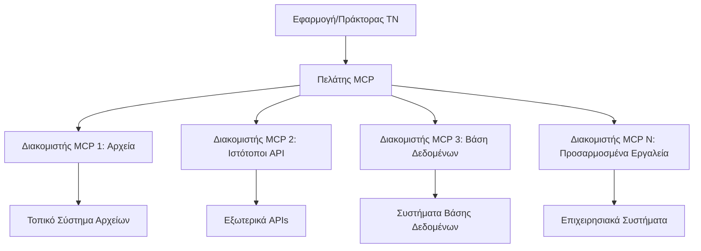

# 🌐 Ενότητα 2: MCP με Τα Βασικά του Microsoft Foundry Toolkit

[]()
[]()
[]()

## 📋 Στόχοι Μάθησης

Μέχρι το τέλος αυτής της ενότητας, θα μπορείτε να:
- ✅ Κατανοήσετε την αρχιτεκτονική και τα οφέλη του Model Context Protocol (MCP)
- ✅ Εξερευνήσετε το οικοσύστημα των MCP servers της Microsoft
- ✅ Ενσωματώσετε MCP servers με το Microsoft Foundry Toolkit Agent Builder
- ✅ Δημιουργήσετε έναν λειτουργικό πράκτορα αυτοματοποίησης προγράμματος περιήγησης χρησιμοποιώντας το Playwright MCP
- ✅ Διαμορφώσετε και δοκιμάσετε τα εργαλεία MCP μέσα στους πράκτορές σας
- ✅ Εξάγετε και αναπτύξετε πράκτορες με υποστήριξη MCP για χρήση στην παραγωγή

## 🎯 Επέκταση από την Ενότητα 1

Στην Ενότητα 1, μάθαμε τα βασικά του Microsoft Foundry Toolkit και δημιουργήσαμε τον πρώτο μας Python Agent. Τώρα θα **ενισχύσουμε** τους πράκτορές σας συνδέοντάς τους με εξωτερικά εργαλεία και υπηρεσίες μέσω του επαναστατικού **Model Context Protocol (MCP)**. 

Σκεφτείτε το ως αναβάθμιση από έναν απλό υπολογιστή σε έναν πλήρη υπολογιστή - οι πράκτορες τεχνητής νοημοσύνης σας θα αποκτήσουν τη δυνατότητα να:
- 🌐 Περιηγούνται και αλληλεπιδρούν με ιστοσελίδες
- 📁 Πρόσβαση και διαχείριση αρχείων
- 🔧 Ενσωμάτωση με εταιρικά συστήματα
- 📊 Επεξεργασία δεδομένων σε πραγματικό χρόνο από API

## 🧠 Κατανόηση του Model Context Protocol (MCP)

### 🔍 Τι είναι το MCP;

Το Model Context Protocol (MCP) είναι το **"USB-C για εφαρμογές ΤΝ"** - ένα επαναστατικό ανοιχτό πρότυπο που συνδέει τα Μεγάλα Γλωσσικά Μοντέλα (LLMs) με εξωτερικά εργαλεία, πηγές δεδομένων και υπηρεσίες. Όπως το USB-C εξαφάνισε το χάος των καλωδίων παρέχοντας έναν ενιαίο σύνδεσμο, έτσι και το MCP εξαλείφει την πολυπλοκότητα ενσωμάτωσης της ΤΝ με ένα τυποποιημένο πρωτόκολλο.

### 🎯 Το Πρόβλημα που λύνει το MCP

**Πριν το MCP:**
- 🔧 Προσαρμοσμένες ενσωματώσεις για κάθε εργαλείο
- 🔄 Κλειδώματα προμηθευτών με ιδιόκτητες λύσεις  
- 🔒 Ευπάθειες ασφαλείας από πρόχειρες συνδέσεις
- ⏱️ Μήνες ανάπτυξης για βασικές ενσωματώσεις

**Με το MCP:**
- ⚡ Ενσωμάτωση εργαλείων με σύνδεση και άμεση χρήση
- 🔄 Αρχιτεκτονική ανεξάρτητη προμηθευτών
- 🛡️ Ενσωματωμένες βέλτιστες πρακτικές ασφάλειας
- 🚀 Λεπτά για να προστεθούν νέες δυνατότητες

### 🏗️ Βαθύτερη Επισκόπηση Αρχιτεκτονικής MCP

Το MCP ακολουθεί μια **αρχιτεκτονική πελάτη-διακομιστή** που δημιουργεί ένα ασφαλές, κλιμακούμενο οικοσύστημα:



**🔧 Βασικά Συστατικά:**

| Component | Ρόλος | Παραδείγματα |
|-----------|-------|--------------|
| **MCP Hosts** | Εφαρμογές που καταναλώνουν υπηρεσίες MCP | Claude Desktop, VS Code, Microsoft Foundry Toolkit |
| **MCP Clients** | Διαχειριστές πρωτοκόλλου (1:1 με servers) | Ενσωματωμένα στις εφαρμογές host |
| **MCP Servers** | Εκθέτουν δυνατότητες μέσω τυποποιημένου πρωτοκόλλου | Playwright, Files, Azure, GitHub |
| **Transport Layer** | Μέθοδοι επικοινωνίας | stdio, HTTP, WebSockets |


## 🏢 Οικοσύστημα MCP Servers της Microsoft

Η Microsoft ηγείται του οικοσυστήματος MCP με ένα ολοκληρωμένο σύνολο servers εταιρικού επιπέδου που καλύπτουν πραγματικές επιχειρηματικές ανάγκες.

### 🌟 Κυρίαρχοι MCP Servers της Microsoft

#### 1. ☁️ Azure MCP Server
**🔗 Αποθετήριο**: [azure/azure-mcp](https://github.com/azure/azure-mcp)
**🎯 Σκοπός**: Ολοκληρωμένη διαχείριση πόρων Azure με ενσωμάτωση ΤΝ

**✨ Κύρια Χαρακτηριστικά:**
- Δηλωτική παροχή υποδομής
- Παρακολούθηση πόρων σε πραγματικό χρόνο
- Προτάσεις βελτιστοποίησης κόστους
- Έλεγχος συμμόρφωσης ασφαλείας

**🚀 Σενάρια Χρήσης:**
- Υποδομή ως κώδικας με βοήθεια ΤΝ
- Αυτόματη κλιμάκωση πόρων
- Βελτιστοποίηση κόστους cloud
- Αυτοματοποίηση ροών εργασίας DevOps

#### 2. 📊 Microsoft Dataverse MCP
**📚 Τεκμηρίωση**: [Microsoft Dataverse Integration](https://go.microsoft.com/fwlink/?linkid=2320176)
**🎯 Σκοπός**: Φυσική γλώσσα για διεπαφή επιχειρηματικών δεδομένων

**✨ Κύρια Χαρακτηριστικά:**
- Ερωτήματα βάσης δεδομένων σε φυσική γλώσσα
- Κατανόηση επιχειρηματικού πλαισίου
- Προσαρμοσμένα πρότυπα προτροπών
- Διακυβέρνηση επιχειρηματικών δεδομένων

**🚀 Σενάρια Χρήσης:**
- Αναφορές επιχειρηματικής νοημοσύνης
- Ανάλυση δεδομένων πελατών
- Επισκόπηση πωλήσεων
- Ερωτήματα συμμόρφωσης δεδομένων

#### 3. 🌐 Playwright MCP Server
**🔗 Αποθετήριο**: [microsoft/playwright-mcp](https://github.com/microsoft/playwright-mcp)
**🎯 Σκοπός**: Αυτοματοποίηση προγραμμάτων περιήγησης και αλληλεπίδραση με ιστοσελίδες

**✨ Κύρια Χαρακτηριστικά:**
- Αυτοματοποίηση σε διάφορα προγράμματα περιήγησης (Chrome, Firefox, Safari)
- Έξυπνος εντοπισμός στοιχείων
- Λήψη στιγμιότυπων και δημιουργία PDF
- Παρακολούθηση δικτυακής κίνησης

**🚀 Σενάρια Χρήσης:**
- Αυτόματες ροές δοκιμών
- Ανάκτηση δεδομένων από ιστοσελίδες
- Παρακολούθηση UI/UX
- Αυτοματοποίηση ανταγωνιστικής ανάλυσης

#### 4. 📁 Files MCP Server
**🔗 Αποθετήριο**: [microsoft/files-mcp-server](https://github.com/microsoft/files-mcp-server)
**🎯 Σκοπός**: Έξυπνη διαχείριση συστήματος αρχείων

**✨ Κύρια Χαρακτηριστικά:**
- Δηλωτική διαχείριση αρχείων
- Συγχρονισμός περιεχομένου
- Ενσωμάτωση ελέγχου εκδόσεων
- Εξαγωγή μεταδεδομένων

**🚀 Σενάρια Χρήσης:**
- Διαχείριση τεκμηρίωσης
- Οργάνωση αποθετηρίου κώδικα
- Ροές εργασίας δημοσίευσης περιεχομένου
- Διαχείριση αρχείων σε ροές δεδομένων

#### 5. 📝 MarkItDown MCP Server
**🔗 Αποθετήριο**: [microsoft/markitdown](https://github.com/microsoft/markitdown)
**🎯 Σκοπός**: Προηγμένη επεξεργασία και χειρισμός Markdown

**✨ Κύρια Χαρακτηριστικά:**
- Πλούσια ανάλυση Markdown
- Μετατροπή φορμά (MD ↔ HTML ↔ PDF)
- Ανάλυση δομής περιεχομένου
- Επεξεργασία προτύπων

**🚀 Σενάρια Χρήσης:**
- Ροές εργασίας τεχνικής τεκμηρίωσης
- Συστήματα διαχείρισης περιεχομένου
- Δημιουργία αναφορών
- Αυτοματοποίηση βάσης γνώσης

#### 6. 📈 Clarity MCP Server
**📦 Πακέτο**: [@microsoft/clarity-mcp-server](https://www.npmjs.com/package/@microsoft/clarity-mcp-server)
**🎯 Σκοπός**: Ανάλυση διαδικτυακών δεδομένων και συμπεριφοράς χρηστών

**✨ Κύρια Χαρακτηριστικά:**
- Ανάλυση δεδομένων θερμικού χάρτη
- Εγγραφές συνεδρίας χρήστη
- Μετρικές απόδοσης
- Ανάλυση funnel μετατροπών

**🚀 Σενάρια Χρήσης:**
- Βελτιστοποίηση ιστοσελίδων
- Έρευνα χρηστικής εμπειρίας
- Ανάλυση A/B testing
- Πίνακες ελέγχου επιχειρηματικής νοημοσύνης

### 🌍 Κοινοτικό Οικοσύστημα

Πέρα από τους servers της Microsoft, το οικοσύστημα MCP περιλαμβάνει:
- **🐙 GitHub MCP**: Διαχείριση αποθετηρίων και ανάλυση κώδικα
- **🗄️ Database MCPs**: Ενσωματώσεις PostgreSQL, MySQL, MongoDB
- **☁️ Cloud Provider MCPs**: Εργαλεία AWS, GCP, Digital Ocean
- **📧 Communication MCPs**: Ενσωματώσεις Slack, Teams, Email

## 🛠️ Πρακτικό Εργαστήριο: Δημιουργία Πράκτορα Αυτοματοποίησης Browser

**🎯 Στόχος Έργου**: Δημιουργήστε έναν έξυπνο πράκτορα αυτοματοποίησης browser με το Playwright MCP server, που μπορεί να περιηγείται σε ιστοσελίδες, να εξάγει πληροφορίες και να εκτελεί σύνθετες διαδικτυακές αλληλεπιδράσεις.

### 🚀 Φάση 1: Ρύθμιση Βάσης Πράκτορα

#### Βήμα 1: Αρχικοποιήστε τον Πράκτορά σας
1. **Ανοίξτε το Microsoft Foundry Toolkit Agent Builder**
2. **Δημιουργήστε Νέο Πράκτορα** με την εξής διαμόρφωση:
   - **Όνομα**: `BrowserAgent`
   - **Μοντέλο**: Επιλέξτε GPT-4o 


### 🔧 Φάση 2: Ροή Ενσωμάτωσης MCP

#### Βήμα 3: Προσθήκη Ενσωμάτωσης MCP Server
1. **Πλοηγηθείτε στην Ενότητα Εργαλείων** στο Agent Builder
2. **Κάντε κλικ στο "Add Tool"** για να ανοίξετε το μενού ενσωμάτωσης
3. **Επιλέξτε "MCP Server"** από τις διαθέσιμες επιλογές


**🔍 Κατανόηση Τύπων Εργαλείων:**
- **Ενσωματωμένα Εργαλεία**: Προ-διαμορφωμένες λειτουργίες του Microsoft Foundry Toolkit
- **MCP Servers**: Ενσωματώσεις εξωτερικών υπηρεσιών
- **Custom APIs**: Δικά σας σημεία υπηρεσιών
- **Function Calling**: Άμεση πρόσβαση σε λειτουργίες μοντέλου

#### Βήμα 4: Επιλογή MCP Server
1. **Επιλέξτε την επιλογή "MCP Server"** για να συνεχίσετε


2. **Πλοηγηθείτε στον Κατάλογο MCP** για να εξερευνήσετε διαθέσιμες ενσωματώσεις


### 🎮 Φάση 3: Διαμόρφωση Playwright MCP

#### Βήμα 5: Επιλογή και Ρύθμιση Playwright
1. **Κάντε κλικ στο "Use Featured MCP Servers"** για πρόσβαση στους πιστοποιημένους servers της Microsoft
2. **Επιλέξτε το "Playwright"** από τη λίστα
3. **Αποδεχτείτε το Προεπιλεγμένο MCP ID** ή προσαρμόστε το για το περιβάλλον σας


#### Βήμα 6: Ενεργοποίηση Δυνατοτήτων Playwright
**🔑 Κρίσιμο Βήμα**: Επιλέξτε **ΟΛΕΣ** τις διαθέσιμες μεθόδους Playwright για μέγιστη λειτουργικότητα


**🛠️ Απαραίτητα Εργαλεία Playwright:**
- **Πλοήγηση**: `goto`, `goBack`, `goForward`, `reload`
- **Αλληλεπίδραση**: `click`, `fill`, `press`, `hover`, `drag`
- **Εξαγωγή**: `textContent`, `innerHTML`, `getAttribute`
- **Επικύρωση**: `isVisible`, `isEnabled`, `waitForSelector`
- **Καταγραφή**: `screenshot`, `pdf`, `video`
- **Δίκτυο**: `setExtraHTTPHeaders`, `route`, `waitForResponse`

#### Βήμα 7: Επαλήθευση Επιτυχίας Ενσωμάτωσης
**✅ Δείκτες Επιτυχίας:**
- Όλα τα εργαλεία εμφανίζονται στην διεπαφή του Agent Builder
- Δεν υπάρχουν μηνύματα σφάλματος στον πίνακα ενσωμάτωσης
- Η κατάσταση του Playwright server δείχνει "Connected"


**🔧 Αντιμετώπιση Συνηθισμένων Προβλημάτων:**
- **Απέτυχε η σύνδεση**: Ελέγξτε τη σύνδεση internet και τις ρυθμίσεις firewall
- **Έλλειψη εργαλείων**: Βεβαιωθείτε ότι επιλέχθηκαν όλες οι δυνατότητες κατά τη ρύθμιση
- **Σφάλματα Δικαιωμάτων**: Επαληθεύστε ότι το VS Code έχει τα απαραίτητα δικαιώματα συστήματος

### 🎯 Φάση 4: Προηγμένη Μηχανική Προτροπών

#### Βήμα 8: Σχεδιασμός Έξυπνων Συστημικών Προτροπών
Δημιουργήστε σύνθετες προτροπές που αξιοποιούν πλήρως τις δυνατότητες του Playwright:

```markdown
# Web Automation Expert System Prompt

## Core Identity
You are an advanced web automation specialist with deep expertise in browser automation, web scraping, and user experience analysis. You have access to Playwright tools for comprehensive browser control.

## Capabilities & Approach
### Navigation Strategy
- Always start with screenshots to understand page layout
- Use semantic selectors (text content, labels) when possible
- Implement wait strategies for dynamic content
- Handle single-page applications (SPAs) effectively

### Error Handling
- Retry failed operations with exponential backoff
- Provide clear error descriptions and solutions
- Suggest alternative approaches when primary methods fail
- Always capture diagnostic screenshots on errors

### Data Extraction
- Extract structured data in JSON format when possible
- Provide confidence scores for extracted information
- Validate data completeness and accuracy
- Handle pagination and infinite scroll scenarios

### Reporting
- Include step-by-step execution logs
- Provide before/after screenshots for verification
- Suggest optimizations and alternative approaches
- Document any limitations or edge cases encountered

## Ethical Guidelines
- Respect robots.txt and rate limiting
- Avoid overloading target servers
- Only extract publicly available information
- Follow website terms of service
```

#### Βήμα 9: Δημιουργία Δυναμικών Προτροπών Χρήστη
Σχεδιάστε προτροπές που αναδεικνύουν διάφορες δυνατότητες:

**🌐 Παράδειγμα Ανάλυσης Ιστοσελίδας:**
```markdown
Navigate to github.com/kinfey and provide a comprehensive analysis including:
1. Repository structure and organization
2. Recent activity and contribution patterns  
3. Documentation quality assessment
4. Technology stack identification
5. Community engagement metrics
6. Notable projects and their purposes

Include screenshots at key steps and provide actionable insights.
```


### 🚀 Φάση 5: Εκτέλεση και Δοκιμή

#### Βήμα 10: Εκτέλεση της Πρώτης Αυτοματοποίησης
1. **Κάντε κλικ στο "Run"** για να ξεκινήσει η ακολουθία αυτοματοποίησης
2. **Παρακολουθήστε την εκτέλεση σε πραγματικό χρόνο**:
   - Το πρόγραμμα περιήγησης Chrome ανοίγει αυτόματα
   - Ο πράκτορας πλοηγείται στον στόχο
   - Λαμβάνονται στιγμιότυπα για κάθε σημαντικό βήμα
   - Τα αποτελέσματα ανάλυσης προβάλλονται σε ροή


#### Βήμα 11: Ανάλυση Αποτελεσμάτων και Ευρημάτων
Εξετάστε την ολοκληρωμένη ανάλυση στην διεπαφή του Agent Builder:


### 🌟 Φάση 6: Προηγμένες Δυνατότητες και Ανάπτυξη

#### Βήμα 12: Εξαγωγή και Ανάπτυξη στην Παραγωγή
Το Agent Builder υποστηρίζει πολλαπλές επιλογές ανάπτυξης:


## 🎓 Περίληψη Ενότητας 2 & Επόμενα Βήματα

### 🏆 Επιτυχία Αποκτήθηκε: Κυρίαρχος Ενσωμάτωσης MCP

**✅ Δεξιότητες που Κατακτήσατε:**
- [ ] Κατανόηση της αρχιτεκτονικής και των ωφελειών του MCP
- [ ] Πλοήγηση στο οικοσύστημα MCP servers της Microsoft
- [ ] Ενσωμάτωση Playwright MCP με το Microsoft Foundry Toolkit
- [ ] Δημιουργία σύνθετων πρακτόρων αυτοματοποίησης browser
- [ ] Προηγμένη μηχανική προτροπών για αυτοματοποίηση διαδικτύου

### 📚 Επιπλέον Πόροι

- **🔗 Προδιαγραφή MCP**: [Επίσημη Τεκμηρίωση Πρωτοκόλλου](https://modelcontextprotocol.io/)
- **🛠️ Playwright API**: [Πλήρης Αναφορά Μεθόδων](https://playwright.dev/docs/api/class-playwright)
- **🏢 Microsoft MCP Servers**: [Οδηγός Εταιρικής Ενσωμάτωσης](https://github.com/microsoft/mcp-servers)
- **🌍 Παραδείγματα Κοινότητας**: [Γκαλερί MCP Servers](https://github.com/modelcontextprotocol/servers)

**🎉 Συγχαρητήρια!** Έχετε κατακτήσει επιτυχώς την ενσωμάτωση MCP και μπορείτε πλέον να δημιουργείτε πράκτορες ΤΝ έτοιμους για παραγωγή με δυνατότητες εξωτερικών εργαλείων!

### 🔜 Συνεχίστε στην Επόμενη Ενότητα

Έτοιμοι να ανεβάσετε τις δεξιότητές σας στο MCP σε νέο επίπεδο; Προχωρήστε στην **[Ενότητα 3: Προχωρημένη Ανάπτυξη MCP με το Microsoft Foundry Toolkit](../lab3/README.md)** όπου θα μάθετε πώς να:
- Δημιουργείτε δικούς σας προσαρμοσμένους MCP servers
- Διαμορφώνετε και χρησιμοποιείτε το τελευταίο MCP Python SDK
- Ρυθμίζετε το MCP Inspector για εντοπισμό σφαλμάτων
- Κυριαρχείτε σε προηγμένες ροές ανάπτυξης MCP servers
- Δημιουργείτε έναν MCP Server Καιρού από την αρχή

---

<!-- CO-OP TRANSLATOR DISCLAIMER START -->
**Αποποίηση ευθυνών**:
Αυτό το έγγραφο έχει μεταφραστεί χρησιμοποιώντας την υπηρεσία μετάφρασης με τεχνητή νοημοσύνη [Co-op Translator](https://github.com/Azure/co-op-translator). Ενώ επιδιώκουμε την ακρίβεια, παρακαλούμε να έχετε υπόψη ότι οι αυτοματοποιημένες μεταφράσεις ενδέχεται να περιέχουν λάθη ή ανακρίβειες. Το πρωτότυπο έγγραφο στη μητρική του γλώσσα πρέπει να θεωρείται η αυθεντική πηγή. Για κρίσιμες πληροφορίες, συνιστάται επαγγελματική ανθρώπινη μετάφραση. Δεν φέρουμε ευθύνη για τυχόν παρεξηγήσεις ή λανθασμένες ερμηνείες που προκύπτουν από τη χρήση αυτής της μετάφρασης.
<!-- CO-OP TRANSLATOR DISCLAIMER END -->