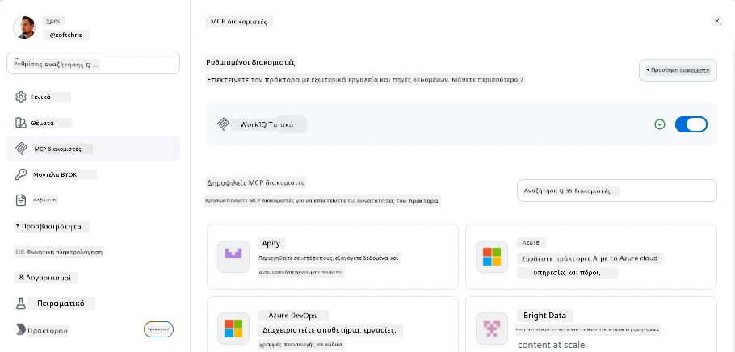
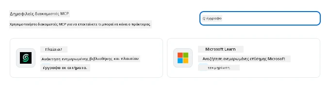
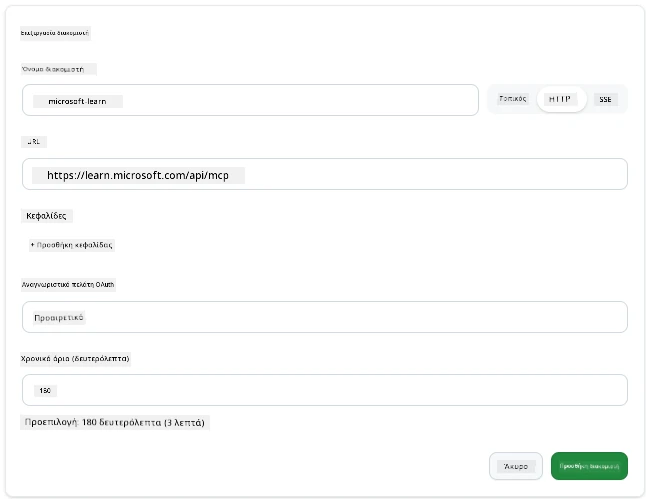
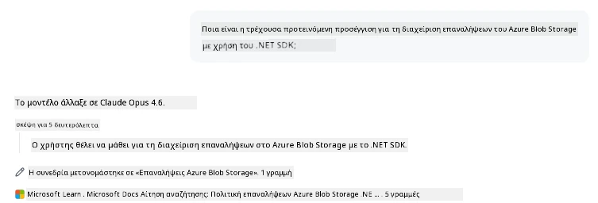
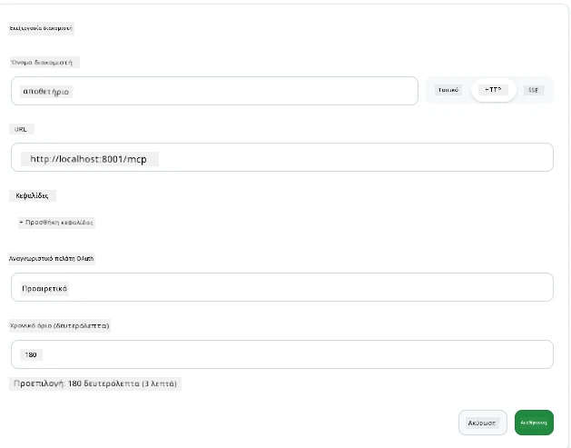
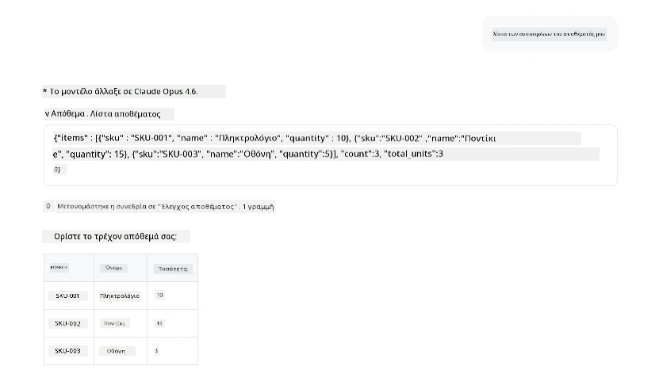
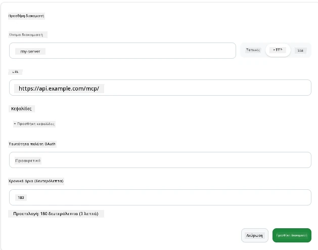
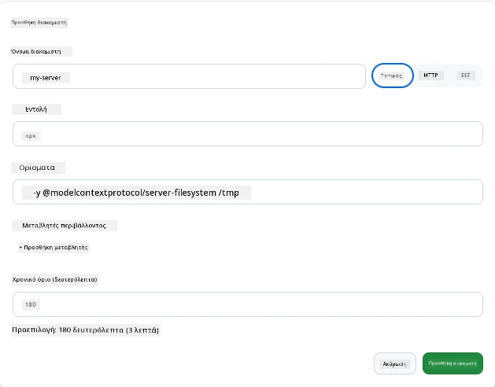

# Χρήση MCP Servers στην Εφαρμογή GitHub Copilot

Μέχρι τώρα ξέρετε πώς λειτουργεί το MCP. Έχετε δημιουργήσει διακομιστές, ορίσει εργαλεία και πόρους, και συνδέσει πελάτες. Αυτό που δεν έχουμε κάνει ακόμα είναι να αλλάξουμε οπτική γωνία: αντί να είστε εσείς αυτός που δημιουργεί τον διακομιστή, πώς είναι να βρίσκεστε στην *καταναλωτική* πλευρά—ως χρήστης μιας εφαρμογής με AI που υποστηρίζει MCP;

Η [εφαρμογή GitHub Copilot](https://github.com/github/app) είναι μια εφαρμογή επιφάνειας εργασίας που μπορεί να χρησιμοποιεί MCP Servers. Συνδέοντας MCP servers σε αυτή, ξεκλειδώνετε ένα νέο επίπεδο: ο Copilot μπορεί τώρα να αντλήσει πληροφορίες από την τεκμηρίωσή σας, να καλεί εσωτερικά APIs, να κάνει ερωτήματα στη βάση δεδομένων σας ή να μιλήσει με οποιαδήποτε υπηρεσία έχετε τυλίξει σε έναν διακομιστή. Η εφαρμογή γίνεται ο κεντρικός κόμβος· οι MCP διακομιστές σας γίνονται τα εργαλεία της.

Αυτό το μάθημα σας καθοδηγεί σε αυτή την εμπειρία από την αρχή μέχρι το τέλος—από την εύρεση του πίνακα ρυθμίσεων MCP έως τη σύνδεση ενός πραγματικού documentation server και στη συνέχεια τη διασύνδεση ενός προσαρμοσμένου δικού σας.

## Μαθησιακοί Στόχοι

Μέχρι το τέλος αυτού του μαθήματος, θα μπορείτε να:

- Βρείτε και να πλοηγηθείτε στον πίνακα MCP Servers στις ρυθμίσεις της εφαρμογής Copilot.
- Συνδέσετε έναν διακομιστή τεκμηρίωσης και να τον χρησιμοποιήσετε σε μια συνεδρία.
- Εγγράψετε έναν προσαρμοσμένο διακομιστή και να επαληθεύσετε ότι ο Copilot μπορεί να καλεί τα εργαλεία του.
- Διαμορφώσετε τον τρόπο κλήσης ενός διακομιστή παρέχοντας είτε μεταβλητές περιβάλλοντος είτε προσαρμοσμένες κεφαλίδες (αν πρόκειται για HTTP).

## Η Εφαρμογή Copilot ως Host MCP

Ιδού η βασική ιδέα: **οι πράκτορες του Copilot είναι έξυπνοι, αλλά γνωρίζουν μόνο ό,τι τους πείτε.** Από προεπιλογή, ένας πράκτορας μπορεί να διαβάζει αρχεία στον χώρο εργασίας σας και να εκτελεί εντολές τερματικού, αλλά δεν μπορεί να κάνει ερωτήματα στη βάση δεδομένων σας, να κοιτάξει το ημερολόγιό σας ή να καλέσει ένα προσαρμοσμένο API χωρίς βοήθεια. Εκεί μπαίνουν οι MCP servers. Λειτουργούν ως γέφυρες μεταξύ του Copilot και των συστημάτων σας—βάσεις δεδομένων, συστήματα διαχείρισης εκδόσεων, APIs, εργαλεία σχεδίασης—παρέχοντας στους πράκτορες πρόσβαση σε πληροφορίες και ενέργειες που χρειάζονται για να ολοκληρώσουν έργα.

Ας ξεκινήσουμε βρίσκοντας αυτές τις ρυθμίσεις για να διαχειριστείτε τους MCP Servers της εφαρμογής σας.

## Βήμα 1: Εύρεση του Πίνακα Ρυθμίσεων MCP

Ανοίξτε την εφαρμογή Copilot και εντοπίστε το εικονίδιο με γρανάζι κάτω αριστερά και κάντε κλικ σε αυτό.


Βεβαιωθείτε ότι έχετε επιλέξει "MCP Servers" και θα πρέπει τώρα να δείτε τους διακομιστές που έχετε ήδη ρυθμίσει στο πάνω μέρος, ένα marketplace δημοφιλών διακομιστών στο κάτω μέρος, και ένα κουμπί "Add Server" στην κορυφή όπως παρακάτω:



Αυτή είναι η κεντρική σας κονσόλα. Εδώ προσθέτετε, αφαιρείτε, ενεργοποιείτε και απενεργοποιείτε διακομιστές. Οι αλλαγές εφαρμόζονται σε νέες συνεδρίες· αν έχετε μια συνεδρία ανοιχτή, θα χρειαστεί να ξεκινήσετε μια νέα μετά τις αλλαγές.

## Βήμα 2: Σύνδεση Διακομιστή Τεκμηρίωσης

Ας κάνουμε κάτι άμεσα χρήσιμο. Ο Microsoft Docs MCP server δίνει πρόσβαση στον Copilot στην επίσημη τεκμηρίωση της Microsoft. Αυτό περιλαμβάνει Azure, .NET, TypeScript και άλλα. Αντί ο πράκτορας να στηρίζεται στα δεδομένα εκπαίδευσής του (που έχουν ημερομηνία λήξης), μπορεί να τραβάει τις τρέχουσες τεκμηριώσεις τη στιγμή του ερωτήματος.

Ακολουθεί ο τρόπος προσθήκης του:

1. Στο πλέγμα δημοφιλών διακομιστών, πληκτρολογήστε **learn** και επιλέξτε τον διακομιστή που ονομάζεται "Microsoft Learn".

   

   Μόλις κάνετε κλικ, εμφανίζει μια φόρμα όπου το όνομα, ο τύπος μεταφοράς και το URL είναι προ-συμπληρωμένα, το μόνο που πρέπει να κάνετε είναι να πατήσετε "Add Server".

2. Πατήστε "Add Server", θα χρειαστούν μερικά δευτερόλεπτα για να γίνει η σύνδεση με τον διακομιστή.

   

   Μόλις προστεθεί, θα πρέπει να εμφανιστεί στην κορυφή ως ρυθμισμένος διακομιστής. Ας το δοκιμάσουμε στη συνέχεια.

3. Κλείστε το παράθυρο και επιλέξτε Quick chat.

4. Πληκτρολογήστε το παρακάτω prompt για να ενεργοποιήσετε ένα εργαλείο στον Microsoft Learn server.

   ```text
   What's the current recommended approach for handling Azure Blob Storage 
   retries using the .NET SDK?
   ```

   

Θα δείτε πώς αναφέρεται στον MCP Server που μόλις προσθέσαμε.

## Βήμα 3: Σύνδεση Προσαρμοσμένου διακομιστή stdio

Οι προεπιλογές είναι βολικές, αλλά η πραγματική δύναμη είναι να συνδέσετε τους δικούς σας διακομιστές. Ας υποθέσουμε ότι έχετε δημιουργήσει έναν διακομιστή (ή σας έχει δοθεί ένας) που εκθέτει το εσωτερικό API ή τη βάση γνώσεων της εταιρείας σας. Σε αυτή την περίπτωση, θα χρησιμοποιήσουμε έναν MCP Server που δημιουργήσαμε ο ίδιος που διαχειρίζεται το αποθεματικό της εταιρείας μας.

1. Πατήστε το γρανάζι και επιλέξτε ξανά "MCP servers".

2. Επιλέξτε το κουμπί "Add Server" και μετά "+ Add Custom server", και δώστε τις ακόλουθες τιμές:

   - Όνομα: `Inventory Server`
   - Επιλέξτε μεταφορά (στα δεξιά), **http**

   Πατήστε "Add Server" και θα πρέπει να εμφανιστεί στη λίστα σας με τους ρυθμισμένους διακομιστές.

   

4. Για να το δοκιμάσετε, τρέξτε ένα prompt όπως το παρακάτω:

    ```
    list inventory
    ```

   

   Τώρα θα δείτε μια λίστα με στοιχεία αποθεμάτων που επιστρέφονται από τον προσαρμοσμένο διακομιστή σας.

Τέλεια, τώρα θα έχετε καλή κατανόηση στο πώς να προσθέτετε εξωτερικούς αλλά και δικούς σας MCP servers στην εφαρμογή Copilot. Έπειτα, ας μιλήσουμε για τη διαχείριση μυστικών και μεταβλητών περιβάλλοντος.

## Βήμα 4: Προηγμένες ρυθμίσεις

Μέχρι στιγμής, είδατε πώς να προσθέτετε MCP Servers παρέχοντας απλώς όνομα και URL. Αλλά τι γίνεται αν ο διακομιστής σας χρειάζεται ένα API key ή κάποια άλλη τιμή; Ανάλογα με τον τύπο μεταφοράς, μπορούμε να του παρέχουμε ό,τι χρειάζεται.

- **http ή SSE μεταφορά**: Εδώ μπορούμε να ορίσουμε κεφαλίδες ανάλογα με τις ανάγκες.

   Για πιστοποίηση, μπορείτε να καθορίσετε μια κεφαλίδα Authorization, για παράδειγμα. Η τιμή μπορεί να είναι μια στατική συμβολοσειρά. Αν χρησιμοποιείτε OAuth, μπορείτε αντί για αυτό να δώσετε ένα OAuth client ID.

   

- **stdio μεταφορά**: Μπορούν να οριστούν μεταβλητές περιβάλλοντος.

   Εδώ μπορείτε να ορίσετε οποιονδήποτε αριθμό μεταβλητών περιβάλλοντος που χρειάζεται να περαστούν στον διακομιστή κατά την εκκίνησή του.

   

## Περίληψη

Η εφαρμογή Copilot αντιμετωπίζει τους MCP servers ως επεκτάσεις πρώτης τάξης των δυνατοτήτων του πράκτορα. Είδατε ολόκληρη τη διαδρομή σε αυτό το μάθημα από την προσθήκη MCP servers μέχρι τη χρήση τους σε μια συνεδρία. Τώρα μπορείτε να συνδεθείτε σε δημόσιους διακομιστές, εσωτερικά APIs και προσαρμοσμένα εργαλεία, δίνοντας στους πράκτορές σας τη δυνατότητα να έχουν πρόσβαση στις πληροφορίες και τις ενέργειες που χρειάζονται για να ολοκληρώσουν εργασίες αυτόνομα.

## 📚 Επιπλέον Πόροι

### Επίσημη τεκμηρίωση

- [GitHub Copilot App](https://github.com/github/app)
- [MCP Specification](https://modelcontextprotocol.io/specification/2025-03-26) - Προδιαγραφή Model Context Protocol

### Κοινότητα
- [MCP Community Discord](https://discord.com/invite/ByRwuEEgH4) - Ζωντανές συζητήσεις
- [GitHub Discussions](https://github.com/microsoft/MCP-Server-and-PostgreSQL-Sample-Retail/discussions) - Ερωτήσεις & απαντήσεις και κοινή χρήση
- [Stack Overflow](https://stackoverflow.com/questions/tagged/model-context-protocol) - Τεχνικές ερωτήσεις

---

<!-- CO-OP TRANSLATOR DISCLAIMER START -->
**Αποποίηση ευθυνών**:
Αυτό το έγγραφο έχει μεταφραστεί χρησιμοποιώντας την υπηρεσία μετάφρασης με τεχνητή νοημοσύνη [Co-op Translator](https://github.com/Azure/co-op-translator). Ενώ επιδιώκουμε την ακρίβεια, παρακαλούμε να έχετε υπόψη ότι οι αυτοματοποιημένες μεταφράσεις ενδέχεται να περιέχουν λάθη ή ανακρίβειες. Το πρωτότυπο έγγραφο στη μητρική του γλώσσα πρέπει να θεωρείται η αυθεντική πηγή. Για κρίσιμες πληροφορίες, συνιστάται επαγγελματική ανθρώπινη μετάφραση. Δεν φέρουμε ευθύνη για τυχόν παρεξηγήσεις ή λανθασμένες ερμηνείες που προκύπτουν από τη χρήση αυτής της μετάφρασης.
<!-- CO-OP TRANSLATOR DISCLAIMER END -->