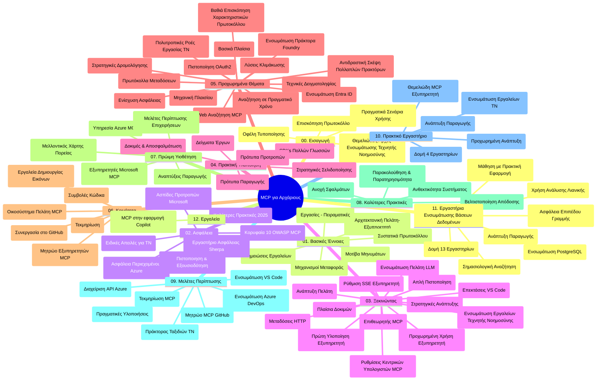

# Πρωτόκολλο Πλαισίου Μοντέλου (MCP) για Αρχάριους - Οδηγός Μελέτης

Αυτός ο οδηγός μελέτης παρέχει μια επισκόπηση της δομής και του περιεχομένου του αποθετηρίου για το πρόγραμμα σπουδών "Πρωτόκολλο Πλαισίου Μοντέλου (MCP) για Αρχάριους". Χρησιμοποιήστε αυτόν τον οδηγό για να πλοηγηθείτε αποτελεσματικά στο αποθετήριο και να αξιοποιήσετε στο έπακρο τους διαθέσιμους πόρους.

## Επισκόπηση Αποθετηρίου

Το Πρωτόκολλο Πλαισίου Μοντέλου (MCP) είναι ένα τυποποιημένο πλαίσιο για τις αλληλεπιδράσεις μεταξύ μοντέλων τεχνητής νοημοσύνης και πελατειακών εφαρμογών. Αρχικά δημιουργήθηκε από την Anthropic, το MCP πλέον διατηρείται από την ευρύτερη κοινότητα MCP μέσω του επίσημου οργανισμού GitHub. Αυτό το αποθετήριο παρέχει ένα ολοκληρωμένο πρόγραμμα σπουδών με πρακτικά παραδείγματα κώδικα σε C#, Java, JavaScript, Python και TypeScript, σχεδιασμένο για προγραμματιστές τεχνητής νοημοσύνης, αρχιτέκτονες συστημάτων και μηχανικούς λογισμικού.

## Οπτικός Χάρτης Προγράμματος Σπουδών

## Δομή Αποθετηρίου

Το αποθετήριο οργανώνεται σε δώδεκα κύρια τμήματα, καθένα από τα οποία εστιάζει σε διαφορετικές πτυχές του MCP:

1. **Εισαγωγή (00-Introduction/)**
   - Επισκόπηση του Πρωτοκόλλου Πλαισίου Μοντέλου
   - Γιατί η τυποποίηση είναι σημαντική στα κανάλια τεχνητής νοημοσύνης
   - Πρακτικές περιπτώσεις χρήσης και οφέλη

2. **Βασικές Έννοιες (01-CoreConcepts/)**
   - Αρχιτεκτονική πελάτη-διακομιστή
   - Κύρια στοιχεία του πρωτοκόλλου
   - Σχήματα ανταλλαγής μηνυμάτων στο MCP

3. **Ασφάλεια (02-Security/)**
   - Απειλές ασφάλειας σε συστήματα βασισμένα σε MCP
   - Καλύτερες πρακτικές για ασφαλείς υλοποιήσεις
   - Στρατηγικές αυθεντικοποίησης και εξουσιοδότησης
   - **Ολοκληρωμένη Τεκμηρίωση Ασφαλείας**:
     - Καλύτερες Πρακτικές Ασφάλειας MCP 2025
     - Οδηγός Υλοποίησης Azure Content Safety
     - Έλεγχοι και Τεχνικές Ασφάλειας MCP
     - Γρήγορη Αναφορά Καλύτερων Πρακτικών MCP
   - **Κύρια Θέματα Ασφαλείας**:
     - Επιθέσεις διείσδυσης prompt και δηλητηρίασης εργαλείων
     - Κατάληψη συνεδρίας και προβλήματα confused deputy
     - Ευπάθειες token passthrough
     - Υπερβολικά δικαιώματα και έλεγχος πρόσβασης
     - Ασφάλεια αλυσίδας εφοδιασμού για εξαρτήματα AI
     - Ενσωμάτωση Microsoft Prompt Shields

4. **Έναρξη Χρήσης (03-GettingStarted/)**
   - Ρύθμιση και διαμόρφωση περιβάλλοντος
   - Δημιουργία βασικών MCP διακομιστών και πελατών
   - Ενσωμάτωση με υπάρχουσες εφαρμογές
   - Περιλαμβάνει ενότητες για:
     - Πρώτη υλοποίηση διακομιστή
     - Ανάπτυξη πελάτη
     - Ενσωμάτωση LLM πελάτη
     - Ενσωμάτωση VS Code
     - Διακομιστής Server-Sent Events (SSE)
     - Προχωρημένη χρήση διακομιστή
     - Ροή HTTP
     - Ενσωμάτωση AI Toolkit
     - Στρατηγικές δοκιμών
     - Οδηγίες ανάπτυξης

5. **Πρακτική Υλοποίηση (04-PracticalImplementation/)**
   - Χρήση SDK σε διάφορες γλώσσες προγραμματισμού
   - Τεχνικές αποσφαλμάτωσης, δοκιμών και εξακρίβωσης
   - Δημιουργία επαναχρησιμοποιήσιμων προτύπων prompt και ροών εργασίας
   - Παραδείγματα έργων με υλοποιητικά παραδείγματα

6. **Προχωρημένα Θέματα (05-AdvancedTopics/)**
   - Τεχνικές μηχανικής πλαισίου (context engineering)
   - Ενσωμάτωση Foundry agent
   - Πολλαπλές λειτουργίες AI (multi-modal workflows)
   - Επιδείξεις αυθεντικοποίησης OAuth2
   - Δυνατότητες αναζήτησης σε πραγματικό χρόνο
   - Ροή δεδομένων σε πραγματικό χρόνο
   - Υλοποίηση ριζικών πλαισίων (root contexts)
   - Στρατηγικές δρομολόγησης
   - Τεχνικές δειγματοληψίας
   - Προσεγγίσεις κλιμάκωσης
   - Ζητήματα ασφαλείας
   - Ενσωμάτωση ασφαλείας Entra ID
   - Ενσωμάτωση διαδικτυακής αναζήτησης
   - Αντιμαχόμενη λογική πολλαπλών πρακτόρων (debate patterns)

7. **Συνεισφορές Κοινότητας (06-CommunityContributions/)**
   - Πώς να συνεισφέρετε κώδικα και τεκμηρίωση
   - Συνεργασία μέσω GitHub
   - Βελτιώσεις και ανατροφοδότηση που καθοδηγούνται από την κοινότητα
   - Χρήση διάφορων MCP πελατών (Claude Desktop, Cline, VSCode)
   - Εργασία με δημοφιλείς MCP διακομιστές, συμπεριλαμβανομένης της δημιουργίας εικόνων

8. **Μαθήματα από Πρώιμη Υιοθέτηση (07-LessonsfromEarlyAdoption/)**
   - Πραγματικές υλοποιήσεις και ιστορίες επιτυχίας
   - Δημιουργία και ανάπτυξη λύσεων βασισμένων σε MCP
   - Τάσεις και μελλοντικός οδικός χάρτης
   - **Οδηγός Microsoft MCP Servers**: Ολοκληρωμένος οδηγός για 10 παραγωγικούς Microsoft MCP servers, μεταξύ άλλων:
     - Microsoft Learn Docs MCP Server
     - Azure MCP Server (15+ ειδικοί συνδετήρες)
     - GitHub MCP Server
     - Azure DevOps MCP Server
     - MarkItDown MCP Server
     - SQL Server MCP Server
     - Playwright MCP Server
     - Dev Box MCP Server
     - Microsoft Foundry MCP Server
     - Microsoft 365 Agents Toolkit MCP Server

9. **Καλύτερες Πρακτικές (08-BestPractices/)**
   - Βελτιστοποίηση απόδοσης και ρύθμιση
   - Σχεδιασμός MCP συστημάτων ανθεκτικών σε σφάλματα
   - Στρατηγικές δοκιμών και ανθεκτικότητας

10. **Μελέτες Περίπτωσης (09-CaseStudy/)**
    - **Επτά ολοκληρωμένες μελέτες περίπτωσης** που αναδεικνύουν τη ευελιξία του MCP σε διάφορα σενάρια:
    - **Πράκτορες Ταξιδιών Azure AI**: Ορχήστρωση πολλαπλών πρακτόρων με Azure OpenAI και AI Search
    - **Ενσωμάτωση Azure DevOps**: Αυτοματοποίηση ροών εργασίας με ενημερώσεις δεδομένων YouTube
    - **Ανάκτηση Τεκμηρίωσης σε Πραγματικό Χρόνο**: Πελάτης Python κονσόλας με HTTP ροή
    - **Διαδραστικός Γεννήτορας Σχεδίου Μελέτης**: Εφαρμογή chainlit με συζητητική AI
    - **Τεκμηρίωση μέσα στον Επεξεργαστή**: Ενσωμάτωση VS Code με ροές εργασίας GitHub Copilot
    - **Διαχείριση API Azure**: Ενσωμάτωση επιχειρηματικών API με δημιουργία MCP διακομιστή
    - **Κατάλογος MCP GitHub**: Ανάπτυξη οικοσυστήματος και πλατφόρμα ενεργητικής ενσωμάτωσης πρακτόρων
    - Παραδείγματα υλοποίησης που καλύπτουν επιχειρηματική ενσωμάτωση, παραγωγικότητα προγραμματιστών και ανάπτυξη οικοσυστήματος

11. **Εργαστήριο Hands-on (10-StreamliningAIWorkflowsBuildingAnMCPServerWithAIToolkit/)**
    - Όλοκληρο εργαστήριο με πρακτική εργασίας που συνδυάζει MCP με AI Toolkit
    - Δημιουργία ευφυών εφαρμογών που γεφυρώνουν μοντέλα AI με πραγματικά εργαλεία
    - Πρακτικές ενότητες για βασικά, ανάπτυξη προσαρμοσμένου διακομιστή και στρατηγικές παραγωγικής ανάπτυξης
    - **Δομή Εργαστηρίου**:
      - Εργαστήριο 1: Βασικά MCP Server
      - Εργαστήριο 2: Προχωρημένη Ανάπτυξη MCP Server
      - Εργαστήριο 3: Ενσωμάτωση AI Toolkit
      - Εργαστήριο 4: Παραγωγική Ανάπτυξη και Κλιμάκωση
    - Μάθηση βάσει εργαστηρίου με βήμα-βήμα οδηγίες

12. **Εργαστήρια Ενσωμάτωσης Βάσης Δεδομένων MCP Server (11-MCPServerHandsOnLabs/)**
    - **Ολοκληρωμένο μονοπάτι εκμάθησης με 13 εργαστήρια** για δημιουργία παραγωγικών MCP servers με ενσωμάτωση PostgreSQL
    - **Πραγματική υλοποίηση ανάλυσης λιανικής** με χρηματοδότηση τoυ Zava Retail case study
    - **Πρότυπα επιπέδου επιχείρησης** όπως Row Level Security (RLS), σημασιολογική αναζήτηση και πρόσβαση δεδομένων πολλαπλών ενοικιαστών
    - **Πλήρης Δομή Εργαστηρίου**:
      - **Εργαστήρια 00-03: Θεμέλια** - Εισαγωγή, Αρχιτεκτονική, Ασφάλεια, Ρύθμιση Περιβάλλοντος
      - **Εργαστήρια 04-06: Κατασκευή MCP Server** - Σχεδιασμός Βάσης, Υλοποίηση MCP Server, Ανάπτυξη Εργαλείων
      - **Εργαστήρια 07-09: Προχωρημένα Χαρακτηριστικά** - Σημασιολογική Αναζήτηση, Δοκιμές & Αποσφαλμάτωση, Ενσωμάτωση VS Code
      - **Εργαστήρια 10-12: Παραγωγή & Καλύτερες Πρακτικές** - Ανάπτυξη, Παρακολούθηση, Βελτιστοποίηση
    - **Τεχνολογίες που καλύπτονται**: FastMCP framework, PostgreSQL, Azure OpenAI, Azure Container Apps, Application Insights
    - **Αποτελέσματα Μάθησης**: Παραγωγικοί MCP servers, πρότυπα βάσεων δεδομένων, ανάλυση με AI, ασφάλεια επιπέδου επιχείρησης

13. **Εργαλεία (12-tooling/)**
    - Μάθετε πώς να χρησιμοποιείτε το MCP στην εφαρμογή Copilot και σε άλλα εργαλεία

## Επιπρόσθετοι Πόροι

Το αποθετήριο περιλαμβάνει υποστηρικτικούς πόρους:

- **Φάκελος Εικόνων**: Περιέχει διαγράμματα και εικονογραφήσεις που χρησιμοποιούνται σε όλο το πρόγραμμα σπουδών
- **Μεταφράσεις**: Υποστήριξη πολλών γλωσσών με αυτοματοποιημένες μεταφράσεις της τεκμηρίωσης
- **Επίσημοι Πόροι MCP**:
  - [MCP Documentation](https://modelcontextprotocol.io/)
  - [MCP Specification](https://spec.modelcontextprotocol.io/)
  - [MCP GitHub Repository](https://github.com/modelcontextprotocol)

## Πώς να Χρησιμοποιήσετε Αυτό το Αποθετήριο

1. **Συνεχής Εκμάθηση**: Ακολουθήστε τα κεφάλαια με τη σειρά (00 έως 11) για μια δομημένη εκπαιδευτική εμπειρία.
2. **Γλωσσικός Εστιασμός**: Εάν ενδιαφέρεστε για μια συγκεκριμένη γλώσσα προγραμματισμού, εξερευνήστε τους φακέλους δειγμάτων για υλοποιήσεις στη γλώσσα της επιλογής σας.
3. **Πρακτική Υλοποίηση**: Ξεκινήστε με την ενότητα "Έναρξη Χρήσης" για να ρυθμίσετε το περιβάλλον σας και να δημιουργήσετε τον πρώτο διακομιστή και πελάτη MCP.
4. **Προχωρημένη Εξερεύνηση**: Μόλις εξοικειωθείτε με τα βασικά, προχωρήστε στα προχωρημένα θέματα για να εμπλουτίσετε τις γνώσεις σας.
5. **Εμπλοκή με την Κοινότητα**: Συμμετάσχετε στην κοινότητα MCP μέσω συζητήσεων GitHub και καναλιών Discord για να συνδεθείτε με ειδικούς και άλλους προγραμματιστές.

## MCP Πελάτες και Εργαλεία

Το πρόγραμμα σπουδών καλύπτει διάφορους MCP πελάτες και εργαλεία:

1. **Επίσημοι Πελάτες**:
   - Visual Studio Code
   - MCP σε Visual Studio Code
   - Claude Desktop
   - Claude σε VSCode
   - Claude API

2. **Πελάτες Κοινότητας**:
   - Cline (με βάση το τερματικό)
   - Cursor (επεξεργαστής κώδικα)
   - ChatMCP
   - Windsurf

3. **Εργαλεία Διαχείρισης MCP**:
   - MCP CLI
   - MCP Manager
   - MCP Linker
   - MCP Router

## Δημοφιλείς MCP Διακομιστές

Το αποθετήριο παρουσιάζει διάφορους MCP διακομιστές, μεταξύ άλλων:

1. **Επίσημοι Microsoft MCP Διακομιστές**:
   - Microsoft Learn Docs MCP Server
   - Azure MCP Server (15+ ειδικοί συνδετήρες)
   - GitHub MCP Server
   - Azure DevOps MCP Server
   - MarkItDown MCP Server
   - SQL Server MCP Server
   - Playwright MCP Server
   - Dev Box MCP Server
   - Microsoft Foundry MCP Server
   - Microsoft 365 Agents Toolkit MCP Server

2. **Επίσημοι Διακομιστές Αναφοράς**:
   - Filesystem
   - Fetch
   - Memory
   - Sequential Thinking

3. **Δημιουργία Εικόνων**:
   - Azure OpenAI DALL-E 3
   - Stable Diffusion WebUI
   - Replicate

4. **Εργαλεία Ανάπτυξης**:
   - Git MCP
   - Terminal Control
   - Code Assistant

5. **Εξειδικευμένοι Διακομιστές**:
   - Salesforce
   - Microsoft Teams
   - Jira & Confluence

## Συνεισφορές

Αυτό το αποθετήριο υποδέχεται συνεισφορές από την κοινότητα. Δείτε την ενότητα Συνεισφορές Κοινότητας για οδηγίες σχετικά με το πώς να συνεισφέρετε αποτελεσματικά στο οικοσύστημα MCP.

----

*Αυτός ο οδηγός μελέτης ενημερώθηκε τελευταία φορά στις 5 Φεβρουαρίου 2026, αντικατοπτρίζοντας τις τελευταίες προδιαγραφές MCP 2025-11-25 και παρέχει μια επισκόπηση του αποθετηρίου έως αυτή την ημερομηνία. Το περιεχόμενο του αποθετηρίου ενδέχεται να ενημερωθεί μετά από αυτή την ημερομηνία.*

---

<!-- CO-OP TRANSLATOR DISCLAIMER START -->
**Αποποίηση ευθυνών**:
Αυτό το έγγραφο έχει μεταφραστεί χρησιμοποιώντας την υπηρεσία μετάφρασης με τεχνητή νοημοσύνη [Co-op Translator](https://github.com/Azure/co-op-translator). Ενώ επιδιώκουμε την ακρίβεια, παρακαλούμε να έχετε υπόψη ότι οι αυτοματοποιημένες μεταφράσεις ενδέχεται να περιέχουν λάθη ή ανακρίβειες. Το πρωτότυπο έγγραφο στη μητρική του γλώσσα πρέπει να θεωρείται η αυθεντική πηγή. Για κρίσιμες πληροφορίες, συνιστάται επαγγελματική ανθρώπινη μετάφραση. Δεν φέρουμε ευθύνη για τυχόν παρεξηγήσεις ή λανθασμένες ερμηνείες που προκύπτουν από τη χρήση αυτής της μετάφρασης.
<!-- CO-OP TRANSLATOR DISCLAIMER END -->