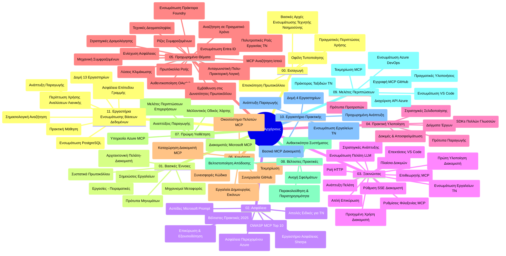

# Πρωτόκολλο Πλαισίου Μοντέλου (MCP) για Αρχάριους - Οδηγός Μελέτης

Αυτός ο οδηγός μελέτης παρέχει μια επισκόπηση της δομής και του περιεχομένου του αποθετηρίου για το πρόγραμμα σπουδών "Πρωτόκολλο Πλαισίου Μοντέλου (MCP) για Αρχάριους". Χρησιμοποιήστε αυτόν τον οδηγό για να πλοηγηθείτε αποδοτικά στο αποθετήριο και να αξιοποιήσετε στο έπακρο τους διαθέσιμους πόρους.

## Επισκόπηση Αποθετηρίου

Το Πρωτόκολλο Πλαισίου Μοντέλου (MCP) είναι ένα τυποποιημένο πλαίσιο για τις αλληλεπιδράσεις μεταξύ μοντέλων ΤΝ και πελατειακών εφαρμογών. Αρχικά δημιουργήθηκε από την Anthropic, το MCP διαχειρίζεται πλέον ευρύτερα η κοινότητα MCP μέσω της επίσημης οργάνωσης GitHub. Αυτό το αποθετήριο προσφέρει ένα ολοκληρωμένο πρόγραμμα σπουδών με πρακτικά παραδείγματα κώδικα σε C#, Java, JavaScript, Python, και TypeScript, σχεδιασμένο για προγραμματιστές ΤΝ, αρχιτέκτονες συστημάτων και μηχανικούς λογισμικού.

## Οπτικός Χάρτης Προγράμματος Σπουδών

## Δομή Αποθετηρίου

Το αποθετήριο είναι οργανωμένο σε έντεκα κύριες ενότητες, καθεμία εστιάζοντας σε διαφορετικές πτυχές του MCP:

1. **Εισαγωγή (00-Introduction/)**
   - Επισκόπηση του Πρωτοκόλλου Πλαισίου Μοντέλου
   - Η σημασία της τυποποίησης στις ροές εργασίας ΤΝ
   - Πρακτικά σενάρια χρήσης και οφέλη

2. **Βασικές Έννοιες (01-CoreConcepts/)**
   - Αρχιτεκτονική πελάτη-διακομιστή
   - Κύρια στοιχεία του πρωτοκόλλου
   - Πρότυπα μηνυμάτων στο MCP

3. **Ασφάλεια (02-Security/)**
   - Απειλές ασφάλειας σε συστήματα βάσει MCP
   - Καλές πρακτικές για ασφαλείς υλοποιήσεις
   - Στρατηγικές πιστοποίησης και εξουσιοδότησης
   - **Ολοκληρωμένη Τεκμηρίωση Ασφαλείας**:
     - Καλές πρακτικές ασφάλειας MCP 2025
     - Οδηγός υλοποίησης Azure Content Safety
     - Έλεγχοι και τεχνικές ασφάλειας MCP
     - Γρήγορη αναφορά καλών πρακτικών MCP
   - **Βασικά Θέματα Ασφάλειας**:
     - Εισαγωγή παρακίνησης και δηλητηρίαση εργαλείων
     - Kαταλήψεις συνεδριών και προβλήματα "confused deputy"
     - Ευπάθειες διέλευσης token
     - Υπερβολικές δικαιοδοσίες και έλεγχος πρόσβασης
     - Ασφάλεια αλυσίδας προμηθειών για συστατικά ΤΝ
     - Ενσωμάτωση Microsoft Prompt Shields

4. **Έναρξη (03-GettingStarted/)**
   - Ρύθμιση και παραμετροποίηση περιβάλλοντος
   - Δημιουργία βασικών MCP διακομιστών και πελατών
   - Ενσωμάτωση με υπάρχουσες εφαρμογές
   - Περιλαμβάνει ενότητες για:
     - Πρώτη υλοποίηση διακομιστή
     - Ανάπτυξη πελάτη
     - Ενσωμάτωση LLM πελάτη
     - Ενσωμάτωση VS Code
     - Server-Sent Events (SSE) διακομιστής
     - Προηγμένη χρήση διακομιστή
     - HTTP streaming
     - Ενσωμάτωση AI Toolkit
     - Στρατηγικές δοκιμών
     - Οδηγίες ανάπτυξης

5. **Πρακτική Υλοποίηση (04-PracticalImplementation/)**
   - Χρήση SDK σε διάφορες γλώσσες προγραμματισμού
   - Τεχνικές αποσφαλμάτωσης, δοκιμών και επικύρωσης
   - Δημιουργία επαναχρησιμοποιήσιμων προτύπων παρακίνησης και ροών εργασίας
   - Παραδείγματα έργων με παραδείγματα υλοποίησης

6. **Προχωρημένα Θέματα (05-AdvancedTopics/)**
   - Τεχνικές μηχανικής πλαισίου (context)
   - Ενσωμάτωση πράκτορα Foundry
   - Πολυμορφικές ροές εργασίας ΤΝ
   - Επιδείξεις πιστοποίησης OAuth2
   - Δυνατότητες αναζήτησης σε πραγματικό χρόνο
   - Ροή δεδομένων σε πραγματικό χρόνο
   - Υλοποίηση κύριων πλαισίων
   - Στρατηγικές δρομολόγησης
   - Τεχνικές δειγματοληψίας
   - Προσεγγίσεις κλιμάκωσης
   - Θέματα ασφάλειας
   - Ενσωμάτωση ασφάλειας Entra ID
   - Ενσωμάτωση web αναζήτησης
   - Αντιπαραθετική πολυ-πραγματική συλλογιστική (πρότυπα συζήτησης)

7. **Συμβολές Κοινότητας (06-CommunityContributions/)**
   - Πώς να συμβάλλετε με κώδικα και τεκμηρίωση
   - Συνεργασία μέσω GitHub
   - Βελτιώσεις και ανατροφοδότηση από την κοινότητα
   - Χρήση διαφόρων MCP πελατών (Claude Desktop, Cline, VSCode)
   - Εργασία με δημοφιλείς MCP διακομιστές, συμπεριλαμβανομένης της δημιουργίας εικόνων

8. **Μαθήματα από Πρώιμη Υιοθέτηση (07-LessonsfromEarlyAdoption/)**
   - Πραγματικές υλοποιήσεις και επιτυχίες
   - Κατασκευή και ανάπτυξη λύσεων βάσει MCP
   - Τάσεις και μελλοντικός οδικός χάρτης
   - **Οδηγός Microsoft MCP Servers**: Ολοκληρωμένος οδηγός για 10 παραγωγικούς διακομιστές MCP της Microsoft, συμπεριλαμβανομένων:
     - Microsoft Learn Docs MCP Server
     - Azure MCP Server (15+ εξειδικευμένοι σύνδεσμοι)
     - GitHub MCP Server
     - Azure DevOps MCP Server
     - MarkItDown MCP Server
     - SQL Server MCP Server
     - Playwright MCP Server
     - Dev Box MCP Server
     - Microsoft Foundry MCP Server
     - Microsoft 365 Agents Toolkit MCP Server

9. **Καλές Πρακτικές (08-BestPractices/)**
   - Βελτιστοποίηση απόδοσης και ρύθμιση
   - Σχεδιασμός ανθεκτικών συστημάτων MCP
   - Στρατηγικές δοκιμών και ανθεκτικότητας

10. **Μελέτες Περίπτωσης (09-CaseStudy/)**
    - **Επτά ολοκληρωμένες μελέτες περίπτωσης** που αναδεικνύουν την ευελιξία του MCP σε διάφορα σενάρια:
    - **Πράκτορες Ταξιδιών Azure AI**: Πολυ-πρακτορική ορχήστρωση με Azure OpenAI και AI Search
    - **Ενσωμάτωση Azure DevOps**: Αυτοματοποίηση διαδικασιών ροής εργασίας με ενημερώσεις δεδομένων YouTube
    - **Ανάκτηση Τεκμηρίωσης σε Πραγματικό Χρόνο**: Πελάτης κονσόλας Python με HTTP streaming
    - **Δημιουργός Διαδραστικού Σχεδίου Μελέτης**: Εφαρμογή web Chainlit με συνομιλητική ΤΝ
    - **Τεκμηρίωση μέσα στον Επεξεργαστή**: Ενσωμάτωση VS Code με ροές εργασίας GitHub Copilot
    - **Διαχείριση Azure API**: Ενσωμάτωση επιχειρησιακών API με δημιουργία MCP διακομιστή
    - **Μητρώο GitHub MCP**: Ανάπτυξη οικοσυστήματος και πλατφόρμα ενσωμάτωσης πρακτόρων
    - Παραδείγματα υλοποίησης που καλύπτουν επιχειρησιακή ενσωμάτωση, παραγωγικότητα προγραμματιστών, και ανάπτυξη οικοσυστήματος

11. **Εργαστήριο Χειρωνακτικής Εργασίας (10-StreamliningAIWorkflowsBuildingAnMCPServerWithAIToolkit/)**
    - Ολοκληρωμένο πρακτικό εργαστήριο που συνδυάζει MCP με AI Toolkit
    - Δημιουργία έξυπνων εφαρμογών που γεφυρώνουν τα μοντέλα ΤΝ με εργαλεία πραγματικού κόσμου
    - Πρακτικές ενότητες που καλύπτουν βασικά, ανάπτυξη προσαρμοσμένων διακομιστών και στρατηγικές παραγωγικής ανάπτυξης
    - **Δομή Εργαστηρίου**:
      - Εργαστήριο 1: Βασικά MCP Server
      - Εργαστήριο 2: Προχωρημένη Ανάπτυξη MCP Server
      - Εργαστήριο 3: Ενσωμάτωση AI Toolkit
      - Εργαστήριο 4: Παραγωγική Ανάπτυξη και Κλιμάκωση
    - Εργαστηριακή προσέγγιση μάθησης με βήμα-βήμα οδηγίες

12. **Εργαστήρια Ενσωμάτωσης Βάσης Δεδομένων MCP Server (11-MCPServerHandsOnLabs/)**
    - **Ολοκληρωμένη διαδρομή μάθησης 13 εργαστηρίων** για την κατασκευή παραγωγικών MCP διακομιστών με ενσωμάτωση PostgreSQL
    - **Υλοποίηση πραγματικού λιανικού σεναρίου** με χρήση της περίπτωσης χρήσης Zava Retail
    - **Επιχειρησιακά πρότυπα** όπως Row Level Security (RLS), σημασιολογική αναζήτηση και πρόσβαση δεδομένων πολλών ενοικιαστών
    - **Πλήρης δομή εργαστηρίων**:
      - **Εργαστήρια 00-03: Θεμέλια** - Εισαγωγή, Αρχιτεκτονική, Ασφάλεια, Ρύθμιση Περιβάλλοντος
      - **Εργαστήρια 04-06: Δημιουργία MCP Server** - Σχεδιασμός Βάσης, Υλοποίηση MCP Server, Ανάπτυξη Εργαλείων
      - **Εργαστήρια 07-09: Προχωρημένες Δυνατότητες** - Σημασιολογική Αναζήτηση, Δοκιμές & Αποσφαλμάτωση, Ενσωμάτωση VS Code
      - **Εργαστήρια 10-12: Παραγωγή & Καλές Πρακτικές** - Ανάπτυξη, Παρακολούθηση, Βελτιστοποίηση
    - **Καλυπτόμενες Τεχνολογίες**: FastMCP framework, PostgreSQL, Azure OpenAI, Azure Container Apps, Application Insights
    - **Αποτελέσματα Μάθησης**: Παραγωγικοί MCP διακομιστές, πρότυπα ενσωμάτωσης βάσεων, αναλύσεις με ΤΝ, ασφάλεια επιχειρήσεων

## Πρόσθετοι Πόροι

Το αποθετήριο περιλαμβάνει υποστηρικτικούς πόρους:

- **Φάκελος Εικόνων**: Περιέχει διαγράμματα και εικονογραφήσεις που χρησιμοποιούνται καθ’ όλη τη διάρκεια του προγράμματος σπουδών
- **Μεταφράσεις**: Πολυγλωσσική υποστήριξη με αυτόματες μεταφράσεις της τεκμηρίωσης
- **Επίσημοι Πόροι MCP**:
  - [MCP Documentation](https://modelcontextprotocol.io/)
  - [MCP Specification](https://spec.modelcontextprotocol.io/)
  - [MCP GitHub Repository](https://github.com/modelcontextprotocol)

## Πώς να Χρησιμοποιήσετε Αυτό Το Αποθετήριο

1. **Συστηματική Μάθηση**: Ακολουθήστε τα κεφάλαια με τη σειρά (00 έως 11) για μια οργανωμένη μαθησιακή εμπειρία.
2. **Εστίαση σε Γλώσσα**: Αν σας ενδιαφέρει συγκεκριμένη γλώσσα προγραμματισμού, εξερευνήστε τους φακέλους δειγμάτων για υλοποιήσεις στην προτιμώμενη γλώσσα σας.
3. **Πρακτική Υλοποίηση**: Ξεκινήστε με την ενότητα "Getting Started" για να ρυθμίσετε το περιβάλλον σας και να δημιουργήσετε τον πρώτο MCP διακομιστή και πελάτη.
4. **Προχωρημένη Εξερεύνηση**: Μόλις εξοικειωθείτε με τα βασικά, προχωρήστε στα προχωρημένα θέματα για να επεκτείνετε τις γνώσεις σας.
5. **Εμπλοκή στην Κοινότητα**: Ενταχθείτε στην κοινότητα MCP μέσω συζητήσεων GitHub και καναλιών Discord για να συνδεθείτε με ειδικούς και συναδέλφους προγραμματιστές.

## MCP Πελάτες και Εργαλεία

Το πρόγραμμα καλύπτει διάφορους MCP πελάτες και εργαλεία:

1. **Επίσημοι Πελάτες**:
   - Visual Studio Code
   - MCP στο Visual Studio Code
   - Claude Desktop
   - Claude σε VSCode
   - Claude API

2. **Πελάτες Κοινότητας**:
   - Cline (βασισμένο σε τερματικό)
   - Cursor (επεξεργαστής κώδικα)
   - ChatMCP
   - Windsurf

3. **Εργαλεία Διαχείρισης MCP**:
   - MCP CLI
   - MCP Manager
   - MCP Linker
   - MCP Router

## Δημοφιλείς Διακομιστές MCP

Το αποθετήριο παρουσιάζει διάφορους MCP διακομιστές, μεταξύ άλλων:

1. **Επίσημοι Διακομιστές Microsoft MCP**:
   - Microsoft Learn Docs MCP Server
   - Azure MCP Server (15+ εξειδικευμένοι σύνδεσμοι)
   - GitHub MCP Server
   - Azure DevOps MCP Server
   - MarkItDown MCP Server
   - SQL Server MCP Server
   - Playwright MCP Server
   - Dev Box MCP Server
   - Microsoft Foundry MCP Server
   - Microsoft 365 Agents Toolkit MCP Server

2. **Επίσημοι Αναφοράς Διακομιστές**:
   - Filesystem
   - Fetch
   - Memory
   - Sequential Thinking

3. **Δημιουργία Εικόνων**:
   - Azure OpenAI DALL-E 3
   - Stable Diffusion WebUI
   - Replicate

4. **Εργαλεία Ανάπτυξης**:
   - Git MCP
   - Terminal Control
   - Code Assistant

5. **Εξειδικευμένοι Διακομιστές**:
   - Salesforce
   - Microsoft Teams
   - Jira & Confluence

## Συνεισφορά

Αυτό το αποθετήριο καλωσορίζει τις συνεισφορές από την κοινότητα. Δείτε την ενότητα Συμβολών Κοινότητας για οδηγίες σχετικά με το πώς να συμβάλλετε αποτελεσματικά στο οικοσύστημα MCP.

----

*Αυτός ο οδηγός μελέτης ενημερώθηκε τελευταία φορά στις 5 Φεβρουαρίου 2026, αντανακλώντας την τελευταία Προδιαγραφή MCP 2025-11-25 και παρέχει μια επισκόπηση του αποθετηρίου μέχρι εκείνη την ημερομηνία. Το περιεχόμενο του αποθετηρίου ενδέχεται να ενημερώνεται μετά από αυτή την ημερομηνία.*

---

<!-- CO-OP TRANSLATOR DISCLAIMER START -->
**Αποποίηση ευθυνών**:
Αυτό το έγγραφο έχει μεταφραστεί χρησιμοποιώντας την υπηρεσία μετάφρασης με τεχνητή νοημοσύνη [Co-op Translator](https://github.com/Azure/co-op-translator). Ενώ επιδιώκουμε την ακρίβεια, παρακαλούμε να έχετε υπόψη ότι οι αυτοματοποιημένες μεταφράσεις ενδέχεται να περιέχουν λάθη ή ανακρίβειες. Το πρωτότυπο έγγραφο στη μητρική του γλώσσα πρέπει να θεωρείται η αυθεντική πηγή. Για κρίσιμες πληροφορίες, συνιστάται επαγγελματική ανθρώπινη μετάφραση. Δεν φέρουμε ευθύνη για τυχόν παρεξηγήσεις ή λανθασμένες ερμηνείες που προκύπτουν από τη χρήση αυτής της μετάφρασης.
<!-- CO-OP TRANSLATOR DISCLAIMER END -->