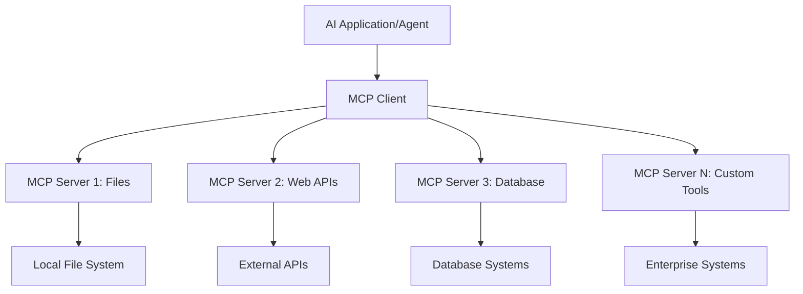

# 🌐 Module 2: MCP with Microsoft Foundry Toolkit Fundamentals

[]()
[]()
[]()

## 📋 Learning Objectives

By the end of this module, you will be able to:
- ✅ Understand Model Context Protocol (MCP) architecture and benefits
- ✅ Explore Microsoft's MCP server ecosystem
- ✅ Integrate MCP servers with Microsoft Foundry Toolkit Agent Builder
- ✅ Build a functional browser automation agent using Playwright MCP
- ✅ Configure and test MCP tools within your agents
- ✅ Export and deploy MCP-powered agents for production use

## 🎯 Building on Module 1

In Module 1, we mastered Microsoft Foundry Toolkit basics and created our first Python Agent. Now we'll **supercharge** your agents by connecting them to external tools and services through the revolutionary **Model Context Protocol (MCP)**. 

Think of this as upgrading from a basic calculator to a full computer - your AI agents will gain the ability to:
- 🌐 Browse and interact with websites
- 📁 Access and manipulate files
- 🔧 Integrate with enterprise systems
- 📊 Process real-time data from APIs

## 🧠 Understanding Model Context Protocol (MCP)

### 🔍 What is MCP?

Model Context Protocol (MCP) is the **"USB-C for AI applications"** - a revolutionary open standard that connects Large Language Models (LLMs) to external tools, data sources, and services. Just as USB-C eliminated cable chaos by providing one universal connector, MCP eliminates AI integration complexity with one standardized protocol.

### 🎯 The Problem MCP Solves

**Before MCP:**
- 🔧 Custom integrations for every tool
- 🔄 Vendor lock-in with proprietary solutions  
- 🔒 Security vulnerabilities from ad-hoc connections
- ⏱️ Months of development for basic integrations

**With MCP:**
- ⚡ Plug-and-play tool integration
- 🔄 Vendor-agnostic architecture
- 🛡️ Built-in security best practices
- 🚀 Minutes to add new capabilities

### 🏗️ MCP Architecture Deep Dive

MCP follows a **client-server architecture** that creates a secure, scalable ecosystem:



**🔧 Core Components:**

| Component | Role | Examples |
|-----------|------|----------|
| **MCP Hosts** | Applications that consume MCP services | Claude Desktop, VS Code, Microsoft Foundry Toolkit |
| **MCP Clients** | Protocol handlers (1:1 with servers) | Built into host applications |
| **MCP Servers** | Expose capabilities via standard protocol | Playwright, Files, Azure, GitHub |
| **Transport Layer** | Communication methods | stdio, HTTP, WebSockets |


## 🏢 Microsoft's MCP Server Ecosystem

Microsoft leads the MCP ecosystem with a comprehensive suite of enterprise-grade servers that address real-world business needs.

### 🌟 Featured Microsoft MCP Servers

#### 1. ☁️ Azure MCP Server
**🔗 Repository**: [azure/azure-mcp](https://github.com/azure/azure-mcp)
**🎯 Purpose**: Comprehensive Azure resource management with AI integration

**✨ Key Features:**
- Declarative infrastructure provisioning
- Real-time resource monitoring
- Cost optimization recommendations
- Security compliance checking

**🚀 Use Cases:**
- Infrastructure-as-Code with AI assistance
- Automated resource scaling
- Cloud cost optimization
- DevOps workflow automation

#### 2. 📊 Microsoft Dataverse MCP
**📚 Documentation**: [Microsoft Dataverse Integration](https://go.microsoft.com/fwlink/?linkid=2320176)
**🎯 Purpose**: Natural language interface for business data

**✨ Key Features:**
- Natural language database queries
- Business context understanding
- Custom prompt templates
- Enterprise data governance

**🚀 Use Cases:**
- Business intelligence reporting
- Customer data analysis
- Sales pipeline insights
- Compliance data queries

#### 3. 🌐 Playwright MCP Server
**🔗 Repository**: [microsoft/playwright-mcp](https://github.com/microsoft/playwright-mcp)
**🎯 Purpose**: Browser automation and web interaction capabilities

**✨ Key Features:**
- Cross-browser automation (Chrome, Firefox, Safari)
- Intelligent element detection
- Screenshot and PDF generation
- Network traffic monitoring

**🚀 Use Cases:**
- Automated testing workflows
- Web scraping and data extraction
- UI/UX monitoring
- Competitive analysis automation

#### 4. 📁 Files MCP Server
**🔗 Repository**: [microsoft/files-mcp-server](https://github.com/microsoft/files-mcp-server)
**🎯 Purpose**: Intelligent file system operations

**✨ Key Features:**
- Declarative file management
- Content synchronization
- Version control integration
- Metadata extraction

**🚀 Use Cases:**
- Documentation management
- Code repository organization
- Content publishing workflows
- Data pipeline file handling

#### 5. 📝 MarkItDown MCP Server
**🔗 Repository**: [microsoft/markitdown](https://github.com/microsoft/markitdown)
**🎯 Purpose**: Advanced Markdown processing and manipulation

**✨ Key Features:**
- Rich Markdown parsing
- Format conversion (MD ↔ HTML ↔ PDF)
- Content structure analysis
- Template processing

**🚀 Use Cases:**
- Technical documentation workflows
- Content management systems
- Report generation
- Knowledge base automation

#### 6. 📈 Clarity MCP Server
**📦 Package**: [@microsoft/clarity-mcp-server](https://www.npmjs.com/package/@microsoft/clarity-mcp-server)
**🎯 Purpose**: Web analytics and user behavior insights

**✨ Key Features:**
- Heatmap data analysis
- User session recordings
- Performance metrics
- Conversion funnel analysis

**🚀 Use Cases:**
- Website optimization
- User experience research
- A/B testing analysis
- Business intelligence dashboards

### 🌍 Community Ecosystem

Beyond Microsoft's servers, the MCP ecosystem includes:
- **🐙 GitHub MCP**: Repository management and code analysis
- **🗄️ Database MCPs**: PostgreSQL, MySQL, MongoDB integrations
- **☁️ Cloud Provider MCPs**: AWS, GCP, Digital Ocean tools
- **📧 Communication MCPs**: Slack, Teams, Email integrations

## 🛠️ Hands-On Lab: Building a Browser Automation Agent

**🎯 Project Goal**: Create an intelligent browser automation agent using Playwright MCP server that can navigate websites, extract information, and perform complex web interactions.

### 🚀 Phase 1: Agent Foundation Setup

#### Step 1: Initialize Your Agent
1. **Open Microsoft Foundry Toolkit Agent Builder**
2. **Create New Agent** with the following configuration:
   - **Name**: `BrowserAgent`
   - **Model**: Choose GPT-4o 


### 🔧 Phase 2: MCP Integration Workflow

#### Step 3: Add MCP Server Integration
1. **Navigate to Tools Section** in Agent Builder
2. **Click "Add Tool"** to open the integration menu
3. **Select "MCP Server"** from available options


**🔍 Understanding Tool Types:**
- **Built-in Tools**: Pre-configured Microsoft Foundry Toolkit functions
- **MCP Servers**: External service integrations
- **Custom APIs**: Your own service endpoints
- **Function Calling**: Direct model function access

#### Step 4: MCP Server Selection
1. **Choose "MCP Server"** option to proceed


2. **Browse MCP Catalog** to explore available integrations


### 🎮 Phase 3: Playwright MCP Configuration

#### Step 5: Select and Configure Playwright
1. **Click "Use Featured MCP Servers"** to access Microsoft's verified servers
2. **Select "Playwright"** from the featured list
3. **Accept Default MCP ID** or customize for your environment


#### Step 6: Enable Playwright Capabilities
**🔑 Critical Step**: Select **ALL** available Playwright methods for maximum functionality


**🛠️ Essential Playwright Tools:**
- **Navigation**: `goto`, `goBack`, `goForward`, `reload`
- **Interaction**: `click`, `fill`, `press`, `hover`, `drag`
- **Extraction**: `textContent`, `innerHTML`, `getAttribute`
- **Validation**: `isVisible`, `isEnabled`, `waitForSelector`
- **Capture**: `screenshot`, `pdf`, `video`
- **Network**: `setExtraHTTPHeaders`, `route`, `waitForResponse`

#### Step 7: Verify Integration Success
**✅ Success Indicators:**
- All tools appear in Agent Builder interface
- No error messages in the integration panel
- Playwright server status shows "Connected"


**🔧 Troubleshooting Common Issues:**
- **Connection Failed**: Check internet connectivity and firewall settings
- **Missing Tools**: Ensure all capabilities were selected during setup
- **Permission Errors**: Verify VS Code has necessary system permissions

### 🎯 Phase 4: Advanced Prompt Engineering

#### Step 8: Design Intelligent System Prompts
Create sophisticated prompts that leverage Playwright's full capabilities:

```markdown
# Web Automation Expert System Prompt

## Core Identity
You are an advanced web automation specialist with deep expertise in browser automation, web scraping, and user experience analysis. You have access to Playwright tools for comprehensive browser control.

## Capabilities & Approach
### Navigation Strategy
- Always start with screenshots to understand page layout
- Use semantic selectors (text content, labels) when possible
- Implement wait strategies for dynamic content
- Handle single-page applications (SPAs) effectively

### Error Handling
- Retry failed operations with exponential backoff
- Provide clear error descriptions and solutions
- Suggest alternative approaches when primary methods fail
- Always capture diagnostic screenshots on errors

### Data Extraction
- Extract structured data in JSON format when possible
- Provide confidence scores for extracted information
- Validate data completeness and accuracy
- Handle pagination and infinite scroll scenarios

### Reporting
- Include step-by-step execution logs
- Provide before/after screenshots for verification
- Suggest optimizations and alternative approaches
- Document any limitations or edge cases encountered

## Ethical Guidelines
- Respect robots.txt and rate limiting
- Avoid overloading target servers
- Only extract publicly available information
- Follow website terms of service
```

#### Step 9: Create Dynamic User Prompts
Design prompts that demonstrate various capabilities:

**🌐 Web Analysis Example:**
```markdown
Navigate to github.com/kinfey and provide a comprehensive analysis including:
1. Repository structure and organization
2. Recent activity and contribution patterns  
3. Documentation quality assessment
4. Technology stack identification
5. Community engagement metrics
6. Notable projects and their purposes

Include screenshots at key steps and provide actionable insights.
```


### 🚀 Phase 5: Execution and Testing

#### Step 10: Execute Your First Automation
1. **Click "Run"** to launch the automation sequence
2. **Monitor Real-time Execution**:
   - Chrome browser launches automatically
   - Agent navigates to target website
   - Screenshots capture each major step
   - Analysis results stream in real-time


#### Step 11: Analyze Results and Insights
Review comprehensive analysis in Agent Builder's interface:


### 🌟 Phase 6: Advanced Capabilities and Deployment

#### Step 12: Export and Production Deployment
Agent Builder supports multiple deployment options:


## 🎓 Module 2 Summary & Next Steps

### 🏆 Achievement Unlocked: MCP Integration Master

**✅ Skills Mastered:**
- [ ] Understanding MCP architecture and benefits
- [ ] Navigating Microsoft's MCP server ecosystem
- [ ] Integrating Playwright MCP with Microsoft Foundry Toolkit
- [ ] Building sophisticated browser automation agents
- [ ] Advanced prompt engineering for web automation

### 📚 Additional Resources

- **🔗 MCP Specification**: [Official Protocol Documentation](https://modelcontextprotocol.io/)
- **🛠️ Playwright API**: [Complete Method Reference](https://playwright.dev/docs/api/class-playwright)
- **🏢 Microsoft MCP Servers**: [Enterprise Integration Guide](https://github.com/microsoft/mcp-servers)
- **🌍 Community Examples**: [MCP Server Gallery](https://github.com/modelcontextprotocol/servers)

**🎉 Congratulations!** You've successfully mastered MCP integration and can now build production-ready AI agents with external tool capabilities!


### 🔜 Continue to Next Module

Ready to take your MCP skills to the next level? Proceed to **[Module 3: Advanced MCP Development with Microsoft Foundry Toolkit](../lab3/README.md)** where you'll learn how to:
- Create your own custom MCP servers
- Configure and use the latest MCP Python SDK
- Set up the MCP Inspector for debugging
- Master advanced MCP server development workflows
- Build a Weather MCP Server from scratch

---

<!-- CO-OP TRANSLATOR DISCLAIMER START -->
**Disclaimer**:
This document has been translated using AI translation service [Co-op Translator](https://github.com/Azure/co-op-translator). While we strive for accuracy, please be aware that automated translations may contain errors or inaccuracies. The original document in its native language should be considered the authoritative source. For critical information, professional human translation is recommended. We are not liable for any misunderstandings or misinterpretations arising from the use of this translation.
<!-- CO-OP TRANSLATOR DISCLAIMER END -->