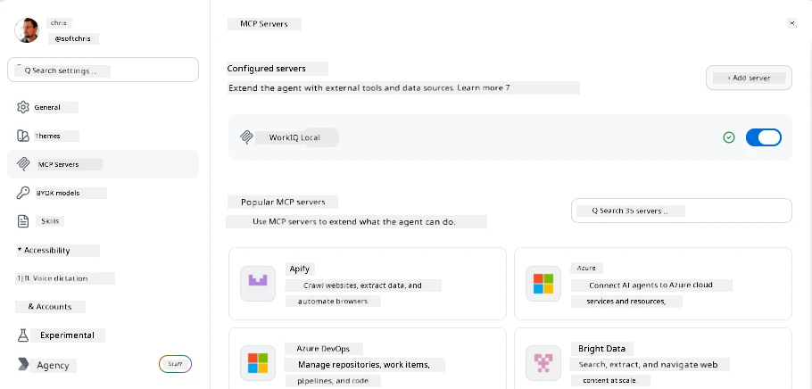
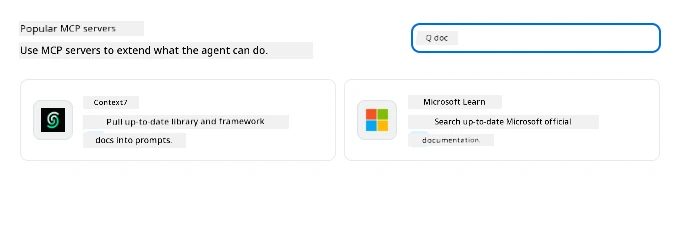
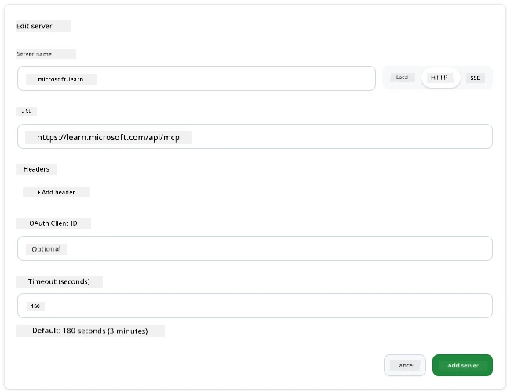
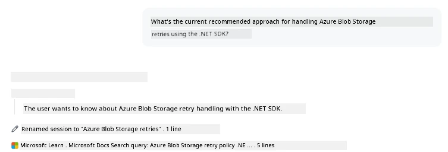
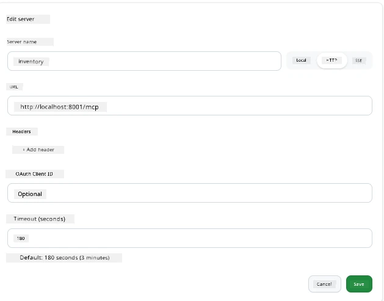
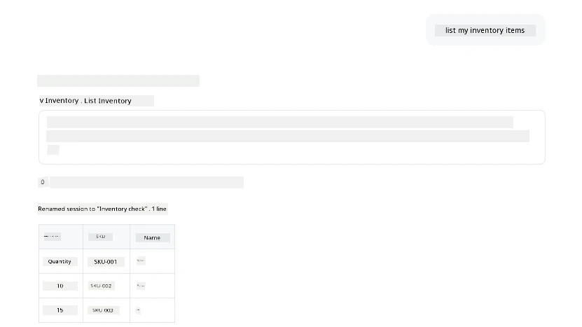
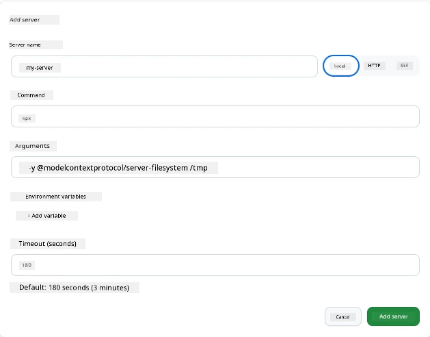

# Using MCP Servers in the GitHub Copilot App

By now you know how MCP works. You've built servers, defined tools and resources, and wired up clients. What we haven't done yet is flip the perspective: instead of you being the one building the server, what does it look like to be on the *consuming* side—as a user of an AI-powered app that supports MCP?

[GitHub Copilot App](https://github.com/github/app) is a desktop app that can use MCP Servers. By connecting MCP servers to it, you unlock a new level: Copilot can now reach into your documentation, call your internal APIs, query your database, or talk to any service you've wrapped in a server. The app becomes the host; your MCP servers become its tools.

This lesson walks you through that experience end-to-end—from finding the MCP settings panel to connecting a real documentation server and then wiring up a custom one of your own.

## Learning Objectives

By the end of this lesson, you will be able to:

- Locate and navigate the MCP Servers panel in the Copilot App settings.
- Connect a hosted documentation server and use it in a session.
- Register a custom server and verify Copilot can invoke its tools.
- Configure how a server is called by providing either environment variables or custom headers (if HTTP)

## The Copilot App as an MCP Host

Here's the fundamental idea: **Copilot's agents are smart, but they only know what you tell them.** By default, an agent can read files in your workspace and run terminal commands, but it can't query your database, peek at your calendar, or call a custom API without help. That's where MCP servers come in. They act as bridges between Copilot and your systems—databases, version control, APIs, design tools—giving agents access to information and actions they need to complete work.

Let's start by finding those settings for managing your app's MCP Servers.

## Step 1: Finding the MCP Settings Panel

Open the Copilot App and locate a cog icon on the bottom-left and click it.


Make sure you select "MCP Servers" and you should now see your already configured servers at the top, a marketplace of popular servers at the bottom, and an "Add Server" button at the top like so:



This is your control center. You add, remove, enable, and disable servers here. Changes take effect for new sessions; if you have a session open, you'll need to start a fresh one after changing this list.

## Step 2: Connecting a Documentation Server

Let's do something immediately useful. The Microsoft Docs MCP server gives Copilot access to official Microsoft documentation. This includes Azure, .NET, TypeScript, and more. Instead of the agent relying on its training data (which has a cutoff date), it can pull current docs at query time.

Here's how to add it:

1. In the popular servers grid, type  **learn** and select the server called "Microsoft Learn".

   

   Once clicked, it presents you with a form where the name, transport type and URL is prefilled, all you have to do is click "Add Server".

2. Click "Add Server", it should take a few seconds to connect to the server.

   

   Once added, it should show up in the top area as a configured server. Let's try it out next.

3. Close the dialog and select Quick chat. 

4. Type the below prompt to trigger a tool on the Microsoft Learn server.

   ```text
   What's the current recommended approach for handling Azure Blob Storage 
   retries using the .NET SDK?
   ```

   

You should see how it refers to the MCP Server we just added.

## Step 3: Connecting a Custom stdio Server

The presets are convenient, but the real power is connecting your own servers. Let's say you've built a server (or been provided one) that exposes your internal API or company knowledge base. In this case, we will use an MCP Server we built that handles our company's inventory management.

1. Click the cog and select "MCP servers" again.

2. Select the "Add Server" button and "+ Add Custom server", and provide the following values:

   - Name: `Inventory Server`
   - Select transport (on the right), **http**

   Select "Add Server" and it should appear in your list of configured servers.

   

4. To test it out, run a prompt like so:

    ```
    list inventory
    ```

   

   You should now see a list of inventory items returned from your custom-built server.

Great, you should now have a good grasp of adding external as well as your own MCP servers to the Copilot App. Next, let's talk about handling secrets and environment variables.

## Step 4: Advanced settings

So far, you've seen how to add MCP Servers where you just provide a name and URL. But what if your server needs an API key or some other value? Well, depending on transport type, we can supply it with what it needs.

- **http or SSE transport**: Here we can set headers as needed.

   For auth, you can specify an Authorization header, for example. The value can be a static string. If you use OAuth, you can instead give it an OAuth client ID.

   

- **stdio transport**: Environment variables can be set. 

   Here you can specify any number of environment variables you need that should be passed into the server when you start it up.

   

## Summary

The Copilot App treats MCP servers as first-class extensions of the agent's capabilities. You've seen the full journey in this lesson from adding MCP servers to using them in a session. You can now connect to public servers, internal APIs, and custom tools, giving your agents the ability to access the information and actions they need to complete tasks autonomously.

## 📚 Additional Resources

### Official docs

- [GitHub Copilot App](https://github.com/github/app)
- [MCP Specification](https://modelcontextprotocol.io/specification/2025-03-26) - Model Context Protocol specification

### Community
- [MCP Community Discord](https://discord.com/invite/ByRwuEEgH4) - Live discussions
- [GitHub Discussions](https://github.com/microsoft/MCP-Server-and-PostgreSQL-Sample-Retail/discussions) - Q&A and sharing
- [Stack Overflow](https://stackoverflow.com/questions/tagged/model-context-protocol) - Technical questions

---

<!-- CO-OP TRANSLATOR DISCLAIMER START -->
**Disclaimer**:
This document has been translated using AI translation service [Co-op Translator](https://github.com/Azure/co-op-translator). While we strive for accuracy, please be aware that automated translations may contain errors or inaccuracies. The original document in its native language should be considered the authoritative source. For critical information, professional human translation is recommended. We are not liable for any misunderstandings or misinterpretations arising from the use of this translation.
<!-- CO-OP TRANSLATOR DISCLAIMER END -->