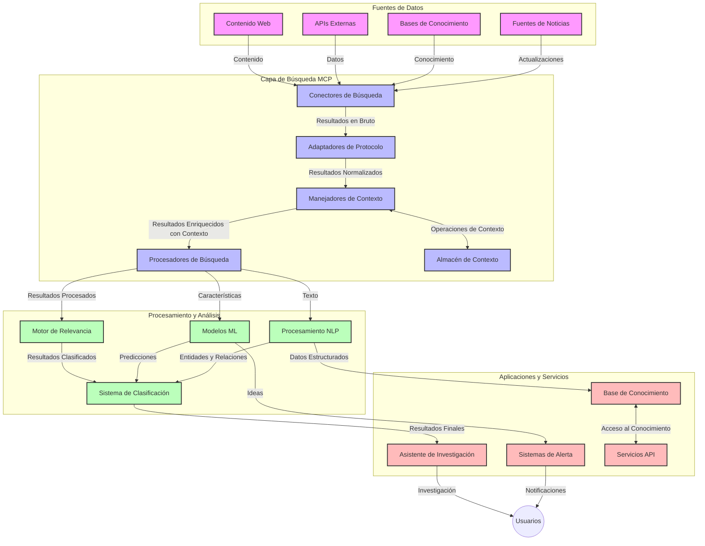
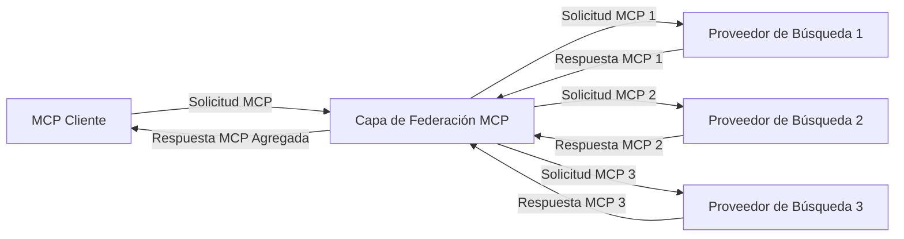
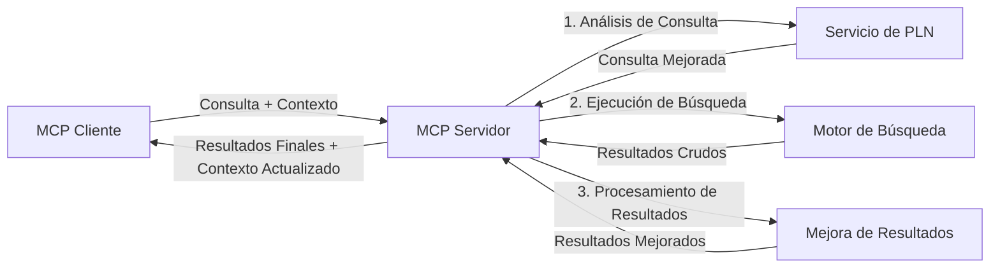

# Protocolo de Contexto de Modelo para Búsqueda Web en Tiempo Real

## Visión General

La búsqueda web en tiempo real se ha vuelto esencial en el entorno actual impulsado por la información, donde las aplicaciones necesitan acceso inmediato a información actualizada a través de Internet para proporcionar respuestas relevantes y oportunas. El Protocolo de Contexto de Modelo (MCP) representa un avance significativo en la optimización de estos procesos de búsqueda en tiempo real, mejorando la eficiencia de la búsqueda, manteniendo la integridad contextual y mejorando el rendimiento general del sistema.

Este módulo explora cómo MCP transforma la búsqueda web en tiempo real proporcionando un enfoque estandarizado para la gestión del contexto entre modelos de IA, motores de búsqueda y aplicaciones.

### Lo que Aprenderás

En esta guía completa, descubrirás:

- Cómo MCP crea un puente fluido entre los modelos de IA y las capacidades de búsqueda web en tiempo real
- Patrones arquitectónicos para implementar soluciones de búsqueda eficientes y escalables con MCP
- Técnicas para preservar el contexto de búsqueda a través de múltiples consultas e interacciones
- Implementaciones prácticas en código en Python y JavaScript para varios escenarios de búsqueda
- Métodos para equilibrar relevancia, actualidad y rendimiento en sistemas de búsqueda potenciada por MCP

## Introducción a la Búsqueda Web en Tiempo Real

La búsqueda web en tiempo real es un enfoque tecnológico que permite la consulta, procesamiento y análisis continuos de información basada en la web a medida que se publica o actualiza, permitiendo que los sistemas proporcionen información fresca y relevante con mínima latencia. A diferencia de los sistemas de búsqueda tradicionales que operan sobre datos indexados que pueden tener horas o días de antigüedad, la búsqueda en tiempo real procesa datos en vivo de la web, entregando percepciones e información que reflejan el estado actual del contenido en línea.

### Conceptos Clave de la Búsqueda Web en Tiempo Real:

- **Procesamiento Continuo de Consultas**: Las consultas de búsqueda se procesan contra fuentes de datos que se actualizan constantemente
- **Priorización de la Actualidad**: Los sistemas están diseñados para priorizar información fresca
- **Equilibrio de Relevancia**: Mantener un balance entre relevancia y actualidad
- **Arquitectura Escalable**: Los sistemas deben manejar cargas variables de consultas y volúmenes de datos
- **Comprensión Contextual**: Mantener el contexto del usuario a lo largo de las iteraciones de búsqueda es crucial para obtener resultados significativos
- **Reformulación Dinámica de Consultas**: Modificación adaptativa de consultas basada en el contexto y resultados previos
- **Integración Multi-Fuente**: Combinar resultados de múltiples proveedores de búsqueda y fuentes web
- **Comprensión Semántica**: Procesar consultas y contenido basándose en el significado más que solo en palabras clave
- **Clasificación en Tiempo Real**: Ajustar continuamente el orden de los resultados a medida que se obtiene nueva información

### El Protocolo de Contexto de Modelo y la Búsqueda Web en Tiempo Real

El Protocolo de Contexto de Modelo (MCP) aborda varios desafíos críticos en entornos de búsqueda web en tiempo real:

1. **Preservación del Contexto de Búsqueda**: MCP estandariza cómo se mantiene el contexto a través de componentes de búsqueda distribuidos, asegurando que los modelos de IA y nodos de procesamiento tengan acceso al historial de consulta relevante y preferencias del usuario.

2. **Gestión Eficiente de Consultas**: Al proporcionar mecanismos estructurados para la transmisión del contexto, MCP reduce la sobrecarga de repetir contexto en cada iteración de búsqueda.

3. **Interoperabilidad**: MCP crea un lenguaje común para compartir contexto entre tecnologías de búsqueda diversas y modelos de IA, habilitando arquitecturas más flexibles y extensibles.

4. **Contexto Optimizado para Búsqueda**: Las implementaciones de MCP pueden priorizar qué elementos contextuales son más relevantes para una búsqueda efectiva, optimizando tanto el rendimiento como la precisión.

5. **Procesamiento de Búsqueda Adaptativo**: Con una gestión adecuada del contexto a través de MCP, los sistemas de búsqueda pueden ajustar dinámicamente el procesamiento basado en las necesidades del usuario y el panorama de la información en evolución.

En aplicaciones modernas que van desde la agregación de noticias hasta asistentes de investigación, la integración de MCP con tecnologías de búsqueda web permite una búsqueda más inteligente y consciente del contexto que puede ofrecer resultados cada vez más relevantes conforme continúan las interacciones del usuario.

## Objetivos de Aprendizaje

Al final de esta lección, serás capaz de:

- Entender los fundamentos de la búsqueda web en tiempo real y sus desafíos en aplicaciones modernas
- Explicar cómo el Protocolo de Contexto de Modelo (MCP) mejora las capacidades de búsqueda web en tiempo real
- Implementar soluciones de búsqueda basadas en MCP usando frameworks y APIs populares
- Diseñar y desplegar arquitecturas de búsqueda escalables y de alto rendimiento con MCP
- Aplicar conceptos de MCP a varios casos de uso, incluyendo búsqueda semántica, asistencia en investigación y navegación aumentada por IA
- Evaluar tendencias emergentes e innovaciones futuras en tecnologías de búsqueda basadas en MCP
- Desarrollar sistemas de búsqueda conscientes del contexto que aprenden de las interacciones de los usuarios
- Integrar capacidades de búsqueda web en asistentes de IA utilizando protocolos estandarizados MCP
- Crear pipelines de búsqueda multinivel que refinan progresivamente los resultados basados en el contexto
- Optimizar el rendimiento de búsqueda manteniendo una completa conciencia del contexto

### Definición y Significado

La búsqueda web en tiempo real implica la consulta, recuperación y entrega continua de información basada en la web con latencia mínima. A diferencia de los motores de búsqueda tradicionales que rastrean periódicamente e indexan la web, la búsqueda en tiempo real apunta a mostrar la información tan pronto como está disponible, permitiendo el acceso inmediato al contenido más actual.

Características clave de la búsqueda web en tiempo real incluyen:

- **Frescura**: Priorizar contenido y actualizaciones recientes
- **Procesamiento Continuo**: Monitorización constante de nueva información
- **Adaptación de Consultas**: Refinar las consultas de búsqueda basado en el contexto y retroalimentación
- **Entrega Inmediata**: Proporcionar resultados con mínima demora
- **Retención de Contexto**: Construir sobre consultas previas para mejorar la relevancia

### Desafíos en la Búsqueda Web Tradicional

Los enfoques tradicionales de búsqueda web enfrentan varias limitaciones cuando se aplican a escenarios en tiempo real:

1. **Fragmentación del Contexto**: Dificultad para mantener el contexto de búsqueda a través de múltiples consultas
2. **Actualidad de la Información**: Retos en acceder y priorizar la información más reciente
3. **Complejidad de Integración**: Problemas con la interoperabilidad entre sistemas de búsqueda y aplicaciones
4. **Problemas de Latencia**: Balancear la búsqueda exhaustiva con los requerimientos de tiempo de respuesta
5. **Ajuste de Relevancia**: Asegurar precisión y relevancia mientras se prioriza la actualidad

## Entendiendo el Protocolo de Contexto de Modelo (MCP) para Búsqueda

### ¿Qué es MCP en Contextos de Búsqueda?

El Protocolo de Contexto de Modelo (MCP) es un protocolo de comunicación estandarizado diseñado para facilitar la interacción eficiente entre modelos de IA y aplicaciones. En el contexto de la búsqueda web en tiempo real, MCP proporciona un marco para:

- Preservar el contexto de búsqueda a lo largo de secuencias de consultas
- Estandarizar los formatos de consulta y resultados de búsqueda
- Optimizar la transmisión de parámetros y resultados de búsqueda
- Mejorar la comunicación entre modelos y motores de búsqueda

### Componentes y Arquitectura Clave

La arquitectura MCP para búsqueda web en tiempo real consta de varios componentes clave:

1. **Manejadores de Contexto de Consulta**: Gestionan y mantienen el contexto de búsqueda a través de múltiples consultas
2. **Procesadores de Búsqueda**: Procesan las solicitudes entrantes de búsqueda usando técnicas conscientes del contexto
3. **Adaptadores de Protocolo**: Convierten entre diferentes APIs de búsqueda preservando el contexto
4. **Almacén de Contexto**: Guarda y recupera eficientemente el historial de búsqueda y preferencias
5. **Conectores de Búsqueda**: Conectan con varios motores de búsqueda y APIs web



### Cómo MCP Mejora la Búsqueda Web en Tiempo Real

MCP aborda los desafíos tradicionales de la búsqueda web a través de:

- **Continuidad Contextual**: Mantener las relaciones entre consultas a lo largo de toda la sesión de búsqueda
- **Transmisión Optimizada**: Reducir la redundancia en los parámetros de búsqueda mediante una gestión inteligente del contexto
- **Interfaces Estandarizadas**: Proporcionar APIs consistentes para los componentes de búsqueda
- **Latencia Reducida**: Minimizar la sobrecarga de procesamiento mediante un manejo eficiente del contexto
- **Relevancia Mejorada**: Mejorar la relevancia de la búsqueda preservando la intención del usuario a través de múltiples consultas

## Integración e Implementación

Los sistemas de búsqueda web en tiempo real requieren un diseño arquitectónico e implementación cuidadosa para mantener tanto el rendimiento como la integridad contextual. El Protocolo de Contexto de Modelo ofrece un enfoque estandarizado para integrar modelos IA y tecnologías de búsqueda, permitiendo pipelines de búsqueda más sofisticados y conscientes del contexto.

### Visión General de la Integración MCP en Arquitecturas de Búsqueda

Implementar MCP en entornos de búsqueda web en tiempo real implica varias consideraciones clave:

1. **Serialización del Contexto de Búsqueda**: MCP proporciona mecanismos eficientes para codificar la información contextual dentro de las solicitudes de búsqueda, asegurando que el contexto esencial acompañe a la consulta a lo largo del pipeline de procesamiento. Esto incluye formatos de serialización estandarizados optimizados para metadatos relacionados con la búsqueda.

2. **Procesamiento Stateful de Búsqueda**: MCP habilita un procesamiento stateful más inteligente manteniendo una representación consistente del contexto a través de iteraciones de búsqueda. Esto es particularmente valioso en pipelines de búsqueda multinivel donde el refinamiento del contexto mejora los resultados.

3. **Expansión y Refinamiento de Consultas**: Las implementaciones MCP en sistemas de búsqueda pueden facilitar una expansión y refinamiento sofisticado de consultas basado en el contexto acumulado, permitiendo resultados cada vez más relevantes a medida que avanza la sesión de búsqueda.

4. **Almacenamiento en Caché y Priorización de Resultados**: Al estandarizar el manejo del contexto, MCP ayuda a gestionar el almacenamiento en caché y la priorización de resultados, permitiendo que los componentes se adapten en base al contexto de búsqueda en evolución.

5. **Federación y Agregación de Búsqueda**: MCP facilita una federación más sofisticada de búsqueda a través de múltiples backends proporcionando representaciones estructuradas del contexto de búsqueda, permitiendo una agregación más significativa de resultados provenientes de fuentes diversas.

La implementación de MCP a través de diversas tecnologías de búsqueda crea un enfoque unificado para la gestión del contexto, reduciendo la necesidad de código de integración personalizado mientras mejora la capacidad del sistema para mantener un contexto significativo conforme evolucionan las consultas de búsqueda.

### MCP en Varias Implementaciones de Búsqueda Web

Estos ejemplos siguen la especificación actual de MCP que se basa en un protocolo JSON-RPC con distintos mecanismos de transporte. El código demuestra cómo puedes implementar integraciones personalizadas de búsqueda manteniendo plena compatibilidad con el protocolo MCP.

<details>
<summary>Implementación en Python con API Genérica de Búsqueda</summary>

```python
import asyncio
import json
import aiohttp
from typing import Dict, Any, Optional, List
from contextlib import asynccontextmanager
from collections.abc import AsyncIterator

# Importar bibliotecas estándar de MCP
from mcp.client.session import ClientSession
from mcp.client.streamable_http import streamablehttp_client
from mcp.types import TextContent, CreateMessageRequestParams, CreateMessageResult
from mcp.server.fastmcp import FastMCP

# Crear un servidor FastMCP para búsqueda web
search_server = FastMCP("WebSearch")

# Clase para manejar operaciones de búsqueda web
class WebSearchHandler:
    def __init__(self, api_endpoint: str, api_key: str):
        self.api_endpoint = api_endpoint
        self.api_key = api_key
        self.session = None
        
    async def initialize(self):
        """Initialize the HTTP session"""
        self.session = aiohttp.ClientSession(
            headers={"Authorization": f"Bearer {self.api_key}"}
        )
    
    async def close(self):
        """Close the HTTP session"""
        if self.session:
            await self.session.close()
            
    async def perform_search(self, query: str, max_results: int = 5, 
                           include_domains: List[str] = None, 
                           exclude_domains: List[str] = None,
                           time_period: str = "any") -> Dict[str, Any]:
        """Perform web search using the search API"""
        # Construir parámetros de búsqueda
        search_params = {
            "q": query,
            "limit": max_results,
            "time": time_period
        }
        
        if include_domains:
            search_params["site"] = ",".join(include_domains)
            
        if exclude_domains:
            search_params["exclude_site"] = ",".join(exclude_domains)
        
        # Realizar la solicitud de búsqueda
        try:
            async with self.session.get(
                self.api_endpoint,
                params=search_params
            ) as response:
                if response.status != 200:
                    error_text = await response.text()
                    raise Exception(f"Search API error: {response.status} - {error_text}")
                
                search_data = await response.json()
                
                # Transformar la respuesta específica de la API a un formato estándar
                results = []
                for item in search_data.get("results", []):
                    results.append({
                        "title": item.get("title", ""),
                        "url": item.get("url", ""),
                        "snippet": item.get("snippet", ""),
                        "date": item.get("published_date", ""),
                        "source": item.get("source", "")
                    })
                
                return {
                    "query": query,
                    "totalResults": len(results),
                    "results": results
                }
        except Exception as e:
            print(f"Search API request error: {e}")
            raise

# Inicializar el manejador de búsqueda
search_handler = WebSearchHandler(
    api_endpoint="https://api.search-service.example/search",
    api_key="your-api-key-here"
)

# Configurar lifespan para manejar el manejador de búsqueda
@asyncio.asynccontextmanager
async def app_lifespan(server: FastMCP):
    """Manage application lifecycle"""
    await search_handler.initialize()
    try:
        yield {"search_handler": search_handler}
    finally:
        await search_handler.close()

# Establecer lifespan para el servidor
search_server = FastMCP("WebSearch", lifespan=app_lifespan)

# Registrar una herramienta de búsqueda web
@search_server.tool()
async def web_search(query: str, max_results: int = 5, 
                   include_domains: List[str] = None,
                   exclude_domains: List[str] = None,
                   time_period: str = "any") -> Dict[str, Any]:
    """
    Search the web for information
    
    Args:
        query: The search query
        max_results: Maximum number of results to return (default: 5)
        include_domains: List of domains to include in search results
        exclude_domains: List of domains to exclude from search results
        time_period: Time period for results ("day", "week", "month", "any")
        
    Returns:
        Dictionary containing search results
    """
    ctx = search_server.get_context()
    search_handler = ctx.request_context.lifespan_context["search_handler"]
    
    results = await search_handler.perform_search(
        query=query,
        max_results=max_results,
        include_domains=include_domains,
        exclude_domains=exclude_domains,
        time_period=time_period
    )
    
    return results

# Ejemplo de uso del cliente
async def client_example():
    # Conectar al servidor de búsqueda usando transporte HTTP Streamable
    async with streamablehttp_client("http://localhost:8000/mcp") as (read, write, _):
        async with ClientSession(read, write) as session:
            # Inicializar la conexión
            await session.initialize()
            
            # Llamar a la herramienta web_search
            search_results = await session.call_tool(
                "web_search", 
                {
                    "query": "latest developments in AI and Model Context Protocol",
                    "max_results": 5,
                    "time_period": "day",
                    "include_domains": ["github.com", "microsoft.com"]
                }
            )
            
            print(f"Search results: {search_results}")

# Ejemplo de ejecución del servidor
if __name__ == "__main__":
    # Ejecutar el servidor con transporte HTTP Streamable
    search_server.run(transport="streamable-http")
```
</details> 

<details>
<summary>Implementación en JavaScript con Búsqueda Basada en Navegador</summary>

```javascript
// Implementación del servidor MCP para búsqueda web
import { McpServer, ResourceTemplate } from '@modelcontextprotocol/sdk/server/mcp.js';
import { StreamableHTTPServerTransport } from '@modelcontextprotocol/sdk/server/streamableHttp.js';
import { z } from 'zod';

// Crear un servidor MCP para búsqueda web
const searchServer = new McpServer({
    name: "BrowserSearch",
    description: "A server that provides web search capabilities"
});

// Clase del servicio de búsqueda
class SearchService {
    constructor(searchApiUrl, apiKey) {
        this.searchApiUrl = searchApiUrl;
        this.apiKey = apiKey;
    }

    async performSearch(parameters) {
        const {
            query = '',
            maxResults = 5,
            includeDomains = [],
            excludeDomains = [],
            timePeriod = 'any'
        } = parameters;
        
        // Construir URL de búsqueda con parámetros
        const url = new URL(this.searchApiUrl);
        url.searchParams.append('q', query);
        url.searchParams.append('limit', maxResults);
        url.searchParams.append('time', timePeriod);
        
        if (includeDomains.length > 0) {
            url.searchParams.append('site', includeDomains.join(','));
        }
        
        if (excludeDomains.length > 0) {
            url.searchParams.append('exclude_site', excludeDomains.join(','));
        }
        
        try {
            const response = await fetch(url.toString(), {
                method: 'GET',
                headers: {
                    'Authorization': `Bearer ${this.apiKey}`,
                    'Content-Type': 'application/json'
                }
            });
            
            if (!response.ok) {
                const errorText = await response.text();
                throw new Error(`Search API error: ${response.status} - ${errorText}`);
            }
            
            const searchData = await response.json();
            
            // Transformar la respuesta específica de la API a un formato estándar
            const results = searchData.results?.map(item => ({
                title: item.title || '',
                url: item.url || '',
                snippet: item.snippet || '',
                date: item.published_date || '',
                source: item.source || ''
            })) || [];
            
            return {
                query,
                totalResults: results.length,
                results
            };
        } catch (error) {
            console.error('Search API request error:', error);
            throw error;
        }
    }
}

// Inicializar el servicio de búsqueda
const searchService = new SearchService(
    'https://api.search-service.example/search',
    'your-api-key-here'
);

// Configurar el proveedor de contexto para el servidor
searchServer.setContextProvider(() => {
    return {
        searchService
    };
});

// Registrar la herramienta de búsqueda web
searchServer.tool({
    name: 'web_search',
    description: 'Search the web for information',
    parameters: {
        type: 'object',
        properties: {
            query: {
                type: 'string',
                description: 'The search query'
            },
            maxResults: {
                type: 'integer',
                description: 'Maximum number of results to return',
                default: 5
            },
            includeDomains: {
                type: 'array',
                items: { type: 'string' },
                description: 'List of domains to include in search results'
            },
            excludeDomains: {
                type: 'array',
                items: { type: 'string' },
                description: 'List of domains to exclude from search results'
            },
            timePeriod: {
                type: 'string',
                description: 'Time period for results',
                enum: ['day', 'week', 'month', 'any'],
                default: 'any'
            }
        },
        required: ['query']
    },
    handler: async (params, context) => {
        const { searchService } = context;
        return await searchService.performSearch(params);
    }
});

// Código de ejemplo del cliente para conectar con el servidor de búsqueda
import { Client } from '@modelcontextprotocol/sdk/client/index.js';
import { StreamableHTTPClientTransport } from '@modelcontextprotocol/sdk/client/streamableHttp.js';

async function connectToSearchServer() {
    // Conectar con el servidor de búsqueda
    const transport = new StreamableHTTPClientTransport(
        new URL('http://localhost:8000/mcp')
    );
    
    const client = new Client({
        name: 'search-client',
        version: '1.0.0'
    });
    
    await client.connect(transport);
    
    // Ejecutar la herramienta de búsqueda
    const searchResults = await client.callTool({
        name: 'web_search',
        arguments: {
            query: 'Model Context Protocol implementation examples',
            maxResults: 10,
            timePeriod: 'week',
            includeDomains: ['github.com', 'docs.microsoft.com']
        }
    });
    
    console.log('Search results:', searchResults);
    
    // Limpieza
    await client.disconnect();
}

// Iniciar el servidor
const transport = new StreamableHTTPServerTransport();
await searchServer.connect(transport);
console.log('Search server running at http://localhost:8000/mcp');

// En un proceso separado o después de iniciar el servidor
// connectToSearchServer().catch(console.error);
```
</details> 

## Descargo de Responsabilidad sobre los Ejemplos de Código

> **Nota Importante**: Los ejemplos de código a continuación demuestran la integración del Protocolo de Contexto de Modelo (MCP) con la funcionalidad de búsqueda web. Aunque siguen los patrones y estructuras de los SDK oficiales de MCP, han sido simplificados con fines educativos.
> 
> Estos ejemplos muestran:
> 
> 1. **Implementación en Python**: Una implementación de servidor FastMCP que proporciona una herramienta de búsqueda web y se conecta a una API externa de búsqueda. Este ejemplo demuestra la gestión adecuada del ciclo de vida, manejo de contexto e implementación de herramientas siguiendo los patrones del [SDK oficial MCP para Python](https://github.com/modelcontextprotocol/python-sdk). El servidor utiliza el transporte HTTP Streamable recomendado que ha sustituido el transporte SSE anterior para despliegues en producción.
> 
> 2. **Implementación en JavaScript**: Una implementación en TypeScript/JavaScript usando el patrón FastMCP del [SDK oficial MCP para TypeScript](https://github.com/modelcontextprotocol/typescript-sdk) para crear un servidor de búsqueda con definiciones adecuadas de herramientas y conexiones cliente. Sigue los patrones recomendados más recientes para gestión de sesiones y preservación del contexto.
> 
> Estos ejemplos requerirían manejo adicional de errores, autenticación y código específico de integración de API para uso en producción. Los endpoints del API de búsqueda mostrados (`https://api.search-service.example/search`) son marcadores de posición y deben reemplazarse por endpoints reales de servicios de búsqueda.
> 
> Para detalles completos de implementación y enfoques actualizados, por favor consulte la [especificación oficial MCP](https://spec.modelcontextprotocol.io/) y la documentación del SDK.

## Conceptos Básicos

### El Marco del Protocolo de Contexto de Modelo (MCP)

En su base, el Protocolo de Contexto de Modelo provee una forma estandarizada para que modelos de IA, aplicaciones y servicios intercambien contexto. En la búsqueda web en tiempo real, este marco es esencial para crear experiencias coherentes de búsqueda multimodal. Los componentes clave incluyen:

1. **Arquitectura Cliente-Servidor**: MCP establece una clara separación entre clientes de búsqueda (solicitantes) y servidores de búsqueda (proveedores), permitiendo modelos flexibles de despliegue.

2. **Comunicación JSON-RPC**: El protocolo utiliza JSON-RPC para el intercambio de mensajes, haciéndolo compatible con tecnologías web y fácil de implementar en diferentes plataformas.

3. **Gestión de Contexto**: MCP define métodos estructurados para mantener, actualizar y aprovechar el contexto de búsqueda a través de múltiples interacciones.

4. **Definiciones de Herramientas**: Las capacidades de búsqueda se exponen como herramientas estandarizadas con parámetros y valores de retorno bien definidos.

5. **Soporte para Streaming**: El protocolo soporta el streaming de resultados, esencial para búsquedas en tiempo real donde los resultados pueden llegar progresivamente.

### Patrones de Integración de Búsqueda Web

Al integrar MCP con la búsqueda web surgen varios patrones:

#### 1. Integración Directa con Proveedores de Búsqueda


En este patrón, el servidor MCP se conecta directamente con una o más APIs de búsqueda, traduciendo las solicitudes MCP en llamadas específicas de API y formateando los resultados como respuestas MCP.

#### 2. Búsqueda Federada con Preservación de Contexto



Este patrón distribuye las consultas de búsqueda a múltiples proveedores de búsqueda compatibles con MCP, cada uno potencialmente especializado en distintos tipos de contenido o capacidades de búsqueda, manteniendo un contexto unificado.

#### 3. Cadena de Búsqueda Mejorada con Contexto



En este patrón, el proceso de búsqueda se divide en múltiples etapas, enriqueciendo el contexto en cada paso, resultando en resultados progresivamente más relevantes.

### Componentes del Contexto de Búsqueda

En la búsqueda web basada en MCP, el contexto típicamente incluye:

- **Historial de Consultas**: Consultas de búsqueda previas en la sesión
- **Preferencias del Usuario**: Idioma, región, configuraciones de búsqueda segura
- **Historial de Interacciones**: Qué resultados fueron clicados, tiempo invertido en resultados
- **Parámetros de Búsqueda**: Filtros, órdenes de clasificación y otros modificadores
- **Conocimiento del Dominio**: Contexto específico del tema relevante para la búsqueda
- **Contexto Temporal**: Factores de relevancia basados en tiempo
- **Preferencias de Fuente**: Fuentes de información confiables o preferidas

## Casos de Uso y Aplicaciones

### Investigación y Recolección de Información

MCP mejora los flujos de trabajo de investigación al:

- Preservar el contexto de investigación a través de sesiones de búsqueda
- Permitir consultas más sofisticadas y contextualizadas
- Soportar federación de búsqueda multi-fuente
- Facilitar la extracción de conocimiento a partir de resultados de búsqueda

### Monitoreo de Noticias y Tendencias en Tiempo Real

La búsqueda potenciada por MCP ofrece ventajas para el monitoreo de noticias:

- Descubrimiento casi en tiempo real de noticias emergentes
- Filtrado contextual de información relevante
- Seguimiento de temas y entidades a través de múltiples fuentes
- Alertas personalizadas de noticias basadas en el contexto de usuario

### Navegación e Investigación Aumentadas por IA

MCP crea nuevas posibilidades para la navegación aumentada por IA:

- Sugerencias de búsqueda contextuales basadas en la actividad actual del navegador
- Integración fluida de la búsqueda web con asistentes potenciados por LLM
- Refinamiento de búsqueda multimodal con contexto preservado
- Verificación de hechos y mejora en la comprobación de información

## Tendencias Futuras e Innovaciones

### Evolución de MCP en la Búsqueda Web

De cara al futuro, anticipamos que MCP evolucione para abordar:
- **Búsqueda multimodal**: Integración de búsqueda de texto, imagen, audio y video con contexto preservado  
- **Búsqueda descentralizada**: Soporte para ecosistemas de búsqueda distribuidos y federados  
- **Privacidad en la búsqueda**: Mecanismos de búsqueda que preservan la privacidad conscientes del contexto  
- **Comprensión de consultas**: Análisis semántico profundo de consultas de búsqueda en lenguaje natural  

### Avances potenciales en tecnología

Tecnologías emergentes que darán forma al futuro de la búsqueda MCP:

1. **Arquitecturas de búsqueda neuronal**: Sistemas de búsqueda basados en incrustaciones optimizados para MCP  
2. **Contexto de búsqueda personalizado**: Aprendizaje de patrones de búsqueda individuales de usuarios a lo largo del tiempo  
3. **Integración de grafos de conocimiento**: Búsqueda contextual mejorada por grafos de conocimiento específicos de dominio  
4. **Contexto multimodal cruzado**: Mantenimiento del contexto a través de diferentes modalidades de búsqueda  

## Ejercicios prácticos

### Ejercicio 1: Configuración de una canalización de búsqueda MCP básica

En este ejercicio aprenderás a:  
- Configurar un entorno básico de búsqueda MCP  
- Implementar manejadores de contexto para búsqueda web  
- Probar y validar la preservación del contexto durante las iteraciones de búsqueda  

### Ejercicio 2: Construcción de un asistente de investigación con búsqueda MCP

Crea una aplicación completa que:  
- Procese preguntas de investigación en lenguaje natural  
- Realice búsquedas web conscientes del contexto  
- Sintetice información de múltiples fuentes  
- Presente hallazgos de investigación organizados  

### Ejercicio 3: Implementación de federación de búsqueda multinfuente con MCP

Ejercicio avanzado que cubre:  
- Envío de consultas consciente del contexto a múltiples motores de búsqueda  
- Clasificación y agregación de resultados  
- Deducción contextual de resultados duplicados  
- Manejo de metadatos específicos de la fuente  

## Recursos adicionales

- [Model Context Protocol Specification](https://spec.modelcontextprotocol.io/) - Especificación oficial de MCP y documentación detallada del protocolo  
- [Model Context Protocol Documentation](https://modelcontextprotocol.io/) - Tutoriales detallados y guías de implementación  
- [MCP Python SDK](https://github.com/modelcontextprotocol/python-sdk) - Implementación oficial en Python del protocolo MCP  
- [MCP TypeScript SDK](https://github.com/modelcontextprotocol/typescript-sdk) - Implementación oficial en TypeScript del protocolo MCP  
- [MCP Reference Servers](https://github.com/modelcontextprotocol/servers) - Implementaciones de referencia de servidores MCP  
- [Bing Web Search API Documentation](https://learn.microsoft.com/en-us/bing/search-apis/bing-web-search/overview) - API de búsqueda web de Microsoft  
- [Google Custom Search JSON API](https://developers.google.com/custom-search/v1/overview) - Motor de búsqueda programable de Google  
- [SerpAPI Documentation](https://serpapi.com/search-api) - API para página de resultados de motores de búsqueda  
- [Meilisearch Documentation](https://www.meilisearch.com/docs) - Motor de búsqueda de código abierto  
- [Elasticsearch Documentation](https://www.elastic.co/guide/index.html) - Motor de búsqueda y análisis distribuido  
- [LangChain Documentation](https://python.langchain.com/docs/get_started/introduction) - Construcción de aplicaciones con LLMs  

## Resultados del aprendizaje

Al completar este módulo, podrás:  

- Entender los fundamentos de la búsqueda web en tiempo real y sus desafíos  
- Explicar cómo el Model Context Protocol (MCP) mejora las capacidades de búsqueda web en tiempo real  
- Implementar soluciones de búsqueda basadas en MCP usando frameworks y APIs populares  
- Diseñar y desplegar arquitecturas de búsqueda escalables y de alto rendimiento con MCP  
- Aplicar conceptos MCP a diversos casos de uso, incluyendo búsqueda semántica, asistencia en investigación y navegación aumentada con IA  
- Evaluar tendencias emergentes e innovaciones futuras en tecnologías de búsqueda basadas en MCP  

### Consideraciones de confianza y seguridad

Al implementar soluciones de búsqueda web basadas en MCP, recuerda estos importantes principios de la especificación MCP:  

1. **Consentimiento y control del usuario**: Los usuarios deben consentir explícitamente y comprender todas las operaciones y accesos a datos. Esto es especialmente importante para implementaciones de búsqueda web que pueden acceder a fuentes de datos externas.  

2. **Privacidad de los datos**: Asegura el manejo adecuado de consultas y resultados de búsqueda, especialmente cuando pueden contener información sensible. Implementa controles de acceso apropiados para proteger los datos de los usuarios.  

3. **Seguridad de las herramientas**: Implementa autorización y validación adecuadas para las herramientas de búsqueda, ya que representan posibles riesgos de seguridad mediante ejecución arbitraria de código. Las descripciones del comportamiento de las herramientas deben considerarse no confiables salvo que provengan de un servidor confiable.  

4. **Documentación clara**: Proporciona documentación clara acerca de las capacidades, limitaciones y consideraciones de seguridad de tu implementación de búsqueda basada en MCP, siguiendo las pautas de implementación de la especificación MCP.  

5. **Flujos robustos de consentimiento**: Construye flujos robustos de consentimiento y autorización que expliquen claramente qué hace cada herramienta antes de autorizar su uso, especialmente para herramientas que interactúan con recursos web externos.  

Para detalles completos sobre seguridad y consideraciones de confianza en MCP, consulta la [documentación oficial](https://modelcontextprotocol.io/specification/2025-11-25/basic/security_best_practices).  

## Qué sigue

- [5.12 Autenticación Entra ID para servidores Model Context Protocol](../mcp-security-entra/README.md)

---

<!-- CO-OP TRANSLATOR DISCLAIMER START -->
**Descargo de responsabilidad**:
Este documento ha sido traducido utilizando el servicio de traducción automática [Co-op Translator](https://github.com/Azure/co-op-translator). Aunque nos esforzamos por la precisión, tenga en cuenta que las traducciones automatizadas pueden contener errores o inexactitudes. El documento original en su idioma nativo debe considerarse la fuente autorizada. Para información crítica, se recomienda una traducción profesional humana. No somos responsables de cualquier malentendido o interpretación errónea que surja del uso de esta traducción.
<!-- CO-OP TRANSLATOR DISCLAIMER END -->