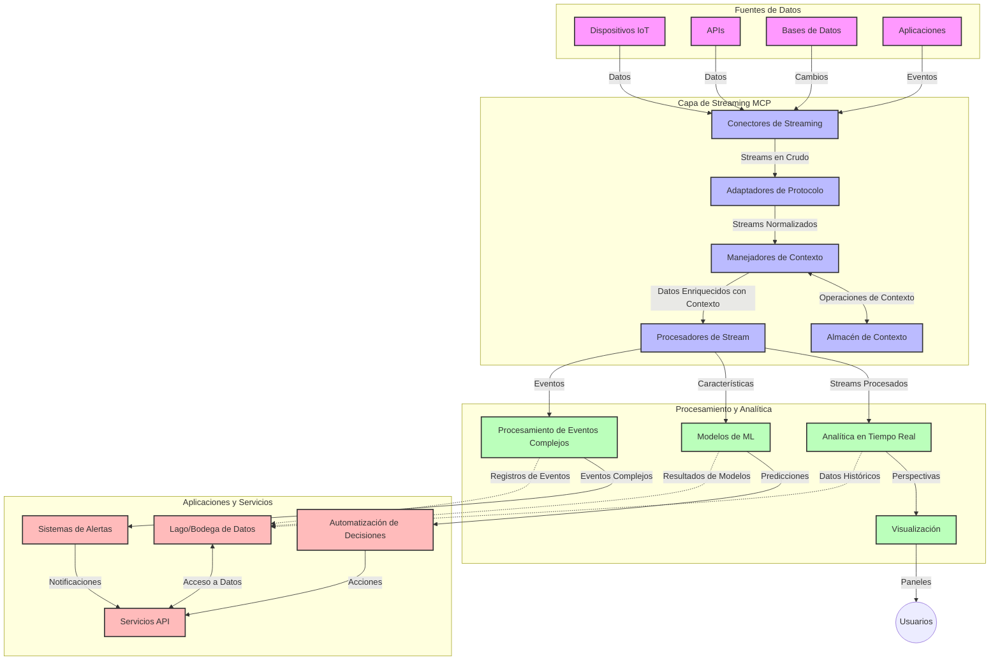

# Protocolo de Contexto de Modelo para Transmisión de Datos en Tiempo Real

## Descripción general

La transmisión de datos en tiempo real se ha vuelto esencial en el mundo impulsado por datos de hoy, donde las empresas y aplicaciones requieren acceso inmediato a la información para tomar decisiones oportunas. El Protocolo de Contexto de Modelo (MCP) representa un avance significativo en la optimización de estos procesos de transmisión en tiempo real, mejorando la eficiencia del procesamiento de datos, manteniendo la integridad contextual y mejorando el rendimiento general del sistema.

Este módulo explora cómo MCP transforma la transmisión de datos en tiempo real al proporcionar un enfoque estandarizado para la gestión del contexto en modelos de IA, plataformas de transmisión y aplicaciones.

## Introducción a la transmisión de datos en tiempo real

La transmisión de datos en tiempo real es un paradigma tecnológico que permite la transferencia, procesamiento y análisis continuos de datos a medida que se generan, permitiendo que los sistemas reaccionen inmediatamente a nueva información. A diferencia del procesamiento por lotes tradicional que opera sobre conjuntos de datos estáticos, la transmisión procesa datos en movimiento, entregando información y acciones con mínima latencia.

### Conceptos básicos de la transmisión de datos en tiempo real:

- **Flujo continuo de datos**: Los datos se procesan como una secuencia continua e interminable de eventos o registros.
- **Procesamiento de baja latencia**: Los sistemas están diseñados para minimizar el tiempo entre la generación y el procesamiento de datos.
- **Escalabilidad**: Las arquitecturas de transmisión deben manejar volúmenes y velocidades variables de datos.
- **Tolerancia a fallos**: Los sistemas deben ser resistentes a fallos para garantizar un flujo de datos ininterrumpido.
- **Procesamiento con estado**: Mantener el contexto a lo largo de los eventos es crucial para un análisis significativo.

### El Protocolo de Contexto de Modelo y la transmisión en tiempo real

El Protocolo de Contexto de Modelo (MCP) aborda varios desafíos críticos en ambientes de transmisión en tiempo real:

1. **Continuidad contextual**: MCP estandariza cómo se mantiene el contexto a través de componentes distribuidos de transmisión, asegurando que los modelos de IA y los nodos de procesamiento tengan acceso al contexto histórico y ambiental relevante.

2. **Gestión eficiente del estado**: Al proporcionar mecanismos estructurados para la transmisión del contexto, MCP reduce la sobrecarga de gestión de estado en las canalizaciones de transmisión.

3. **Interoperabilidad**: MCP crea un lenguaje común para compartir contexto entre diversas tecnologías de transmisión y modelos de IA, posibilitando arquitecturas más flexibles y extensibles.

4. **Contexto optimizado para transmisión**: Las implementaciones de MCP pueden priorizar qué elementos del contexto son más relevantes para la toma de decisiones en tiempo real, optimizando tanto el rendimiento como la precisión.

5. **Procesamiento adaptativo**: Con la gestión adecuada del contexto a través de MCP, los sistemas de transmisión pueden ajustarse dinámicamente con base en condiciones y patrones evolutivos en los datos.

En aplicaciones modernas que van desde redes de sensores IoT hasta plataformas financieras de trading, la integración de MCP con tecnologías de transmisión permite un procesamiento más inteligente y consciente del contexto que puede responder apropiadamente a situaciones complejas y cambiantes en tiempo real.

## Objetivos de aprendizaje

Al finalizar esta lección, serás capaz de:

- Entender los fundamentos de la transmisión de datos en tiempo real y sus desafíos
- Explicar cómo el Protocolo de Contexto de Modelo (MCP) mejora la transmisión de datos en tiempo real
- Implementar soluciones de transmisión basadas en MCP usando marcos populares como Kafka y Pulsar
- Diseñar y desplegar arquitecturas de transmisión tolerantes a fallos y de alto rendimiento con MCP
- Aplicar conceptos de MCP a casos de uso en IoT, trading financiero y análisis impulsado por IA
- Evaluar tendencias emergentes e innovaciones futuras en tecnologías de transmisión basadas en MCP

### Definición y significado

La transmisión de datos en tiempo real implica la generación, procesamiento y entrega continua de datos con mínima latencia. A diferencia del procesamiento por lotes, donde los datos se recogen y procesan en grupos, los datos transmitidos se procesan incrementalmente conforme llegan, permitiendo obtener información y realizar acciones inmediatas.

Características clave de la transmisión de datos en tiempo real incluyen:

- **Baja latencia**: Procesar y analizar datos dentro de milisegundos a segundos
- **Flujo continuo**: Transmisiones ininterrumpidas de datos desde diversas fuentes
- **Procesamiento inmediato**: Analizar datos conforme llegan y no en lotes
- **Arquitectura orientada a eventos**: Responder a eventos a medida que ocurren

### Desafíos en la transmisión tradicional de datos

Los enfoques tradicionales de transmisión presentan varias limitaciones:

1. **Pérdida de contexto**: Dificultad para mantener el contexto en sistemas distribuidos
2. **Problemas de escalabilidad**: Dificultades para escalar y manejar datos de alto volumen y velocidad
3. **Complejidad de integración**: Problemas con la interoperabilidad entre diferentes sistemas
4. **Gestión de latencia**: Balancear el rendimiento con el tiempo de procesamiento
5. **Consistencia de datos**: Garantizar la exactitud y completitud de datos en toda la transmisión

## Entendiendo el Protocolo de Contexto de Modelo (MCP)

### ¿Qué es MCP?

El Protocolo de Contexto de Modelo (MCP) es un protocolo de comunicación estandarizado diseñado para facilitar la interacción eficiente entre modelos de IA y aplicaciones. En el contexto de la transmisión de datos en tiempo real, MCP provee un marco para:

- Preservar el contexto a lo largo de toda la canalización de datos
- Estandarizar formatos de intercambio de datos
- Optimizar la transmisión de grandes conjuntos de datos
- Mejorar la comunicación modelo a modelo y modelo a aplicación

### Componentes clave y arquitectura

La arquitectura MCP para transmisión en tiempo real consiste en varios componentes clave:

1. **Manejadores de contexto**: Gestionan y mantienen la información contextual a través de la canalización de transmisión
2. **Procesadores de flujo**: Procesan flujos de datos entrantes usando técnicas conscientes del contexto
3. **Adaptadores de protocolo**: Convierten entre diferentes protocolos de transmisión manteniendo el contexto
4. **Almacén de contexto**: Almacena y recupera eficientemente la información contextual
5. **Conectores de transmisión**: Conectan con diversas plataformas de streaming (Kafka, Pulsar, Kinesis, etc.)



### Cómo MCP mejora el manejo de datos en tiempo real

MCP aborda los desafíos tradicionales de transmisión mediante:

- **Integridad contextual**: Mantener relaciones entre puntos de datos a lo largo de toda la canalización
- **Transmisión optimizada**: Reducir redundancias en el intercambio de datos mediante una gestión inteligente del contexto
- **Interfaces estandarizadas**: Proveer APIs consistentes para componentes de transmisión
- **Reducción de latencia**: Minimizar la sobrecarga de procesamiento mediante una gestión eficiente del contexto
- **Escalabilidad mejorada**: Soportar escalabilidad horizontal preservando el contexto

## Integración e implementación

Los sistemas de transmisión de datos en tiempo real requieren un diseño e implementación arquitectónica cuidadosa para mantener tanto el rendimiento como la integridad contextual. El Protocolo de Contexto de Modelo ofrece un enfoque estandarizado para integrar modelos de IA y tecnologías de transmisión, permitiendo canalizaciones de procesamiento más sofisticadas y conscientes del contexto.

### Resumen de la integración de MCP en arquitecturas de transmisión

Implementar MCP en entornos de transmisión en tiempo real involucra varias consideraciones clave:

1. **Serialización y transporte de contexto**: MCP provee mecanismos eficientes para codificar información contextual dentro de los paquetes de datos de transmisión, asegurando que el contexto esencial acompañe los datos a lo largo de la canalización. Esto incluye formatos de serialización estandarizados optimizados para transporte en streaming.

2. **Procesamiento de flujo con estado**: MCP habilita un procesamiento más inteligente con estado al mantener una representación consistente del contexto a través de los nodos de procesamiento. Esto es especialmente valioso en arquitecturas distribuidas donde la gestión del estado suele ser un desafío.

3. **Tiempo de evento vs tiempo de procesamiento**: Las implementaciones MCP en sistemas de streaming deben abordar el desafío común de diferenciar cuándo ocurrieron los eventos y cuándo se procesan. El protocolo puede incorporar contexto temporal que preserve la semántica del tiempo de evento.

4. **Gestión de presión de retorno (backpressure)**: Al estandarizar el manejo del contexto, MCP ayuda a gestionar la presión de retorno en sistemas de transmisión, permitiendo que los componentes comuniquen sus capacidades de procesamiento y ajusten el flujo en consecuencia.

5. **Ventanas y agregación de contexto**: MCP facilita operaciones de ventana más sofisticadas proporcionando representaciones estructuradas de contextos temporales y relacionales, habilitando agregaciones más significativas a través de flujos de eventos.

6. **Procesamiento exactamente una vez**: En sistemas que requieren semánticas exactly-once, MCP puede incorporar metadatos de procesamiento para ayudar a rastrear y verificar el estado del procesamiento en componentes distribuidos.

La implementación de MCP en diversas tecnologías de streaming crea un enfoque unificado para la gestión del contexto, reduciendo la necesidad de código de integración personalizado mientras mejora la capacidad del sistema para mantener contexto significativo a medida que los datos fluyen por la canalización.

### MCP en varios marcos de transmisión de datos

Estos ejemplos siguen la especificación actual de MCP que se basa en un protocolo JSON-RPC con mecanismos de transporte distintos. El código demuestra cómo implementar transportes personalizados que integran plataformas de transmisión como Kafka y Pulsar manteniendo plena compatibilidad con el protocolo MCP.

Los ejemplos están diseñados para mostrar cómo las plataformas de streaming pueden integrarse con MCP para proveer procesamiento de datos en tiempo real mientras preservan la conciencia contextual que es central para MCP. Este enfoque asegura que las muestras de código reflejen con precisión el estado actual de la especificación MCP a junio de 2025.

MCP puede integrarse con marcos de transmisión populares incluyendo:

#### Integración Apache Kafka

```python
import asyncio
import json
from typing import Dict, Any, Optional
from confluent_kafka import Consumer, Producer, KafkaError
from mcp.client import Client, ClientCapabilities
from mcp.core.message import JsonRpcMessage
from mcp.core.transports import Transport

# Clase de transporte personalizada para conectar MCP con Kafka
class KafkaMCPTransport(Transport):
    def __init__(self, bootstrap_servers: str, input_topic: str, output_topic: str):
        self.bootstrap_servers = bootstrap_servers
        self.input_topic = input_topic
        self.output_topic = output_topic
        self.producer = Producer({'bootstrap.servers': bootstrap_servers})
        self.consumer = Consumer({
            'bootstrap.servers': bootstrap_servers,
            'group.id': 'mcp-client-group',
            'auto.offset.reset': 'earliest'
        })
        self.message_queue = asyncio.Queue()
        self.running = False
        self.consumer_task = None
        
    async def connect(self):
        """Connect to Kafka and start consuming messages"""
        self.consumer.subscribe([self.input_topic])
        self.running = True
        self.consumer_task = asyncio.create_task(self._consume_messages())
        return self
        
    async def _consume_messages(self):
        """Background task to consume messages from Kafka and queue them for processing"""
        while self.running:
            try:
                msg = self.consumer.poll(1.0)
                if msg is None:
                    await asyncio.sleep(0.1)
                    continue
                
                if msg.error():
                    if msg.error().code() == KafkaError._PARTITION_EOF:
                        continue
                    print(f"Consumer error: {msg.error()}")
                    continue
                
                # Analizar el valor del mensaje como JSON-RPC
                try:
                    message_str = msg.value().decode('utf-8')
                    message_data = json.loads(message_str)
                    mcp_message = JsonRpcMessage.from_dict(message_data)
                    await self.message_queue.put(mcp_message)
                except Exception as e:
                    print(f"Error parsing message: {e}")
            except Exception as e:
                print(f"Error in consumer loop: {e}")
                await asyncio.sleep(1)
    
    async def read(self) -> Optional[JsonRpcMessage]:
        """Read the next message from the queue"""
        try:
            message = await self.message_queue.get()
            return message
        except Exception as e:
            print(f"Error reading message: {e}")
            return None
    
    async def write(self, message: JsonRpcMessage) -> None:
        """Write a message to the Kafka output topic"""
        try:
            message_json = json.dumps(message.to_dict())
            self.producer.produce(
                self.output_topic,
                message_json.encode('utf-8'),
                callback=self._delivery_report
            )
            self.producer.poll(0)  # Activar los callbacks
        except Exception as e:
            print(f"Error writing message: {e}")
    
    def _delivery_report(self, err, msg):
        """Kafka producer delivery callback"""
        if err is not None:
            print(f'Message delivery failed: {err}')
        else:
            print(f'Message delivered to {msg.topic()} [{msg.partition()}]')
    
    async def close(self) -> None:
        """Close the transport"""
        self.running = False
        if self.consumer_task:
            self.consumer_task.cancel()
            try:
                await self.consumer_task
            except asyncio.CancelledError:
                pass
        self.consumer.close()
        self.producer.flush()

# Ejemplo de uso del transporte Kafka MCP
async def kafka_mcp_example():
    # Crear cliente MCP con transporte Kafka
    client = Client(
        {"name": "kafka-mcp-client", "version": "1.0.0"},
        ClientCapabilities({})
    )
    
    # Crear y conectar el transporte Kafka
    transport = KafkaMCPTransport(
        bootstrap_servers="localhost:9092",
        input_topic="mcp-responses",
        output_topic="mcp-requests"
    )
    
    await client.connect(transport)
    
    try:
        # Inicializar la sesión MCP
        await client.initialize()
        
        # Ejemplo de ejecución de una herramienta a través de MCP
        response = await client.execute_tool(
            "process_data",
            {
                "data": "sample data",
                "metadata": {
                    "source": "sensor-1",
                    "timestamp": "2025-06-12T10:30:00Z"
                }
            }
        )
        
        print(f"Tool execution response: {response}")
        
        # Apagado limpio
        await client.shutdown()
    finally:
        await transport.close()

# Ejecutar el ejemplo
if __name__ == "__main__":
    asyncio.run(kafka_mcp_example())
```

#### Implementación Apache Pulsar

```python
import asyncio
import json
import pulsar
from typing import Dict, Any, Optional
from mcp.core.message import JsonRpcMessage
from mcp.core.transports import Transport
from mcp.server import Server, ServerOptions
from mcp.server.tools import Tool, ToolExecutionContext, ToolMetadata

# Crear un transporte MCP personalizado que usa Pulsar
class PulsarMCPTransport(Transport):
    def __init__(self, service_url: str, request_topic: str, response_topic: str):
        self.service_url = service_url
        self.request_topic = request_topic
        self.response_topic = response_topic
        self.client = pulsar.Client(service_url)
        self.producer = self.client.create_producer(response_topic)
        self.consumer = self.client.subscribe(
            request_topic,
            "mcp-server-subscription",
            consumer_type=pulsar.ConsumerType.Shared
        )
        self.message_queue = asyncio.Queue()
        self.running = False
        self.consumer_task = None
    
    async def connect(self):
        """Connect to Pulsar and start consuming messages"""
        self.running = True
        self.consumer_task = asyncio.create_task(self._consume_messages())
        return self
    
    async def _consume_messages(self):
        """Background task to consume messages from Pulsar and queue them for processing"""
        while self.running:
            try:
                # Recepción no bloqueante con tiempo de espera
                msg = self.consumer.receive(timeout_millis=500)
                
                # Procesar el mensaje
                try:
                    message_str = msg.data().decode('utf-8')
                    message_data = json.loads(message_str)
                    mcp_message = JsonRpcMessage.from_dict(message_data)
                    await self.message_queue.put(mcp_message)
                    
                    # Reconocer el mensaje
                    self.consumer.acknowledge(msg)
                except Exception as e:
                    print(f"Error processing message: {e}")
                    # Reconocimiento negativo si hubo un error
                    self.consumer.negative_acknowledge(msg)
            except Exception as e:
                # Manejar tiempo de espera u otras excepciones
                await asyncio.sleep(0.1)
    
    async def read(self) -> Optional[JsonRpcMessage]:
        """Read the next message from the queue"""
        try:
            message = await self.message_queue.get()
            return message
        except Exception as e:
            print(f"Error reading message: {e}")
            return None
    
    async def write(self, message: JsonRpcMessage) -> None:
        """Write a message to the Pulsar output topic"""
        try:
            message_json = json.dumps(message.to_dict())
            self.producer.send(message_json.encode('utf-8'))
        except Exception as e:
            print(f"Error writing message: {e}")
    
    async def close(self) -> None:
        """Close the transport"""
        self.running = False
        if self.consumer_task:
            self.consumer_task.cancel()
            try:
                await self.consumer_task
            except asyncio.CancelledError:
                pass
        self.consumer.close()
        self.producer.close()
        self.client.close()

# Definir una herramienta MCP de ejemplo que procesa datos en streaming
@Tool(
    name="process_streaming_data",
    description="Process streaming data with context preservation",
    metadata=ToolMetadata(
        required_capabilities=["streaming"]
    )
)
async def process_streaming_data(
    ctx: ToolExecutionContext,
    data: str,
    source: str,
    priority: str = "medium"
) -> Dict[str, Any]:
    """
    Process streaming data while preserving context
    
    Args:
        ctx: Tool execution context
        data: The data to process
        source: The source of the data
        priority: Priority level (low, medium, high)
        
    Returns:
        Dict containing processed results and context information
    """
    # Ejemplo de procesamiento que aprovecha el contexto MCP
    print(f"Processing data from {source} with priority {priority}")
    
    # Acceder al contexto de la conversación desde MCP
    conversation_id = ctx.conversation_id if hasattr(ctx, 'conversation_id') else "unknown"
    
    # Devolver resultados con contexto mejorado
    return {
        "processed_data": f"Processed: {data}",
        "context": {
            "conversation_id": conversation_id,
            "source": source,
            "priority": priority,
            "processing_timestamp": ctx.get_current_time_iso()
        }
    }

# Implementación de servidor MCP de ejemplo usando transporte Pulsar
async def run_mcp_server_with_pulsar():
    # Crear servidor MCP
    server = Server(
        {"name": "pulsar-mcp-server", "version": "1.0.0"},
        ServerOptions(
            capabilities={"streaming": True}
        )
    )
    
    # Registrar nuestra herramienta
    server.register_tool(process_streaming_data)
    
    # Crear y conectar transporte Pulsar
    transport = PulsarMCPTransport(
        service_url="pulsar://localhost:6650",
        request_topic="mcp-requests",
        response_topic="mcp-responses"
    )
    
    try:
        # Iniciar el servidor con el transporte Pulsar
        await server.run(transport)
    finally:
        await transport.close()

# Ejecutar el servidor
if __name__ == "__main__":
    asyncio.run(run_mcp_server_with_pulsar())
```

### Mejores prácticas para el despliegue

Al implementar MCP para transmisión en tiempo real:

1. **Diseñar para tolerancia a fallos**:
   - Implementar manejo adecuado de errores
   - Usar colas de mensajes erróneos (dead-letter queues) para mensajes fallidos
   - Diseñar procesadores idempotentes

2. **Optimizar el rendimiento**:
   - Configurar tamaños de buffer apropiados
   - Usar agrupamiento (batching) cuando sea apropiado
   - Implementar mecanismos de presión de retorno (backpressure)

3. **Monitorear y observar**:
   - Rastrear métricas de procesamiento de flujos
   - Monitorear la propagación del contexto
   - Configurar alertas para anomalías

4. **Asegurar tus flujos**:
   - Implementar encriptación para datos sensibles
   - Usar autenticación y autorización
   - Aplicar controles de acceso adecuados


### MCP en IoT y computación en el borde (Edge Computing)

MCP mejora la transmisión IoT mediante:

- Preservar el contexto de los dispositivos a lo largo de la canalización de procesamiento
- Permitir transmisión eficiente de datos desde el borde a la nube
- Soportar analítica en tiempo real sobre flujos de datos IoT
- Facilitar comunicación dispositivo a dispositivo con contexto

Ejemplo: Redes de sensores en ciudades inteligentes
```
Sensors → Edge Gateways → MCP Stream Processors → Real-time Analytics → Automated Responses
```

### Papel en transacciones financieras y trading de alta frecuencia

MCP ofrece ventajas significativas para la transmisión de datos financieros:

- Procesamiento de ultrabaja latencia para decisiones de trading
- Mantener contexto de transacciones a lo largo del procesamiento
- Apoyar procesamiento complejo de eventos con conciencia contextual
- Garantizar consistencia de datos en sistemas de trading distribuidos

### Mejorando análisis de datos impulsados por IA

MCP crea nuevas posibilidades para la analítica en streaming:

- Entrenamiento e inferencia de modelos en tiempo real
- Aprendizaje continuo a partir de datos en streaming
- Extracción de características consciente del contexto
- Canalizaciones de inferencia multi-modelo con contexto preservado

## Tendencias e innovaciones futuras

### Evolución de MCP en entornos en tiempo real

De cara al futuro, anticipamos que MCP evolucione para abordar:

- **Integración con computación cuántica**: Preparación para sistemas de streaming basados en computación cuántica
- **Procesamiento nativo en el borde**: Mover más procesamiento consciente del contexto a dispositivos edge
- **Gestión autónoma de flujos**: Canalizaciones de streaming que se auto-optimicen
- **Streaming federado**: Procesamiento distribuido preservando la privacidad

### Potenciales avances tecnológicos

Tecnologías emergentes que moldearán el futuro del streaming MCP:

1. **Protocolos de streaming optimizados para IA**: Protocolos personalizados diseñados específicamente para cargas de trabajo IA
2. **Integración de computación neuromórfica**: Computación inspirada en el cerebro para procesamiento de flujos
3. **Streaming serverless**: Transmisión escalable y orientada a eventos sin gestión de infraestructura
4. **Almacenes de contexto distribuidos**: Gestión de contexto globalmente distribuida pero altamente consistente

## Ejercicios prácticos

### Ejercicio 1: Configuración de una canalización básica de transmisión MCP

En este ejercicio aprenderás a:
- Configurar un entorno básico de transmisión MCP
- Implementar manejadores de contexto para procesamiento de flujos
- Probar y validar la preservación del contexto

### Ejercicio 2: Construcción de un panel de análisis en tiempo real

Crea una aplicación completa que:
- Ingesta datos en streaming usando MCP
- Procesa el flujo manteniendo el contexto
- Visualiza resultados en tiempo real

### Ejercicio 3: Implementación de procesamiento complejo de eventos con MCP

Ejercicio avanzado que cubre:
- Detección de patrones en flujos
- Correlación contextual entre múltiples flujos
- Generación de eventos complejos con contexto preservado

## Recursos adicionales

- [Especificación del Protocolo de Contexto de Modelo](https://modelcontextprotocol.io) - Especificación y documentación oficial de MCP
- [Documentación de Apache Kafka](https://kafka.apache.org/documentation/) - Aprende sobre Kafka para procesamiento en flujo
- [Apache Pulsar](https://pulsar.apache.org/) - Plataforma unificada de mensajería y streaming
- [Streaming Systems: The What, Where, When, and How of Large-Scale Data Processing](https://www.oreilly.com/library/view/streaming-systems/9781491983867/) - Libro completo sobre arquitecturas de streaming
- [Microsoft Azure Event Hubs](https://learn.microsoft.com/azure/event-hubs/event-hubs-about) - Servicio gestionado de transmisión de eventos
- [Documentación MLflow](https://mlflow.org/docs/latest/index.html) - Para rastreo y despliegue de modelos ML
- [Análisis en tiempo real con Apache Storm](https://storm.apache.org/releases/current/index.html) - Marco de procesamiento para computación en tiempo real
- [Flink ML](https://nightlies.apache.org/flink/flink-ml-docs-master/) - Biblioteca de aprendizaje automático para Apache Flink
- [Documentación LangChain](https://python.langchain.com/docs/get_started/introduction) - Construcción de aplicaciones con LLMs

## Resultados de aprendizaje

Al completar este módulo, serás capaz de:

- Comprender los fundamentos de la transmisión de datos en tiempo real y sus desafíos
- Explicar cómo el Protocolo de Contexto de Modelo (MCP) mejora la transmisión de datos en tiempo real
- Implementar soluciones de transmisión basadas en MCP usando marcos populares como Kafka y Pulsar
- Diseñar y desplegar arquitecturas tolerantes a fallos y de alto rendimiento con MCP
- Aplicar conceptos MCP en IoT, trading financiero y análisis impulsado por IA
- Evaluar tendencias emergentes e innovaciones futuras en tecnologías de transmisión basadas en MCP

## Qué sigue

- [5.11 Búsqueda en Tiempo Real](../mcp-realtimesearch/README.md)

---

<!-- CO-OP TRANSLATOR DISCLAIMER START -->
**Descargo de responsabilidad**:
Este documento ha sido traducido utilizando el servicio de traducción automática [Co-op Translator](https://github.com/Azure/co-op-translator). Aunque nos esforzamos por la precisión, tenga en cuenta que las traducciones automatizadas pueden contener errores o inexactitudes. El documento original en su idioma nativo debe considerarse la fuente autorizada. Para información crítica, se recomienda una traducción profesional humana. No somos responsables de cualquier malentendido o interpretación errónea que surja del uso de esta traducción.
<!-- CO-OP TRANSLATOR DISCLAIMER END -->