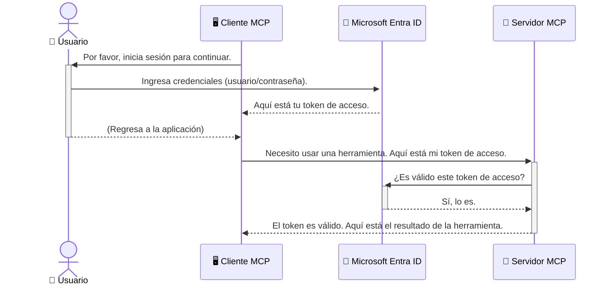

# Asegurando los Flujos de Trabajo de IA: Autenticación de Entra ID para Servidores del Protocolo de Contexto del Modelo

## Introducción
Asegurar tu servidor del Protocolo de Contexto del Modelo (MCP) es tan importante como cerrar con llave la puerta principal de tu casa. Dejar tu servidor MCP abierto expone tus herramientas y datos a accesos no autorizados, lo que puede conducir a brechas de seguridad. Microsoft Entra ID ofrece una solución robusta basada en la nube para la gestión de identidad y acceso, ayudando a garantizar que solo usuarios y aplicaciones autorizadas puedan interactuar con tu servidor MCP. En esta sección, aprenderás a proteger tus flujos de trabajo de IA utilizando la autenticación de Entra ID.

## Objetivos de Aprendizaje
Al finalizar esta sección, podrás:

- Entender la importancia de asegurar los servidores MCP.
- Explicar los conceptos básicos de Microsoft Entra ID y la autenticación OAuth 2.0.
- Reconocer la diferencia entre clientes públicos y confidenciales.
- Implementar la autenticación de Entra ID en escenarios de servidores MCP locales (cliente público) y remotos (cliente confidencial).
- Aplicar las mejores prácticas de seguridad al desarrollar flujos de trabajo de IA.

## Seguridad y MCP

Así como no dejarías la puerta principal de tu casa sin llave, no debes dejar tu servidor MCP abierto para que cualquiera acceda. Asegurar tus flujos de trabajo de IA es esencial para construir aplicaciones robustas, confiables y seguras. Este capítulo te introducirá al uso de Microsoft Entra ID para proteger tus servidores MCP, asegurando que solo usuarios y aplicaciones autorizadas puedan interactuar con tus herramientas y datos.

## Por Qué la Seguridad es Importante para los Servidores MCP

Imagina que tu servidor MCP tiene una herramienta que puede enviar correos electrónicos o acceder a una base de datos de clientes. Un servidor sin seguridad significaría que cualquiera podría usar esa herramienta, lo que conduciría a accesos no autorizados a datos, spam u otras actividades maliciosas.

Al implementar autenticación, aseguras que cada solicitud a tu servidor sea verificada, confirmando la identidad del usuario o aplicación que realiza la petición. Este es el primer y más crítico paso para asegurar tus flujos de trabajo de IA.

## Introducción a Microsoft Entra ID

[**Microsoft Entra ID**](https://adoption.microsoft.com/microsoft-security/entra/) es un servicio basado en la nube para la gestión de identidad y acceso. Piénsalo como un guardia de seguridad universal para tus aplicaciones. Maneja el proceso complejo de verificar identidades de usuarios (autenticación) y determinar qué están permitidos a hacer (autorización).

Al usar Entra ID, puedes:

- Habilitar inicio de sesión seguro para usuarios.
- Proteger APIs y servicios.
- Gestionar políticas de acceso desde una ubicación central.

Para los servidores MCP, Entra ID provee una solución robusta y ampliamente confiable para administrar quién puede acceder a las capacidades de tu servidor.

---

## Entendiendo la Magia: Cómo Funciona la Autenticación de Entra ID

Entra ID utiliza estándares abiertos como **OAuth 2.0** para manejar la autenticación. Aunque los detalles pueden ser complejos, el concepto central es simple y puede entenderse con una analogía.

### Una Introducción Amigable a OAuth 2.0: La Llave de Valet

Piensa en OAuth 2.0 como un servicio valet para tu auto. Cuando llegas a un restaurante, no le das al valet la llave maestra. En cambio, le proporcionas una **llave valet** con permisos limitados: puede arrancar el auto y cerrar las puertas, pero no puede abrir la cajuela ni la guantera.

En esta analogía:

- **Tú** eres el **Usuario**.
- **Tu auto** es el **Servidor MCP** con sus valiosas herramientas y datos.
- El **Valet** es **Microsoft Entra ID**.
- El **Encargado del Estacionamiento** es el **Cliente MCP** (la aplicación que intenta acceder al servidor).
- La **Llave Valet** es el **Token de Acceso**.

El token de acceso es una cadena segura de texto que el cliente MCP recibe de Entra ID después de que inicias sesión. Luego, el cliente presenta este token al servidor MCP con cada solicitud. El servidor puede verificar el token para asegurar que la solicitud es legítima y que el cliente tiene los permisos necesarios, todo sin tener que manejar tus credenciales reales (como tu contraseña).

### El Flujo de Autenticación

Así funciona el proceso en la práctica:



### Introducción a la Biblioteca de Autenticación de Microsoft (MSAL)

Antes de profundizar en el código, es importante presentar un componente clave que verás en los ejemplos: la **Biblioteca de Autenticación de Microsoft (MSAL)**.

MSAL es una biblioteca desarrollada por Microsoft que facilita mucho a los desarrolladores manejar la autenticación. En lugar de que tengas que escribir todo el código complejo para manejar tokens de seguridad, gestionar inicios de sesión y refrescar sesiones, MSAL se encarga del trabajo pesado.

Usar una biblioteca como MSAL se recomienda mucho porque:

- **Es Segura:** Implementa protocolos estándar de la industria y mejores prácticas de seguridad, reduciendo el riesgo de vulnerabilidades en tu código.
- **Simplifica el Desarrollo:** Abstrae la complejidad de los protocolos OAuth 2.0 y OpenID Connect, permitiéndote añadir una autenticación robusta a tu aplicación con solo unas pocas líneas de código.
- **Está Mantenida:** Microsoft mantiene y actualiza activamente MSAL para abordar nuevas amenazas de seguridad y cambios en las plataformas.

MSAL soporta una gran variedad de lenguajes y frameworks de aplicación, incluyendo .NET, JavaScript/TypeScript, Python, Java, Go y plataformas móviles como iOS y Android. Esto significa que puedes usar los mismos patrones de autenticación consistentes en toda tu pila tecnológica.

Para saber más sobre MSAL, puedes consultar la documentación oficial de [visión general de MSAL](https://learn.microsoft.com/entra/identity-platform/msal-overview).

---

## Asegurando tu Servidor MCP con Entra ID: Una Guía Paso a Paso

Ahora, veamos cómo asegurar un servidor MCP local (uno que comunica sobre `stdio`) usando Entra ID. Este ejemplo usa un **cliente público**, adecuado para aplicaciones que corren en la computadora del usuario, como una app de escritorio o un servidor local de desarrollo.

### Escenario 1: Asegurando un Servidor MCP Local (con un Cliente Público)

En este escenario, veremos un servidor MCP que corre localmente, comunica a través de `stdio` y usa Entra ID para autenticar al usuario antes de permitir el acceso a sus herramientas. El servidor tendrá una sola herramienta que obtiene la información de perfil del usuario desde la Microsoft Graph API.

#### 1. Configurar la Aplicación en Entra ID

Antes de escribir cualquier código, debes registrar tu aplicación en Microsoft Entra ID. Esto informa a Entra ID acerca de tu aplicación y le concede permiso para usar el servicio de autenticación.

1. Navega al **[portal de Microsoft Entra](https://entra.microsoft.com/)**.
2. Ve a **Registros de aplicaciones** y haz clic en **Nuevo registro**.
3. Dale un nombre a tu aplicación (por ejemplo, "Mi Servidor MCP Local").
4. Para **Tipos de cuentas aceptados**, selecciona **Cuentas en este directorio organizacional únicamente**.
5. Puedes dejar el **URI de redireccionamiento** en blanco para este ejemplo.
6. Haz clic en **Registrar**.

Una vez registrado, toma nota del **ID de la aplicación (cliente)** y el **ID del directorio (tenant)**. Los necesitarás en tu código.

#### 2. El Código: Desglose

Veamos las partes clave del código que manejan la autenticación. El código completo de este ejemplo está disponible en la carpeta [Entra ID - Local - WAM](https://github.com/Azure-Samples/mcp-auth-servers/tree/main/src/entra-id-local-wam) del [repositorio mcp-auth-servers en GitHub](https://github.com/Azure-Samples/mcp-auth-servers).

**`AuthenticationService.cs`**

Esta clase es responsable de manejar la interacción con Entra ID.

- **`CreateAsync`**: Este método inicializa `PublicClientApplication` de MSAL (Biblioteca de Autenticación de Microsoft). Está configurado con el `clientId` y `tenantId` de tu aplicación.
- **`WithBroker`**: Esto habilita el uso de un broker (como el Administrador de Cuentas Web de Windows), que provee una experiencia de inicio de sesión único más segura y fluida.
- **`AcquireTokenAsync`**: Este es el método central. Primero intenta obtener un token silenciosamente (lo que significa que el usuario no tendrá que iniciar sesión nuevamente si ya tiene una sesión válida). Si no puede obtener un token silencioso, solicitará al usuario iniciar sesión de forma interactiva.

```csharp
// Simplified for clarity
public static async Task<AuthenticationService> CreateAsync(ILogger<AuthenticationService> logger)
{
    var msalClient = PublicClientApplicationBuilder
        .Create(_clientId) // Your Application (client) ID
        .WithAuthority(AadAuthorityAudience.AzureAdMyOrg)
        .WithTenantId(_tenantId) // Your Directory (tenant) ID
        .WithBroker(new BrokerOptions(BrokerOptions.OperatingSystems.Windows))
        .Build();

    // ... cache registration ...

    return new AuthenticationService(logger, msalClient);
}

public async Task<string> AcquireTokenAsync()
{
    try
    {
        // Try silent authentication first
        var accounts = await _msalClient.GetAccountsAsync();
        var account = accounts.FirstOrDefault();

        AuthenticationResult? result = null;

        if (account != null)
        {
            result = await _msalClient.AcquireTokenSilent(_scopes, account).ExecuteAsync();
        }
        else
        {
            // If no account, or silent fails, go interactive
            result = await _msalClient.AcquireTokenInteractive(_scopes).ExecuteAsync();
        }

        return result.AccessToken;
    }
    catch (Exception ex)
    {
        _logger.LogError(ex, "An error occurred while acquiring the token.");
        throw; // Optionally rethrow the exception for higher-level handling
    }
}
```

**`Program.cs`**

Aquí se configura el servidor MCP y se integra el servicio de autenticación.

- **`AddSingleton<AuthenticationService>`**: Esto registra `AuthenticationService` en el contenedor de inyección de dependencias, para que pueda ser usado por otras partes de la aplicación (como nuestra herramienta).
- Herramienta **`GetUserDetailsFromGraph`**: Esta herramienta requiere una instancia de `AuthenticationService`. Antes de hacer cualquier cosa, llama a `authService.AcquireTokenAsync()` para obtener un token de acceso válido. Si la autenticación es exitosa, usa el token para llamar a la Microsoft Graph API y obtener los detalles del usuario.

```csharp
// Simplified for clarity
[McpServerTool(Name = "GetUserDetailsFromGraph")]
public static async Task<string> GetUserDetailsFromGraph(
    AuthenticationService authService)
{
    try
    {
        // This will trigger the authentication flow
        var accessToken = await authService.AcquireTokenAsync();

        // Use the token to create a GraphServiceClient
        var graphClient = new GraphServiceClient(
            new BaseBearerTokenAuthenticationProvider(new TokenProvider(authService)));

        var user = await graphClient.Me.GetAsync();

        return System.Text.Json.JsonSerializer.Serialize(user);
    }
    catch (Exception ex)
    {
        return $"Error: {ex.Message}";
    }
}
```

#### 3. Cómo Funciona Todo Junto

1. Cuando el cliente MCP intenta usar la herramienta `GetUserDetailsFromGraph`, la herramienta primero llama a `AcquireTokenAsync`.
2. `AcquireTokenAsync` hace que la librería MSAL revise si hay un token válido.
3. Si no se encuentra un token, MSAL, a través del broker, solicitará al usuario que inicie sesión con su cuenta Entra ID.
4. Una vez que el usuario inicia sesión, Entra ID emite un token de acceso.
5. La herramienta recibe el token y lo usa para realizar una llamada segura a la Microsoft Graph API.
6. Los detalles del usuario son devueltos al cliente MCP.

Este proceso asegura que solo usuarios autenticados puedan usar la herramienta, asegurando efectivamente tu servidor MCP local.

### Escenario 2: Asegurando un Servidor MCP Remoto (con un Cliente Confidencial)

Cuando tu servidor MCP está corriendo en una máquina remota (como un servidor en la nube) y comunica sobre un protocolo como HTTP Streaming, los requisitos de seguridad son diferentes. En este caso, deberías usar un **cliente confidencial** y el **Flujo de Código de Autorización**. Este es un método más seguro porque los secretos de la aplicación nunca se exponen al navegador.

Este ejemplo utiliza un servidor MCP basado en TypeScript que usa Express.js para manejar peticiones HTTP.

#### 1. Configurar la Aplicación en Entra ID

La configuración en Entra ID es similar al cliente público, pero con una diferencia clave: necesitas crear un **secreto de cliente**.

1. Navega al **[portal de Microsoft Entra](https://entra.microsoft.com/)**.
2. En el registro de tu aplicación, ve a la pestaña **Certificados y secretos**.
3. Haz clic en **Nuevo secreto de cliente**, dale una descripción y haz clic en **Agregar**.
4. **Importante:** Copia el valor del secreto inmediatamente. No podrás verlo de nuevo.
5. También necesitas configurar un **URI de redireccionamiento**. Ve a la pestaña **Autenticación**, haz clic en **Agregar una plataforma**, selecciona **Web** e ingresa el URI de redireccionamiento para tu aplicación (por ejemplo, `http://localhost:3001/auth/callback`).

> **⚠️ Nota Importante de Seguridad:** Para aplicaciones de producción, Microsoft recomienda encarecidamente usar métodos de autenticación sin secretos como **Identidad Administrada** o **Federación de Identidad de Carga de Trabajo** en lugar de secretos de cliente. Los secretos de cliente presentan riesgos de seguridad pues pueden ser expuestos o comprometidos. Las identidades administradas ofrecen un enfoque más seguro al eliminar la necesidad de almacenar credenciales en tu código o configuración.
>
> Para más información sobre identidades administradas y cómo implementarlas, consulta la [visión general de identidades administradas para recursos de Azure](https://learn.microsoft.com/entra/identity/managed-identities-azure-resources/overview).

#### 2. El Código: Desglose

Este ejemplo utiliza un enfoque basado en sesión. Cuando el usuario se autentica, el servidor almacena el token de acceso y el token de refresco en una sesión y entrega al usuario un token de sesión. Este token de sesión se usa luego para solicitudes posteriores. El código completo de este ejemplo está disponible en la carpeta [Entra ID - Cliente confidencial](https://github.com/Azure-Samples/mcp-auth-servers/tree/main/src/entra-id-cca-session) del [repositorio mcp-auth-servers en GitHub](https://github.com/Azure-Samples/mcp-auth-servers).

**`Server.ts`**

Este archivo configura el servidor Express y la capa de transporte MCP.

- **`requireBearerAuth`**: Es un middleware que protege los endpoints `/sse` y `/message`. Verifica que haya un token bearer válido en el encabezado `Authorization` de la petición.
- **`EntraIdServerAuthProvider`**: Es una clase personalizada que implementa la interfaz `McpServerAuthorizationProvider`. Es responsable de manejar el flujo OAuth 2.0.
- **`/auth/callback`**: Este endpoint maneja la redirección de Entra ID después de que el usuario se ha autenticado. Intercambia el código de autorización por un token de acceso y un token de refresco.

```typescript
// Simplificado para mayor claridad
const app = express();
const { server } = createServer();
const provider = new EntraIdServerAuthProvider();

// Proteger el endpoint SSE
app.get("/sse", requireBearerAuth({
  provider,
  requiredScopes: ["User.Read"]
}), async (req, res) => {
  // ... conectar al transporte ...
});

// Proteger el endpoint de mensajes
app.post("/message", requireBearerAuth({
  provider,
  requiredScopes: ["User.Read"]
}), async (req, res) => {
  // ... manejar el mensaje ...
});

// Manejar la devolución de llamada OAuth 2.0
app.get("/auth/callback", (req, res) => {
  provider.handleCallback(req.query.code, req.query.state)
    .then(result => {
      // ... manejar éxito o fracaso ...
    });
});
```

**`Tools.ts`**

Este archivo define las herramientas que provee el servidor MCP. La herramienta `getUserDetails` es similar a la del ejemplo anterior, pero obtiene el token de acceso desde la sesión.

```typescript
// Simplificado para mayor claridad
server.setRequestHandler(CallToolRequestSchema, async (request) => {
  const { name } = request.params;
  const context = request.params?.context as { token?: string } | undefined;
  const sessionToken = context?.token;

  if (name === ToolName.GET_USER_DETAILS) {
    if (!sessionToken) {
      throw new AuthenticationError("Authentication token is missing or invalid. Ensure the token is provided in the request context.");
    }

    // Obtener el token de Entra ID desde la tienda de sesión
    const tokenData = tokenStore.getToken(sessionToken);
    const entraIdToken = tokenData.accessToken;

    const graphClient = Client.init({
      authProvider: (done) => {
        done(null, entraIdToken);
      }
    });

    const user = await graphClient.api('/me').get();

    // ... devolver detalles del usuario ...
  }
});
```

**`auth/EntraIdServerAuthProvider.ts`**

Esta clase maneja la lógica para:

- Redirigir al usuario a la página de inicio de sesión de Entra ID.
- Intercambiar el código de autorización por un token de acceso.
- Almacenar los tokens en el `tokenStore`.
- Refrescar el token de acceso cuando expire.

#### 3. Cómo Funciona Todo Junto

1. Cuando un usuario intenta conectar por primera vez al servidor MCP, el middleware `requireBearerAuth` detecta que no tiene una sesión válida y lo redirige a la página de inicio de sesión de Entra ID.
2. El usuario inicia sesión con su cuenta Entra ID.
3. Entra ID redirige al usuario de vuelta al endpoint `/auth/callback` con un código de autorización.
4. El servidor intercambia el código por un token de acceso y un token de actualización, los almacena y crea un token de sesión que se envía al cliente.
5. El cliente ahora puede usar este token de sesión en el encabezado `Authorization` para todas las solicitudes futuras al servidor MCP.
6. Cuando se llama a la herramienta `getUserDetails`, utiliza el token de sesión para buscar el token de acceso de Entra ID y luego lo usa para llamar a la API de Microsoft Graph.

Este flujo es más complejo que el flujo de cliente público, pero es necesario para endpoints accesibles desde internet. Dado que los servidores MCP remotos son accesibles a través de internet público, necesitan medidas de seguridad más fuertes para protegerse contra accesos no autorizados y posibles ataques.


## Mejores Prácticas de Seguridad

- **Usa siempre HTTPS**: Encripta la comunicación entre el cliente y el servidor para proteger los tokens de ser interceptados.
- **Implementa Control de Acceso Basado en Roles (RBAC)**: No solo verifiques *si* un usuario está autenticado; verifica *qué* está autorizado a hacer. Puedes definir roles en Entra ID y verificarlos en tu servidor MCP.
- **Monitorea y audita**: Registra todos los eventos de autenticación para poder detectar y responder a actividades sospechosas.
- **Manejo de limitación y control de tasa**: Microsoft Graph y otras APIs implementan limitación de tasa para prevenir abusos. Implementa retroceso exponencial y lógica de reintento en tu servidor MCP para manejar adecuadamente respuestas HTTP 429 (Demasiadas solicitudes). Considera almacenar en caché datos que se acceden frecuentemente para reducir las llamadas a la API.
- **Almacenamiento seguro de tokens**: Almacena los tokens de acceso y de actualización de forma segura. Para aplicaciones locales usa los mecanismos de almacenamiento seguro del sistema. Para aplicaciones de servidor considera usar almacenamiento cifrado o servicios de gestión segura de claves como Azure Key Vault.
- **Manejo de expiración de tokens**: Los tokens de acceso tienen un tiempo de vida limitado. Implementa la actualización automática de tokens usando tokens de actualización para mantener una experiencia de usuario fluida sin requerir re-autenticación.
- **Considera usar Azure API Management**: Aunque implementar seguridad directamente en tu servidor MCP te da control detallado, las API Gateway como Azure API Management pueden manejar muchas de estas preocupaciones de seguridad automáticamente, incluyendo autenticación, autorización, limitación de tasa y monitoreo. Proporcionan una capa de seguridad centralizada que se sitúa entre tus clientes y los servidores MCP. Para más detalles sobre el uso de API Gateway con MCP, consulta nuestro [Azure API Management Your Auth Gateway For MCP Servers](https://techcommunity.microsoft.com/blog/integrationsonazureblog/azure-api-management-your-auth-gateway-for-mcp-servers/4402690).


## Puntos Clave

- Asegurar tu servidor MCP es crucial para proteger tus datos y herramientas.
- Microsoft Entra ID ofrece una solución robusta y escalable para autenticación y autorización.
- Usa un **cliente público** para aplicaciones locales y un **cliente confidencial** para servidores remotos.
- El **flujo de código de autorización** es la opción más segura para aplicaciones web.


## Ejercicio

1. Piensa en un servidor MCP que podrías construir. ¿Sería un servidor local o remoto?
2. Basándote en tu respuesta, ¿usarías un cliente público o confidencial?
3. ¿Qué permisos solicitaría tu servidor MCP para realizar acciones contra Microsoft Graph?


## Ejercicios Prácticos

### Ejercicio 1: Registrar una aplicación en Entra ID
Navega al portal Microsoft Entra.
Registra una nueva aplicación para tu servidor MCP.
Anota el ID de la Aplicación (cliente) y el ID del Directorio (inquilino).

### Ejercicio 2: Asegurar un servidor MCP local (Cliente Público)
- Sigue el ejemplo de código para integrar MSAL (Microsoft Authentication Library) para la autenticación de usuario.
- Prueba el flujo de autenticación llamando a la herramienta MCP que obtiene detalles de usuario desde Microsoft Graph.

### Ejercicio 3: Asegurar un servidor MCP remoto (Cliente Confidencial)
- Registra un cliente confidencial en Entra ID y crea un secreto de cliente.
- Configura tu servidor MCP Express.js para usar el flujo de código de autorización.
- Prueba los endpoints protegidos y confirma el acceso basado en token.

### Ejercicio 4: Aplicar Mejores Prácticas de Seguridad
- Habilita HTTPS para tu servidor local o remoto.
- Implementa control de acceso basado en roles (RBAC) en la lógica de tu servidor.
- Añade manejo de expiración de tokens y almacenamiento seguro de tokens.

## Recursos

1. **Documentación General de MSAL**  
   Aprende cómo Microsoft Authentication Library (MSAL) habilita la adquisición segura de tokens en múltiples plataformas:  
   [MSAL Overview on Microsoft Learn](https://learn.microsoft.com/en-gb/entra/msal/overview)

2. **Repositorio Azure-Samples/mcp-auth-servers en GitHub**  
   Implementaciones de referencia de servidores MCP demostrando flujos de autenticación:  
   [Azure-Samples/mcp-auth-servers on GitHub](https://github.com/Azure-Samples/mcp-auth-servers)

3. **Descripción General de Identidades Gestionadas para Recursos de Azure**  
   Entiende cómo eliminar secretos usando identidades gestionadas asignadas por sistema o usuario:  
   [Managed Identities Overview on Microsoft Learn](https://learn.microsoft.com/en-us/entra/identity/managed-identities-azure-resources/)

4. **Azure API Management: Tu Gateway de Autenticación para Servidores MCP**  
   Un análisis profundo sobre cómo usar APIM como gateway OAuth2 seguro para servidores MCP:  
   [Azure API Management Your Auth Gateway For MCP Servers](https://techcommunity.microsoft.com/blog/integrationsonazureblog/azure-api-management-your-auth-gateway-for-mcp-servers/4402690)

5. **Referencia de Permisos de Microsoft Graph**  
   Lista completa de permisos delegados y de aplicación para Microsoft Graph:  
   [Microsoft Graph Permissions Reference](https://learn.microsoft.com/zh-tw/graph/permissions-reference)


## Resultados de Aprendizaje
Al completar esta sección, podrás:

- Explicar por qué la autenticación es crítica para servidores MCP y flujos de trabajo de IA.
- Configurar y configurar la autenticación de Entra ID para escenarios de servidor MCP local y remoto.
- Elegir el tipo de cliente apropiado (público o confidencial) según el despliegue de tu servidor.
- Implementar prácticas seguras de codificación, incluyendo almacenamiento de tokens y autorización basada en roles.
- Proteger con confianza tu servidor MCP y sus herramientas contra accesos no autorizados.

## Qué sigue

- [5.13 Integración del Protocolo de Contexto del Modelo (MCP) con Microsoft Foundry](../mcp-foundry-agent-integration/README.md)

---

<!-- CO-OP TRANSLATOR DISCLAIMER START -->
**Descargo de responsabilidad**:
Este documento ha sido traducido utilizando el servicio de traducción automática [Co-op Translator](https://github.com/Azure/co-op-translator). Aunque nos esforzamos por la precisión, tenga en cuenta que las traducciones automatizadas pueden contener errores o inexactitudes. El documento original en su idioma nativo debe considerarse la fuente autorizada. Para información crítica, se recomienda una traducción profesional humana. No somos responsables de cualquier malentendido o interpretación errónea que surja del uso de esta traducción.
<!-- CO-OP TRANSLATOR DISCLAIMER END -->