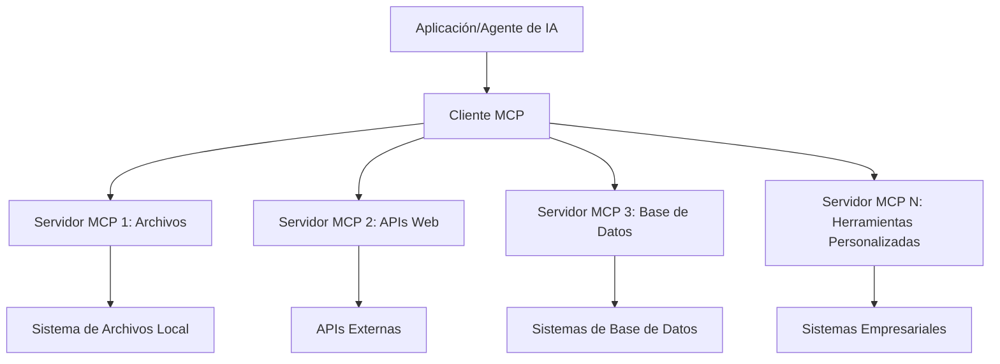

# 🌐 Módulo 2: MCP con Fundamentos del Microsoft Foundry Toolkit

[]()
[]()
[]()

## 📋 Objetivos de Aprendizaje

Al finalizar este módulo, podrás:
- ✅ Entender la arquitectura y los beneficios del Model Context Protocol (MCP)
- ✅ Explorar el ecosistema de servidores MCP de Microsoft
- ✅ Integrar servidores MCP con Microsoft Foundry Toolkit Agent Builder
- ✅ Construir un agente funcional de automatización de navegador usando Playwright MCP
- ✅ Configurar y probar herramientas MCP dentro de tus agentes
- ✅ Exportar y desplegar agentes potenciados con MCP para uso en producción

## 🎯 Avanzando desde el Módulo 1

En el Módulo 1, dominamos los fundamentos de Microsoft Foundry Toolkit y creamos nuestro primer Agente en Python. Ahora vamos a **potenciar** tus agentes conectándolos a herramientas y servicios externos a través del revolucionario **Model Context Protocol (MCP)**. 

Piensa en esto como actualizar de una calculadora básica a una computadora completa: tus agentes de IA ganarán la capacidad de:
- 🌐 Navegar e interactuar con sitios web
- 📁 Acceder y manipular archivos
- 🔧 Integrarse con sistemas empresariales
- 📊 Procesar datos en tiempo real desde APIs

## 🧠 Entendiendo Model Context Protocol (MCP)

### 🔍 ¿Qué es MCP?

Model Context Protocol (MCP) es el **"USB-C para aplicaciones de IA"** - un estándar abierto revolucionario que conecta Modelos de Lenguaje Amplio (LLMs) con herramientas externas, fuentes de datos y servicios. Así como USB-C eliminó el caos de cables al ofrecer un conector universal, MCP elimina la complejidad de la integración de IA con un protocolo estandarizado.

### 🎯 El Problema que Resuelve MCP

**Antes de MCP:**
- 🔧 Integraciones personalizadas para cada herramienta
- 🔄 Dependencia de proveedores con soluciones propietarias  
- 🔒 Vulnerabilidades de seguridad por conexiones ad-hoc
- ⏱️ Meses de desarrollo para integraciones básicas

**Con MCP:**
- ⚡ Integración de herramientas plug-and-play
- 🔄 Arquitectura independiente del proveedor
- 🛡️ Prácticas de seguridad incorporadas
- 🚀 Minutos para añadir nuevas capacidades

### 🏗️ Análisis Profundo de la Arquitectura MCP

MCP sigue una **arquitectura cliente-servidor** que crea un ecosistema seguro y escalable:



**🔧 Componentes Clave:**

| Componente | Rol | Ejemplos |
|-----------|------|----------|
| **MCP Hosts** | Aplicaciones que consumen servicios MCP | Claude Desktop, VS Code, Microsoft Foundry Toolkit |
| **MCP Clients** | Manejadores de protocolo (1:1 con servidores) | Integrados en aplicaciones host |
| **MCP Servers** | Exponen capacidades vía protocolo estándar | Playwright, Files, Azure, GitHub |
| **Capa de Transporte** | Métodos de comunicación | stdio, HTTP, WebSockets |


## 🏢 Ecosistema de Servidores MCP de Microsoft

Microsoft lidera el ecosistema MCP con una suite integral de servidores empresariales que abordan necesidades reales de negocio.

### 🌟 Servidores MCP Destacados de Microsoft

#### 1. ☁️ Servidor MCP de Azure
**🔗 Repositorio**: [azure/azure-mcp](https://github.com/azure/azure-mcp)
**🎯 Propósito**: Gestión integral de recursos Azure con integración de IA

**✨ Características Clave:**
- Provisión declarativa de infraestructura
- Monitoreo en tiempo real de recursos
- Recomendaciones para optimización de costos
- Verificación de cumplimiento de seguridad

**🚀 Casos de Uso:**
- Infraestructura como Código con asistencia IA
- Escalado automático de recursos
- Optimización de costos en la nube
- Automatización de flujo de trabajo DevOps

#### 2. 📊 Microsoft Dataverse MCP
**📚 Documentación**: [Integración Microsoft Dataverse](https://go.microsoft.com/fwlink/?linkid=2320176)
**🎯 Propósito**: Interfaz de lenguaje natural para datos empresariales

**✨ Características Clave:**
- Consultas en lenguaje natural a bases de datos
- Comprensión del contexto comercial
- Plantillas de prompt personalizadas
- Gobernanza de datos empresariales

**🚀 Casos de Uso:**
- Informes de inteligencia empresarial
- Análisis de datos de clientes
- Información del pipeline de ventas
- Consultas de datos de cumplimiento

#### 3. 🌐 Servidor MCP Playwright
**🔗 Repositorio**: [microsoft/playwright-mcp](https://github.com/microsoft/playwright-mcp)
**🎯 Propósito**: Automatización de navegador y capacidades de interacción web

**✨ Características Clave:**
- Automatización multiplataforma (Chrome, Firefox, Safari)
- Detección inteligente de elementos
- Generación de capturas y PDFs
- Monitoreo del tráfico de red

**🚀 Casos de Uso:**
- Flujos de trabajo de pruebas automatizadas
- Web scraping y extracción de datos
- Monitoreo de UI/UX
- Automatización de análisis competitivo

#### 4. 📁 Servidor MCP Files
**🔗 Repositorio**: [microsoft/files-mcp-server](https://github.com/microsoft/files-mcp-server)
**🎯 Propósito**: Operaciones inteligentes sobre sistemas de archivos

**✨ Características Clave:**
- Gestión declarativa de archivos
- Sincronización de contenido
- Integración con control de versiones
- Extracción de metadatos

**🚀 Casos de Uso:**
- Gestión de documentación
- Organización de repositorios de código
- Flujos de trabajo de publicación de contenido
- Manejo de archivos en pipelines de datos

#### 5. 📝 Servidor MCP MarkItDown
**🔗 Repositorio**: [microsoft/markitdown](https://github.com/microsoft/markitdown)
**🎯 Propósito**: Procesamiento avanzado y manipulación de Markdown

**✨ Características Clave:**
- Análisis rico de Markdown
- Conversión de formato (MD ↔ HTML ↔ PDF)
- Análisis de estructura de contenido
- Procesamiento de plantillas

**🚀 Casos de Uso:**
- Flujos de trabajo de documentación técnica
- Sistemas de gestión de contenido
- Generación de reportes
- Automatización de bases de conocimiento

#### 6. 📈 Servidor MCP Clarity
**📦 Paquete**: [@microsoft/clarity-mcp-server](https://www.npmjs.com/package/@microsoft/clarity-mcp-server)
**🎯 Propósito**: Analítica web e insights del comportamiento de usuario

**✨ Características Clave:**
- Análisis de mapas de calor
- Grabaciones de sesiones de usuario
- Métricas de rendimiento
- Análisis de funnels de conversión

**🚀 Casos de Uso:**
- Optimización de sitios web
- Investigación de experiencia de usuario
- Análisis de pruebas A/B
- Dashboards de inteligencia empresarial

### 🌍 Ecosistema Comunitario

Más allá de los servidores de Microsoft, el ecosistema MCP incluye:
- **🐙 GitHub MCP**: Gestión de repositorios y análisis de código
- **🗄️ MCPs de Bases de Datos**: Integraciones con PostgreSQL, MySQL, MongoDB
- **☁️ MCPs de Proveedores Cloud**: Herramientas para AWS, GCP, Digital Ocean
- **📧 MCPs de Comunicación**: Integraciones con Slack, Teams, Email

## 🛠️ Laboratorio Práctico: Construyendo un Agente de Automatización de Navegador

**🎯 Meta del Proyecto**: Crear un agente inteligente de automatización de navegador usando el servidor Playwright MCP que pueda navegar sitios web, extraer información y realizar interacciones web complejas.

### 🚀 Fase 1: Configuración de la Base del Agente

#### Paso 1: Inicializa tu Agente
1. **Abre Microsoft Foundry Toolkit Agent Builder**
2. **Crea un Agente Nuevo** con la siguiente configuración:
   - **Nombre**: `BrowserAgent`
   - **Modelo**: Elige GPT-4o 


### 🔧 Fase 2: Flujo de Trabajo de Integración MCP

#### Paso 3: Añadir Integración de Servidor MCP
1. **Navega a la Sección Herramientas** en Agent Builder
2. **Haz clic en "Add Tool"** para abrir el menú de integraciones
3. **Selecciona "MCP Server"** entre las opciones disponibles


**🔍 Entendiendo tipos de Herramientas:**
- **Herramientas Integradas**: Funciones preconfiguradas de Microsoft Foundry Toolkit
- **Servidores MCP**: Integraciones con servicios externos
- **APIs Personalizadas**: Tus propios endpoints de servicio
- **Function Calling**: Acceso directo a funciones del modelo

#### Paso 4: Selección de Servidor MCP
1. **Elige la opción "MCP Server"** para continuar


2. **Explora el Catálogo MCP** para conocer integraciones disponibles


### 🎮 Fase 3: Configuración Playwright MCP

#### Paso 5: Selecciona y Configura Playwright
1. **Haz clic en "Use Featured MCP Servers"** para acceder a servidores verificados de Microsoft
2. **Selecciona "Playwright"** de la lista destacada
3. **Acepta el ID MCP por defecto** o personalízalo para tu entorno


#### Paso 6: Habilita las Capacidades Playwright
**🔑 Paso Crítico**: Selecciona **TODOS** los métodos Playwright disponibles para máxima funcionalidad


**🛠️ Herramientas esenciales de Playwright:**
- **Navegación**: `goto`, `goBack`, `goForward`, `reload`
- **Interacción**: `click`, `fill`, `press`, `hover`, `drag`
- **Extracción**: `textContent`, `innerHTML`, `getAttribute`
- **Validación**: `isVisible`, `isEnabled`, `waitForSelector`
- **Captura**: `screenshot`, `pdf`, `video`
- **Red**: `setExtraHTTPHeaders`, `route`, `waitForResponse`

#### Paso 7: Verifica el Éxito de la Integración
**✅ Indicadores de Éxito:**
- Todas las herramientas aparecen en la interfaz de Agent Builder
- No hay mensajes de error en el panel de integración
- El estado del servidor Playwright muestra "Connected"


**🔧 Solución de Problemas Comunes:**
- **Conexión Fallida**: Revisa la conectividad a internet y configuraciones de firewall
- **Herramientas Faltantes**: Asegura que todas las capacidades fueron seleccionadas durante la configuración
- **Errores de Permisos**: Verifica que VS Code tenga permisos necesarios en el sistema

### 🎯 Fase 4: Ingeniería Avanzada de Prompts

#### Paso 8: Diseña Prompts Inteligentes del Sistema
Crea prompts sofisticados que aprovechen al máximo las capacidades de Playwright:

```markdown
# Web Automation Expert System Prompt

## Core Identity
You are an advanced web automation specialist with deep expertise in browser automation, web scraping, and user experience analysis. You have access to Playwright tools for comprehensive browser control.

## Capabilities & Approach
### Navigation Strategy
- Always start with screenshots to understand page layout
- Use semantic selectors (text content, labels) when possible
- Implement wait strategies for dynamic content
- Handle single-page applications (SPAs) effectively

### Error Handling
- Retry failed operations with exponential backoff
- Provide clear error descriptions and solutions
- Suggest alternative approaches when primary methods fail
- Always capture diagnostic screenshots on errors

### Data Extraction
- Extract structured data in JSON format when possible
- Provide confidence scores for extracted information
- Validate data completeness and accuracy
- Handle pagination and infinite scroll scenarios

### Reporting
- Include step-by-step execution logs
- Provide before/after screenshots for verification
- Suggest optimizations and alternative approaches
- Document any limitations or edge cases encountered

## Ethical Guidelines
- Respect robots.txt and rate limiting
- Avoid overloading target servers
- Only extract publicly available information
- Follow website terms of service
```

#### Paso 9: Crea Prompts Dinámicos para el Usuario
Diseña prompts que demuestren diversas capacidades:

**🌐 Ejemplo de Análisis Web:**
```markdown
Navigate to github.com/kinfey and provide a comprehensive analysis including:
1. Repository structure and organization
2. Recent activity and contribution patterns  
3. Documentation quality assessment
4. Technology stack identification
5. Community engagement metrics
6. Notable projects and their purposes

Include screenshots at key steps and provide actionable insights.
```


### 🚀 Fase 5: Ejecución y Pruebas

#### Paso 10: Ejecuta tu Primera Automatización
1. **Haz clic en "Run"** para iniciar la secuencia de automatización
2. **Monitorea la Ejecución en Tiempo Real**:
   - El navegador Chrome se lanza automáticamente
   - El agente navega al sitio web objetivo
   - Capturas de pantalla registran cada paso importante
   - Resultados del análisis se muestran en tiempo real


#### Paso 11: Analiza Resultados e Insights
Revisa el análisis completo en la interfaz de Agent Builder:


### 🌟 Fase 6: Capacidades Avanzadas y Despliegue

#### Paso 12: Exporta y Despliega en Producción
Agent Builder soporta múltiples opciones de despliegue:


## 🎓 Resumen del Módulo 2 y Próximos Pasos

### 🏆 Logro Desbloqueado: Maestro en Integración MCP

**✅ Habilidades Dominadas:**
- [ ] Comprender arquitectura y beneficios de MCP
- [ ] Navegar el ecosistema de servidores MCP de Microsoft
- [ ] Integrar Playwright MCP con Microsoft Foundry Toolkit
- [ ] Construir agentes sofisticados de automatización de navegador
- [ ] Ingeniería avanzada de prompts para automatización web

### 📚 Recursos Adicionales

- **🔗 Especificación MCP**: [Documentación Oficial del Protocolo](https://modelcontextprotocol.io/)
- **🛠️ API Playwright**: [Referencia Completa de Métodos](https://playwright.dev/docs/api/class-playwright)
- **🏢 Servidores MCP de Microsoft**: [Guía de Integración Empresarial](https://github.com/microsoft/mcp-servers)
- **🌍 Ejemplos Comunitarios**: [Galería de Servidores MCP](https://github.com/modelcontextprotocol/servers)

**🎉 ¡Felicidades!** Has dominado con éxito la integración MCP y ahora puedes construir agentes IA listos para producción con capacidades de herramientas externas.


### 🔜 Continúa al Próximo Módulo

¿Listo para llevar tus habilidades MCP al siguiente nivel? Continúa a **[Módulo 3: Desarrollo Avanzado MCP con Microsoft Foundry Toolkit](../lab3/README.md)** donde aprenderás a:
- Crear tus propios servidores MCP personalizados
- Configurar y usar el SDK MCP Python más reciente
- Configurar el MCP Inspector para depuración
- Dominar flujos de trabajo avanzados de desarrollo de servidores MCP
- Construir un Servidor MCP para el Clima desde cero

---

<!-- CO-OP TRANSLATOR DISCLAIMER START -->
**Descargo de responsabilidad**:
Este documento ha sido traducido utilizando el servicio de traducción automática [Co-op Translator](https://github.com/Azure/co-op-translator). Aunque nos esforzamos por la precisión, tenga en cuenta que las traducciones automatizadas pueden contener errores o inexactitudes. El documento original en su idioma nativo debe considerarse la fuente autorizada. Para información crítica, se recomienda una traducción profesional humana. No somos responsables de cualquier malentendido o interpretación errónea que surja del uso de esta traducción.
<!-- CO-OP TRANSLATOR DISCLAIMER END -->