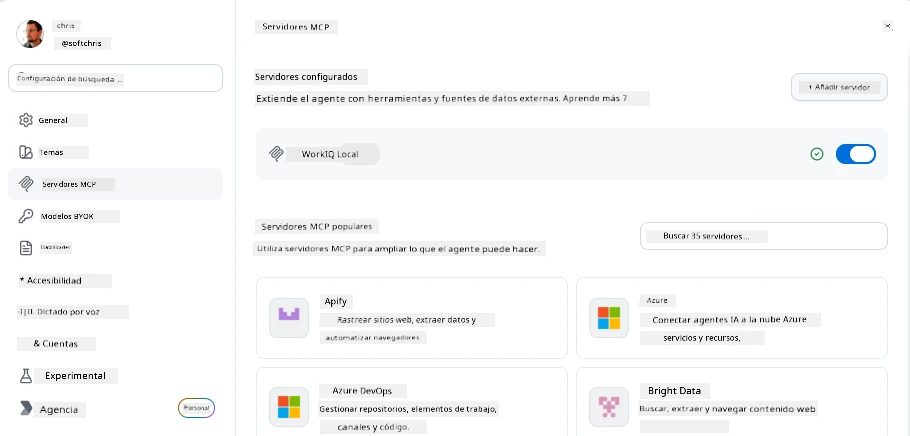
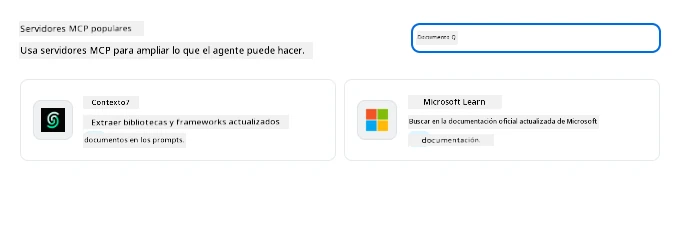
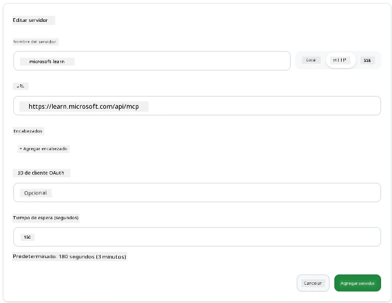
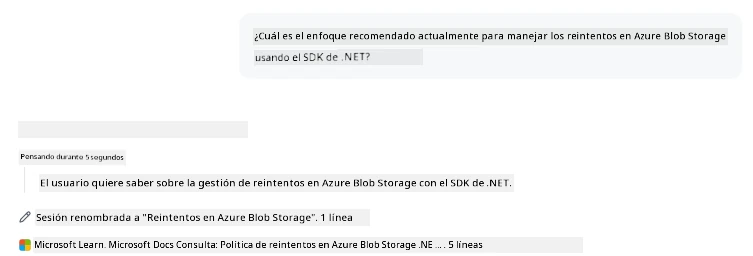
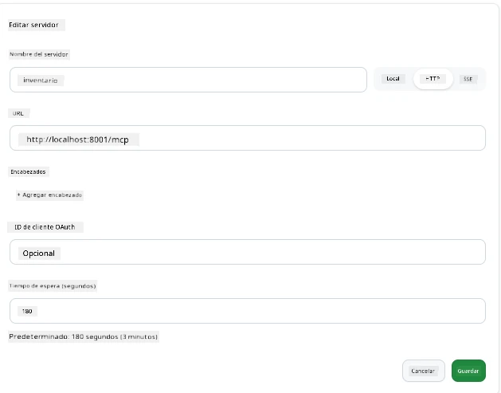
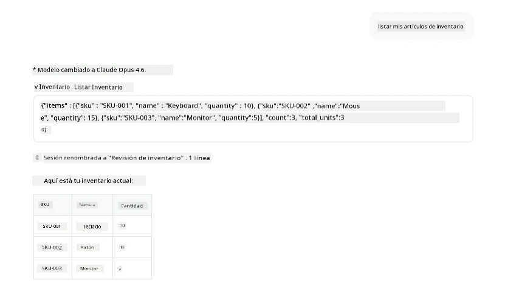
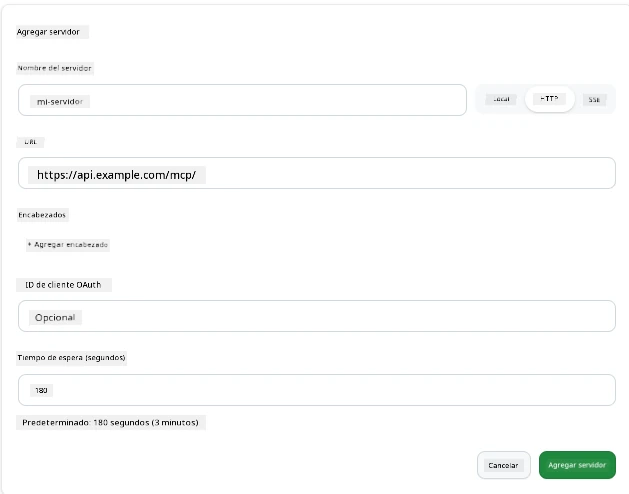
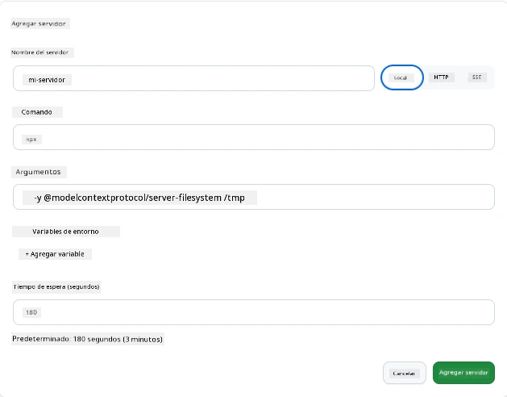

# Uso de Servidores MCP en la Aplicación GitHub Copilot

Para este momento ya sabes cómo funciona MCP. Has construido servidores, definido herramientas y recursos, y conectado clientes. Lo que aún no hemos hecho es cambiar la perspectiva: en lugar de que seas tú quien construya el servidor, ¿cómo es estar en el lado *consumidor*—como usuario de una aplicación impulsada por IA que soporta MCP?

[GitHub Copilot App](https://github.com/github/app) es una aplicación de escritorio que puede usar Servidores MCP. Al conectar servidores MCP a ella, desbloqueas un nuevo nivel: Copilot puede ahora acceder a tu documentación, llamar a tus APIs internas, consultar tu base de datos o hablar con cualquier servicio que hayas envuelto en un servidor. La aplicación se convierte en el anfitrión; tus servidores MCP se convierten en sus herramientas.

Esta lección te guía a través de esa experiencia de principio a fin—desde encontrar el panel de configuración de MCP hasta conectar un servidor real de documentación y luego configurar uno personalizado propio.

## Objetivos de Aprendizaje

Al finalizar esta lección, podrás:

- Localizar y navegar el panel de Servidores MCP en la configuración de la aplicación Copilot.
- Conectar un servidor de documentación alojado y usarlo en una sesión.
- Registrar un servidor personalizado y verificar que Copilot pueda invocar sus herramientas.
- Configurar cómo se llama a un servidor proporcionando variables de entorno o encabezados personalizados (si es HTTP).

## La Aplicación Copilot como Anfitrión MCP

Aquí está la idea fundamental: **los agentes de Copilot son inteligentes, pero solo saben lo que les dices.** Por defecto, un agente puede leer archivos en tu espacio de trabajo y ejecutar comandos en terminal, pero no puede consultar tu base de datos, revisar tu calendario, o llamar una API personalizada sin ayuda. Ahí es donde entran los servidores MCP. Actúan como puentes entre Copilot y tus sistemas—bases de datos, control de versiones, APIs, herramientas de diseño—dando a los agentes acceso a la información y acciones que necesitan para completar el trabajo.

Empecemos por encontrar esos ajustes para administrar los Servidores MCP de tu aplicación.

## Paso 1: Encontrar el Panel de Configuración MCP

Abre la aplicación Copilot y localiza un ícono de engranaje en la esquina inferior izquierda y haz clic.


Asegúrate de seleccionar "MCP Servers" y ahora deberías ver tus servidores ya configurados en la parte superior, un mercado de servidores populares en la parte inferior, y un botón "Add Server" en la parte superior como sigue:



Este es tu centro de control. Aquí agregas, eliminas, habilitas y deshabilitas servidores. Los cambios se aplican para nuevas sesiones; si tienes una sesión abierta, necesitarás iniciar una nueva después de cambiar esta lista.

## Paso 2: Conectar un Servidor de Documentación

Hagamos algo útil inmediatamente. El servidor Microsoft Docs MCP da a Copilot acceso a la documentación oficial de Microsoft. Esto incluye Azure, .NET, TypeScript, y más. En lugar de que el agente confíe en sus datos de entrenamiento (que tienen una fecha de corte), puede obtener documentación actual al momento de la consulta.

Así es cómo agregarlo:

1. En la cuadrícula de servidores populares, escribe **learn** y selecciona el servidor llamado "Microsoft Learn".

   

   Al hacer clic, se presenta un formulario donde el nombre, tipo de transporte y URL están prellenados, solo tienes que hacer clic en "Add Server".

2. Haz clic en "Add Server", debería tomar unos segundos conectarse al servidor.

   

   Una vez añadido, debería aparecer en el área superior como un servidor configurado. Probémoslo a continuación.

3. Cierra el diálogo y selecciona Chat rápido.

4. Escribe el siguiente prompt para activar una herramienta en el servidor Microsoft Learn.

   ```text
   What's the current recommended approach for handling Azure Blob Storage 
   retries using the .NET SDK?
   ```

   

Deberías ver cómo se refiere al Servidor MCP que acabamos de agregar.

## Paso 3: Conectar un Servidor stdio Personalizado

Los presets son convenientes, pero el verdadero poder está en conectar tus propios servidores. Digamos que has construido un servidor (o te han provisto uno) que expone tu API interna o base de conocimientos de la empresa. En este caso, usaremos un Servidor MCP que construimos que maneja la gestión de inventario de nuestra empresa.

1. Haz clic en el engranaje y selecciona "MCP servers" nuevamente.

2. Selecciona el botón "Add Server" y "+ Add Custom server", y proporciona los siguientes valores:

   - Nombre: `Inventory Server`
   - Selecciona transporte (a la derecha), **http**

   Selecciona "Add Server" y debería aparecer en tu lista de servidores configurados.

   

4. Para probarlo, ejecuta un prompt así:

    ```
    list inventory
    ```

   

   Ahora deberías ver una lista de artículos de inventario devueltos desde tu servidor personalizado.

Genial, ahora deberías tener un buen entendimiento de cómo agregar servidores MCP externos así como los propios a la aplicación Copilot. A continuación, hablemos sobre el manejo de secretos y variables de entorno.

## Paso 4: Configuraciones Avanzadas

Hasta ahora, has visto cómo agregar Servidores MCP donde solo proporcionas un nombre y URL. Pero ¿qué pasa si tu servidor necesita una clave API u otro valor? Bueno, dependiendo del tipo de transporte, podemos suministrarle lo que necesita.

- **Transporte http o SSE**: Aquí podemos establecer encabezados según sea necesario.

   Para autenticación, puedes especificar un encabezado Authorization, por ejemplo. El valor puede ser una cadena estática. Si usas OAuth, en su lugar puedes darle un ID de cliente OAuth.

   

- **Transporte stdio**: Se pueden establecer variables de entorno.

   Aquí puedes especificar cualquier número de variables de entorno que necesites y que deben ser pasadas al servidor cuando se inicie.

   

## Resumen

La aplicación Copilot trata a los servidores MCP como extensiones de primera clase de las capacidades del agente. Has visto todo el proceso en esta lección desde agregar servidores MCP hasta usarlos en una sesión. Ahora puedes conectar servidores públicos, APIs internas y herramientas personalizadas, dando a tus agentes la capacidad de acceder a la información y acciones que necesitan para completar tareas de forma autónoma.

## 📚 Recursos Adicionales

### Documentación oficial

- [GitHub Copilot App](https://github.com/github/app)
- [MCP Specification](https://modelcontextprotocol.io/specification/2025-03-26) - Especificación del Protocolo de Contexto de Modelos

### Comunidad
- [MCP Community Discord](https://discord.com/invite/ByRwuEEgH4) - Discusiones en vivo
- [GitHub Discussions](https://github.com/microsoft/MCP-Server-and-PostgreSQL-Sample-Retail/discussions) - Preguntas y respuestas, y compartir
- [Stack Overflow](https://stackoverflow.com/questions/tagged/model-context-protocol) - Preguntas técnicas

---

<!-- CO-OP TRANSLATOR DISCLAIMER START -->
**Descargo de responsabilidad**:
Este documento ha sido traducido utilizando el servicio de traducción automática [Co-op Translator](https://github.com/Azure/co-op-translator). Aunque nos esforzamos por la precisión, tenga en cuenta que las traducciones automatizadas pueden contener errores o inexactitudes. El documento original en su idioma nativo debe considerarse la fuente autorizada. Para información crítica, se recomienda una traducción profesional humana. No somos responsables de cualquier malentendido o interpretación errónea que surja del uso de esta traducción.
<!-- CO-OP TRANSLATOR DISCLAIMER END -->