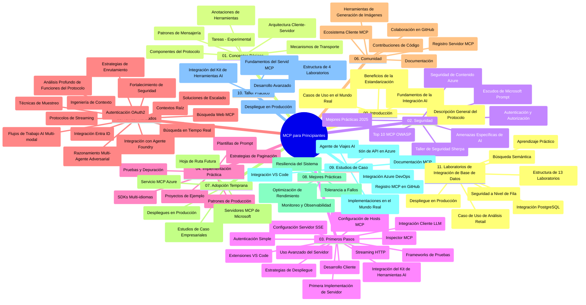

# Protocolo de Contexto del Modelo (MCP) para Principiantes - Guía de Estudio

Esta guía de estudio proporciona una visión general de la estructura y contenido del repositorio para el plan de estudios "Protocolo de Contexto del Modelo (MCP) para Principiantes". Usa esta guía para navegar el repositorio de manera eficiente y aprovechar al máximo los recursos disponibles.

## Resumen del Repositorio

El Protocolo de Contexto del Modelo (MCP) es un marco estandarizado para las interacciones entre modelos de IA y aplicaciones cliente. Inicialmente creado por Anthropic, MCP ahora es mantenido por la comunidad más amplia de MCP a través de la organización oficial de GitHub. Este repositorio ofrece un currículo integral con ejemplos prácticos de código en C#, Java, JavaScript, Python y TypeScript, diseñado para desarrolladores de IA, arquitectos de sistemas e ingenieros de software.

## Mapa Visual del Currículum

## Estructura del Repositorio

El repositorio está organizado en once secciones principales, cada una centrada en diferentes aspectos de MCP:

1. **Introducción (00-Introduction/)**
   - Visión general del Protocolo de Contexto del Modelo
   - Por qué la estandarización es importante en pipelines de IA
   - Casos prácticos y beneficios

2. **Conceptos Clave (01-CoreConcepts/)**
   - Arquitectura cliente-servidor
   - Componentes principales del protocolo
   - Patrones de mensajería en MCP

3. **Seguridad (02-Security/)**
   - Amenazas de seguridad en sistemas basados en MCP
   - Mejores prácticas para asegurar implementaciones
   - Estrategias de autenticación y autorización
   - **Documentación Completa de Seguridad**:
     - Mejores Prácticas de Seguridad MCP 2025
     - Guía de Implementación de Seguridad de Contenido en Azure
     - Controles y Técnicas de Seguridad MCP
     - Referencia Rápida de Mejores Prácticas MCP
   - **Temas Clave de Seguridad**:
     - Inyección de prompts y ataques de envenenamiento de herramientas
     - Secuestro de sesión y problemas de delegado confundido
     - Vulnerabilidades de pase de token
     - Permisos excesivos y control de acceso
     - Seguridad en la cadena de suministro para componentes de IA
     - Integración de Microsoft Prompt Shields

4. **Primeros Pasos (03-GettingStarted/)**
   - Configuración y preparación del entorno
   - Creación de servidores y clientes básicos MCP
   - Integración con aplicaciones existentes
   - Incluye secciones para:
     - Primera implementación del servidor
     - Desarrollo de clientes
     - Integración cliente LLM
     - Integración con VS Code
     - Servidor Server-Sent Events (SSE)
     - Uso avanzado de servidores
     - Streaming HTTP
     - Integración con AI Toolkit
     - Estrategias de pruebas
     - Guías de despliegue

5. **Implementación Práctica (04-PracticalImplementation/)**
   - Uso de SDKs en diferentes lenguajes de programación
   - Técnicas de depuración, pruebas y validación
   - Creación de plantillas reutilizables de prompts y flujos de trabajo
   - Proyectos de muestra con ejemplos de implementación

6. **Temas Avanzados (05-AdvancedTopics/)**
   - Técnicas de ingeniería de contexto
   - Integración con agente Foundry
   - Flujos de trabajo multimodales de IA
   - Demos de autenticación OAuth2
   - Capacidades de búsqueda en tiempo real
   - Streaming en tiempo real
   - Implementación de contextos raíz
   - Estrategias de enrutamiento
   - Técnicas de muestreo
   - Enfoques de escalado
   - Consideraciones de seguridad
   - Integración de seguridad Entra ID
   - Integración con búsqueda web
   - Razonamiento adversarial multi-agente (patrones de debate)

7. **Contribuciones de la Comunidad (06-CommunityContributions/)**
   - Cómo contribuir con código y documentación
   - Colaboración vía GitHub
   - Mejoras impulsadas por la comunidad y retroalimentación
   - Uso de diversos clientes MCP (Claude Desktop, Cline, VSCode)
   - Trabajo con servidores MCP populares incluyendo generación de imágenes

8. **Lecciones de la Adopción Temprana (07-LessonsfromEarlyAdoption/)**
   - Implementaciones reales y casos de éxito
   - Construcción y despliegue de soluciones basadas en MCP
   - Tendencias y hoja de ruta futura
   - **Guía de Servidores MCP Microsoft**: Guía completa de 10 servidores MCP Microsoft listos para producción, incluyendo:
     - Microsoft Learn Docs MCP Server
     - Azure MCP Server (más de 15 conectores especializados)
     - GitHub MCP Server
     - Azure DevOps MCP Server
     - MarkItDown MCP Server
     - SQL Server MCP Server
     - Playwright MCP Server
     - Dev Box MCP Server
     - Microsoft Foundry MCP Server
     - Microsoft 365 Agents Toolkit MCP Server

9. **Mejores Prácticas (08-BestPractices/)**
   - Afinamiento y optimización del rendimiento
   - Diseño de sistemas MCP tolerantes a fallos
   - Estrategias de pruebas y resiliencia

10. **Estudios de Caso (09-CaseStudy/)**
    - **Siete estudios de caso exhaustivos** demostrando la versatilidad de MCP en distintos escenarios:
    - **Agentes de Viaje IA en Azure**: Orquestación multi-agente con Azure OpenAI y AI Search
    - **Integración Azure DevOps**: Automatización de procesos con actualización de datos de YouTube
    - **Recuperación de Documentación en Tiempo Real**: Cliente de consola Python con streaming HTTP
    - **Generador Interactivo de Planes de Estudio**: Aplicación web Chainlit con IA conversacional
    - **Documentación en el Editor**: Integración en VS Code con flujos GitHub Copilot
    - **Gestión de API en Azure**: Integración empresarial de API con creación de servidor MCP
    - **Registro MCP GitHub**: Plataforma de desarrollo de ecosistema e integración agentic
    - Ejemplos de implementación en integración empresarial, productividad de desarrolladores y desarrollo de ecosistema

11. **Taller Práctico (10-StreamliningAIWorkflowsBuildingAnMCPServerWithAIToolkit/)**
    - Taller integral combinando MCP con AI Toolkit
    - Construcción de aplicaciones inteligentes que unen modelos de IA con herramientas reales
    - Módulos prácticos que cubren fundamentos, desarrollo personalizado de servidores y estrategias de despliegue en producción
    - **Estructura del Taller**:
      - Laboratorio 1: Fundamentos del Servidor MCP
      - Laboratorio 2: Desarrollo Avanzado de Servidores MCP
      - Laboratorio 3: Integración con AI Toolkit
      - Laboratorio 4: Despliegue y Escalado en Producción
    - Enfoque de aprendizaje basado en laboratorios con instrucciones paso a paso

12. **Laboratorios de Integración de Base de Datos para Servidor MCP (11-MCPServerHandsOnLabs/)**
    - **Completo camino de aprendizaje de 13 laboratorios** para construir servidores MCP listos para producción con integración PostgreSQL
    - **Implementación real de análisis minorista** usando el caso de uso Zava Retail
    - **Patrones empresariales** incluyendo Seguridad a Nivel de Fila (RLS), búsqueda semántica y acceso multi-inquilino a datos
    - **Estructura completa del laboratorio**:
      - **Labs 00-03: Fundamentos** - Introducción, Arquitectura, Seguridad, Configuración del Entorno
      - **Labs 04-06: Construcción del Servidor MCP** - Diseño de Base de Datos, Implementación del Servidor MCP, Desarrollo de Herramientas
      - **Labs 07-09: Funcionalidades Avanzadas** - Búsqueda Semántica, Pruebas y Depuración, Integración con VS Code
      - **Labs 10-12: Producción y Mejores Prácticas** - Despliegue, Monitoreo, Optimización
    - **Tecnologías Cubiertas**: framework FastMCP, PostgreSQL, Azure OpenAI, Azure Container Apps, Application Insights
    - **Resultados de Aprendizaje**: Servidores MCP listos para producción, patrones de integración de bases de datos, análisis impulsado por IA, seguridad empresarial

## Recursos Adicionales

El repositorio incluye recursos de apoyo:

- **Carpeta de imágenes**: Contiene diagramas e ilustraciones usados a lo largo del currículo
- **Traducciones**: Soporte multilingüe con traducciones automáticas de la documentación
- **Recursos Oficiales MCP**:
  - [Documentación MCP](https://modelcontextprotocol.io/)
  - [Especificación MCP](https://spec.modelcontextprotocol.io/)
  - [Repositorio MCP en GitHub](https://github.com/modelcontextprotocol)

## Cómo Usar Este Repositorio

1. **Aprendizaje Secuencial**: Sigue los capítulos en orden (00 a 11) para una experiencia de aprendizaje estructurada.
2. **Enfoque por Lenguaje**: Si te interesa un lenguaje de programación particular, explora los directorios de ejemplos para implementaciones en tu lenguaje preferido.
3. **Implementación Práctica**: Comienza con la sección "Primeros Pasos" para configurar tu entorno y crear tu primer servidor y cliente MCP.
4. **Exploración Avanzada**: Una vez familiarizado con lo básico, sumérgete en los temas avanzados para ampliar tu conocimiento.
5. **Compromiso Comunitario**: Únete a la comunidad MCP a través de discusiones en GitHub y canales de Discord para conectar con expertos y otros desarrolladores.

## Clientes y Herramientas MCP

El currículo cubre varios clientes y herramientas MCP:

1. **Clientes Oficiales**:
   - Visual Studio Code
   - MCP en Visual Studio Code
   - Claude Desktop
   - Claude en VSCode
   - Claude API

2. **Clientes de la Comunidad**:
   - Cline (terminal)
   - Cursor (editor de código)
   - ChatMCP
   - Windsurf

3. **Herramientas de Gestión MCP**:
   - MCP CLI
   - MCP Manager
   - MCP Linker
   - MCP Router

## Servidores MCP Populares

El repositorio presenta varios servidores MCP, incluyendo:

1. **Servidores MCP Oficiales de Microsoft**:
   - Microsoft Learn Docs MCP Server
   - Azure MCP Server (más de 15 conectores especializados)
   - GitHub MCP Server
   - Azure DevOps MCP Server
   - MarkItDown MCP Server
   - SQL Server MCP Server
   - Playwright MCP Server
   - Dev Box MCP Server
   - Microsoft Foundry MCP Server
   - Microsoft 365 Agents Toolkit MCP Server

2. **Servidores de Referencia Oficiales**:
   - Filesystem
   - Fetch
   - Memory
   - Sequential Thinking

3. **Generación de Imágenes**:
   - Azure OpenAI DALL-E 3
   - Stable Diffusion WebUI
   - Replicate

4. **Herramientas de Desarrollo**:
   - Git MCP
   - Terminal Control
   - Code Assistant

5. **Servidores Especializados**:
   - Salesforce
   - Microsoft Teams
   - Jira & Confluence

## Contribuciones

Este repositorio da la bienvenida a contribuciones de la comunidad. Consulta la sección Contribuciones de la Comunidad para orientación sobre cómo contribuir efectivamente al ecosistema MCP.

----

*Esta guía de estudio fue actualizada por última vez el 5 de febrero de 2026, reflejando la última Especificación MCP 2025-11-25 y proporciona una visión general del repositorio hasta esa fecha. El contenido del repositorio puede actualizarse después de esta fecha.*

---

<!-- CO-OP TRANSLATOR DISCLAIMER START -->
**Descargo de responsabilidad**:
Este documento ha sido traducido utilizando el servicio de traducción automática [Co-op Translator](https://github.com/Azure/co-op-translator). Aunque nos esforzamos por la precisión, tenga en cuenta que las traducciones automatizadas pueden contener errores o inexactitudes. El documento original en su idioma nativo debe considerarse la fuente autorizada. Para información crítica, se recomienda una traducción profesional humana. No somos responsables de cualquier malentendido o interpretación errónea que surja del uso de esta traducción.
<!-- CO-OP TRANSLATOR DISCLAIMER END -->