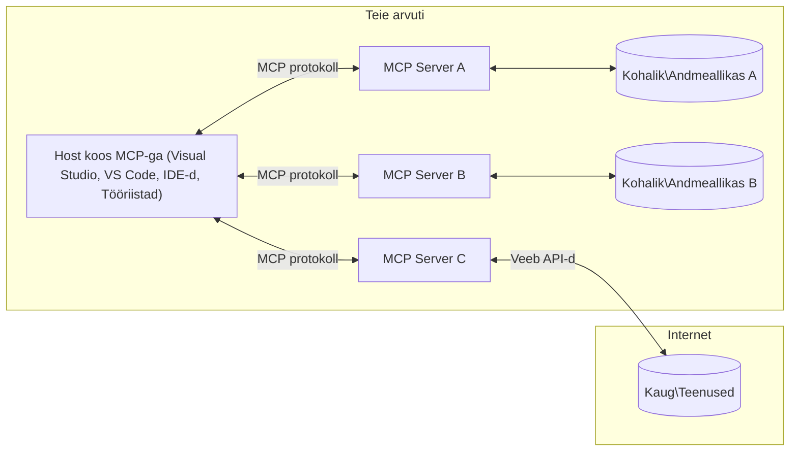

# MCP põhikontseptsioonid: Model Context Protocoli valdamine tehisintellekti integratsiooniks

[](https://youtu.be/earDzWGtE84)

_(Klõpsake ülaloleval pildil, et vaadata selle õppetunni videot)_

[Model Context Protocol (MCP)](https://github.com/modelcontextprotocol) on võimas, standardiseeritud raamistik, mis optimeerib suhtlust suurte keelemudelite (LLM-ide) ning väliste tööriistade, rakenduste ja andmeallikate vahel.  
See juhend viib teid MCP põhikontseptsioonide juurde. Õpite selle kliendi-serveri arhitektuuri, olulisi komponente, suhtlusmehhanisme ja parimaid rakenduspraktikaid.

- **Selge kasutaja nõusolek**: Kõik andmete ligipääsud ja toimingud nõuavad selgesõnalist kasutaja kinnitust enne täideviimist. Kasutajad peavad selgelt mõistma, milliseid andmeid ligipääseb ja millised toimingud viiakse läbi, koos üksikasjaliku kontrolliga õiguste ja volituste üle.  

- **Andmekaitse ja privaatsus**: Kasutaja andmeid avaldatakse ainult selgesõnalise nõusoleku korral ning neid tuleb kogu interaktsiooni jooksul tugevalt kaitsta juurdepääsu kontrollidega. Rakendused peavad takistama volitamata andmeedastust ja hoidma rangeid privaatsuspiiranguid.  

- **Tööriistade täitmiskindlus**: Iga tööriista kutsung nõuab selgesõnalist kasutaja nõusolekut koos arusaamisega tööriista funktsioonidest, parameetritest ja võimalikust mõjust. Tugevad turvapiirid peavad takistama soovimatut, ebaturvalist või pahatahtlikku tööriistade täitmist.  

- **Andmekandja turvalisus**: Kõik suhtluskanalid peaksid kasutama sobivaid krüpteerimis- ja autentimismeetodeid. Kaugühendused peavad rakendama turvalisi transpordiprotokolle ja nõuetekohast volituste haldust.  

#### Rakendusjuhised:

- **Õiguste haldus**: Rakendage peene teravusega õigussüsteeme, mis võimaldavad kasutajatel kontrollida, millised serverid, tööriistad ja ressursid on ligipääsetavad  
- **Autentimine ja autoriseerimine**: Kasutage turvalisi autentimismeetodeid (OAuth, API võtmed) koos nõuetekohase tokenite halduse ja aegumisega  
- **Sisendi valideerimine**: Valideerige kõiki parameetreid ja andmesisendeid vastavalt määratletud skeemidele, et vältida sisestusrünnakuid  
- **Auditilogimine**: Hoolitsege kõigi toimingute põhjalike logide säilitamise eest julgeoleku jälgimiseks ja nõuetele vastavuse tagamiseks  

## Ülevaade  

See õppetund uurib Model Context Protocoli (MCP) ökosüsteemi alusarhitektuuri ja komponente. Saate teada kliendi-serveri arhitektuuri, võtmekomponendid ja suhtlusmehhanismid, mis võimaldavad MCP interaktsioone.

## Peamised õpieesmärgid  

Selle õppetunni lõpuks oskate:

- Mõista MCP kliendi-serveri arhitektuuri.  
- Tuvastada Hostide, klientide ja serverite rollid ja vastutused.  
- Analüüsida põhifunktsioone, mis teevad MCP-st paindliku integratsioonikihi.  
- Õppida, kuidas informatsioon voolab MCP ökosüsteemis.  
- Saada praktilisi teadmisi näidiskoodide abil .NET, Java, Python ja JavaScript keeles.  

## MCP arhitektuur: sügavama pilguheit  

MCP ökosüsteem on üles ehitatud kliendi-serveri mudelile. See modulaarne struktuur võimaldab tehisintellekti rakendustel tõhusalt suhelda tööriistade, andmebaaside, API-de ja kontekstuaalsete ressurssidega. Vaatame seda arhitektuuri selle põhilisteks komponentideks.

Põhimõtteliselt järgib MCP kliendi-serveri arhitektuuri, kus hostrakendusel võib olla ühendus mitme serveriga:


- **MCP hostsid**: programmid nagu VSCode, Claude Desktop, IDE-d või tehisintellekti tööriistad, mis soovivad MCP kaudu andmetele ligi pääseda  
- **MCP kliendid**: protokolli kliendid, kes hoiavad ükshaaval ühendusi serveritega  
- **MCP serverid**: kergekaalulised programmid, mis pakuvad standardiseeritud Model Context Protocoli kaudu konkreetseid võimeid  
- **Kohalikud andmeallikad**: Teie arvuti failid, andmebaasid ja teenused, millele MCP serverid võivad turvaliselt ligi pääseda  
- **Kaugteenused**: välised süsteemid, mis on interneti kaudu ligipääsetavad ning millele MCP serverid ühenduvad API-de kaudu.  

MCP protokoll on arenev standard, mis kasutab kuupõhist versioonihaldust (kujund YYYY-MM-DD). Praegune protokolli versioon on **2025-11-25**. Võite näha uusimaid uuendusi [protokolli spetsifikatsioonis](https://modelcontextprotocol.io/specification/2025-11-25/).

### 1. Hostid  

Model Context Protocolis (MCP) on **hostid** tehisintellekti rakendused, mis toimivad peamise liidesena, mille kaudu kasutajad protokolliga suhtlevad. Hostid koordineerivad ning haldavad mitme MCP serveriga ühendusi, luues iga serveriühenduse jaoks pühendatud MCP kliendi. Hostide näited on:

- **tehisintellekti rakendused**: Claude Desktop, Visual Studio Code, Claude Code  
- **arenduskeskkonnad**: IDE-d ja koodiredaktorid MCP integratsiooniga  
- **kohandatud rakendused**: spetsiaalselt loodud tehisintellekti agendid ja tööriistad  

**Hostid** on rakendused, mis koordineerivad tehisintellekti mudelitega suhtlemist. Nad:

- **korraldavad tehisintellekti mudeleid**: täidavad või suhtlevad LLMidega, et genereerida vastuseid ja koordineerida AI töövooge  
- **haldavad kliendiühendusi**: loovad ja hoiavad iga MCP serveriühenduse jaoks ühe MCP kliendi  
- **juhtivad kasutajaliidest**: haldavad vestluse kulgu, kasutajate suhtlusi ja vastuste kuvamist  
- **rakendavad turvalisust**: kontrollivad õigusi, turvapiiranguid ja autentimist  
- **käsitlevad kasutaja nõusolekut**: haldavad kasutaja kinnitusi andmete jagamiseks ja tööriistade täitmiseks  

### 2. Kliendid  

**Kliendid** on olulised komponendid, mis hoiavad pühendatud ühe-ühe vastu ühendusi hostide ja MCP serverite vahel. Iga MCP klient luuakse hosti poolt konkreetse MCP serveriga ühenduse loomiseks, tagades organiseeritud ja turvalised suhtluskanalid. Mitmed kliendid võimaldavad hostidel samaaegselt ühendada mitme serveriga.

**Kliendid** on ühenduskomponendid hostrakenduses. Nad:

- **protokolli suhtlus**: saadavad serveritele JSON-RPC 2.0 päringuid koos promptide ja juhistega  
- **võime läbirääkimised**: läbiräägivad serveritega toetatud funktsioone ja protokolli versioone algatamisel  
- **tööriistade täitmine**: haldavad mudelitelt tööriistade täitmiskäske ja töötlevad vastuseid  
- **reaalajas uuendused**: käsitlevad serveritelt tulevaid teavitusi ja reaalajas uuendusi  
- **vastuste töötlemine**: töötlevad ja vormindavad serveri vastuseid kasutajale kuvamiseks  

### 3. Serverid  

**Serverid** on programmid, mis pakuvad MCP klientidele konteksti, tööriistu ja funktsionaalsusi. Nad võivad töötada lokaalselt (hostiga samal masinal) või kaugelt (välisel platvormil) ning on vastutavad kliendipäringute töötlemise ja struktureeritud vastuste pakkumise eest. Serverid pakuvad kindlaid funktsioone standardiseeritud Model Context Protocoli kaudu.

**Serverid** on teenused, mis pakuvad konteksti ja võimeid. Nad:

- **registreerivad omadusi**: registreerivad ja avaldavad klientidele kättesaadavad primitiivid (ressursid, promptid, tööriistad)  
- **päringutöötlus**: võtavad vastu ja täidavad tööriistakutseid, ressurspäringuid ja promptipäringuid klientidelt  
- **konteksti pakkumine**: annavad kontekstitud informatsiooni ja andmeid, et täiustada mudeli vastuseid  
- **seisundi haldus**: hoiavad sessiooni olekut ja haldavad vajadusel olekupidavaid interaktsioone  
- **reaalaja teavitused**: saadavad klientidele teavitusi võime muutuste ja uuenduste kohta  

Serverid võivad olla arendatud kellegi poolt, kes soovib laiendada mudelite võimeid spetsialiseerunud funktsionaalsusega ning nad toetavad nii kohalikke kui ka kaugdeploy-imisstsenaariume.

### 4. Serveri primitiivid  

Model Context Protocoli (MCP) serverid pakuvad kolme põhikomponenti ehk **primitiivi**, mis määratlevad rikkalike interaktsioonide põhilised ehituskivid klientide, hostide ja keelemudelite vahel. Need primitiivid täpsustavad protokolli kaudu kättesaadavaid kontekstuaalse info tüüpe ja toiminguid.

MCP serverid võivad avaldada mis tahes kombinatsiooni järgmistest kolmest põhikomponendist:

#### Ressursid  

**Ressursid** on andmeallikad, mis pakuvad tehisintellekti rakendustele kontekstuaalset teavet. Need esindavad staatilist või dünaamilist sisu, mis võib parandada mudeli mõistmist ja otsuste tegemist:

- **kontekstipõhine andmestik**: struktureeritud info ja kontekst AI mudeli tarbeks  
- **teadmiste baasid**: dokumendikogud, artiklid, juhendid ja teadustööd  
- **kohalikud andmeallikad**: failid, andmebaasid ja kohalik süsteemi info  
- **välised andmed**: API vastused, veebiteenused ja kaugandmed  
- **dünaamiline sisu**: reaalajas uuenevad andmed vastavalt välistingimustele  

Ressursid on identifitseeritud URI-dega ja toetavad avastamist meetodite `resources/list` kaudu ning lugemist `resources/read` abil: 

```text
file://documents/project-spec.md
database://production/users/schema
api://weather/current
```
  
#### Promptid  

**Promptid** on taaskasutatavad mallid, mis aitavad struktureerida keelemudelitega suhtlemist. Need pakuvad standardiseeritud suhtlusmustreid ja mallipõhiseid töövooge:

- **mallipõhised interaktsioonid**: ette valmistatud sõnumid ja vestluse algatamised  
- **töövoo mallid**: standardiseeritud järjestused tavapärasteks ülesanneteks ja suhtlusteks  
- **näidismallid väheste näidetega**: mudelikäsitluseks mõeldud näidismallid  
- **süsteemi promptid**: põhilised promptid, mis määravad mudeli käitumise ja konteksti  
- **dünaamilised mallid**: parameetritega promptid, mis kohanduvad konkreetsete kontekstide jaoks  

Promptide puhul on toetatud muutujate asendamine ning need on leitavad `prompts/list` kaudu ning kättesaadavad `prompts/get` abil:  

```markdown
Generate a {{task_type}} for {{product}} targeting {{audience}} with the following requirements: {{requirements}}
```
  
#### Tööriistad  

**Tööriistad** on täidetavad funktsioonid, mida AI mudelid saavad kutsuda konkreetsete toimingute sooritamiseks. Need on MCP ökosüsteemi "tegusõnad", võimaldades mudelitel suhelda välissüsteemidega:

- **täidetavad funktsioonid**: diskreetsed toimingud, mida mudelid saavad kindlate parameetritega kutsuda  
- **välissüsteemide integratsioon**: API kõned, andmebaasi päringud, failitoimingud, arvutused  
- **unikaalne identiteet**: igal tööriistal on eristav nimi, kirjeldus ja parameetrite skeem  
- **struktureeritud sisend-väljund**: tööriistad aktsepteerivad valideeritud parameetreid ja tagastavad struktureeritud, tüübiga vastuseid  
- **toimingu võimed**: võimaldavad mudelitel teha reaalseid toiminguid ja hankida reaalajas andmeid  

Tööriistu defineeritakse JSON skeemiga parameetrite valideerimiseks ning neid avastatakse `tools/list` kaudu ja käivitatakse `tools/call` meetodiga. Tööriistad võivad sisaldada ka **ikoonasid** täiendava metaandmetena parema kasutajaliidese esituseks.

**Tööriista annotatsioonid**: tööriistad toetavad käitumisannotatsioone (näiteks `readOnlyHint`, `destructiveHint`), mis kirjeldavad, kas tööriist on ainult lugemiseks või destruktiivne, aidates klientidel teha teadlikumaid otsuseid tööriistade täitmisel.

Näidis tööriista definitsioon:  

```typescript
server.tool(
  "search_products", 
  {
    query: z.string().describe("Search query for products"),
    category: z.string().optional().describe("Product category filter"),
    max_results: z.number().default(10).describe("Maximum results to return")
  }, 
  async (params) => {
    // Teosta otsing ja tagasta struktureeritud tulemused
    return await productService.search(params);
  }
);
```
  
## Kliendi primitiivid  

Model Context Protocolis (MCP) võivad **kliendid** avaldada primitiive, mis võimaldavad serveritel taotleda hostrakenduselt täiendavaid võimeid. Need kliendi-primitiivid võimaldavad rikkalikumaid, interaktiivsemaid serverirakendusi, mis pääsevad ligi AI mudelite võimetele ja kasutajate interaktsioonidele.

### Võttekäik (Sampling)  

**Võttekäik** võimaldab serveritel taotleda keelemudeli täitmiskompletatsioone kliendi AI rakenduselt. See primitiiv võimaldab serveritel kasutada LLM võimeid ilma oma mudelispetsiifikatsioonita:

- **mudelist sõltumatu ligipääs**: serverid saavad taotleda täitmisi ilma LLM SDK-sid kaasamata või mudeli ligipääsu haldamata  
- **serveri algatatud AI**: võimaldab serveritel autonoomselt sisu genereerida, kasutades kliendi mudelit  
- **rekursiivsed LLM interaktsioonid**: toetab keerukaid stsenaariume, kus serverid vajavad AI abi töötlemiseks  
- **dünaamiline sisuloome**: lubab serveritel luua kontekstuaalseid vastuseid hosti mudeli abil  
- **tööriistade kutsumise tugi**: serverid võivad lisada `tools` ja `toolChoice` parameetreid, et lubada kliendi mudelil tööriistu samal ajal kutsuda  

Võttekäik algatatakse meetodi `sampling/complete` kaudu, kus serverid saadavad täitmistaotlusi klientidele.

### Juurdepääsupunktid (Roots)  

**Roots** pakuvad standardiseeritud viisi klientidel avada failisüsteemi piirid serveritele, aidates serveritel mõista, millistele kaustadele ja failidele neil on ligipääs:

- **failisüsteemi piirid**: määratlevad, kus serverid võivad failisüsteemis tegutseda  
- **ligipääsu kontroll**: aitavad serveritel mõista, millistel kaustadel ja failidel on ligipääsuõigus  
- **dünaamilised uuendused**: kliendid võivad serveritele teada anda, kui juurdepääsupunktide nimekiri muutub  
- **URI-põhine identifitseerimine**: juurdepääsupunktide identifikaatoriteks on `file://` URI-d, mis määravad ligipääsetavad kaustad ja failid  

Juurdepääsupunkte leitakse meetodiga `roots/list`, kliendid saadavad `notifications/roots/list_changed` teavitusi, kui juured muutuvad.

### Info pärimine (Elicitation)  

**Info pärimine** võimaldab serveritel taotleda kasutajatelt täiendavat informatsiooni või kinnitust kliendi liidese kaudu:

- **kasutaja sisendi taotlused**: serverid võivad küsida lisainfot tööriista täitmiseks vajalike parameetrite kohta  
- **kinnitusküsimused**: küsivad kasutaja nõusolekut tundlike või olulisemate toimingute jaoks  
- **interaktiivsed töövood**: lubavad serveritel luua samm-sammult kasutajaga interaktsioone  
- **dünaamiline parameetrite kogumine**: koguvad puuduvad või valikulised parameetrid tööriista täitmisel  

Info päringu taotlused tehakse meetodi `elicitation/request` kaudu kasutaja sisendi kogumiseks kliendi liidese kaudu.

**URL-režiimi info pärimine**: serverid võivad taotleda ka URL-põhist kasutajaliidest, suunates kasutajad välistele veebilehtedele autentimiseks, kinnituseks või andmete sisestamiseks.

### Logimine  

**Logimine** võimaldab serveritel saata struktureeritud logisõnumeid klientidele silumiseks, monitooringuks ja operatiivse nähtavuse tagamiseks:

- **silumise tugi**: lubab serveritel esitada üksikasjalikke täitmislogisid tõrkeotsinguks  
- **operatiivne järelevalve**: saadab klientidele olekuuuendusi ja jõudlusmõõdikuid  
- **veateadete edastamine**: pakub põhjalikku vea konteksti ja diagnostilist infot  
- **audiitradade loomine**: loob põhjalikke logisid serveri toimingutest ja otsustest  

Logisõnumid saadetakse klientidele, et tagada serveritoimingute läbipaistvus ja hõlbustada silumist.

## Informatsiooni voog MCP-s  

Model Context Protocol (MCP) määratleb struktureeritud informatsioonivoogude vahetuse hostide, klientide, serverite ja mudelite vahel. Selle voo mõistmine aitab selgitada, kuidas kasutajate päringud töödeldakse ning kuidas välised tööriistad ja andmed integreeritakse mudeli vastustesse.
- **Host alustab ühendust**  
  Hostrakendus (näiteks IDE või vestluse liides) loob ühenduse MCP serveriga, tavaliselt STDIO, WebSocketi või muu toetatud transpordi kaudu.

- **Võimekuse läbirääkimised**  
  Klient (mis on integreeritud hosti) ja server vahetavad teavet oma toetatud funktsioonide, tööriistade, ressursside ja protokolli versioonide kohta. See tagab, et mõlemad pooled mõistavad, millised võimekused sessioonis kättesaadavad on.

- **Kasutajapäring**  
  Kasutaja suhtleb hostiga (nt sisestab käsu või päringu). Host kogub selle sisendi ja edastab selle töötlemiseks kliendile.

- **Ressursside või tööriistade kasutamine**  
  - Klient võib taotleda serverilt täiendavat konteksti või ressursse (nt faile, andmebaasi kirjeid või teadmistebaasi artikleid), et mudeli arusaamist rikastada.  
  - Kui mudel otsustab, et on vajalik tööriist (nt andmete hankimiseks, arvutuste tegemiseks või API kutsumiseks), saadab klient serverile tööriista kasutamise taotluse, täpsustades tööriista nime ja parameetrid.

- **Serveri täitmine**  
  Server võtab vastu ressursi- või tööriistataotluse, täidab vajalikud toimingud (nt funktsiooni käivitamine, andmebaasipäringu tegemine või faili toomine) ja tagastab tulemused kliendile struktuuritud kujul.

- **Vastuse genereerimine**  
  Klient integreerib serveri vastused (ressursiandmed, tööriistade väljundid jne) käimasolevasse mudeli suhtlusse. Mudel kasutab neid andmeid, et koostada põhjalik ja kontekstuaalselt asjakohane vastus.

- **Tulemuse esitamine**  
  Host saab kliendilt lõpliku väljundi ja esitab selle kasutajale, sageli sisaldades nii mudeli genereeritud teksti kui ka tööriistade täitmise või ressursside otsingu tulemusi.

See töövoog võimaldab MCP-l toetada keerukaid, interaktiivseid ja kontekstiteadlikke tehisintellekti rakendusi, ühendades sujuvalt mudeleid väliste tööriistade ja andmeallikatega.

## Protokolli arhitektuur ja kihid

MCP koosneb kahest erinevast arhitektuurikihist, mis töötavad koos, et pakkuda täielikku suhtlusraamistikku:

### Andmekiht

**Andmekiht** rakendab MCP põhiprotookolli, kasutades **JSON-RPC 2.0** standardit. See kiht määratleb sõnumite struktuuri, semantika ja suhtlusmustrid:

#### Põhikomponendid:

- **JSON-RPC 2.0 protokoll**: Kõik suhtlus toimub standardiseeritud JSON-RPC 2.0 sõnumiformaadis meetodite kutsumiseks, vastusteks ja teavitusteks  
- **Elutsükli haldus**: Haldab ühenduse loomist, võimekuse läbirääkimisi ja sessiooni lõpetamist klientide ja serverite vahel  
- **Serveri primitiivid**: Võimaldab serveritel pakkuda põhifunktsionaalsust tööriistade, ressursside ja promptide kaudu  
- **Kliendi primitiivid**: Võimaldab serveritel taotleda LLM-i proovivõttu, kasutajasisendi küsimist ja logisõnumite saatmist  
- **Reaalajas teavitused**: Toetab asünkroonseid teavitusi dünaamiliste värskenduste jaoks ilma päringuta

#### Põhijooned:

- **Protokolli versiooni läbirääkimine**: Kasutab kuupõhist versioonihaldust (AAAA-KK-PP), et tagada ühilduvus  
- **Võimekuse avastamine**: Kliendid ja serverid vahetavad algatamisel toetatud funktsioonide teavet  
- **Oleku säilitamine**: Säilitab ühenduse oleku mitme suhtluse vältel konteksti järjepidevuseks

### Transpordikiht

**Transpordikiht** haldab kommunikatsioonikanaleid, sõnumite vormindamist ja autentimist MCP osaliste vahel:

#### Toetatud transpordimehhanismid:

1. **STDIO transport**:  
   - Kasutab standardset sisend-/väljundvoogu otseseks protsessi suhtluseks  
   - Optimaalne samas seadmes töötavate protsesside jaoks, ilma võrgu koormuseta  
   - Sageli kasutatav kohalikeks MCP serveri rakendusteks

2. **Streamitav HTTP transport**:  
   - Kasutab HTTP POST-i kliendilt serverile sõnumiteks  
   - Valikuline Server-Sent Events (SSE) serverilt kliendile voogedastuseks  
   - Võimaldab kaugsuhtlust serveritega võrgus  
   - Toetab standardset HTTP autentimist (tokenid, API võtmed, kohandatud päised)  
   - MCP soovitab turvaliseks tokeni autentimiseks OAuth kombineerimist

#### Transpordi abstraktsioon:

Transpordikiht eraldab suhtluse tehnilised detailid andmekihist, võimaldades sama JSON-RPC 2.0 sõnumiformaati kõigi transpordimeetodite puhul. See abstraktsioon võimaldab rakendustel sujuvalt vahetada lokaalse ja kaugsuhtluse vahel.

### Turvalisuse kaalutlused

MCP rakendused peavad järgima mitmeid olulisi turvapõhimõtteid, et tagada turvalised, usaldusväärsed ja kaitstud suhtlused kõigi protokolli toimingute jooksul:

- **Kasutaja nõusolek ja kontroll**: Kasutajad peavad andma selgesõnalise nõusoleku enne, kui andmetele ligi päästakse või toiminguid tehakse. Neil peaks olema selge kontroll selle üle, millised andmed jagatakse ja millised toimingud on lubatud, mida toetavad kasutajasõbralikud liidesed tegevuste vaatamiseks ja kinnitamiseks.

- **Andmete privaatsus**: Kasutaja andmeid tohib avalikustada ainult selgesõnalise nõusoleku alusel ning neid tuleb kaitsta sobivate ligipääsu kontrollidega. MCP rakendused peavad vältima volitamata andmeedastust ja tagama privaatsuse säilimise kogu suhtluse vältel.

- **Tööriistade ohutus**: Enne tööriista kasutamist on vaja selget kasutaja nõusolekut. Kasutajatele tuleb selgelt tutvustada iga tööriista funktsionaalsust ning kehtestada tugevad turvapiirangud, et vältida soovimatuid või ohtlikke tööriista juhtumisi.

Nende turvapõhimõtete järgimisega tagab MCP kasutajate usalduse, privaatsuse ja ohutuse kõigi protokolli tegevuste ajal ning võimaldab võimsaid tehisintellekti integratsioone.

## Koodinäited: põhikomponendid

Järgnevalt on näited mitmes populaarses programmeerimiskeeles, mis illustreerivad oluline MCP serveri komponentide ja tööriistade rakendamist.

### .NET näide: lihtsa MCP serveri loomine tööriistadega

Siin on praktiline .NET koodinäide, mis demonstreerib lihtsa MCP serveri loomist kohandatud tööriistadega. See näide näitab, kuidas määratleda ja registreerida tööriistu, töödelda taotlusi ning ühendada server Model Context Protocoliga.

```csharp
using System;
using System.Threading.Tasks;
using ModelContextProtocol.Server;
using ModelContextProtocol.Server.Transport;
using ModelContextProtocol.Server.Tools;

public class WeatherServer
{
    public static async Task Main(string[] args)
    {
        // Create an MCP server
        var server = new McpServer(
            name: "Weather MCP Server",
            version: "1.0.0"
        );
        
        // Register our custom weather tool
        server.AddTool<string, WeatherData>("weatherTool", 
            description: "Gets current weather for a location",
            execute: async (location) => {
                // Call weather API (simplified)
                var weatherData = await GetWeatherDataAsync(location);
                return weatherData;
            });
        
        // Connect the server using stdio transport
        var transport = new StdioServerTransport();
        await server.ConnectAsync(transport);
        
        Console.WriteLine("Weather MCP Server started");
        
        // Keep the server running until process is terminated
        await Task.Delay(-1);
    }
    
    private static async Task<WeatherData> GetWeatherDataAsync(string location)
    {
        // This would normally call a weather API
        // Simplified for demonstration
        await Task.Delay(100); // Simulate API call
        return new WeatherData { 
            Temperature = 72.5,
            Conditions = "Sunny",
            Location = location
        };
    }
}

public class WeatherData
{
    public double Temperature { get; set; }
    public string Conditions { get; set; }
    public string Location { get; set; }
}
```

### Java näide: MCP serveri komponendid

See näide demonstreerib sama MCP serveri ja tööriistade registreerimist nagu ülaltoodud .NET näites, kuid Java keeles.

```java
import io.modelcontextprotocol.server.McpServer;
import io.modelcontextprotocol.server.McpToolDefinition;
import io.modelcontextprotocol.server.transport.StdioServerTransport;
import io.modelcontextprotocol.server.tool.ToolExecutionContext;
import io.modelcontextprotocol.server.tool.ToolResponse;

public class WeatherMcpServer {
    public static void main(String[] args) throws Exception {
        // Loo MCP server
        McpServer server = McpServer.builder()
            .name("Weather MCP Server")
            .version("1.0.0")
            .build();
            
        // Registreeri ilma tööriist
        server.registerTool(McpToolDefinition.builder("weatherTool")
            .description("Gets current weather for a location")
            .parameter("location", String.class)
            .execute((ToolExecutionContext ctx) -> {
                String location = ctx.getParameter("location", String.class);
                
                // Hangi ilmastikuandmed (lihtsustatud)
                WeatherData data = getWeatherData(location);
                
                // Tagasta vormindatud vastus
                return ToolResponse.content(
                    String.format("Temperature: %.1f°F, Conditions: %s, Location: %s", 
                    data.getTemperature(), 
                    data.getConditions(), 
                    data.getLocation())
                );
            })
            .build());
        
        // Ühenda server stdio transpordiga
        try (StdioServerTransport transport = new StdioServerTransport()) {
            server.connect(transport);
            System.out.println("Weather MCP Server started");
            // Hoia server töötamas kuni protsess lõpetatakse
            Thread.currentThread().join();
        }
    }
    
    private static WeatherData getWeatherData(String location) {
        // Rakendus kutsuks ilma API-d
        // Lihtsustatud näite eesmärgil
        return new WeatherData(72.5, "Sunny", location);
    }
}

class WeatherData {
    private double temperature;
    private String conditions;
    private String location;
    
    public WeatherData(double temperature, String conditions, String location) {
        this.temperature = temperature;
        this.conditions = conditions;
        this.location = location;
    }
    
    public double getTemperature() {
        return temperature;
    }
    
    public String getConditions() {
        return conditions;
    }
    
    public String getLocation() {
        return location;
    }
}
```

### Python näide: MCP serveri ehitamine

See näide kasutab fastmcp raamistiku, seega palun paigaldage see esmalt:

```python
pip install fastmcp
```
Koodinäide:

```python
#!/usr/bin/env python3
import asyncio
from fastmcp import FastMCP
from fastmcp.transports.stdio import serve_stdio

# Loo FastMCP server
mcp = FastMCP(
    name="Weather MCP Server",
    version="1.0.0"
)

@mcp.tool()
def get_weather(location: str) -> dict:
    """Gets current weather for a location."""
    return {
        "temperature": 72.5,
        "conditions": "Sunny",
        "location": location
    }

# Alternatiivne lähenemine klassi kasutades
class WeatherTools:
    @mcp.tool()
    def forecast(self, location: str, days: int = 1) -> dict:
        """Gets weather forecast for a location for the specified number of days."""
        return {
            "location": location,
            "forecast": [
                {"day": i+1, "temperature": 70 + i, "conditions": "Partly Cloudy"}
                for i in range(days)
            ]
        }

# Registreeri klassi tööriistad
weather_tools = WeatherTools()

# Alusta serverit
if __name__ == "__main__":
    asyncio.run(serve_stdio(mcp))
```

### JavaScripti näide: MCP serveri loomine

See näide demonstreerib MCP serveri loomist JavaScriptis ning kahe ilmaalase tööriista registreerimist.

```javascript
// Kasutades ametlikku Model Context Protocol SDK-d
import { McpServer } from "@modelcontextprotocol/sdk/server/mcp.js";
import { StdioServerTransport } from "@modelcontextprotocol/sdk/server/stdio.js";
import { z } from "zod"; // Parameetrite valideerimiseks

// Loo MCP server
const server = new McpServer({
  name: "Weather MCP Server",
  version: "1.0.0"
});

// Määra ilmariist
server.tool(
  "weatherTool",
  {
    location: z.string().describe("The location to get weather for")
  },
  async ({ location }) => {
    // Tavaliselt kutsuks see ilmainterfeisi API-d
    // Lihtsustatud demonstratsiooniks
    const weatherData = await getWeatherData(location);
    
    return {
      content: [
        { 
          type: "text", 
          text: `Temperature: ${weatherData.temperature}°F, Conditions: ${weatherData.conditions}, Location: ${weatherData.location}` 
        }
      ]
    };
  }
);

// Määra prognoosiriist
server.tool(
  "forecastTool",
  {
    location: z.string(),
    days: z.number().default(3).describe("Number of days for forecast")
  },
  async ({ location, days }) => {
    // Tavaliselt kutsuks see ilmainterfeisi API-d
    // Lihtsustatud demonstratsiooniks
    const forecast = await getForecastData(location, days);
    
    return {
      content: [
        { 
          type: "text", 
          text: `${days}-day forecast for ${location}: ${JSON.stringify(forecast)}` 
        }
      ]
    };
  }
);

// Abifunktsioonid
async function getWeatherData(location) {
  // Simuleeri API-kõnet
  return {
    temperature: 72.5,
    conditions: "Sunny",
    location: location
  };
}

async function getForecastData(location, days) {
  // Simuleeri API-kõnet
  return Array.from({ length: days }, (_, i) => ({
    day: i + 1,
    temperature: 70 + Math.floor(Math.random() * 10),
    conditions: i % 2 === 0 ? "Sunny" : "Partly Cloudy"
  }));
}

// Ühenda server stdio transpordiga
const transport = new StdioServerTransport();
server.connect(transport).catch(console.error);

console.log("Weather MCP Server started");
```

See JavaScripti näide näitab, kuidas luua MCP server kasutades Model Context Protocol SDK-d. Näidatakse kahe tööriista registreerimist nimega `weatherTool` ja `forecastTool` ning nende kättesaadavaks tegemist MCP klientidele `StdioServerTransporti` kaudu.

## Turvalisus ja autoriseerimine

MCP sisaldab mitmeid sisseehitatud kontseptsioone ja mehhanisme turvalisuse ja autoriseerimise haldamiseks kogu protokolli ulatuses:

1. **Tööriistade õiguste kontroll**:  
   Kliendid saavad määrata, milliseid tööriistu mudel võib sessiooni jooksul kasutada. See tagab, et vaid selgesõnaliselt lubatud tööriistad on kättesaadavad, vähendades tahtmatute või ohtlike toimingute riski. Õigusi saab dünaamiliselt määrata kasutaja eelistuste, organisatsiooni poliitikate või konteksti alusel.

2. **Autentimine**:  
   Serverid võivad nõuda autentimist enne, kui lubatakse juurdepääs tööriistadele, ressurssidele või tundlikele toimingutele. See võib hõlmata API võtmeid, OAuth tokeneid või muid autentimismehhanisme. Õige autentimine tagab, et ainult usaldusväärsed kliendid ja kasutajad saavad serveri võimekusi kasutada.

3. **Valideerimine**:  
   Kõikide tööriistade kutsumiste parameetreid kontrollitakse. Iga tööriist määratleb oma parameetrite eeldatavad tüübid, vormingud ja piirangud ning server valideerib sisenevad taotlused nende alusel. See takistab valesti vormistatud või pahatahtlikku sisendit jõudmast tööriistade rakendustesse ning aitab säilitada toimingute terviklikkust.

4. **Kiiruse piiramine**:  
   Kuritarvituste vältimiseks ja serveri ressursside õiglaseks kasutamiseks võivad MCP serverid rakendada tööriistakutsete ja ressursside ligipääsu kiiruspiiranguid. Piirangud võivad kehtida kasutaja, sessiooni või globaalsete tasandite järgi ning aitavad kaitsta teenusetõrje rünnakute ja liigse ressursikasutuse eest.

Nende mehhanismide kombineerimisel pakub MCP turvalist alust keelemudelite integratsiooniks väliste tööriistade ja andmeallikatega, võimaldades kasutajatel ja arendajatel täpset ligipääsu ja kasutuse kontrolli.

## Protokolli sõnumid ja suhtlusvoog

MCP suhtlus kasutab struktureeritud **JSON-RPC 2.0** sõnumeid, et võimaldada selget ja usaldusväärset suhtlust hostide, klientide ja serverite vahel. Protokoll määratleb kindlad sõnumimustrid erinevat tüüpi toimingute jaoks:

### Põhisõnumi tüübid:

#### **Algatamist sõnumid**
- **`initialize` päring**: Loob ühenduse ja läbiräägib protokolli versiooni ning võimekuse  
- **`initialize` vastus**: Kinnitab toetatud omadused ja serveri info  
- **`notifications/initialized`**: Teatab, et algatamine on lõpetatud ja sessioon valmis

#### **Avastamise sõnumid**
- **`tools/list` päring**: Otsib saadaval olevaid tööriistu serverist  
- **`resources/list` päring**: Loetleb saadaval olevaid ressursse (andmeallikaid)  
- **`prompts/list` päring**: Toob kättesaadavad promptide mallid

#### **Täideviimise sõnumid**  
- **`tools/call` päring**: Käivitab konkreetse tööriista koos antud parameetritega  
- **`resources/read` päring**: Toob konkreetse ressursi sisu  
- **`prompts/get` päring**: Toob promptide malli koos valikuliste parameetritega

#### **Kliendipoolsed sõnumid**
- **`sampling/complete` päring**: Server taotleb LLM completet kliendilt  
- **`elicitation/request`**: Server küsib kasutajasisendit kliendi liidese kaudu  
- **Logimise sõnumid**: Server saadab struktureeritud logisõnumeid kliendile

#### **Teavituste sõnumid**
- **`notifications/tools/list_changed`**: Server teatab tööriistade muutustest  
- **`notifications/resources/list_changed`**: Server teatab ressursside muutustest  
- **`notifications/prompts/list_changed`**: Server teatab promptide muutustest

### Sõnumite struktuur:

Kõik MCP sõnumid järgivad JSON-RPC 2.0 formaati:
- **Päringusõnumid**: Sisaldavad `id`, `method` ja valikulisi `params`  
- **Vastusõnumid**: Sisaldavad `id` ja kas `result` või `error`  
- **Teavituste sõnumid**: Sisaldavad `method` ja valikulisi `params` (puudub `id`, vastust ei oodata)

See struktureeritud suhtlus tagab usaldusväärse, jälgitava ja laiendatava kommunikatsiooni, toetades keerukaid stsenaariume nagu reaalajas värskendused, tööriistade ühendamine ja tõhus vigade käitlemine.

### Ülesanded (eksperimentaalne)

**Ülesanded** on eksperimentaalne funktsioon, mis pakub püsivaid täitmise mähiseid, võimaldades viivitusega tulemuste pärimist ja staatuse jälgimist MCP taotlustele:

- **Pikalt kestvad toimingud**: Jälgib ressursimahukaid arvutusi, töövoo automatiseerimist ja partiitöötlust  
- **Viivitatud tulemused**: Pärib ülesande olekut ja tagastab tulemused töö lõppemisel  
- **Oleku jälgimine**: Jälgib ülesande edenemist määratletud elutsükli olekutes  
- **Mitmeastmelised toimingud**: Toetab keerukaid töövooge, mis hõlmavad mitut suhtlust

Ülesanded pakuvad standardsetele MCP päringutele mähiseid, võimaldades asünkroonseid täitmismustreid operatsioonide jaoks, mis ei saa kohe valmis.

## Peamised järeldused

- **Arhitektuur**: MCP kasutab kliendi-serveri arhitektuuri, kus hostid haldavad mitut kliendiühendust serveritega  
- **Osalised**: Ökosüsteemis on hostid (tehisintellekti rakendused), kliendid (protokolli ühendajad) ja serverid (võimekuse pakkujad)  
- **Transpordimehhanismid**: Suhtlus toetab STDIO-d (kohalik) ja streamitavat HTTP-d koos valikulise SSE-ga (kaugjuhtimine)  
- **Põhifunktsioonid**: Serverid pakuvad tööriistu (käideldavaid funktsioone), ressursse (andmeallikaid) ja promptide malle  
- **Kliendi funktsioonid**: Serverid saavad taotleda proovivõttu (LLM täitmised koos tööriistakutsed), sisendi pärimist (kasutajalt kaasa arvatud URL-režiim), juurusid (failisüsteemi piire) ja logimist klientidelt  
- **Eksperimentaalsed funktsioonid**: Ülesanded pakuvad pikaajaliste toimingute jaoks püsivaid täitmise mähiseid  
- **Protokolli alus**: Põhineb JSON-RPC 2.0-l kuupõhise versioonihaldusega (praegune: 2025-11-25)  
- **Reaalajas võimekused**: Toetab teavitusi dünaamiliste värskenduste ja reaalajas sünkroonimise jaoks  
- **Turvalisus esikohal**: Selgesõnaline kasutajanõusolek, andmete privaatsuse kaitse ja turvaline transpordikiht on põhivajadused

## Harjutus

Mõtle välja lihtne MCP tööriist, mis oleks kasulik sinu valdkonnas. Määra:  
1. Tööriista nimi  
2. Vastuvõetavad parameetrid  
3. Mis väljundi tööriist annab  
4. Kuidas mudel võiks seda tööriista kasutada kasutajaprobleemide lahendamiseks


---

## Mis järgmiseks

Järgmine: [2. peatükk: Turvalisus](../02-Security/README.md)

---

<!-- CO-OP TRANSLATOR DISCLAIMER START -->
**Vastutusest loobumine**:  
See dokument on tõlgitud AI tõlketeenuse [Co-op Translator](https://github.com/Azure/co-op-translator) abil. Kuigi püüame täpsust, pidage palun meeles, et automaatsed tõlked võivad sisaldada vigu või ebatäpsusi. Originaaldokument tema emakeeles tuleks pidada autoriteetseks allikaks. Kriitilise teabe puhul soovitatakse kasutada professionaalset inimtõlget. Me ei vastuta selle tõlke kasutamisest tulenevate arusaamatuste või valesti tõlgendamise eest.
<!-- CO-OP TRANSLATOR DISCLAIMER END -->