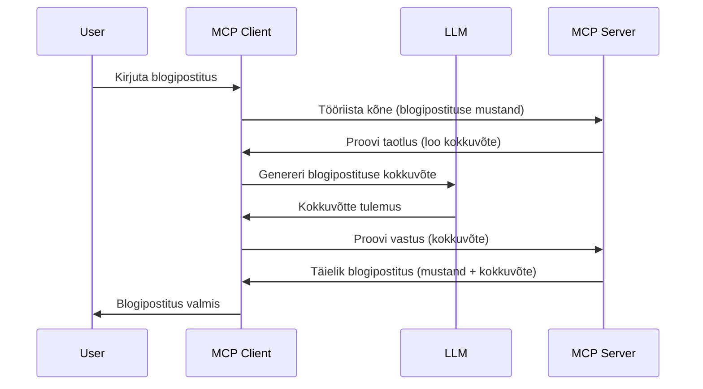

# Proovivõtt – funktsioonide delegeerimine kliendile

Mõnikord on vaja, et MCP klient ja MCP server teeksid koostööd ühise eesmärgi saavutamiseks. Võib esineda olukord, kus server vajab abi kliendis olevalt LLM-ilt. Sellisel juhul tuleb kasutada proovivõttu.

Uurime mõningaid kasutusjuhtumeid ja kuidas ehitada proovivõtule tuginev lahendus.

## Ülevaade

Selles õppetükis keskendume selgitusele, millal ja kus proovivõttu kasutada ning kuidas seda seadistada.

## Õpieesmärgid

Selles peatükis:

- Selgitame, mis on proovivõtt ja millal seda kasutada.
- Näitame, kuidas MCP-s proovivõttu seadistada.
- Anname näiteid proovivõtu kasutamisest.

## Mis on proovivõtt ja miks seda kasutada?

Proovivõtt on arenenud funktsioon, mis toimib järgmiselt:



### Proovivõtu taotlus

Olgu, nüüd on meil ülevaade usutavast stsenaariumist, räägime proovivõtu taotlusest, mille server saadab kliendile tagasi. Selline taotlus võib JSON-RPC formaadis välja näha nii:

```json
{
  "jsonrpc": "2.0",
  "id": 1,
  "method": "sampling/createMessage",
  "params": {
    "messages": [
      {
        "role": "user",
        "content": {
          "type": "text",
          "text": "Create a blog post summary of the following blog post: <BLOG POST>"
        }
      }
    ],
    "modelPreferences": {
      "hints": [
        {
          "name": "claude-3-sonnet"
        }
      ],
      "intelligencePriority": 0.8,
      "speedPriority": 0.5
    },
    "systemPrompt": "You are a helpful assistant.",
    "maxTokens": 100
  }
}
```

Siin on mõned olulised punktid:

- Prompt, content -> text all, on meie üleskutse, mis on juhis LLM-ile kokkuvõtte tegemiseks blogipostituse sisust.

- **modelPreferences**. See sektsioon ongi eelistus, soovitus, millist konfiguratsiooni LLM-iga kasutada. Kasutaja saab valida, kas selliseid soovitusi järgida või neid muuta. Antud juhul on soovitused mudeli, kiiruse ja intelligentsuse prioriteedi kohta.
- **systemPrompt**, see on teie tavaline süsteemi käsk, mis annab LLM-ile iseloomu ja sisaldab juhiseid.
- **maxTokens**, see omadus näitab, mitu sümbolit selle ülesande jaoks soovitatakse kasutada.

### Proovivõtu vastus

See vastus on see, mida MCP klient lõpuks MCP serverile tagasi saadab ning mis on kliendi ja LLM-ilt saadud info tulemus. JSON-RPC kujul võib see välja näha nii:

```json
{
  "jsonrpc": "2.0",
  "id": 1,
  "result": {
    "role": "assistant",
    "content": {
      "type": "text",
      "text": "Here's your abstract <ABSTRACT>"
    },
    "model": "gpt-5",
    "stopReason": "endTurn"
  }
}
```

Pane tähele, et vastus on just nagu palusime – blogipostituse kokkuvõte. Samuti märkame, et kasutatud `model` ei ole see, mida küsisime, vaid "gpt-5" "claude-3-sonnet'i" asemel. Sellega näidatakse, et kasutaja võib muuta oma meelt, mida kasutada, ja et sinu proovivõtu taotlus on soovitus.

Nüüd, kui mõistame põhivoogu ja kasulikku ülesannet „blogipostituse loomine + kokkuvõte“, vaatame, mida tuleb ellu viia selle tööle saamiseks.

### Sõnumi tüübid

Proovivõtu sõnumid ei piira ainult teksti, vaid saadata saab ka pilte ja heli. JSON-RPC näeb seetõttu erinev välja:

**Tekst**

```json
{
  "type": "text",
  "text": "The message content"
}
```

**Pildisisu**

```json
{
  "type": "image",
  "data": "base64-encoded-image-data",
  "mimeType": "image/jpeg"
}
```

**Helisisu**

```json
{
  "type": "audio",
  "data": "base64-encoded-audio-data",
  "mimeType": "audio/wav"
}
```

> MÄRKUS: täpsema info saamiseks proovivõtu kohta vaata [ametlikku dokumentatsiooni](https://modelcontextprotocol.io/specification/2025-11-25/client/sampling)

## Kuidas proovivõttu kliendis seadistada

> Märkus: kui Sa ehitad ainult serverit, siis siin pole palju teha.

Kliendis tuleb määratleda järgmised funktsioonid sellisel kujul:

```json
{
  "capabilities": {
    "sampling": {}
  }
}
```

See võetakse kasutusele, kui valitud klient serveriga ühenduse loob.

## Näide proovivõtu kasutamisest – blogipostituse loomine

Kirjutame üheskoos proovivõtu serveri, milles tuleb teha järgmist:

1. Loo serveris tööriist.
1. Antud tööriist peaks looma proovivõtu taotluse.
1. Tööriist peaks ootama kliendi proovivõtu taotluse vastust.
1. Seejärel peaks tööriist esitama tulemuse.

Vaatame koodi sammhaaval:

### -1- Loo tööriist

**python**

```python
@mcp.tool()
async def create_blog(title: str, content: str, ctx: Context[ServerSession, None]) -> str:
    """Create a blog post and generate a summary"""

```

### -2- Loo proovivõtu taotlus

Lisa oma tööriista järgmine kood:

**python**

```python
post = BlogPost(
        id=len(posts) + 1,
        title=title,
        content=content,
        abstract=""
    )

prompt = f"Create an abstract of the following blog post: title: {title} and draft: {content} "

result = await ctx.session.create_message(
        messages=[
            SamplingMessage(
                role="user",
                content=TextContent(type="text", text=prompt),
            )
        ],
        max_tokens=100,
)

```

### -3- Oota vastust ja tagasta see

**python**

```python
post.abstract = result.content.text

posts.append(post)

# tagasta täielik toode
return json.dumps({
    "id": post.title,
    "abstract": post.abstract
})
```

### -4- Täiskood

**python**

```python
from starlette.applications import Starlette
from starlette.routing import Mount, Host

from mcp.server.fastmcp import Context, FastMCP

from mcp.server.session import ServerSession
from mcp.types import SamplingMessage, TextContent

import json


from uuid import uuid4
from typing import List
from pydantic import BaseModel


mcp = FastMCP("Blog post generator")

# app = FastAPI()

posts = []

class BlogPost(BaseModel):
    id: int
    title: str
    content: str
    abstract: str

posts: List[BlogPost] = []

@mcp.tool()
async def create_blog(title: str, content: str, ctx: Context[ServerSession, None]) -> str:
    """Create a blog post and generate a summary"""

    post = BlogPost(
        id=len(posts) + 1,
        title=title,
        content=content,
        abstract=""
    )

    prompt = f"Create an abstract of the following blog post: title: {title} and draft: {content} "

    result = await ctx.session.create_message(
        messages=[
            SamplingMessage(
                role="user",
                content=TextContent(type="text", text=prompt),
            )
        ],
        max_tokens=100,
    )

    post.abstract = result.content.text

    posts.append(post)

    # tagasta täielik blogipostitus
    return json.dumps({
        "id": post.title,
        "abstract": post.abstract
    })

if __name__ == "__main__":
    print("Starting server...")
    # mcp.run()
    mcp.run(transport="streamable-http")

# käivita rakendus käsuga: python server.py
```

### -5- Testimine Visual Studio Code'is

Selle testimiseks Visual Studio Code'is tee järgmist:

1. Käivita server terminalis
1. Lisa see faili *mcp.json* (ja veendu, et see on käivitatud), näiteks nii:

   ```json
   "servers": {
      "blog-server": {
        "type": "http",
        "url": "http://localhost:8000/mcp"
      }
   }
   ```

1. Sisesta päring:

   ```text
   create a blog post named "Where Python comes from", the content is "Python is actually named after Monty Python Flying Circus"
   ```

1. Luba proovivõtt toimuda. Esimesel korral palutakse sul lisaks aktsepteerida dialoogi, siis näed tavapärast dialoogi tööriista käivitamiseks.

1. Vaata tulemusi. Näed tulemusi nii kenasti kujutatud GitHub Copilot Chat-is kui ka saad ka vaadata toorest JSON-vastust.

**Boonus**. Visual Studio Code tööriistadel on hea tugi proovivõtule. Saad oma serveri proovivõtu ligipääsu seadistada nii:

1. Liigu laienduste sektsiooni.
1. Vali oma paigaldatud serveri hammasrattaikoon "MCP SERVERS - INSTALLED" jaotises.
1. Vali "Configure Model Access", kus saad määrata, milliseid mudeleid GitHub Copilot proovivõtul kasutada saab. Samuti näed hiljutisi proovivõtu taotlusi, valides „Show Sampling requests“.

## Kodutöö

Selles ülesandes ehita pisut teistsugune proovivõtt – proovivõtu integratsioon, mis toetab tootetutvustuse genereerimist. Siin on sinu stsenaarium:

**Stsenaarium**: e-kaubanduse tagatöö töötajal on vaja abi – tootetutvustuste genereerimine võtab liialt palju aega. Seetõttu pead ehitama lahenduse, kus sa saad tööriista "create_product" kutsuda koos argumentidega "title" ja "keywords" ning see peaks tootma täieliku toote koos kliendi LLM-ilt saadava "description" väljaga.

NIPP: kasuta varasematest õppetundidest saadud teadmisi, et ehitada see server ja tööriist proovivõtu taotluse abil.

## Lahendus

[Lahendus](./solution/README.md)

## Peamised tähelepanekud

Proovivõtt on võimas funktsioon, mis lubab serveril delegeerida ülesandeid kliendile, kui selleks on vaja LLM-i abi.

## Mis edasi

- [4. peatükk – Praktiline rakendamine](../../04-PracticalImplementation/README.md)

---

<!-- CO-OP TRANSLATOR DISCLAIMER START -->
**Lahtiütlus**:
See dokument on tõlgitud kasutades AI tõlketeenust [Co-op Translator](https://github.com/Azure/co-op-translator). Kuigi me püüdleme täpsuse poole, palun pange tähele, et automatiseeritud tõlgetes võib esineda vigu või ebatäpsusi. Originaaldokument selle emakeeles tuleks pidada autoriteetseks allikaks. Olulise teabe puhul soovitatakse kasutada professionaalset inimtõlget. Me ei vastuta selle tõlkega seotud eksimustest või valesti mõistmistest.
<!-- CO-OP TRANSLATOR DISCLAIMER END -->