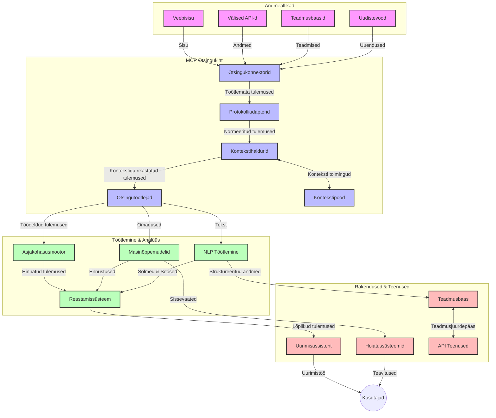
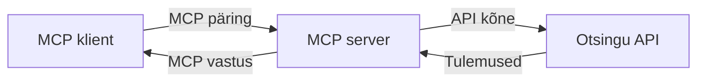
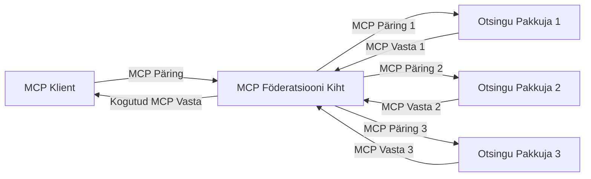
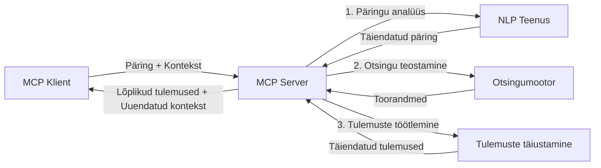

# Mudelikonteksti protokoll reaalajas veebiotsinguks

## Ülevaade

Reaalajas veebiotsing on tänapäeva infoküllases keskkonnas muutunud oluliseks, kus rakendused vajavad viivitamatult juurdepääsu ajakohasele teabele kogu internetis, et pakkuda asjakohaseid ja õigeaegseid vastuseid. Mudelikonteksti protokoll (MCP) tähistab olulist edasiminek otsingu protsesside optimeerimisel, parandades otsingu tõhusust, säilitades konteksti terviklikkuse ja suurendades süsteemi üldist jõudlust.

See moodul uurib, kuidas MCP muudab reaalajas veebiotsingu, pakkudes standardiseeritud lähenemist konteksti haldamiseks AI mudelite, otsingumootorite ja rakenduste vahel.

### Mida te õpite

Selles põhjalikus juhendis saate teada:

- Kuidas MCP loob sujuva silla AI mudelite ja reaalajas veebiotsingu võimekuste vahel
- Arhitektuurimustrid tõhusate ja skaleeritavate otsingulahenduste rakendamiseks MCP abil
- Tehnikad otsingukonteksti säilitamiseks mitme päringu ja interaktsiooni vältel
- Praktilised koodinäited Pythonis ja JavaScriptis erinevate otsingustsenaariumide jaoks
- Võtted MCP-põhiste otsingusüsteemide asjakohasuse, värskuse ja jõudluse tasakaalustamiseks

## Sissejuhatus reaalajas veebiotsingusse

Reaalajas veebiotsing on tehnoloogiline lähenemine, mis võimaldab pidevalt päringuid teha, töödelda ja analüüsida veebiinfo värskendamisel või avaldamisel, võimaldades süsteemidel pakkuda värsket ja asjakohast teavet minimaalse latentsusega. Erinevalt traditsioonilistest otsingusüsteemidest, mis töötlevad indekseeritud andmeid, mis võivad olla tunde või päevi vanad, töötleb reaalajas otsing veebist pärisajandmet ning annab ülevaateid ja teavet, mis kajastab veebisisu praegust seisundit.

### Reaalajas veebiotsingu põhikontseptsioonid:

- **Pidev päringute töötlemine**: päringud töödeldakse pidevalt uuenevate andmeallikate vastu
- **Värskuse prioriteet**: süsteemid on loodud värske info eelistamiseks
- **Asjakohasuse tasakaalustamine**: tasakaalu hoidmine asjakohasuse ja värskuse vahel
- **Skaleeritav arhitektuur**: süsteemid peavad toime tulema muutuvate päringukoormuste ja andmemahtudega
- **Kontekstiline mõistmine**: kasutajakonteksti säilitamine mitme otsingutsükli vältel on oluline tähenduslike tulemuste saamiseks
- **Dünaamiline päringute täpsustamine**: päringute kohandamine konteksti ja varasemate tulemustega
- **Mitme allika integreerimine**: tulemuste kombineerimine mitmest otsinguteenuse pakkujast ja veebiallikast
- **Semantiline mõistmine**: päringute ja sisu töötlemine pigem tähenduse kui pelgalt märksõnade põhjal
- **Reaalajas järjestamine**: tulemusjärjestuste pidev kohandamine uue info saabudes

### Mudelikonteksti protokoll ja reaalajas veebiotsing

Mudelikonteksti protokoll (MCP) lahendab mitmeid kriitilisi väljakutseid reaalajas veebiotsingu keskkondades:

1. **Otsingukonteksti säilitamine**: MCP standardiseerib, kuidas konteksti hoitakse ja jagatakse jaotatud otsingukomponentide vahel, tagades, et AI mudelid ja töötlemissõlmed pääsevad ligi asjakohasele päringuajaloo ja kasutajasoovitustele.

2. **Tõhus päringute haldamine**: pakkudes struktureeritud mehhanisme konteksti edastamiseks, vähendab MCP korduvat konteksti saatmist igas otsingutsüklis.

3. **Ühilduvus**: MCP loob ühise keele konteksti jagamiseks erinevate otsingutehnoloogiate ja AI mudelite vahel, võimaldades paindlikumaid ja laiendatavaid arhitektuure.

4. **Otsingule optimeeritud kontekst**: MCP rakendused saavad prioriseerida, millised konteksti elemendid on tõhusaks otsinguks kõige asjakohasemad, optimeerides nii jõudlust kui ka täpsust.

5. **Kohanduv otsingutöötlus**: MCP kaudu korraldatud konteksti haldamisega saavad otsingusüsteemid dünaamiliselt kohandada töötlemist vastavalt kasutaja vajaduste ja info arengule.

Kaasaegsetes rakendustes alates uudistekoondajatest kuni uurimisabilisteni võimaldab MCP integratsioon veebiotsingu tehnoloogiatega luua intelligentsemaid, kontekstiteadlikumaid otsinguid, mis pakuvad järjest asjakohasemaid tulemusi kasutaja jätkuvate interaktsioonide põhjal.

## Õpieesmärgid

Selle õppetüki lõpuks oskate:

- Mõista reaalajas veebiotsingu põhimõtteid ja selle väljakutseid kaasaegsetes rakendustes
- Selgitada, kuidas Mudelikonteksti protokoll (MCP) täiustab reaalajas veebiotsingu võimekusi
- Rakendada MCP-põhiseid otsingulahendusi populaarses raamistikus ja API-de abil
- Kujundada ja juurutada skaleeritavaid ning kõrge jõudlusega otsinguarhitektuure MCP abil
- Kasutada MCP kontseptsioone erinevates kasutusjuhtumites, sealhulgas semantilises otsingus, uurimisabilistes ja AI-toega sirvimises
- Hinnata MCP-põhiste otsingutehnoloogiate tekkivaid trende ja tuleviku uuendusi
- Arendada kontekstiteadlikke otsingusüsteeme, mis õpivad kasutaja interaktsioonidest
- Integreerida veebiotsingu võimekusi AI abilistesse, kasutades standardiseeritud MCP protokolle
- Luua mitmeastmelisi otsingutorustikke, mis järk-järgult täpsustavad tulemusi konteksti põhjal
- Optimeerida otsingu jõudlust hoides samal ajal terviklikku kontekstitunnetust

### Määratlus ja tähtsus

Reaalajas veebiotsing hõlmab veebiinfo pidevat päringute tegemist, hankimist ja edastamist minimaalse viivitusega. Erinevalt traditsioonilistest otsingumootoritest, mis perioodiliselt veebi indekseerivad ja skaneerivad, on reaalajas otsing suunatud info esiletoomisele kohe, kui see on kättesaadav, võimaldades kohest juurdepääsu kõige ajakohasemale sisule.

Peamised reaalajas veebiotsingu omadused on:

- **Värskus**: viimasel ajal lisatud või uuendatud sisu prioriteetimine
- **Pidev töötlemine**: info pidev jälgimine uudsuse suhtes
- **Päringute kohandamine**: päringute täpsustamine konteksti ja tagasiside põhjal
- **Viivitamatu edastamine**: kiire otsingutulemuste etteanded
- **Konteksti säilitamine**: eelnevate päringute põhjal parem asjakohasus

### Väljakutsed traditsioonilises veebiotsingus

Traditsioonilises veebiotsingus esinevad mitmed piirangud, kui need rakendada reaalajas stsenaariumitesse:

1. **Konteksti killustumine**: raske säilitada otsingukonteksti mitme päringu vältel
2. **Info värskus**: raskused pääseda ligi ja eelistada kõige värskemaid andmeid
3. **Integreerimisraskused**: ühilduvuse probleemid otsingusüsteemide ja rakenduste vahel
4. **Latentsusprobleemid**: tasakaalustada põhjalikku otsingut ja vastuste kiirust
5. **Asjakohasuse häälestamine**: täpsuse ja asjakohasuse tagamine samal ajal kui eelistatakse värskust

## MCP mõistmine otsingus

### Mis on MCP otsingukontekstis?

Mudelikonteksti protokoll (MCP) on standardiseeritud suhtlusprotokoll, mis lihtsustab tõhusat suhtlust AI mudelite ja rakenduste vahel. Reaalajas veebiotsingu kontekstis pakub MCP raamistikku:

- Otsingukonteksti säilitamiseks kogu päringute jada vältel
- Otsingupäringute ja tulemustele standardiseeritud vormingu kehtestamiseks
- Otsinguparameetrite ja tulemuste edastuse optimeerimiseks
- Mudeli ja otsingumootori vahelise suhtluse parandamiseks

### Põhikomponendid ja arhitektuur

MCP arhitektuur, mis on mõeldud reaalajas veebiotsinguks, koosneb mitmest võtmekomponendist:

1. **Päringukonteksti haldurid**: haldavad ja säilitavad otsingukonteksti mitme päringu vältel
2. **Otsingutöötlajad**: töötlevad saabuvad otsingupäringud kontekstitundlikult
3. **Protokolli adapterid**: teisendavad erinevate otsingu API-de kutsed, säilitades konteksti
4. **Konteksti andmebaas**: otsinguajaloo ja eelistuste tõhus salvestamine ja hankimine
5. **Otsingupistikud**: ühendused erinevate otsingumootorite ja veebipõhiste API-dega



### Kuidas MCP parandab reaalajas veebiotsingut

MCP lahendab traditsioonilisi veebiotsingu väljakutseid järgmiste vahenditega:

- **Kontekstiline järjepidevus**: säilitab seosed päringute vahel kogu otsingusessiooni vältel
- **Optimeeritud ülekandemehhanism**: vähendab otsinguparameetrite mitmekordset saatmist nutika konteksti haldamisega
- **Standardiseeritud liidesed**: tagab ühtsed API-d otsingukomponentidele
- **Vähenenud latentsus**: minimeerib töötlemiskulusid efektiivse kontekstitöötlusega
- **Paranenud asjakohasus**: parandab otsingutulemuste täpsust, hoides kasutaja kavatsusi mitmes päringus

## Integratsioon ja rakendamine

Reaalajas veebiotsingusüsteemid nõuavad hoolikat arhitektuuri planeerimist ja rakendust, et hoida nii jõudlust kui ka konteksti terviklikkust. Mudelikonteksti protokoll pakub standardiseeritud lähenemise AI mudelite ja otsingutehnoloogiate ühendamiseks, võimaldades luua keerukamaid ja kontekstiteadlikumaid otsingutorustikke.

### MCP integreerimise ülevaade otsinguarhitektuuridesse

MCP rakendamine reaalajas veebiotsingus võtab arvesse järgmisi aspekte:

1. **Otsingukonteksti serialiseerimine**: MCP pakub tõhusaid mehhanisme kontekstitalituse kodeerimiseks otsingupäringutes, tagades, et olulised kontekstiandmed järgivad päringut kogu töötlemise vältel. Selle hulka kuuluvad standardiseeritud serialiseerimisformaatid otsinguga seotud metaandmetele.

2. **Seisundipõhine otsingutöötlus**: MCP võimaldab targemat seisundipõhist töötlemist, säilitades ühtse kontekstitalituse otsingutsüklite vahel. See on eriti oluline mitmeastmelistes otsingutorustikes, kus konteksti täpsustamine parandab tulemusi.

3. **Päringu laiendamine ja täpsustamine**: MCP rakendused otsingusüsteemides võimaldavad keerukaid päringu laiendamise ja täpsustamise mehhanisme kogutud konteksti põhjal, tuues otsingusessiooni edenedes järjest asjakohasemaid tulemusi.

4. **Tulemuste vahemällu salvestamine ja prioriseerimine**: konteksti käsitlemise standardiseerimisega aitab MCP hallata vahemällu salvestamist ja prioriseerimist, võimaldades komponentidel kohanduda muutuvate otsingukontekstidega.

5. **Otsingute föderatsioon ja agregatsioon**: MCP lihtsustab keerukamat otsingute föderatsiooni mitme taustasüsteemi vahel, pakkudes struktureeritud konteksti esitusi, mis võimaldavad palju tähenduslikumat suurettevõtteid erinevatest allikatest.

MCP rakendamine erinevates otsingutehnoloogiates loob ühtse lähenemise konteksti haldamisele, vähendades erikoodi vajadust ja parandades süsteemi võimet hoida tähendusrikast konteksti otsingupäringute arengu vältel.

### MCP erinevates veebiotsingu rakendustes

Järgnevad näited järgivad kehtivat MCP spetsifikatsiooni, mis põhineb JSON-RPC protokollil koos erinevate transpordimehhanismidega. Kood demonstreerib kohandatud otsingute integratsioonide loomist, säilitades täieliku ühilduvuse MCP protokolliga.

<details>
<summary>Python'i rakendus üldiseks otsinguks</summary>

```python
import asyncio
import json
import aiohttp
from typing import Dict, Any, Optional, List
from contextlib import asynccontextmanager
from collections.abc import AsyncIterator

# Impordi standard MCP teegid
from mcp.client.session import ClientSession
from mcp.client.streamable_http import streamablehttp_client
from mcp.types import TextContent, CreateMessageRequestParams, CreateMessageResult
from mcp.server.fastmcp import FastMCP

# Loo FastMCP server veebipäringute jaoks
search_server = FastMCP("WebSearch")

# Klass veebipäringute haldamiseks
class WebSearchHandler:
    def __init__(self, api_endpoint: str, api_key: str):
        self.api_endpoint = api_endpoint
        self.api_key = api_key
        self.session = None
        
    async def initialize(self):
        """Initialize the HTTP session"""
        self.session = aiohttp.ClientSession(
            headers={"Authorization": f"Bearer {self.api_key}"}
        )
    
    async def close(self):
        """Close the HTTP session"""
        if self.session:
            await self.session.close()
            
    async def perform_search(self, query: str, max_results: int = 5, 
                           include_domains: List[str] = None, 
                           exclude_domains: List[str] = None,
                           time_period: str = "any") -> Dict[str, Any]:
        """Perform web search using the search API"""
        # Koosta otsingupäringu parameetrid
        search_params = {
            "q": query,
            "limit": max_results,
            "time": time_period
        }
        
        if include_domains:
            search_params["site"] = ",".join(include_domains)
            
        if exclude_domains:
            search_params["exclude_site"] = ",".join(exclude_domains)
        
        # Täida otsingupäring
        try:
            async with self.session.get(
                self.api_endpoint,
                params=search_params
            ) as response:
                if response.status != 200:
                    error_text = await response.text()
                    raise Exception(f"Search API error: {response.status} - {error_text}")
                
                search_data = await response.json()
                
                # Muuda API-spetsiifiline vastus standardseks vorminguks
                results = []
                for item in search_data.get("results", []):
                    results.append({
                        "title": item.get("title", ""),
                        "url": item.get("url", ""),
                        "snippet": item.get("snippet", ""),
                        "date": item.get("published_date", ""),
                        "source": item.get("source", "")
                    })
                
                return {
                    "query": query,
                    "totalResults": len(results),
                    "results": results
                }
        except Exception as e:
            print(f"Search API request error: {e}")
            raise

# Algata otsingu haldaja
search_handler = WebSearchHandler(
    api_endpoint="https://api.search-service.example/search",
    api_key="your-api-key-here"
)

# Sea lifespan otsingu haldaja haldamiseks
@asyncio.asynccontextmanager
async def app_lifespan(server: FastMCP):
    """Manage application lifecycle"""
    await search_handler.initialize()
    try:
        yield {"search_handler": search_handler}
    finally:
        await search_handler.close()

# Sea serveri lifespan
search_server = FastMCP("WebSearch", lifespan=app_lifespan)

# Registreeri veebipäringu tööriist
@search_server.tool()
async def web_search(query: str, max_results: int = 5, 
                   include_domains: List[str] = None,
                   exclude_domains: List[str] = None,
                   time_period: str = "any") -> Dict[str, Any]:
    """
    Search the web for information
    
    Args:
        query: The search query
        max_results: Maximum number of results to return (default: 5)
        include_domains: List of domains to include in search results
        exclude_domains: List of domains to exclude from search results
        time_period: Time period for results ("day", "week", "month", "any")
        
    Returns:
        Dictionary containing search results
    """
    ctx = search_server.get_context()
    search_handler = ctx.request_context.lifespan_context["search_handler"]
    
    results = await search_handler.perform_search(
        query=query,
        max_results=max_results,
        include_domains=include_domains,
        exclude_domains=exclude_domains,
        time_period=time_period
    )
    
    return results

# Kliendi näidis kasutusest
async def client_example():
    # Ühendu otsinguserveriga Streamable HTTP transpordi kaudu
    async with streamablehttp_client("http://localhost:8000/mcp") as (read, write, _):
        async with ClientSession(read, write) as session:
            # Algata ühendus
            await session.initialize()
            
            # Kutsu veebipäringu tööriista
            search_results = await session.call_tool(
                "web_search", 
                {
                    "query": "latest developments in AI and Model Context Protocol",
                    "max_results": 5,
                    "time_period": "day",
                    "include_domains": ["github.com", "microsoft.com"]
                }
            )
            
            print(f"Search results: {search_results}")

# Serveri täitmise näidis
if __name__ == "__main__":
    # Käivita server Streamable HTTP transpordiga
    search_server.run(transport="streamable-http")
```
</details> 

<details>
<summary>JavaScript'i rakendus brauseripõhiseks otsinguks</summary>

```javascript
// MCP serveri rakendus veebipäringuks
import { McpServer, ResourceTemplate } from '@modelcontextprotocol/sdk/server/mcp.js';
import { StreamableHTTPServerTransport } from '@modelcontextprotocol/sdk/server/streamableHttp.js';
import { z } from 'zod';

// Loo MCP server veebipäringuks
const searchServer = new McpServer({
    name: "BrowserSearch",
    description: "A server that provides web search capabilities"
});

// Otsinguteenuse klass
class SearchService {
    constructor(searchApiUrl, apiKey) {
        this.searchApiUrl = searchApiUrl;
        this.apiKey = apiKey;
    }

    async performSearch(parameters) {
        const {
            query = '',
            maxResults = 5,
            includeDomains = [],
            excludeDomains = [],
            timePeriod = 'any'
        } = parameters;
        
        // Koosta otsingu URL koos parameetritega
        const url = new URL(this.searchApiUrl);
        url.searchParams.append('q', query);
        url.searchParams.append('limit', maxResults);
        url.searchParams.append('time', timePeriod);
        
        if (includeDomains.length > 0) {
            url.searchParams.append('site', includeDomains.join(','));
        }
        
        if (excludeDomains.length > 0) {
            url.searchParams.append('exclude_site', excludeDomains.join(','));
        }
        
        try {
            const response = await fetch(url.toString(), {
                method: 'GET',
                headers: {
                    'Authorization': `Bearer ${this.apiKey}`,
                    'Content-Type': 'application/json'
                }
            });
            
            if (!response.ok) {
                const errorText = await response.text();
                throw new Error(`Search API error: ${response.status} - ${errorText}`);
            }
            
            const searchData = await response.json();
            
            // Muuda API-spetsiifiline vastus standardseks vorminguks
            const results = searchData.results?.map(item => ({
                title: item.title || '',
                url: item.url || '',
                snippet: item.snippet || '',
                date: item.published_date || '',
                source: item.source || ''
            })) || [];
            
            return {
                query,
                totalResults: results.length,
                results
            };
        } catch (error) {
            console.error('Search API request error:', error);
            throw error;
        }
    }
}

// Algata otsinguteenuse töö
const searchService = new SearchService(
    'https://api.search-service.example/search',
    'your-api-key-here'
);

// Seadista serveri konteksti pakkuja
searchServer.setContextProvider(() => {
    return {
        searchService
    };
});

// Registreeri veebipäringu tööriist
searchServer.tool({
    name: 'web_search',
    description: 'Search the web for information',
    parameters: {
        type: 'object',
        properties: {
            query: {
                type: 'string',
                description: 'The search query'
            },
            maxResults: {
                type: 'integer',
                description: 'Maximum number of results to return',
                default: 5
            },
            includeDomains: {
                type: 'array',
                items: { type: 'string' },
                description: 'List of domains to include in search results'
            },
            excludeDomains: {
                type: 'array',
                items: { type: 'string' },
                description: 'List of domains to exclude from search results'
            },
            timePeriod: {
                type: 'string',
                description: 'Time period for results',
                enum: ['day', 'week', 'month', 'any'],
                default: 'any'
            }
        },
        required: ['query']
    },
    handler: async (params, context) => {
        const { searchService } = context;
        return await searchService.performSearch(params);
    }
});

// Näidis kliendikood ühendamiseks otsinguserveriga
import { Client } from '@modelcontextprotocol/sdk/client/index.js';
import { StreamableHTTPClientTransport } from '@modelcontextprotocol/sdk/client/streamableHttp.js';

async function connectToSearchServer() {
    // Ühenda otsinguserveriga
    const transport = new StreamableHTTPClientTransport(
        new URL('http://localhost:8000/mcp')
    );
    
    const client = new Client({
        name: 'search-client',
        version: '1.0.0'
    });
    
    await client.connect(transport);
    
    // Käivita otsingutööriist
    const searchResults = await client.callTool({
        name: 'web_search',
        arguments: {
            query: 'Model Context Protocol implementation examples',
            maxResults: 10,
            timePeriod: 'week',
            includeDomains: ['github.com', 'docs.microsoft.com']
        }
    });
    
    console.log('Search results:', searchResults);
    
    // Puhasta
    await client.disconnect();
}

// Käivita server
const transport = new StreamableHTTPServerTransport();
await searchServer.connect(transport);
console.log('Search server running at http://localhost:8000/mcp');

// Eraldi protsessis või pärast serveri käivitamist
// connectToSearchServer().catch(console.error);
```
</details> 

## Koodinäidiste vastutusest loobumine

> **Oluline märkus**: Järgnevad koodinäited demonstreerivad Mudelikonteksti protokolli (MCP) integreerimist veebiotsingutega. Kuigi need järgivad ametlike MCP SDK-de mustreid ja struktuure, on nad lihtsustatud hariduslikel eesmärkidel.
> 
> Need näited sisaldavad:
> 
> 1. **Python'i rakendust**: FastMCP serveri rakendust, mis pakub veebiotsingutööriista ja ühendub välise otsingu API-ga. Näide demonstreerib õigesti ajastatud ressursihaldust, kontekstitöötlust ja tööriista rakendamist vastavalt ametlikele MCP Python SDK mustritele ([link](https://github.com/modelcontextprotocol/python-sdk)). Server kasutab soovitatud Streamable HTTP transporti, mis on vanemat SSE transporti asendanud tootmiskeskkonda juurutamiseks.
> 
> 2. **JavaScript'i rakendust**: TypeScript/JavaScript rakendust, mis baseerub FastMCP mustril ametliku MCP TypeScript SDK-st ([link](https://github.com/modelcontextprotocol/typescript-sdk)), et luua otsinguserver koos korrektselt määratletud tööriistade ja kliendühendustega. Järgitakse uusimaid soovitatud seansihaldus- ja kontekstisäilitamismustreid.
> 
> Need näited vajaksid täiendavat veahaldust, autentimist ja konkreetset API integratsioonikoodi tootmises kasutamiseks. Näidatud otsingu API lõpp-punktid (`https://api.search-service.example/search`) on kohatäitjad ja tuleks asendada tegelike otsinguteenuse lõpp-punktidega.
> 
> Täielike rakenduse üksikasjade ja kõige uuemate lähenemiste kohta vaadake ametlikku MCP spetsifikatsiooni ja SDK dokumentatsiooni ([link](https://spec.modelcontextprotocol.io/)).

## Põhikontseptsioonid

### Mudelikonteksti protokolli (MCP) raamistik

MCP põhiteguriks on standardiseeritud viis AI mudelite, rakenduste ja teenuste vahel konteksti vahetamiseks. Reaalajas veebiotsingus on see raamistik vältimatult vajalik koherentsete, mitmekäiguliste otsingukogemuste loomiseks. Peamised komponendid on:

1. **Kliendi-serveri arhitektuur**: MCP seab selge piiri otsinguklientide (pärijate) ja otsinguserverite (pakkujate) vahel, võimaldades paindlikke juurutusmudeleid.

2. **JSON-RPC kommunikatsioon**: protokoll kasutab sõnumivahetuseks JSON-RPC-t, muutes selle veebitehnoloogiatega ühilduvaks ja kergesti rakendatavaks platvormidel.

3. **Konteksti haldamine**: MCP määratleb struktureeritud meetodid otsingukonteksti hoidmiseks, uuendamiseks ja kasutamiseks mitmete interaktsioonide vältel.

4. **Tööriistade määratlused**: otsinguvõimalused eksponeeritakse standardiseeritud tööriistadena selgelt määratletud parameetrite ja tagastusväärtustega.

5. **Andmestriimi tugi**: protokoll toetab tulemuste voogedastust, mis on hädavajalik reaalajas otsingus, kus tulemused võivad järk-järgult saabuda.

### Veebiotsingu integratsioonimustrid

MCP ühendamisel veebiotsinguga ilmnevad mitmed mustrid:

#### 1. Otsese otsinguteenuse pakkuja integratsioon



Selles mustris suhtleb MCP server otseselt ühe või mitme otsingu API-ga, teisendades MCP päringud API-spetsiifilisteks kutsedeks ja vormindades tulemused MCP vastusteks.

#### 2. Konteksti säilitav föderatiivne otsing



See muster jaotab päringud mitme MCP ühilduva otsinguteenuse pakkuja vahel, millest igaüks võib spetsialiseeruda erinevatele sisutüüpidele või otsinguvõimalustele, säilitades samal ajal ühtse konteksti.

#### 3. Kontekstiga täiustatud otsingukett



Selles mustris jagatakse otsinguprotsess mitmeks etapiks, kus kontekst rikastub iga sammuga, tulemuseks järjest asjakohasemad otsingutulemused.

### Otsingukonteksti komponendid

MCP-põhises veebiotsingus sisaldab kontekst tavaliselt:

- **Päringu ajalugu**: sessiooni eelmised otsingupäringud
- **Kasutaja eelistused**: keel, piirkond, turvalise otsingu seaded
- **Interaktsiooni ajalugu**: milliseid tulemusi klikiti, tulemuste vaatamise aeg
- **Otsinguparameetrid**: filtrid, sortimisjärjekorrad ja muud otsingu modifikaatorid
- **Domeeniteadmised**: otsinguga seotud erialane kontekst
- **Ajutine kontekst**: aja põhised asjakohasuse tegurid
- **Allika eelistused**: usaldusväärsed või eelistatud infoallikad

## Kasutusjuhtumid ja rakendused

### Uurimistöö ja info kogumine

MCP täiustab uurimisprotsesse järgmiste võimalustega:

- Uurimiskonteksti säilitamine otsingssessiioonide vahel
- Keerukamate ja kontekstipõhiste päringute võimaldamine
- Mitme allika otsinguföderatsiooni toetamine
- Teadmiste väljavõtte hõlbustamine otsingutulemustest

### Reaalajas uudiste ja trendide jälgimine

MCP-ga toidetud otsing pakub uudiste jälgimisel eeliseid:

- Peaaegu reaalajas uute uudislugude avastamine
- Asjakohase info kontekstipõhine filtreerimine
- Teemade ja üksuste jälgimine mitme allika ulatuses
- Personaliseeritud uudiseteavitused kasutajakonteksti põhjal

### AI-toega sirvimine ja uurimistöö

MCP loob uusi võimalusi AI-toega sirvimiseks:

- Kontekstuaalsed otsingusoovitused vastavalt praegusele sirvimistegevusele
- Sujuv veebiotsingu integratsioon LLM-jõuliste abilistega
- Mitmekäiguline otsingu täpsustamine konteksti säilitades
- Täiustatud faktikontroll ja info kinnitamine

## Tuleviku trendid ja uuendused

### MCP areng veebiotsingus

Edaspidi on oodata MCP arengut järgmiste valdkondade ettevõtmisel:
- **Multimodaalne otsing**: Teksti, pildi, heli ja video otsingu integreerimine säilitades konteksti
- **Detsentraliseeritud otsing**: Toetades hajutatud ja föderatiivseid otsinguekosüsteeme
- **Otsingu privaatsus**: Kontekstitundlikud privaatsust säilitavad otsingumehhanismid
- **Päringu mõistmine**: Loodusliku keele otsingupäringute põhjalik semantiline analüüs

### Võimalikud tehnika arengud

Tuleviku MCP otsingut kujundavad tekkivad tehnoloogiad:

1. **Neuraalsed otsingu arhitektuurid**: MCP-le optimeeritud manustuspõhised otsingusüsteemid
2. **Isikupärastatud otsingu kontekst**: Individuaalsete kasutajate otsimismustrite õppimine aja jooksul
3. **Teadmusgraafiku integreerimine**: Kontekstiotsing domeenipõhiste teadmusgraafikute toel
4. **Ristmodaalne kontekst**: Konteksti säilitamine erinevate otsingumodaliteetide vahel

## Praktilised harjutused

### Harjutus 1: Põhjaliku MCP otsingu torujuhtme seadistamine

Selles harjutuses õpid:
- Põhilise MCP otsingukeskkonna konfigureerimist
- Konteksti töötlejate rakendamist veebipõhiseks otsinguks
- Testima ja valideerima konteksti säilitamist otsingu iteratsioonide vahel

### Harjutus 2: Uurimisassistendi loomine MCP otsinguga

Loo täielik rakendus, mis:
- Töötleb looduspäraseid uurimisküsimusi
- Teostab kontekstitundlikke veebiotsinguid
- Sünthetiseerib infot mitmest allikast
- Esitab organiseeritud uurimistulemused

### Harjutus 3: Mitme allika otsingu föderatsiooni rakendamine MCP-ga

Edelda harjutus, mis käsitleb:
- Kontekstitundlikku päringu suunamist mitmele otsingumootorile
- Tulemuste järjestamist ja kogumist
- Otsingutulemuste kontekstuaalset duplikaatide eemaldamist
- Allikaspetsiifilise metainfo käsitlemist

## Täiendavad ressursid

- [Model Context Protocol Specification](https://spec.modelcontextprotocol.io/) - MCP ametlik spetsifikatsioon ja detailne protokoli dokumentatsioon
- [Model Context Protocol Documentation](https://modelcontextprotocol.io/) - Detailsete juhendite ja implementeerimisjuhendite kogu
- [MCP Python SDK](https://github.com/modelcontextprotocol/python-sdk) - MCP protokolli ametlik Python'i rakendus
- [MCP TypeScript SDK](https://github.com/modelcontextprotocol/typescript-sdk) - MCP protokolli ametlik TypeScript'i rakendus
- [MCP Reference Servers](https://github.com/modelcontextprotocol/servers) - MCP serverite referentsrakendused
- [Bing Web Search API Documentation](https://learn.microsoft.com/en-us/bing/search-apis/bing-web-search/overview) - Microsofti veebipõhise otsingu API
- [Google Custom Search JSON API](https://developers.google.com/custom-search/v1/overview) - Google programmeeritav otsingumootor
- [SerpAPI Documentation](https://serpapi.com/search-api) - Otsingumootori tulemuste lehe API
- [Meilisearch Documentation](https://www.meilisearch.com/docs) - Avatud lähtekoodiga otsingumootor
- [Elasticsearch Documentation](https://www.elastic.co/guide/index.html) - Hajutatud otsingu ja analüüsi mootor
- [LangChain Documentation](https://python.langchain.com/docs/get_started/introduction) - Rakenduste ehitamine LLM-idega

## Õpitulemused

Selle mooduli läbimisel saad:

- Mõista reaalajas veebiotsingu põhimõtteid ja väljakutseid
- Selgitada, kuidas Model Context Protocol (MCP) parandab reaalajas veebiotsinguvõimekust
- Rakendada MCP-põhiseid otsingulahendusi populaarsete raamistikude ja API-de abil
- Kujundada ja kasutusele võtta skaleeritavaid, kõrge jõudlusega otsingu arhitektuure MCP-ga
- Rakendada MCP kontseptsioone erinevates kasutusstsenaariumides, sealhulgas semantiline otsing, uurimisabi ja tehisintellektiga täiendatud sirvimine
- Hinnata MCP-põhise otsingutehnoloogia kasvavaid trende ja tulevikulahendusi

### Usaldus ja turvalisuse kaalutlused

MCP-põhiste veebiotsingu lahenduste rakendamisel pea meeles järgmisi olulisi põhimõtteid MCP spetsifikatsioonist:

1. **Kasutaja nõusolek ja kontroll**: Kasutajad peavad andma selgesõnalise nõusoleku ja mõistma kõiki andmetele ligipääsu ja toiminguid. See on eriti tähtis veebiotsingu rakenduste puhul, mis võivad pääseda ligi välistele andmeallikatele.

2. **Andmete privaatsus**: Tagada otsingupäringute ja -tulemuste nõuetekohane käsitlemine, eriti juhul, kui need sisaldavad tundlikku teavet. Rakenda sobivaid juurdepääsukontrolle kasutajaandmete kaitsmiseks.

3. **Tööriistade turvalisus**: Rakenda otsingutööriistade korral korrektset volitamist ja valideerimist, kuna need võivad esindada turvariske suvalise koodi täitmise kaudu. Tööriistade käitumisikirjeldused tuleks pidada mittetruustatuks, kui neid ei ole saadud usaldusväärsest serverist.

4. **Selge dokumentatsioon**: Paku selget dokumentatsiooni MCP-põhiste otsingulahenduste võimete, piirangute ja turvaküsimuste kohta, järgides MCP spetsifikatsiooni rakendusjuhiseid.

5. **Robustsed nõusolekute protsessid**: Ehita vastupidavad nõusoleku ja volituse protsessid, mis selgelt kirjeldavad iga tööriista ülesandeid enne selle kasutamise lubamist, eriti tööriistade puhul, mis suhtlevad väliste veebiallikatega.

Põhjalikumaks info ja MCP turva ning usaldusküsimuste kohta vt [ametlik dokumentatsioon](https://modelcontextprotocol.io/specification/2025-11-25/basic/security_best_practices).

## Mis järgmiseks

- [5.12 Entra ID autentimine Model Context Protocol serveritele](../mcp-security-entra/README.md)

---

<!-- CO-OP TRANSLATOR DISCLAIMER START -->
**Lahtiütlus**:
See dokument on tõlgitud kasutades AI tõlketeenust [Co-op Translator](https://github.com/Azure/co-op-translator). Kuigi me püüdleme täpsuse poole, palun pange tähele, et automatiseeritud tõlgetes võib esineda vigu või ebatäpsusi. Originaaldokument selle emakeeles tuleks pidada autoriteetseks allikaks. Olulise teabe puhul soovitatakse kasutada professionaalset inimtõlget. Me ei vastuta selle tõlkega seotud eksimustest või valesti mõistmistest.
<!-- CO-OP TRANSLATOR DISCLAIMER END -->