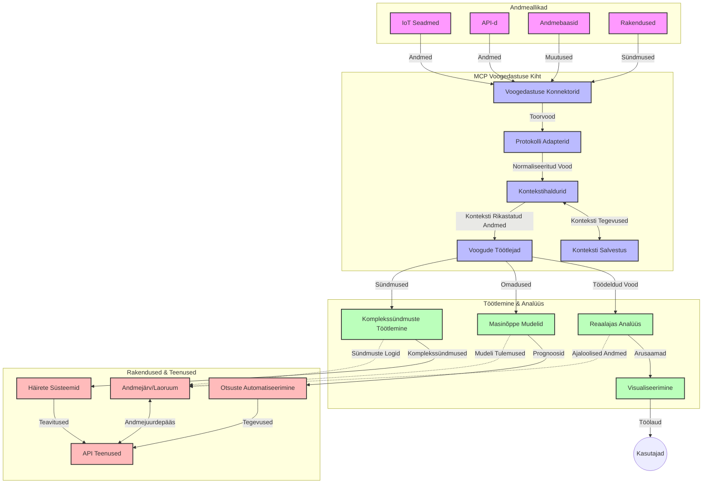

# Mudelikonteksti protokoll reaalajas andmevoogude jaoks

## Ülevaade

Reaalajas andmevoog on tänapäeva andmepõhises maailmas muutunud oluliseks, kus ettevõtted ja rakendused vajavad teabele kohest juurdepääsu, et teha õigeaegseid otsuseid. Mudelikonteksti protokoll (MCP) tähistab olulist arengut nende reaalajas voogedastuse protsesside optimeerimisel, parandades andmetöötluse tõhusust, säilitades konteksti terviklikkust ning parandades kogu süsteemi jõudlust.

Selles moodulis uuritakse, kuidas MCP muudab reaalajas andmevoogu, pakkudes standardiseeritud lähenemist konteksti haldamisele AI mudelite, voogedastuse platvormide ja rakenduste vahel.

## Sissejuhatus reaalajas andmevoogudesse

Reaalajas andmevoog on tehnoloogiline paradigma, mis võimaldab jätkuvat andmete ülekannet, töötlemist ja analüüsi kohe, kui need tekivad, võimaldades süsteemidel reageerida uuele teabele viivitamata. Erinevalt traditsioonilisest partii töötlemisest, mis toimib staatiliste andmekogumitega, töödeldakse voogedastuses andmeid liikumisel, pakkudes teadmisi ja tegevusi minimaalse latentsusega.

### Reaalajas andmevoogude põhikontseptsioonid:

- **Jätkuv andmevoog**: Andmeid töödeldakse kui pidevat, lõputut sündmuste või kirjete voogu.
- **Madal latentsusaeg**: Süsteemid on disainitud minimeerima aega andmete tekkimisest töötlemiseni.
- **Skaalautuvus**: Voogedastuse arhitektuurid peavad suutma hallata muutuvas mahus ja kiirusega andmeid.
- **Rikke taluvus**: Süsteemid peavad olema vastupidavad tõrgetele, tagamaks katkematu andmevoo.
- **Olekuvoogne töötlemine**: Konteksti säilitamine sündmuste vahel on mõtestatud analüüsi jaoks hädavajalik.

### Mudelikonteksti protokoll ja reaalajas voog

Mudelikonteksti protokoll (MCP) lahendab mitmeid kriitilisi väljakutseid reaalaja voogedastuskeskkondades:

1. **Kontekstuaalne järjepidevus**: MCP standardiseerib, kuidas konteksti säilitatakse hajutatud voogu elementide vahel, tagades, et AI mudelid ja töötlemissõlmed pääsevad ligi asjakohasele ajaloolisele ja keskkonnakontekstile.

2. **Tõhus oleku haldamine**: MCP pakub struktureeritud mehhanisme konteksti edastamiseks, vähendades olekuhalduse koormust voogudega töötlemises.

3. **Interoperatiivsuse tagamine**: MCP loob ühise keele konteksti jagamiseks erinevate voogedastustehnoloogiate ja AI mudelite vahel, võimaldades paindlikumaid ja laiendatavamaid arhitektuure.

4. **Voogedastuseks optimeeritud kontekst**: MCP rakendused võivad prioriseerida, millised konteksti elemendid on reaalajas otsuste tegemiseks kõige olulisemad, optimeerides nii jõudlust kui täpsust.

5. **Adaptiivne töötlemine**: MCP kaudu korraldatud õige konteksti haldusega võivad voogedastussüsteemid dünaamiliselt kohandada töötlemist, tuginedes andmete muutuvatele tingimustele ja mustritele.

Moodsates rakendustes alates IoT sensorivõrkudest kuni finantsturgude platvormideni võimaldab MCP integreerimine voogedastusega nutikamat, kontekstitundlikku töötlemist, mis suudab sobivalt reageerida keerulistele, muutuvatele olukordadele reaalajas.

## Õpieesmärgid

Selle õppetüki lõpuks suudad:

- Mõista reaalajas andmevoo põhialuseid ja väljakutseid
- Selgitada, kuidas Mudelikonteksti protokoll (MCP) täiustab reaalajas andmevoogu
- Rakendada MCP-l põhinevaid voogedastuse lahendusi populaarsete raamistikudega nagu Kafka ja Pulsar
- Kujundada ja juurutada rikkekindlaid, kõrge jõudlusega voogedastuse arhitektuure kasutades MCP-d
- Rakendada MCP kontseptsioone IoT, finantstehingute ja AI-põhiste analüütika juhtumites
- Hinnata MCP-l põhinevate voogedastustehnoloogiate tekkivaid trende ja tulevasi uuendusi

### Määratlus ja olulisus

Reaalajas andmevoog hõlmab andmete pidevat loomist, töötlemist ja edastamist minimaalse latentsusega. Erinevalt partii töötlemisest, kus andmeid kogutakse ja töödeldakse grupiti, töödeldakse voogu tulevaid andmeid sammhaaval kohe saabumisel, võimaldades koheseid teadmisi ja tegevusi.

Reaalajas andmevoo põhiomadused on:

- **Madal latentsus**: Andmete töötlemine ja analüüs millisekundite kuni sekundite jooksul
- **Jätkuv voog**: Katkematu andmevool erinevatest allikatest
- **Kohene töötlemine**: Andmete analüüs saabumisel, mitte partii korras
- **Sündmusepõhine arhitektuur**: Reageerimine sündmustele nende toimumise hetkel

### Traditsioonilise andmevoo väljakutsed

Traditsioonilisel andmevoogude lähenemisel on mitmeid piiranguid:

1. **Konteksti kaotus**: Raske on säilitada konteksti hajutatud süsteemide vahel
2. **Skaalautuvuse probleemid**: Väljakutsed suurte ja kiirete andmemahtude töötlemisel
3. **Integreerimise keerukus**: Erinevate süsteemide koostalitlusprobleemid
4. **Latentsuse juhtimine**: Läbivoolu ja töötlemisaja tasakaalustamine
5. **Andmete järjepidevus**: Andmete täpsuse ja täielikkuse tagamine voos

## Mudelikonteksti protokolli (MCP) mõistmine

### Mis on MCP?

Mudelikonteksti protokoll (MCP) on standardiseeritud suhtlusprotokoll, mis on loodud tõhusa suhtluse hõlbustamiseks AI mudelite ja rakenduste vahel. Reaalajas andmevoogude kontekstis pakub MCP raamistikku:

- Konteksti säilitamiseks kogu andmepipelini vältel
- Andmevahetusvormingute standardiseerimiseks
- Suurte andmekogumite edastuse optimeerimiseks
- Mudelitevahelise ja mudelite-rakenduste vahelise suhtluse täiustamiseks

### Põhikomponendid ja arhitektuur

MCP arhitektuur reaalajas voogude jaoks koosneb mitmest tähtsast komponendist:

1. **Konteksti haldurid**: Kontekstuaalse info haldamine ja säilitamine voogedastuse läbimisel
2. **Voogudetöötlusüksused**: Sissetulevate andmevoogude töötlemine kontekstitundlike meetoditega
3. **Protokolli adapterid**: Erinevate voogedastusprotokollide vahel konteksti säilitades teisendamine
4. **Konteksti hoidla**: Kontekstuaalse info tõhus salvestamine ja päring
5. **Voogedastus-ühendused**: Ühendamine erinevate voogedastusplatvormidega (Kafka, Pulsar, Kinesis jt)



### Kuidas MCP parandab reaalajas andmetöötlust

MCP lahendab traditsioonilised voogedastuse väljakutsed järgmiselt:

- **Konteksti terviklikkus**: Seob andmepunktide vahelisi suhteid üle kogu andmepipelini
- **Optimeeritud edastus**: Vähendab andmevahetuse dubleerimist nutika konteksti haldusega
- **Standardiseeritud liidesed**: Pakub vooguelementidele ühtseid API-sid
- **Vähenenud latentsus**: Vähendab töötlemiskulusid tõhusa konteksti käsitlemisega
- **Paranenud skaalautuvus**: Võimaldab horisontaalset skaleerimist konteksti säilitades

## Integratsioon ja juurutamine

Reaalajas andmevoogude süsteemid nõuavad hoolikat arhitektuurilist planeerimist ja rakendamist, et säilitada nii jõudlus kui konteksti terviklikkus. Mudelikonteksti protokoll pakub standardiseeritud lähenemist AI mudelite ja voogedastustehnoloogiate integreerimiseks, võimaldades keerukamaid, kontekstitundlikke töötlemisvooge.

### MCP integratsioon reaalajas voogedastuse arhitektuurides

MCP kasutuselevõtt reaalajas voogudes nõuab mitmete oluliste aspektide arvestamist:

1. **Konteksti serialiseerimine ja transport**: MCP pakub tõhusaid mehhanisme kontekstuaalse info kodeerimiseks andmepakettides, tagades olulise konteksti kandumise kogu töötlemisvoo vältel. See hõlmab standardiseeritud serialiseerimisvorminguid, mis on optimeeritud voogedastuse transpordiks.

2. **Olekuvoogne töötlemine**: MCP võimaldab intelligentsemat olekuvoogset töötlemist, säilitades konteksti järjepideva esinduse töötlemissõlmede vahel. See on eriti väärtuslik hajutatud voogedastusarhitektuurides, kus olekuhaldus on traditsiooniliselt keeruline.

3. **Sündmuseaeg vs töötlemisaeg**: MCP rakendused peavad lahendama tavapärase väljakutse erinevust sündmuse toimumise aja ja töötlemise aja vahel. Protokoll saab sisaldada ajaliselt tähistatud konteksti, mis säilitab sündmuse aja semantikat.

4. **Tagasurvet juhtimine**: Standardiseerides konteksti haldust, aitab MCP hallata tagasurvet voogudes, võimaldades komponentidel suhelda oma töötlemisvõimekuse kohta ja vastavalt voolu reguleerida.

5. **Konteksti akna ja agregatsiooni juhtimine**: MCP hõlbustab keerukamaid aknatüüpe, pakkudes struktureeritud esitust ajalise ja relatsioonilise konteksti kohta, võimaldades mõtestatud agregatsioone sündmusvoogude vahel.

6. **Täpselt kord töötlemine**: Täpselt kord töötlemist nõudvates süsteemides võib MCP sisaldada töötlemise metaandmeid, et jälgida ja kinnitada protsesside staatus hajutatud komponentide vahel.

MCP rakendamine eri voogedastustehnoloogiates loob ühtse lähenemise konteksti haldamisele, vähendades kohandatud integratsioonikoodi vajadust ja parandades süsteemi võimet säilitada mõtestatud konteksti andmete liikumisel.

### MCP erinevates andmevoo raamistikutes

Järgnevad näited järgivad praegust MCP spetsifikatsiooni, mis põhineb JSON-RPC protokollil selgete transpordimehhanismidega. Kood demonstreerib, kuidas luua kohandatud transpordimehhanisme, mis integreerivad selliseid voogedastusplatvorme nagu Kafka ja Pulsar, säilitades täieliku MCP protokolli ühilduvuse.

Näited näitavad, kuidas voogedastusplatvorme saab ühendada MCP-ga, pakkudes reaalajas andmetöötlust, samas säilitades kontekstitundlikkuse, mis on MCP keskne omadus. See lähenemine tagab, et koodinäited peegeldavad täpselt MCP spetsifikatsiooni seisukorda seisuga juuni 2025.

MCP-d saab integreerida populaarsete voogedastuse raamistikudega, sealhulgas:

#### Apache Kafka integratsioon

```python
import asyncio
import json
from typing import Dict, Any, Optional
from confluent_kafka import Consumer, Producer, KafkaError
from mcp.client import Client, ClientCapabilities
from mcp.core.message import JsonRpcMessage
from mcp.core.transports import Transport

# Kohandatud transpordiklass MCP ja Kafka ühendamiseks
class KafkaMCPTransport(Transport):
    def __init__(self, bootstrap_servers: str, input_topic: str, output_topic: str):
        self.bootstrap_servers = bootstrap_servers
        self.input_topic = input_topic
        self.output_topic = output_topic
        self.producer = Producer({'bootstrap.servers': bootstrap_servers})
        self.consumer = Consumer({
            'bootstrap.servers': bootstrap_servers,
            'group.id': 'mcp-client-group',
            'auto.offset.reset': 'earliest'
        })
        self.message_queue = asyncio.Queue()
        self.running = False
        self.consumer_task = None
        
    async def connect(self):
        """Connect to Kafka and start consuming messages"""
        self.consumer.subscribe([self.input_topic])
        self.running = True
        self.consumer_task = asyncio.create_task(self._consume_messages())
        return self
        
    async def _consume_messages(self):
        """Background task to consume messages from Kafka and queue them for processing"""
        while self.running:
            try:
                msg = self.consumer.poll(1.0)
                if msg is None:
                    await asyncio.sleep(0.1)
                    continue
                
                if msg.error():
                    if msg.error().code() == KafkaError._PARTITION_EOF:
                        continue
                    print(f"Consumer error: {msg.error()}")
                    continue
                
                # Töötle sõnumi väärtust JSON-RPC-na
                try:
                    message_str = msg.value().decode('utf-8')
                    message_data = json.loads(message_str)
                    mcp_message = JsonRpcMessage.from_dict(message_data)
                    await self.message_queue.put(mcp_message)
                except Exception as e:
                    print(f"Error parsing message: {e}")
            except Exception as e:
                print(f"Error in consumer loop: {e}")
                await asyncio.sleep(1)
    
    async def read(self) -> Optional[JsonRpcMessage]:
        """Read the next message from the queue"""
        try:
            message = await self.message_queue.get()
            return message
        except Exception as e:
            print(f"Error reading message: {e}")
            return None
    
    async def write(self, message: JsonRpcMessage) -> None:
        """Write a message to the Kafka output topic"""
        try:
            message_json = json.dumps(message.to_dict())
            self.producer.produce(
                self.output_topic,
                message_json.encode('utf-8'),
                callback=self._delivery_report
            )
            self.producer.poll(0)  # Käivita tagasisidefunktsioonid
        except Exception as e:
            print(f"Error writing message: {e}")
    
    def _delivery_report(self, err, msg):
        """Kafka producer delivery callback"""
        if err is not None:
            print(f'Message delivery failed: {err}')
        else:
            print(f'Message delivered to {msg.topic()} [{msg.partition()}]')
    
    async def close(self) -> None:
        """Close the transport"""
        self.running = False
        if self.consumer_task:
            self.consumer_task.cancel()
            try:
                await self.consumer_task
            except asyncio.CancelledError:
                pass
        self.consumer.close()
        self.producer.flush()

# Näide Kafka MCP transpordi kasutamisest
async def kafka_mcp_example():
    # Loo MCP klient Kafka transpordiga
    client = Client(
        {"name": "kafka-mcp-client", "version": "1.0.0"},
        ClientCapabilities({})
    )
    
    # Loo ja ühenda Kafka transport
    transport = KafkaMCPTransport(
        bootstrap_servers="localhost:9092",
        input_topic="mcp-responses",
        output_topic="mcp-requests"
    )
    
    await client.connect(transport)
    
    try:
        # Initsialiseeri MCP seanss
        await client.initialize()
        
        # Näide tööriista käivitamisest MCP kaudu
        response = await client.execute_tool(
            "process_data",
            {
                "data": "sample data",
                "metadata": {
                    "source": "sensor-1",
                    "timestamp": "2025-06-12T10:30:00Z"
                }
            }
        )
        
        print(f"Tool execution response: {response}")
        
        # Puhas sulgemine
        await client.shutdown()
    finally:
        await transport.close()

# Käivita näide
if __name__ == "__main__":
    asyncio.run(kafka_mcp_example())
```

#### Apache Pulsar rakendus

```python
import asyncio
import json
import pulsar
from typing import Dict, Any, Optional
from mcp.core.message import JsonRpcMessage
from mcp.core.transports import Transport
from mcp.server import Server, ServerOptions
from mcp.server.tools import Tool, ToolExecutionContext, ToolMetadata

# Loo kohandatud MCP transpordikiht, mis kasutab Pulsarit
class PulsarMCPTransport(Transport):
    def __init__(self, service_url: str, request_topic: str, response_topic: str):
        self.service_url = service_url
        self.request_topic = request_topic
        self.response_topic = response_topic
        self.client = pulsar.Client(service_url)
        self.producer = self.client.create_producer(response_topic)
        self.consumer = self.client.subscribe(
            request_topic,
            "mcp-server-subscription",
            consumer_type=pulsar.ConsumerType.Shared
        )
        self.message_queue = asyncio.Queue()
        self.running = False
        self.consumer_task = None
    
    async def connect(self):
        """Connect to Pulsar and start consuming messages"""
        self.running = True
        self.consumer_task = asyncio.create_task(self._consume_messages())
        return self
    
    async def _consume_messages(self):
        """Background task to consume messages from Pulsar and queue them for processing"""
        while self.running:
            try:
                # Mitteblokeeriv vastuvõtt ajapiiranguga
                msg = self.consumer.receive(timeout_millis=500)
                
                # Töötle sõnumit
                try:
                    message_str = msg.data().decode('utf-8')
                    message_data = json.loads(message_str)
                    mcp_message = JsonRpcMessage.from_dict(message_data)
                    await self.message_queue.put(mcp_message)
                    
                    # Kinnita sõnum
                    self.consumer.acknowledge(msg)
                except Exception as e:
                    print(f"Error processing message: {e}")
                    # Negatiivne kinnitus, kui tekkis viga
                    self.consumer.negative_acknowledge(msg)
            except Exception as e:
                # Töötle ajapiirangut või muid erandeid
                await asyncio.sleep(0.1)
    
    async def read(self) -> Optional[JsonRpcMessage]:
        """Read the next message from the queue"""
        try:
            message = await self.message_queue.get()
            return message
        except Exception as e:
            print(f"Error reading message: {e}")
            return None
    
    async def write(self, message: JsonRpcMessage) -> None:
        """Write a message to the Pulsar output topic"""
        try:
            message_json = json.dumps(message.to_dict())
            self.producer.send(message_json.encode('utf-8'))
        except Exception as e:
            print(f"Error writing message: {e}")
    
    async def close(self) -> None:
        """Close the transport"""
        self.running = False
        if self.consumer_task:
            self.consumer_task.cancel()
            try:
                await self.consumer_task
            except asyncio.CancelledError:
                pass
        self.consumer.close()
        self.producer.close()
        self.client.close()

# Määra näidismudel MCP tööriistast, mis töötleb voogandmeid
@Tool(
    name="process_streaming_data",
    description="Process streaming data with context preservation",
    metadata=ToolMetadata(
        required_capabilities=["streaming"]
    )
)
async def process_streaming_data(
    ctx: ToolExecutionContext,
    data: str,
    source: str,
    priority: str = "medium"
) -> Dict[str, Any]:
    """
    Process streaming data while preserving context
    
    Args:
        ctx: Tool execution context
        data: The data to process
        source: The source of the data
        priority: Priority level (low, medium, high)
        
    Returns:
        Dict containing processed results and context information
    """
    # Näidistöötlus, mis kasutab MCP konteksti
    print(f"Processing data from {source} with priority {priority}")
    
    # Juurdepääs MCP vestluse kontekstile
    conversation_id = ctx.conversation_id if hasattr(ctx, 'conversation_id') else "unknown"
    
    # Tagasta tulemused täiustatud kontekstiga
    return {
        "processed_data": f"Processed: {data}",
        "context": {
            "conversation_id": conversation_id,
            "source": source,
            "priority": priority,
            "processing_timestamp": ctx.get_current_time_iso()
        }
    }

# Näide MCP serveri rakendusest, kasutades Pulsar transporti
async def run_mcp_server_with_pulsar():
    # Loo MCP server
    server = Server(
        {"name": "pulsar-mcp-server", "version": "1.0.0"},
        ServerOptions(
            capabilities={"streaming": True}
        )
    )
    
    # Registreeri meie tööriist
    server.register_tool(process_streaming_data)
    
    # Loo ja ühenda Pulsar transpordikiht
    transport = PulsarMCPTransport(
        service_url="pulsar://localhost:6650",
        request_topic="mcp-requests",
        response_topic="mcp-responses"
    )
    
    try:
        # Käivita server Pulsar transpordiga
        await server.run(transport)
    finally:
        await transport.close()

# Käivita server
if __name__ == "__main__":
    asyncio.run(run_mcp_server_with_pulsar())
```

### Parimad tavad juurutamisel

MCP rakendamisel reaalajas voogudes:

1. **Planeeri rikkekindlaks**:
   - Rakenda korrektne veakäsitlus
   - Kasuta vigaste sõnumite puhul dead-letter järjekordi
   - Disaini idempotentseid töötlejaid

2. **Optimeeri jõudlust**:
   - Konfigureeri sobivad puhvri suurused
   - Kasuta sobivatel juhtudel partiide töötlemist
   - Rakenda tagasurve mehhanisme

3. **Jälgi ja monitoori**:
   - Jälgi voogude töötlemise mõõdikuid
   - Monitoori konteksti levikut
   - Sea häired anomaaliate jaoks

4. **Turvasta oma voog**:
   - Rakenda tundlike andmete krüpteerimist
   - Kasuta autentimist ja autoriseerimist
   - Rakenda sobivaid juurdepääsukontrolle

### MCP IoT ja servarvutuse puhul

MCP täiustab IoT voogude töötlemist:

- Säilitades seadmete konteksti töötlemispipelinis
- Võimaldades tõhusat servast pilve andmevoogu
- Toetades IoT andmevoogude reaalajas analüüsi
- Hõlbustades seadmetevahelist suhtlust koos kontekstiga

Näide: nutikate linnade sensorvõrgud
```
Sensors → Edge Gateways → MCP Stream Processors → Real-time Analytics → Automated Responses
```

### Roll finantstehingutes ja kõrgsageduskaubanduses

MCP pakub märkimisväärseid eeliseid finantsandmete voogude jaoks:

- Äärmiselt madal latentsus kauplemisotsuste jaoks
- Tehingute konteksti säilitamine kogu töötlemise vältel
- Keev sündmustöötlus kontekstitundlikkusega
- Andmete järjepidevuse tagamine hajutatud kauplemissüsteemides

### AI-põhise andmeanalüütika täiustamine

MCP loob uusi võimalusi voogedastusanalüütikas:

- Reaalajas mudelite koolitus ja järeldus
- Jätkuv õppimine voogedastuse andmetest
- Kontekstitundlik omaduste eraldamine
- Mitmemudeline järelduspipelines konteksti säilitusega

## Tulevikutrendid ja uuendused

### MCP areng reaalajas keskkondades

Tulevikus ootame MCP arengut, mis hõlmab:

- **Kvantarvutuse integreerimine**: Valmistumine kvantarvutustel põhinevate voogude süsteemide jaoks
- **Serva-natiivne töötlemine**: Rohkem kontekstitundlikku töötlemist servaseadmetel
- **Autonoomne voogude haldus**: Iseoptimeeruvad voogedastuspipelined
- **Föderaalne voogedastus**: Hajutatud töötlemine koos privaatsuse säilitamisega

### Võimalikud tehnoloogilised täiustused

Tekkivad tehnoloogiad, mis kujundavad MCP tulevikku:

1. **AI-optimeeritud voogedastusprotokollid**: AI töökoormustele spetsiaalselt loodud protokollid
2. **Neurovormne arvutus**: Ajule inspireeritud arvutus voogude töötlemiseks
3. **Serverivaba voogedastus**: Sündmuspõhine, skaleeritav voog ilma infrastruktuuri halduseta
4. **Hajutatud kontekstihoidlad**: Globaalne, kuid kõrge järjepidevusega konteksti haldus

## Praktilised harjutused

### Harjutus 1: Põhjaliku MCP voogedastuspipelines seadistamine

Selles harjutuses õpid:
- Põhjaliku MCP voogedastuskeskkonna konfigureerimist
- Konteksti haldurite rakendamist voogedastuse töötlemiseks
- Konteksti säilitamise testimist ja valideerimist

### Harjutus 2: Reaalajas analüütika juhtpaneeli loomine

Loo täielik rakendus, mis:
- Võtab voogedastuse andmeid MCP abil vastu
- Töötleb voogu konteksti säilitades
- Visualiseerib tulemusi reaalajas

### Harjutus 3: Keeruka sündmustöötluse rakendamine MCP-ga

Täiustatud harjutus, mis hõlmab:
- Mustrituvastust voogudes
- Mitme voogu kontekstuaalset korrelatsiooni
- Keerukate sündmuste genereerimist koos säilitatud kontekstiga

## Täiendavad ressursid

- [Mudelikonteksti protokolli spetsifikatsioon](https://modelcontextprotocol.io) – ametlik MCP spetsifikatsioon ja dokumentatsioon
- [Apache Kafka dokumentatsioon](https://kafka.apache.org/documentation/) – Õpi Kafka kohta voogedastuse jaoks
- [Apache Pulsar](https://pulsar.apache.org/) – Ühtne sõnumi- ja voogedastusplatvorm
- [Streaming Systems: The What, Where, When, and How of Large-Scale Data Processing](https://www.oreilly.com/library/view/streaming-systems/9781491983867/) – põhjalik raamat voogedastusarhitektuuridest
- [Microsoft Azure Event Hubs](https://learn.microsoft.com/azure/event-hubs/event-hubs-about) – hallatud sündmuste voogedastuse teenus
- [MLflow dokumentatsioon](https://mlflow.org/docs/latest/index.html) – masinõppemudelite jälgimiseks ja juurutamiseks
- [Reaalajas analüütika Apache Stormiga](https://storm.apache.org/releases/current/index.html) – reaalajas arvutuste töötlemise raamistik
- [Flink ML](https://nightlies.apache.org/flink/flink-ml-docs-master/) – masinõppe teek Apache Flinki jaoks
- [LangChain dokumentatsioon](https://python.langchain.com/docs/get_started/introduction) – rakenduste ehitamine LLM-idega

## Õpitulemused

Selle mooduli läbimisel suudad:

- Mõista reaalajas andmevoo aluspõhimõtteid ja väljakutseid
- Selgitada, kuidas Mudelikonteksti protokoll (MCP) täiustab reaalajas andmevoogu
- Rakendada MCP-l põhinevaid voogedastuse lahendusi populaarsetes raamistikudes nagu Kafka ja Pulsar
- Kujundada ja juurutada rikkekindlaid, kõrge jõudlusega voogedastuse arhitektuure MCP abil
- Rakendada MCP kontseptsioone IoT, finantstehingute ja AI-põhiste analüütiliste kasutusjuhtumite puhul
- Hinnata tekkivaid trende ja tulevasi uuendusi MCP-põhistes voogedastustehnoloogiates

## Mis edasi

- [5.11 Reaalajas otsing](../mcp-realtimesearch/README.md)

---

<!-- CO-OP TRANSLATOR DISCLAIMER START -->
**Lahtiütlus**:
See dokument on tõlgitud kasutades AI tõlketeenust [Co-op Translator](https://github.com/Azure/co-op-translator). Kuigi me püüdleme täpsuse poole, palun pange tähele, et automatiseeritud tõlgetes võib esineda vigu või ebatäpsusi. Originaaldokument selle emakeeles tuleks pidada autoriteetseks allikaks. Olulise teabe puhul soovitatakse kasutada professionaalset inimtõlget. Me ei vastuta selle tõlkega seotud eksimustest või valesti mõistmistest.
<!-- CO-OP TRANSLATOR DISCLAIMER END -->