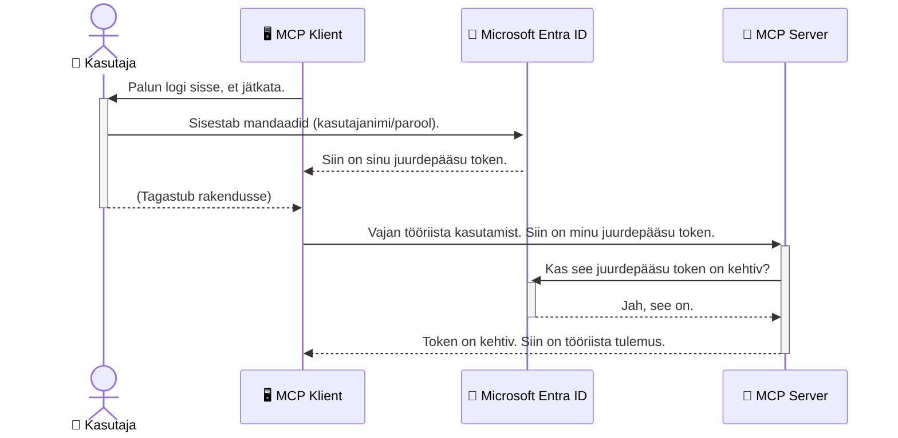

# AI töövoogude turvamine: Entra ID autentimine Model Context Protocol serveritele

## Sissejuhatus
Sinu Model Context Protocol (MCP) serveri turvamine on sama oluline kui kodu esivärava lukustamine. Kui jätta MCP server avatuks, võib see tööriistu ja andmeid volitamata juurdepääsu ohvriks tuua, mis võib viia turvarikkumisteni. Microsoft Entra ID pakub tugevat pilvepõhist identiteedi ja juurdepääsu haldamise lahendust, mis tagab, et ainult volitatud kasutajad ja rakendused saavad MCP serveriga suhelda. Selles osas õpid, kuidas kaitsta oma AI töövooge Entra ID autentimise abil.

## Õpieesmärgid
Selle osa lõpuks suudad:

- Mõista MCP serverite turvamise olulisust.
- Selgitada Microsoft Entra ID ja OAuth 2.0 autentimise põhialuseid.
- Erinevusi tuvastada avaliku ja konfidentsiaalse kliendi vahel.
- Rakendada Entra ID autentimist nii kohalikus (avaliku kliendi) kui ka kaug-MCP serveri (konfidentsiaalse kliendi) stsenaariumides.
- Kasutada turvalisi parimaid praktikaid AI töövoogude arendamisel.

## Turvalisus ja MCP

Nagu sa ei jätaks oma kodu esiväravat lukustamata, ei tohiks sa jätta MCP serverit avatuks kõigile. AI töövoogude turvamine on hädavajalik, et luua vastupidavaid, usaldusväärseid ja turvalisi rakendusi. Käesolevas peatükis tutvustame Microsoft Entra ID kasutamist MCP serverite turvamiseks, tagades, et ainult volitatud kasutajad ja rakendused pääsevad sinu tööriistadele ja andmetele ligi.

## Miks MCP serverite turvalisus on oluline

Kujuta ette, et sinu MCP serveril on tööriist, mis suudab saata e-kirju või pääseda kliendi infosüsteemi andmetele ligi. Turvamata server võiks lubada kellel tahes seda tööriista kasutada, mis tooks kaasa volitamata andmete juurdepääsu, rämpsposti või muid pahatahtlikke tegevusi.

Autentimise rakendamisega tagad, et iga päring serverile on kontrollitud ja kinnitab kasutaja või rakenduse identiteedi. See on esimene ja kõige olulisem samm sinu AI töövoogude turvamisel.

## Sissejuhatus Microsoft Entra ID-sse

[**Microsoft Entra ID**](https://adoption.microsoft.com/microsoft-security/entra/) on pilvepõhine identiteedi ja juurdepääsu haldamise teenus. Mõtle sellele kui universaalsele turvamehele sinu rakendustes. See haldab keerukat protsessi kasutaja identiteedi kinnitamiseks (autentimine) ja määrab, mida need kasutajad teha võivad (autorisatsioon).

Entra ID kasutamisega saad:

- Lubada kasutajatele turvalist sisselogimist.
- Kaitsta API-sid ja teenuseid.
- Hallata juurdepääsupoliitikaid ühest kesksest kohast.

MCP serverite puhul annab Entra ID usaldusväärse ja laialdaselt aktsepteeritud lahenduse selleks, kes saab serveris olevaid võimalusi kasutada.

---

## Mõistmine: Kuidas Entra ID autentimine toimib

Entra ID kasutab autentimiseks avatud standardeid, näiteks **OAuth 2.0**. Kuigi detailsed aspektid võivad olla keerukad, on põhiline kontseptsioon lihtne ja seda saab mõista järgnevast võrdlusest.

### Õrn sissejuhatus OAuth 2.0-sse: Võtmehoidja võti

Mõtle OAuth 2.0-le nagu võtmehoidja teenusele sinu auto jaoks. Kui jõuad restorani, ei anna sa võtmehoidjale oma peamist võtit. Selle asemel annad talle **võtmehoidja võtme**, millel on piiratud õigused – see võib autot käivitada ja uksi lukustada, kuid ei saa pagasnikku ega kindalaekat avada.

Selles võrdluses:

- **Sina** oled **kasutaja**.
- **Sinu auto** on **MCP server** koos tema väärtuslike tööriistade ja andmetega.
- **Võtmehoidja** on **Microsoft Entra ID**.
- **Parkimisvõtja** on **MCP klient** (rakendus, mis üritab serverile ligi pääseda).
- **Võtmehoidja võti** on **juurdepääsutoken**.

Juurdepääsutoken on turvaline tekstijada, mille MCP klient saab Entra ID-lt pärast sisselogimist. Klient esitab selle tokeni igal päringul MCP serverile. Server saab tokeni kinnitada, tagamaks, et päring on legitiimne ja kliendil on vajalikud õigused, ilma et peaks kunagi sinu tegeliku salasõna käsitlema.

### Autentimisvoog

Nii see protsess praktikas toimib:



### Microsoft Authentication Library (MSAL) tutvustus

Enne koodi vaatamist on tähtis tutvustada peamist komponendi, mida näed näidetes: **Microsoft Authentication Library (MSAL)**.

MSAL on Microsofti poolt loodud teek, mis lihtsustab oluliselt arendajate autentimise haldamist. Selle asemel, et sina peaksid kirjutama keeruka koodi turvatokenite käsitlemiseks, sisselogimiste haldamiseks ja sessioonide uuendamiseks, võtab MSAL selle raske töö enda peale.

MSAL kasutamine on väga soovitatav, sest:

- **See on turvaline:** Rakendab tööstusharu standardprotokolle ja turvaliseimad praktikad, vähendades koodi haavatavusi.
- **See lihtsustab arendust:** Peidab OAuth 2.0 ja OpenID Connect keerukuse, võimaldades autentimist lisada mõne koodirea abil.
- **See on hooldatud:** Microsoft uuendab MSAL-i aktiivselt, et reageerida uutele turvaohtudele ja platvormimuudatustele.

MSAL toetab laias valikus programmeerimiskeeli ja rakendusraamistikke, sealhulgas .NET, JavaScript/TypeScript, Python, Java, Go ning mobiilplatvorme nagu iOS ja Android. See tähendab, et saad kasutada samasugust autentimise mustrit kogu tehnoloogiapagas.

Lisaks MSAL-le loe ametlikku [MSAL ülevaate dokumentatsiooni](https://learn.microsoft.com/entra/identity-platform/msal-overview).

---

## MCP serveri turvamine Entra ID abil: Samm-sammult juhend

Vaatame nüüd, kuidas turvata kohalik MCP server (mis suhtleb `stdio` kaudu) Entra ID kasutades. See näide kasutab **avalikku klienti**, mis sobib rakendustele, mis töötavad kasutaja arvutis, näiteks lauaarvuti rakendus või kohalik arendusserver.

### Stsenaarium 1: Kohaliku MCP serveri turvamine (avaliku kliendi kasutamine)

Selles stsenaariumis vaatleme MCP serverit, mis töötab lokaalselt, suhtleb `stdio` kaudu ja kasutab Entra ID autentimiseks enne tööriistadele ligipääsu lubamist kasutajat. Serveril on üks tööriist, mis hangib kasutaja profiili Microsoft Graph API kaudu.

#### 1. Rakenduse registreerimine Entra ID-s

Enne koodi kirjutamist tuleb registreerida rakendus Microsoft Entra ID-s. See annab Entra ID-le info sinu rakenduse kohta ja lubab adutentimise teenust kasutada.

1. Mine **[Microsoft Entra portaali](https://entra.microsoft.com/)**.
2. Ava **App registrations** ja klõpsa **New registration**.
3. Pane rakendusele nimi (nt "Minu kohalik MCP server").
4. Vali **Supported account types**'s **Accounts in this organizational directory only**.
5. Selle näite jaoks võib **Redirect URI** tühjaks jätta.
6. Klõpsa **Register**.

Pärast registreerimist märgi üles **Application (client) ID** ja **Directory (tenant) ID**, neid vajad koodis.

#### 2. Koodi selgitus

Vaatame koodi põhiosasid, mis tegelevad autentimisega. Selle näite täielik kood on saadaval [Entra ID - Local - WAM](https://github.com/Azure-Samples/mcp-auth-servers/tree/main/src/entra-id-local-wam) kaustas [mcp-auth-servers GitHubi hoidlas](https://github.com/Azure-Samples/mcp-auth-servers).

**`AuthenticationService.cs`**

See klass vastutab suhtluse eest Entra ID-ga.

- **`CreateAsync`**: Initsialiseerib `PublicClientApplication` MSAL-ist. Konfigureeritakse sinu rakenduse `clientId` ja `tenantId` järgi.
- **`WithBroker`**: Võimaldab brokera kasutamist (nt Windows Web Account Manager), mis pakub turvalisemat ja sujuvamat sisselogimiskogemust.
- **`AcquireTokenAsync`**: Peamine meetod. Esiteks püüab vaiksel viisil tokenit hankida (kasutaja ei pea uuesti sisselogima, kui kehtiv sessioon olemas). Kui see ebaõnnestub, suunatakse kasutajat interaktiivselt sisselogima.

```csharp
// Simplified for clarity
public static async Task<AuthenticationService> CreateAsync(ILogger<AuthenticationService> logger)
{
    var msalClient = PublicClientApplicationBuilder
        .Create(_clientId) // Your Application (client) ID
        .WithAuthority(AadAuthorityAudience.AzureAdMyOrg)
        .WithTenantId(_tenantId) // Your Directory (tenant) ID
        .WithBroker(new BrokerOptions(BrokerOptions.OperatingSystems.Windows))
        .Build();

    // ... cache registration ...

    return new AuthenticationService(logger, msalClient);
}

public async Task<string> AcquireTokenAsync()
{
    try
    {
        // Try silent authentication first
        var accounts = await _msalClient.GetAccountsAsync();
        var account = accounts.FirstOrDefault();

        AuthenticationResult? result = null;

        if (account != null)
        {
            result = await _msalClient.AcquireTokenSilent(_scopes, account).ExecuteAsync();
        }
        else
        {
            // If no account, or silent fails, go interactive
            result = await _msalClient.AcquireTokenInteractive(_scopes).ExecuteAsync();
        }

        return result.AccessToken;
    }
    catch (Exception ex)
    {
        _logger.LogError(ex, "An error occurred while acquiring the token.");
        throw; // Optionally rethrow the exception for higher-level handling
    }
}
```

**`Program.cs`**

Siin seadistatakse MCP server ja integreeritakse autentimisteenus.

- **`AddSingleton<AuthenticationService>`**: Registreerib `AuthenticationService` sõltuvuste konteinerisse, et teised rakenduse osad saaks seda kasutada (nt tööriist).
- **`GetUserDetailsFromGraph` tööriist**: See tööriist vajab `AuthenticationService` instantsi. Enne tegevust kutsub see `authService.AcquireTokenAsync()`, et saada kehtiv juurdepääsutoken. Kui autentimine õnnestub, kasutab see tokenit, et kutsuda Microsoft Graph API ja hankida kasutaja andmed.

```csharp
// Simplified for clarity
[McpServerTool(Name = "GetUserDetailsFromGraph")]
public static async Task<string> GetUserDetailsFromGraph(
    AuthenticationService authService)
{
    try
    {
        // This will trigger the authentication flow
        var accessToken = await authService.AcquireTokenAsync();

        // Use the token to create a GraphServiceClient
        var graphClient = new GraphServiceClient(
            new BaseBearerTokenAuthenticationProvider(new TokenProvider(authService)));

        var user = await graphClient.Me.GetAsync();

        return System.Text.Json.JsonSerializer.Serialize(user);
    }
    catch (Exception ex)
    {
        return $"Error: {ex.Message}";
    }
}
```

#### 3. Kuidas see kõik kokku töötab

1. Kui MCP klient üritab kasutada `GetUserDetailsFromGraph` tööriista, kutsub tööriist esmalt `AcquireTokenAsync`.
2. `AcquireTokenAsync` sunnib MSAL-i kontrollima, kas kehtiv token on olemas.
3. Kui tokenit ei leita, suunab MSAL brokera kaudu kasutaja Entra ID sisselogimislehele.
4. Kui kasutaja sisse logib, väljastab Entra ID juurdepääsutokeni.
5. Tööriist saab tokeni ja kasutab seda turvalise kõne tegemiseks Microsoft Graph API-le.
6. Kasutaja andmed tagastatakse MCP kliendile.

See protsess tagab, et tööriista saavad kasutada ainult autentitud kasutajad, mis turvab efektiivselt sinu kohaliku MCP serveri.

### Stsenaarium 2: Kaug-MCP serveri turvamine (konfidentsiaalse kliendiga)

Kui MCP server töötab kaugmasinas (nt pilveserver) ja suhtleb näiteks HTTP Streaming protokolli kaudu, on turvanõuded erinevad. Sellisel juhul peaksid kasutama **konfidentsiaalset klienti** ja **Authorization Code Flow'd**. See on turvalisem meetod, kuna rakenduse saladused ei suleta kunagi brauserisse.

See näide kasutab TypeScriptil põhinevat MCP serverit, mis kasutab Express.js HTTP päringute haldamiseks.

#### 1. Rakenduse registreerimine Entra ID-s

Entra ID seadistamine on sarnane avaliku kliendiga, küll aga on üks oluline erinevus: vaja on luua **kliendi saladus**.

1. Mine **[Microsoft Entra portaali](https://entra.microsoft.com/)**.
2. Oma rakenduse registreerimisel ava **Certificates & secrets** vahekaart.
3. Klõpsa **New client secret**, lisa kirjeldus ja klõpsa **Add**.
4. **Oluline:** Kopeeri saladus kohe ära. Edaspidi seda enam näha ei saa.
5. Samuti tuleb seadistada **Redirect URI**. Mine **Authentication** vahekaardile, klõpsa **Add a platform**, vali **Web** ja sisesta oma rakenduse suunamis-URI (nt `http://localhost:3001/auth/callback`).

> **⚠️ Oluline turvahoiatus:** Tootmiskeskkonna rakendustele soovitab Microsoft tugevalt kasutada **saladusvabu autentimismeetodeid** nagu **Managed Identity** või **Workload Identity Federation** kliendisaladuste asemel. Kliendisaladused kujutavad endast turvaohtu, kuna neid võib lekitada või rünnata. Hallatud identiteedid pakuvad turvalisemat lahendust, kuna salajasi andmeid ei pea koodis või konfiguratsioonis hoidma.
>
> Rohkem infot hallatud identiteetide kohta ja nende rakendamise kohta leiad siit: [Managed identities for Azure resources overview](https://learn.microsoft.com/entra/identity/managed-identities-azure-resources/overview).

#### 2. Koodi selgitus

See näide kasutab sessioonipõhist lähenemist. Kui kasutaja autentib, salvestab server juurdepääsutokeni ja värskendustokeni sessiooni ning annab kasutajale sessioonitokeni. Seda sessioonitokenit kasutatakse edaspidi päringutes. Näite täielik kood on saadaval [Entra ID - Confidential client](https://github.com/Azure-Samples/mcp-auth-servers/tree/main/src/entra-id-cca-session) kaustas [mcp-auth-servers GitHubi hoidlas](https://github.com/Azure-Samples/mcp-auth-servers).

**`Server.ts`**

See fail seadistab Express serveri ja MCP transpordikihi.

- **`requireBearerAuth`**: See on middleware, mis kaitseb `/sse` ja `/message` otspunktid. Kontrollib päringu `Authorization` päises kehtivat beareri tokenit.
- **`EntraIdServerAuthProvider`**: Kohandatud klass, mis rakendab `McpServerAuthorizationProvider` liidest. Vastutab OAuth 2.0 voo käsitlemise eest.
- **`/auth/callback`**: See otspunkt tegeleb Entra ID-st tagasi suunamisega pärast seda, kui kasutaja on autentitud. Vahetab autoriseerimiskoodi juurdepääsu- ja värskendustokeniks.

```typescript
// Lihtsustatud selguse huvides
const app = express();
const { server } = createServer();
const provider = new EntraIdServerAuthProvider();

// Kaitse SSE lõpp-punkti
app.get("/sse", requireBearerAuth({
  provider,
  requiredScopes: ["User.Read"]
}), async (req, res) => {
  // ... ühenda transpordiga ...
});

// Kaitse sõnumi lõpp-punkti
app.post("/message", requireBearerAuth({
  provider,
  requiredScopes: ["User.Read"]
}), async (req, res) => {
  // ... käsitle sõnumit ...
});

// Käsitle OAuth 2.0 tagasikutsumist
app.get("/auth/callback", (req, res) => {
  provider.handleCallback(req.query.code, req.query.state)
    .then(result => {
      // ... käsitle edukust või ebaõnnestumist ...
    });
});
```

**`Tools.ts`**

See fail määratleb tööriistad, mida MCP server pakub. `getUserDetails` tööriist on sünonüüm eelmisele näitele, kuid võtab juurdepääsutokeni sessioonist.

```typescript
// Lihtsustatud selguse huvides
server.setRequestHandler(CallToolRequestSchema, async (request) => {
  const { name } = request.params;
  const context = request.params?.context as { token?: string } | undefined;
  const sessionToken = context?.token;

  if (name === ToolName.GET_USER_DETAILS) {
    if (!sessionToken) {
      throw new AuthenticationError("Authentication token is missing or invalid. Ensure the token is provided in the request context.");
    }

    // Hangi Entra ID token sessioonipoeist
    const tokenData = tokenStore.getToken(sessionToken);
    const entraIdToken = tokenData.accessToken;

    const graphClient = Client.init({
      authProvider: (done) => {
        done(null, entraIdToken);
      }
    });

    const user = await graphClient.api('/me').get();

    // ... tagasta kasutaja andmed ...
  }
});
```

**`auth/EntraIdServerAuthProvider.ts`**

See klass tegeleb:

- Kasutaja suunamisega Entra ID sisselogimislehele.
- Autoriseerimiskoodi vahetamisega juurdepääsu tokeni vastu.
- Tokenite salvestamisega `tokenStore` 'sse.
- Juurdepääsutokeni värskendamisega, kui see aegub.

#### 3. Kuidas see kõik koos töötab

1. Kui kasutaja üritab esimest korda MCP serveriga ühenduda, märgib `requireBearerAuth` middleware, et kehtivat sessiooni pole ja suunab kasutaja Entra ID sisselogimislehele.
2. Kasutaja logib sisse oma Entra ID kontoga.
3. Entra ID suunab kasutaja tagasi `/auth/callback` lõpp-punkti koos autoriseerimiskoodiga.
4. Server vahetab koodi ligipääsutokeni ja värskendustokeni vastu, salvestab need ning loob sessioonitokeni, mis saadetakse kliendile.
5. Klient saab nüüd seda sessioonitokenit kasutada `Authorization` päises kõigi tulevaste päringute jaoks MCP serverisse.
6. Kui kutsutakse tööriista `getUserDetails`, kasutab see sessioonitokenit Entra ID ligipääsutokeni leidmiseks ja seejärel kutsub Microsoft Graph API-d.

See voog on keerukam kui avaliku kliendi voog, kuid on vajalik internetipõhiste lõpp-punktide jaoks. Kuna kaug-MCP serverid on ligipääsetavad avaliku interneti kaudu, vajavad nad tugevamaid turvameetmeid loata juurdepääsu ja võimalike rünnakute vastu kaitsmiseks.


## Turvalisuse parimad tavad

- **Kasuta alati HTTPS-i**: Krüpteeri kliendi ja serveri vaheline suhtlus, et kaitsta tokeneid vaheltlugemise eest.
- **Rakenda rollipõhist juurdepääsukontrolli (RBAC)**: Ära kontrolli ainult seda, *kas* kasutaja on autentitud; kontrolli, *mida* tal on õigus teha. Võid määratleda rolle Entra ID-s ja kontrollida neid oma MCP serveris.
- **Jälgi ja auditeeri**: Logi kõik autentimise sündmused, et saaksid jälgida ja reageerida kahtlasele tegevusele.
- **Käsitle päringupiiranguid ja kiirusepiiranguid**: Microsoft Graph ja teised API-d rakendavad päringupiiranguid, et vältida kuritarvitamist. Rakenda oma MCP serveris eksponentsiaalset tagasilööki ja kordamise loogikat HTTP 429 (liiga palju päringuid) vastuste haldamiseks. Mõtle sagedasti kasutatava andme vahemällu salvestamisele API päringute vähendamiseks.
- **Tokeni turvaline hoiustamine**: Hoia ligipääsu- ja värskendustokeneid turvaliselt. Kohalike rakenduste puhul kasuta süsteemi turvalisi hoiustamismehhanisme. Serveripõhiste rakenduste puhul kaalu krüpteeritud hoiustamist või turvaliste võtmehaldusteenuste kasutamist nagu Azure Key Vault.
- **Tokeni aegumise käsitlemine**: Ligipääsutokenitel on piiratud kehtivusaeg. Rakenda automaatset tokeni värskendust värskendustokeneid kasutades, et säilitada sujuv kasutajakogemus ilma uuesti autentimiseta.
- **Kaalu Azure API Management kasutamist**: Kuigi turva rakendamine otse MCP serveris annab sulle täpsema kontrolli, suudavad API väravad nagu Azure API Management automaatselt lahendada paljusid turvaprobleeme, sealhulgas autentimist, volitamist, päringupiiranguid ja jälgimist. Need pakuvad keskset turbekihti, mis paikneb sinu klientide ja MCP serverite vahel. Lisateabe saamiseks MVC-ga API väravate kasutamise kohta vaata meie artiklit [Azure API Management Your Auth Gateway For MCP Servers](https://techcommunity.microsoft.com/blog/integrationsonazureblog/azure-api-management-your-auth-gateway-for-mcp-servers/4402690).


## Peamised järeldused

- MCP serveri turvamine on hädavajalik sinu andmete ja tööriistade kaitseks.
- Microsoft Entra ID pakub tugevat ja skaleeritavat lahendust autentimiseks ja autoriseerimiseks.
- Kasuta **avalikku klienti** kohalikes rakendustes ja **konfidentsiaalset klienti** kaugserverite jaoks.
- **Autoriseerimiskoodi voog** on veebirakenduste jaoks kõige turvalisem valik.


## Harjutus

1. Mõtle MCP serveri peale, mida võid ehitada. Kas see on kohalik või kaugserver?
2. Sinu vastuse põhjal, kas kasutaksid avalikku või konfidentsiaalset klienti?
3. Millist luba su MCP server Microsoft Graphi vastu toimingute tegemiseks küsiks?


## Praktilised harjutused

### Harjutus 1: Rakenduse registreerimine Entra ID-s
Mine Microsoft Entra portaalile.
Registreeri uus rakendus oma MCP serveri jaoks.
Kanna üles Rakenduse (kliendi) ID ja Kausta (üürniku) ID.

### Harjutus 2: Kohaliku MCP serveri turvamine (avalik klient)
- Järgi koodinäidet MSAL-i (Microsoft Authentication Library) integreerimiseks kasutaja autentimiseks.
- Testi autentimisvoogu, kutsudes MCP tööriista, mis hangib kasutajaandmed Microsoft Graphist.

### Harjutus 3: Kaug-MCP serveri turvamine (konfidentsiaalne klient)
- Registreeri konfidentsiaalne klient Entra ID-s ja loo kliendi saladus.
- Konfigureeri oma Express.js MCP server kasutama autoriseerimise koodi voogu.
- Testi kaitstud lõpp-punkte ja kinnita tokenipõhist ligipääsu.

### Harjutus 4: Turvalisuse parimate tavade rakendamine
- Luba HTTPS oma kohalikus või kaugserveris.
- Rakenda rollipõhine juurdepääsukontroll (RBAC) serveri loogikas.
- Lisa tokeni aegumise käsitlemine ja turvaline tokeni hoiustamine.

## Ressursid

1. **MSAL ülevaate dokumentatsioon**  
Õpi, kuidas Microsoft Authentication Library (MSAL) võimaldab turvalist tokenite hankimist eri platvormidel:  
[MSAL Overview on Microsoft Learn](https://learn.microsoft.com/en-gb/entra/msal/overview)

2. **Azure-Samples/mcp-auth-servers GitHubi hoidla**  
MCP serverite näidisrakendused, mis demonstreerivad autentimismeetodeid:  
[Azure-Samples/mcp-auth-servers on GitHub](https://github.com/Azure-Samples/mcp-auth-servers)

3. **Haldusega identiteedid Azure ressursidele ülevaade**  
Saa teada, kuidas süsteemile või kasutajale määratud haldussubjektidega salajasi andmeid eemaldada:  
[Managed Identities Overview on Microsoft Learn](https://learn.microsoft.com/en-us/entra/identity/managed-identities-azure-resources/)

4. **Azure API Management: sinu autentimislüüs MCP serveritele**  
Sügav ülevaade APIM kasutamisest turvalise OAuth2 väravana MCP serveritele:  
[Azure API Management Your Auth Gateway For MCP Servers](https://techcommunity.microsoft.com/blog/integrationsonazureblog/azure-api-management-your-auth-gateway-for-mcp-servers/4402690)

5. **Microsoft Graphi õiguste viide**  
Üksikasjalik nimekiri volitatud ja rakenduseõigustest Microsoft Graphi jaoks:  
[Microsoft Graph Permissions Reference](https://learn.microsoft.com/zh-tw/graph/permissions-reference)


## Õpitulemused
Pärast selle jaotise läbimist oskad:

- Selgitada, miks autentimine on MCP serverite ja tehisintellekti töövoogude jaoks kriitiline.
- Seadistada ja konfigureerida Entra ID autentimist nii kohalike kui ka kaug-MCP serverite stsenaariumides.
- Vali oma serveri paigalduse põhjal sobiv klienditüüp (avalik või konfidentsiaalne).
- Rakendada turvalise koodi tavasid, sealhulgas tokenite hoiustamist ja rollipõhist autoriseerimist.
- Turvaliselt kaitsta oma MCP serverit ja selle tööriistu loata juurdepääsu eest.

## Mis järgmiseks 

- [5.13 Mudeli konteksti protokolli (MCP) integratsioon Microsoft Foundryga](../mcp-foundry-agent-integration/README.md)

---

<!-- CO-OP TRANSLATOR DISCLAIMER START -->
**Lahtiütlus**:
See dokument on tõlgitud kasutades AI tõlketeenust [Co-op Translator](https://github.com/Azure/co-op-translator). Kuigi me püüdleme täpsuse poole, palun pange tähele, et automatiseeritud tõlgetes võib esineda vigu või ebatäpsusi. Originaaldokument selle emakeeles tuleks pidada autoriteetseks allikaks. Olulise teabe puhul soovitatakse kasutada professionaalset inimtõlget. Me ei vastuta selle tõlkega seotud eksimustest või valesti mõistmistest.
<!-- CO-OP TRANSLATOR DISCLAIMER END -->