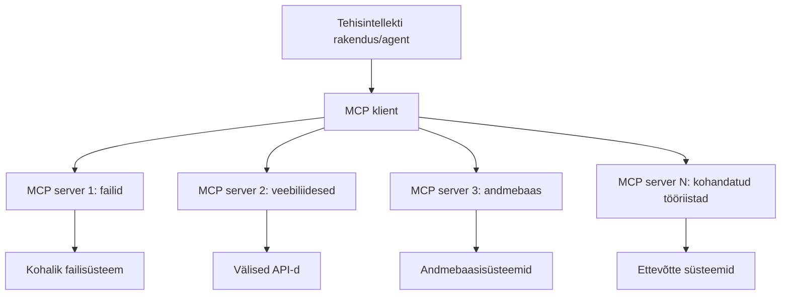

# 🌐 Moodul 2: MCP Microsoft Foundry Toolkiti põhialustega

[]()
[]()
[]()

## 📋 Õpieesmärgid

Selle mooduli lõpuks suudad sa:
- ✅ Mõista Model Context Protocoli (MCP) arhitektuuri ja eelistusi
- ✅ Uurida Microsofti MCP serveri ökosüsteemi
- ✅ Integreerida MCP servereid Microsoft Foundry Toolkiti Agent Builderiga
- ✅ Luua funktsionaalne brauseri automatiseerimise agent, kasutades Playwright MCP-d
- ✅ Konfigureerida ja testida MCP tööriistu oma agentides
- ✅ Eksportida ja deploy'ida MCP-toega agente tootmiskasutuseks

## 🎯 Eelnevast moodulist ehitamine

Moodulis 1 omandasime Microsoft Foundry Toolkiti põhialused ja lõime oma esimese Python Agendi. Nüüd **tõstame oma agentide võimekust**, ühendades need väliste tööriistade ja teenustega revolutsioonilise **Model Context Protocoli (MCP)** kaudu.

Kujuta seda ette kui ülesgradi lihtsast kalkulaatorist täisarvuti juurde – sinu tehisintellekti agendid saavad võime:
- 🌐 Lehitsema ja veebisaitidega suhtlema
- 📁 Failidele ligi pääsema ja neid haldama
- 🔧 Integreerima ärisüsteemidega
- 📊 Töötlema reaalajas andmeid API-de kaudu

## 🧠 Model Context Protocoli (MCP) mõistmine

### 🔍 Mis on MCP?

Model Context Protocol (MCP) on **"USB-C AI rakendustele"** – revolutsiooniline avatud standard, mis ühendab suurkeelemudelid (LLM-id) väliste tööriistade, andmeallikate ja teenustega. Nii nagu USB-C kaotas kaose kaablite vahel, pakkudes universaalset ühendust, kaotab MCP AI integratsiooni keerukuse ühe standardiseeritud protokolli abil.

### 🎯 Probleem, mida MCP lahendab

**Enne MCP-d:**
- 🔧 Kohandatud integratsioonid iga tööriista jaoks
- 🔄 Tarnijasõltuvus omanäoliste lahendustega
- 🔒 Turvaaukude risk ad hoc ühenduste tõttu
- ⏱️ Põhitegevuste integreerimine võttis kuid aega

**MCP-ga:**
- ⚡ Plug-and-play tööriistade integratsioon
- 🔄 Tarnijariigist sõltumatu arhitektuur
- 🛡️ Läbi viidud turvalisuse parimad praktikad
- 🚀 Minutid uute võimekuste lisamiseks

### 🏗️ MCP arhitektuuri süvitsi

MCP järgib **klient-server arhitektuuri**, mis loob turvalise ja skaleeritava ökosüsteemi:



**🔧 Põhikomponendid:**

| Komponent | Roll | Näited |
|-----------|------|----------|
| **MCP võõrustajad** | Rakendused, mis tarbivad MCP teenuseid | Claude Desktop, VS Code, Microsoft Foundry Toolkit |
| **MCP kliendid** | Protokolli käsitlejad (1:1 serveritega) | Sisseehitatud võõrustaja rakendustesse |
| **MCP serverid** | Võimaluste pakkumine standardse protokolli kaudu | Playwright, Files, Azure, GitHub |
| **Transpordikiht** | Kommunikatsioonimeetodid | stdio, HTTP, WebSockets |

## 🏢 Microsofti MCP serveri ökosüsteem

Microsoft juhib MCP ökosüsteemi tervikliku ettevõtteklasside serverite komplektiga, mis vastavad reaalsete ärivajaduste lahendustele.

### 🌟 Esiletõstetud Microsofti MCP serverid

#### 1. ☁️ Azure MCP server
**🔗 Repositoorium**: [azure/azure-mcp](https://github.com/azure/azure-mcp)
**🎯 Eesmärk**: Kattetaoline Azure ressursside haldus koos tehisintellektiga integratsiooniga

**✨ Põhifunktsioonid:**
- Deklaratiivne infrastruktuuri provisjonimine
- Reaalajas ressursside jälgimine
- Kulude optimeerimise soovitused
- Turvakontrolli läbivaatamine

**🚀 Kasutusjuhtumid:**
- Infrastruktuur kodeerituna AI abiga
- Automatiseeritud ressursside skaleerimine
- Pilvekulude optimeerimine
- DevOps töövoo automatiseerimine

#### 2. 📊 Microsoft Dataverse MCP
**📚 Dokumentatsioon**: [Microsoft Dataverse integratsioon](https://go.microsoft.com/fwlink/?linkid=2320176)
**🎯 Eesmärk**: Äriandmete loomuliku keele liides

**✨ Põhifunktsioonid:**
- Loomuliku keelega andmebaasi päringud
- Ärikonteksti mõistmine
- Kohandatud prompti mallid
- Ettevõtte andmehalduskontroll

**🚀 Kasutusjuhtumid:**
- Ärianalüüsi aruandlus
- Kliendiandmete analüüs
- Müügitoru ülevaated
- Vastavusandmete päringud

#### 3. 🌐 Playwright MCP server
**🔗 Repositoorium**: [microsoft/playwright-mcp](https://github.com/microsoft/playwright-mcp)
**🎯 Eesmärk**: Brauseri automatiseerimise ja veebisuhtluse võimekused

**✨ Põhifunktsioonid:**
- Ristbrauseri automatiseerimine (Chrome, Firefox, Safari)
- Nutikas elementide tuvastus
- Ekraanipiltide ja PDF-i genereerimine
- Võrguliiklust jälgimine

**🚀 Kasutusjuhtumid:**
- Automatiseeritud testimise töövood
- Veebilehtede andmete kogumine ja eraldamine
- Kasutajaliidese monitooring
- Konkurentsianalüüsi automatiseerimine

#### 4. 📁 Files MCP server
**🔗 Repositoorium**: [microsoft/files-mcp-server](https://github.com/microsoft/files-mcp-server)
**🎯 Eesmärk**: Nutikad failisüsteemi toimingud

**✨ Põhifunktsioonid:**
- Deklaratiivne failihaldus
- Sisu sünkroniseerimine
- Versioonikontrolli integratsioon
- Metainfo väljavõte

**🚀 Kasutusjuhtumid:**
- Dokumentatsiooni haldus
- Koodi repositooriumi organiseerimine
- Sisu avaldamise töövood
- Andmepipeline failide haldamine

#### 5. 📝 MarkItDown MCP server
**🔗 Repositoorium**: [microsoft/markitdown](https://github.com/microsoft/markitdown)
**🎯 Eesmärk**: Täiustatud Markdowni töötlemine ja manipuleerimine

**✨ Põhifunktsioonid:**
- Rikas Markdowni parser
- Formaadi konverteerimine (MD ↔ HTML ↔ PDF)
- Sisu struktuuri analüüs
- Mallitöötlus

**🚀 Kasutusjuhtumid:**
- Tehnilise dokumentatsiooni töövood
- Sisu haldussüsteemid
- Aruandluse genereerimine
- Teadmusbaasi automatiseerimine

#### 6. 📈 Clarity MCP server
**📦 Pakett**: [@microsoft/clarity-mcp-server](https://www.npmjs.com/package/@microsoft/clarity-mcp-server)
**🎯 Eesmärk**: Veebianalüütika ja kasutajakäitumise arusaamine

**✨ Põhifunktsioonid:**
- Soojuskaardi andmete analüüs
- Kasutajate sessioonide salvestused
- Jõudlusmõõdikud
- Konversioonitoru analüüs

**🚀 Kasutusjuhtumid:**
- Veebilehe optimeerimine
- Kasutajakogemuse uurimine
- A/B testimise analüüs
- Ärianalüüsi armatuurlauad

### 🌍 Kogukonna ökosüsteem

Lisaks Microsofti serveritele kuulub MCP ökosüsteemi:
- **🐙 GitHub MCP**: Repositooriumi haldus ja koodi analüüs
- **🗄️ Andmebaasi MCP-d**: PostgreSQL, MySQL, MongoDB integratsioonid
- **☁️ Pilveteenuste MCP-d**: AWS, GCP, Digital Ocean tööriistad
- **📧 Kommunikatsiooni MCP-d**: Slack, Teams, e-posti integratsioonid

## 🛠️ Praktikum: Brauseri automatiseerimise agendi loomine

**🎯 Projekti eesmärk**: Luua nutikas brauseri automatiseerimise agent, kasutades Playwright MCP serverit, mis saab navigeerida veebilehtedel, eraldada infot ja teha keerukaid veebitoiminguid.

### 🚀 Faas 1: Agendi põhiseadistus

#### Samm 1: Alusta oma agenti
1. **Ava Microsoft Foundry Toolkiti Agent Builder**
2. **Loo uus agent** järgmiste seadistustega:
   - **Nimi**: `BrowserAgent`
   - **Mudeli valik**: vali GPT-4o 


### 🔧 Faas 2: MCP integratsiooni protsess

#### Samm 3: Lisa MCP serveri integratsioon
1. **Mine tööriistade jaotisse** Agent Builderis
2. **Klõpsa "Add Tool"** integratsioonimenüü avamiseks
3. **Vali "MCP Server"** saadaval olevate valikute hulgast


**🔍 Tööriistade tüübi mõistmine:**
- **Sisseehitatud tööriistad**: Eelkonfigureeritud Microsoft Foundry Toolkiti funktsioonid
- **MCP serverid**: Väliste teenuste integratsioonid
- **Kohandatud API-d**: Sinu enda teenuste lõpp-punktid
- **Funktsioonikutsed**: Otsene mudeli funktsioonide kasutus

#### Samm 4: MCP serveri valik
1. **Vali “MCP Server”** jätkamiseks


2. **Sirvi MCP kataloogi**, et uurida saadaolevaid integratsioone


### 🎮 Faas 3: Playwright MCP seadistamine

#### Samm 5: Vali ja seadista Playwright
1. **Klõpsa "Use Featured MCP Servers"** Microsofti kinnitatud serverite avamiseks
2. **Vali "Playwright"** kuvatud nimekirjast
3. **Nõustu vaikimisi MCP ID-ga** või kohanda vastavalt oma keskkonnale


#### Samm 6: Luba Playwrighti võimalused
**🔑 Väga oluline samm**: Vali maksimaalse funktsionaalsuse tagamiseks **KÕIK** saadaval olevad Playwrighti meetodid


**🛠️ Olulised Playwrighti tööriistad:**
- **Navigeerimine**: `goto`, `goBack`, `goForward`, `reload`
- **Suhtlemine**: `click`, `fill`, `press`, `hover`, `drag`
- **Info eraldamine**: `textContent`, `innerHTML`, `getAttribute`
- **Kinnitus**: `isVisible`, `isEnabled`, `waitForSelector`
- **Pildistamine**: `screenshot`, `pdf`, `video`
- **Võrk**: `setExtraHTTPHeaders`, `route`, `waitForResponse`

#### Samm 7: Kontrolli integratsiooni edukust
**✅ Edu märgid:**
- Kõik tööriistad ilmuvad Agent Builderi kasutajaliidesesse
- Integratsioonipaneelis puuduvad veateated
- Playwright server näitab olekut "Connected"


**🔧 Tavaliste probleemide lahendamine:**
- **Ühendus ebaõnnestus**: Kontrolli internetiühendust ja tulemüüri seadeid
- **Tööriistu puudub**: Veendu, et seadistamisel valiti kõik võimekused
- **Luba-vead**: Kontrolli, et VS Code'il on vajalikud süsteemiõigused

### 🎯 Faas 4: Täiustatud promptide loomine

#### Samm 8: Disaini intelligentseid süsteemprompte
Loo keerukad promptid, mis kasutavad Playwrighti täielikku võimekust:

```markdown
# Web Automation Expert System Prompt

## Core Identity
You are an advanced web automation specialist with deep expertise in browser automation, web scraping, and user experience analysis. You have access to Playwright tools for comprehensive browser control.

## Capabilities & Approach
### Navigation Strategy
- Always start with screenshots to understand page layout
- Use semantic selectors (text content, labels) when possible
- Implement wait strategies for dynamic content
- Handle single-page applications (SPAs) effectively

### Error Handling
- Retry failed operations with exponential backoff
- Provide clear error descriptions and solutions
- Suggest alternative approaches when primary methods fail
- Always capture diagnostic screenshots on errors

### Data Extraction
- Extract structured data in JSON format when possible
- Provide confidence scores for extracted information
- Validate data completeness and accuracy
- Handle pagination and infinite scroll scenarios

### Reporting
- Include step-by-step execution logs
- Provide before/after screenshots for verification
- Suggest optimizations and alternative approaches
- Document any limitations or edge cases encountered

## Ethical Guidelines
- Respect robots.txt and rate limiting
- Avoid overloading target servers
- Only extract publicly available information
- Follow website terms of service
```

#### Samm 9: Loo dünaamilised kasutajapromptid
Tee promtid, mis demonstreerivad erinevaid võimekusi:

**🌐 Veebi analüüsi näide:**
```markdown
Navigate to github.com/kinfey and provide a comprehensive analysis including:
1. Repository structure and organization
2. Recent activity and contribution patterns  
3. Documentation quality assessment
4. Technology stack identification
5. Community engagement metrics
6. Notable projects and their purposes

Include screenshots at key steps and provide actionable insights.
```


### 🚀 Faas 5: Käivitamine ja testimine

#### Samm 10: Käivita oma esimene automatiseerimine
1. **Klõpsa "Run"**, et alustada automatiseerimisseeriat
2. **Jälgi reaalajas täitmist**:
   - Avaneb Chrome brauser automaatselt
   - Agent navigeerib sihtveebilehele
   - Ekraanipildid jäädvustavad iga peamise sammu
   - Analüüsi tulemused voogavad reaalajas


#### Samm 11: Analüüsi tulemusi ja järeldusi
Vaata põhjalikku analüüsi Agent Builderi liideses:


### 🌟 Faas 6: Täiustatud võimekused ja juurutamine

#### Samm 12: Eksport ja tootmisse deploy
Agent Builder toetab mitut juurutamise võimalust:


## 🎓 Moodul 2 kokkuvõte & järgmised sammud

### 🏆 Saavutus: MCP integratsiooni meister

**✅ Omandatu:**
- [ ] MCP arhitektuuri ja eelistuste mõistmine
- [ ] Microsofti MCP serveri ökosüsteemi navigeerimine
- [ ] Playwright MCP integratsioon Microsoft Foundry Toolkitiga
- [ ] Keerukate brauseri automatiseerimise agentide loomine
- [ ] Täiustatud promptide loomine veebiautomatiseerimiseks

### 📚 Lisamaterjalid

- **🔗 MCP spetsifikatsioon**: [Ametlik protokolli dokumentatsioon](https://modelcontextprotocol.io/)
- **🛠️ Playwright API**: [Täielik meetodite referents](https://playwright.dev/docs/api/class-playwright)
- **🏢 Microsoft MCP serverid**: [Ettevõtte integreerimise juhend](https://github.com/microsoft/mcp-servers)
- **🌍 Kogukonna näited**: [MCP serverite galerii](https://github.com/modelcontextprotocol/servers)

**🎉 Palju õnne!** Oled edukalt omandanud MCP integratsiooni oskused ja nüüd saad luua tootmiskõlblikke tehisintellekti agente väliste tööriistade võimekusega!

### 🔜 Järgmise mooduli juurde

Oled valmis viima oma MCP oskused järgmisele tasemele? Jätka **[Moodul 3: Täiustatud MCP arendus Microsoft Foundry Toolkitiga](../lab3/README.md)**, kus õpid:
- Looma oma kohandatud MCP servereid
- Seadistama ja kasutama uusimat MCP Python SDK-d
- Kasutama MCP Inspectorit silumiseks
- Valdama täiustatud MCP serveri arenduse töövooge
- Looma ilma pealt ilma MCP serveri algusest peale

---

<!-- CO-OP TRANSLATOR DISCLAIMER START -->
**Lahtiütlus**:
See dokument on tõlgitud kasutades AI tõlketeenust [Co-op Translator](https://github.com/Azure/co-op-translator). Kuigi me püüdleme täpsuse poole, palun pange tähele, et automatiseeritud tõlgetes võib esineda vigu või ebatäpsusi. Originaaldokument selle emakeeles tuleks pidada autoriteetseks allikaks. Olulise teabe puhul soovitatakse kasutada professionaalset inimtõlget. Me ei vastuta selle tõlkega seotud eksimustest või valesti mõistmistest.
<!-- CO-OP TRANSLATOR DISCLAIMER END -->