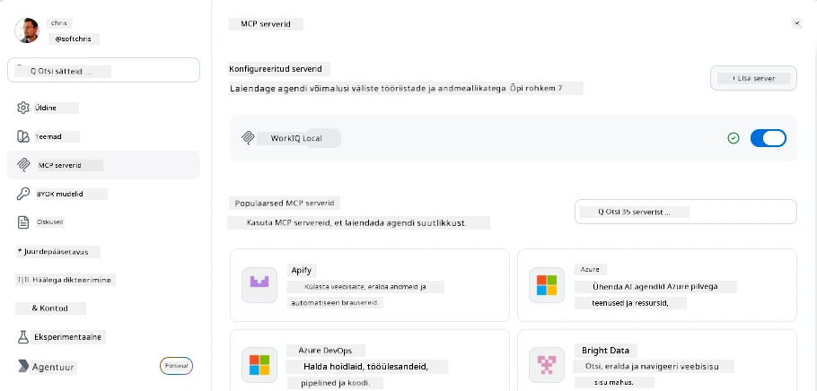
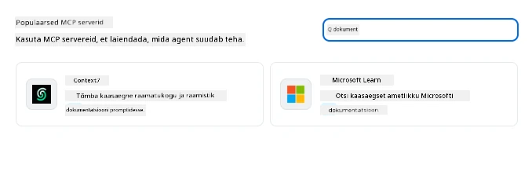
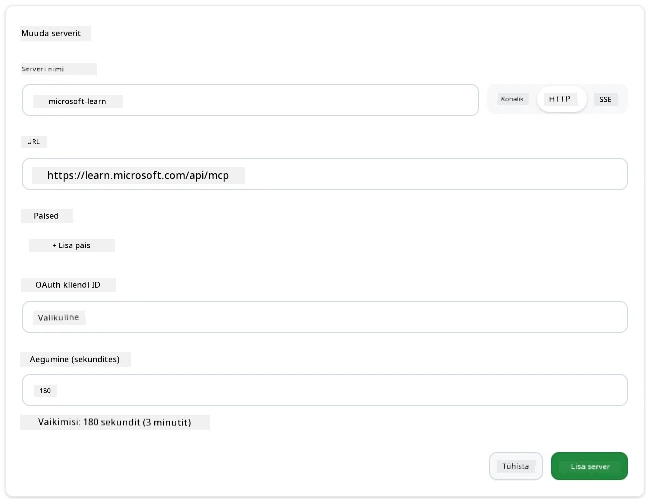
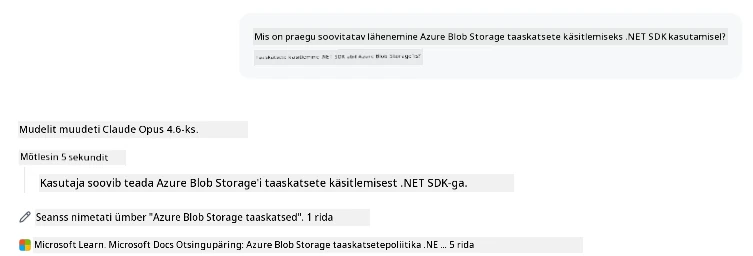
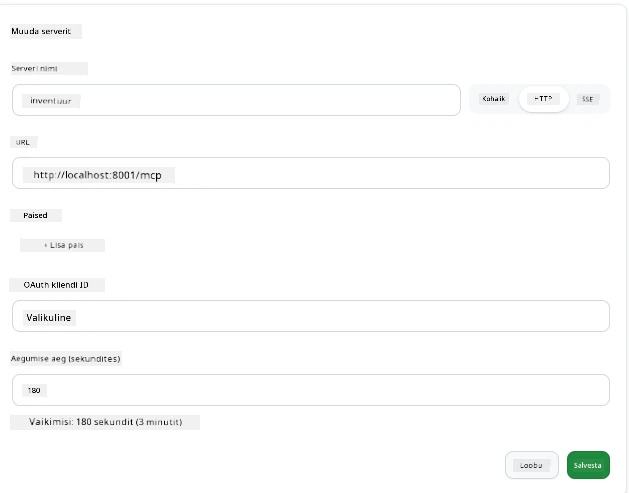
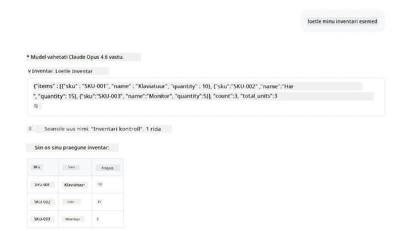
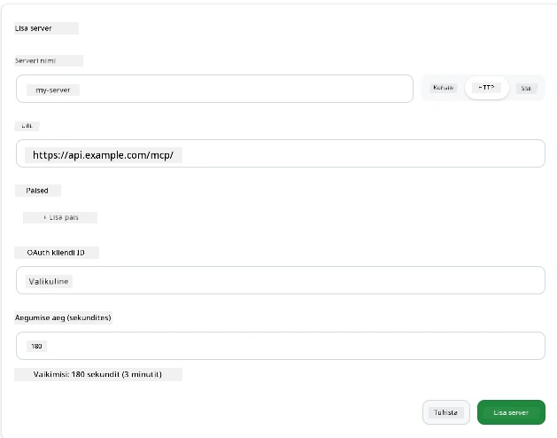
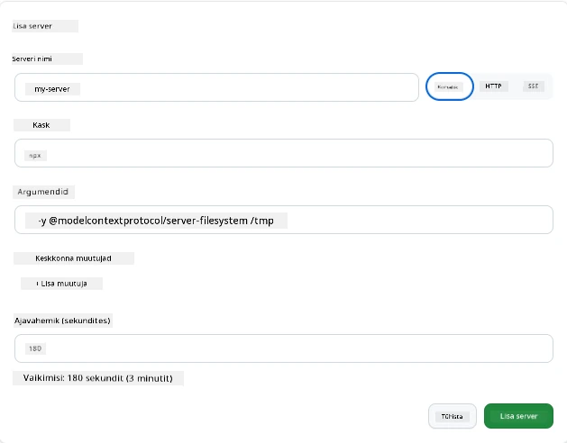

# MCP-serverite kasutamine GitHub Copiloti rakenduses

Nüüd, kui sa tead, kuidas MCP töötab. Sa oled üles seadnud serverid, määratlenud tööriistad ja ressursid ning ühendanud kliendid. Mida me aga veel pole teinud, on vaatenurga pööramine: selle asemel, et sina oled see, kes serverit ehitab, milline on olla *tarbija* poolel — kasutajana tehisintellektil põhinevas rakenduses, mis toetab MCP-d?

[GitHub Copilot App](https://github.com/github/app) on töölauarakendus, mis saab kasutada MCP-servereid. MCP-serverite ühendamisega avad uue taseme: Copilot saab nüüd ligi sinu dokumentatsioonile, kutsuda sinu sisemisi API-sid, pärida sinu andmebaasi või suhelda iga teenusega, mille oled serveri sisse ümbritsenud. Rakendus muutub hostiks; sinu MCP-serverid muutuvad selle tööriistadeks.

See õppetund viib sind selle kogemuse läbi algusest lõpuni — leides MCP sätete paneeli, ühendades reaalse dokumentatsiooniserveri ja seejärel ühendades ka omaenda kohandatud serveri.

## Õpieesmärgid

Selle õppetunni lõpuks oskad:

- Leida ja navigeerida MCP-serverite paneeli Copiloti rakenduse seadete alt.
- Ühenduda hostitud dokumentatsiooniserveriga ja seda sessioonis kasutada.
- Registreerida kohandatud server ja kontrollida, et Copilot suudab selle tööriistu kutsuda.
- Konfigureerida, kuidas serverit kutsutakse, pakkudes kas keskkonnamuutujaid või kohandatud päiseid (HTTP puhul).

## Copiloti rakendus MCP-hostina

Põhiline idee on järgmine: **Copiloti agendid on nutikad, kuid nad teavad ainult seda, mida sina neile ütled.** Vaikimisi saab agent lugeda faile sinu töökeskkonnas ja käivitada terminali käske, kuid ta ei saa ilma abita sinu andmebaasi pärida, sinu kalendrit piiluda ega kohandatud API-d kutsuda. Siin tulevad mängu MCP-serverid. Need toimivad sillana Copiloti ja sinu süsteemide — andmebaaside, versioonikontrolli, API-de, disainitööriistade vahel — andes agentidele ligipääsu informatsioonile ja tegevustele, mida nad vajavad töö lõpetamiseks.

Alustame MCP-serverite haldamise sätete leidmisest rakenduses.

## Samm 1: MCP seadete paneeli leidmine

Ava Copiloti rakendus ja leia all vasakul hammasratta ikoon ning klõpsa sellel.


Veendu, et oled valinud "MCP Servers"—nüüd peaksid nägema oma juba konfigureeritud servereid ülal, populaarsete serverite turgu all ja "Add Server" nuppu üleval, nagu alljärgnevalt:



See on su juhtimiskeskus. Siin saad servereid lisada, eemaldada, lubada ja keelata. Muudatused jõustuvad uutes sessioonides; kui sul on sessioon juba avatud, tuleb pärast nimekirja muutmist alustada uut sessiooni.

## Samm 2: Dokumentatsiooniserveri ühendamine

Teeme midagi kohe kasulikku. Microsoft Docs MCP-server annab Copilotile ligipääsu ametlikule Microsofti dokumentatsioonile. See hõlmab Azure’i, .NET-i, TypeScripti ja palju muud. Selle asemel, et agent toetuks oma koolitusandmetele (millel on lõppkuupäev), saab ta pärida jooksvalt kehtivaid dokumente.

Siin on, kuidas seda lisada:

1. Populaarsete serverite võrgustikus tipi **learn** ja vali server nimega "Microsoft Learn".

   

   Klõpsates avaneb vorm, kus nimi, transpordi tüüp ja URL on eeltäidetud, sulle jääb ainult klõpsata "Add Server".

2. Klõpsa "Add Server", ühenduse loomine serveriga võtab paar sekundit.

   

   Kui server on lisatud, peaks see olema näha ülespoole kui konfigureeritud server. Proovime seda kohe.

3. Sule dialoog ja vali Quick chat.

4. Tippige järgmine käsu sisend, et käivitada tööriist Microsoft Learn serveris.

   ```text
   What's the current recommended approach for handling Azure Blob Storage 
   retries using the .NET SDK?
   ```

   

Sa peaksid nägema, kuidas viidatakse MCP-serverile, mille just lisasime.

## Samm 3: Kohandatud stdio-serveri ühendamine

Valmisklahvlid on mugavad, kuid tõeline võimsus tuleb oma serverite ühendamisest. Oletame, et oled ehitanud serveri (või sulle on see antud), mis exposeerib sinu sisemist API-d või ettevõtte teadmistebaasi. Käesoleval juhul kasutame MCP-serverit, mille me ise ehitasime ja mis haldab meie ettevõtte inventuuri.

1. Klõpsa hammasratast ja vali uuesti "MCP servers".

2. Vali "Add Server" nupp ja seejärel "+ Add Custom server", täida järgmised väärtused:

   - Nimi: `Inventory Server`
   - Vali transport (paremal), **http**

   Vali "Add Server" ja see peaks ilmuma sinu konfigureeritud serverite nimekirja.

   

4. Proovimiseks käivita selline käsu sisend:

    ```
    list inventory
    ```

   

   Nüüd peaksid nägema inventuuri üksuste nimekirja, mille sinu kohandatud server tagastab.

Suurepärane, nüüd peaks sul olema hea ülevaade nii väliste kui ka oma MCP-serverite lisamisest Copiloti rakendusse. Järgmisena räägime saladuste ja keskkonnamuutujate haldamisest.

## Samm 4: Täpsemad sätted

Senini oled näinud MCP-serverite lisamist, kus annad lihtsalt nime ja URL-i. Aga mis juhtub, kui su server vajab API võtit või mõnda muud väärtust? Kõik sõltub transporditüübist, saame talle anda vajalikku.

- **http või SSE transport**: Siin saab vajadusel määrata päiseid.

   Autentimiseks võid määrata Authorization päise. Väärtus võib olla staatiline tekst. Kui kasutad OAuth-i, võid anda hoopis OAuth kliendi ID.

   

- **stdio transport**: Saad määrata keskkonnamuutujaid.

   Siin saad määrata nii palju keskkonnamuutujaid kui vaja, mis antakse serverile selle käivitamisel üle.

   

## Kokkuvõte

Copiloti rakendus käsitleb MCP-servereid kui agendi võimekuse täiendavaid esmaklassilisi laiendusi. Sa oled näinud selle õppetunni jooksul kogu teekonda MCP-serverite lisamisest kuni nende kasutamiseni sessioonis. Nüüd saad ühendada avalikke servereid, sisemisi API-sid ja kohandatud tööriistu, andes oma agentidele võime ligi pääseda infole ja tegevustele, mida nad vajavad autonoomseks ülesannete täitmiseks.

## 📚 Lisamaterjalid

### Ametlik dokumentatsioon

- [GitHub Copilot App](https://github.com/github/app)
- [MCP spetsifikatsioon](https://modelcontextprotocol.io/specification/2025-03-26) – Model Context Protocol spetsifikatsioon

### Kogukond
- [MCP kogukonna Discord](https://discord.com/invite/ByRwuEEgH4) – Otsekõned
- [GitHub arutelud](https://github.com/microsoft/MCP-Server-and-PostgreSQL-Sample-Retail/discussions) – Küsimused ja kogemuste jagamine
- [Stack Overflow](https://stackoverflow.com/questions/tagged/model-context-protocol) – Tehnilised küsimused

---

<!-- CO-OP TRANSLATOR DISCLAIMER START -->
**Lahtiütlus**:
See dokument on tõlgitud kasutades AI tõlketeenust [Co-op Translator](https://github.com/Azure/co-op-translator). Kuigi me püüdleme täpsuse poole, palun pange tähele, et automatiseeritud tõlgetes võib esineda vigu või ebatäpsusi. Originaaldokument selle emakeeles tuleks pidada autoriteetseks allikaks. Olulise teabe puhul soovitatakse kasutada professionaalset inimtõlget. Me ei vastuta selle tõlkega seotud eksimustest või valesti mõistmistest.
<!-- CO-OP TRANSLATOR DISCLAIMER END -->