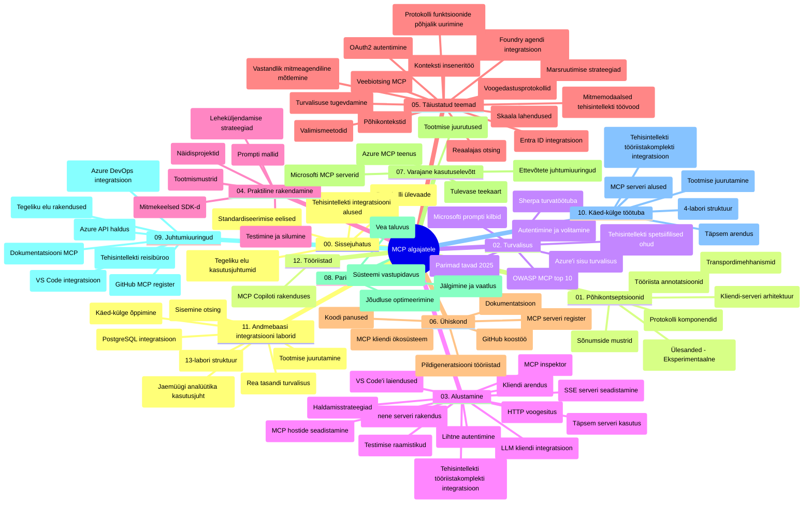

# Mudelikonteksti protokoll (MCP) algajatele - õppejuhend

See õppejuhend annab ülevaate hoidla struktuurist ja sisust kursuse "Mudelikonteksti protokoll (MCP) algajatele" jaoks. Kasutage seda juhendit hoidla tõhusaks navigeerimiseks ja olemasolevate ressursside maksimaalseks kasutamiseks.

## Hoidla ülevaade

Mudelikonteksti protokoll (MCP) on standardiseeritud raamistik AI mudelite ja kliendirakenduste vaheliseks suhtluseks. Esialgselt lõi selle Anthropic, nüüd haldab MCP-d laiem kogukond ametliku GitHubi organisatsiooni kaudu. See hoidla pakub põhjalikku õppekava praktiliste koodinäidetega C#, Java, JavaScripti, Pythoni ja TypeScripti keeltes, suunatud AI arendajatele, süsteemiarhitektidele ja tarkvarainseneridele.

## Visuaalne õppekava kaart

## Hoidla struktuur

Hoidla on organiseeritud kaheteistkümneks põhiosaks, millest igaüks keskendub MCP erinevatele aspektidele:

1. **Sissejuhatus (00-Introduction/)**
   - Mudelikonteksti protokolli ülevaade
   - Miks standardiseerimine on AI torustikes oluline
   - Praktilised kasutusjuhtumid ja eelised

2. **Põhikontseptsioonid (01-CoreConcepts/)**
   - Kliendi-serveri arhitektuur
   - Peamised protokolli komponendid
   - Sõnumivahetuse mustrid MCP-s

3. **Turvalisus (02-Security/)**
   - Turvaohtud MCP-l põhinevates süsteemides
   - Parimad tavad turvalise rakenduse jaoks
   - Autentimise ja autoriseerimise strateegiad
   - **Põhjalik turbedokumentatsioon**:
     - MCP turvaparimad tavad 2025
     - Azure sisuturbe rakendamise juhend
     - MCP turvakontrollid ja tehnikad
     - MCP parimate tavade kiire viide
   - **Olulised turvateemad**:
     - Prompt-injektsiooni ja tööriistamürgituse ründed
     - Sessiooni kaaperdamine ja segaduses voltija probleemid
     - Tokenite edastamise haavatavused
     - Liigne õiguste andmine ja ligipääsu kontroll
     - Tarneahela turvalisus AI komponentidele
     - Microsoft Prompt Shields integratsioon

4. **Alustamine (03-GettingStarted/)**
   - Keskkonna seadistamine ja konfiguratsioon
   - Põhiliste MCP serverite ja klientide loomine
   - Olemasolevate rakendustega integreerimine
   - Sisaldab jaotisi:
     - Esimene serveri rakendus
     - Kliendi arendus
     - LLM kliendi integratsioon
     - VS Code integratsioon
     - Server-Sent Events (SSE) server
     - Täiustatud serverikasutus
     - HTTP voogedastus
     - AI tööriistakomplekti integratsioon
     - Testimisstrateegiad
     - Paigaldusjuhised

5. **Praktiline rakendus (04-PracticalImplementation/)**
   - SDKde kasutamine erinevates programmeerimiskeeltes
   - Silumine, testimine ja valideerimine
   - Taaskasutatavate promptide mallide ja töövoogude loomine
   - Näidistööprojektid koos rakenduse näidetega

6. **Täiustatud teemad (05-AdvancedTopics/)**
   - Konteksti inseneritehnikad
   - Foundry agendi integratsioon
   - Multi-modaalsed AI töövood
   - OAuth2 autentimise demo'd
   - Reaalajas otsingu võimalused
   - Reaalaja voogedastus
   - Juurekonkestide rakendus
   - Marsruutimise strateegiad
   - Proovi võtmise tehnikad
   - Skaalimise lähenemised
   - Turvaküsimused
   - Entra ID turvaintegratsioon
   - Veebipõhine otsing
   - Vihaküllane multiagendi mõtlemine (debattimustrid)

7. **Kogukonna panused (06-CommunityContributions/)**
   - Koodi ja dokumentatsiooni panustamine
   - Koostöö GitHubis
   - Kogukonna juhitud täiustused ja tagasiside
   - Erinevate MCP klientide kasutamine (Claude Desktop, Cline, VSCode)
   - Töö populaarsete MCP serveritega, sealhulgas pildigeneratsioon

8. **Õppetunnid varajasest kasutuselevõtust (07-LessonsfromEarlyAdoption/)**
   - Tegeliku maailma rakendused ja edulood
   - MCP-põhiste lahenduste ehitamine ja kasutuselevõtt
   - Tendentsid ja tuleviku tee
   - **Microsoft MCP serverite juhend**: Põhjalik juhend 10 tootmisküpse Microsoft MCP serveri kohta, sealhulgas:
     - Microsoft Learn Docs MCP server
     - Azure MCP server (15+ spetsialiseeritud ühendajat)
     - GitHub MCP server
     - Azure DevOps MCP server
     - MarkItDown MCP server
     - SQL Server MCP server
     - Playwright MCP server
     - Dev Box MCP server
     - Microsoft Foundry MCP server
     - Microsoft 365 Agents Toolkit MCP server

9. **Parimad tavad (08-BestPractices/)**
   - Jõudluse häälestamine ja optimeerimine
   - Vigadekindlate MCP süsteemide kavandamine
   - Testimiskomplektid ja vastupidavusstrateegiad

10. **Juhtumiuuringud (09-CaseStudy/)**
    - **7 põhjalikku juhtumiuuringut**, mis demonstreerivad MCP mitmekülgsust mitmes valdkonnas:
    - **Azure AI reisikorraldajad**: Multi-agentide orkestreerimine Azure OpenAI ja AI Searchiga
    - **Azure DevOps integratsioon**: Töövoo automatiseerimine YouTube andmete uuendustega
    - **Reaalajas dokumentide päring**: Pythoni konsooliklient HTTP voogedastusega
    - **Interaktiivne õppekava generaator**: Chainlit veebirakendus vestlusliku AI-ga
    - **Toimetajasisesed dokumendid**: VS Code integratsioon GitHub Copiloti töövoogudega
    - **Azure API haldus**: Ettevõtte API integratsioon MCP serveri loomisega
    - **GitHub MCP registri arendus**: Ökosüsteemi arendus ja ageneti integratsiooni platvorm
    - Rakendusenäited hõlmavad ettevõtte integratsiooni, arendaja tootlikkust ja ökosüsteemi arengut

11. **Praktiline töötuba (10-StreamliningAIWorkflowsBuildingAnMCPServerWithAIToolkit/)**
    - Põhjalik praktiline töötuba, mis ühendab MCP ja AI tööriistakomplekti
    - Nutikate rakenduste ehitamine AI mudelite ja reaalse maailma tööriistade ühendamiseks
    - Praktilised moodulid, mis hõlmavad aluseid, kohandatud serveri arendust ja tootmisseadistust
    - **Lab struktuur**:
      - Lab 1: MCP serveri alused
      - Lab 2: Täiustatud MCP serveri arendus
      - Lab 3: AI tööriistakomplekti integratsioon
      - Lab 4: Tootmispaigaldus ja skaleerimine
    - Labipõhine õppemeetod samm-sammult juhistega

12. **MCP serveri andmebaasi integratsiooni laborid (11-MCPServerHandsOnLabs/)**
    - **Põhjalik 13-labori õppekava** tootmisküpsete MCP serverite loomiseks koos PostgreSQL integratsiooniga
    - **Tegeliku maailma jaemüügi analüüsi rakendus** Zava Retail kasutusjuhtumiga
    - **Ettevõttetaseme mustrid** nagu ridade tasandi turvalisus (RLS), semantiline otsing ja mitmekliendiline andmetele juurdepääs
    - **Täielik laborite struktuur**:
      - **Laborid 00-03: Alused** – sissejuhatus, arhitektuur, turvalisus, keskkonna seadistus
      - **Laborid 04-06: MCP serveri ehitamine** – andmebaasi disain, MCP serveri rakendus, tööriistade arendus
      - **Laborid 07-09: Täiustatud funktsioonid** – semantiline otsing, testimine ja silumine, VS Code integratsioon
      - **Laborid 10-12: Tootmine ja parimad tavad** – paigaldus, jälgimine, optimeerimine
    - **Kasutatavad tehnoloogiad**: FastMCP raamistik, PostgreSQL, Azure OpenAI, Azure Container Apps, Application Insights
    - **Õpitulemused**: tootmisküpsed MCP serverid, andmebaasi integratsiooni mustrid, AI-põhine analüütika, ettevõtte turvalisus

13. **Tööriistad (12-tooling/)**
    - Õppige kasutama MCP-d Copiloti rakenduses ja muudes tööriistades

## Lisavarad

Hoidla sisaldab toetavaid ressursse:

- **Pildikaust**: sisaldab skeeme ja illustratsioone üle õppekava
- **Tõlked**: mitmekeelne tugi dokumentatsiooni automaatsete tõlgetega
- **Ametlikud MCP ressursid**:
  - [MCP dokumentatsioon](https://modelcontextprotocol.io/)
  - [MCP spetsifikatsioon](https://spec.modelcontextprotocol.io/)
  - [MCP GitHub hoidla](https://github.com/modelcontextprotocol)

## Kuidas seda hoidlat kasutada

1. **Järjestikuline õppimine**: Järgige peatükke järjest (00 kuni 11) struktureeritud õppe kogemuseks.
2. **Keelepõhine fookus**: Kui huvitab konkreetne programmeerimiskeel, uurige näidiste katalooge oma eelistatud keeles.
3. **Praktiline rakendus**: Alustage "Alustamise" osast, et seadistada keskkond ja luua esimene MCP server ja klient.
4. **Täiustatud uurimine**: Kui põhialused on selged, sukelduge täiustatud teemadesse teadmiste laiendamiseks.
5. **Kogukonnaga suhtlemine**: Liituge MCP kogukonnaga GitHubi arutelude ja Discordi kanalite kaudu, et suhelda ekspertide ja kaasaarendajatega.

## MCP kliendid ja tööriistad

Õppekava hõlmab erinevaid MCP kliente ja tööriistu:

1. **Ametlikud kliendid**:
   - Visual Studio Code
   - MCP Visual Studio Codes
   - Claude Desktop
   - Claude VSCode-s
   - Claude API

2. **Kogukonnapõhised kliendid**:
   - Cline (terminalipõhine)
   - Cursor (koodiredaktor)
   - ChatMCP
   - Windsurf

3. **MCP juhtimistööriistad**:
   - MCP CLI
   - MCP Manager
   - MCP Linker
   - MCP Router

## Populaarsed MCP serverid

Hoidla tutvustab erinevaid MCP servereid, sealhulgas:

1. **Ametlikud Microsofti MCP serverid**:
   - Microsoft Learn Docs MCP server
   - Azure MCP server (15+ spetsialiseeritud ühendajat)
   - GitHub MCP server
   - Azure DevOps MCP server
   - MarkItDown MCP server
   - SQL Server MCP server
   - Playwright MCP server
   - Dev Box MCP server
   - Microsoft Foundry MCP server
   - Microsoft 365 Agents Toolkit MCP server

2. **Ametlikud viitserverid**:
   - Failisüsteem
   - Fetch
   - Mälu
   - Järjestikune mõtlemine

3. **Pildigeneratsioon**:
   - Azure OpenAI DALL-E 3
   - Stable Diffusion WebUI
   - Replicate

4. **Arendusvahendid**:
   - Git MCP
   - Terminal Control
   - Code Assistant

5. **Spetsialiseeritud serverid**:
   - Salesforce
   - Microsoft Teams
   - Jira & Confluence

## Panustamine

See hoidla ootab kogukonna panuseid. Vaadake jaotist Kogukonna panused, et saada juhiseid, kuidas MCP ökosüsteemi tõhusalt täiustada.

----

*Seda õppejuhendit uuendati viimati 5. veebruaril 2026, kajastades uusimat MCP spetsifikatsiooni 2025-11-25 ja see annab hoidla ülevaate sellel kuupäeval. Hoidla sisu võib pärast seda kuupäeva muutuda.*

---

<!-- CO-OP TRANSLATOR DISCLAIMER START -->
**Lahtiütlus**:
See dokument on tõlgitud kasutades AI tõlketeenust [Co-op Translator](https://github.com/Azure/co-op-translator). Kuigi me püüdleme täpsuse poole, palun pange tähele, et automatiseeritud tõlgetes võib esineda vigu või ebatäpsusi. Originaaldokument selle emakeeles tuleks pidada autoriteetseks allikaks. Olulise teabe puhul soovitatakse kasutada professionaalset inimtõlget. Me ei vastuta selle tõlkega seotud eksimustest või valesti mõistmistest.
<!-- CO-OP TRANSLATOR DISCLAIMER END -->