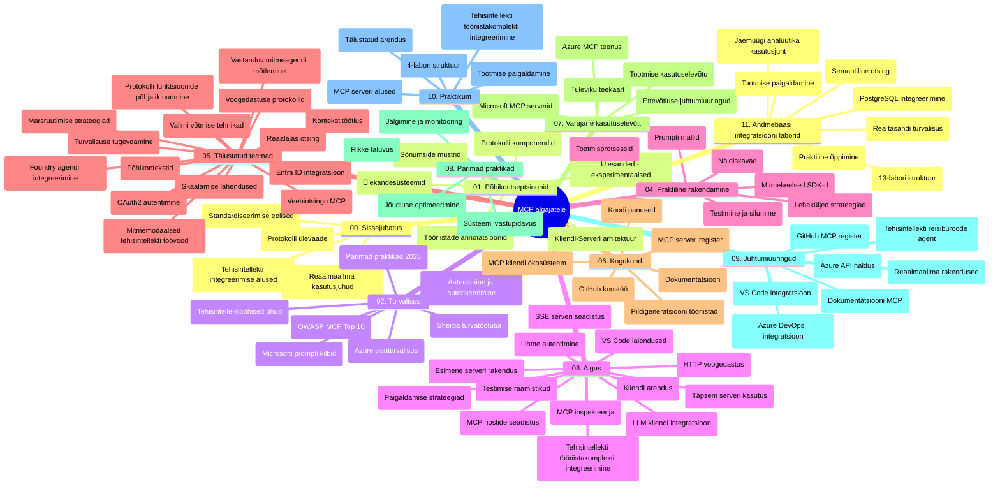

# Mudelikonteksti protokoll (MCP) algajatele – õppejuhend

See õppejuhend annab ülevaate hoidla struktuurist ja sisust "Mudelikonteksti protokoll (MCP) algajatele" õppekava raames. Kasuta seda juhendit, et navigeerida hoidlasse tõhusalt ja maksimaalselt ära kasutada saadaval olevaid ressursse.

## Hoidla ülevaade

Mudelikonteksti protokoll (MCP) on standardne raamistik tehisintellekti mudelite ja kliendirakenduste vahelistes suhtlustes. Algselt lõi selle Anthropic, kuid nüüd haldab MCP laiem kogukond ametliku GitHubi organisatsiooni kaudu. See hoidla pakub põhjalikku õppekava praktiliste koodinäidetega C#, Java, JavaScripti, Pythoni ja TypeScripti keeltes, mis on mõeldud tehisintellekti arendajatele, süsteemiarhitektidele ja tarkvarainseneridele.

## Visuaalne õppekava kaart

## Hoidla struktuur

Hoidla on organiseeritud ühteist põhiosasse, millest igaüks keskendub MCP erinevatele aspektidele:

1. **Sissejuhatus (00-Introduction/)**
   - Mudelikonteksti protokolli ülevaade
   - Miks standardiseerimine on AI torujuhtmetes oluline
   - Praktilised kasutusjuhud ja eelised

2. **Põhimõisted (01-CoreConcepts/)**
   - Kliendi-serveri arhitektuur
   - Põhikomponendid protokollis
   - Sõnumside mustrid MCP-s

3. **Turvalisus (02-Security/)**
   - Ohud MCP-põhistes süsteemides
   - Parimad tavad turvalise rakendamise tagamiseks
   - Autentimise ja autoriseerimise strateegiad
   - **Ülevaatlik turvalisuse dokumentatsioon**:
     - MCP turvatavad praktikad 2025
     - Azure sisu turvalisuse juhend
     - MCP turvakontrollid ja tehnoloogiad
     - MCP parimate tavade kiire ülevaade
   - **Olulised turvalisuse teemad**:
     - Käsu süstimine ja tööriistamürgituse rünnakud
     - Seansi ülevõtmine ja segaduses esindaja probleemid
     - Määratud päiste turvaavaldused
     - Liialdatud õigused ja ligipääsu kontroll
     - Tarnija ahela turvalisus AI komponentidele
     - Microsofti käsuvarjude integreerimine

4. **Algus (03-GettingStarted/)**
   - Keskkonna seadistamine ja konfiguratsioon
   - Lihtsate MCP serverite ja klientide loomine
   - Olemasolevate rakendustega integreerimine
   - Sisaldab sektsioone:
     - Esimene serveri rakendus
     - Kliendi arendus
     - LLM kliendi integreerimine
     - VS Code integreerimine
     - Server-Sent Events (SSE) server
     - Täiustatud serveri kasutamine
     - HTTP voogedastus
     - AI tööriistakomplekti integreerimine
     - Testimise strateegiad
     - Paigutamise juhised

5. **Praktiline rakendamine (04-PracticalImplementation/)**
   - SDK-de kasutamine erinevates programmeerimiskeeltes
   - Silumise, testimise ja valideerimise tehnikad
   - Taaskasutatavate käsumallide ja töövoogude loomine
   - Näidete projektid rakendustega

6. **Täiustatud teemad (05-AdvancedTopics/)**
   - Konteksti insenertehnikad
   - Foundry agendi integreerimine
   - Mitme modaaliga AI töövood
   - OAuth2 autentimise demo’d
   - Reaalajas otsinguvõimalused
   - Reaalajas voogedastus
   - Juurekontekstide rakendamine
   - Marsruutimise strateegiad
   - Proovivõtu tehnikad
   - Skaalimise meetodid
   - Turvalisuse kaalutlused
   - Entra ID turvalisuse integreerimine
   - Veebiotsingu integreerimine
   - Vastandlike mitmeagendi arutelu (debattimustrid)

7. **Kogukonna panused (06-CommunityContributions/)**
   - Kuidas panustada koodi ja dokumentatsiooni
   - Koostöö GitHubi kaudu
   - Kogukonna juhitud täiustused ja tagasiside
   - Erinevate MCP klientide kasutamine (Claude Desktop, Cline, VSCode)
   - Töö populaarsete MCP serveritega, sealhulgas pildigeneratsioon

8. **Õppetunnid varajasest kasutuselevõtust (07-LessonsfromEarlyAdoption/)**
   - Reaalmaailma rakendused ja edulood
   - MCP-põhiste lahenduste loomine ja juurutamine
   - Trendide ja tuleviku teeplaan
   - **Microsofti MCP serverite juhend**: põhjalik juhend 10 tootmiseks valmis Microsofti MCP serveri kohta, sealhulgas:
     - Microsoft Learn Docs MCP server
     - Azure MCP server (15+ spetsialiseeritud konnektorit)
     - GitHub MCP server
     - Azure DevOps MCP server
     - MarkItDown MCP server
     - SQL Server MCP server
     - Playwright MCP server
     - Dev Box MCP server
     - Microsoft Foundry MCP server
     - Microsoft 365 Agents Toolkit MCP server

9. **Parimad tavad (08-BestPractices/)**
   - Jõudluse reguleerimine ja optimeerimine
   - Vigade taluva MCP süsteemide kavandamine
   - Testimise ja vastupidavuse strateegiad

10. **Juhtumiuuringud (09-CaseStudy/)**
    - **Seitse põhjalikku juhtumiuuringut**, mis demonstreerivad MCP paindlikkust mitmetes stsenaariumites:
    - **Azure AI reisiagendid**: mitme agendi orkestreerimine Azure OpenAI ja AI Search abil
    - **Azure DevOps integratsioon**: töövoo automatiseerimine YouTube andmete uuendustega
    - **Reaalajas dokumentide päring**: Pythoni konsooliklient koos HTTP voogedastusega
    - **Interaktiivne õppekava generaator**: Chainlit veebirakendus vestlusAI-ga
    - **Toimetaja sees dokumentatsioon**: VS Code integreerimine GitHub Copiloti töövoogudega
    - **Azure API haldus**: ettevõtte API integratsioon MCP serveri loomisega
    - **GitHub MCP register**: ökosüsteemi arendus ja agentide integreerimisplatvorm
    - Rakendusnäited hõlmates ettevõtte integratsiooni, arendajate tootlikkust ja ökosüsteemi arengut

11. **Praktiline töötuba (10-StreamliningAIWorkflowsBuildingAnMCPServerWithAIToolkit/)**
    - Põhjalik praktiline töötuba, mis ühendab MCP koos AI tööriistakomplektiga
    - Nutikate rakenduste loomine, mis ühendavad AI mudelid reaalse maailma tööriistadega
    - Praktilised moodulid hõlmavad põhialuseid, kohandatud serveri arendust ja tootmisseadistamise strateegiaid
    - **Töötoa struktuur**:
      - Töötuba 1: MCP serveri põhialused
      - Töötuba 2: Täiustatud MCP serveri arendus
      - Töötuba 3: AI tööriistakomplekti integreerimine
      - Töötuba 4: Tootmisseadistus ja skaaleerimine
    - Töötoaline lähenemine samm-sammuliste juhistega

12. **MCP serveri andmebaasi integreerimise töötoad (11-MCPServerHandsOnLabs/)**
    - **Põhjalik 13-töötuba õppimise rada** tootmiseks valmis MCP serverite loomiseks koos PostgreSQL-i integreerimisega
    - **Reaalmaailma jaemüügi analüütika rakendus** kasutades Zava Retail kasutusjuhtu
    - **Ettevõtte tasemel mustrid**, sealhulgas Readi taseme turvalisus (RLS), semantiline otsing ja mitme rentniku andmepääs
    - **Töötoa täielik struktuur**:
      - **Töötoad 00-03: Põhitõed** – sissejuhatus, arhitektuur, turvalisus, keskkonna seadistamine
      - **Töötoad 04-06: MCP serveri ehitamine** – andmebaasi disain, MCP serveri rakendamine, tööriistade arendus
      - **Töötoad 07-09: Täiustatud funktsioonid** – semantiline otsing, testimine ja silumine, VS Code integreerimine
      - **Töötoad 10-12: Tootmine ja parimad tavad** – juurutamine, jälgimine, optimeerimine
    - **Kasutatud tehnoloogiad**: FastMCP raamistik, PostgreSQL, Azure OpenAI, Azure konteinerirakendused, Application Insights
    - **Õpitulemused**: tootmiseks valmis MCP serverid, andmebaasi integreerimise mustrid, AI-põhine analüüs, ettevõtte turvalisus

## Lisamaterjalid

Hoidla sisaldab tugimaterjale:

- **Pildikaust**: sisaldab diagramme ja illustratsioone, mida kasutatakse kogu õppekavas
- **Tõlked**: mitmekeelne tugi koos dokumentatsiooni automaatsete tõlgetega
- **Ametlikud MCP ressursid**:
  - [MCP dokumentatsioon](https://modelcontextprotocol.io/)
  - [MCP spetsifikatsioon](https://spec.modelcontextprotocol.io/)
  - [MCP GitHubi hoidla](https://github.com/modelcontextprotocol)

## Kuidas seda hoidlat kasutada

1. **Järkjärguline õppimine**: Järgi peatükke järjest (00 kuni 11) struktureeritud õppeks.
2. **Keelekohane fookus**: Kui oled huvitatud mõnest kindlast programmeerimiskeelest, uuri proovide kaustu oma eelistatud keeles.
3. **Praktiline rakendamine**: Alusta "Algus" osast, et seadistada oma keskkond ja luua esimene MCP server ja klient.
4. **Täiustatud uurimine**: Kui baasasi selged, sukeldud täiustatud teemadesse oma teadmiste laiendamiseks.
5. **Kogukonnas osalemine**: Liitu MCP kogukonnaga GitHubi arutelude ja Discordi kanalite kaudu, et ühenduda ekspertide ja kaasarendajatega.

## MCP kliendid ja tööriistad

Õppekava hõlmab mitmeid MCP kliente ja tööriistu:

1. **Ametlikud kliendid**:
   - Visual Studio Code
   - MCP Visual Studio Codes
   - Claude Desktop
   - Claude VSCode’s
   - Claude API

2. **Kogukonna kliendid**:
   - Cline (terminalipõhine)
   - Cursor (koodiredaktor)
   - ChatMCP
   - Windsurf

3. **MCP haldustööriistad**:
   - MCP CLI
   - MCP Manager
   - MCP Linker
   - MCP Router

## Populaarsed MCP serverid

Hoidla tutvustab erinevaid MCP servereid, sealhulgas:

1. **Ametlikud Microsofti MCP serverid**:
   - Microsoft Learn Docs MCP server
   - Azure MCP server (15+ spetsialiseeritud konnektorit)
   - GitHub MCP server
   - Azure DevOps MCP server
   - MarkItDown MCP server
   - SQL Server MCP server
   - Playwright MCP server
   - Dev Box MCP server
   - Microsoft Foundry MCP server
   - Microsoft 365 Agents Toolkit MCP server

2. **Ametlikud referentsserverid**:
   - Failisüsteem
   - Fetch
   - Mälu
   - Järjestikune mõtlemine

3. **Pildigeneratsioon**:
   - Azure OpenAI DALL-E 3
   - Stable Diffusion WebUI
   - Replicate

4. **Arendustööriistad**:
   - Git MCP
   - Terminali kontroll
   - Koodi assistent

5. **Spetsialiseeritud serverid**:
   - Salesforce
   - Microsoft Teams
   - Jira & Confluence

## Panustamine

See hoidla tervitab kogukonnast panustajaid. Vaata kogukonna panuste sektsiooni juhiste saamiseks, kuidas MCP ökosüsteemi tõhusalt täiendada.

----

*See õppejuhend uuendati viimati 5. veebruaril 2026, kajastades uusimat MCP Spetsifikatsiooni 2025-11-25 ning annab ülevaate hoidla seisust selle kuupäeva seisuga. Hoidla sisu võib seda kuupäeva järgselt muutuda.*

---

<!-- CO-OP TRANSLATOR DISCLAIMER START -->
**Lahtiütlus**:
See dokument on tõlgitud kasutades AI tõlketeenust [Co-op Translator](https://github.com/Azure/co-op-translator). Kuigi me püüdleme täpsuse poole, palun pange tähele, et automatiseeritud tõlgetes võib esineda vigu või ebatäpsusi. Originaaldokument selle emakeeles tuleks pidada autoriteetseks allikaks. Olulise teabe puhul soovitatakse kasutada professionaalset inimtõlget. Me ei vastuta selle tõlkega seotud eksimustest või valesti mõistmistest.
<!-- CO-OP TRANSLATOR DISCLAIMER END -->