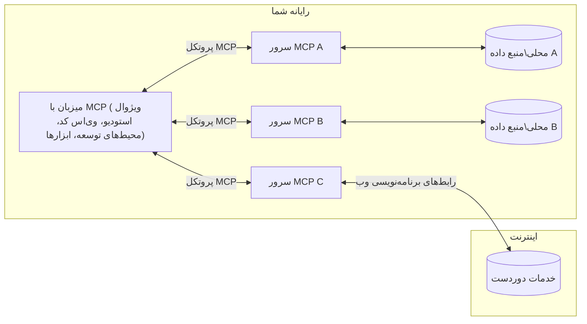

# مفاهیم پایه MCP: تسلط بر پروتکل زمینه مدل برای یکپارچه‌سازی هوش مصنوعی

[](https://youtu.be/earDzWGtE84)

_(برای مشاهده ویدیوی این درس روی تصویر بالا کلیک کنید)_

[پروتکل زمینه مدل (MCP)](https://github.com/modelcontextprotocol) چارچوبی قدرتمند و استاندارد است که ارتباط بین مدل‌های زبانی بزرگ (LLMها) و ابزارها، برنامه‌ها و منابع داده خارجی را بهینه می‌کند.  
این راهنما شما را با مفاهیم اصلی MCP آشنا می‌کند. شما با معماری کلاینت-سرور، اجزای حیاتی، سازوکارهای ارتباطی و بهترین روش‌های پیاده‌سازی آن آشنا خواهید شد.

- **رضایت صریح کاربر**: همه دسترسی‌ها و عملیات داده باید قبل از اجرا با رضایت صریح کاربر انجام شود. کاربران باید به‌وضوح بدانند به چه داده‌هایی دسترسی داده می‌شود و چه اقداماتی انجام خواهد شد، با کنترل دقیق بر مجوزها و سطوح دسترسی.

- **حفاظت از حریم خصوصی داده‌ها**: داده‌های کاربران فقط با رضایت صریح افشا می‌شوند و باید با کنترل‌های دسترسی قوی در کل چرخه تعامل محافظت شوند. پیاده‌سازی‌ها باید از انتقال غیرمجاز داده جلوگیری کرده و مرزهای سخت‌گیرانه حفظ حریم خصوصی را رعایت کنند.

- **ایمنی اجرای ابزارها**: هر فراخوانی ابزار نیازمند رضایت صریح کاربر با درک کامل از عملکرد، پارامترها و تأثیر احتمالی ابزار است. مرزهای امنیتی قوی باید از اجرای ناخواسته، ناایمن یا مخرب ابزارها جلوگیری کنند.

- **امنیت لایه انتقال**: همه کانال‌های ارتباطی باید از رمزنگاری و مکانیزم‌های احراز هویت مناسب استفاده کنند. اتصالات راه دور باید پروتکل‌های انتقال ایمن و مدیریت اعتبارنامه مناسب را پیاده‌سازی کنند.

#### رهنمودهای پیاده‌سازی:

- **مدیریت مجوزها**: سیستم‌های مجوزدهی دقیق را پیاده‌سازی کنید که به کاربران اجازه کنترل سرورها، ابزارها و منابع قابل دسترسی را بدهد  
- **احراز هویت و مجوزدهی**: از روش‌های احراز هویت امن (OAuth، کلیدهای API) با مدیریت صحیح توکن‌ها و انقضا استفاده کنید  
- **اعتبارسنجی ورودی**: همه پارامترها و داده‌های ورودی را طبق طرح‌های مشخص شده اعتبارسنجی کنید تا از حملات تزریقی جلوگیری شود  
- **ثبت لاگ‌های ممیزی**: لاگ‌های کامل همه عملیات را برای مانیتورینگ امنیتی و انطباق حفظ کنید

## مرور کلی

این درس به بررسی معماری بنیادی و اجزایی می‌پردازد که اکوسیستم پروتکل زمینه مدل (MCP) را شکل می‌دهند. شما با معماری کلاینت-سرور، اجزای کلیدی و مکانیزم‌های ارتباطی که تعاملات MCP را توانمند می‌سازند آشنا خواهید شد.

## اهداف کلیدی یادگیری

تا پایان این درس، شما قادر خواهید بود:

- معماری کلاینت-سرور MCP را درک کنید.  
- نقش‌ها و مسئولیت‌های میزبان‌ها، کلاینت‌ها و سرورها را شناسایی کنید.  
- ویژگی‌های اصلی که MCP را به یک لایه یکپارچه‌سازی انعطاف‌پذیر تبدیل می‌کند، تحلیل کنید.  
- نحوه جریان اطلاعات در اکوسیستم MCP را بیاموزید.  
- از طریق مثال‌های کد در .NET، Java، Python و JavaScript، دانش عملی کسب کنید.

## معماری MCP: نگاهی دقیق‌تر

اکوسیستم MCP بر مبنای مدل کلاینت-سرور ساخته شده است. این ساختار مدولار به برنامه‌های هوش مصنوعی اجازه می‌دهد تا با ابزارها، پایگاه‌های داده، APIها و منابع متنی به طور کارآمد تعامل کنند. در ادامه این معماری را به اجزای اصلی آن تقسیم می‌کنیم.

در اصل، MCP از معماری کلاینت-سرور پیروی می‌کند که در آن یک برنامه میزبان می‌تواند به چندین سرور متصل شود:


- **میزبان‌های MCP**: برنامه‌هایی مثل VSCode، Claude Desktop، محیط‌های توسعه یا ابزارهای هوش مصنوعی که می‌خواهند به داده‌ها از طریق MCP دسترسی داشته باشند  
- **کلاینت‌های MCP**: کلاینت‌های پروتکل که ارتباط ۱:۱ با سرورها برقرار می‌کنند  
- **سرورهای MCP**: برنامه‌های سبک‌وزنی که هرکدام قابلیت‌های خاصی را از طریق پروتکل استاندارد شده مدل زمینه ارائه می‌دهند  
- **منابع داده محلی**: فایل‌ها، پایگاه داده‌ها و خدمات کامپیوتر شما که سرورهای MCP می‌توانند با امنیت به آن‌ها دسترسی داشته باشند  
- **خدمات راه دور**: سیستم‌های خارجی قابل دسترسی از طریق اینترنت که سرورهای MCP می‌توانند از طریق API به آن‌ها متصل شوند.

پروتکل MCP استاندارد در حال توسعه است که از نسخه‌بندی مبتنی بر تاریخ (فرمت YYYY-MM-DD) استفاده می‌کند. نسخه فعلی پروتکل **2025-11-25** است. آخرین به‌روزرسانی‌ها را می‌توانید در [مشخصات پروتکل](https://modelcontextprotocol.io/specification/2025-11-25/) مشاهده کنید.

### ۱. میزبان‌ها

در پروتکل زمینه مدل (MCP)، **میزبان‌ها** برنامه‌های هوش مصنوعی هستند که به‌عنوان رابط اصلی کاربران برای تعامل با پروتکل عمل می‌کنند. میزبان‌ها ارتباط با چندین سرور MCP را مدیریت کرده و برای هر اتصال سرور، کلاینت MCP مخصوص ایجاد می‌کنند. نمونه‌هایی از میزبان‌ها عبارتند از:

- **برنامه‌های هوش مصنوعی**: Claude Desktop، Visual Studio Code، Claude Code  
- **محیط‌های توسعه**: IDEها و ویرایشگرهای کد دارای یکپارچه‌سازی MCP  
- **برنامه‌های سفارشی**: عوامل و ابزارهای هوش مصنوعی مخصوص ساخته‌شده

**میزبان‌ها** برنامه‌هایی هستند که تعاملات مدل هوش مصنوعی را هماهنگ می‌کنند. وظایف آن‌ها عبارتند از:

- **هماهنگی مدل‌های هوش مصنوعی**: اجرای مدل‌های زبانی یا تعامل با آن‌ها برای تولید پاسخ‌ها و هماهنگی جریان‌های کاری هوش مصنوعی  
- **مدیریت ارتباط کلاینت**: ایجاد و نگهداری یک کلاینت MCP برای هر اتصال سرور MCP  
- **کنترل رابط کاربری**: مدیریت جریان گفتگوها، تعاملات کاربر و نمایش پاسخ‌ها  
- **اجرای سیاست‌های امنیتی**: کنترل مجوزها، محدودیت‌های امنیتی و احراز هویت  
- **مدیریت رضایت کاربر**: دریافت و مدیریت تأیید کاربر برای به اشتراک‌گذاری داده‌ها و اجرای ابزارها

### ۲. کلاینت‌ها

**کلاینت‌ها** اجزای حیاتی هستند که ارتباطات اختصاصی یک‌به‌یک بین میزبان‌ها و سرورهای MCP را برقرار می‌کنند. هر کلاینت MCP توسط میزبان برای اتصال به یک سرور خاص ایجاد می‌شود که کانال‌های ارتباطی سازمان‌یافته و امن را تضمین می‌کند. وجود چند کلاینت به میزبان‌ها اجازه می‌دهد همزمان به چندین سرور متصل شوند.

**کلاینت‌ها** اجزای اتصال‌دهنده در برنامه میزبان هستند. وظایف آن‌ها عبارتند از:

- **ارتباط پروتکل**: ارسال درخواست‌های JSON-RPC 2.0 به سرورها با اعلان‌ها و دستورالعمل‌ها  
- **مذاکره قابلیت‌ها**: مذاکره درباره ویژگی‌های پشتیبانی شده و نسخه‌های پروتکل با سرورها در زمان اولیه‌سازی  
- **اجرای ابزار**: مدیریت درخواست‌های اجرای ابزار از مدل‌ها و پردازش پاسخ‌ها  
- **به‌روزرسانی‌های بلادرنگ**: دریافت اعلان‌ها و به‌روزرسانی‌های لحظه‌ای از سرورها  
- **پردازش پاسخ‌ها**: پردازش و قالب‌بندی پاسخ‌های سرور برای نمایش به کاربران

### ۳. سرورها

**سرورها** برنامه‌هایی هستند که زمینه، ابزارها و قابلیت‌ها را به کلاینت‌های MCP ارائه می‌دهند. آن‌ها می‌توانند به صورت محلی (روی همان ماشین میزبان) یا از راه دور (روی پلتفرم‌های خارجی) اجرا شوند و مسئول رسیدگی به درخواست‌های کلاینت و ارائه پاسخ‌های ساخت‌یافته هستند. سرورها عملکردهای خاصی را از طریق پروتکل استاندارد شده مدل زمینه ارائه می‌کنند.

**سرورها** خدماتی هستند که زمینه و قابلیت‌ها را فراهم می‌کنند. وظایف آن‌ها عبارت است از:

- **ثبت قابلیت‌ها**: ثبت و در معرض قرار دادن منابع، اعلان‌ها و ابزارهای موجود به کلاینت‌ها  
- **پردازش درخواست‌ها**: دریافت و اجرای فراخوان‌های ابزار، درخواست‌های منبع و اعلان‌ها از کلاینت‌ها  
- **ارائه زمینه**: فراهم‌سازی اطلاعات زمینه‌ای و داده برای بهبود پاسخ‌های مدل  
- **مدیریت وضعیت**: حفظ وضعیت جلسه و مدیریت تعاملات حالت‌دار در صورت نیاز  
- **اطلاع‌رسانی بلادرنگ**: ارسال اعلان‌هایی درباره تغییرات قابلیت‌ها و به‌روزرسانی‌ها به کلاینت‌های متصل  

سرورها می‌توانند توسط هر کسی ساخته شوند تا قابلیت‌های مدل را با ویژگی‌های تخصصی گسترش دهند و از هر دو حالت استقرار محلی و راه دور پشتیبانی می‌کنند.

### ۴. ابتدایی‌های سرور

در پروتکل زمینه مدل (MCP)، سرورها سه **ابتدایی** اصلی ارائه می‌دهند که بلوک‌های سازنده بنیادین برای تعاملات غنی بین کلاینت‌ها، میزبان‌ها و مدل‌های زبانی را تعریف می‌کنند. این ابتدایی‌ها انواع اطلاعات زمینه‌ای و اقدامات قابل دسترسی از طریق پروتکل را مشخص می‌کنند.

سرورهای MCP می‌توانند هر ترکیبی از سه ابتدایی زیر را ارائه دهند:

#### منابع

**منابع**، منابع داده‌ای هستند که اطلاعات زمینه‌ای به برنامه‌های هوش مصنوعی ارائه می‌دهند. آن‌ها نمایانگر محتوای ایستا یا پویا هستند که درک و تصمیم‌گیری مدل را تقویت می‌کنند:

- **داده‌های زمینه‌ای**: اطلاعات ساخت‌یافته و زمینه برای مصرف مدل هوش مصنوعی  
- **پایگاه‌های دانش**: مخازن اسناد، مقالات، راهنماها و مقالات پژوهشی  
- **منابع داده محلی**: فایل‌ها، پایگاه داده‌ها و اطلاعات سیستم محلی  
- **داده‌های خارجی**: پاسخ‌های API، خدمات وب و داده‌های سیستم راه دور  
- **محتوای پویا**: داده‌های زمان واقعی که بر اساس شرایط خارجی به‌روزرسانی می‌شوند

منابع با URI مشخص می‌شوند و از طریق متدهای `resources/list` برای کشف و `resources/read` برای بازیابی پشتیبانی می‌شوند:

```text
file://documents/project-spec.md
database://production/users/schema
api://weather/current
```

#### اعلان‌ها

**اعلان‌ها** قالب‌های قابل استفاده مجددی هستند که به ساختاردهی تعاملات با مدل‌های زبانی کمک می‌کنند. آن‌ها الگوهای تعاملی استاندارد شده و جریان‌های کاری قالب‌بندی شده را ارائه می‌دهند:

- **تعاملات بر پایه قالب**: پیام‌ها و شروع‌کننده‌های مکالمه از پیش ساختار یافته  
- **قالب‌های جریان کاری**: توالی‌های استاندارد برای کارها و تعاملات رایج  
- **مثال‌های چند نمونه‌ای**: قالب‌های مبتنی بر نمونه برای آموزش مدل  
- **اعلان‌های سیستمی**: اعلان‌های بنیادینی که رفتار و زمینه مدل را تعریف می‌کنند  
- **قالب‌های پویا**: اعلان‌های پارامتردهی شده که با زمینه‌های خاص تطبیق می‌یابند

اعلان‌ها از جایگزینی متغیر پشتیبانی می‌کنند و می‌توان آن‌ها را از طریق `prompts/list` کشف و با `prompts/get` بازیابی کرد:

```markdown
Generate a {{task_type}} for {{product}} targeting {{audience}} with the following requirements: {{requirements}}
```

#### ابزارها

**ابزارها** توابع اجرایی هستند که مدل‌های هوش مصنوعی می‌توانند برای انجام اقدامات خاص فراخوانی کنند. آن‌ها "افعال" اکوسیستم MCP را تشکیل می‌دهند و به مدل‌ها امکان تعامل با سیستم‌های خارجی را می‌دهند:

- **توابع اجرایی**: عملیات گسسته‌ای که مدل‌ها می‌توانند با پارامترهای مشخص فراخوانی کنند  
- **یکپارچه‌سازی سیستم خارجی**: فراخوانی‌های API، پرس‌وجوی پایگاه داده، عملیات فایل، محاسبات  
- **هویت یکتا**: هر ابزار نام، توضیح و طرح پارامتر خاص خود را دارد  
- **ورودی/خروجی ساختارمند**: ابزارها پارامترهای اعتبارسنجی شده را می‌پذیرند و پاسخ‌های ساختارمند و تایپ شده بازمی‌گردانند  
- **قابلیت انجام عملیات**: به مدل‌ها امکان انجام اقدامات دنیای واقعی و بازیابی داده‌های زنده را می‌دهد

ابزارها با JSON Schema برای اعتبارسنجی پارامتر تعریف شده و از طریق `tools/list` کشف و با `tools/call` اجرا می‌شوند. ابزارها می‌توانند دارای **آیکون‌ها** به‌عنوان متادیتای اضافی برای بهبود ارائه UI باشند.

**حاشیه‌نویسی ابزار**: ابزارها از حاشیه‌نویسی‌های رفتاری (مثلاً `readOnlyHint`، `destructiveHint`) پشتیبانی می‌کنند که توضیح می‌دهد آیا ابزار فقط خواندنی یا مخرب است، که به کلاینت‌ها کمک می‌کند تصمیم‌گیری بهتری درباره اجرای ابزار داشته باشند.

نمونه تعریف ابزار:

```typescript
server.tool(
  "search_products", 
  {
    query: z.string().describe("Search query for products"),
    category: z.string().optional().describe("Product category filter"),
    max_results: z.number().default(10).describe("Maximum results to return")
  }, 
  async (params) => {
    // جستجو را اجرا کنید و نتایج ساخت‌یافته را بازگردانید
    return await productService.search(params);
  }
);
```

## ابتدایی‌های کلاینت

در پروتکل زمینه مدل (MCP)، **کلاینت‌ها** می‌توانند ابتدایی‌هایی را ارائه دهند که به سرورها اجازه می‌دهد قابلیت‌های اضافی از برنامه میزبان درخواست کنند. این ابتدایی‌های سمت کلاینت امکان پیاده‌سازی‌های سرور غنی‌تر و تعاملی‌تر را فراهم می‌کنند که می‌توانند به قابلیت‌های مدل هوش مصنوعی و تعاملات کاربران دسترسی داشته باشند.

### نمونه‌گیری

**نمونه‌گیری** به سرورها اجازه می‌دهد درخواست تکمیل مدل زبان از برنامه هوش مصنوعی کلاینت را ارسال کنند. این ابتدایی به سرورها اجازه می‌دهد بدون داشتن وابستگی به SDK مدل خود، به قابلیت‌های LLM دسترسی پیدا کنند:

- **دسترسی مستقل از مدل**: سرورها می‌توانند بدون گنجاندن SDK مدل یا مدیریت دسترسی به مدل، درخواست تکمیل ارسال کنند  
- **هوش مصنوعی مبتنی بر سرور**: اجازه تولید محتوا به‌صورت خودکار توسط سرورها با استفاده از مدل هوش مصنوعی کلاینت  
- **تعاملات بازگشتی LLM**: پشتیبانی از سناریوهای پیچیده که در آن سرورها برای پردازش به کمک هوش مصنوعی نیاز دارند  
- **تولید محتوای پویا**: به سرورها امکان ایجاد پاسخ‌های متنی با استفاده از مدل میزبان را می‌دهد  
- **پشتیبانی از فراخوانی ابزار**: سرورها می‌توانند پارامترهای `tools` و `toolChoice` را اضافه کنند تا مدل کلاینت بتواند در هنگام نمونه‌گیری ابزارها را فراخوانی کند

نمونه‌گیری از طریق متد `sampling/complete` آغاز می‌شود، جایی که سرورها درخواست تکمیل را به کلاینت‌ها ارسال می‌کنند.

### ریشه‌ها

**ریشه‌ها** روش استانداردی را برای کلاینت‌ها فراهم می‌کنند تا مرزهای سامانه فایل را به سرورها نمایش دهند، به سرورها کمک می‌کند بفهمند به کدام دایرکتوری‌ها و فایل‌ها دسترسی دارند:

- **مرزهای سامانه فایل**: تعیین حدود قایل فعالیت سرورها در سیستم فایل  
- **کنترل دسترسی**: کمک به سرورها برای فهمیدن اینکه اجازه دسترسی به کدام دایرکتوری‌ها و فایل‌ها را دارند  
- **به‌روزرسانی‌های پویا**: کلاینت‌ها می‌توانند هنگامی‌که فهرست ریشه‌ها تغییر می‌کند، سرورها را مطلع کنند  
- **شناسایی مبتنی بر URI**: ریشه‌ها از URIهای `file://` برای شناسایی دایرکتوری‌ها و فایل‌های قابل دسترسی استفاده می‌کنند

ریشه‌ها از طریق متد `roots/list` کشف می‌شوند، و کلاینت‌ها هنگام تغییر، اعلان `notifications/roots/list_changed` را ارسال می‌کنند.

### درخواست اطلاعات

**درخواست اطلاعات** به سرورها امکان می‌دهد از طریق رابط کلاینت، اطلاعات بیشتر یا تأییدیه از کاربران درخواست کنند:

- **درخواست ورودی کاربر**: سرورها می‌توانند درخواست اطلاعات بیشتر در صورت نیاز به اجرای ابزار ارسال کنند  
- **دیالوگ‌های تأیید**: درخواست رضایت کاربر برای عملیات حساس یا تأثیرگذار  
- **جریان‌های کاری تعاملی**: امکان ایجاد تعاملات گام‌به‌گام کاربر توسط سرورها  
- **جمع‌آوری پویا پارامترها**: جمع‌آوری پارامترهای ناقص یا اختیاری در طول اجرای ابزار

درخواست‌های اطلاعات از طریق متد `elicitation/request` ارسال می‌شوند تا ورودی‌های کاربر از طریق رابط کلاینت جمع‌آوری شود.

**درخواست URL**: سرورها همچنین می‌توانند تعاملات کاربر مبتنی بر URL را درخواست کنند تا کاربران را به صفحات وب خارجی برای احراز هویت، تأیید یا ورود داده هدایت کنند.

### ثبت لاگ

**ثبت لاگ** به سرورها اجازه می‌دهد پیام‌های لاگ ساخت‌یافته به کلاینت‌ها برای دیباگ، نظارت و شفافیت عملیاتی ارسال کنند:

- **پشتیبانی دیباگ**: امکان ارائه لاگ‌های اجرای دقیق برای عیب‌یابی توسط سرورها  
- **نظارت عملیاتی**: ارسال به‌روزرسانی وضعیت و معیارهای عملکرد به کلاینت‌ها  
- **گزارش خطا**: ارائه زمینه و اطلاعات تشخیصی دقیق خطا  
- **ردپای حسابرسی**: ایجاد لاگ‌های جامع عملیات و تصمیمات سرور

پیام‌های لاگ به کلاینت‌ها ارسال می‌شوند تا شفافیت عملکرد سرور افزایش یافته و دیباگ تسهیل شود.

## جریان اطلاعات در MCP

پروتکل زمینه مدل (MCP) یک جریان ساخت‌یافته از اطلاعات بین میزبان‌ها، کلاینت‌ها، سرورها و مدل‌ها تعریف می‌کند. درک این جریان به روشن شدن نحوه پردازش درخواست‌های کاربر و نحوه یکپارچه‌سازی ابزارها و داده‌های خارجی در پاسخ‌های مدل کمک می‌کند.
- **راه‌اندازی اتصال توسط میزبان**  
  برنامه میزبان (مانند یک IDE یا رابط چت) اتصال به سرور MCP را برقرار می‌کند، معمولاً از طریق STDIO، WebSocket، یا یک انتقال پشتیبانی‌شده دیگر.

- **مذاکره قابلیت‌ها**  
  کلاینت (که در میزبان تعبیه شده) و سرور اطلاعاتی درباره ویژگی‌ها، ابزارها، منابع و نسخه‌های پروتکل پشتیبانی‌شده را تبادل می‌کنند. این اطمینان حاصل می‌کند که هر دو طرف درک مشترکی از قابلیت‌های موجود برای جلسه دارند.

- **درخواست کاربر**  
  کاربر با میزبان تعامل می‌کند (مثلاً ورودی یک درخواست یا فرمان را وارد می‌کند). میزبان این ورودی را جمع‌آوری و به کلاینت برای پردازش می‌فرستد.

- **استفاده از منبع یا ابزار**  
  - کلاینت ممکن است درخواست زمینه یا منابع اضافی از سرور (مانند فایل‌ها، ورودی‌های پایگاه داده، یا مقالات دانش‌بنیان) کند تا درک مدل را غنی‌تر سازد.  
  - اگر مدل تشخیص دهد که ابزاری نیاز است (مثلاً برای بازیابی داده، انجام محاسبه، یا فراخوانی API)، کلاینت درخواست فراخوانی ابزار را به سرور ارسال می‌کند و نام ابزار و پارامترها را مشخص می‌کند.

- **اجرای سرور**  
  سرور درخواست منبع یا ابزار را دریافت می‌کند، عملیات لازم (مانند اجرای یک تابع، پرس‌وجوی پایگاه داده، یا بازیابی یک فایل) را انجام داده و نتایج را به صورت ساختاریافته به کلاینت بازمی‌گرداند.

- **تولید پاسخ**  
  کلاینت پاسخ‌های سرور (داده‌های منبع، خروجی ابزار و غیره) را در تعامل جاری مدل ادغام می‌کند. مدل از این اطلاعات برای تولید پاسخی جامع و مرتبط با زمینه استفاده می‌کند.

- **ارائه نتیجه**  
  میزبان خروجی نهایی را از کلاینت دریافت و به کاربر نشان می‌دهد، معمولاً شامل متن تولیدشده توسط مدل و همچنین نتایج اجرای ابزار یا جستجوی منابع است.

این جریان به MCP امکان می‌دهد تا از برنامه‌های هوش مصنوعی پیشرفته، تعاملی و آگاه به زمینه پشتیبانی کند، با اتصال بی‌وقفه مدل‌ها به ابزارها و منابع داده خارجی.

## معماری و لایه‌های پروتکل

MCP از دو لایه معماری متمایز تشکیل شده است که با هم همکاری می‌کنند تا یک چارچوب ارتباطی کامل را فراهم سازند:

### لایه داده

لایه داده، پروتکل اصلی MCP را با استفاده از **JSON-RPC 2.0** به عنوان پایه پیاده‌سازی می‌کند. این لایه ساختار، معناشناسی و الگوهای تعامل پیام‌ها را تعریف می‌کند:

#### اجزای اصلی:

- **پروتکل JSON-RPC 2.0**: تمام ارتباطات از فرمت پیام استاندارد JSON-RPC 2.0 برای فراخوانی روش‌ها، پاسخ‌ها و اعلان‌ها استفاده می‌کند  
- **مدیریت چرخه عمر**: مدیریت راه‌اندازی اتصال، مذاکره قابلیت‌ها و خاتمه جلسه بین کلاینت‌ها و سرورها  
- **اصول سرور**: امکان ارائه عملکرد اصلی سرورها از طریق ابزارها، منابع و درخواست‌ها را فراهم می‌کند  
- **اصول کلاینت**: امکان درخواست نمونه‌گیری از مدل‌های بزرگ زبان (LLM)، دریافت ورودی کاربر و ارسال پیام‌های لاگ به سرورها را می‌دهد  
- **اعلان‌های بلادرنگ**: پشتیبانی از اطلاع‌رسانی‌های ناهمزمان برای به‌روزرسانی‌های پویا بدون نیاز به پرس‌وجو

#### ویژگی‌های کلیدی:

- **مذاکره نسخه پروتکل**: از نسخه‌بندی مبتنی بر تاریخ (YYYY-MM-DD) برای تضمین سازگاری استفاده می‌کند  
- **کشف قابلیت**: کلاینت‌ها و سرورها در هنگام راه‌اندازی اطلاعات ویژگی‌های پشتیبانی‌شده را تبادل می‌کنند  
- **جلسات حالت‌دار**: حفظ حالت اتصال در چندین تعامل برای تداوم زمینه

### لایه انتقال

لایه انتقال کانال‌های ارتباطی، قالب‌بندی پیام و احراز هویت بین شرکت‌کنندگان MCP را مدیریت می‌کند:

#### مکانیزم‌های انتقال پشتیبانی‌شده:

1. **انتقال STDIO**:  
   - از جریان‌های ورودی/خروجی استاندارد برای ارتباط مستقیم فرآیند استفاده می‌کند  
   - بهینه برای فرآیندهای محلی روی یک دستگاه با بدون سربار شبکه  
   - معمولاً برای پیاده‌سازی سرورهای محلی MCP استفاده می‌شود

2. **انتقال HTTP قابل پخش (Streamable HTTP)**:  
   - از HTTP POST برای پیام‌های کلاینت به سرور استفاده می‌کند  
   - پشتیبانی اختیاری از Server-Sent Events (SSE) برای پخش پیام سرور به کلاینت  
   - امکان ارتباط سرور از راه دور در شبکه‌ها  
   - پشتیبانی از احراز هویت استاندارد HTTP (توکن‌های bearer، کلیدهای API، هدرهای سفارشی)  
   - MCP توصیه می‌کند برای احراز هویت امن مبتنی بر توکن از OAuth استفاده شود

#### انتزاع انتقال:

لایه انتقال جزئیات ارتباطات را از لایه داده جدا می‌کند، به طوری که همان فرمت پیام JSON-RPC 2.0 را در همه مکانیزم‌های انتقال ممکن می‌سازد. این انتزاع به برنامه‌ها امکان می‌دهد به آسانی بین سرورهای محلی و راه دور جابجا شوند.

### ملاحظات امنیتی

پیاده‌سازی‌های MCP باید به چندین اصل حیاتی امنیتی پایبند باشند تا تعاملات ایمن، قابل اعتماد و مطمئن در تمام عملیات پروتکل تضمین شود:

- **رضایت و کنترل کاربر**: کاربران باید پیش از دسترسی به داده‌ها یا انجام عملیات، رضایت صریح خود را اعلام کنند. آن‌ها باید کنترل روشنی بر داده‌های به اشتراک گذاشته شده و اقدامات مجاز داشته باشند، که توسط رابط‌های کاربری شهودی برای بازبینی و تأیید فعالیت‌ها پشتیبانی می‌شود.

- **حریم خصوصی داده‌ها**: داده‌های کاربر فقط با رضایت صریح افشا شود و باید توسط کنترل‌های دسترسی مناسب محافظت گردد. پیاده‌سازی‌های MCP باید از انتقال غیرمجاز داده جلوگیری کرده و حفظ حریم خصوصی را در تمام تعاملات تضمین کنند.

- **ایمنی ابزار**: پیش از فراخوانی هر ابزاری، باید رضایت صریح کاربر گرفته شود. کاربران باید درک واضحی از عملکرد هر ابزار داشته باشند و مرزهای امنیتی محکمی وضع شود تا از اجرای ناخواسته یا ناامن ابزار جلوگیری گردد.

با رعایت این اصول امنیتی، MCP اعتماد، حریم خصوصی و ایمنی کاربران را در تمامی تعاملات پروتکل حفظ می‌کند و در عین حال ادغام‌های قدرتمند هوش مصنوعی را امکان‌پذیر می‌سازد.

## مثال‌های کد: اجزای کلیدی

زیر چند نمونه کد در زبان‌های برنامه‌نویسی محبوب ارائه شده که نحوه پیاده‌سازی اجزای کلیدی سرور MCP و ابزارها را نشان می‌دهد.

### نمونه .NET: ایجاد یک سرور MCP ساده با ابزارها

در اینجا یک نمونه کد عملی در .NET نشان داده شده که نحوه پیاده‌سازی یک سرور MCP ساده با ابزارهای سفارشی را نمایان می‌کند. این مثال چگونگی تعریف و ثبت ابزارها، رسیدگی به درخواست‌ها و اتصال سرور با استفاده از پروتکل مدل زمینه را نمایش می‌دهد.

```csharp
using System;
using System.Threading.Tasks;
using ModelContextProtocol.Server;
using ModelContextProtocol.Server.Transport;
using ModelContextProtocol.Server.Tools;

public class WeatherServer
{
    public static async Task Main(string[] args)
    {
        // Create an MCP server
        var server = new McpServer(
            name: "Weather MCP Server",
            version: "1.0.0"
        );
        
        // Register our custom weather tool
        server.AddTool<string, WeatherData>("weatherTool", 
            description: "Gets current weather for a location",
            execute: async (location) => {
                // Call weather API (simplified)
                var weatherData = await GetWeatherDataAsync(location);
                return weatherData;
            });
        
        // Connect the server using stdio transport
        var transport = new StdioServerTransport();
        await server.ConnectAsync(transport);
        
        Console.WriteLine("Weather MCP Server started");
        
        // Keep the server running until process is terminated
        await Task.Delay(-1);
    }
    
    private static async Task<WeatherData> GetWeatherDataAsync(string location)
    {
        // This would normally call a weather API
        // Simplified for demonstration
        await Task.Delay(100); // Simulate API call
        return new WeatherData { 
            Temperature = 72.5,
            Conditions = "Sunny",
            Location = location
        };
    }
}

public class WeatherData
{
    public double Temperature { get; set; }
    public string Conditions { get; set; }
    public string Location { get; set; }
}
```

### نمونه Java: اجزای سرور MCP

این مثال همان سرور MCP و ثبت ابزارهای نمونه .NET بالا را نشان می‌دهد، اما با جاوا پیاده‌سازی شده است.

```java
import io.modelcontextprotocol.server.McpServer;
import io.modelcontextprotocol.server.McpToolDefinition;
import io.modelcontextprotocol.server.transport.StdioServerTransport;
import io.modelcontextprotocol.server.tool.ToolExecutionContext;
import io.modelcontextprotocol.server.tool.ToolResponse;

public class WeatherMcpServer {
    public static void main(String[] args) throws Exception {
        // ایجاد یک سرور MCP
        McpServer server = McpServer.builder()
            .name("Weather MCP Server")
            .version("1.0.0")
            .build();
            
        // ثبت یک ابزار آب و هوا
        server.registerTool(McpToolDefinition.builder("weatherTool")
            .description("Gets current weather for a location")
            .parameter("location", String.class)
            .execute((ToolExecutionContext ctx) -> {
                String location = ctx.getParameter("location", String.class);
                
                // دریافت داده‌های آب و هوا (ساده شده)
                WeatherData data = getWeatherData(location);
                
                // بازگرداندن پاسخ قالب‌بندی شده
                return ToolResponse.content(
                    String.format("Temperature: %.1f°F, Conditions: %s, Location: %s", 
                    data.getTemperature(), 
                    data.getConditions(), 
                    data.getLocation())
                );
            })
            .build());
        
        // اتصال سرور با استفاده از انتقال stdio
        try (StdioServerTransport transport = new StdioServerTransport()) {
            server.connect(transport);
            System.out.println("Weather MCP Server started");
            // نگه داشتن سرور در حال اجرا تا زمان پایان فرایند
            Thread.currentThread().join();
        }
    }
    
    private static WeatherData getWeatherData(String location) {
        // پیاده‌سازی با فراخوانی یک API آب و هوا انجام می‌شود
        // برای اهداف نمونه ساده شده است
        return new WeatherData(72.5, "Sunny", location);
    }
}

class WeatherData {
    private double temperature;
    private String conditions;
    private String location;
    
    public WeatherData(double temperature, String conditions, String location) {
        this.temperature = temperature;
        this.conditions = conditions;
        this.location = location;
    }
    
    public double getTemperature() {
        return temperature;
    }
    
    public String getConditions() {
        return conditions;
    }
    
    public String getLocation() {
        return location;
    }
}
```

### نمونه Python: ساخت یک سرور MCP

این مثال از fastmcp استفاده می‌کند، لطفاً ابتدا آن را نصب کنید:

```python
pip install fastmcp
```
نمونه کد:

```python
#!/usr/bin/env python3
import asyncio
from fastmcp import FastMCP
from fastmcp.transports.stdio import serve_stdio

# یک سرور FastMCP ایجاد کنید
mcp = FastMCP(
    name="Weather MCP Server",
    version="1.0.0"
)

@mcp.tool()
def get_weather(location: str) -> dict:
    """Gets current weather for a location."""
    return {
        "temperature": 72.5,
        "conditions": "Sunny",
        "location": location
    }

# رویکرد جایگزین با استفاده از یک کلاس
class WeatherTools:
    @mcp.tool()
    def forecast(self, location: str, days: int = 1) -> dict:
        """Gets weather forecast for a location for the specified number of days."""
        return {
            "location": location,
            "forecast": [
                {"day": i+1, "temperature": 70 + i, "conditions": "Partly Cloudy"}
                for i in range(days)
            ]
        }

# ثبت ابزارهای کلاس
weather_tools = WeatherTools()

# سرور را راه‌اندازی کنید
if __name__ == "__main__":
    asyncio.run(serve_stdio(mcp))
```

### نمونه JavaScript: ایجاد یک سرور MCP

این مثال ایجاد سرور MCP با زبان JavaScript و نحوه ثبت دو ابزار مرتبط با آب و هوا را نشان می‌دهد.

```javascript
// استفاده از SDK رسمی پروتکل مدل کانتکست
import { McpServer } from "@modelcontextprotocol/sdk/server/mcp.js";
import { StdioServerTransport } from "@modelcontextprotocol/sdk/server/stdio.js";
import { z } from "zod"; // برای اعتبارسنجی پارامترها

// ایجاد یک سرور MCP
const server = new McpServer({
  name: "Weather MCP Server",
  version: "1.0.0"
});

// تعریف یک ابزار هواشناسی
server.tool(
  "weatherTool",
  {
    location: z.string().describe("The location to get weather for")
  },
  async ({ location }) => {
    // این معمولاً یک API هواشناسی را صدا می‌زند
    // ساده‌سازی شده برای نمایش
    const weatherData = await getWeatherData(location);
    
    return {
      content: [
        { 
          type: "text", 
          text: `Temperature: ${weatherData.temperature}°F, Conditions: ${weatherData.conditions}, Location: ${weatherData.location}` 
        }
      ]
    };
  }
);

// تعریف یک ابزار پیش‌بینی
server.tool(
  "forecastTool",
  {
    location: z.string(),
    days: z.number().default(3).describe("Number of days for forecast")
  },
  async ({ location, days }) => {
    // این معمولاً یک API هواشناسی را صدا می‌زند
    // ساده‌سازی شده برای نمایش
    const forecast = await getForecastData(location, days);
    
    return {
      content: [
        { 
          type: "text", 
          text: `${days}-day forecast for ${location}: ${JSON.stringify(forecast)}` 
        }
      ]
    };
  }
);

// توابع کمکی
async function getWeatherData(location) {
  // شبیه‌سازی فراخوانی API
  return {
    temperature: 72.5,
    conditions: "Sunny",
    location: location
  };
}

async function getForecastData(location, days) {
  // شبیه‌سازی فراخوانی API
  return Array.from({ length: days }, (_, i) => ({
    day: i + 1,
    temperature: 70 + Math.floor(Math.random() * 10),
    conditions: i % 2 === 0 ? "Sunny" : "Partly Cloudy"
  }));
}

// اتصال سرور با استفاده از انتقال stdio
const transport = new StdioServerTransport();
server.connect(transport).catch(console.error);

console.log("Weather MCP Server started");
```

این نمونه JavaScript نشان می‌دهد چگونه سرور MCP با استفاده از SDK پروتکل مدل زمینه ساخته می‌شود. نحوه ثبت دو ابزار به نام‌های `weatherTool` و `forecastTool` که از طریق `StdioServerTransport` در دسترس کلاینت‌های MCP قرار می‌گیرند، توضیح داده شده است.

## امنیت و مجوزدهی

MCP چندین مفهوم و مکانیزم داخلی برای مدیریت امنیت و مجوزدهی در سراسر پروتکل دارد:

1. **کنترل مجوز ابزار**:  
  کلاینت‌ها می‌توانند مشخص کنند که مدل در طول جلسه از چه ابزارهایی اجازه استفاده دارد. این تضمین می‌کند که فقط ابزارهایی که صریحاً مجاز هستند قابل استفاده هستند و خطر اجرای نادرست یا ناامن کاهش می‌یابد. مجوزها می‌توانند به صورت پویا بر اساس ترجیحات کاربر، سیاست‌های سازمانی، یا زمینه تعامل پیکربندی شوند.

2. **احراز هویت**:  
  سرورها می‌توانند پیش از اعطای دسترسی به ابزارها، منابع یا عملیات حساس احراز هویت را الزامی کنند. این ممکن است شامل کلیدهای API، توکن‌های OAuth، یا طرح‌های دیگر احراز هویت باشد. احراز هویت صحیح تضمین می‌کند که تنها کلاینت‌ها و کاربران مورد اعتماد بتوانند قابلیت‌های سمت سرور را فراخوانی کنند.

3. **اعتبارسنجی**:  
  اعتبارسنجی پارامترها برای همه فراخوانی‌های ابزار اجرا می‌شود. هر ابزار نوع، فرمت و محدودیت‌های مورد انتظار پارامترهایش را مشخص می‌کند و سرور درخواست‌های ورودی را مطابق آن اعتبارسنجی می‌کند. این از رسیدن ورودی معیوب یا مخرب به پیاده‌سازی ابزار جلوگیری کرده و یکپارچگی عملیات را حفظ می‌کند.

4. **محدودیت نرخ (Rate Limiting)**:  
  برای جلوگیری از سوءاستفاده و اطمینان از استفاده عادلانه از منابع سرور، سرورهای MCP می‌توانند محدودیت نرخ برای فراخوانی‌های ابزار و دسترسی به منابع اعمال کنند. محدودیت‌ها می‌توانند برای هر کاربر، هر جلسه یا به صورت کلی اعمال شوند و از حملات انکار سرویس یا مصرف بیش از حد منابع جلوگیری کنند.

با ترکیب این مکانیزم‌ها، MCP پایه‌ای امن برای ادغام مدل‌های زبان با ابزارها و منابع داده خارجی فراهم می‌آورد و در عین حال کنترل دقیق بر دسترسی و استفاده را به کاربران و توسعه‌دهندگان می‌دهد.

## پیام‌های پروتکل و جریان ارتباطی

ارتباط MCP از پیام‌های ساختاریافته **JSON-RPC 2.0** برای تسهیل تعامل‌های روشن و قابل اعتماد بین میزبان‌ها، کلاینت‌ها و سرورها استفاده می‌کند. پروتکل الگوهای پیام مشخصی برای انواع عملیات مختلف تعریف کرده است:

### انواع پیام اصلی:

#### **پیام‌های راه‌اندازی**
- درخواست **`initialize`**: اتصال را برقرار و نسخه پروتکل و قابلیت‌ها را مذاکره می‌کند  
- پاسخ **`initialize`**: ویژگی‌های پشتیبانی‌شده و اطلاعات سرور را تأیید می‌کند  
- **`notifications/initialized`**: سیگنال می‌دهد که راه‌اندازی کامل شده و جلسه آماده است

#### **پیام‌های کشف**
- درخواست **`tools/list`**: کشف ابزارهای در دسترس از سرور  
- درخواست **`resources/list`**: فهرست منابع قابل استفاده (منابع داده)  
- درخواست **`prompts/list`**: بازیابی قالب‌های درخواست در دسترس

#### **پیام‌های اجرا**  
- درخواست **`tools/call`**: اجرای یک ابزار خاص با پارامترهای ارائه‌شده  
- درخواست **`resources/read`**: بازیابی محتوا از یک منبع مشخص  
- درخواست **`prompts/get`**: دریافت قالب درخواست با پارامترهای اختیاری

#### **پیام‌های سمت کلاینت**
- درخواست **`sampling/complete`**: سرور نمونه‌گیری LLM را از کلاینت درخواست می‌کند  
- درخواست **`elicitation/request`**: سرور ورودی کاربر را از طریق رابط کلاینت درخواست می‌کند  
- پیام‌های لاگ: سرور پیام‌های ساختاریافته لاگ را به کلاینت ارسال می‌کند

#### **پیام‌های اطلاع‌رسانی**
- **`notifications/tools/list_changed`**: سرور تغییرات ابزارها را به کلاینت اطلاع می‌دهد  
- **`notifications/resources/list_changed`**: سرور تغییرات منابع را به کلاینت اطلاع می‌دهد  
- **`notifications/prompts/list_changed`**: سرور تغییرات قالب‌های درخواست را به کلاینت اطلاع می‌دهد

### ساختار پیام:

تمام پیام‌های MCP از فرمت JSON-RPC 2.0 پیروی می‌کنند با:  
- پیام‌های درخواست: شامل `id`، `method` و پارامترهای اختیاری `params`  
- پیام‌های پاسخ: شامل `id` و یا `result` یا `error`  
- پیام‌های اطلاع‌رسانی: شامل `method` و پارامترهای اختیاری `params` (بدون `id` و انتظار پاسخ)

این ارتباط ساختاریافته تعاملات قابل اعتماد، قابل پیگیری و توسعه‌پذیر را تضمین می‌کند و از سناریوهای پیشرفته‌ای مانند به‌روزرسانی‌های بلادرنگ، زنجیره‌سازی ابزارها و مدیریت خطاهای مقاوم پشتیبانی می‌کند.

### تسک‌ها (Experimental)

**تسک‌ها** یک ویژگی آزمایشی هستند که پوشش‌های اجرایی پایداری فراهم می‌کنند تا بازیابی نتیجه به تأخیر افتاده و ردیابی وضعیت برای درخواست‌های MCP امکان‌پذیر شود:

- **عملیات طولانی‌مدت**: پیگیری محاسبات پرهزینه، خودکارسازی جریان کاری و پردازش دسته‌ای  
- **نتایج به تأخیر افتاده**: پرس‌وجوی وضعیت تسک و بازیابی نتیجه هنگام تکمیل عملیات  
- **ردیابی وضعیت**: پایش پیشرفت تسک از طریق حالت‌های چرخه عمر تعریف‌شده  
- **عملیات چندمرحله‌ای**: پشتیبانی از جریان‌های کاری پیچیده که در چندین تعامل گسترش می‌یابد

تسک‌ها درخواست‌های استاندارد MCP را برای امکان الگوهای اجرای ناهمزمان برای عملیات‌هایی که نمی‌توانند بلافاصله تکمیل شوند، پوشش می‌دهند.

## نکات کلیدی

- **معماری**: MCP از معماری کلاینت-سرور استفاده می‌کند که میزبان‌ها چند اتصال کلاینت به سرورها را مدیریت می‌کنند  
- **شرکت‌کنندگان**: اکوسیستم شامل میزبان‌ها (برنامه‌های هوش مصنوعی)، کلاینت‌ها (اتصالات پروتکل)، و سرورها (ارائه‌دهندگان قابلیت) است  
- **مکانیزم‌های انتقال**: ارتباط از STDIO (محلی) و HTTP قابل پخش با SSE اختیاری (راه دور) پشتیبانی می‌کند  
- **اصول اصلی**: سرورها ابزارها (توابع اجرایی)، منابع (منابع داده) و درخواست‌ها (قالب‌ها) را ارائه می‌دهند  
- **اصول کلاینت**: سرورها می‌توانند نمونه‌گیری (تکمیل LLM با پشتیبانی از فراخوانی ابزار)، تشویق (ورودی کاربر شامل حالت URL)، ریشه‌ها (مرزهای سیستم فایل) و لاگینگ از کلاینت درخواست کنند  
- **ویژگی‌های آزمایشی**: تسک‌ها پوشش‌های اجرایی پایداری برای عملیات طولانی فراهم می‌کنند  
- **پایه پروتکل**: بر اساس JSON-RPC 2.0 با نسخه‌بندی مبتنی بر تاریخ (فعلی: 2025-11-25) ساخته شده است  
- **قابلیت‌های بلادرنگ**: از اعلان‌ها برای به‌روزرسانی‌های پویا و همگام‌سازی بلادرنگ پشتیبانی می‌کند  
- **امنیت در اولویت**: رضایت صریح کاربر، حفاظت از حریم خصوصی داده و انتقال امن از الزامات اصلی است

## تمرین

یک ابزار ساده MCP طراحی کنید که در حوزه شما مفید باشد. تعیین کنید:  
1. نام ابزار چیست  
2. چه پارامترهایی می‌پذیرد  
3. چه خروجی‌ای برمی‌گرداند  
4. چگونه یک مدل ممکن است از این ابزار برای حل مشکلات کاربر استفاده کند

---

## ادامه مطلب

بعدی: [فصل 2: امنیت](../02-Security/README.md)

---

<!-- CO-OP TRANSLATOR DISCLAIMER START -->
**سلب مسئولیت**:  
این سند با استفاده از سرویس ترجمه هوش مصنوعی [Co-op Translator](https://github.com/Azure/co-op-translator) ترجمه شده است. در حالی که ما در تلاش برای دقت هستیم، لطفاً آگاه باشید که ترجمه‌های خودکار ممکن است حاوی خطاها یا نواقصی باشند. سند اصلی به زبان بومی خود باید به عنوان منبع معتبر در نظر گرفته شود. برای اطلاعات حیاتی، توصیه می‌شود از ترجمه حرفه‌ای انسانی استفاده شود. ما در قبال هرگونه سوءتفاهم یا تفسیر نادرست ناشی از استفاده از این ترجمه مسئولیتی نداریم.
<!-- CO-OP TRANSLATOR DISCLAIMER END -->