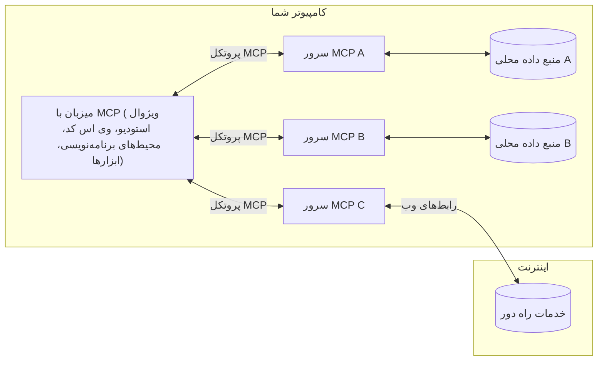

# مفاهیم اصلی MCP: تسلط بر پروتکل زمینه مدل برای یکپارچه‌سازی هوش مصنوعی

[](https://youtu.be/earDzWGtE84)

_(برای مشاهده ویدئوی این درس، روی تصویر بالا کلیک کنید)_

[پروتکل زمینه مدل (MCP)](https://github.com/modelcontextprotocol) یک چارچوب استاندارد و قدرتمند است که به بهینه‌سازی ارتباط بین مدل‌های زبان بزرگ (LLM) و ابزارها، برنامه‌ها و منابع داده خارجی می‌پردازد.  
این راهنما شما را با مفاهیم اصلی MCP آشنا می‌کند. شما درباره معماری کلاینت-سرور آن، اجزای ضروری، مکانیک‌های ارتباطی و بهترین روش‌های پیاده‌سازی خواهید آموخت.

- **رضایت صریح کاربر**: همه دسترسی‌ها و عملیات داده‌ها مستلزم تأیید صریح کاربر قبل از اجرا هستند. کاربران باید به طور واضح بدانند چه داده‌هایی دسترسی خواهند داشت و چه اقدامات انجام می‌شود، همراه با کنترل دقیق روی مجوزها و اختیارات.

- **حفظ حریم خصوصی داده‌ها**: داده‌های کاربران تنها با رضایت صریح در دسترس قرار می‌گیرند و باید در تمام طول چرخه تعامل توسط کنترل‌های دسترسی قوی محافظت شوند. پیاده‌سازی‌ها باید از انتقال غیرمجاز داده جلوگیری کرده و مرزهای حریم خصوصی سخت‌گیرانه‌ای حفظ کنند.

- **ایمنی اجرای ابزارها**: هر فراخوانی ابزار مستلزم رضایت صریح کاربر با درک واضح از عملکرد، پارامترها و تأثیرات احتمالی ابزار است. مرزهای امنیتی قوی باید از اجرای ناخواسته، ناامن یا مخرب ابزارها جلوگیری نمایند.

- **امنیت لایه انتقال**: همه کانال‌های ارتباطی باید از مکانیزم‌های رمزنگاری و احراز هویت مناسب استفاده کنند. ارتباطات از راه دور باید از پروتکل‌های حمل‌ونقل امن و مدیریت مناسب اعتبارنامه‌ها برخوردار باشند.

#### راهنمای پیاده‌سازی:

- **مدیریت مجوزها**: سیستم‌های مجوز دقیق پیاده‌سازی کنید که به کاربران اجازه کنترل سرورها، ابزارها و منابع قابل دسترسی را بدهد  
- **احراز هویت و مجوزدهی**: از روش‌های احراز هویت امن (OAuth، کلید API) با مدیریت مناسب توکن و انقضا استفاده کنید  
- **اعتبارسنجی ورودی**: همه پارامترها و داده‌های ورودی را مطابق با طرح‌های تعریف شده اعتبارسنجی کنید تا از حملات تزریق جلوگیری شود  
- **ثبت حسابرسی**: گزارش‌های جامع از همه عملیات برای نظارت امنیتی و تطابق نگهداری کنید

## مرور کلی

این درس به معماری بنیادی و اجزایی می‌پردازد که اکوسیستم پروتکل زمینه مدل (MCP) را تشکیل می‌دهند. شما درباره معماری کلاینت-سرور، اجزای کلیدی و مکانیزم‌های ارتباطی که تعاملات MCP را راه‌اندازی می‌کنند، خواهید آموخت.

## اهداف کلیدی یادگیری

در پایان این درس، شما:

- معماری کلاینت-سرور MCP را درک خواهید کرد.  
- نقش‌ها و مسئولیت‌های میزبان‌ها، کلاینت‌ها و سرورها را شناسایی خواهید کرد.  
- ویژگی‌های اصلی که MCP را به یک لایه یکپارچه‌سازی انعطاف‌پذیر تبدیل می‌کند تحلیل خواهید کرد.  
- جریان اطلاعات در اکوسیستم MCP را خواهید آموخت.  
- با مثال‌های عملی کد در .NET، جاوا، پایتون و جاوااسکریپت بینش کسب خواهید کرد.

## معماری MCP: نگاهی عمیق‌تر

اکوسیستم MCP بر اساس مدل کلاینت-سرور ساخته شده است. این ساختار مدولار به برنامه‌های هوش مصنوعی اجازه می‌دهد به طور کارآمد با ابزارها، پایگاه‌های داده، APIها و منابع متنی تعامل داشته باشند. بیایید این معماری را به اجزای اصلی آن تجزیه کنیم.

در هسته خود، MCP از معماری کلاینت-سرور پیروی می‌کند که در آن یک برنامه میزبان می‌تواند به چندین سرور متصل شود:


- **میزبان‌های MCP**: برنامه‌هایی مانند VSCode، Claude Desktop، محیط‌های توسعه (IDE) یا ابزارهای هوش مصنوعی که می‌خواهند از طریق MCP به داده‌ها دسترسی یابند  
- **کلاینت‌های MCP**: کلاینت‌های پروتکل که ارتباطات ۱:۱ با سرورها را حفظ می‌کنند  
- **سرورهای MCP**: برنامه‌های سبک‌وزنی که هر کدام قابلیت‌های خاصی را از طریق پروتکل استاندارد زمینه مدل ارائه می‌دهند  
- **منابع داده محلی**: فایل‌ها، پایگاه‌های داده و سرویس‌های رایانه شما که سرورهای MCP می‌توانند به صورت امن به آن‌ها دسترسی داشته باشند  
- **خدمات راه دور**: سیستم‌های خارجی قابل دسترسی از طریق اینترنت که سرورهای MCP می‌توانند از طریق APIها به آن‌ها متصل شوند

پروتکل MCP یک استاندارد در حال توسعه است که از نسخه‌دهی تاریخ‌محور (فرمت YYYY-MM-DD) استفاده می‌کند. نسخه فعلی پروتکل **2025-11-25** است. شما می‌توانید آخرین به‌روزرسانی‌ها را در [مشخصات پروتکل](https://modelcontextprotocol.io/specification/2025-11-25/) مشاهده کنید.

### ۱. میزبان‌ها

در پروتکل زمینه مدل (MCP)، **میزبان‌ها** برنامه‌های هوش مصنوعی هستند که به عنوان رابط اصلی‌ای عمل می‌کنند که کاربران از طریق آن با پروتکل تعامل دارند. میزبان‌ها اتصال به چندین سرور MCP را هماهنگ و مدیریت می‌کنند و برای هر اتصال سرور، یک کلاینت MCP مخصوص ایجاد می‌کنند. نمونه‌هایی از میزبان‌ها عبارت‌اند از:

- **برنامه‌های هوش مصنوعی**: Claude Desktop، Visual Studio Code، Claude Code  
- **محیط‌های توسعه**: IDEها و ویرایشگرهای کد با ادغام MCP  
- **برنامه‌های سفارشی**: عامل‌ها و ابزارهای هوش مصنوعی ساخته شده برای اهداف خاص

**میزبان‌ها** برنامه‌هایی هستند که تعاملات مدل هوش مصنوعی را هماهنگ می‌کنند. آن‌ها:

- **هماهنگی مدل‌های هوش مصنوعی**: اجرا یا تعامل با LLMها برای تولید پاسخ‌ها و هماهنگی جریان‌های کاری هوش مصنوعی  
- **مدیریت ارتباطات کلاینت**: ایجاد و نگهداری یک کلاینت MCP برای هر اتصال به سرور MCP  
- **کنترل رابط کاربری**: مدیریت جریان گفتگو، تعاملات کاربر و نمایش پاسخ‌ها  
- **اجرای امنیت**: کنترل مجوزها، محدودیت‌های امنیتی و احراز هویت  
- **مدیریت رضایت کاربر**: مدیریت تأیید کاربر برای اشتراک‌گذاری داده‌ها و اجرای ابزارها

### ۲. کلاینت‌ها

**کلاینت‌ها** اجزای حیاتی هستند که ارتباطات اختصاصی یک‌به‌یک بین میزبان‌ها و سرورهای MCP را حفظ می‌کنند. هر کلاینت MCP توسط میزبان برای اتصال به یک سرور MCP مشخص ایجاد می‌شود و کانال‌های ارتباطی سازمان‌یافته و امن را تضمین می‌کند. چندین کلاینت به میزبان‌ها امکان می‌دهد همزمان به چندین سرور متصل شوند.

**کلاینت‌ها** اجزای واسط در درون برنامه میزبان هستند. آن‌ها:

- **ارتباط پروتکل**: ارسال درخواست‌های JSON-RPC 2.0 به سرورها با دستورالعمل‌ها و اعلان‌ها  
- **مذاکره قابلیت‌ها**: مذاکره درباره ویژگی‌های پشتیبانی شده و نسخه‌های پروتکل با سرورها در زمان راه‌اندازی  
- **اجرای ابزار**: مدیریت درخواست‌های اجرای ابزار از مدل‌ها و پردازش پاسخ‌ها  
- **بروزرسانی‌های لحظه‌ای**: مدیریت اعلان‌ها و به‌روزرسانی‌های لحظه‌ای از سرورها  
- **پردازش پاسخ‌ها**: پردازش و قالب‌بندی پاسخ‌های سرور برای نمایش به کاربران

### ۳. سرورها

**سرورها** برنامه‌هایی هستند که زمینه، ابزارها و قابلیت‌ها را به کلاینت‌های MCP ارائه می‌دهند. آن‌ها می‌توانند به صورت محلی (روی همان ماشین میزبان) یا از راه دور (روی پلتفرم‌های خارجی) اجرا شوند و مسئول دریافت درخواست‌های کلاینت و ارائه پاسخ‌های ساختاریافته هستند. سرورها قابلیت‌های خاصی را از طریق پروتکل استاندارد زمینه مدل در دسترس قرار می‌دهند.

**سرورها** سرویس‌هایی هستند که زمینه و قابلیت فراهم می‌کنند. آن‌ها:

- **ثبت ویژگی‌ها**: ثبت و معرفی عناصر (منابع، اعلان‌ها، ابزارها) در دسترس برای کلاینت‌ها  
- **پردازش درخواست‌ها**: دریافت و اجرای فراخوانی‌های ابزار، درخواست‌های منابع و اعلان‌ها از کلاینت‌ها  
- **فراهم کردن متن زمینه‌ای**: ارائه اطلاعات و داده‌های زمینه‌ای برای بهبود پاسخ مدل  
- **مدیریت وضعیت**: حفظ وضعیت جلسه و رسیدگی به تعاملات حالت‌دار در صورت نیاز  
- **اعلان‌های لحظه‌ای**: ارسال اعلان درباره تغییرات قابلیت‌ها و بروزرسانی‌ها به کلاینت‌های متصل

سرورها می‌توانند توسط هر کسی برای گسترش قابلیت‌های مدل با عملکردهای تخصصی توسعه داده شوند و هر دو سناریوی استقرار محلی و راه دور را پشتیبانی می‌کنند.

### ۴. عناصر سرور

سرورها در پروتکل زمینه مدل (MCP) سه عنصر اصلی **ابتدایی** ارائه می‌دهند که بلوک‌های بنیادین تعاملات غنی بین کلاینت‌ها، میزبان‌ها و مدل‌های زبان را تعریف می‌کنند. این عناصر نوع اطلاعات زمینه‌ای و اقدامات موجود از طریق پروتکل را مشخص می‌کنند.

سرورهای MCP می‌توانند هر ترکیبی از سه عنصر اصلی زیر را ارائه دهند:

#### منابع

**منابع**، منابع داده‌ای هستند که اطلاعات زمینه‌ای به برنامه‌های هوش مصنوعی می‌دهند. آن‌ها محتوای ایستا یا پویا را نمایندگی می‌کنند که می‌توانند درک مدل و تصمیم‌گیری را بهبود بخشند:

- **داده زمینه‌ای**: اطلاعات ساختاریافته و متن برای مصرف مدل هوش مصنوعی  
- **پایگاه‌های دانش**: مخازن اسناد، مقالات، راهنماها و مقاله‌های پژوهشی  
- **منابع داده محلی**: فایل‌ها، پایگاه‌های داده و اطلاعات سیستم محلی  
- **داده خارجی**: پاسخ‌های API، خدمات وب و داده‌های سیستم‌های راه دور  
- **محتوای پویا**: داده‌های لحظه‌ای که بر اساس شرایط خارجی به‌روزرسانی می‌شوند

منابع با URI شناسایی می‌شوند و از طریق متدهای `resources/list` برای کشف و `resources/read` برای بازیابی پشتیبانی می‌شوند:

```text
file://documents/project-spec.md
database://production/users/schema
api://weather/current
```

#### اعلان‌ها

**اعلان‌ها** قالب‌های قابل استفاده مجدد هستند که به ساختاردهی تعاملات با مدل‌های زبان کمک می‌کنند. آن‌ها الگوهای تعاملی استاندارد و جریان‌های کاری قالب‌بندی شده را ارائه می‌دهند:

- **تعاملات مبتنی بر قالب**: پیام‌ها و شروع‌کننده‌های گفتگو پیش‌ساختاریافته  
- **قالب‌های جریان کاری**: دنباله‌های استاندارد برای وظایف و تعاملات رایج  
- **مثال‌های چند نمونه‌ای**: قالب‌های مبتنی بر نمونه برای آموزش مدل  
- **اعلان‌های سیستمی**: اعلان‌های پایه‌ای که رفتار و متن مدل را تعریف می‌کنند  
- **قالب‌های پویا**: اعلان‌های پارامتری که با متون خاص سازگار می‌شوند

اعلان‌ها از جایگزینی متغیر پشتیبانی می‌کنند و از طریق متدهای `prompts/list` برای کشف و `prompts/get` برای بازیابی قابل دسترسی هستند:

```markdown
Generate a {{task_type}} for {{product}} targeting {{audience}} with the following requirements: {{requirements}}
```

#### ابزارها

**ابزارها** توابع اجرایی هستند که مدل‌های هوش مصنوعی می‌توانند برای انجام عملیات خاص فراخوانی کنند. آن‌ها «افعال» اکوسیستم MCP را نمایندگی می‌کنند و به مدل‌ها امکان تعامل با سیستم‌های خارجی را می‌دهند:

- **توابع اجرایی**: عملیات مستقل که مدل‌ها می‌توانند با پارامترهای خاص فراخوانی کنند  
- **یکپارچه‌سازی سیستم‌های خارجی**: فراخوانی API، پرسش‌های پایگاه‌داده، عملیات روی فایل، محاسبات  
- **هویت منحصربه‌فرد**: هر ابزار نام، شرح و طرح پارامتر مشخص دارد  
- **ورودی/خروجی ساختاریافته**: ابزارها پارامترهای اعتبارسنجی شده را می‌پذیرند و پاسخ‌های ساختاریافته و نوع‌بندی شده ارائه می‌دهند  
- **توانایی انجام عملیات**: امکان انجام اقدامات دنیای واقعی و بازیابی داده‌های زنده توسط مدل‌ها

ابزارها با JSON Schema برای اعتبارسنجی پارامترها تعریف می‌شوند و از طریق `tools/list` کشف و به وسیله `tools/call` اجرا می‌شوند. ابزارها می‌توانند شامل **آیکون‌ها** به عنوان فراداده اضافی برای ارائه بهتر در رابط کاربری باشند.

**توضیحات ابزار**: ابزارها از توضیحات رفتاری (مثل `readOnlyHint` و `destructiveHint`) که نشان می‌دهند آیا ابزار فقط خواندنی یا مخرب است، پشتیبانی می‌کنند تا به کلاینت‌ها در تصمیم‌گیری آگاهانه درباره اجرای ابزار کمک کنند.

نمونه تعریف ابزار:

```typescript
server.tool(
  "search_products", 
  {
    query: z.string().describe("Search query for products"),
    category: z.string().optional().describe("Product category filter"),
    max_results: z.number().default(10).describe("Maximum results to return")
  }, 
  async (params) => {
    // جستجو را اجرا کرده و نتایج ساختاریافته را بازگردانید
    return await productService.search(params);
  }
);
```

## عناصر کلاینت

در پروتکل زمینه مدل (MCP)، **کلاینت‌ها** می‌توانند عناصر ابتدایی‌ای ارائه دهند که به سرورها امکان می‌دهد قابلیت‌های اضافی را از برنامه میزبان درخواست کنند. این عناصر سمت کلاینت اجازه می‌دهد پیاده‌سازی‌های سرور تعاملی‌تر و غنی‌تری داشته باشند که می‌توانند به قابلیت‌های مدل هوش مصنوعی و تعاملات کاربر دسترسی داشته باشند.

### نمونه‌گیری

**نمونه‌گیری** به سرورها اجازه می‌دهد تکمیل‌های مدل زبان را از برنامه هوش مصنوعی کلاینت درخواست کنند. این عنصر به سرورها امکان می‌دهد بدون جاسازی وابستگی‌های مدل خود، از قابلیت‌های LLM استفاده کنند:

- **دسترسی مستقل از مدل**: سرورها می‌توانند تکمیل‌ها را بدون نیاز به SDKهای LLM یا مدیریت دسترسی مدل درخواست کنند  
- **هوش مصنوعی آغازشده توسط سرور**: به سرورها امکان تولید خودکار محتوا با مدل AI کلاینت را می‌دهد  
- **تعاملات بازگشتی LLM**: از سناریوهای پیچیده پشتیبانی می‌کند که سرورها نیاز به کمک AI برای پردازش دارند  
- **تولید محتوای پویا**: به سرورها امکان می‌دهد پاسخ‌های زمینه‌ای با استفاده از مدل میزبان ایجاد کنند  
- **پشتیبانی از فراخوانی ابزار**: سرورها می‌توانند پارامترهای `tools` و `toolChoice` را اضافه کنند تا مدل کلاینت بتواند هنگام نمونه‌گیری ابزارها را فراخوانی کند

نمونه‌گیری از طریق متد `sampling/complete` آغاز می‌شود که در آن سرورها درخواست‌های تکمیل را به کلاینت‌ها ارسال می‌کنند.

### ریشه‌ها

**ریشه‌ها** راهی استاندارد برای کلاینت‌ها فراهم می‌کنند که مرزهای سیستم فایل را به سرورها نشان دهند و به سرورها کمک می‌کنند تا بفهمند به کدام دایرکتوری‌ها و فایل‌ها دسترسی دارند:

- **مرزهای سیستم فایل**: مشخص کردن محدوده‌ای که سرورها می‌توانند در سیستم فایل عمل کنند  
- **کنترل دسترسی**: کمک به سرورها برای درک دایرکتوری‌ها و فایل‌های مجاز  
- **بروزرسانی‌های پویا**: کلاینت‌ها می‌توانند زمانی که لیست ریشه‌ها تغییر می‌کند به سرورها اعلان دهند  
- **شناسایی مبتنی بر URI**: ریشه‌ها از URI نوع `file://` برای شناسایی دایرکتوری‌ها و فایل‌های قابل دسترسی استفاده می‌کنند

ریشه‌ها از طریق متد `roots/list` کشف می‌شوند و کلاینت‌ها هنگام تغییر ریشه‌ها اعلان `notifications/roots/list_changed` ارسال می‌کنند.

### درخواست اطلاعات

**درخواست اطلاعات** به سرورها امکان می‌دهد از طریق رابط کلاینت، اطلاعات اضافی یا تأیید از کاربران درخواست کنند:

- **درخواست ورودی کاربر**: سرورها می‌توانند هنگام نیاز به اجرای ابزار، اطلاعات بیشتری درخواست کنند  
- **دیالوگ‌های تأیید**: درخواست تأیید کاربر برای عملیات حساس یا تأثیرگذار  
- **جریان‌های کاری تعاملی**: به سرورها اجازه می‌دهد تعاملات مرحله به مرحله با کاربر ایجاد کنند  
- **جمع‌آوری پارامترهای پویا**: گردآوری پارامترهای ناقص یا اختیاری هنگام اجرای ابزار

درخواست‌های elicitation با استفاده از متد `elicitation/request` برای جمع‌آوری ورودی کاربر از طریق رابط کلاینت انجام می‌شوند.

**درخواست‌های حالت URL**: سرورها می‌توانند تعاملات کاربر مبتنی بر URL درخواست کنند که این امکان را به آن‌ها می‌دهد کاربران را به صفحات وب خارجی برای احراز هویت، تأیید یا ورود داده هدایت کنند.

### ثبت لاگ

**ثبت لاگ** به سرورها امکان می‌دهد پیام‌های لاگ ساختاریافته را برای دیباگ، نظارت و شفافیت عملیاتی به کلاینت‌ها ارسال کنند:

- **پشتیبانی از دیباگ**: به سرورها امکان ارائه گزارش‌های اجرایی دقیق برای عیب‌یابی می‌دهد  
- **نظارت عملیاتی**: ارسال بروزرسانی وضعیت و معیارهای عملکرد به کلاینت‌ها  
- **گزارش خطا**: ارائه زمینه و اطلاعات تشخیصی دقیق خطا  
- **ردگیری حسابرسی**: ساخت گزارش‌های جامعی از عملیات و تصمیمات سرور

پیام‌های ثبت لاگ به کلاینت‌ها ارسال می‌شوند تا شفافیت در عملیات سرور فراهم شده و دیباگ تسهیل شود.

## جریان اطلاعات در MCP

پروتکل زمینه مدل (MCP) جریان ساختاریافته‌ای از اطلاعات بین میزبان‌ها، کلاینت‌ها، سرورها و مدل‌ها تعریف می‌کند. درک این جریان به روشن شدن فرآیند پردازش درخواست‌های کاربر و چگونگی ادغام ابزارها و داده‌های خارجی در پاسخ‌های مدل کمک می‌کند.
- **میزبان اتصال را برقرار می‌کند**  
  برنامه میزبان (مانند یک IDE یا رابط چت) اتصال به یک سرور MCP را برقرار می‌کند، معمولاً از طریق STDIO، WebSocket یا یک پروتکل حمل‌ونقل پشتیبانی‌شده دیگر.

- **مذاکره قابلیت‌ها**  
  کلاینت (موسوم به تعبیه شده در میزبان) و سرور اطلاعاتی درباره ویژگی‌ها، ابزارها، منابع و نسخه‌های پروتکل پشتیبانی‌شده خود مبادله می‌کنند. این اطمینان می‌دهد که هر دو طرف قابلیت‌های موجود برای جلسه را درک کنند.

- **درخواست کاربر**  
  کاربر با میزبان تعامل می‌کند (مثلاً یک دستور یا پرامپت وارد می‌کند). میزبان این ورودی را جمع‌آوری کرده و برای پردازش به کلاینت ارسال می‌کند.

- **استفاده از منبع یا ابزار**  
  - کلاینت ممکن است درخواست زمینه یا منابع اضافی از سرور داشته باشد (مانند فایل‌ها، ورودی‌های پایگاه داده، یا مقالات پایگاه دانش) تا درک مدل را غنی کند.  
  - اگر مدل تشخیص دهد که استفاده از ابزاری لازم است (مثلاً برای بازیابی داده، انجام محاسبه، یا فراخوانی یک API)، کلاینت درخواست فراخوانی ابزار را به سرور می‌فرستد و نام ابزار و پارامترها را مشخص می‌کند.

- **اجرای سرور**  
  سرور درخواست منبع یا ابزار را دریافت می‌کند، عملیات لازم را اجرا می‌کند (مانند اجرای یک تابع، پرس‌وجوی پایگاه داده، یا بازیابی یک فایل) و نتایج را در قالب ساختاریافته به کلاینت بازمی‌گرداند.

- **تولید پاسخ**  
  کلاینت پاسخ‌های سرور (داده‌های منابع، خروجی ابزار و غیره) را در تعامل جاری مدل ادغام می‌کند. مدل از این اطلاعات برای تولید پاسخ جامع و متناسب با زمینه استفاده می‌کند.

- **ارائه نتیجه**  
  میزبان خروجی نهایی را از کلاینت دریافت کرده و به کاربر نمایش می‌دهد، اغلب شامل متن تولیدشده توسط مدل و هر نتیجه حاصل از اجرای ابزارها یا جستجوی منابع است.

این جریان به MCP امکان می‌دهد برنامه‌های هوش مصنوعی پیشرفته، تعاملی و با آگاهی از زمینه را با اتصال بی‌نقص مدل‌ها به ابزارها و منابع داده خارجی پشتیبانی کند.

## معماری و لایه‌های پروتکل

MCP از دو لایه معماری متمایز تشکیل شده است که برای ارائه یک چارچوب ارتباطی کامل با هم کار می‌کنند:

### لایه داده

**لایه داده** پروتکل اصلی MCP را با استفاده از **JSON-RPC 2.0** به عنوان پایه پیاده‌سازی می‌کند. این لایه ساختار پیام، معناشناسی و الگوهای تعامل را تعریف می‌کند:

#### اجزای اصلی:

- **پروتکل JSON-RPC 2.0**: تمام ارتباطات از فرمت پیام استاندارد JSON-RPC 2.0 برای فراخوانی روش‌ها، پاسخ‌ها و اطلاع‌رسانی‌ها استفاده می‌کند  
- **مدیریت چرخه عمر**: مدیریت راه‌اندازی اتصال، مذاکره قابلیت‌ها و پایان جلسه میان کلاینت‌ها و سرورها  
- **ابتدایی‌های سرور**: امکان‌دهی به سرورها برای ارائه عملکردهای اصلی از طریق ابزارها، منابع و پرامپت‌ها  
- **ابتدایی‌های کلاینت**: امکان درخواست نمونه‌گیری از LLMها، دریافت ورودی کاربر و ارسال پیام‌های لاگ توسط سرورها  
- **اعلان‌های بلادرنگ**: پشتیبانی از اعلان‌های غیرهمزمان برای به‌روزرسانی‌های پویا بدون نیاز به polling

#### ویژگی‌های کلیدی:

- **مذاکره نسخه پروتکل**: استفاده از نسخه‌بندی مبتنی بر تاریخ (YYYY-MM-DD) برای اطمینان از سازگاری  
- **کشف قابلیت‌ها**: تبادل اطلاعات ویژگی‌های پشتیبانی‌شده میان کلاینت‌ها و سرورها در زمان راه‌اندازی  
- **جلسات حالت‌دار**: حفظ وضعیت اتصال در طول چندین تعامل برای استمرار زمینه

### لایه حمل‌ونقل

**لایه حمل‌ونقل** مدیریت کانال‌های ارتباطی، چارچوب‌بندی پیام‌ها و احراز هویت بین شرکت‌کنندگان MCP را بر عهده دارد:

#### مکانیزم‌های حمل‌ونقل پشتیبانی‌شده:

1. **حمل‌ونقل STDIO**:  
   - استفاده از جریان‌های ورودی/خروجی استاندارد برای ارتباط مستقیم فرآیندها  
   - بهینه برای فرآیندهای محلی روی همان دستگاه بدون سربار شبکه  
   - معمولاً برای پیاده‌سازی سرور MCP محلی استفاده می‌شود

2. **حمل‌ونقل HTTP قابل پخش**:  
   - استفاده از HTTP POST برای پیام‌های کلاینت به سرور  
   - قابلیت استفاده از Server-Sent Events (SSE) به صورت اختیاری برای پخش سرور به کلاینت  
   - امکان ارتباط با سرورهای از راه دور در شبکه‌های مختلف  
   - پشتیبانی از احراز هویت استاندارد HTTP (توکن‌های bearer، کلیدهای API، هدرهای سفارشی)  
   - توصیه MCP استفاده از OAuth برای احراز هویت ایمن مبتنی بر توکن است

#### انتزاع حمل‌ونقل:

لایه حمل‌ونقل جزییات ارتباط را از لایه داده جدا می‌کند، که امکان استفاده از فرمت پیام JSON-RPC 2.0 یکسان روی تمام مکانیزم‌های حمل‌ونقل را می‌دهد. این انتزاع به برنامه‌ها اجازه می‌دهد به‌راحتی بین سرورهای محلی و راه دور جابجا شوند.

### ملاحظات امنیتی

پیاده‌سازی‌های MCP باید به چندین اصل حیاتی امنیتی پایبند باشند تا تعاملات در تمام عملیات پروتکل ایمن، معتبر و مطمئن باشد:

- **رضایت و کنترل کاربر**: کاربران باید رضایت صریح خود را پیش از دسترسی به داده‌ها یا انجام عملیات اعلام کنند. آنها باید کنترل واضحی روی داده‌های به اشتراک گذاشته شده و اقدامات مجاز داشته باشند، که با رابط کاربری شهودی برای بازبینی و تأیید فعالیت‌ها پشتیبانی می‌شود.

- **حریم خصوصی داده‌ها**: داده‌های کاربران فقط با رضایت صریح آنها در دسترس قرار گیرد و توسط کنترل‌های دسترسی مناسب حفاظت شود. پیاده‌سازی‌های MCP باید از انتقال غیرمجاز داده جلوگیری کرده و حفظ حریم خصوصی را در همه تعاملات تضمین کنند.

- **ایمنی ابزارها**: پیش از فراخوانی هر ابزار، رضایت صریح کاربر لازم است. کاربران باید عملکرد هر ابزار را واضح درک کنند و مرزهای امنیتی قوی جهت جلوگیری از اجرای ناخواسته یا ناامن ابزارها اعمال شود.

با پیروی از این اصول امنیتی، MCP اطمینان می‌دهد که اعتماد، حریم خصوصی و ایمنی کاربر در تمام تعاملات پروتکل حفظ شده و در عین حال ادغام‌های قدرتمند هوش مصنوعی امکان‌پذیر گردد.

## مثال‌های کد: اجزای کلیدی

در زیر مثال‌هایی از کد در چند زبان برنامه‌نویسی محبوب مشاهده می‌کنید که نشان می‌دهد چگونه می‌توان اجزای کلیدی سرور MCP و ابزارها را پیاده‌سازی کرد.

### مثال .NET: ایجاد یک سرور ساده MCP با ابزارها

در اینجا یک مثال عملی در .NET است که نشان می‌دهد چگونه یک سرور ساده MCP با ابزارهای سفارشی پیاده‌سازی شود. این مثال نحوه تعریف، ثبت ابزارها، رسیدگی به درخواست‌ها و اتصال سرور با استفاده از پروتکل مدل زمینه را نمایش می‌دهد.

```csharp
using System;
using System.Threading.Tasks;
using ModelContextProtocol.Server;
using ModelContextProtocol.Server.Transport;
using ModelContextProtocol.Server.Tools;

public class WeatherServer
{
    public static async Task Main(string[] args)
    {
        // Create an MCP server
        var server = new McpServer(
            name: "Weather MCP Server",
            version: "1.0.0"
        );
        
        // Register our custom weather tool
        server.AddTool<string, WeatherData>("weatherTool", 
            description: "Gets current weather for a location",
            execute: async (location) => {
                // Call weather API (simplified)
                var weatherData = await GetWeatherDataAsync(location);
                return weatherData;
            });
        
        // Connect the server using stdio transport
        var transport = new StdioServerTransport();
        await server.ConnectAsync(transport);
        
        Console.WriteLine("Weather MCP Server started");
        
        // Keep the server running until process is terminated
        await Task.Delay(-1);
    }
    
    private static async Task<WeatherData> GetWeatherDataAsync(string location)
    {
        // This would normally call a weather API
        // Simplified for demonstration
        await Task.Delay(100); // Simulate API call
        return new WeatherData { 
            Temperature = 72.5,
            Conditions = "Sunny",
            Location = location
        };
    }
}

public class WeatherData
{
    public double Temperature { get; set; }
    public string Conditions { get; set; }
    public string Location { get; set; }
}
```

### مثال جاوا: اجزای سرور MCP

این مثال همان سرور MCP و ثبت ابزارهای مثال .NET را نشان می‌دهد، اما با پیاده‌سازی در جاوا.

```java
import io.modelcontextprotocol.server.McpServer;
import io.modelcontextprotocol.server.McpToolDefinition;
import io.modelcontextprotocol.server.transport.StdioServerTransport;
import io.modelcontextprotocol.server.tool.ToolExecutionContext;
import io.modelcontextprotocol.server.tool.ToolResponse;

public class WeatherMcpServer {
    public static void main(String[] args) throws Exception {
        // ایجاد یک سرور MCP
        McpServer server = McpServer.builder()
            .name("Weather MCP Server")
            .version("1.0.0")
            .build();
            
        // ثبت یک ابزار آب و هوا
        server.registerTool(McpToolDefinition.builder("weatherTool")
            .description("Gets current weather for a location")
            .parameter("location", String.class)
            .execute((ToolExecutionContext ctx) -> {
                String location = ctx.getParameter("location", String.class);
                
                // دریافت داده‌های آب و هوا (ساده شده)
                WeatherData data = getWeatherData(location);
                
                // بازگرداندن پاسخ قالب‌بندی شده
                return ToolResponse.content(
                    String.format("Temperature: %.1f°F, Conditions: %s, Location: %s", 
                    data.getTemperature(), 
                    data.getConditions(), 
                    data.getLocation())
                );
            })
            .build());
        
        // اتصال سرور با استفاده از انتقال stdio
        try (StdioServerTransport transport = new StdioServerTransport()) {
            server.connect(transport);
            System.out.println("Weather MCP Server started");
            // نگه داشتن سرور در حال اجرا تا زمانی که فرایند خاتمه یابد
            Thread.currentThread().join();
        }
    }
    
    private static WeatherData getWeatherData(String location) {
        // پیاده‌سازی باید یک API آب و هوا را فراخوانی کند
        // برای اهداف نمونه ساده شده است
        return new WeatherData(72.5, "Sunny", location);
    }
}

class WeatherData {
    private double temperature;
    private String conditions;
    private String location;
    
    public WeatherData(double temperature, String conditions, String location) {
        this.temperature = temperature;
        this.conditions = conditions;
        this.location = location;
    }
    
    public double getTemperature() {
        return temperature;
    }
    
    public String getConditions() {
        return conditions;
    }
    
    public String getLocation() {
        return location;
    }
}
```

### مثال پایتون: ساخت یک سرور MCP

این مثال از fastmcp استفاده می‌کند، لطفاً ابتدا آن را نصب کنید:

```python
pip install fastmcp
```
نمونه کد:

```python
#!/usr/bin/env python3
import asyncio
from fastmcp import FastMCP
from fastmcp.transports.stdio import serve_stdio

# ایجاد یک سرور FastMCP
mcp = FastMCP(
    name="Weather MCP Server",
    version="1.0.0"
)

@mcp.tool()
def get_weather(location: str) -> dict:
    """Gets current weather for a location."""
    return {
        "temperature": 72.5,
        "conditions": "Sunny",
        "location": location
    }

# روش جایگزین با استفاده از یک کلاس
class WeatherTools:
    @mcp.tool()
    def forecast(self, location: str, days: int = 1) -> dict:
        """Gets weather forecast for a location for the specified number of days."""
        return {
            "location": location,
            "forecast": [
                {"day": i+1, "temperature": 70 + i, "conditions": "Partly Cloudy"}
                for i in range(days)
            ]
        }

# ابزارهای ثبت کلاس
weather_tools = WeatherTools()

# شروع سرور
if __name__ == "__main__":
    asyncio.run(serve_stdio(mcp))
```

### مثال جاوااسکریپت: ایجاد یک سرور MCP

این مثال ایجاد سرور MCP در جاوااسکریپت و نحوه ثبت دو ابزار مربوط به آب و هوا را نشان می‌دهد.

```javascript
// استفاده از کیت توسعه رسمی پروتکل مدل کانتکست
import { McpServer } from "@modelcontextprotocol/sdk/server/mcp.js";
import { StdioServerTransport } from "@modelcontextprotocol/sdk/server/stdio.js";
import { z } from "zod"; // برای اعتبارسنجی پارامترها

// ایجاد یک سرور MCP
const server = new McpServer({
  name: "Weather MCP Server",
  version: "1.0.0"
});

// تعریف یک ابزار هواشناسی
server.tool(
  "weatherTool",
  {
    location: z.string().describe("The location to get weather for")
  },
  async ({ location }) => {
    // این معمولاً باید به یک API هواشناسی فراخوانی دهد
    // ساده‌سازی شده برای نمایش
    const weatherData = await getWeatherData(location);
    
    return {
      content: [
        { 
          type: "text", 
          text: `Temperature: ${weatherData.temperature}°F, Conditions: ${weatherData.conditions}, Location: ${weatherData.location}` 
        }
      ]
    };
  }
);

// تعریف یک ابزار پیش‌بینی
server.tool(
  "forecastTool",
  {
    location: z.string(),
    days: z.number().default(3).describe("Number of days for forecast")
  },
  async ({ location, days }) => {
    // این معمولاً باید به یک API هواشناسی فراخوانی دهد
    // ساده‌سازی شده برای نمایش
    const forecast = await getForecastData(location, days);
    
    return {
      content: [
        { 
          type: "text", 
          text: `${days}-day forecast for ${location}: ${JSON.stringify(forecast)}` 
        }
      ]
    };
  }
);

// توابع کمکی
async function getWeatherData(location) {
  // شبیه‌سازی فراخوانی API
  return {
    temperature: 72.5,
    conditions: "Sunny",
    location: location
  };
}

async function getForecastData(location, days) {
  // شبیه‌سازی فراخوانی API
  return Array.from({ length: days }, (_, i) => ({
    day: i + 1,
    temperature: 70 + Math.floor(Math.random() * 10),
    conditions: i % 2 === 0 ? "Sunny" : "Partly Cloudy"
  }));
}

// اتصال سرور با استفاده از انتقال stdio
const transport = new StdioServerTransport();
server.connect(transport).catch(console.error);

console.log("Weather MCP Server started");
```

این مثال جاوااسکریپت نشان می‌دهد چگونه یک سرور MCP ایجاد کنید که ابزارهای مرتبط با آب و هوا را ثبت کرده و با استفاده از حمل‌ونقل stdio به درخواست‌های ورودی کلاینت پاسخ می‌دهد.

## امنیت و مجوزها

MCP شامل چندین مفهوم و مکانیزم تعبیه شده برای مدیریت امنیت و مجوزها در سراسر پروتکل است:

1. **کنترل مجوز ابزار**:  
   کلاینت‌ها می‌توانند مشخص کنند که یک مدل در طول جلسه مجاز به استفاده از کدام ابزارهاست. این اطمینان می‌دهد تنها ابزارهای صریحاً مجاز در دسترس باشند و خطر عملیات ناخواسته یا ناامن کاهش یابد. مجوزها می‌توانند بر اساس ترجیحات کاربر، سیاست‌های سازمانی یا زمینه تعامل به‌صورت پویا تنظیم شوند.

2. **احراز هویت**:  
   سرورها می‌توانند پیش از اعطای دسترسی به ابزارها، منابع یا عملیات حساس، احراز هویت را الزام کنند. این می‌تواند شامل کلیدهای API، توکن‌های OAuth یا سایر روش‌های احراز هویت باشد. احراز هویت صحیح تضمین می‌کند فقط کلاینت‌ها و کاربران معتبر می‌توانند قابلیت‌های سمت سرور را فراخوانی کنند.

3. **اعتبارسنجی**:  
   برای همه فراخوانی‌های ابزار، اعتبارسنجی پارامترها اعمال می‌شود. هر ابزار انواع، قالب‌ها و محدودیت‌های مورد انتظار پارامترهای خود را تعریف می‌کند و سرور درخواست‌های ورودی را بر اساس آن اعتبارسنجی می‌کند. این مانع ارسال ورودی‌های مخرب یا نادرست به پیاده‌سازی ابزارها می‌شود و یکپارچگی عملیات را حفظ می‌کند.

4. **محدودسازی نرخ**:  
   برای جلوگیری از سوء‌استفاده و اطمینان از استفاده عادلانه از منابع سرور، سرورهای MCP می‌توانند محدودیت نرخ برای تماس‌های ابزار و دسترسی به منابع اعمال کنند. محدودیت‌های نرخ می‌توانند به تفکیک کاربر، جلسه یا به‌صورت کلی اعمال شوند و از حملات انکار سرویس یا مصرف بیش از حد منابع جلوگیری می‌کند.

با ترکیب این مکانیزم‌ها، MCP پایه‌ای امن برای ادغام مدل‌های زبانی با ابزارها و منابع داده خارجی فراهم می‌کند و در عین حال کنترل دقیق دسترسی و استفاده را در اختیار کاربران و توسعه‌دهندگان قرار می‌دهد.

## پیام‌ها و جریان ارتباطی پروتکل

ارتباطات MCP از پیام‌های ساختاریافته **JSON-RPC 2.0** برای تسهیل تعاملات روشن و مطمئن بین میزبان‌ها، کلاینت‌ها و سرورها استفاده می‌کند. پروتکل الگوهای پیام مشخصی برای انواع مختلف عملیات تعریف می‌کند:

### انواع پیام اصلی:

#### **پیام‌های راه‌اندازی**
- درخواست `initialize`: برقراری اتصال و مذاکره نسخه و قابلیت‌های پروتکل  
- پاسخ `initialize`: تأیید ویژگی‌های پشتیبانی‌شده و اطلاعات سرور  
- `notifications/initialized`: اعلام اتمام راه‌اندازی و آماده بودن جلسه

#### **پیام‌های کشف**
- درخواست `tools/list`: کشف ابزارهای موجود روی سرور  
- درخواست `resources/list`: فهرست منابع موجود (منابع داده)  
- درخواست `prompts/list`: دریافت قالب‌های پرامپت موجود

#### **پیام‌های اجرا**  
- درخواست `tools/call`: اجرای یک ابزار خاص با پارامترهای داده‌شده  
- درخواست `resources/read`: بازیابی محتوای یک منبع خاص  
- درخواست `prompts/get`: دریافت قالب پرامپت با پارامترهای اختیاری

#### **پیام‌های سمت کلاینت**
- درخواست `sampling/complete`: سرور درخواست تکمیل LLM از کلاینت دارد  
- درخواست `elicitation/request`: سرور ورودی کاربر را از طریق رابط کلاینت درخواست می‌کند  
- پیام‌های لاگ‌برداری: سرور پیام‌های لاگ ساختاریافته به کلاینت ارسال می‌کند

#### **پیام‌های اطلاع‌رسانی**
- `notifications/tools/list_changed`: سرور به کلاینت تغییرات ابزارها را اطلاع می‌دهد  
- `notifications/resources/list_changed`: سرور به کلاینت تغییرات منابع را اطلاع می‌دهد  
- `notifications/prompts/list_changed`: سرور به کلاینت تغییرات قالب پرامپت‌ها را اطلاع می‌دهد

### ساختار پیام:

تمام پیام‌های MCP از فرمت JSON-RPC 2.0 پیروی می‌کنند که:  
- پیام‌های درخواست شامل `id`، `method` و پارامترهای اختیاری `params` هستند  
- پیام‌های پاسخ شامل `id` و یا `result` یا `error` هستند  
- پیام‌های اطلاع‌رسانی شامل `method` و پارامترهای اختیاری `params` (بدون `id` و بدون انتظار پاسخ) هستند

این ساختار ارتباطی تضمین می‌کند تعاملات قابل اعتماد، پیگیری‌پذیر و قابل گسترش برای سناریوهای پیشرفته مانند به‌روزرسانی‌های بلادرنگ، زنجیره‌سازی ابزار و مدیریت خطاهای قوی فراهم شود.

### وظایف (Experimental)

**وظایف** یک ویژگی آزمایشی است که بسته‌های اجرایی پایدار فراهم می‌کند و امکان دریافت نتایج با تأخیر و پیگیری وضعیت درخواست‌های MCP را میسر می‌سازد:

- عملیات بلندمدت: ردیابی محاسبات پرهزینه، خودکارسازی جریان کار و پردازش دسته‌ای  
- نتایج تأخیری: polling برای وضعیت وظیفه و بازیابی نتایج هنگام اتمام عملیات  
- پیگیری وضعیت: نظارت بر پیشرفت وظیفه در طول حالات چرخه عمر تعریف شده  
- عملیات چند مرحله‌ای: پشتیبانی از جریان‌های کاری پیچیده که شامل چندین تعامل می‌شوند

وظایف درخواست‌های استاندارد MCP را بسته‌بندی می‌کنند تا الگوهای اجرای غیرهمزمان برای عملیاتی که فوراً تکمیل نمی‌شوند را فعال کنند.

## نکات کلیدی

- **معماری**: MCP از معماری کلاینت-سرور استفاده می‌کند که میزبان‌ها مدیریت چندین اتصال کلاینت به سرورها را بر عهده دارند  
- **شرکت‌کنندگان**: اکوسیستم شامل میزبان‌ها (برنامه‌های هوش مصنوعی)، کلاینت‌ها (اتصال‌دهنده‌های پروتکل) و سرورها (ارائه‌دهندگان قابلیت‌ها) است  
- **مکانیزم‌های حمل‌ونقل**: ارتباط از STDIO (محلی) و HTTP قابل پخش با گزینه SSE (راه دور) پشتیبانی می‌کند  
- **ابتدایی‌های اصلی**: سرورها ابزارها (توابع اجرایی)، منابع (منابع داده) و پرامپت‌ها (قالب‌ها) را ارائه می‌دهند  
- **ابتدایی‌های کلاینت**: سرورها می‌توانند از کلاینت نمونه‌گیری (تکمیل‌های LLM با پشتیبانی فراخوانی ابزار)، استنباط (ورودی کاربر شامل حالت URL)، مرزها (محدوده‌های فایل‌سیستم) و لاگ‌گیری درخواست کنند  
- **ویژگی‌های آزمایشی**: وظایف بسته‌های اجرایی پایدار برای عملیات بلندمدت فراهم می‌کنند  
- **بنیاد پروتکل**: بر پایه JSON-RPC 2.0 با نسخه‌بندی تاریخ‌محور (تاریخ فعلی: 2025-11-25)  
- **قابلیت‌های بلادرنگ**: پشتیبانی از اعلان‌ها برای به‌روزرسانی‌های پویا و همگام‌سازی بلادرنگ  
- **امنیت در اولویت است**: رضایت صریح کاربر، حفاظت از حریم خصوصی داده‌ها و حمل‌ونقل امن از الزامات اصلی است

## تمرین

یک ابزار ساده MCP طراحی کنید که در حوزه شما مفید باشد. تعریف کنید:  
1. نام ابزار چه خواهد بود  
2. چه پارامترهایی را قبول می‌کند  
3. چه خروجی‌ای ارائه می‌دهد  
4. چگونه یک مدل ممکن است از این ابزار برای حل مشکلات کاربران استفاده کند

---

## ادامه

بعدی: [فصل ۲: امنیت](../02-Security/README.md)

---

<!-- CO-OP TRANSLATOR DISCLAIMER START -->
**سلب مسئولیت**:
این سند با استفاده از سرویس ترجمه هوش مصنوعی [Co-op Translator](https://github.com/Azure/co-op-translator) ترجمه شده است. در حالی که ما در تلاش برای دقت هستیم، لطفاً توجه داشته باشید که ترجمه‌های خودکار ممکن است حاوی خطا یا نادرستی باشند. سند اصلی به زبان مادری خود باید به عنوان منبع معتبر در نظر گرفته شود. برای اطلاعات حیاتی، ترجمه حرفه‌ای انسانی توصیه می‌شود. ما مسئول هیچ سوءتفاهم یا سو تفسیر ناشی از استفاده از این ترجمه نیستیم.
<!-- CO-OP TRANSLATOR DISCLAIMER END -->