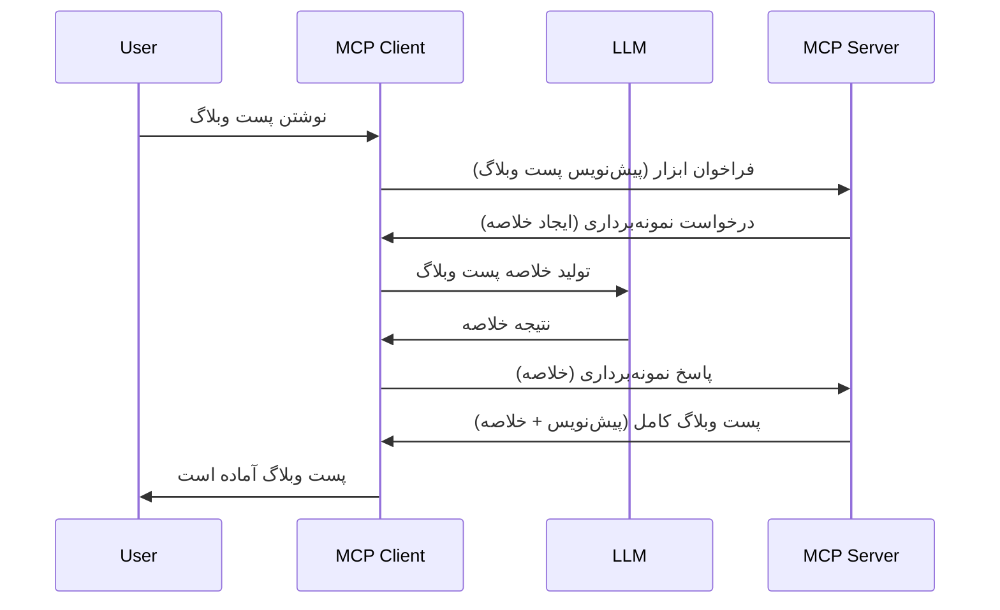

# نمونه‌گیری - واگذاری ویژگی‌ها به کلاینت

گاهی اوقات، نیاز است که کلاینت MCP و سرور MCP با هم همکاری کنند تا به هدفی مشترک برسند. ممکن است شما در شرایطی باشید که سرور به کمک یک مدل زبان بزرگ (LLM) که روی کلاینت قرار دارد نیاز داشته باشد. در این حالت، نمونه‌گیری همان چیزی است که باید از آن استفاده کنید.

بیایید چند مورد استفاده را بررسی کنیم و ببینیم چگونه می‌توان راه‌حلی مبتنی بر نمونه‌گیری ساخت.

## مرور کلی

در این درس، تمرکز ما بر توضیح زمان و مکان استفاده از نمونه‌گیری و چگونگی پیکربندی آن است.

## اهداف یادگیری

در این فصل، ما:

- توضیح می‌دهیم نمونه‌گیری چیست و چه زمانی باید از آن استفاده کرد.
- نشان می‌دهیم چگونه نمونه‌گیری را در MCP پیکربندی کنیم.
- مثال‌هایی از نمونه‌گیری در عمل ارائه می‌دهیم.

## نمونه‌گیری چیست و چرا از آن استفاده کنیم؟

نمونه‌گیری یک ویژگی پیشرفته است که به شکل زیر کار می‌کند:



### درخواست نمونه‌گیری

خوب، حالا که نمای کلی و بزرگی از یک سناریوی معتبر داریم، بیایید درباره درخواست نمونه‌گیری که سرور به کلاینت می‌فرستد صحبت کنیم. این‌گونه درخواست می‌تواند در قالب JSON-RPC به شکل زیر باشد:

```json
{
  "jsonrpc": "2.0",
  "id": 1,
  "method": "sampling/createMessage",
  "params": {
    "messages": [
      {
        "role": "user",
        "content": {
          "type": "text",
          "text": "Create a blog post summary of the following blog post: <BLOG POST>"
        }
      }
    ],
    "modelPreferences": {
      "hints": [
        {
          "name": "claude-3-sonnet"
        }
      ],
      "intelligencePriority": 0.8,
      "speedPriority": 0.5
    },
    "systemPrompt": "You are a helpful assistant.",
    "maxTokens": 100
  }
}
```

چند نکته قابل توجه در اینجا وجود دارد:

- Prompt، زیر content -> text، پرامپت ما است که به عنوان دستور برای مدل زبان بزرگ (LLM) برای خلاصه کردن محتوای پست وبلاگی عمل می‌کند.

- **modelPreferences**. این بخش دقیقا همان است، یک ترجیح، پیشنهادی درباره پیکربندی‌ای که باید با LLM استفاده شود. کاربر می‌تواند انتخاب کند که این پیشنهادات را بپذیرد یا تغییر دهد. در این مورد، توصیه‌هایی درباره مدل مورد استفاده و اولویت سرعت و هوش وجود دارد.
- **systemPrompt**، این پرامپت معمول سیستم شما است که به LLM شخصیت می‌دهد و شامل دستورالعمل‌های راهنما است.
- **maxTokens**، یک خصوصیت دیگر است که می‌گوید چه تعداد توکن برای این کار توصیه می‌شود استفاده شود.

### پاسخ نمونه‌گیری

این پاسخ همان چیزی است که کلاینت MCP در نهایت به سرور MCP ارسال می‌کند و نتیجه فراخوانی مدل زبان بزرگ و انتظار برای پاسخ آن و سپس ساخت این پیام است. این پاسخ می‌تواند در JSON-RPC به شکل زیر باشد:

```json
{
  "jsonrpc": "2.0",
  "id": 1,
  "result": {
    "role": "assistant",
    "content": {
      "type": "text",
      "text": "Here's your abstract <ABSTRACT>"
    },
    "model": "gpt-5",
    "stopReason": "endTurn"
  }
}
```

توجه کنید که پاسخ خلاصه‌ای از پست وبلاگ است همانطور که درخواست کرده بودیم. همچنین توجه کنید که مدل استفاده شده `model` همان چیزی نیست که درخواست کرده بودیم بلکه "gpt-5" بر "claude-3-sonnet" است. این برای نشان دادن این است که کاربر می‌تواند نظر خود را درباره مدل مورد استفاده تغییر دهد و درخواست نمونه‌گیری شما یک توصیه است.

خوب، حالا که جریان اصلی را فهمیدیم و کاربرد مفیدی مثل «ایجاد پست وبلاگ + خلاصه» را شناختیم، ببینیم برای راه‌اندازی این روند چه باید کرد.

### نوع پیام‌ها

پیام‌های نمونه‌گیری محدود به متن نیستند بلکه می‌توانید تصاویر و صوت نیز ارسال کنید. در اینجا JSON-RPC چطور متفاوت است:

**متن**

```json
{
  "type": "text",
  "text": "The message content"
}
```

**محتوای تصویر**

```json
{
  "type": "image",
  "data": "base64-encoded-image-data",
  "mimeType": "image/jpeg"
}
```

**محتوای صوت**

```json
{
  "type": "audio",
  "data": "base64-encoded-audio-data",
  "mimeType": "audio/wav"
}
```

> NOTE: for more detailed info on Sampling, check out the [official docs](https://modelcontextprotocol.io/specification/2025-11-25/client/sampling)

## چگونگی پیکربندی نمونه‌گیری در کلاینت

> توجه: اگر فقط در حال ساختن سرور هستید، نیازی نیست کار زیادی اینجا انجام دهید.

در کلاینت، باید ویژگی زیر را اینگونه مشخص کنید:

```json
{
  "capabilities": {
    "sampling": {}
  }
}
```

این سپس هنگام راه‌اندازی کلاینت انتخابی شما با سرور دریافت می‌شود.

## مثال نمونه‌گیری در عمل - ایجاد یک پست وبلاگی

بیایید با هم یک سرور نمونه‌گیری کدنویسی کنیم، ما باید کارهای زیر را انجام دهیم:

1. ایجاد یک ابزار روی سرور.
1. این ابزار باید یک درخواست نمونه‌گیری ایجاد کند.
1. ابزار باید منتظر پاسخ درخواست نمونه‌گیری کلاینت بماند.
1. سپس نتیجه ابزار تولید شود.

بیایید کد را مرحله به مرحله ببینیم:

### -1- ایجاد ابزار

**python**

```python
@mcp.tool()
async def create_blog(title: str, content: str, ctx: Context[ServerSession, None]) -> str:
    """Create a blog post and generate a summary"""

```

### -2- ایجاد درخواست نمونه‌گیری

ابزار خود را با کد زیر گسترش دهید:

**python**

```python
post = BlogPost(
        id=len(posts) + 1,
        title=title,
        content=content,
        abstract=""
    )

prompt = f"Create an abstract of the following blog post: title: {title} and draft: {content} "

result = await ctx.session.create_message(
        messages=[
            SamplingMessage(
                role="user",
                content=TextContent(type="text", text=prompt),
            )
        ],
        max_tokens=100,
)

```

### -3- منتظر پاسخ بمانید و پاسخ را بازگردانید

**python**

```python
post.abstract = result.content.text

posts.append(post)

# محصول کامل را بازگردانید
return json.dumps({
    "id": post.title,
    "abstract": post.abstract
})
```

### -4- کد کامل

**python**

```python
from starlette.applications import Starlette
from starlette.routing import Mount, Host

from mcp.server.fastmcp import Context, FastMCP

from mcp.server.session import ServerSession
from mcp.types import SamplingMessage, TextContent

import json


from uuid import uuid4
from typing import List
from pydantic import BaseModel


mcp = FastMCP("Blog post generator")

# app = FastAPI()

posts = []

class BlogPost(BaseModel):
    id: int
    title: str
    content: str
    abstract: str

posts: List[BlogPost] = []

@mcp.tool()
async def create_blog(title: str, content: str, ctx: Context[ServerSession, None]) -> str:
    """Create a blog post and generate a summary"""

    post = BlogPost(
        id=len(posts) + 1,
        title=title,
        content=content,
        abstract=""
    )

    prompt = f"Create an abstract of the following blog post: title: {title} and draft: {content} "

    result = await ctx.session.create_message(
        messages=[
            SamplingMessage(
                role="user",
                content=TextContent(type="text", text=prompt),
            )
        ],
        max_tokens=100,
    )

    post.abstract = result.content.text

    posts.append(post)

    # بازگرداندن پست کامل وبلاگ
    return json.dumps({
        "id": post.title,
        "abstract": post.abstract
    })

if __name__ == "__main__":
    print("Starting server...")
    # mcp.run()
    mcp.run(transport="streamable-http")

# اجرای برنامه با: python server.py
```

### -5- آزمایش آن در Visual Studio Code

برای آزمایش این در Visual Studio Code، کارهای زیر را انجام دهید:

1. سرور را در ترمینال اجرا کنید
1. آن را به *mcp.json* اضافه کنید (و اطمینان حاصل کنید که سرور آغاز به کار کرده است) مثلا چیزی شبیه به این:

   ```json
   "servers": {
      "blog-server": {
        "type": "http",
        "url": "http://localhost:8000/mcp"
      }
   }
   ```

1. یک پرامپت تایپ کنید:

   ```text
   create a blog post named "Where Python comes from", the content is "Python is actually named after Monty Python Flying Circus"
   ```

1. اجازه دهید نمونه‌گیری انجام شود. اولین بار که این را تست می‌کنید، یک دیالوگ اضافه‌ای خواهید دید که باید قبول کنید، سپس دیالوگ عادی برای اجرای ابزار را خواهید دید.

1. نتایج را بررسی کنید. شما نتایج را به صورت زیبا در GitHub Copilot Chat مشاهده خواهید کرد اما همچنین می‌توانید پاسخ خام JSON را نیز بررسی کنید.

**پاداش**. ابزارهای Visual Studio Code پشتیبانی فوق‌العاده‌ای برای نمونه‌گیری دارند. شما می‌توانید دسترسی نمونه‌گیری را روی سرور نصب شده خود اینگونه پیکربندی کنید:

1. به بخش افزونه‌ها بروید.
1. آیکون چرخ‌دنده را برای سرور نصب شده خود در بخش "MCP SERVERS - INSTALLED" انتخاب کنید.
1. "Configure Model Access" را انتخاب کنید، در اینجا می‌توانید انتخاب کنید کدام مدل‌ها مجازند هنگام نمونه‌گیری استفاده شوند. همچنین می‌توانید همه درخواست‌های نمونه‌گیری اخیر را با انتخاب "Show Sampling requests" مشاهده کنید.

## تمرین

در این تمرین، شما یک نمونه‌گیری کمی متفاوت می‌سازید، یعنی یک یکپارچه‌سازی نمونه‌گیری که از تولید توضیح محصول پشتیبانی می‌کند. سناریوی شما به شرح زیر است:

**سناریو**: کارمند دفتر پشتیبانی در یک فروشگاه تجارت الکترونیک نیاز به کمک دارد، تولید توضیحات محصول زمان زیادی می‌برد. بنابراین، شما باید راه‌حلی بسازید که بتوانید ابزاری به نام "create_product" را با آرگومان‌های "title" و "keywords" صدا بزنید و این ابزار باید یک محصول کامل تولید کند شامل یک فیلد "description" که باید توسط مدل زبانی بزرگ کلاینت پر شود.

TIP: از آنچه قبلا یاد گرفته‌اید برای ساخت این سرور و ابزار آن با استفاده از درخواست نمونه‌گیری بهره ببرید.

## راه‌حل

[Solution](./solution/README.md)

## نکات کلیدی

نمونه‌گیری یک ویژگی قدرتمند است که به سرور امکان می‌دهد وظایف را به کلاینت واگذار کند وقتی به کمک مدل زبانی بزرگ نیاز دارد.

## بعد چیست

- [فصل ۴ - پیاده‌سازی عملی](../../04-PracticalImplementation/README.md)

---

<!-- CO-OP TRANSLATOR DISCLAIMER START -->
**سلب مسئولیت**:
این سند با استفاده از سرویس ترجمه هوش مصنوعی [Co-op Translator](https://github.com/Azure/co-op-translator) ترجمه شده است. در حالی که ما در تلاش برای دقت هستیم، لطفاً توجه داشته باشید که ترجمه‌های خودکار ممکن است شامل خطاها یا نادرستی‌هایی باشند. سند اصلی به زبان مادری خود باید به عنوان منبع معتبر در نظر گرفته شود. برای اطلاعات حیاتی، ترجمه حرفه‌ای انسانی توصیه می‌شود. ما در قبال هرگونه سوء تفاهم یا برداشت نادرست ناشی از استفاده از این ترجمه مسئولیتی نداریم.
<!-- CO-OP TRANSLATOR DISCLAIMER END -->