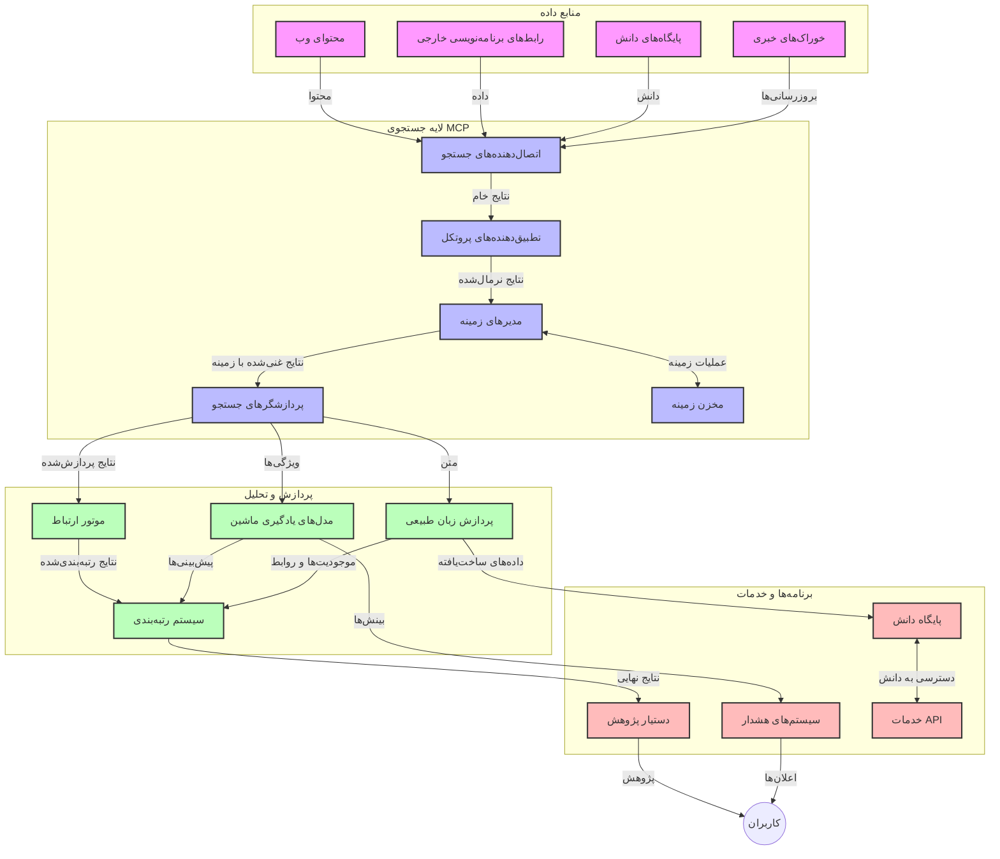
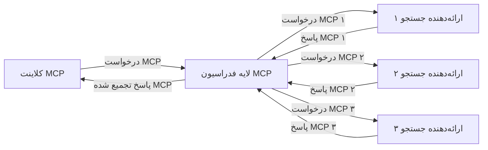
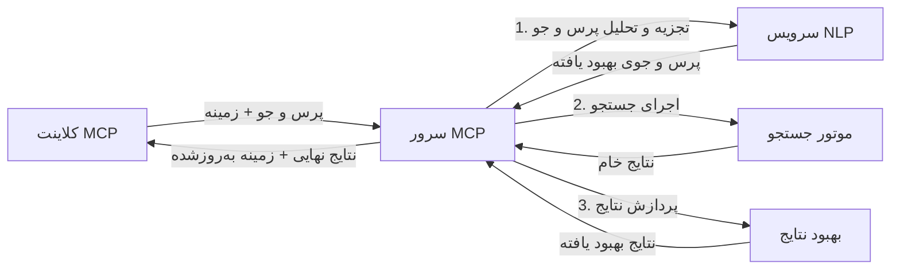

# پروتکل زمینه مدل برای جستجوی وب در زمان واقعی

## مروری کلی

جستجوی وب در زمان واقعی در محیط کنونی اطلاعات‌محور اهمیت یافته است، جایی که برنامه‌ها نیازمند دسترسی فوری به اطلاعات به‌روز در سراسر اینترنت برای ارائه پاسخ‌های مرتبط و به موقع هستند. پروتکل زمینه مدل (MCP) پیشرفت قابل توجهی در بهینه‌سازی این فرآیندهای جستجوی در زمان واقعی به‌نمایش می‌گذارد، با افزایش کارایی جستجو، حفظ انسجام زمینه‌ای و بهبود عملکرد کلی سیستم.

این ماژول بررسی می‌کند چگونه MCP جستجوی وب در زمان واقعی را با ارائه رویکردی استاندارد برای مدیریت زمینه در بین مدل‌های هوش مصنوعی، موتورهای جستجو و برنامه‌ها متحول می‌سازد.

### آنچه خواهید آموخت

در این راهنمای جامع، خواهید آموخت:

- چگونه MCP پلی بی‌وقفه بین مدل‌های هوش مصنوعی و قابلیت‌های جستجوی وب در زمان واقعی ایجاد می‌کند  
- الگوهای معماری برای پیاده‌سازی راه‌حل‌های جستجوی مؤثر و مقیاس‌پذیر با MCP  
- تکنیک‌هایی برای حفظ زمینه جستجو در چندین پرس‌وجو و تعاملات  
- پیاده‌سازی‌های کد عملی در پایتون و جاوااسکریپت برای سناریوهای متنوع جستجو  
- روش‌هایی برای متعادل کردن مرتبط بودن، تازگی و عملکرد در سیستم‌های جستجو با قدرت MCP  

## مقدمه‌ای بر جستجوی وب در زمان واقعی

جستجوی وب در زمان واقعی رویکردی فناورانه است که امکان پرسشگری، پردازش و تحلیل مستمر اطلاعات وبی را هنگام انتشار یا به‌روزرسانی آن فراهم می‌کند، و به سیستم‌ها اجازه می‌دهد اطلاعات تازه و مرتبط را با کمترین تأخیر ارائه دهند. برخلاف سیستم‌های جستجوی سنتی که بر داده‌های شاخص‌گذاری شده با ساعتها یا روزها قدمت فعالیت دارند، جستجوی زمان واقعی داده‌های زنده وب را پردازش می‌کند تا بینش‌ها و اطلاعاتی را ارائه دهد که بازتاب‌دهنده وضعیت فعلی محتوای آنلاین است.

### مفاهیم اصلی جستجوی وب در زمان واقعی:

- **پردازش پیوسته پرس‌وجو**: پرس‌وجوهای جستجو در برابر منابع داده در حال به‌روزرسانی مداوم پردازش می‌شوند  
- **اولویت‌بندی تازگی**: سیستم‌ها برای اولویت‌دهی به اطلاعات تازه طراحی شده‌اند  
- **متعادل‌سازی مرتبط بودن**: حفظ توازن بین مرتبط بودن و تازگی  
- **معماری مقیاس‌پذیر**: سیستم‌ها باید بار متغیر پرس‌وجو و حجم داده را مدیریت کنند  
- **درک زمینه‌ای**: حفظ زمینه کاربر در تمامی تکرارهای جستجو برای نتایج معنادار حیاتی است  
- **بازفرمول‌بندی پویا پرس‌وجو**: تغییر تطبیقی پرس‌وجوها بر مبنای زمینه و نتایج قبلی  
- **ادغام چندمنبعی**: ترکیب نتایج از چندین ارائه‌دهنده جستجو و منابع وب  
- **درک معنایی**: پردازش پرس‌وجوها و محتوا بر اساس معنی نه تنها کلمات کلیدی  
- **رتبه‌بندی در زمان واقعی**: تنظیم مداوم رتبه نتایج با آمدن اطلاعات جدید  

### پروتکل زمینه مدل و جستجوی وب در زمان واقعی

پروتکل زمینه مدل (MCP) چندین چالش حیاتی در محیط‌های جستجوی وب در زمان واقعی را هدف قرار می‌دهد:

1. **حفظ زمینه جستجو**: MCP استانداردسازی می‌کند که چگونه زمینه در اجزای توزیع‌شده جستجو حفظ شود، تضمین می‌کند که مدل‌های هوش مصنوعی و گره‌های پردازشی به سابقه پرس‌وجوی مرتبط و ترجیحات کاربر دسترسی دارند.  
2. **مدیریت پرس‌وجوی مؤثر**: با ارائه مکانیزم‌های ساختاری برای انتقال زمینه، MCP بار تکرار زمینه در هر تکرار جستجو را کاهش می‌دهد.  
3. **همکاری‌پذیری**: MCP زبان مشترکی برای اشتراک زمینه بین فناوری‌های جستجوی متنوع و مدل‌های هوش مصنوعی ایجاد می‌کند و معماری‌های منعطف‌تر و توسعه‌پذیرتر را ممکن می‌سازد.  
4. **زمینه بهینه‌شده برای جستجو**: پیاده‌سازی‌های MCP می‌توانند عناصر زمینه‌ای که بیشترین ارتباط را برای جستجوی مؤثر دارند اولویت‌دهی کنند، برای عملکرد و دقت بهینه شوند.  
5. **پردازش جستجوی تطبیقی**: با مدیریت صحیح زمینه از طریق MCP، سیستم‌های جستجو می‌توانند پردازش را مطابق نیازهای متغیر کاربر و چشم‌انداز اطلاعات به صورت پویا تنظیم کنند.  

در برنامه‌های مدرن از گردآوری اخبار تا دستیاران پژوهش، ادغام MCP با فناوری‌های جستجوی وب امکان جستجوی هوشمندتر و آگاه از زمینه را فراهم می‌آورد که می‌تواند با ادامه تعاملات کاربر، نتایج مرتبط‌تری ارائه دهد.

## اهداف یادگیری

تا پایان این درس، قادر خواهید بود:

- اصول جستجوی وب در زمان واقعی و چالش‌های آن در برنامه‌های مدرن را درک کنید  
- توضیح دهید چگونه پروتکل زمینه مدل (MCP) قابلیت‌های جستجوی وب در زمان واقعی را بهبود می‌بخشد  
- راه‌حل‌های جستجو مبتنی بر MCP را با استفاده از چارچوب‌ها و APIهای محبوب پیاده‌سازی کنید  
- معماری‌های جستجو مقیاس‌پذیر و با عملکرد بالا را با MCP طراحی و مستقر کنید  
- مفاهیم MCP را به موارد کاربردی مختلف از جمله جستجوی معنایی، دستیار پژوهشی، و مرورگری افزوده توسط هوش مصنوعی اعمال نمایید  
- روندهای نوظهور و نوآوری‌های آینده در فناوری‌های جستجو بر پایه MCP را ارزیابی کنید  
- سیستم‌های جستجوی آگاه به زمینه را توسعه دهید که از تعاملات کاربر یاد می‌گیرند  
- قابلیت‌های جستجوی وب را در دستیاران هوش مصنوعی با استفاده از پروتکل‌های استاندارد MCP ادغام نمایید  
- خطوط لوله جستجوی چندمرحله‌ای بسازید که نتایج را به‌تدریج بر اساس زمینه بهبود دهند  
- عملکرد جستجو را در حالی که آگاهی کامل از زمینه حفظ می‌شود بهینه کنید  

### تعریف و اهمیت

جستجوی وب در زمان واقعی شامل پرسشگری، واکشی و ارائه پیوسته اطلاعات وبی با کمترین تأخیر است. بر خلاف موتورهای جستجوی سنتی که به صورت دوره‌ای وب را می‌خزند و فهرست‌بندی می‌کنند، جستجوی زمان واقعی هدفش آشکار کردن اطلاعات در همان لحظه‌ای است که در دسترس قرار می‌گیرد و امکان دسترسی فوری به جدیدترین محتوا را فراهم می‌کند.

ویژگی‌های کلیدی جستجوی وب در زمان واقعی شامل:

- **تازگی**: اولویت دادن به محتوای اخیر و به‌روزرسانی‌ها  
- **پردازش مستمر**: پایش مداوم اطلاعات جدید  
- **تطبیق پرس‌وجو**: اصلاح پرس‌وجوهای جستجو بر اساس زمینه و بازخورد  
- **تحویل فوری**: ارائه نتایج جستجو با کمترین تأخیر  
- **نگهداری زمینه**: استفاده از پرس‌وجوهای قبلی برای افزایش مرتبط بودن  

### چالش‌های جستجوی سنتی وب

روش‌های سنتی جستجوی وب هنگام اعمال در سناریوهای زمان واقعی محدودیت‌هایی دارند:

1. **تکه‌تکه شدن زمینه**: دشواری در نگهداری زمینه جستجو در میان چندین پرس‌وجو  
2. **تازگی اطلاعات**: چالش‌های دسترسی و اولویت دادن به جدیدترین داده‌ها  
3. **پیچیدگی ادغام**: مشکلات همکاری‌پذیری بین سیستم‌ها و برنامه‌ها  
4. **مسائل تأخیر**: متعادل‌سازی جامع بودن جستجو با نیازهای زمان پاسخ  
5. **تنظیم مرتبط بودن**: تضمین دقت و مرتبط بودن در حالی که تازگی در اولویت است  

## درک پروتکل زمینه مدل (MCP) برای جستجو

### MCP در زمینه‌های جستجو چیست؟

پروتکل زمینه مدل (MCP) یک پروتکل ارتباطی استاندارد شده است که برای تسهیل تعامل مؤثر بین مدل‌های هوش مصنوعی و برنامه‌ها طراحی شده است. در زمینه جستجوی وب در زمان واقعی، MCP چارچوبی فراهم می‌کند برای:

- حفظ زمینه جستجو در طول دنباله پرس‌وجوها  
- استانداردسازی قالب‌های پرس‌وجو و نتایج جستجو  
- بهینه‌سازی انتقال پارامترها و نتایج جستجو  
- ارتقاء ارتباط بین مدل‌ها و موتورهای جستجو  

### اجزا و معماری اصلی

معماری MCP برای جستجوی وب زمان واقعی شامل چند جزء کلیدی است:

1. **مدیران زمینه پرس‌وجو**: مدیریت و نگهداری زمینه جستجو در میان چندین پرس‌وجو  
2. **پردازشگرهای جستجو**: پردازش درخواست‌های جستجوی ورودی با تکنیک‌های آگاه از زمینه  
3. **مبدل‌های پروتکل**: تبدیل بین APIهای جستجوی مختلف در حالی که زمینه حفظ می‌شود  
4. **انبار زمینه**: ذخیره و واکشی مؤثر تاریخچه جستجو و ترجیحات  
5. **کانکتورهای جستجو**: اتصال به موتورهای جستجو و APIهای وب مختلف  


  
### چگونه MCP جستجوی وب زمان واقعی را بهبود می‌بخشد

MCP چالش‌های جستجوی سنتی وب را از طریق موارد زیر حل می‌کند:

- **تداوم زمینه‌ای**: حفظ روابط پرس‌وجوها در کل جلسه جستجو  
- **انتقال بهینه**: کاهش افزونگی پارامترهای جستجو با مدیریت هوشمند زمینه  
- **رابط‌های استاندارد**: ارائه APIهای یکسان برای اجزای جستجو  
- **کاهش تأخیر**: کمینه‌سازی بار پردازشی از طریق مدیریت مؤثر زمینه  
- **افزایش مرتبط بودن**: بهبود مرتبط بودن جستجو با حفظ نیت کاربر در چندین پرس‌وجو  

## ادغام و پیاده‌سازی

سیستم‌های جستجوی وب زمان واقعی به طراحی معماری دقیق و پیاده‌سازی نیاز دارند تا هم عملکرد و هم انسجام زمینه‌ای حفظ شود. پروتکل زمینه مدل رویکردی استاندارد برای ادغام مدل‌های هوش مصنوعی و فناوری‌های جستجو ارائه می‌دهد که امکان ساخت خطوط لوله جستجوی پیچیده‌تر و آگاه از زمینه را فراهم می‌آورد.

### مرور کلی ادغام MCP در معماری‌های جستجو

پیاده‌سازی MCP در محیط‌های جستجوی وب زمان واقعی چند نکته کلیدی دارد:

1. **سریال‌سازی زمینه جستجو**: MCP مکانیزم‌های مؤثری برای رمزگذاری اطلاعات زمینه در درخواست‌های جستجو فراهم می‌کند، تضمین می‌کند که زمینه ضروری در کل مسیر پردازش پرس‌وجو دنبال می‌شود. این شامل قالب‌های سریال‌سازی استاندارد شده بهینه‌شده برای فراداده‌های مرتبط با جستجو است.  
2. **پردازش حالت‌مند جستجو**: MCP پردازش هوشمندتری را با حفظ نمای زمینه یکسان در تکرارهای جستجو ممکن می‌سازد. این به ویژه در خطوط لوله جستجوی چندمرحله‌ای که با پالایش زمینه نتایج بهبود می‌یابند، ارزشمند است.  
3. **گسترش و پالایش پرس‌وجو**: پیاده‌سازی‌های MCP در سیستم‌های جستجو می‌توانند گسترش و پالایش پیشرفته پرس‌وجو را بر اساس زمینه تجمع یافته تسهیل کنند و اجازه دهند نتایج به طور فزاینده مرتبط‌تر شوند.  
4. **کش و اولویت‌بندی نتایج**: با استانداردسازی مدیریت زمینه، MCP به مدیریت کش و اولویت‌بندی نتایج کمک می‌کند تا اجزا بتوانند بر اساس زمینه جستجوی در حال تحول سازگار شوند.  
5. **فدراسیون و تجمیع جستجو**: MCP فدراسیون پیشرفته‌تر جستجو را در چندین بن‌ک‌اند تسهیل می‌کند با ارائه نمایش‌های ساختاریافته از زمینه جستجو، امکان تجمیع معنادارتر نتایج از منابع متنوع را می‌دهد.  

پیاده‌سازی MCP در فناوری‌های جستجوی مختلف رویکرد یکپارچه‌ای به مدیریت زمینه ایجاد می‌کند، نیاز به کد ادغام سفارشی را کاهش می‌دهد و توانایی سیستم را برای حفظ زمینه معنادار به هنگام تحول پرس‌وجوها افزایش می‌دهد.

### MCP در پیاده‌سازی‌های مختلف جستجوی وب

این مثال‌ها مطابق با مشخصات جاری MCP هستند که بر پروتکل JSON-RPC با مکانیزم‌های انتقال متمایز تمرکز دارد. کد نشان می‌دهد چگونه می‌توانید ادغام‌های جستجوی سفارشی ایجاد کنید در حالی که سازگاری کامل با پروتکل MCP حفظ شود.

<details>
<summary>پیاده‌سازی پایتون با API جستجوی عمومی</summary>

```python
import asyncio
import json
import aiohttp
from typing import Dict, Any, Optional, List
from contextlib import asynccontextmanager
from collections.abc import AsyncIterator

# وارد کردن کتابخانه‌های استاندارد MCP
from mcp.client.session import ClientSession
from mcp.client.streamable_http import streamablehttp_client
from mcp.types import TextContent, CreateMessageRequestParams, CreateMessageResult
from mcp.server.fastmcp import FastMCP

# ایجاد یک سرور FastMCP برای جستجوی وب
search_server = FastMCP("WebSearch")

# کلاسی برای مدیریت عملیات جستجوی وب
class WebSearchHandler:
    def __init__(self, api_endpoint: str, api_key: str):
        self.api_endpoint = api_endpoint
        self.api_key = api_key
        self.session = None
        
    async def initialize(self):
        """Initialize the HTTP session"""
        self.session = aiohttp.ClientSession(
            headers={"Authorization": f"Bearer {self.api_key}"}
        )
    
    async def close(self):
        """Close the HTTP session"""
        if self.session:
            await self.session.close()
            
    async def perform_search(self, query: str, max_results: int = 5, 
                           include_domains: List[str] = None, 
                           exclude_domains: List[str] = None,
                           time_period: str = "any") -> Dict[str, Any]:
        """Perform web search using the search API"""
        # ساخت پارامترهای جستجو
        search_params = {
            "q": query,
            "limit": max_results,
            "time": time_period
        }
        
        if include_domains:
            search_params["site"] = ",".join(include_domains)
            
        if exclude_domains:
            search_params["exclude_site"] = ",".join(exclude_domains)
        
        # انجام درخواست جستجو
        try:
            async with self.session.get(
                self.api_endpoint,
                params=search_params
            ) as response:
                if response.status != 200:
                    error_text = await response.text()
                    raise Exception(f"Search API error: {response.status} - {error_text}")
                
                search_data = await response.json()
                
                # تبدیل پاسخ مخصوص API به فرمت استاندارد
                results = []
                for item in search_data.get("results", []):
                    results.append({
                        "title": item.get("title", ""),
                        "url": item.get("url", ""),
                        "snippet": item.get("snippet", ""),
                        "date": item.get("published_date", ""),
                        "source": item.get("source", "")
                    })
                
                return {
                    "query": query,
                    "totalResults": len(results),
                    "results": results
                }
        except Exception as e:
            print(f"Search API request error: {e}")
            raise

# مقداردهی اولیه مدیریت‌کننده جستجو
search_handler = WebSearchHandler(
    api_endpoint="https://api.search-service.example/search",
    api_key="your-api-key-here"
)

# تنظیم طول عمر برای مدیریت‌کننده جستجو
@asyncio.asynccontextmanager
async def app_lifespan(server: FastMCP):
    """Manage application lifecycle"""
    await search_handler.initialize()
    try:
        yield {"search_handler": search_handler}
    finally:
        await search_handler.close()

# تنظیم طول عمر برای سرور
search_server = FastMCP("WebSearch", lifespan=app_lifespan)

# ثبت ابزار جستجوی وب
@search_server.tool()
async def web_search(query: str, max_results: int = 5, 
                   include_domains: List[str] = None,
                   exclude_domains: List[str] = None,
                   time_period: str = "any") -> Dict[str, Any]:
    """
    Search the web for information
    
    Args:
        query: The search query
        max_results: Maximum number of results to return (default: 5)
        include_domains: List of domains to include in search results
        exclude_domains: List of domains to exclude from search results
        time_period: Time period for results ("day", "week", "month", "any")
        
    Returns:
        Dictionary containing search results
    """
    ctx = search_server.get_context()
    search_handler = ctx.request_context.lifespan_context["search_handler"]
    
    results = await search_handler.perform_search(
        query=query,
        max_results=max_results,
        include_domains=include_domains,
        exclude_domains=exclude_domains,
        time_period=time_period
    )
    
    return results

# نمونه استفاده از کلاینت
async def client_example():
    # اتصال به سرور جستجو با استفاده از انتقال HTTP قابل جریان
    async with streamablehttp_client("http://localhost:8000/mcp") as (read, write, _):
        async with ClientSession(read, write) as session:
            # مقداردهی اولیه اتصال
            await session.initialize()
            
            # فراخوانی ابزار وب_جستجو
            search_results = await session.call_tool(
                "web_search", 
                {
                    "query": "latest developments in AI and Model Context Protocol",
                    "max_results": 5,
                    "time_period": "day",
                    "include_domains": ["github.com", "microsoft.com"]
                }
            )
            
            print(f"Search results: {search_results}")

# نمونه اجرای سرور
if __name__ == "__main__":
    # اجرای سرور با انتقال HTTP قابل جریان
    search_server.run(transport="streamable-http")
```
</details> 

<details>
<summary>پیاده‌سازی جاوااسکریپت با جستجوی مبتنی بر مرورگر</summary>

```javascript
// پیاده‌سازی سرور MCP برای جستجوی وب
import { McpServer, ResourceTemplate } from '@modelcontextprotocol/sdk/server/mcp.js';
import { StreamableHTTPServerTransport } from '@modelcontextprotocol/sdk/server/streamableHttp.js';
import { z } from 'zod';

// ایجاد یک سرور MCP برای جستجوی وب
const searchServer = new McpServer({
    name: "BrowserSearch",
    description: "A server that provides web search capabilities"
});

// کلاس سرویس جستجو
class SearchService {
    constructor(searchApiUrl, apiKey) {
        this.searchApiUrl = searchApiUrl;
        this.apiKey = apiKey;
    }

    async performSearch(parameters) {
        const {
            query = '',
            maxResults = 5,
            includeDomains = [],
            excludeDomains = [],
            timePeriod = 'any'
        } = parameters;
        
        // ساخت URL جستجو با پارامترها
        const url = new URL(this.searchApiUrl);
        url.searchParams.append('q', query);
        url.searchParams.append('limit', maxResults);
        url.searchParams.append('time', timePeriod);
        
        if (includeDomains.length > 0) {
            url.searchParams.append('site', includeDomains.join(','));
        }
        
        if (excludeDomains.length > 0) {
            url.searchParams.append('exclude_site', excludeDomains.join(','));
        }
        
        try {
            const response = await fetch(url.toString(), {
                method: 'GET',
                headers: {
                    'Authorization': `Bearer ${this.apiKey}`,
                    'Content-Type': 'application/json'
                }
            });
            
            if (!response.ok) {
                const errorText = await response.text();
                throw new Error(`Search API error: ${response.status} - ${errorText}`);
            }
            
            const searchData = await response.json();
            
            // تبدیل پاسخ مخصوص API به فرمت استاندارد
            const results = searchData.results?.map(item => ({
                title: item.title || '',
                url: item.url || '',
                snippet: item.snippet || '',
                date: item.published_date || '',
                source: item.source || ''
            })) || [];
            
            return {
                query,
                totalResults: results.length,
                results
            };
        } catch (error) {
            console.error('Search API request error:', error);
            throw error;
        }
    }
}

// مقداردهی اولیه سرویس جستجو
const searchService = new SearchService(
    'https://api.search-service.example/search',
    'your-api-key-here'
);

// راه‌اندازی ارائه‌دهنده زمینه برای سرور
searchServer.setContextProvider(() => {
    return {
        searchService
    };
});

// ثبت ابزار جستجوی وب
searchServer.tool({
    name: 'web_search',
    description: 'Search the web for information',
    parameters: {
        type: 'object',
        properties: {
            query: {
                type: 'string',
                description: 'The search query'
            },
            maxResults: {
                type: 'integer',
                description: 'Maximum number of results to return',
                default: 5
            },
            includeDomains: {
                type: 'array',
                items: { type: 'string' },
                description: 'List of domains to include in search results'
            },
            excludeDomains: {
                type: 'array',
                items: { type: 'string' },
                description: 'List of domains to exclude from search results'
            },
            timePeriod: {
                type: 'string',
                description: 'Time period for results',
                enum: ['day', 'week', 'month', 'any'],
                default: 'any'
            }
        },
        required: ['query']
    },
    handler: async (params, context) => {
        const { searchService } = context;
        return await searchService.performSearch(params);
    }
});

// کد نمونه کلاینت برای اتصال به سرور جستجو
import { Client } from '@modelcontextprotocol/sdk/client/index.js';
import { StreamableHTTPClientTransport } from '@modelcontextprotocol/sdk/client/streamableHttp.js';

async function connectToSearchServer() {
    // اتصال به سرور جستجو
    const transport = new StreamableHTTPClientTransport(
        new URL('http://localhost:8000/mcp')
    );
    
    const client = new Client({
        name: 'search-client',
        version: '1.0.0'
    });
    
    await client.connect(transport);
    
    // اجرای ابزار جستجو
    const searchResults = await client.callTool({
        name: 'web_search',
        arguments: {
            query: 'Model Context Protocol implementation examples',
            maxResults: 10,
            timePeriod: 'week',
            includeDomains: ['github.com', 'docs.microsoft.com']
        }
    });
    
    console.log('Search results:', searchResults);
    
    // پاک‌سازی
    await client.disconnect();
}

// راه‌اندازی سرور
const transport = new StreamableHTTPServerTransport();
await searchServer.connect(transport);
console.log('Search server running at http://localhost:8000/mcp');

// در یک فرایند جداگانه یا بعد از راه‌اندازی سرور
// connectToSearchServer().catch(console.error);
```
</details> 

## نکته مهم درباره نمونه‌های کد

> **توجه مهم**: نمونه‌های کد زیر ادغام پروتکل زمینه مدل (MCP) با عملکرد جستجوی وب را نمایش می‌دهند. هرچند این نمونه‌ها الگوها و ساختارهای SDKهای رسمی MCP را دنبال می‌کنند، برای اهداف آموزشی ساده‌سازی شده‌اند.  
>  
> این نمونه‌ها شامل:  
>  
> 1. **پیاده‌سازی پایتون**: یک سرور FastMCP که ابزار جستجوی وب فراهم می‌کند و به یک API جستجوی خارجی متصل می‌شود. این مثال مدیریت درست طول عمر، مدیریت زمینه و پیاده‌سازی ابزار را بر اساس الگوهای [SDK رسمی پایتون MCP](https://github.com/modelcontextprotocol/python-sdk) نشان می‌دهد. سرور از انتقال HTTP قابل پخش توصیه‌شده استفاده می‌کند که جایگزین انتقال قدیمی SSE برای استقرارهای تولید شده است.  
>  
> 2. **پیاده‌سازی جاوااسکریپت**: پیاده‌سازی به زبان تایپ‌اسکریپت/جاوااسکریپت با استفاده از الگوی FastMCP از [SDK رسمی تایپ‌اسکریپت MCP](https://github.com/modelcontextprotocol/typescript-sdk) برای ایجاد سرور جستجو با تعاریف ابزار و اتصالات کلاینت مناسب. این نمونه‌کارها الگوهای توصیه‌شده جدید برای مدیریت نشست و حفظ زمینه را دنبال می‌کنند.  
>  
> این مثال‌ها به هندلینگ خطای اضافی، احراز هویت و کد ادغام API خاص برای استفاده در تولید نیاز دارند. نقاط پایانی API جستجویی نشان داده شده (`https://api.search-service.example/search`) علامت‌گذاری هستند و باید با نقاط پایانی واقعی سرویس جستجو جایگزین شوند.  
>  
> برای جزئیات کامل پیاده‌سازی و جدیدترین روش‌ها، لطفاً به [مشخصات رسمی MCP](https://spec.modelcontextprotocol.io/) و مستندات SDK مراجعه کنید.  

## مفاهیم اصلی

### چارچوب پروتکل زمینه مدل (MCP)

در ریشه، پروتکل زمینه مدل راهی استاندارد برای تبادل زمینه بین مدل‌های هوش مصنوعی، برنامه‌ها و خدمات فراهم می‌کند. در جستجوی وب زمان واقعی، این چارچوب برای ایجاد تجارب جستجوی چندمرحله‌ای منسجم حیاتی است. اجزای کلیدی شامل:

1. **معماری کلاینت-سرور**: MCP تفکیک واضحی بین کلاینت‌های جستجو (درخواست‌کنندگان) و سرورهای جستجو (ارائه‌دهندگان) ایجاد می‌کند که مدل‌های استقرار انعطاف‌پذیر را امکان‌پذیر می‌سازد.  
2. **ارتباط JSON-RPC**: این پروتکل از JSON-RPC برای تبادل پیغام استفاده می‌کند که با فناوری‌های وب سازگار و اجرای آن در پلتفرم‌های مختلف آسان است.  
3. **مدیریت زمینه**: MCP روش‌های ساختاریافته برای نگهداری، به‌روزرسانی و بهره‌گیری از زمینه جستجو در تعاملات متعدد تعریف می‌کند.  
4. **تعاریف ابزار**: قابلیت‌های جستجو به صورت ابزارهایی استاندارد با پارامترها و مقادیر بازگشتی تعریف شده ارائه می‌شوند.  
5. **پشتیبانی از جریان**: این پروتکل پشتیبانی از نتایج جریان‌دار را دارد که برای جستجوی زمان واقعی که نتایج ممکن است به تدریج برسند، ضروری است.  

### الگوهای ادغام جستجوی وب

هنگام ادغام MCP با جستجوی وب، چند الگو شکل می‌گیرند:

#### 1. ادغام مستقیم با ارائه‌دهنده جستجو


  
در این الگو، سرور MCP مستقیماً با یک یا چند API جستجو تعامل دارد، درخواست‌های MCP را به فراخوانی‌های اختصاصی API ترجمه و نتایج را به صورت پاسخ‌های MCP قالب‌بندی می‌کند.

#### 2. جستجوی فدراسیونی با حفظ زمینه


  
این الگو پرس‌وجوهای جستجو را در میان چندین ارائه‌دهنده جستجوی سازگار با MCP توزیع می‌کند که هرکدام ممکن است در انواع محتوا یا قابلیت‌های جستجو تخصص داشته باشند، و در عین حال زمینه یکپارچه حفظ می‌شود.

#### 3. زنجیره جستجو با زمینه غنی‌شده


  
در این الگو، فرآیند جستجو به چندین مرحله تقسیم می‌شود و زمینه در هر مرحله غنی می‌شود که منجر به نتایج به‌تدریج مرتبط‌تر می‌شود.

### اجزای زمینه جستجو

در جستجوی وب مبتنی بر MCP، زمینه معمولاً شامل موارد زیر است:

- **تاریخچه پرس‌وجو**: پرس‌وجوهای قبلی در جلسه  
- **ترجیحات کاربر**: زبان، منطقه، تنظیمات جستجوی ایمن  
- **تاریخچه تعاملات**: نتایجی که کلیک شده، زمان صرف شده روی نتایج  
- **پارامترهای جستجو**: فیلترها، ترتیب مرتب‌سازی و سایر تغییردهنده‌های جستجو  
- **دانش دامنه**: زمینه تخصصی مربوط به موضوع جستجو  
- **زمینه زمانی**: عوامل مرتبط با زمان  
- **ترجیحات منبع**: منابع اطلاعاتی مورد اعتماد یا ترجیح داده شده  

## موارد استفاده و کاربردها

### پژوهش و گردآوری اطلاعات

MCP جریان‌های کاری پژوهشی را با موارد زیر بهبود می‌بخشد:

- حفظ زمینه پژوهش در جلسات جستجو  
- امکان پرس‌وجوهای پیچیده‌تر و مرتبط‌تر از نظر زمینه‌ای  
- پشتیبانی از فدراسیون جستجوی چندمنبعی  
- تسهیل استخراج دانش از نتایج جستجو  

### پایش اخبار و روندهای زمان واقعی

جستجوهای توانمند‌شده با MCP برای پایش اخبار مزایایی ارائه می‌دهند:

- کشف اخبار در حال ظهور نزدیک به زمان واقعی  
- پالایش زمینه‌ای اطلاعات مرتبط  
- ردیابی موضوعات و نهادها در منابع متعدد  
- هشدارهای خبری شخصی‌سازی شده بر اساس زمینه کاربر  

### مرور و پژوهش افزوده‌شده توسط هوش مصنوعی

MCP امکانات جدیدی برای مرور افزوده‌شده توسط هوش مصنوعی ایجاد می‌کند:

- پیشنهادات جستجوی زمینه‌مند بر اساس فعالیت جاری مرورگر  
- ادغام بدون نقص جستجوی وب با دستیاران مبتنی بر مدل‌های زبان بزرگ  
- پالایش جستجوی چندمرحله‌ای با حفظ زمینه  
- افزایش صحت‌سنجی و تأیید اطلاعات  

## روندها و نوآوری‌های آینده

### تکامل MCP در جستجوی وب

با نگاه به آینده، پیش‌بینی می‌شود MCP طیفی از چالش‌ها و فرصت‌ها را در زمینه جستجوی وب هدف قرار دهد:
- **جستجوی چندرسانه‌ای**: ادغام جستجوی متن، تصویر، صدا و ویدئو با حفظ زمینه
- **جستجوی غیرمتمرکز**: پشتیبانی از اکوسیستم‌های جستجوی توزیع شده و فدراسیون شده
- **حریم خصوصی جستجو**: مکانیزم‌های جستجوی محافظت‌شده با آگاهی از زمینه
- **درک پرس‌وجو**: تجزیه عمیق معنایی پرس‌وجوهای جستجوی زبان طبیعی

### پیشرفت‌های بالقوه در فناوری

تکنولوژی‌های نوظهوری که آینده جستجوی MCP را شکل خواهند داد:

1. **معماری‌های جستجوی عصبی**: سیستم‌های جستجوی مبتنی بر جاسازی بهینه شده برای MCP
2. **زمینه جستجوی شخصی‌سازی‌شده**: یادگیری الگوهای جستجوی فردی کاربران در طول زمان
3. **ادغام نمودار دانش**: جستجوی زمینه‌ای بهبود یافته با نمودارهای دانش تخصصی حوزه‌ای
4. **زمینه فرامدیال**: حفظ زمینه در میان حالت‌های مختلف جستجو

## تمرین‌های عملی

### تمرین ۱: تنظیم یک خط لوله جستجوی پایه MCP

در این تمرین خواهید آموخت چگونه:
- یک محیط جستجوی پایه MCP را پیکربندی کنید
- هندلرهای زمینه را برای جستجوی وب پیاده‌سازی نمایید
- حفظ زمینه را در طول تکرارهای جستجو آزمایش و اعتبارسنجی کنید

### تمرین ۲: ساخت یک دستیار پژوهشی با جستجوی MCP

یک برنامه کامل بسازید که:
- پرسش‌های پژوهشی زبان طبیعی را پردازش کند
- جستجوهای وب آگاه از زمینه انجام دهد
- اطلاعات را از منابع متعدد ترکیب کند
- یافته‌های پژوهشی سازمان یافته را ارائه دهد

### تمرین ۳: پیاده‌سازی فدراسیون جستجوی چندمنبعی با MCP

تمرین پیشرفته که شامل موارد زیر است:
- ارسال پرس‌وجوی آگاه از زمینه به چندین موتور جستجو
- رتبه‌بندی و تجمیع نتایج
- حذف تکراری نتایج جستجو با ملاحظه زمینه
- مدیریت فراداده‌های مخصوص هر منبع

## منابع بیشتر

- [مشخصات پروتکل زمینه مدل](https://spec.modelcontextprotocol.io/) - مشخصات رسمی MCP و مستندات پروتکل دقیق
- [مستندات پروتکل زمینه مدل](https://modelcontextprotocol.io/) - راهنماها و آموزش‌های پیاده‌سازی دقیق
- [کتابخانه پایتون MCP](https://github.com/modelcontextprotocol/python-sdk) - پیاده‌سازی رسمی MCP به زبان پایتون
- [کتابخانه تایپ‌اسکریپت MCP](https://github.com/modelcontextprotocol/typescript-sdk) - پیاده‌سازی رسمی MCP به زبان تایپ‌اسکریپت
- [سرورهای مرجع MCP](https://github.com/modelcontextprotocol/servers) - پیاده‌سازی‌های مرجع سرورهای MCP
- [مستندات API جستجوی وب Bing](https://learn.microsoft.com/en-us/bing/search-apis/bing-web-search/overview) - API جستجوی وب مایکروسافت
- [API جستجوی اختصاصی گوگل JSON](https://developers.google.com/custom-search/v1/overview) - موتور جستجوی برنامه‌پذیر گوگل
- [مستندات SerpAPI](https://serpapi.com/search-api) - API صفحه نتایج موتور جستجو
- [مستندات Meilisearch](https://www.meilisearch.com/docs) - موتور جستجوی متن‌باز
- [مستندات Elasticsearch](https://www.elastic.co/guide/index.html) - موتور جستجو و تحلیل توزیع‌شده
- [مستندات LangChain](https://python.langchain.com/docs/get_started/introduction) - ساخت برنامه‌ها با مدل‌های زبان بزرگ (LLM)

## نتایج یادگیری

با تکمیل این ماژول، قادر خواهید بود:

- اصول پایه جستجوی وب در زمان واقعی و چالش‌های آن را درک کنید
- توضیح دهید چگونه پروتکل زمینه مدل (MCP) قابلیت‌های جستجوی وب در زمان واقعی را بهبود می‌بخشد
- راهکارهای جستجو مبتنی بر MCP را با استفاده از فریم‌ورک‌ها و APIهای محبوب پیاده‌سازی کنید
- معماری‌های مقیاس‌پذیر و با کارایی بالا برای جستجو را با MCP طراحی و پیاده کنید
- مفاهیم MCP را در موارد کاربردی مختلف از جمله جستجوی معنایی، دستیار پژوهشی و مرورگری افزوده با هوش مصنوعی به کار گیرید
- روندهای نوظهور و نوآوری‌های آینده در فناوری‌های جستجوی مبتنی بر MCP را ارزیابی کنید

### ملاحظات اعتماد و امنیت

هنگام پیاده‌سازی راهکارهای جستجوی وب مبتنی بر MCP، به اصول مهم زیر از مشخصات MCP توجه کنید:

1. **رضایت و کنترل کاربر**: کاربران باید صریحاً رضایت دهند و تمام دسترسی‌ها و عملیات داده را بفهمند. این امر به‌ویژه برای پیاده‌سازی‌های جستجوی وب که ممکن است به منابع داده خارجی دسترسی داشته باشند، اهمیت دارد.

2. **حریم خصوصی داده‌ها**: اطمینان حاصل کنید که پرس‌وجوها و نتایج جستجو به طور مناسب مدیریت شوند، خصوصاً زمانی که ممکن است حاوی اطلاعات حساس باشند. کنترل‌های دسترسی مناسب برای حفاظت از داده‌های کاربر پیاده‌سازی کنید.

3. **ایمنی ابزارها**: مجوزدهی و اعتبارسنجی صحیح برای ابزارهای جستجو را پیاده‌سازی کنید زیرا آن‌ها می‌توانند از طریق اجرای کد دلخواه، خطرات امنیتی ایجاد کنند. توصیف رفتار ابزار باید تا زمانی که از سروری معتبر دریافت نشده باشد، قابل اعتماد محسوب نشود.

4. **مستندسازی شفاف**: مستندات روشن درباره قابلیت‌ها، محدودیت‌ها و ملاحظات امنیتی پیاده‌سازی جستجوی مبتنی بر MCP ارائه دهید، مطابق دستورالعمل‌های مشخصات MCP.

5. **فرآیندهای رضایت‌مندی قوی**: فرآیندهای رضایت‌مندی و مجوزدهی قابل اعتماد بسازید که به وضوح توضیح دهند هر ابزار قبل از استفاده چه کارهایی انجام می‌دهد، به‌خصوص ابزارهایی که با منابع وب خارجی تعامل دارند.

برای جزئیات کامل در مورد امنیت و ملاحظات اعتماد MCP، به [مستندات رسمی](https://modelcontextprotocol.io/specification/2025-11-25/basic/security_best_practices) مراجعه کنید.

## مرحله بعد

- [۵.۱۲ احراز هویت Entra ID برای سرورهای پروتکل زمینه مدل](../mcp-security-entra/README.md)

---

<!-- CO-OP TRANSLATOR DISCLAIMER START -->
**سلب مسئولیت**:
این سند با استفاده از سرویس ترجمه هوش مصنوعی [Co-op Translator](https://github.com/Azure/co-op-translator) ترجمه شده است. در حالی که ما در تلاش برای دقت هستیم، لطفاً توجه داشته باشید که ترجمه‌های خودکار ممکن است شامل خطاها یا نادرستی‌هایی باشند. سند اصلی به زبان مادری خود باید به عنوان منبع معتبر در نظر گرفته شود. برای اطلاعات حیاتی، ترجمه حرفه‌ای انسانی توصیه می‌شود. ما در قبال هرگونه سوء تفاهم یا برداشت نادرست ناشی از استفاده از این ترجمه مسئولیتی نداریم.
<!-- CO-OP TRANSLATOR DISCLAIMER END -->