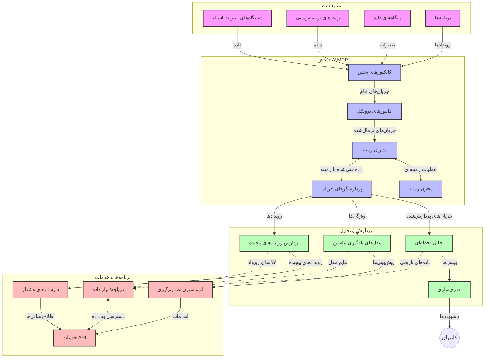

# پروتکل مدل زمینه برای جریان داده‌های زمان واقعی

## مرور کلی

جریان داده‌های زمان واقعی در دنیای مبتنی بر داده امروزی ضروری شده است، جایی که کسب‌وکارها و برنامه‌ها نیاز به دسترسی فوری به اطلاعات برای تصمیم‌گیری به موقع دارند. پروتکل مدل زمینه (MCP) پیشرفت مهمی در بهینه‌سازی این فرآیندهای جریان داده زمان واقعی فراهم می‌کند، کارایی پردازش داده‌ها را افزایش می‌دهد، یکپارچگی زمینه‌ای را حفظ می‌کند و عملکرد کلی سیستم را بهبود می‌بخشد.

این ماژول بررسی می‌کند که چگونه MCP جریان داده‌های زمان واقعی را با ارائه رویکردی استاندارد برای مدیریت زمینه در میان مدل‌های هوش مصنوعی، پلتفرم‌های جریان و برنامه‌ها دگرگون می‌کند.

## معرفی جریان داده‌های زمان واقعی

جریان داده‌های زمان واقعی یک الگوی فناوری است که انتقال، پردازش و تحلیل مداوم داده‌ها را در زمان تولید آن‌ها ممکن می‌سازد، و به سیستم‌ها اجازه می‌دهد فوراً به اطلاعات جدید واکنش نشان دهند. برخلاف پردازش دسته‌ای سنتی که روی داده‌های ایستا کار می‌کند، جریان‌ها داده‌ها را در حرکت پردازش می‌کنند و بینش‌ها و اقدامات را با کمترین تأخیر ارائه می‌دهند.

### مفاهیم اصلی جریان داده‌های زمان واقعی:

- **جریان مداوم داده‌ها**: داده‌ها به صورت جریان پیوسته و بی‌پایان از رویدادها یا رکوردها پردازش می‌شوند.
- **پردازش با تأخیر کم**: سیستم‌ها برای به حداقل رساندن زمان بین تولید داده و پردازش طراحی شده‌اند.
- **مقیاس‌پذیری**: معماری‌های جریان باید حجم و سرعت داده‌های متغیر را مدیریت کنند.
- **تحمل خطا**: سیستم‌ها نیازمند مقاومت در برابر خطاها برای تضمین جریان بدون وقفه داده‌ها هستند.
- **پردازش حالت‌دار**: حفظ زمینه در سراسر رویدادها برای تحلیل معنادار حیاتی است.

### پروتکل مدل زمینه و جریان زمان واقعی

پروتکل مدل زمینه (MCP) چندین چالش حیاتی در محیط‌های جریان زمان واقعی را هدف قرار می‌دهد:

1. **ادامه‌داری زمینه‌ای**: MCP استاندارد می‌کند که چگونه زمینه در اجزای توزیع شده جریان حفظ می‌شود، اطمینان می‌دهد که مدل‌های هوش مصنوعی و گره‌های پردازشی به زمینه تاریخی و محیطی مرتبط دسترسی دارند.

2. **مدیریت کارآمد حالت**: با ارائه مکانیزم‌های ساختاریافته برای انتقال زمینه، MCP سربار مدیریت حالت در خطوط جریان را کاهش می‌دهد.

3. **توان عملیاتی متقابل**: MCP زبان مشترکی برای به اشتراک‌گذاری زمینه بین فناوری‌های جریان مختلف و مدل‌های هوش مصنوعی ایجاد می‌کند و امکان معماری‌های انعطاف‌پذیرتر و قابل توسعه‌تر را فراهم می‌سازد.

4. **زمینه بهینه‌شده برای جریان**: پیاده‌سازی‌های MCP می‌توانند عناصری از زمینه که برای تصمیم‌گیری زمان واقعی مهم‌تر هستند را اولویت‌دهی کنند و هم عملکرد و هم دقت را بهینه نمایند.

5. **پردازش تطبیقی**: با مدیریت مناسب زمینه از طریق MCP، سیستم‌های جریان می‌توانند بر اساس شرایط و الگوهای در حال تحول داده‌ها به صورت پویا پردازش را تنظیم کنند.

در برنامه‌های مدرن از شبکه‌های حسگر IoT گرفته تا پلتفرم‌های معاملات مالی، ادغام MCP با فناوری‌های جریان امکان پردازش هوشمند، آگاه به زمینه را فراهم می‌آورد که می‌تواند به درستی به شرایط پیچیده و در حال تحول به صورت زمان واقعی واکنش نشان دهد.

## اهداف یادگیری

تا پایان این درس، شما قادر خواهید بود:

- اصول جریان داده‌های زمان واقعی و چالش‌های آن را درک کنید
- توضیح دهید که چگونه پروتکل مدل زمینه (MCP) جریان داده‌های زمان واقعی را بهبود می‌بخشد
- راه‌حل‌های مبتنی بر MCP را با استفاده از چارچوب‌های محبوبی مانند Kafka و Pulsar پیاده‌سازی کنید
- معماری‌های جریان با عملکرد بالا و تحمل خطا را با MCP طراحی و اجرا نمایید
- مفاهیم MCP را در موارد استفاده IoT، معاملات مالی، و تحلیلات مبتنی بر هوش مصنوعی به کار ببرید
- روندها و نوآوری‌های آینده در فناوری‌های جریان مبتنی بر MCP را ارزیابی کنید

### تعریف و اهمیت

جریان داده‌های زمان واقعی شامل تولید، پردازش و تحویل مداوم داده‌ها با کمترین تأخیر است. برخلاف پردازش دسته‌ای که داده‌ها به صورت گروهی جمع‌آوری و پردازش می‌شوند، داده‌های جریان یافته به‌تدریج هنگام رسیدن پردازش می‌شوند که امکان بینش‌ها و اقدامات فوری را فراهم می‌کند.

ویژگی‌های کلیدی جریان داده‌های زمان واقعی عبارتند از:

- **تأخیر پایین**: پردازش و تحلیل داده‌ها در عرض میلی‌ثانیه تا ثانیه
- **جریان مداوم**: جریان‌های بدون وقفه داده از منابع مختلف
- **پردازش فوری**: تحلیل داده هنگام رسیدن به جای پردازش دسته‌ای
- **معماری رویدادمحور**: واکنش به رویدادها در زمان وقوع آن‌ها

### چالش‌ها در جریان داده‌های سنتی

رویکردهای سنتی جریان داده با محدودیت‌های متعددی مواجه هستند:

1. **از دست رفتن زمینه**: دشواری حفظ زمینه در سیستم‌های توزیع شده
2. **مشکلات مقیاس‌پذیری**: چالش در مقیاس‌دهی برای حجم و سرعت بالای داده
3. **پیچیدگی یکپارچه‌سازی**: مشکلات در توان عملیاتی بین سیستم‌های مختلف
4. **مدیریت تأخیر**: تعادل بین توان عملیاتی و زمان پردازش
5. **یکپارچگی داده**: تضمین دقت و کامل بودن داده در جریان

## درک پروتکل مدل زمینه (MCP)

### MCP چیست؟

پروتکل مدل زمینه (MCP) یک پروتکل ارتباطی استاندارد شده است که برای تسهیل تعامل کارآمد بین مدل‌های هوش مصنوعی و برنامه‌ها طراحی شده است. در زمینه جریان داده‌های زمان واقعی، MCP چارچوبی برای:

- حفظ زمینه در سراسر خط لوله داده
- استانداردسازی قالب‌های تبادل داده
- بهینه‌سازی انتقال مجموعه داده‌های بزرگ
- بهبود ارتباط بین مدل‌ها و برنامه‌ها

فراهم می‌آورد.

### اجزا و معماری اصلی

معماری MCP برای جریان زمان واقعی شامل چندین جزء کلیدی است:

1. **مدیران زمینه**: مدیریت و نگهداری اطلاعات زمینه‌ای در سراسر خط لوله جریان
2. **پردازشگرهای جریان**: پردازش جریان‌های داده ورودی با استفاده از تکنیک‌های آگاه به زمینه
3. **مبدل‌های پروتکل**: تبدیل بین پروتکل‌های مختلف جریان در حالی که زمینه حفظ می‌شود
4. **ذخیره‌ساز زمینه**: ذخیره و بازیابی کارآمد اطلاعات زمینه‌ای
5. **کانکتورهای جریان**: اتصال به پلتفرم‌های مختلف جریان (Kafka، Pulsar، Kinesis و غیره)



### چگونه MCP مدیریت داده‌های زمان واقعی را بهبود می‌بخشد

MCP چالش‌های جریان سنتی را از طریق:

- **یکپارچگی زمینه‌ای**: حفظ روابط بین نقاط داده در سراسر خط لوله
- **انتقال بهینه**: کاهش افزونگی در تبادل داده با مدیریت هوشمند زمینه
- **رابط‌های استاندارد**: ارائه APIهای متمایز برای اجزای جریان
- **کاهش تأخیر**: کاهش بار پردازش با مدیریت کارآمد زمینه
- **مقیاس‌پذیری بهبود یافته**: حمایت از مقیاس‌افزایی افقی در حالی که زمینه حفظ می‌شود

حل می‌کند.

## یکپارچه‌سازی و پیاده‌سازی

سیستم‌های جریان داده زمان واقعی نیازمند طراحی معماری دقیق و پیاده‌سازی هستند تا هم عملکرد و هم یکپارچگی زمینه‌ای حفظ شود. پروتکل مدل زمینه رویکردی استاندارد برای ادغام مدل‌های هوش مصنوعی و فناوری‌های جریان ارائه می‌دهد که امکان ایجاد خطوط پردازش هوشمندتر و آگاه به زمینه را فراهم می‌کند.

### مروری بر ادغام MCP در معماری‌های جریان

پیاده‌سازی MCP در محیط‌های جریان زمان واقعی شامل ملاحظات کلیدی زیر است:

1. **سریال‌سازی و انتقال زمینه**: MCP مکانیزم‌های موثری برای کدگذاری اطلاعات زمینه در بسته‌های داده جریان فراهم می‌کند تا اطمینان حاصل شود که زمینه ضروری در سراسر خط لوله پردازش همراه داده باقی می‌ماند. این شامل قالب‌های سریال‌سازی استاندارد شده بهینه‌شده برای انتقال جریان است.

2. **پردازش حالت‌دار جریان**: MCP پردازش حالت‌دار هوشمندانه‌تری را با حفظ نمایش زمینه‌های سازگار در گره‌های پردازشی ممکن می‌سازد، که در معماری‌های توزیع شده جریان که مدیریت حالت در آن‌ها به طور سنتی چالش‌برانگیز است، بسیار ارزشمند است.

3. **زمان رویداد در مقابل زمان پردازش**: پیاده‌سازی‌های MCP در سیستم‌های جریان باید به چالش رایج تمایز بین زمان وقوع رویدادها و زمان پردازش آن‌ها پاسخ دهند. این پروتکل می‌تواند زمینه زمانی را که معناشناسی زمان رویداد را حفظ می‌کند، در بر گیرد.

4. **مدیریت فشار معکوس**: با استانداردسازی مدیریت زمینه، MCP به مدیریت فشار معکوس در سیستم‌های جریان کمک می‌کند، به اجزا اجازه می‌دهد قابلیت‌های پردازش خود را منتقل و جریان را متناسب تنظیم کنند.

5. **پنجره‌بندی و تجمع زمینه‌ای**: MCP با ارائه نمایش‌های ساختاریافته از زمینه‌های زمانی و رابطه‌ای، امکان عملیات پنجره‌بندی پیشرفته‌تر را فراهم می‌آورد و تجمع‌های معنادارتری را در سراسر جریان رویدادها ممکن می‌کند.

6. **پردازش دقیقا یک بار**: در سیستم‌های جریان که به معنای پردازش دقیقا یک بار نیاز دارند، MCP می‌تواند فراداده پردازش را وارد کند تا به ردیابی و تأیید وضعیت پردازش در اجزای توزیع شده کمک نماید.

پیاده‌سازی MCP در فناوری‌های مختلف جریان، رویکرد یکپارچه‌ای برای مدیریت زمینه ایجاد می‌کند، نیاز به کد یکپارچه‌سازی سفارشی را کاهش می‌دهد و در عین حال قابلیت سیستم برای حفظ زمینه معنادار در هنگام عبور داده‌ها از خط لوله را افزایش می‌دهد.

### MCP در چارچوب‌های مختلف جریان داده

این مثال‌ها طبق مشخصات فعلی MCP است که بر یک پروتکل مبتنی بر JSON-RPC با مکانیزم‌های انتقال متمایز تمرکز دارد. کد نشان می‌دهد چگونه می‌توانید انتقال‌های سفارشی را پیاده‌سازی کنید که پلتفرم‌های جریان مانند Kafka و Pulsar را ادغام کرده و در عین حال سازگاری کامل با پروتکل MCP داشته باشند.

این نمونه‌ها به گونه‌ای طراحی شده‌اند که نشان دهند چگونه پلتفرم‌های جریان می‌توانند با MCP ادغام شوند تا پردازش داده‌های زمان واقعی را در حالی که آگاهی زمینه‌ای که مرکز MCP است، حفظ می‌کنند، فراهم کنند. این رویکرد اطمینان می‌دهد که نمونه‌های کد به طور دقیق وضعیت فعلی مشخصات MCP را تا ژوئن ۲۰۲۵ منعکس می‌کنند.

MCP می‌تواند با چارچوب‌های جریان محبوب از جمله:

#### ادغام Apache Kafka

```python
import asyncio
import json
from typing import Dict, Any, Optional
from confluent_kafka import Consumer, Producer, KafkaError
from mcp.client import Client, ClientCapabilities
from mcp.core.message import JsonRpcMessage
from mcp.core.transports import Transport

# کلاس حمل و نقل سفارشی برای ارتباط MCP با Kafka
class KafkaMCPTransport(Transport):
    def __init__(self, bootstrap_servers: str, input_topic: str, output_topic: str):
        self.bootstrap_servers = bootstrap_servers
        self.input_topic = input_topic
        self.output_topic = output_topic
        self.producer = Producer({'bootstrap.servers': bootstrap_servers})
        self.consumer = Consumer({
            'bootstrap.servers': bootstrap_servers,
            'group.id': 'mcp-client-group',
            'auto.offset.reset': 'earliest'
        })
        self.message_queue = asyncio.Queue()
        self.running = False
        self.consumer_task = None
        
    async def connect(self):
        """Connect to Kafka and start consuming messages"""
        self.consumer.subscribe([self.input_topic])
        self.running = True
        self.consumer_task = asyncio.create_task(self._consume_messages())
        return self
        
    async def _consume_messages(self):
        """Background task to consume messages from Kafka and queue them for processing"""
        while self.running:
            try:
                msg = self.consumer.poll(1.0)
                if msg is None:
                    await asyncio.sleep(0.1)
                    continue
                
                if msg.error():
                    if msg.error().code() == KafkaError._PARTITION_EOF:
                        continue
                    print(f"Consumer error: {msg.error()}")
                    continue
                
                # تجزیه مقدار پیام به عنوان JSON-RPC
                try:
                    message_str = msg.value().decode('utf-8')
                    message_data = json.loads(message_str)
                    mcp_message = JsonRpcMessage.from_dict(message_data)
                    await self.message_queue.put(mcp_message)
                except Exception as e:
                    print(f"Error parsing message: {e}")
            except Exception as e:
                print(f"Error in consumer loop: {e}")
                await asyncio.sleep(1)
    
    async def read(self) -> Optional[JsonRpcMessage]:
        """Read the next message from the queue"""
        try:
            message = await self.message_queue.get()
            return message
        except Exception as e:
            print(f"Error reading message: {e}")
            return None
    
    async def write(self, message: JsonRpcMessage) -> None:
        """Write a message to the Kafka output topic"""
        try:
            message_json = json.dumps(message.to_dict())
            self.producer.produce(
                self.output_topic,
                message_json.encode('utf-8'),
                callback=self._delivery_report
            )
            self.producer.poll(0)  # فراخوانی بازگشت‌ها
        except Exception as e:
            print(f"Error writing message: {e}")
    
    def _delivery_report(self, err, msg):
        """Kafka producer delivery callback"""
        if err is not None:
            print(f'Message delivery failed: {err}')
        else:
            print(f'Message delivered to {msg.topic()} [{msg.partition()}]')
    
    async def close(self) -> None:
        """Close the transport"""
        self.running = False
        if self.consumer_task:
            self.consumer_task.cancel()
            try:
                await self.consumer_task
            except asyncio.CancelledError:
                pass
        self.consumer.close()
        self.producer.flush()

# نمونه استفاده از حمل و نقل Kafka MCP
async def kafka_mcp_example():
    # ایجاد کلاینت MCP با حمل و نقل Kafka
    client = Client(
        {"name": "kafka-mcp-client", "version": "1.0.0"},
        ClientCapabilities({})
    )
    
    # ایجاد و اتصال حمل و نقل Kafka
    transport = KafkaMCPTransport(
        bootstrap_servers="localhost:9092",
        input_topic="mcp-responses",
        output_topic="mcp-requests"
    )
    
    await client.connect(transport)
    
    try:
        # مقداردهی اولیه جلسه MCP
        await client.initialize()
        
        # نمونه‌ای از اجرای یک ابزار از طریق MCP
        response = await client.execute_tool(
            "process_data",
            {
                "data": "sample data",
                "metadata": {
                    "source": "sensor-1",
                    "timestamp": "2025-06-12T10:30:00Z"
                }
            }
        )
        
        print(f"Tool execution response: {response}")
        
        # خاموش‌کردن تمیز
        await client.shutdown()
    finally:
        await transport.close()

# اجرای نمونه
if __name__ == "__main__":
    asyncio.run(kafka_mcp_example())
```

#### پیاده‌سازی Apache Pulsar

```python
import asyncio
import json
import pulsar
from typing import Dict, Any, Optional
from mcp.core.message import JsonRpcMessage
from mcp.core.transports import Transport
from mcp.server import Server, ServerOptions
from mcp.server.tools import Tool, ToolExecutionContext, ToolMetadata

# ایجاد یک انتقال سفارشی MCP که از Pulsar استفاده می‌کند
class PulsarMCPTransport(Transport):
    def __init__(self, service_url: str, request_topic: str, response_topic: str):
        self.service_url = service_url
        self.request_topic = request_topic
        self.response_topic = response_topic
        self.client = pulsar.Client(service_url)
        self.producer = self.client.create_producer(response_topic)
        self.consumer = self.client.subscribe(
            request_topic,
            "mcp-server-subscription",
            consumer_type=pulsar.ConsumerType.Shared
        )
        self.message_queue = asyncio.Queue()
        self.running = False
        self.consumer_task = None
    
    async def connect(self):
        """Connect to Pulsar and start consuming messages"""
        self.running = True
        self.consumer_task = asyncio.create_task(self._consume_messages())
        return self
    
    async def _consume_messages(self):
        """Background task to consume messages from Pulsar and queue them for processing"""
        while self.running:
            try:
                # دریافت غیرمسدودکننده با زمان‌تعیین‌شده
                msg = self.consumer.receive(timeout_millis=500)
                
                # پردازش پیام
                try:
                    message_str = msg.data().decode('utf-8')
                    message_data = json.loads(message_str)
                    mcp_message = JsonRpcMessage.from_dict(message_data)
                    await self.message_queue.put(mcp_message)
                    
                    # تایید دریافت پیام
                    self.consumer.acknowledge(msg)
                except Exception as e:
                    print(f"Error processing message: {e}")
                    # تایید منفی اگر خطایی رخ داده باشد
                    self.consumer.negative_acknowledge(msg)
            except Exception as e:
                # رسیدگی به انقضای زمان یا سایر استثناء‌ها
                await asyncio.sleep(0.1)
    
    async def read(self) -> Optional[JsonRpcMessage]:
        """Read the next message from the queue"""
        try:
            message = await self.message_queue.get()
            return message
        except Exception as e:
            print(f"Error reading message: {e}")
            return None
    
    async def write(self, message: JsonRpcMessage) -> None:
        """Write a message to the Pulsar output topic"""
        try:
            message_json = json.dumps(message.to_dict())
            self.producer.send(message_json.encode('utf-8'))
        except Exception as e:
            print(f"Error writing message: {e}")
    
    async def close(self) -> None:
        """Close the transport"""
        self.running = False
        if self.consumer_task:
            self.consumer_task.cancel()
            try:
                await self.consumer_task
            except asyncio.CancelledError:
                pass
        self.consumer.close()
        self.producer.close()
        self.client.close()

# تعریف یک ابزار نمونه MCP که داده‌های جریانی را پردازش می‌کند
@Tool(
    name="process_streaming_data",
    description="Process streaming data with context preservation",
    metadata=ToolMetadata(
        required_capabilities=["streaming"]
    )
)
async def process_streaming_data(
    ctx: ToolExecutionContext,
    data: str,
    source: str,
    priority: str = "medium"
) -> Dict[str, Any]:
    """
    Process streaming data while preserving context
    
    Args:
        ctx: Tool execution context
        data: The data to process
        source: The source of the data
        priority: Priority level (low, medium, high)
        
    Returns:
        Dict containing processed results and context information
    """
    # نمونه پردازشی که از زمینه MCP بهره می‌برد
    print(f"Processing data from {source} with priority {priority}")
    
    # دسترسی به زمینه مکالمه از MCP
    conversation_id = ctx.conversation_id if hasattr(ctx, 'conversation_id') else "unknown"
    
    # بازگرداندن نتایج با زمینه بهبود یافته
    return {
        "processed_data": f"Processed: {data}",
        "context": {
            "conversation_id": conversation_id,
            "source": source,
            "priority": priority,
            "processing_timestamp": ctx.get_current_time_iso()
        }
    }

# نمونه پیاده‌سازی سرور MCP با استفاده از انتقال Pulsar
async def run_mcp_server_with_pulsar():
    # ساخت سرور MCP
    server = Server(
        {"name": "pulsar-mcp-server", "version": "1.0.0"},
        ServerOptions(
            capabilities={"streaming": True}
        )
    )
    
    # ثبت ابزار ما
    server.register_tool(process_streaming_data)
    
    # ایجاد و اتصال انتقال Pulsar
    transport = PulsarMCPTransport(
        service_url="pulsar://localhost:6650",
        request_topic="mcp-requests",
        response_topic="mcp-responses"
    )
    
    try:
        # شروع سرور با انتقال Pulsar
        await server.run(transport)
    finally:
        await transport.close()

# اجرای سرور
if __name__ == "__main__":
    asyncio.run(run_mcp_server_with_pulsar())
```

### بهترین شیوه‌ها برای استقرار

هنگام پیاده‌سازی MCP برای جریان زمان واقعی:

1. **طراحی برای تحمل خطا**:
   - پیاده‌سازی مدیریت خطا مناسب
   - استفاده از صف‌های مرگ برای پیام‌های ناموفق
   - طراحی پردازشگرهای ایدئمپوتنت

2. **بهینه‌سازی برای عملکرد**:
   - پیکربندی اندازه بافرهای مناسب
   - استفاده از دسته‌بندی‌ها در مواقع لازم
   - پیاده‌سازی مکانیزم‌های فشار معکوس

3. **نظارت و مشاهده**:
   - پیگیری معیارهای پردازش جریان
   - نظارت بر انتشار زمینه
   - تنظیم هشدارها برای انحرافات

4. **امن‌سازی جریان‌های خود**:
   - پیاده‌سازی رمزنگاری برای داده‌های حساس
   - استفاده از احراز هویت و مجوزدهی
   - اعمال کنترل‌های دسترسی مناسب


### MCP در اینترنت اشیا و محاسبات لبه

MCP جریان‌های IoT را با:

- حفظ زمینه دستگاه در سراسر خط لوله پردازش
- امکان جریان داده‌ای کارآمد از لبه به ابر
- پشتیبانی از تحلیلات زمان واقعی روی جریان‌های داده IoT
- تسهیل ارتباط دستگاه به دستگاه با زمینه

بهبود می‌بخشد.

مثال: شبکه‌های حسگر شهر هوشمند
```
Sensors → Edge Gateways → MCP Stream Processors → Real-time Analytics → Automated Responses
```

### نقش در تراکنش‌های مالی و معاملات با فرکانس بالا

MCP مزایای قابل توجهی برای جریان داده‌های مالی فراهم می‌کند:

- پردازش فوق‌العاده کم تأخیر برای تصمیمات معاملاتی
- حفظ زمینه تراکنش در سراسر پردازش
- پشتیبانی از پردازش رویداد پیچیده با آگاهی زمینه‌ای
- تضمین یکپارچگی داده در سیستم‌های معاملاتی توزیع شده

### تقویت تحلیلات داده‌های مبتنی بر هوش مصنوعی

MCP امکانات جدیدی برای تحلیل‌های جریان ایجاد می‌کند:

- آموزش و استنباط مدل زمان واقعی
- یادگیری مستمر از داده‌های جریان یافته
- استخراج ویژگی آگاه به زمینه
- خطوط لوله استنباط چند مدلی با زمینه حفظ شده

## روندها و نوآوری‌های آینده

### تکامل MCP در محیط‌های زمان واقعی

با نگاه به آینده، انتظار می‌رود MCP جهت حل موارد زیر توسعه یابد:

- **ادغام محاسبات کوانتومی**: آماده‌سازی برای سیستم‌های جریان مبتنی بر کوانتوم
- **پردازش بومی لبه**: انتقال پردازش‌های آگاه به زمینه بیشتر به دستگاه‌های لبه
- **مدیریت خودکار جریان**: خطوط جریان خودبهینه‌کننده
- **جریان فدراسیون‌شده**: پردازش توزیع شده با حفظ حریم خصوصی

### پیشرفت‌های بالقوه فناوری

فناوری‌های نوظهوری که آینده جریان MCP را شکل خواهند داد:

1. **پروتکل‌های جریان بهینه‌شده برای هوش مصنوعی**: پروتکل‌های سفارشی طراحی شده به طور خاص برای بارهای کاری هوش مصنوعی
2. **ادغام محاسبات نورومورفیک**: پردازش شبیه‌ساخت مغزی برای جریان پردازشی
3. **جریان بدون سرور**: جریان رویدادمحور، مقیاس‌پذیر بدون مدیریت زیرساخت
4. **ذخیره‌سازهای زمینه توزیع شده**: مدیریت زمینه‌ای بسیار سازگار اما توزیع شده جهانی

## تمرین‌های عملی

### تمرین ۱: راه‌اندازی خط لوله اولیه جریان MCP

در این تمرین، خواهید آموخت که چگونه:
- یک محیط جریان MCP پایه را پیکربندی کنید
- مدیران زمینه برای پردازش جریان پیاده‌سازی کنید
- حفظ زمینه را تست و تأیید نمایید

### تمرین ۲: ساخت داشبورد تحلیلات زمان واقعی

یک برنامه کامل ایجاد کنید که:
- داده‌های جریان یافته را با MCP دریافت می‌کند
- جریان را در حالی که زمینه را حفظ می‌کند، پردازش می‌کند
- نتایج را به صورت زمان واقعی نمایش می‌دهد

### تمرین ۳: پیاده‌سازی پردازش رویداد پیچیده با MCP

تمرین پیشرفته شامل:
- تشخیص الگو در جریان‌ها
- همبستگی زمینه‌ای بین چندین جریان
- تولید رویدادهای پیچیده با زمینه حفظ شده

## منابع اضافی

- [مشخصات پروتکل مدل زمینه](https://modelcontextprotocol.io) - مشخصات رسمی و مستندات MCP
- [مستندات Apache Kafka](https://kafka.apache.org/documentation/) - یادگیری درباره Kafka برای پردازش جریان
- [Apache Pulsar](https://pulsar.apache.org/) - پلتفرم یکپارچه پیام‌رسانی و جریان
- [سیستم‌های جریان: چیست، کجا، چه زمانی و چگونه پردازش داده‌های در مقیاس بزرگ](https://www.oreilly.com/library/view/streaming-systems/9781491983867/) - کتاب جامع در مورد معماری‌های جریان
- [Microsoft Azure Event Hubs](https://learn.microsoft.com/azure/event-hubs/event-hubs-about) - سرویس جریان رویداد مدیریت‌شده
- [مستندات MLflow](https://mlflow.org/docs/latest/index.html) - برای ردیابی و استقرار مدل‌های ML
- [تحلیل‌های زمان واقعی با Apache Storm](https://storm.apache.org/releases/current/index.html) - چارچوب پردازش محاسبه زمان واقعی
- [Flink ML](https://nightlies.apache.org/flink/flink-ml-docs-master/) - کتابخانه یادگیری ماشین برای Apache Flink
- [مستندات LangChain](https://python.langchain.com/docs/get_started/introduction) - ساخت برنامه‌ها با مدلهای زبان بزرگ (LLMs)


## نتایج یادگیری

با تکمیل این ماژول، قادر خواهید بود:

- اصول جریان داده‌های زمان واقعی و چالش‌های آن را درک کنید
- توضیح دهید که چگونه پروتکل مدل زمینه (MCP) جریان داده‌های زمان واقعی را بهبود می‌بخشد
- راه‌حل‌های مبتنی بر MCP را با استفاده از چارچوب‌های محبوبی مانند Kafka و Pulsar پیاده‌سازی کنید
- معماری‌های جریان با عملکرد بالا و تحمل خطا را با MCP طراحی و اجرا نمایید
- مفاهیم MCP را در موارد استفاده IoT، معاملات مالی و تحلیلات مبتنی بر هوش مصنوعی به کار ببرید
- روندها و نوآوری‌های آینده در فناوری‌های جریان مبتنی بر MCP را ارزیابی کنید

## مرحله بعد

- [5.11 جستجوی زمان واقعی](../mcp-realtimesearch/README.md)

---

<!-- CO-OP TRANSLATOR DISCLAIMER START -->
**سلب مسئولیت**:
این سند با استفاده از سرویس ترجمه هوش مصنوعی [Co-op Translator](https://github.com/Azure/co-op-translator) ترجمه شده است. در حالی که ما در تلاش برای دقت هستیم، لطفاً توجه داشته باشید که ترجمه‌های خودکار ممکن است شامل خطاها یا نادرستی‌هایی باشند. سند اصلی به زبان مادری خود باید به عنوان منبع معتبر در نظر گرفته شود. برای اطلاعات حیاتی، ترجمه حرفه‌ای انسانی توصیه می‌شود. ما در قبال هرگونه سوء تفاهم یا برداشت نادرست ناشی از استفاده از این ترجمه مسئولیتی نداریم.
<!-- CO-OP TRANSLATOR DISCLAIMER END -->