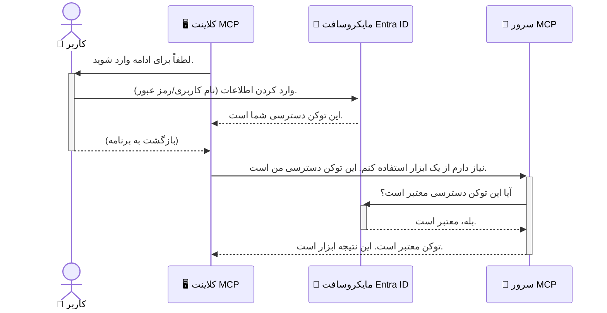

# ایمن‌سازی گردش‌های کاری هوش مصنوعی: احراز هویت Entra ID برای سرورهای پروتکل زمینه مدل

## مقدمه
ایمن‌سازی سرور پروتکل زمینه مدل (MCP) شما به همان اندازه قفل کردن درب جلوی خانه‌تان مهم است. باز گذاشتن سرور MCP شما ابزارها و داده‌هایتان را در معرض دسترسی غیرمجاز قرار می‌دهد که می‌تواند به نقص‌های امنیتی منجر شود. Microsoft Entra ID یک راهکار جامع مدیریت هویت و دسترسی مبتنی بر ابر ارائه می‌دهد که اطمینان می‌دهد فقط کاربران و برنامه‌های مجاز می‌توانند با سرور MCP شما تعامل داشته باشند. در این بخش، یاد می‌گیرید چگونه با استفاده از احراز هویت Entra ID، گردش‌های کاری هوش مصنوعی خود را محافظت کنید.

## اهداف یادگیری
تا پایان این بخش، قادر خواهید بود:

- اهمیت ایمن‌سازی سرورهای MCP را درک کنید.
- اصول اولیه Microsoft Entra ID و احراز هویت OAuth 2.0 را توضیح دهید.
- تفاوت بین کلاینت‌های عمومی و محرمانه را تشخیص دهید.
- احراز هویت Entra ID را در هر دو سناریوی سرور MCP محلی (کلاینت عمومی) و سرور MCP از راه دور (کلاینت محرمانه) پیاده‌سازی کنید.
- بهترین شیوه‌های امنیتی را هنگام توسعه گردش‌های کاری هوش مصنوعی اعمال کنید.

## امنیت و MCP

همان‌طور که درِ جلوی خانه‌تان را باز نمی‌گذارید، نباید سرور MCP خود را برای دسترسی هر کسی باز بگذارید. ایمن‌سازی گردش‌های کاری هوش مصنوعی برای ساخت برنامه‌های مستحکم، قابل اعتماد و امن ضروری است. این فصل به شما معرفی می‌کند که چگونه با استفاده از Microsoft Entra ID سرورهای MCP خود را ایمن کنید، به طوری که فقط کاربران و برنامه‌های مجاز بتوانند با ابزارها و داده‌های شما تعامل داشته باشند.

## چرا امنیت برای سرورهای MCP اهمیت دارد

تصور کنید سرور MCP شما ابزاری دارد که می‌تواند ایمیل ارسال کند یا به پایگاه داده مشتریان دسترسی داشته باشد. یک سرور بدون امنیت به این معنا است که هر کسی می‌تواند از این ابزار استفاده کند که منجر به دسترسی غیرمجاز به داده‌ها، ارسال هرزنامه یا فعالیت‌های مخرب دیگر می‌شود.

با پیاده‌سازی احراز هویت، مطمئن می‌شوید که هر درخواستی به سرور شما بررسی می‌شود و هویت کاربر یا برنامه درخواست‌کننده تأیید می‌گردد. این اولین و حیاتی‌ترین گام در ایمن‌سازی گردش‌های کاری هوش مصنوعی شما است.

## معرفی Microsoft Entra ID

[**Microsoft Entra ID**](https://adoption.microsoft.com/microsoft-security/entra/) یک سرویس مدیریت هویت و دسترسی مبتنی بر ابر است. می‌توانید آن را به عنوان یک نگهبان امنیتی جهانی برای برنامه‌های خود تصور کنید. این سرویس فرآیند پیچیده تأیید هویت کاربران (احراز هویت) و تعیین مجوزهای آن‌ها (مجوزدهی) را مدیریت می‌کند.

با استفاده از Entra ID، می‌توانید:

- ورود ایمن کاربران را فعال کنید.
- API‌ها و خدمات را محافظت کنید.
- سیاست‌های دسترسی را از یک مکان مرکزی مدیریت کنید.

برای سرورهای MCP، Entra ID یک راهکار قدرتمند و مورد اعتماد برای مدیریت اینکه چه کسانی می‌توانند به قابلیت‌های سرور شما دسترسی داشته باشند ارائه می‌دهد.

---

## درک جادو: چگونه احراز هویت Entra ID کار می‌کند

Entra ID از استانداردهای باز مانند **OAuth 2.0** برای مدیریت احراز هویت استفاده می‌کند. اگرچه جزئیات می‌تواند پیچیده باشد، مفهوم اصلی ساده است و می‌توان آن را با یک قیاس درک کرد.

### معرفی ساده OAuth 2.0: کلید پارکینگ (Valet Key)

OAuth 2.0 را مانند خدمات پارکینگ خودرو در نظر بگیرید. وقتی به رستوران می‌روید، کلید اصلی خودرویتان را به پارکبان نمی‌دهید. در عوض، یک **کلید پارکینگ** که مجوزهای محدودی دارد ارائه می‌دهید — این کلید می‌تواند خودرو را روشن کند و درها را قفل کند، اما نمی‌تواند صندوق عقب یا جعبه داشبورد را باز کند.

در این قیاس:

- **شما** همان **کاربر** هستید.
- **خودرو شما** همان **سرور MCP** با ابزارها و داده‌های ارزشمند است.
- **پارکبان** همان **Microsoft Entra ID** است.
- **مسئول پارکینگ** همان **کلاینت MCP** (برنامه‌ای که در تلاش برای دسترسی به سرور است) است.
- **کلید پارکینگ** همان **توکن دسترسی (Access Token)** است.

توکن دسترسی یک رشته متنی امن است که کلاینت MCP پس از ورود شما از Entra ID دریافت می‌کند. سپس کلاینت این توکن را با هر درخواست به سرور MCP ارائه می‌دهد. سرور می‌تواند این توکن را تأیید کند تا اطمینان حاصل شود که درخواست معتبر است و کلاینت مجوزهای لازم را دارد، بدون اینکه هرگز نیاز به دسترسی به اطلاعات حساس واقعی شما (مثل رمز عبور) داشته باشد.

### جریان احراز هویت

فرایند در عمل به شرح زیر است:



### معرفی کتابخانه احراز هویت مایکروسافت (MSAL)

قبل از ورود به کد، مهم است که یک جزء کلیدی که در مثال‌ها خواهید دید را معرفی کنیم: **کتابخانه احراز هویت مایکروسافت (MSAL)**.

MSAL کتابخانه‌ای است که توسط مایکروسافت توسعه یافته و کار توسعه‌دهندگان را در مدیریت احراز هویت بسیار ساده می‌کند. به جای اینکه شما تمام کدهای پیچیده برای مدیریت توکن‌های امنیتی، ورود و تازه‌سازی نشست را بنویسید، MSAL این کارهای سنگین را به عهده می‌گیرد.

استفاده از کتابخانه‌ای مانند MSAL بسیار توصیه می‌شود چون:

- **امن است:** استانداردهای پروتکل‌های صنعتی و بهترین شیوه‌های امنیتی را پیاده‌سازی می‌کند و ریسک آسیب‌پذیری‌ها در کد شما را کاهش می‌دهد.
- **توسعه را ساده می‌کند:** پیچیدگی‌ پروتکل‌های OAuth 2.0 و OpenID Connect را پوشش می‌دهد و اجازه می‌دهد احراز هویت قدرتمند را با چند خط کد به برنامه خود بیافزایید.
- **نگهداری می‌شود:** مایکروسافت MSAL را به طور فعال نگهداری و به‌روز می‌کند تا با تهدیدات امنیتی جدید و تغییرات پلتفرم هماهنگ باشد.

MSAL از زبان‌ها و چارچوب‌های مختلف برنامه‌نویسی مانند .NET، JavaScript/TypeScript، Python، Java، Go و پلتفرم‌های موبایل مانند iOS و اندروید پشتیبانی می‌کند. این یعنی می‌توانید الگوهای یکپارچه احراز هویت را در سراسر فناوری خود به کار ببرید.

برای اطلاعات بیشتر در مورد MSAL، می‌توانید مستندات رسمی [بررسی اجمالی MSAL](https://learn.microsoft.com/entra/identity-platform/msal-overview) را بررسی کنید.

---

## ایمن‌سازی سرور MCP شما با Entra ID: راهنمای گام به گام

اکنون بیایید مرور کنیم چگونه یک سرور MCP محلی (که از طریق `stdio` ارتباط برقرار می‌کند) را با Entra ID ایمن کنیم. این مثال از یک **کلاینت عمومی** استفاده می‌کند که برای برنامه‌هایی مناسب است که روی دستگاه کاربر اجرا می‌شوند، مثل یک برنامه دسکتاپ یا سرور توسعه محلی.

### سناریو ۱: ایمن‌سازی سرور MCP محلی (با کلاینت عمومی)

در این سناریو، یک سرور MCP را مشاهده می‌کنیم که به صورت محلی اجرا می‌شود، از طریق `stdio` ارتباط برقرار می‌کند و از Entra ID برای احراز هویت کاربر قبل از اجازه دسترسی به ابزارهایش استفاده می‌کند. این سرور یک ابزار دارد که اطلاعات پروفایل کاربر را از Microsoft Graph API دریافت می‌کند.

#### ۱. راه‌اندازی برنامه در Entra ID

قبل از نوشتن کد، باید برنامه خود را در Microsoft Entra ID ثبت کنید. این کار به Entra ID اطلاع می‌دهد که برنامه شما وجود دارد و اجازه استفاده از سرویس احراز هویت را به آن می‌دهد.

1. به **[پورتال Microsoft Entra](https://entra.microsoft.com/)** بروید.
2. به بخش **App registrations** بروید و روی **New registration** کلیک کنید.
3. نامی برای برنامه خود انتخاب کنید (مثلاً "My Local MCP Server").
4. در گزینه **Supported account types**، انتخاب کنید **Accounts in this organizational directory only**.
5. بخش **Redirect URI** را برای این مثال خالی بگذارید.
6. روی **Register** کلیک کنید.

پس از ثبت، شناسه برنامه (client ID) و شناسه دایرکتوری (tenant ID) را یادداشت کنید، چون در کد به آن‌ها نیاز دارید.

#### ۲. کد: بررسی اجمالی

اجازه دهید بخش‌های کلیدی کد مربوط به احراز هویت را ببینیم. کد کامل این مثال در پوشه [Entra ID - Local - WAM](https://github.com/Azure-Samples/mcp-auth-servers/tree/main/src/entra-id-local-wam) از مخزن [mcp-auth-servers در گیت‌هاب](https://github.com/Azure-Samples/mcp-auth-servers) موجود است.

**`AuthenticationService.cs`**

این کلاس مسئول مدیریت تعامل با Entra ID است.

- **`CreateAsync`**: این متد برنامه `PublicClientApplication` را از MSAL (کتابخانه احراز هویت مایکروسافت) مقداردهی اولیه می‌کند. این برنامه با `clientId` و `tenantId` شما پیکربندی شده است.
- **`WithBroker`**: این قابلیت استفاده از یک بروکر (مثل Windows Web Account Manager) را فعال می‌کند که تجربه ورود یکپارچه و امن‌تری فراهم می‌کند.
- **`AcquireTokenAsync`**: هسته اصلی متد است. ابتدا تلاش می‌کند به صورت بی‌صدا (بدون درخواست دوباره ورود) توکن بگیرد. اگر نتواند، کاربر را برای ورود به صورت تعاملی دعوت می‌کند.

```csharp
// Simplified for clarity
public static async Task<AuthenticationService> CreateAsync(ILogger<AuthenticationService> logger)
{
    var msalClient = PublicClientApplicationBuilder
        .Create(_clientId) // Your Application (client) ID
        .WithAuthority(AadAuthorityAudience.AzureAdMyOrg)
        .WithTenantId(_tenantId) // Your Directory (tenant) ID
        .WithBroker(new BrokerOptions(BrokerOptions.OperatingSystems.Windows))
        .Build();

    // ... cache registration ...

    return new AuthenticationService(logger, msalClient);
}

public async Task<string> AcquireTokenAsync()
{
    try
    {
        // Try silent authentication first
        var accounts = await _msalClient.GetAccountsAsync();
        var account = accounts.FirstOrDefault();

        AuthenticationResult? result = null;

        if (account != null)
        {
            result = await _msalClient.AcquireTokenSilent(_scopes, account).ExecuteAsync();
        }
        else
        {
            // If no account, or silent fails, go interactive
            result = await _msalClient.AcquireTokenInteractive(_scopes).ExecuteAsync();
        }

        return result.AccessToken;
    }
    catch (Exception ex)
    {
        _logger.LogError(ex, "An error occurred while acquiring the token.");
        throw; // Optionally rethrow the exception for higher-level handling
    }
}
```

**`Program.cs`**

در اینجا سرور MCP تنظیم می‌شود و سرویس احراز هویت ادغام می‌شود.

- **`AddSingleton<AuthenticationService>`**: سرویس احراز هویت را با کانتینر تزریق وابستگی‌ها ثبت می‌کند تا سایر بخش‌های برنامه (مثل ابزار ما) بتوانند از آن استفاده کنند.
- ابزار **`GetUserDetailsFromGraph`**: این ابزار به نمونه‌ای از `AuthenticationService` نیاز دارد. قبل از اجرا، فراخوانی می‌کند `authService.AcquireTokenAsync()` تا توکن دسترسی معتبر بگیرد. در صورت موفقیت احراز هویت، از توکن برای فراخوانی Microsoft Graph API و دریافت اطلاعات کاربر استفاده می‌کند.

```csharp
// Simplified for clarity
[McpServerTool(Name = "GetUserDetailsFromGraph")]
public static async Task<string> GetUserDetailsFromGraph(
    AuthenticationService authService)
{
    try
    {
        // This will trigger the authentication flow
        var accessToken = await authService.AcquireTokenAsync();

        // Use the token to create a GraphServiceClient
        var graphClient = new GraphServiceClient(
            new BaseBearerTokenAuthenticationProvider(new TokenProvider(authService)));

        var user = await graphClient.Me.GetAsync();

        return System.Text.Json.JsonSerializer.Serialize(user);
    }
    catch (Exception ex)
    {
        return $"Error: {ex.Message}";
    }
}
```

#### ۳. نحوه کارکرد کل فرایند

1. وقتی کلاینت MCP تلاش می‌کند از ابزار `GetUserDetailsFromGraph` استفاده کند، ابتدا این ابزار متد `AcquireTokenAsync` را فراخوانی می‌کند.
2. `AcquireTokenAsync` کتابخانه MSAL را مجبور می‌کند به دنبال توکن معتبر بگردد.
3. اگر توکنی یافت نشد، MSAL از طریق بروکر از کاربر می‌خواهد با حساب Entra ID خود وارد شود.
4. پس از ورود، Entra ID توکن دسترسی صادر می‌کند.
5. ابزار توکن را دریافت می‌کند و با آن تماس امنی با Microsoft Graph API برقرار می‌کند.
6. اطلاعات کاربر به کلاینت MCP بازگردانده می‌شود.

این فرایند تضمین می‌کند که فقط کاربران احراز هویت‌شده می‌توانند از ابزار استفاده کنند و سرور MCP محلی شما به طور مؤثری ایمن می‌شود.

### سناریو ۲: ایمن‌سازی سرور MCP از راه دور (با کلاینت محرمانه)

وقتی سرور MCP شما روی یک ماشین از راه دور (مثل سرور ابری) اجرا می‌شود و از پروتکلی مانند HTTP Streaming استفاده می‌کند، الزامات امنیتی متفاوت هستند. در این حالت باید از **کلاینت محرمانه** و **Authorization Code Flow** استفاده کنید. این روش امنیتی قوی‌تری است زیرا اسرار برنامه هرگز در مرورگر افشا نمی‌شود.

این مثال با استفاده از سرور MCP مبتنی بر TypeScript و Express.js برای مدیریت درخواست‌های HTTP است.

#### ۱. راه‌اندازی برنامه در Entra ID

راه‌اندازی در Entra ID مشابه کلاینت عمومی است اما با یک تفاوت کلیدی: باید یک **راز کلاینت (client secret)** ایجاد کنید.

1. به **[پورتال Microsoft Entra](https://entra.microsoft.com/)** بروید.
2. در ثبت برنامه خود، به تب **Certificates & secrets** بروید.
3. روی **New client secret** کلیک کنید، توضیحی وارد کنید و سپس **Add** را بزنید.
4. **مهم:** مقدار راز را فوراً کپی کنید. دیگر نمی‌توانید آن را دوباره مشاهده کنید.
5. همچنین باید یک **Redirect URI** تنظیم کنید. به تب **Authentication** بروید، روی **Add a platform** کلیک کنید، **Web** را انتخاب کرده و URI بازگشتی برنامه را وارد کنید (مثلاً `http://localhost:3001/auth/callback`).

> **⚠️ نکته مهم امنیتی:** برای برنامه‌های تولیدی، مایکروسافت قویاً توصیه می‌کند از روش‌های احراز هویت بدون راز، مانند **Managed Identity** یا **Workload Identity Federation** به جای رازهای کلاینت استفاده شود. رازهای کلاینت می‌توانند در معرض افشا یا سوءاستفاده قرار بگیرند. Managed identity روشی امن‌تر است که نیاز به ذخیره اعتبارات در کد یا پیکربندی برنامه را حذف می‌کند.
>
> برای اطلاعات بیشتر در مورد managed identity و نحوه پیاده‌سازی آن، به [مرور کلی managed identities برای منابع Azure](https://learn.microsoft.com/entra/identity/managed-identities-azure-resources/overview) مراجعه کنید.

#### ۲. کد: بررسی اجمالی

این مثال از رویکرد مبتنی بر نشست (session) استفاده می‌کند. وقتی کاربر وارد می‌شود، سرور توکن دسترسی و توکن به‌روزرسانی را در یک نشست ذخیره می‌کند و یک توکن نشست به کاربر می‌دهد. این توکن نشست سپس برای درخواست‌های بعدی استفاده می‌شود. کد کامل این مثال در پوشه [Entra ID - Confidential client](https://github.com/Azure-Samples/mcp-auth-servers/tree/main/src/entra-id-cca-session) در مخزن [mcp-auth-servers در گیت‌هاب](https://github.com/Azure-Samples/mcp-auth-servers) موجود است.

**`Server.ts`**

این فایل سرور Express و لایه انتقال MCP را تنظیم می‌کند.

- **`requireBearerAuth`**: این یک میدلور است که از نقاط پایانی `/sse` و `/message` محافظت می‌کند. این میدلور برای بررسی توکن حامل معتبر در هدر `Authorization` درخواست استفاده می‌شود.
- **`EntraIdServerAuthProvider`**: این یک کلاس سفارشی است که رابط `McpServerAuthorizationProvider` را پیاده‌سازی می‌کند. مسئول مدیریت جریان OAuth 2.0 است.
- **`/auth/callback`**: این انتهای مسیر بازگشتی است که پس از احراز هویت کاربر توسط Entra ID فراخوانی می‌شود. این مسیر کد تأیید را به توکن دسترسی و توکن به‌روزرسانی تبدیل می‌کند.

```typescript
// ساده شده برای وضوح
const app = express();
const { server } = createServer();
const provider = new EntraIdServerAuthProvider();

// حفاظت از نقطه پایانی SSE
app.get("/sse", requireBearerAuth({
  provider,
  requiredScopes: ["User.Read"]
}), async (req, res) => {
  // ... اتصال به ترنسپورت ...
});

// حفاظت از نقطه پایانی پیام
app.post("/message", requireBearerAuth({
  provider,
  requiredScopes: ["User.Read"]
}), async (req, res) => {
  // ... رسیدگی به پیام ...
});

// رسیدگی به بازگشت OAuth 2.0
app.get("/auth/callback", (req, res) => {
  provider.handleCallback(req.query.code, req.query.state)
    .then(result => {
      // ... رسیدگی به موفقیت یا شکست ...
    });
});
```

**`Tools.ts`**

این فایل ابزارهایی را که سرور MCP فراهم می‌کند تعریف می‌کند. ابزار `getUserDetails` مشابه مثال قبلی است، اما توکن دسترسی را از نشست می‌گیرد.

```typescript
// ساده شده برای وضوح بیشتر
server.setRequestHandler(CallToolRequestSchema, async (request) => {
  const { name } = request.params;
  const context = request.params?.context as { token?: string } | undefined;
  const sessionToken = context?.token;

  if (name === ToolName.GET_USER_DETAILS) {
    if (!sessionToken) {
      throw new AuthenticationError("Authentication token is missing or invalid. Ensure the token is provided in the request context.");
    }

    // گرفتن توکن شناسه Entra از ذخیره جلسه
    const tokenData = tokenStore.getToken(sessionToken);
    const entraIdToken = tokenData.accessToken;

    const graphClient = Client.init({
      authProvider: (done) => {
        done(null, entraIdToken);
      }
    });

    const user = await graphClient.api('/me').get();

    // ... بازگرداندن جزئیات کاربر ...
  }
});
```

**`auth/EntraIdServerAuthProvider.ts`**

این کلاس منطق زیر را مدیریت می‌کند:

- هدایت کاربر به صفحه ورود Entra ID.
- تبدیل کد تأیید به توکن دسترسی.
- ذخیره توکن‌ها در `tokenStore`.
- تازه‌سازی توکن دسترسی هنگام انقضا.

#### ۳. نحوه کارکرد کل فرایند

1. وقتی کاربری برای اولین بار تلاش می‌کند به سرور MCP متصل شود، میدلور `requireBearerAuth` می‌بیند که نشستی معتبر ندارد و او را به صفحه ورود Entra ID هدایت می‌کند.
2. کاربر با حساب Entra ID خود وارد می‌شود.
3. Entra ID کاربر را به نقطه انتهایی `/auth/callback` با یک کد مجوز هدایت مجدد می‌کند.  
4. سرور این کد را با یک توکن دسترسی و یک توکن تازه‌سازی تعویض می‌کند، آنها را ذخیره می‌کند و یک توکن نشست ایجاد می‌کند که به کلاینت ارسال می‌شود.  
5. اکنون کلاینت می‌تواند از این توکن نشست در هدر `Authorization` برای تمام درخواست‌های آینده به سرور MCP استفاده کند.  
6. وقتی ابزار `getUserDetails` فراخوانی می‌شود، از توکن نشست برای جستجوی توکن دسترسی Entra ID استفاده می‌کند و سپس از آن برای فراخوانی Microsoft Graph API استفاده می‌کند.  

این روند پیچیده‌تر از روند کلاینت عمومی است، اما برای نقاط انتهایی که در معرض اینترنت هستند ضرورت دارد. از آنجا که سرورهای راه دور MCP از طریق اینترنت عمومی قابل دسترسی هستند، نیاز به اقدامات امنیتی قوی‌تری برای محافظت در برابر دسترسی غیرمجاز و حملات احتمالی دارند.

## بهترین شیوه‌های امنیتی

- **همیشه از HTTPS استفاده کنید**: ارتباط بین کلاینت و سرور را رمزنگاری کنید تا توکن‌ها از رهگیری محافظت شوند.  
- **اجرای کنترل دسترسی مبتنی بر نقش (RBAC)**: فقط بررسی نکنید که *آیا* کاربر احراز هویت شده است؛ بلکه بررسی کنید *چه* مجوزهایی دارد. می‌توانید نقش‌ها را در Entra ID تعریف کنید و آنها را در سرور MCP خود بررسی نمایید.  
- **نظارت و ممیزی**: همه رویدادهای احراز هویت را ثبت کنید تا بتوانید فعالیت‌های مشکوک را شناسایی و پاسخ دهید.  
- **مدیریت محدودیت نرخ و کنترل فشار**: Microsoft Graph و سایر APIها محدودیت نرخ را برای جلوگیری از سوءاستفاده اعمال می‌کنند. در سرور MCP خود منطق بازگشت نمایی و تلاش مجدد را پیاده‌سازی کنید تا به صورت مطلوب پاسخ‌های HTTP 429 (درخواست‌های بیش از حد) را مدیریت کنید. همچنین، داده‌های پر استفاده را کش کنید تا تعداد تماس‌های API کاهش یابد.  
- **ذخیره امن توکن‌ها**: توکن‌های دسترسی و توکن‌های تازه‌سازی را به صورت امن ذخیره کنید. برای برنامه‌های محلی از مکانیزم‌های ذخیره‌سازی امن سیستم استفاده کنید. برای برنامه‌های سروری، از ذخیره‌سازی رمزنگاری شده یا خدمات مدیریت کلید امن مانند Azure Key Vault استفاده کنید.  
- **مدیریت انقضای توکن‌ها**: توکن‌های دسترسی عمر محدودی دارند. از توکن‌های تازه‌سازی برای تجدید خودکار توکن استفاده کنید تا تجربه کاربری بدون وقفه و بدون نیاز به احراز هویت مجدد حفظ شود.  
- **استفاده از Azure API Management را مد نظر قرار دهید**: اگرچه پیاده‌سازی امنیت مستقیماً در سرور MCP کنترل دقیق‌تری به شما می‌دهد، دروازه‌های API مانند Azure API Management می‌توانند بسیاری از این دغدغه‌های امنیتی را به صورت خودکار مدیریت کنند، از جمله احراز هویت، مجوزدهی، محدودیت نرخ و نظارت. آنها یک لایه امنیتی متمرکز فراهم می‌کنند که بین کلاینت‌های شما و سرورهای MCP شما قرار می‌گیرد. برای جزئیات بیشتر در مورد استفاده از دروازه‌های API با MCP به [Azure API Management Your Auth Gateway For MCP Servers](https://techcommunity.microsoft.com/blog/integrationsonazureblog/azure-api-management-your-auth-gateway-for-mcp-servers/4402690) مراجعه کنید.

## نکات کلیدی

- ایمن‌سازی سرور MCP شما برای حفاظت از داده‌ها و ابزارهای شما حیاتی است.  
- Microsoft Entra ID راه‌حلی قوی و مقیاس‌پذیر برای احراز هویت و مجوزدهی فراهم می‌کند.  
- برای برنامه‌های محلی از **کلاینت عمومی** و برای سرورهای راه دور از **کلاینت محرمانه** استفاده کنید.  
- **روند کد مجوز (Authorization Code Flow)** ایمن‌ترین گزینه برای برنامه‌های وب است.

## تمرین

1. به سرور MCP که ممکن است بسازید فکر کنید. آیا این سرور محلی خواهد بود یا راه دور؟  
2. بر اساس پاسخ شما، از کلاینت عمومی استفاده می‌کنید یا کلاینت محرمانه؟  
3. سرور MCP شما چه مجوزی برای انجام عملیات علیه Microsoft Graph درخواست خواهد کرد؟

## تمرین‌های عملی

### تمرین ۱: ثبت یک برنامه در Entra ID  
به پرتال Microsoft Entra بروید.  
یک برنامه جدید برای سرور MCP خود ثبت کنید.  
شناسه برنامه (client ID) و شناسه دایرکتوری (tenant ID) را یادداشت کنید.

### تمرین ۲: ایمن‌سازی سرور MCP محلی (کلاینت عمومی)  
- از مثال کد برای ادغام MSAL (کتابخانه احراز هویت مایکروسافت) برای احراز هویت کاربر پیروی کنید.  
- روند احراز هویت را با فراخوانی ابزاری که جزئیات کاربر را از Microsoft Graph بازیابی می‌کند، تست کنید.

### تمرین ۳: ایمن‌سازی سرور MCP راه دور (کلاینت محرمانه)  
- یک کلاینت محرمانه در Entra ID ثبت کنید و یک راز کلاینت ایجاد کنید.  
- سرور MCP مبتنی بر Express.js خود را برای استفاده از روند کد مجوز پیکربندی کنید.  
- نقاط انتهایی محافظت شده را تست کرده و دسترسی مبتنی بر توکن را تأیید کنید.

### تمرین ۴: اعمال بهترین شیوه‌های امنیتی  
- HTTPS را برای سرور محلی یا راه دور خود فعال کنید.  
- کنترل دسترسی مبتنی بر نقش (RBAC) را در منطق سرور خود پیاده‌سازی کنید.  
- مدیریت انقضای توکن و ذخیره امن توکن‌ها را اضافه نمایید.

## منابع

1. **مستندات کلی MSAL**  
   بیاموزید چگونه کتابخانه احراز هویت مایکروسافت (MSAL) به دریافت توکن امن در پلتفرم‌های مختلف کمک می‌کند:  
   [MSAL Overview on Microsoft Learn](https://learn.microsoft.com/en-gb/entra/msal/overview)

2. **مخزن GitHub Azure-Samples/mcp-auth-servers**  
   نمونه‌های مرجع سرورهای MCP که جریان‌های احراز هویت را نشان می‌دهند:  
   [Azure-Samples/mcp-auth-servers on GitHub](https://github.com/Azure-Samples/mcp-auth-servers)

3. **مروری بر Managed Identities برای منابع Azure**  
   درک کنید چگونه با استفاده از managed identity اختصاصی سیستم یا کاربر، نیازی به رازها نباشد:  
   [Managed Identities Overview on Microsoft Learn](https://learn.microsoft.com/en-us/entra/identity/managed-identities-azure-resources/)

4. **Azure API Management: دروازه احراز هویت شما برای سرورهای MCP**  
   بررسی عمیق استفاده از APIM به عنوان دروازه امن OAuth2 برای سرورهای MCP:  
   [Azure API Management Your Auth Gateway For MCP Servers](https://techcommunity.microsoft.com/blog/integrationsonazureblog/azure-api-management-your-auth-gateway-for-mcp-servers/4402690)

5. **مراجعه مجوزهای Microsoft Graph**  
   فهرست جامعی از مجوزهای واگذار شده و برنامه‌ای برای Microsoft Graph:  
   [Microsoft Graph Permissions Reference](https://learn.microsoft.com/zh-tw/graph/permissions-reference)

## نتایج یادگیری  
پس از تکمیل این بخش، قادر خواهید بود:

- بیان کنید چرا احراز هویت برای سرورهای MCP و جریان‌های کاری AI حیاتی است.  
- پیکربندی و راه‌اندازی احراز هویت Entra ID برای سناریوهای سرور MCP محلی و راه دور.  
- نوع کلاینت مناسب (عمومی یا محرمانه) را بر اساس استقرار سرور خود انتخاب کنید.  
- شیوه‌های کدنویسی امن را انجام دهید، از جمله ذخیره توکن و مجوزدهی مبتنی بر نقش.  
- با اطمینان سرور MCP و ابزارهایش را از دسترسی غیرمجاز محافظت کنید.

## مرحله بعدی

- [5.13 مدل پروتکل زمینه MCP (مدل زمینه پروتکل) با Microsoft Foundry](../mcp-foundry-agent-integration/README.md)

---

<!-- CO-OP TRANSLATOR DISCLAIMER START -->
**سلب مسئولیت**:
این سند با استفاده از سرویس ترجمه هوش مصنوعی [Co-op Translator](https://github.com/Azure/co-op-translator) ترجمه شده است. در حالی که ما در تلاش برای دقت هستیم، لطفاً توجه داشته باشید که ترجمه‌های خودکار ممکن است شامل خطاها یا نادرستی‌هایی باشند. سند اصلی به زبان مادری خود باید به عنوان منبع معتبر در نظر گرفته شود. برای اطلاعات حیاتی، ترجمه حرفه‌ای انسانی توصیه می‌شود. ما در قبال هرگونه سوء تفاهم یا برداشت نادرست ناشی از استفاده از این ترجمه مسئولیتی نداریم.
<!-- CO-OP TRANSLATOR DISCLAIMER END -->