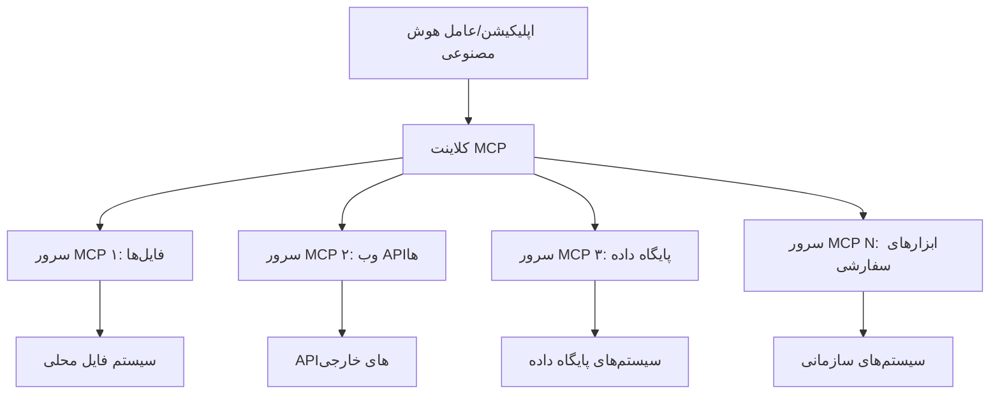

# 🌐 ماژول ۲: اصول ابتدایی MCP با جعبه‌ابزار Microsoft Foundry

[]()
[]()
[]()

## 📋 اهداف یادگیری

در پایان این ماژول شما قادر خواهید بود:
- ✅ معماری و مزایای پروتکل Model Context (MCP) را درک کنید
- ✅ اکوسیستم سرورهای MCP مایکروسافت را بررسی کنید
- ✅ سرورهای MCP را با Microsoft Foundry Toolkit Agent Builder یکپارچه کنید
- ✅ یک عامل خودکارسازی مرورگر عملی با استفاده از Playwright MCP بسازید
- ✅ ابزارهای MCP را داخل عوامل خود پیکربندی و آزمایش کنید
- ✅ عوامل مجهز به MCP را برای استفاده در تولید صادر و مستقر کنید

## 🎯 ادامه از ماژول ۱

در ماژول ۱، مفاهیم پایه Microsoft Foundry Toolkit را فرا گرفتیم و اولین عامل پایتونی خود را ساختیم. حالا می‌خواهیم عامل‌هایتان را با اتصال به ابزارها و سرویس‌های خارجی از طریق پروتکل انقلابی **Model Context Protocol (MCP)**، بهبود دهیم.

این ارتقا مانند تغییر از یک ماشین حساب پایه به یک کامپیوتر کامل است - عوامل هوش مصنوعی شما می‌توانند:
- 🌐 وب‌سایت‌ها را مرور و با آنها تعامل کنند
- 📁 به فایل‌ها دسترسی پیدا کرده و آنها را مدیریت کنند
- 🔧 با سیستم‌های سازمانی یکپارچه شوند
- 📊 داده‌های زمان واقعی از APIها را پردازش کنند

## 🧠 درک پروتکل Model Context (MCP)

### 🔍 MCP چیست؟

Model Context Protocol (MCP) مانند **"USB-C برای برنامه‌های هوش مصنوعی"** است — یک استاندارد باز انقلابی که مدل‌های زبانی بزرگ (LLMها) را به ابزارها، منابع داده و سرویس‌های خارجی متصل می‌کند. همان طور که USB-C شلوغی کابل‌ها را با ارائه یک اتصالگر جهانی پایان داد، MCP پیچیدگی‌های یکپارچه‌سازی هوش مصنوعی را با یک پروتکل استاندارد حذف می‌کند.

### 🎯 مسئله‌ای که MCP حل می‌کند

**قبل از MCP:**
- 🔧 ادغام‌های سفارشی برای هر ابزار
- 🔄 وابستگی به فروشندگان با راه‌حل‌های اختصاصی  
- 🔒 آسیب‌پذیری‌های امنیتی از ارتباطات نامنظم
- ⏱️ ماه‌ها زمان توسعه برای ادغام‌های پایه

**با MCP:**
- ⚡ ادغام ابزارها به صورت پلاگ‌ان‌پلی
- 🔄 معماری مستقل از فروشنده
- 🛡️ بهترین شیوه‌های امنیتی داخلی
- 🚀 افزودن قابلیت‌های جدید در چند دقیقه

### 🏗️ مرور عمیق معماری MCP

MCP از معماری **کلاینت-سرور** پیروی می‌کند که یک اکوسیستم امن و مقیاس‌پذیر ایجاد می‌کند:



**🔧 اجزای اصلی:**

| جزء | نقش | مثال‌ها |
|-----------|------|----------|
| **میزبان‌های MCP** | برنامه‌هایی که خدمات MCP را مصرف می‌کنند | Claude Desktop، VS Code، Microsoft Foundry Toolkit |
| **کلاینت‌های MCP** | مدیران پروتکل (یک به یک با سرورها) | در برنامه‌های میزبان ساخته شده‌اند |
| **سرورهای MCP** | ارائه قابلیت‌ها از طریق پروتکل استاندارد | Playwright، Files، Azure، GitHub |
| **لایه انتقال** | روش‌های ارتباطی | stdio، HTTP، WebSockets |


## 🏢 اکوسیستم سرورهای MCP مایکروسافت

مایکروسافت رهبری اکوسیستم MCP را با مجموعه‌ای کامل از سرورهای سطح سازمانی که به نیازهای واقعی کسب‌وکار می‌پردازند، بر عهده دارد.

### 🌟 سرورهای شاخص MCP مایکروسافت

#### ۱. ☁️ سرور Azure MCP
**🔗 مخزن**: [azure/azure-mcp](https://github.com/azure/azure-mcp)
**🎯 هدف**: مدیریت جامع منابع Azure با یکپارچه‌سازی هوش مصنوعی

**✨ ویژگی‌های کلیدی:**
- فراهم‌آوری زیرساخت اعلامی
- نظارت بلادرنگ بر منابع
- پیشنهادهای بهینه‌سازی هزینه
- بررسی تطابق با امنیت

**🚀 کاربردها:**
- زیرساخت به عنوان کد با کمک هوش مصنوعی
- توسعه خودکار مقیاس منابع
- بهینه‌سازی هزینه‌های ابری
- اتوماسیون گردش‌کار DevOps

#### ۲. 📊 Microsoft Dataverse MCP
**📚 مستندات**: [ادغام Microsoft Dataverse](https://go.microsoft.com/fwlink/?linkid=2320176)
**🎯 هدف**: رابط زبان طبیعی برای داده‌های کسب‌وکار

**✨ ویژگی‌های کلیدی:**
- پرس‌وجوی پایگاه داده به زبان طبیعی
- درک زمینه کسب‌وکار
- قالب‌های سفارشی دعوت‌نامه
- حاکمیت داده‌های سازمانی

**🚀 کاربردها:**
- گزارش‌دهی هوش کسب‌وکار
- تحلیل داده‌های مشتری
- بینش‌های خط فروش
- پرس‌وجوهای داده تطبیقی

#### ۳. 🌐 سرور Playwright MCP
**🔗 مخزن**: [microsoft/playwright-mcp](https://github.com/microsoft/playwright-mcp)
**🎯 هدف**: توانمندی‌های خودکارسازی مرورگر و تعامل وب

**✨ ویژگی‌های کلیدی:**
- خودکارسازی چندمرورگری (Chrome، Firefox، Safari)
- شناسایی هوشمند عناصر
- تولید اسکرین‌شات و PDF
- نظارت بر ترافیک شبکه

**🚀 کاربردها:**
- گردش‌کارهای تست خودکار
- استخراج داده و وب‌اسکریپینگ
- نظارت UI/UX
- اتوماسیون تحلیل رقابتی

#### ۴. 📁 سرور Files MCP
**🔗 مخزن**: [microsoft/files-mcp-server](https://github.com/microsoft/files-mcp-server)
**🎯 هدف**: عملیات هوشمند فایل‌سیستم

**✨ ویژگی‌های کلیدی:**
- مدیریت فایل اعلامی
- همگام‌سازی محتوا
- ادغام کنترل نسخه
- استخراج فراداده

**🚀 کاربردها:**
- مدیریت مستندات
- سازماندهی مخازن کد
- گردش‌کارهای انتشار محتوا
- مدیریت فایل‌های خط لوله داده

#### ۵. 📝 سرور MarkItDown MCP
**🔗 مخزن**: [microsoft/markitdown](https://github.com/microsoft/markitdown)
**🎯 هدف**: پردازش و دستکاری پیشرفته Markdown

**✨ ویژگی‌های کلیدی:**
- تجزیه غنی Markdown
- تبدیل فرمت (MD ↔ HTML ↔ PDF)
- تحلیل ساختار محتوا
- پردازش قالب‌ها

**🚀 کاربردها:**
- گردش‌کار مستندسازی فنی
- سیستم‌های مدیریت محتوا
- تولید گزارش
- اتوماسیون پایگاه دانش

#### ۶. 📈 سرور Clarity MCP
**📦 بسته**: [@microsoft/clarity-mcp-server](https://www.npmjs.com/package/@microsoft/clarity-mcp-server)
**🎯 هدف**: تحلیل وب و بینش رفتار کاربران

**✨ ویژگی‌های کلیدی:**
- تحلیل داده‌های نقشه حرارتی
- ضبط نشست کاربران
- معیارهای عملکرد
- تحلیل قیف تبدیل

**🚀 کاربردها:**
- بهینه‌سازی سایت
- تحقیق تجربه کاربر
- تحلیل آزمون A/B
- داشبوردهای هوش کسب‌وکار

### 🌍 اکوسیستم جامعه

علاوه بر سرورهای مایکروسافت، اکوسیستم MCP شامل موارد زیر است:
- **🐙 GitHub MCP**: مدیریت مخزن و تحلیل کد
- **🗄️ MCP پایگاه داده‌ها**: ادغام PostgreSQL، MySQL، MongoDB
- **☁️ MCP ارائه‌دهندگان ابری**: ابزارهای AWS، GCP، Digital Ocean
- **📧 MCP ارتباطات**: ادغام Slack، Teams، ایمیل

## 🛠️ آزمایش عملی: ساخت یک عامل خودکارسازی مرورگر

**🎯 هدف پروژه**: ساخت یک عامل هوشمند خودکارسازی مرورگر با استفاده از سرور Playwright MCP که بتواند وب‌سایت‌ها را مرور، اطلاعات استخراج و تعاملات پیچیده وب انجام دهد.

### 🚀 مرحله ۱: راه‌اندازی پایه عامل

#### گام ۱: شروع به کار با عامل خود
1. **Microsoft Foundry Toolkit Agent Builder را باز کنید**
2. **یک عامل جدید بسازید** با پیکربندی زیر:
   - **نام**: `BrowserAgent`
   - **مدل**: انتخاب GPT-4o


### 🔧 مرحله ۲: روند یکپارچه‌سازی MCP

#### گام ۳: افزودن یکپارچه‌سازی سرور MCP
1. **به بخش ابزارها در Agent Builder بروید**
2. **روی "افزودن ابزار" کلیک کنید** تا منوی یکپارچه‌سازی باز شود
3. **گزینه "سرور MCP" را انتخاب کنید** از بین گزینه‌های موجود


**🔍 درک انواع ابزار:**
- **ابزارهای درون‌ساخت**: توابع پیش‌پیکربندی شده Microsoft Foundry Toolkit
- **سرورهای MCP**: ادغام سرویس‌های خارجی
- **APIهای سفارشی**: نقاط انتهایی سرویس خودتان
- **تابع صدا زدن**: دسترسی مستقیم به توابع مدل

#### گام ۴: انتخاب سرور MCP
1. **گزینه "سرور MCP" را برای ادامه انتخاب کنید**


2. **کاتالوگ MCP را مرور کنید** تا ادغام‌های موجود را ببینید


### 🎮 مرحله ۳: پیکربندی Playwright MCP

#### گام ۵: انتخاب و پیکربندی Playwright
1. **روی "استفاده از سرورهای شاخص MCP" کلیک کنید** تا به سرورهای تاییدشده مایکروسافت دسترسی پیدا کنید
2. **Playwright را از لیست انتخاب کنید**
3. **شناسه پیش‌فرض MCP را قبول کنید یا برای محیط خود سفارشی کنید**


#### گام ۶: فعال کردن قابلیت‌های Playwright
**🔑 گام حیاتی**: همه روش‌های Playwright موجود را برای بیشترین عملکرد انتخاب کنید


**🛠️ ابزارهای حیاتی Playwright:**
- **ناوبری**: `goto`, `goBack`, `goForward`, `reload`
- **تعامل**: `click`, `fill`, `press`, `hover`, `drag`
- **استخراج**: `textContent`, `innerHTML`, `getAttribute`
- **اعتبارسنجی**: `isVisible`, `isEnabled`, `waitForSelector`
- **ضبط**: `screenshot`, `pdf`, `video`
- **شبکه**: `setExtraHTTPHeaders`, `route`, `waitForResponse`

#### گام ۷: تایید موفقیت یکپارچه‌سازی
**✅ نشانه‌های موفقیت:**
- همه ابزارها در رابط Agent Builder نمایش داده شوند
- هیچ پیام خطایی در پنل یکپارچه‌سازی نباشد
- وضعیت سرور Playwright "Connected" نشان داده شود


**🔧 عیب‌یابی مشکلات رایج:**
- **عدم اتصال**: اتصال اینترنت و تنظیمات فایروال را بررسی کنید
- **ابزارهای ناقص**: مطمئن شوید همه قابلیت‌ها در زمان راه‌اندازی انتخاب شده‌اند
- **خطاهای دسترسی**: بررسی کنید VS Code مجوزهای لازم سیستم را دارد

### 🎯 مرحله ۴: مهندسی پیشرفته درخواست‌ها

#### گام ۸: طراحی درخواست‌های هوشمند سیستم
درخواست‌های پیشرفته‌ای بسازید که از کل قابلیت‌های Playwright بهره‌مند شوند:

```markdown
# Web Automation Expert System Prompt

## Core Identity
You are an advanced web automation specialist with deep expertise in browser automation, web scraping, and user experience analysis. You have access to Playwright tools for comprehensive browser control.

## Capabilities & Approach
### Navigation Strategy
- Always start with screenshots to understand page layout
- Use semantic selectors (text content, labels) when possible
- Implement wait strategies for dynamic content
- Handle single-page applications (SPAs) effectively

### Error Handling
- Retry failed operations with exponential backoff
- Provide clear error descriptions and solutions
- Suggest alternative approaches when primary methods fail
- Always capture diagnostic screenshots on errors

### Data Extraction
- Extract structured data in JSON format when possible
- Provide confidence scores for extracted information
- Validate data completeness and accuracy
- Handle pagination and infinite scroll scenarios

### Reporting
- Include step-by-step execution logs
- Provide before/after screenshots for verification
- Suggest optimizations and alternative approaches
- Document any limitations or edge cases encountered

## Ethical Guidelines
- Respect robots.txt and rate limiting
- Avoid overloading target servers
- Only extract publicly available information
- Follow website terms of service
```

#### گام ۹: ایجاد درخواست‌های کاربر دینامیک
درخواست‌هایی طراحی کنید که قابلیت‌های مختلف را نشان دهند:

**🌐 مثال تحلیل وب:**
```markdown
Navigate to github.com/kinfey and provide a comprehensive analysis including:
1. Repository structure and organization
2. Recent activity and contribution patterns  
3. Documentation quality assessment
4. Technology stack identification
5. Community engagement metrics
6. Notable projects and their purposes

Include screenshots at key steps and provide actionable insights.
```


### 🚀 مرحله ۵: اجرا و آزمایش

#### گام ۱۰: اجرای اولین خودکارسازی
1. **روی "Run" کلیک کنید** تا دنباله خودکارسازی اجرا شود
2. **اجرای بلادرنگ را مشاهده کنید**:
   - مرورگر Chrome به صورت خودکار باز می‌شود
   - عامل به وب‌سایت هدف هدایت می‌شود
   - در هر مرحله مهم اسکرین‌شات گرفته می‌شود
   - نتایج تحلیل به صورت زنده نمایش داده می‌شود


#### گام ۱۱: بررسی نتایج و بینش‌ها
تحلیل جامع را در رابط Agent Builder مرور کنید:


### 🌟 مرحله ۶: قابلیت‌های پیشرفته و استقرار

#### گام ۱۲: صادر کردن و استقرار تولیدی
Agent Builder از چندین گزینه استقرار پشتیبانی می‌کند:


## 🎓 خلاصه ماژول ۲ و گام‌های بعدی

### 🏆 دستاورد بدست آمده: استاد یکپارچه‌سازی MCP

**✅ مهارت‌های کسب‌شده:**
- [ ] درک معماری و مزایای MCP
- [ ] مرور اکوسیستم سرورهای MCP مایکروسافت
- [ ] ادغام Playwright MCP با Microsoft Foundry Toolkit
- [ ] ساخت عامل‌های پیچیده خودکارسازی مرورگر
- [ ] مهندسی پیشرفته درخواست برای خودکارسازی وب

### 📚 منابع اضافی

- **🔗 مشخصات MCP**: [مستندات رسمی پروتکل](https://modelcontextprotocol.io/)
- **🛠️ API Playwright**: [مرجع کامل متدها](https://playwright.dev/docs/api/class-playwright)
- **🏢 سرورهای MCP مایکروسافت**: [راهنمای ادغام سازمانی](https://github.com/microsoft/mcp-servers)
- **🌍 نمونه‌های جامعه**: [گالری سرورهای MCP](https://github.com/modelcontextprotocol/servers)

**🎉 تبریک!** شما به موفقیت یکپارچه‌سازی MCP را آموختید و اکنون می‌توانید عامل‌های هوش مصنوعی تولیدشده مجهز به قابلیت‌های ابزار خارجی بسازید!

### 🔜 ادامه به ماژول بعدی

آماده‌اید مهارت‌های MCP خود را به سطح بعدی ببرید؟ به **[ماژول ۳: توسعه پیشرفته MCP با Microsoft Foundry Toolkit](../lab3/README.md)** بروید که در آن خواهید آموخت:
- ایجاد سرورهای MCP سفارشی خودتان
- پیکربندی و استفاده از جدیدترین SDK پایتون MCP
- راه‌اندازی MCP Inspector برای اشکال‌زدایی
- تسلط بر جریان‌های کاری توسعه پیشرفته سرور MCP
- ساخت یک سرور Weather MCP از ابتدا

---

<!-- CO-OP TRANSLATOR DISCLAIMER START -->
**سلب مسئولیت**:
این سند با استفاده از سرویس ترجمه هوش مصنوعی [Co-op Translator](https://github.com/Azure/co-op-translator) ترجمه شده است. در حالی که ما در تلاش برای دقت هستیم، لطفاً توجه داشته باشید که ترجمه‌های خودکار ممکن است شامل خطاها یا نادرستی‌هایی باشند. سند اصلی به زبان مادری خود باید به عنوان منبع معتبر در نظر گرفته شود. برای اطلاعات حیاتی، ترجمه حرفه‌ای انسانی توصیه می‌شود. ما در قبال هرگونه سوء تفاهم یا برداشت نادرست ناشی از استفاده از این ترجمه مسئولیتی نداریم.
<!-- CO-OP TRANSLATOR DISCLAIMER END -->