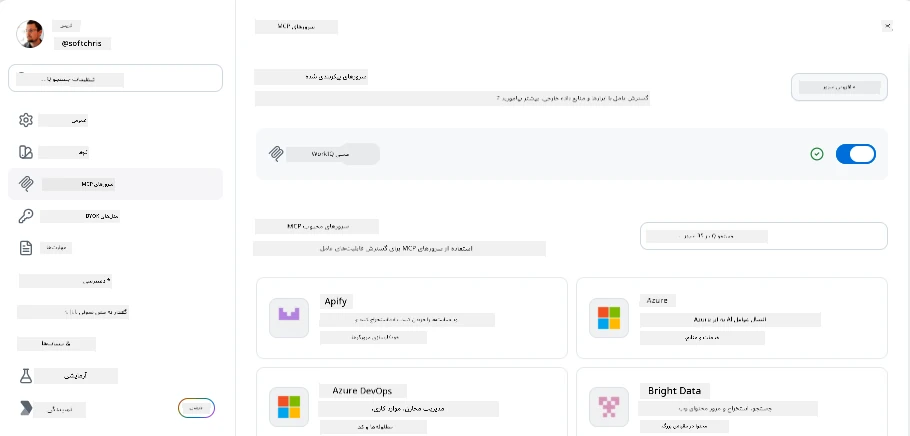
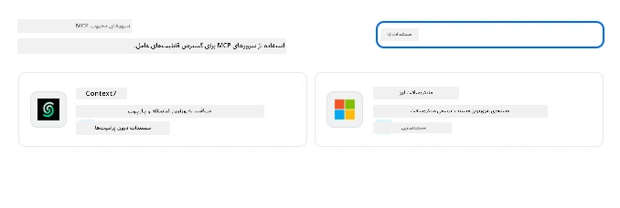
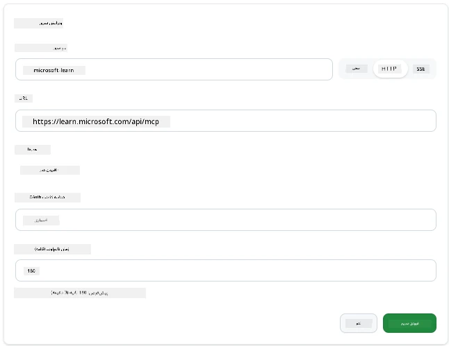
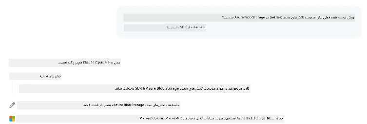
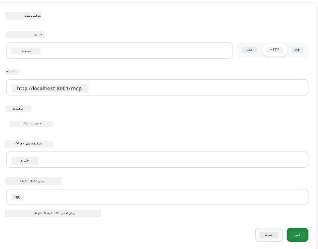
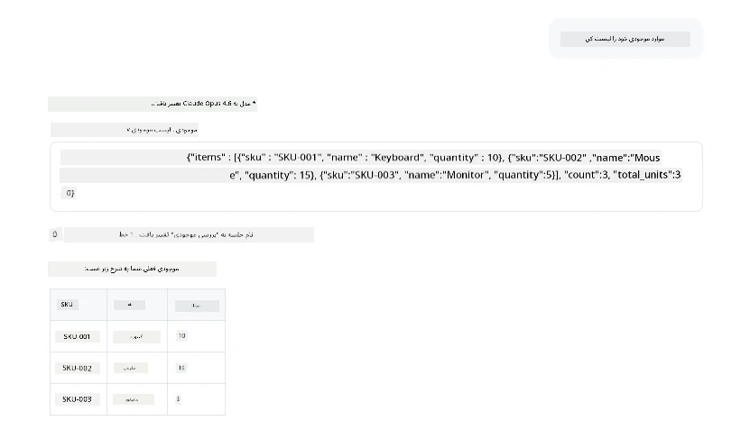
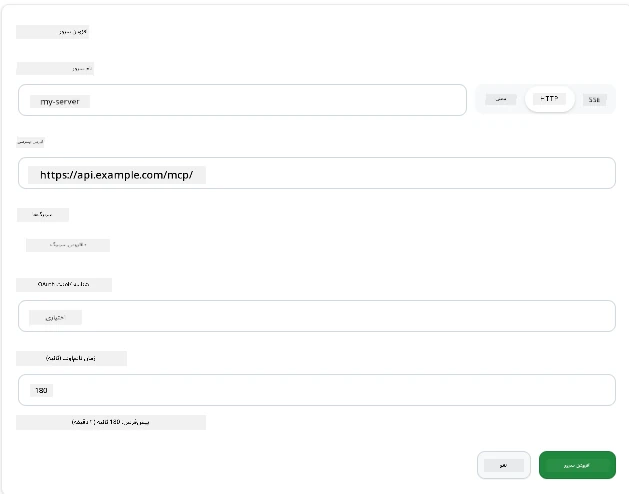
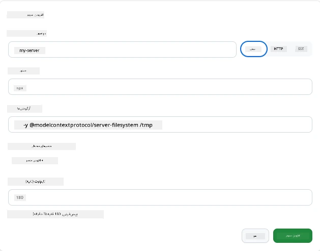

# استفاده از سرورهای MCP در اپلیکیشن GitHub Copilot

تا الان می‌دانید MCP چگونه کار می‌کند. شما سرورها را ساخته‌اید، ابزارها و منابع را تعریف کرده‌اید، و کلاینت‌ها را متصل کرده‌اید. اما کاری که هنوز نکرده‌ایم این است که زاویه دید را تغییر دهیم: به جای اینکه شما سرور را بسازید، به نظر می‌رسد به عنوان یک کاربر اپلیکیشن هوش مصنوعی مجهز به MCP چگونه است؟

[اپلیکیشن GitHub Copilot](https://github.com/github/app) یک اپ دسکتاپ است که می‌تواند از سرورهای MCP استفاده کند. با اتصال سرورهای MCP به آن، یک سطح جدید باز می‌شود: Copilot اکنون می‌تواند به مستندات شما دسترسی داشته باشد، API‌های داخلی شما را فراخوانی کند، پایگاه داده‌تان را جستجو کند، یا با هر سرویسی که در سروری بسته‌بندی کرده‌اید صحبت کند. اپلیکیشن میزبان می‌شود؛ سرورهای MCP شما ابزارهای آن.

این درس شما را از ابتدا تا انتها در این تجربه راهنمایی می‌کند — از پیدا کردن پنل تنظیمات MCP تا اتصال یک سرور مستندات واقعی و سپس راه‌اندازی یک سرور سفارشی خودتان.

## اهداف آموزشی

تا پایان این درس، قادر خواهید بود:

- پنل سرورهای MCP در تنظیمات اپلیکیشن Copilot را پیدا و مرور کنید.
- یک سرور مستندات میزبانی‌شده را متصل کرده و در یک جلسه استفاده کنید.
- یک سرور سفارشی ثبت کرده و تأیید کنید که Copilot می‌تواند ابزارهای آن را فراخوانی کند.
- پیکربندی نحوه فراخوانی سرور را با ارائه متغیرهای محیطی یا هدرهای سفارشی (اگر HTTP باشد) انجام دهید.

## اپلیکیشن Copilot به عنوان میزبان MCP

ایده اساسی این است: **عامل‌های Copilot هوشمند هستند، اما تنها می‌دانند آنچه شما به آن‌ها بگویید.** به طور پیش‌فرض، یک عامل می‌تواند فایل‌ها را در فضای کاری شما بخواند و فرمان‌های ترمینال را اجرا کند، اما نمی‌تواند پایگاه داده شما را جستجو کند، نگاهی به تقویم شما بیندازد، یا بدون کمک API سفارشی را فراخوانی کند. اینجاست که سرورهای MCP وارد می‌شوند. آن‌ها به عنوان پل بین Copilot و سیستم‌های شما — پایگاه‌های داده، کنترل نسخه، APIها، ابزارهای طراحی — عمل می‌کنند و به عامل‌ها دسترسی به اطلاعات و اقداماتی که برای تکمیل کار نیاز دارند را می‌دهند.

بیایید ابتدا تنظیمات مدیریت سرورهای MCP اپ شما را پیدا کنیم.

## مرحله 1: پیدا کردن پنل تنظیمات MCP

اپ Copilot را باز کنید و روی نماد چرخ‌دنده پایین سمت چپ کلیک کنید.


اطمینان حاصل کنید که «MCP Servers» را انتخاب کرده‌اید و اکنون باید سرورهای پیکربندی‌شده خود را در بالا ببینید، بازار سرورهای محبوب را در پایین، و یک دکمه «Add Server» در بالا مانند شکل زیر:



این مرکز کنترل شماست. شما اینجا سرورها را اضافه، حذف، فعال و غیرفعال می‌کنید. تغییرات برای جلسات جدید اعمال می‌شود؛ اگر جلسه‌ای باز دارید، پس از تغییر لیست باید جلسه تازه‌ای را شروع کنید.

## مرحله 2: اتصال یک سرور مستندات

بیایید کاری فوری و مفید انجام دهیم. سرور MCP مستندات مایکروسافت به Copilot دسترسی به مستندات رسمی مایکروسافت می‌دهد. این شامل Azure، .NET، TypeScript و بیشتر است. به جای اینکه عامل به داده‌های آموزش خود وابسته باشد (که تاریخ قطع دارد)، می‌تواند مستندات به‌روز را هنگام پرس‌وجو استخراج کند.

روش افزودن آن به این صورت است:

1. در شبکه سرورهای محبوب، **learn** را تایپ کنید و سروری به نام «Microsoft Learn» را انتخاب کنید.

   

   پس از کلیک، فرمی نشان داده می‌شود که نام، نوع انتقال و URL آن از پیش پر شده است، شما فقط باید روی «Add Server» کلیک کنید.

2. روی «Add Server» کلیک کنید، اتصال به سرور ممکن است چند ثانیه طول بکشد.

   

   پس از اضافه شدن، باید در ناحیه بالا به عنوان یک سرور پیکربندی شده ظاهر شود. بیایید آن را امتحان کنیم.

3. پنجره را ببندید و گزینه «Quick chat» را انتخاب کنید.

4. برای فعال کردن ابزاری روی سرور Microsoft Learn، متن زیر را تایپ کنید.

   ```text
   What's the current recommended approach for handling Azure Blob Storage 
   retries using the .NET SDK?
   ```

   

شما باید ببینید که چگونه به سرور MCP که همین الان اضافه کردیم ارجاع می‌دهد.

## مرحله 3: اتصال یک سرور سفارشی stdio

تنظیمات پیش‌فرض راحت است، اما قدرت واقعی در اتصال سرورهای خودتان است. فرض کنید سروری ساخته‌اید (یا یکی به شما داده شده است) که API داخلی شما یا پایگاه دانش شرکت را در معرض نمایش می‌گذارد. در این مثال، از سرور MCP ساخته شده توسط خودمان استفاده می‌کنیم که مدیریت موجودی شرکت را انجام می‌دهد.

1. روی چرخ‌دنده کلیک کنید و مجدداً «MCP servers» را انتخاب کنید.

2. دکمه «Add Server» و سپس «+ Add Custom server» را انتخاب کنید و مقادیر زیر را وارد کنید:

   - نام: `Inventory Server`
   - نوع انتقال (سمت راست) را **http** انتخاب کنید.

   «Add Server» را انتخاب کنید تا در لیست سرورهای پیکربندی شده ظاهر شود.

   

4. برای تست، متنی مانند زیر را اجرا کنید:

    ```
    list inventory
    ```

   

   اکنون باید لیست آیتم‌های موجودی را که از سرور سفارشی ساخته شده بازگشته مشاهده کنید.

عالی است، اکنون باید تسلط خوبی بر افزودن هم سرورهای خارجی و هم سرورهای MCP خودتان در اپلیکیشن Copilot داشته باشید. حالا بیایید در مورد مدیریت اسرار و متغیرهای محیطی صحبت کنیم.

## مرحله 4: تنظیمات پیشرفته

تاکنون دیده‌اید که چگونه می‌توان سرورهای MCP را اضافه کرد که فقط نام و URL ارائه می‌دهید. اما اگر سرور شما به کلید API یا مقداری دیگر نیاز داشته باشد چه؟ خوب، بسته به نوع انتقال، می‌توانیم آنچه نیاز دارد را فراهم کنیم.

- **انتقال http یا SSE**: اینجا می‌توانیم هدرها را به دلخواه تنظیم کنیم.

   برای احراز هویت، می‌توانید یک هدر Authorization مشخص کنید، مثلاً. مقدار ممکن است رشته‌ای ثابت باشد. اگر از OAuth استفاده می‌کنید، می‌توانید شناسه کلاینت OAuth را بدهید.

   

- **انتقال stdio**: متغیرهای محیطی می‌توانند تنظیم شوند.

   اینجا می‌توانید هر تعداد متغیر محیطی که نیاز دارید را مشخص کنید تا هنگام راه‌اندازی سرور به آن پاس داده شوند.

   

## خلاصه

اپ GitHub Copilot سرورهای MCP را به عنوان افزونه‌هایی درجه یک از قابلیت‌های عامل در نظر می‌گیرد. شما در این درس کل مسیر را از اضافه کردن سرورهای MCP تا استفاده از آن‌ها در جلسه دیده‌اید. اکنون می‌توانید به سرورهای عمومی، APIهای داخلی، و ابزارهای سفارشی متصل شوید و به عامل‌های خود توانایی دسترسی به اطلاعات و اقدامات لازم برای انجام خودکار وظایف را بدهید.

## 📚 منابع بیشتر

### مستندات رسمی

- [اپلیکیشن GitHub Copilot](https://github.com/github/app)
- [مشخصات MCP](https://modelcontextprotocol.io/specification/2025-03-26) - مشخصات Model Context Protocol

### جامعه
- [دیسکورد جامعه MCP](https://discord.com/invite/ByRwuEEgH4) - بحث‌های زنده
- [بحث‌های GitHub](https://github.com/microsoft/MCP-Server-and-PostgreSQL-Sample-Retail/discussions) - پرسش و پاسخ و اشتراک گذاری
- [Stack Overflow](https://stackoverflow.com/questions/tagged/model-context-protocol) - سوالات فنی

---

<!-- CO-OP TRANSLATOR DISCLAIMER START -->
**سلب مسئولیت**:
این سند با استفاده از سرویس ترجمه هوش مصنوعی [Co-op Translator](https://github.com/Azure/co-op-translator) ترجمه شده است. در حالی که ما در تلاش برای دقت هستیم، لطفاً توجه داشته باشید که ترجمه‌های خودکار ممکن است شامل خطاها یا نادرستی‌هایی باشند. سند اصلی به زبان مادری خود باید به عنوان منبع معتبر در نظر گرفته شود. برای اطلاعات حیاتی، ترجمه حرفه‌ای انسانی توصیه می‌شود. ما در قبال هرگونه سوء تفاهم یا برداشت نادرست ناشی از استفاده از این ترجمه مسئولیتی نداریم.
<!-- CO-OP TRANSLATOR DISCLAIMER END -->