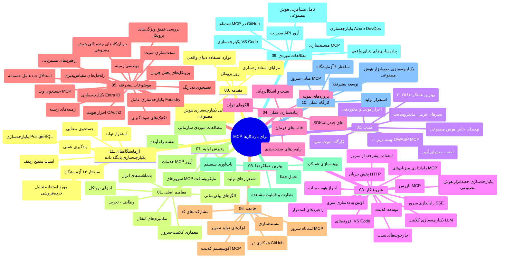

# پروتکل زمینه مدل (MCP) برای مبتدیان - راهنمای مطالعه

این راهنمای مطالعه نمای کلی از ساختار و محتوای مخزن «پروتکل زمینه مدل (MCP) برای مبتدیان» را ارائه می‌دهد. از این راهنما برای ناوبری مؤثر در مخزن و استفاده حداکثری از منابع موجود استفاده کنید.

## نمای کلی مخزن

پروتکل زمینه مدل (MCP) چارچوب استانداردی برای تعاملات بین مدل‌های هوش مصنوعی و برنامه‌های مشتری است. این پروتکل که ابتدا توسط Anthropic ایجاد شده، اکنون توسط جامعه گسترده MCP از طریق سازمان رسمی گیت‌هاب نگهداری می‌شود. این مخزن برنامه درسی جامعی با مثال‌های کد عملی در زبان‌های C#، Java، JavaScript، Python و TypeScript ارائه می‌دهد که برای توسعه‌دهندگان هوش مصنوعی، معماران سیستم و مهندسان نرم‌افزار طراحی شده است.

## نقشه برنامه درسی بصری

## ساختار مخزن

مخزن به یازده بخش اصلی سازماندهی شده است که هر کدام بر جنبه‌های مختلف MCP تمرکز دارند:

1. **مقدمه (00-Introduction/)**
   - مرور پروتکل زمینه مدل
   - اهمیت استانداردسازی در خطوط لوله هوش مصنوعی
   - موارد استفاده عملی و مزایا

2. **مفاهیم اصلی (01-CoreConcepts/)**
   - معماری کلاینت-سرور
   - اجزای کلیدی پروتکل
   - الگوهای پیام‌رسانی در MCP

3. **امنیت (02-Security/)**
   - تهدیدات امنیتی در سیستم‌های مبتنی بر MCP
   - بهترین شیوه‌ها برای ایمن‌سازی پیاده‌سازی‌ها
   - استراتژی‌های احراز هویت و مجوزدهی
   - **مستندات جامع امنیتی**:
     - بهترین شیوه‌های امنیتی MCP 2025
     - راهنمای اجرای ایمنی محتوا در Azure
     - کنترل‌ها و تکنیک‌های امنیتی MCP
     - مرجع سریع بهترین شیوه‌های MCP
   - **موضوعات کلیدی امنیتی**:
     - تزریق پرامپت و حملات مسموم‌سازی ابزار
     - ربودن نشست و مشکلات نماینده گیج‌شده
     - آسیب‌پذیری‌های گذر توکن
     - مجوزهای زیاد و کنترل دسترسی
     - امنیت زنجیره تأمین برای اجزای هوش مصنوعی
     - یکپارچه‌سازی Microsoft Prompt Shields

4. **شروع کار (03-GettingStarted/)**
   - راه‌اندازی و پیکربندی محیط
   - ایجاد سرورها و کلاینت‌های پایه MCP
   - ادغام با برنامه‌های موجود
   - شامل بخش‌هایی برای:
     - پیاده‌سازی اولین سرور
     - توسعه کلاینت
     - ادغام کلاینت LLM
     - ادغام VS Code
     - سرور ارسال شده توسط SSE
     - استفاده پیشرفته از سرور
     - استریمینگ HTTP
     - ادغام ابزار AI Toolkit
     - استراتژی‌های تست
     - راهنمای استقرار

5. **پیاده‌سازی عملی (04-PracticalImplementation/)**
   - استفاده از SDKها در زبان‌های برنامه‌نویسی مختلف
   - تکنیک‌های اشکال‌زدایی، تست و اعتبارسنجی
   - طراحی قالب‌ها و گردش‌کارهای پرامپت قابل استفاده مجدد
   - پروژه‌های نمونه با مثال‌های پیاده‌سازی

6. **موضوعات پیشرفته (05-AdvancedTopics/)**
   - تکنیک‌های مهندسی زمینه
   - ادغام عامل Foundry
   - گردش‌کارهای چندرسانه‌ای هوش مصنوعی
   - دموهای احراز هویت OAuth2
   - قابلیت‌های جستجوی بلادرنگ
   - استریمینگ در زمان واقعی
   - پیاده‌سازی زمینه‌های ریشه
   - استراتژی‌های مسیردهی
   - تکنیک‌های نمونه‌برداری
   - رویکردهای مقیاس‌بندی
   - ملاحظات امنیتی
   - یکپارچه‌سازی امنیت Entra ID
   - ادغام جستجوی وب
   - استدلال چندعاملی متخاصم (الگوهای مناظره)

7. **مشارکت‌های جامعه (06-CommunityContributions/)**
   - نحوه مشارکت در کد و مستندات
   - همکاری از طریق گیت‌هاب
   - بهبودها و بازخوردهای مبتنی بر جامعه
   - استفاده از کلاینت‌های مختلف MCP (Claude Desktop، Cline، VSCode)
   - کار با سرورهای MCP محبوب از جمله تولید تصویر

8. **درس‌هایی از پذیرش اولیه (07-LessonsfromEarlyAdoption/)**
   - پیاده‌سازی‌های واقعی و داستان‌های موفقیت
   - ساخت و استقرار راه‌حل‌های مبتنی بر MCP
   - روندها و نقشه راه آینده
   - **راهنمای سرورهای MCP مایکروسافت**: راهنمای جامع ۱۰ سرور MCP آماده تولید مایکروسافت شامل:
     - سرور MCP مستندات Microsoft Learn
     - سرور Azure MCP (بیش از ۱۵ کانکتور تخصصی)
     - سرور GitHub MCP
     - سرور Azure DevOps MCP
     - سرور MarkItDown MCP
     - سرور SQL Server MCP
     - سرور Playwright MCP
     - سرور Dev Box MCP
     - سرور Microsoft Foundry MCP
     - سرور Microsoft 365 Agents Toolkit MCP

9. **بهترین شیوه‌ها (08-BestPractices/)**
   - بهینه‌سازی و تنظیم عملکرد
   - طراحی سیستم‌های MCP مقاوم در برابر خطا
   - استراتژی‌های تست و تاب‌آوری

10. **مطالعات موردی (09-CaseStudy/)**
    - **هفت مطالعه موردی جامع** که قابلیت‌های MCP را در سناریوهای متنوع نشان می‌دهند:
    - **نمایندگان سفر Azure AI**: ارکستراسیون چندعاملی با Azure OpenAI و AI Search
    - **ادغام Azure DevOps**: خودکارسازی فرآیندهای گردش کار با به‌روزرسانی داده‌های یوتیوب
    - **بازیابی بلادرنگ مستندات**: کلاینت کنسول پایتون با استریمینگ HTTP
    - **تولید برنامه مطالعه تعاملی**: برنامه وب Chainlit با هوش مصنوعی مکالمه‌ای
    - **مستندسازی در ویرایشگر**: ادغام VS Code با گردش‌کارهای GitHub Copilot
    - **مدیریت API Azure**: ادغام API سازمانی با ایجاد سرور MCP
    - **ثبت MCP GitHub**: توسعه اکوسیستم و پلتفرم ادغام عاملی
    - مثال‌های پیاده‌سازی در حوزه ادغام سازمانی، بهره‌وری توسعه‌دهنده و توسعه اکوسیستم

11. **کارگاه عملی (10-StreamliningAIWorkflowsBuildingAnMCPServerWithAIToolkit/)**
    - کارگاه عملی جامع ترکیب MCP با AI Toolkit
    - ساخت برنامه‌های هوشمند که مدل‌های هوش مصنوعی را با ابزارهای دنیای واقعی پیوند می‌دهد
    - ماژول‌های عملی شامل مبانی، توسعه سرور سفارشی و استراتژی‌های استقرار در تولید
    - **ساختار آزمایشگاه**:
      - آزمایشگاه ۱: مبانی سرور MCP
      - آزمایشگاه ۲: توسعه پیشرفته سرور MCP
      - آزمایشگاه ۳: ادغام AI Toolkit
      - آزمایشگاه ۴: استقرار و مقیاس‌بندی در تولید
    - رویکرد یادگیری مبتنی بر آزمایشگاه با دستورالعمل‌های مرحله به مرحله

12. **آزمایشگاه‌های ادغام پایگاه داده سرور MCP (11-MCPServerHandsOnLabs/)**
    - **مسیر یادگیری ۱۳ آزمایشگاه جامع** برای ساخت سرورهای MCP آماده تولید با ادغام PostgreSQL
    - **پیاده‌سازی تحلیلات خرده‌فروشی واقعی** با استفاده از مورد استفاده Zava Retail
    - **الگوهای سازمانی درجه یک** شامل امنیت سطح ردیف (RLS)، جستجوی معنایی و دسترسی چند مستأجری به داده‌ها
    - **ساختار کامل آزمایشگاه‌ها**:
      - **آزمایشگاه‌های ۰۰-۰۳: مبانی** - مقدمه، معماری، امنیت، راه‌اندازی محیط
      - **آزمایشگاه‌های ۰۴-۰۶: ساخت سرور MCP** - طراحی پایگاه داده، پیاده‌سازی سرور MCP، توسعه ابزار
      - **آزمایشگاه‌های ۰۷-۰۹: ویژگی‌های پیشرفته** - جستجوی معنایی، تست و اشکال‌زدایی، ادغام VS Code
      - **آزمایشگاه‌های ۱۰-۱۲: تولید و بهترین شیوه‌ها** - استقرار، پایش، بهینه‌سازی
    - **فناوری‌های تحت پوشش**: چارچوب FastMCP، PostgreSQL، Azure OpenAI، Azure Container Apps، Application Insights
    - **نتایج یادگیری**: سرورهای MCP آماده تولید، الگوهای ادغام پایگاه داده، تجزیه و تحلیل با پشتیبانی هوش مصنوعی، امنیت سازمانی

## منابع اضافی

مخزن شامل منابع پشتیبانی است:

- **پوشه تصاویر**: شامل نمودارها و تصاویر استفاده شده در سراسر برنامه درسی
- **ترجمه‌ها**: پشتیبانی چندزبانه با ترجمه‌های خودکار مستندات
- **منابع رسمی MCP**:
  - [مستندات MCP](https://modelcontextprotocol.io/)
  - [مشخصات MCP](https://spec.modelcontextprotocol.io/)
  - [مخزن گیت‌هاب MCP](https://github.com/modelcontextprotocol)

## چگونه از این مخزن استفاده کنیم

1. **یادگیری متوالی**: فصل‌ها را به ترتیب (۰۰ تا ۱۱) دنبال کنید تا تجربه یادگیری ساختاریافته داشته باشید.
2. **تمرکز بر زبان خاص**: اگر به زبان برنامه‌نویسی خاصی علاقه‌مند هستید، دایرکتوری نمونه‌ها را برای پیاده‌سازی در زبان مورد علاقه خود بررسی کنید.
3. **پیاده‌سازی عملی**: با بخش «شروع کار» شروع کنید تا محیط خود را راه‌اندازی کرده و اولین سرور و کلاینت MCP خود را ایجاد کنید.
4. **کاوش پیشرفته**: پس از تسلط بر اصول، به موضوعات پیشرفته بپردازید تا دانش خود را گسترش دهید.
5. **مشارکت در جامعه**: از طریق بحث‌های گیت‌هاب و کانال‌های دیسکورد به جامعه MCP بپیوندید تا با کارشناسان و توسعه‌دهندگان دیگر ارتباط برقرار کنید.

## کلاینت‌ها و ابزارهای MCP

برنامه درسی شامل کلاینت‌ها و ابزارهای مختلف MCP است:

1. **کلاینت‌های رسمی**:
   - Visual Studio Code
   - MCP در Visual Studio Code
   - Claude Desktop
   - Claude در VSCode
   - Claude API

2. **کلاینت‌های جامعه**:
   - Cline (مبتنی بر ترمینال)
   - Cursor (ویرایشگر کد)
   - ChatMCP
   - Windsurf

3. **ابزارهای مدیریت MCP**:
   - MCP CLI
   - MCP Manager
   - MCP Linker
   - MCP Router

## سرورهای محبوب MCP

این مخزن سرورهای مختلف MCP را معرفی می‌کند، از جمله:

1. **سرورهای رسمی مایکروسافت MCP**:
   - سرور مستندات Microsoft Learn MCP
   - سرور Azure MCP (بیش از ۱۵ کانکتور تخصصی)
   - سرور GitHub MCP
   - سرور Azure DevOps MCP
   - سرور MarkItDown MCP
   - سرور SQL Server MCP
   - سرور Playwright MCP
   - سرور Dev Box MCP
   - سرور Microsoft Foundry MCP
   - سرور Microsoft 365 Agents Toolkit MCP

2. **سرورهای مرجع رسمی**:
   - Filesystem
   - Fetch
   - Memory
   - Sequential Thinking

3. **تولید تصویر**:
   - Azure OpenAI DALL-E 3
   - Stable Diffusion WebUI
   - Replicate

4. **ابزارهای توسعه**:
   - Git MCP
   - Terminal Control
   - Code Assistant

5. **سرورهای تخصصی**:
   - Salesforce
   - Microsoft Teams
   - Jira & Confluence

## مشارکت

این مخزن از مشارکت جامعه استقبال می‌کند. بخش مشارکت‌های جامعه را برای راهنمایی در مورد نحوه مشارکت مؤثر در اکوسیستم MCP مشاهده کنید.

----

*این راهنمای مطالعه در تاریخ ۵ فوریه ۲۰۲۶ به‌روز شده است و منعکس‌کننده آخرین مشخصات MCP 2025-11-25 می‌باشد و نمای کلی از مخزن تا آن تاریخ را ارائه می‌دهد. محتوای مخزن ممکن است پس از این تاریخ به‌روزرسانی شود.*

---

<!-- CO-OP TRANSLATOR DISCLAIMER START -->
**سلب مسئولیت**:
این سند با استفاده از سرویس ترجمه هوش مصنوعی [Co-op Translator](https://github.com/Azure/co-op-translator) ترجمه شده است. در حالی که ما در تلاش برای دقت هستیم، لطفاً توجه داشته باشید که ترجمه‌های خودکار ممکن است شامل خطاها یا نادرستی‌هایی باشند. سند اصلی به زبان مادری خود باید به عنوان منبع معتبر در نظر گرفته شود. برای اطلاعات حیاتی، ترجمه حرفه‌ای انسانی توصیه می‌شود. ما در قبال هرگونه سوء تفاهم یا برداشت نادرست ناشی از استفاده از این ترجمه مسئولیتی نداریم.
<!-- CO-OP TRANSLATOR DISCLAIMER END -->