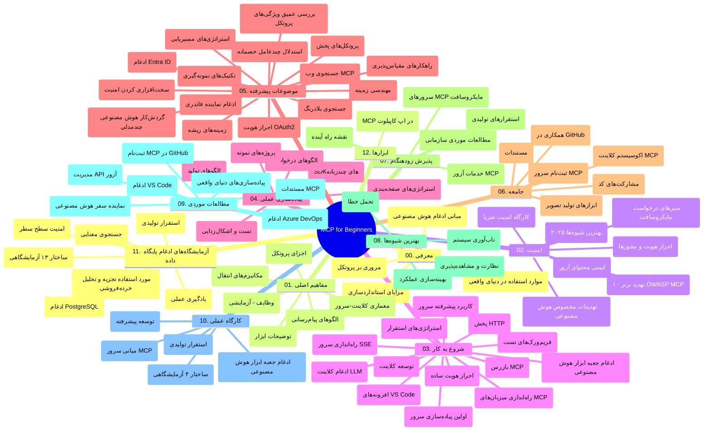

# پروتکل مدل کانتکست (MCP) برای مبتدیان - راهنمای مطالعه

این راهنمای مطالعه نمای کلی‌ای از ساختار و محتوای مخزن "پروتکل مدل کانتکست (MCP) برای مبتدیان" ارائه می‌دهد. از این راهنما برای ناوبری مؤثر در مخزن و بهره‌برداری حداکثری از منابع موجود استفاده کنید.

## نمای کلی مخزن

پروتکل مدل کانتکست (MCP) یک چارچوب استاندارد برای تعاملات بین مدل‌های هوش مصنوعی و برنامه‌های کلاینت است. این پروتکل ابتدا توسط Anthropic ایجاد شد و اکنون توسط جامعه گسترده‌تر MCP از طریق سازمان رسمی گیت‌هاب نگهداری می‌شود. این مخزن یک دوره آموزشی جامع با مثال‌های عملی کدنویسی به زبان‌های C#، Java، JavaScript، Python و TypeScript ارائه می‌دهد که برای توسعه‌دهندگان هوش مصنوعی، معماران سیستم و مهندسان نرم‌افزار طراحی شده است.

## نقشه دوره آموزشی بصری

## ساختار مخزن

مخزن به دوازده بخش اصلی تقسیم شده است که هر کدام بر جنبه‌های مختلف MCP تمرکز دارند:

1. **مقدمه (00-Introduction/)**
   - نمای کلی پروتکل مدل کانتکست
   - اهمیت استانداردسازی در خط‌لوله‌های هوش مصنوعی
   - کاربردهای عملی و مزایا

2. **مفاهیم اصلی (01-CoreConcepts/)**
   - معماری کلاینت-سرور
   - اجزای اصلی پروتکل
   - الگوهای پیام‌رسانی در MCP

3. **امنیت (02-Security/)**
   - تهدیدات امنیتی در سیستم‌های مبتنی بر MCP
   - بهترین شیوه‌ها برای ایمن‌سازی پیاده‌سازی‌ها
   - استراتژی‌های احراز هویت و مجوزدهی
   - **مستندات جامع امنیتی**:
     - بهترین شیوه‌های امنیتی MCP 2025
     - راهنمای پیاده‌سازی ایمنی محتوا در Azure
     - کنترل‌ها و تکنیک‌های امنیتی MCP
     - مرجع سریع بهترین شیوه‌های MCP
   - **موضوعات کلیدی امنیتی**:
     - حملات تزریق پرامپت و مسمومیت ابزار
     - ربودن نشست و مشکلات نماینده اشتباه
     - آسیب‌پذیری‌های پاس‌دادن توکن
     - دسترسی بیش از حد و کنترل مجوزها
     - امنیت زنجیره تأمین برای اجزای هوش مصنوعی
     - ادغام Microsoft Prompt Shields

4. **شروع کار (03-GettingStarted/)**
   - راه‌اندازی محیط و پیکربندی
   - ایجاد سرورها و کلاینت‌های پایه MCP
   - ادغام با برنامه‌های موجود
   - شامل بخش‌هایی برای:
     - پیاده‌سازی اولین سرور
     - توسعه کلاینت
     - ادغام کلاینت LLM
     - ادغام VS Code
     - سرور رویدادهای ارسال شده (SSE)
     - استفاده پیشرفته از سرور
     - استریمینگ HTTP
     - ادغام با AI Toolkit
     - استراتژی‌های تست
     - دستورالعمل‌های استقرار

5. **پیاده‌سازی عملی (04-PracticalImplementation/)**
   - استفاده از SDK ها در زبان‌های مختلف برنامه‌نویسی
   - اشکال‌زدایی، تست و تکنیک‌های اعتبارسنجی
   - ساخت قالب‌های پرامپت قابل استفاده مجدد و گردش‌های کاری
   - پروژه‌های نمونه با مثال‌های پیاده‌سازی

6. **موضوعات پیشرفته (05-AdvancedTopics/)**
   - تکنیک‌های مهندسی کانتکست
   - ادغام عامل Foundry
   - گردش‌های کاری چندمودال AI
   - دموهای احراز هویت OAuth2
   - قابلیت‌های جستجوی بلادرنگ
   - استریمینگ بلادرنگ
   - پیاده‌سازی کانتکست‌های ریشه
   - استراتژی‌های مسیردهی
   - تکنیک‌های نمونه‌گیری
   - روش‌های مقیاس‌پذیری
   - ملاحظات امنیتی
   - ادغام امنیتی Entra ID
   - ادغام جستجوی وب
   - استدلال چندعاملی مخالف (الگوهای مناظره)

7. **مشارکت‌های جامعه (06-CommunityContributions/)**
   - چگونه کد و مستندات مشارکت کنیم
   - همکاری از طریق گیت‌هاب
   - بهبودها و بازخوردهای مبتنی بر جامعه
   - استفاده از کلاینت‌های مختلف MCP (Claude Desktop, Cline, VSCode)
   - کار با سرورهای محبوب MCP شامل تولید تصویر

8. **درس‌هایی از پذیرش اولیه (07-LessonsfromEarlyAdoption/)**
   - پیاده‌سازی‌ها و داستان‌های موفقیت واقعی
   - ساخت و استقرار راه‌حل‌های مبتنی بر MCP
   - روندها و نقشه راه آینده
   - **راهنمای سرورهای Microsoft MCP**: راهنمای جامع ۱۰ سرور تولیدی Microsoft MCP شامل:
     - سرور Microsoft Learn Docs MCP
     - سرور Azure MCP (بیش از ۱۵ کانکتور تخصصی)
     - سرور GitHub MCP
     - سرور Azure DevOps MCP
     - سرور MarkItDown MCP
     - سرور SQL Server MCP
     - سرور Playwright MCP
     - سرور Dev Box MCP
     - سرور Microsoft Foundry MCP
     - سرور Microsoft 365 Agents Toolkit MCP

9. **بهترین شیوه‌ها (08-BestPractices/)**
   - تنظیم عملکرد و بهینه‌سازی
   - طراحی سیستم‌های MCP مقاوم در برابر خطا
   - استراتژی‌های تست و تاب‌آوری

10. **مطالعات موردی (09-CaseStudy/)**
    - **هفت مطالعه موردی جامع** که تطبیق‌پذیری MCP را در سناریوهای متنوع نشان می‌دهد:
    - **نمایندگان سفر AI در Azure**: ارکستراسیون چندعاملی با Azure OpenAI و AI Search
    - **ادغام Azure DevOps**: اتوماسیون فرایندهای کاری با به‌روزرسانی‌های داده‌ی یوتیوب
    - **بازیابی مستندات بلادرنگ**: کلاینت کنسول پایتون با استریم HTTP
    - **تولیدکننده برنامه مطالعاتی تعاملی**: برنامه وب Chainlit با AI مکالمه‌ای
    - **مستندات در ویرایشگر**: ادغام VS Code با گردش‌های کاری GitHub Copilot
    - **مدیریت API Azure**: ادغام API سازمانی با ایجاد سرور MCP
    - **رجیستری MCP GitHub**: توسعه اکوسیستم و پلتفرم ادغام عاملی
    - نمونه‌های پیاده‌سازی در حوزه ادغام سازمانی، بهره‌وری توسعه‌دهنده و توسعه اکوسیستم

11. **کارگاه عملی (10-StreamliningAIWorkflowsBuildingAnMCPServerWithAIToolkit/)**
    - کارگاه عملی جامع ترکیب MCP با AI Toolkit
    - ساخت برنامه‌های هوشمند پیونددهنده مدل‌های AI با ابزارهای دنیای واقعی
    - ماژول‌های عملی شامل مبانی، توسعه سرور سفارشی و استراتژی‌های استقرار تولید
    - **ساختار آزمایشگاه**:
      - آزمایشگاه ۱: مبانی سرور MCP
      - آزمایشگاه ۲: توسعه پیشرفته سرور MCP
      - آزمایشگاه ۳: ادغام AI Toolkit
      - آزمایشگاه ۴: استقرار و مقیاس‌پذیری در تولید
    - رویکرد یادگیری مبتنی بر آزمایشگاه با دستورالعمل گام‌به‌گام

12. **آزمایشگاه‌های ادغام پایگاه داده سرور MCP (11-MCPServerHandsOnLabs/)**
    - **مسیر یادگیری ۱۳ آزمایشگاه جامع** برای ساخت سرورهای MCP آماده تولید با ادغام PostgreSQL
    - **پیاده‌سازی تحلیل‌های فروشگاه واقعی** با استفاده از مورد کاربرد Zava Retail
    - **الگوهای سازمانی** شامل امنیت سطح ردیف (RLS)، جستجوی معنایی و دسترسی داده چندمستأجری
    - **ساختار کامل آزمایشگاه‌ها**:
      - **آزمایشگاه‌های ۰۰-۰۳: مبانی** - مقدمه، معماری، امنیت، راه‌اندازی محیط
      - **آزمایشگاه‌های ۰۴-۰۶: ساخت سرور MCP** - طراحی پایگاه داده، پیاده‌سازی سرور MCP، توسعه ابزار
      - **آزمایشگاه‌های ۰۷-۰۹: ویژگی‌های پیشرفته** - جستجوی معنایی، تست و اشکال‌زدایی، ادغام VS Code
      - **آزمایشگاه‌های ۱۰-۱۲: تولید و بهترین شیوه‌ها** - استقرار، مانیتورینگ، بهینه‌سازی
    - **فناوری‌های پوشش داده شده**: فریمورک FastMCP، PostgreSQL، Azure OpenAI، Azure Container Apps، Application Insights
    - **خروجی‌های آموزشی**: سرورهای MCP آماده تولید، الگوهای ادغام پایگاه داده، تحلیل‌های مبتنی بر هوش مصنوعی، امنیت سازمانی

13. **ابزارها (12-tooling/)**
    - یادگیری نحوه استفاده از MCP در اپلیکیشن Copilot و سایر ابزارها

## منابع اضافی

مخزن شامل منابع پشتیبان است:

- **پوشه تصاویر**: شامل نمودارها و تصاویر استفاده شده در کل دوره آموزشی
- **ترجمه‌ها**: پشتیبانی چندزبانه با ترجمه‌های خودکار مستندات
- **منابع رسمی MCP**:
  - [مستندات MCP](https://modelcontextprotocol.io/)
  - [مشخصات MCP](https://spec.modelcontextprotocol.io/)
  - [مخزن گیت‌هاب MCP](https://github.com/modelcontextprotocol)

## نحوه استفاده از این مخزن

1. **یادگیری ترتیبی**: فصول را به ترتیب (از ۰۰ تا ۱۱) دنبال کنید تا تجربه یادگیری ساختاریافته‌ای داشته باشید.
2. **تمرکز بر زبان خاص**: اگر به زبان برنامه‌نویسی خاصی علاقه‌مندید، دایرکتوری نمونه‌ها را برای پیاده‌سازی در زبان مورد نظر خود بررسی کنید.
3. **پیاده‌سازی عملی**: با بخش "شروع کار" شروع کنید تا محیط خود را راه‌اندازی کرده و اولین سرور و کلاینت MCP خود را بسازید.
4. **کاوش پیشرفته**: پس از تسلط بر اصول، به موضوعات پیشرفته بپردازید تا دانش خود را گسترش دهید.
5. **تعامل با جامعه**: از طریق بحث‌های گیت‌هاب و کانال‌های Discord به جامعه MCP بپیوندید تا با کارشناسان و توسعه‌دهندگان همفکر ارتباط برقرار کنید.

## کلاینت‌ها و ابزارهای MCP

دوره آموزشی کلاینت‌ها و ابزارهای مختلف MCP را پوشش می‌دهد:

1. **کلاینت‌های رسمی**:
   - Visual Studio Code
   - MCP در Visual Studio Code
   - Claude Desktop
   - Claude در VSCode
   - Claude API

2. **کلاینت‌های جامعه**:
   - Cline (مبتنی بر ترمینال)
   - Cursor (ویرایشگر کد)
   - ChatMCP
   - Windsurf

3. **ابزارهای مدیریت MCP**:
   - MCP CLI
   - MCP Manager
   - MCP Linker
   - MCP Router

## سرورهای محبوب MCP

مخزن سرورهای مختلف MCP را معرفی می‌کند، از جمله:

1. **سرورهای رسمی Microsoft MCP**:
   - سرور Microsoft Learn Docs MCP
   - سرور Azure MCP (بیش از ۱۵ کانکتور تخصصی)
   - سرور GitHub MCP
   - سرور Azure DevOps MCP
   - سرور MarkItDown MCP
   - سرور SQL Server MCP
   - سرور Playwright MCP
   - سرور Dev Box MCP
   - سرور Microsoft Foundry MCP
   - سرور Microsoft 365 Agents Toolkit MCP

2. **سرورهای مرجع رسمی**:
   - Filesystem
   - Fetch
   - Memory
   - Sequential Thinking

3. **تولید تصویر**:
   - Azure OpenAI DALL-E 3
   - Stable Diffusion WebUI
   - Replicate

4. **ابزارهای توسعه**:
   - Git MCP
   - Terminal Control
   - Code Assistant

5. **سرورهای تخصصی**:
   - Salesforce
   - Microsoft Teams
   - Jira & Confluence

## مشارکت

این مخزن از مشارکت جامعه استقبال می‌کند. بخش مشارکت‌های جامعه را برای راهنمایی درباره نحوه مشارکت مؤثر در اکوسیستم MCP ببینید.

----

*این راهنمای مطالعه در تاریخ ۵ فوریه ۲۰۲۶ آخرین بار به‌روزرسانی شده است، بازتاب‌دهنده آخرین مشخصات MCP مورخ ۲۰۲۵-۱۱-۲۵ و نمای کلی از مخزن تا آن تاریخ است. محتوای مخزن ممکن است پس از این تاریخ به‌روزرسانی شود.*

---

<!-- CO-OP TRANSLATOR DISCLAIMER START -->
**سلب مسئولیت**:
این سند با استفاده از سرویس ترجمه هوش مصنوعی [Co-op Translator](https://github.com/Azure/co-op-translator) ترجمه شده است. در حالی که ما در تلاش برای دقت هستیم، لطفاً توجه داشته باشید که ترجمه‌های خودکار ممکن است شامل خطاها یا نادرستی‌هایی باشند. سند اصلی به زبان مادری خود باید به عنوان منبع معتبر در نظر گرفته شود. برای اطلاعات حیاتی، ترجمه حرفه‌ای انسانی توصیه می‌شود. ما در قبال هرگونه سوء تفاهم یا برداشت نادرست ناشی از استفاده از این ترجمه مسئولیتی نداریم.
<!-- CO-OP TRANSLATOR DISCLAIMER END -->