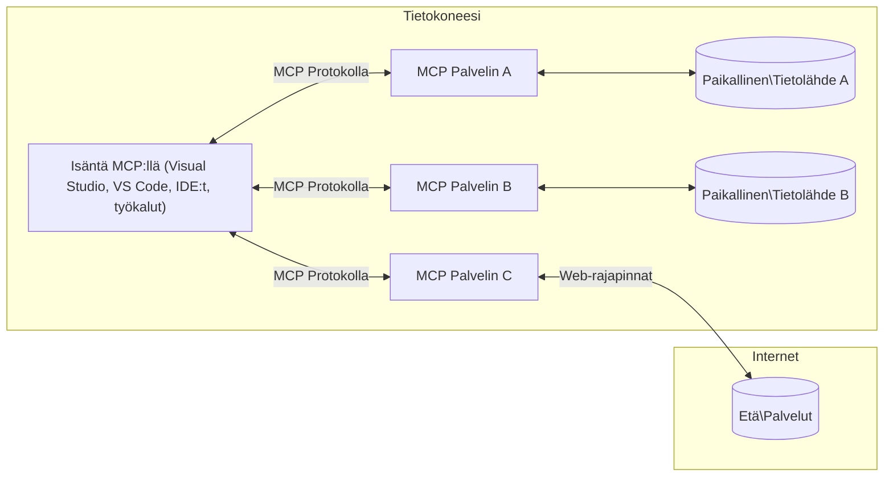

# MCP Core Concepts: Mallikontekstilähtöisen protokollan hallinta tekoälyintegraatiossa

[](https://youtu.be/earDzWGtE84)

_(Napsauta yllä olevaa kuvaa katsellaksesi tämän oppitunnin videota)_

[Model Context Protocol (MCP)](https://github.com/modelcontextprotocol) on tehokas, standardoitu kehys, joka optimoi viestinnän suurten kielimallien (LLM) ja ulkoisten työkalujen, sovellusten ja tietolähteiden välillä. Tämä opas ohjaa sinut MCP:n ydinkäsitteisiin. Opit sen asiakas-palvelinarkkitehtuurista, olennaisista komponenteista, viestintämekanismeista ja toteutuksen parhaista käytännöistä.

- **Selkeä käyttäjän suostumus**: Kaikkiin tietojen käyttöön ja toimenpiteisiin vaaditaan käyttäjän selvä hyväksyntä ennen suorittamista. Käyttäjän tulee ymmärtää tarkasti, mitä tietoja käytetään ja mitä toimintoja suoritetaan, tarjolla on myös tarkka kontrolli käyttöoikeuksista ja valtuuksista.

- **Tietosuojan suojaaminen**: Käyttäjätiedot paljastetaan vain selkeällä suostumuksella, ja niitä tulee suojata vahvoilla käyttöoikeusrajoituksilla koko vuorovaikutuksen elinkaaren ajan. Toteutusten tulee estää luvaton tiedonsiirto ja ylläpitää tiukkoja yksityisyysrajoja.

- **Työkalujen suoritusturvallisuus**: Jokainen työkalukutsu vaatii käyttäjän nimenomaisen suostumuksen, jossa työkalun toiminnallisuus, parametrit ja mahdollinen vaikutus on selkeästi ymmärretty. Vakavat turvallisuusrajat estävät vahingossa tapahtuvan, turvattoman tai haitallisen työkalukäytön.

- **Kuljetuskerroksen turvallisuus**: Kaikkien viestintäkanavien tulee käyttää sopivia salaus- ja todennusmekanismeja. Etäyhteyksissä tulee käyttää turvallisia siirtoprotokollia ja asianmukaista tunnistetietojen hallintaa.

#### Toteutusohjeet:

- **Käyttöoikeuksien hallinta**: Toteuta hienojakoisia käyttöoikeusjärjestelmiä, jotka antavat käyttäjille mahdollisuuden hallita, mitkä palvelimet, työkalut ja resurssit ovat käytettävissä
- **Todennus ja valtuutus**: Käytä turvallisia todennustapoja (OAuth, API-avaimet) asianmukaisella tunnuksen hallinnalla ja vanhentumisella  
- **Syötteiden validointi**: Varmista kaikkien parametrien ja datasyötteiden validointi määriteltyjen skeemojen mukaisesti tietojenkalastelun estämiseksi
- **Loki kirjaaminen**: Pidä kattavat lokit kaikista toimista turvallisuuden valvontaan ja vaatimustenmukaisuuden varmistamiseen

## Yleiskatsaus

Tämä oppitunti tutkii Model Context Protocolin (MCP) perustavanlaatuista arkkitehtuuria ja komponentteja, jotka muodostavat MCP-ekosysteemin. Opit MCP-asiakas-palvelinarkkitehtuurista, keskeisistä komponenteista ja viestintämekanismeista, jotka mahdollistavat MCP-vuorovaikutukset.

## Keskeiset oppimistavoitteet

Tämän oppitunnin lopussa osaat:

- Ymmärtää MCP:n asiakas-palvelinarkkitehtuurin.
- Tunnistaa Hostien, Clienttien ja Serverien roolit ja vastuut.
- Analysoida MCP:n joustavan integraatiokerroksen keskeiset ominaisuudet.
- Oppia, miten tiedonkulku tapahtuu MCP-ekosysteemissä.
- Saada käytännön tietoa koodiesimerkkien kautta .NET:ssä, Javassa, Pythonissa ja JavaScriptissä.

## MCP-arkkitehtuuri: Syvällisempi katsaus

MCP-ekosysteemi perustuu asiakas-palvelin-malliin. Tämä modulaarinen rakenne mahdollistaa tekoälysovellusten tehokkaan vuorovaikutuksen työkalujen, tietokantojen, API:en ja kontekstitietojen kanssa. Puretaan tämä arkkitehtuuri sen ydinkomponentteihin.

Pohjimmiltaan MCP noudattaa asiakas-palvelinarkkitehtuuria, jossa isäntäohjelma voi muodostaa yhteyden useisiin palvelimiin:


- **MCP Hostit**: Ohjelmia kuten VSCode, Claude Desktop, IDE:t tai tekoälytyökalut, jotka haluavat käyttää dataa MCP:n kautta
- **MCP Clientit**: Protokollan asiakkaat, jotka ylläpitävät 1:1-yhteyksiä palvelimiin
- **MCP Serverit**: Kevyitä ohjelmia, jotka kukin tarjoavat tiettyjä toiminnallisuuksia standardoidun Model Context Protocolin kautta
- **Paikalliset tietolähteet**: Tietokoneesi tiedostot, tietokannat ja palvelut, joihin MCP-serverit voivat päästä turvallisesti
- **Etäpalvelut**: Internetin kautta saatavilla olevat ulkoiset järjestelmät, joihin MCP-serverit voivat yhdistää API:en kautta.

MCP-protokolla on kehittyvä standardi, joka käyttää päivämääräpohjaista versiointia (VVVV-KK-PP-muodossa). Tämänhetkinen protokollaversio on **2025-11-25**. Voit nähdä uusimmat päivitykset [protokollamäärityksessä](https://modelcontextprotocol.io/specification/2025-11-25/).

### 1. Hostit

Model Context Protocolissa (MCP) **Hostit** ovat tekoälysovelluksia, jotka toimivat ensisijaisena käyttöliittymänä, jonka kautta käyttäjät ovat vuorovaikutuksessa protokollan kanssa. Hostit koordinoivat ja hallitsevat yhteyksiä useisiin MCP-palvelimiin luomalla kutakin palvelinyhteyttä varten omistetun MCP-clientin. Esimerkkejä Hostista ovat:

- **Tekoälysovellukset**: Claude Desktop, Visual Studio Code, Claude Code
- **Kehitysympäristöt**: IDE:t ja koodieditorit, joissa on MCP-integrointi  
- **Mukautetut sovellukset**: Tarkoitukseen tehdyt tekoälyagentit ja työkalut

**Hostit** ovat sovelluksia, jotka koordinoivat tekoälymallien vuorovaikutuksia. Ne:

- **Orkestroivat tekoälymalleja**: Suorittavat tai ovat vuorovaikutuksessa LLM:ien kanssa vastauksien luomiseksi ja AI-työnkulkujen koordinoimiseksi
- **Hallinnoivat asiakas-yhteyksiä**: Luovat ja ylläpitävät yhtä MCP-clienttia jokaista MCP-palvelinyhteyttä kohden
- **Ohjaavat käyttöliittymää**: Hallitsevat keskustelun kulkua, käyttäjävuorovaikutuksia ja vastausten esitystä  
- **Valvovat turvallisuutta**: Hallitsevat käyttöoikeuksia, turvallisuusrajoitteita ja todennusta
- **Hoitaa käyttäjän suostumuksen**: Hallinnoi käyttäjän hyväksyntää tiedon jakamiseen ja työkalujen suorittamiseen


### 2. Clientit

**Clientit** ovat keskeisiä komponentteja, jotka ylläpitävät omistettuja yksi-yhteen -yhteyksiä Hostien ja MCP-palvelimien välillä. Kukin MCP-client luodaan Hostin toimesta yhdistämään tiettyyn MCP-palvelimeen varmistaen järjestelmälliset ja turvalliset viestintäkanavat. Useat clientit mahdollistavat Hostille yhteyden useaan palvelimeen samanaikaisesti.

**Clientit** ovat liitinkomponentteja isäntäsovelluksen sisällä. Ne:

- **Protokollaviestintä**: Lähettävät JSON-RPC 2.0 -pyyntöjä palvelimille kehotteiden ja ohjeiden kanssa
- **Ominaisuusneuvottelut**: Neuvottelevat tukevat ominaisuudet ja protokollaversiot palvelimien kanssa käynnistyksessä
- **Työkalujen suoritus**: Hallitsevat mallien työkalupyyntöjen suorittamista ja käsittelevät vastaukset
- **Reaaliaikapäivitykset**: Käsittelevät ilmoituksia ja reaaliaikapäivityksiä palvelimilta
- **Vastausten käsittely**: Käsittelevät ja muotoilevat palvelinvastaukset käyttäjille näytettäväksi

### 3. Serverit

**Serverit** ovat ohjelmia, jotka tarjoavat kontekstia, työkaluja ja toiminnallisuuksia MCP-clientille. Ne voivat toimia paikallisesti (samalla koneella kuin Host) tai etänä (ulkoisilla alustoilla), ja vastaavat asiakaspyyntöjen käsittelystä ja jäsenneltyjen vastausten tarjoamisesta. Serverit tarjoavat tiettyä toiminnallisuutta standardoidun Model Context Protocolin kautta.

**Serverit** ovat palveluita, jotka tarjoavat kontekstia ja kykyjä. Ne:

- **Ominaisuuksien rekisteröinti**: Rekisteröivät ja tarjoavat saatavilla olevia primitiivejä (resursseja, kehotteita, työkaluja) clientille
- **Pyyntöjen käsittely**: Vastaanottavat ja suorittavat työkalukutsuja, resurssipyyntöjä sekä kehotepyyntöjä comeilta
- **Kontekstin tarjoaminen**: Tarjoavat kontekstuaalista tietoa ja dataa mallin vastausten parantamiseksi
- **Tilanhallinta**: Ylläpitävät istuntotilaa ja käsittelevät tilallisia vuorovaikutuksia tarvittaessa
- **Reaaliaikailmoitukset**: Lähettävät ilmoituksia toiminnallisuuksien muutoksista ja päivityksistä yhdistetyille comeille

Serverit voivat olla kenen tahansa kehittämiä laajentamaan mallien kyvykkyyksiä erikoistuneilla toiminnallisuuksilla, ja ne tukevat sekä paikallista että etäkäyttöä.

### 4. Serverin primitiivit

Model Context Protocolin (MCP) serverit tarjoavat kolme ydinkäsitteen mukaista **primitiiviä**, jotka määrittelevät perusrakenteet rikkaalle vuorovaikutukselle clienttien, hostien ja kielimallien välillä. Nämä primitiivit määrittelevät kontekstitiedon ja toimintojen tyypit, joita protokollan kautta on tarjolla.

MCP-serverit voivat tarjota minkä tahansa yhdistelmän seuraavista kolmesta ydinkomponentista:

#### Resurssit

**Resurssit** ovat datalähteitä, jotka tarjoavat kontekstuaalista tietoa tekoälysovelluksille. Ne edustavat staattista tai dynaamista sisältöä, joka parantaa mallin ymmärrystä ja päätöksentekoa:

- **Kontekstuaalinen data**: Rakenteellista tietoa ja kontekstia tekoälymallin käyttöön
- **Tietokannat**: Dokumenttiarkistot, artikkelit, manuaalit ja tutkimuspaperit
- **Paikalliset tietolähteet**: Tiedostot, tietokannat ja paikallisen järjestelmän tiedot  
- **Ulkoiset tiedot**: API-vastaukset, verkkopalvelut ja etäjärjestelmien tiedot
- **Dynaaminen sisältö**: Reaaliaikainen data, joka päivittyy ulkoisten olosuhteiden mukaan

Resurssit tunnistetaan URI-osoitteilla ja ne tukevat löytymistä `resources/list` -menetelmän kautta sekä haun `resources/read` -menetelmän kautta:

```text
file://documents/project-spec.md
database://production/users/schema
api://weather/current
```

#### Kehotteet

**Promptit** ovat uudelleenkäytettäviä malleja, jotka auttavat jäsentämään vuorovaikutuksia kielimallien kanssa. Ne tarjoavat standardoidut vuorovaikutuskuviot ja mallipohjaiset työnkulut:

- **Mallipohjaiset vuorovaikutukset**: Esirakennetut viestit ja keskustelunaloitukset
- **Työnkulun mallipohjat**: Standardoidut sarjat yleisille tehtäville ja vuorovaikutuksille
- **Muutama esimerkki**: Mallipohjat malliopetukseen esimerkkien avulla
- **Järjestelmäkehoteet**: Peruskehoteet, jotka määrittelevät mallin käyttäytymisen ja kontekstin
- **Dynaamiset mallit**: Parametrisoidut kehoteaput, jotka mukautuvat tiettyihin konteksteihin

Promptit tukevat muuttujien substituutiota ja ne voidaan löytää `prompts/list` kautta sekä hakea `prompts/get` -menetelmällä:

```markdown
Generate a {{task_type}} for {{product}} targeting {{audience}} with the following requirements: {{requirements}}
```

#### Työkalut

**Työkalut** ovat suoritettavia toimintoja, joita tekoälymallit voivat kutsua suorittaakseen tiettyjä tehtäviä. Ne ovat MCP-ekosysteemin "verbejä", jotka mahdollistavat mallien vuorovaikutuksen ulkoisten järjestelmien kanssa:

- **Suoritettavat funktiot**: Erilliset toiminnot, joita malli voi kutsua tietyillä parametreilla
- **Ulkoisten järjestelmien integraatio**: API-kutsut, tietokantakyselyt, tiedostotoiminnot, laskelmat
- **Ainutlaatuinen tunniste**: Jokaisella työkalulla on erillinen nimi, kuvaus ja parametrien skeema
- **Rakenteellinen tulo-poisto**: Työkalut ottavat vastaan validoidut parametrit ja palauttavat jäsenneltyjä, tyypitettyjä vastauksia
- **Toimintakyvyt**: Mahdollistavat mallien suorittaa todellisia toimintoja ja hakea reaaliaikaista dataa

Työkalut määritellään JSON-skeeman avulla parametrien validointiin ja ne löytyvät `tools/list` kautta sekä suoritetaan `tools/call` -menetelmällä. Työkalut voivat myös sisältää **ikoneja** lisäinformaationa paremman käyttöliittymän esityksen tueksi.

**Työkalujen annotaatiot**: Työkalut tukevat käyttäytymisannotaatioita (esim. `readOnlyHint`, `destructiveHint`), jotka kuvaavat, onko työkalu vain luku- tai tuhoava, mikä auttaa clientteja tekemään tietoisia päätöksiä työkalujen suorittamisesta.

Esimerkkityökalun määritelmä:

```typescript
server.tool(
  "search_products", 
  {
    query: z.string().describe("Search query for products"),
    category: z.string().optional().describe("Product category filter"),
    max_results: z.number().default(10).describe("Maximum results to return")
  }, 
  async (params) => {
    // Suorita haku ja palauta jäsennellyt tulokset
    return await productService.search(params);
  }
);
```

## Clientin primitiivit

Model Context Protocolissa (MCP) **clientit** voivat tarjota primitiivejä, jotka mahdollistavat palvelinten pyytää lisätoiminnallisuuksia isäntäsovellukselta. Nämä clientin puolen primitiivit sallivat rikkaamman, interaktiivisemman palvelinratkaisun, jolla voidaan käyttää tekoälymallin kyvykkyyksiä ja käyttäjävuorovaikutuksia.

### Näytteistys

**Näytteistys** sallii palvelinten pyytää kielimallin täydennyksiä clientin AI-sovellukselta. Tämä primitiivi mahdollistaa palvelimille LLM-kyvykkyyksien käytön ilman, että niiden tarvitsee sisältää omia malliriippuvuuksia:

- **Malli-riippumaton pääsy**: Palvelimet voivat pyytää täydennyksiä ilman LLM-SDK:iden mukanaoloa tai mallin käyttöoikeuden hallintaa
- **Palvelin-aloitteinen tekoäly**: Mahdollistaa palvelinten autonomisen sisällön luomisen clientin AI-mallilla
- **Rekursiiviset LLM-vuorovaikutukset**: Tukee monimutkaisia tilanteita, joissa palvelimet tarvitsevat tekoälyapua käsittelyyn
- **Dynaaminen sisällön generointi**: Salli palvelimien luoda kontekstuaalisia vastauksia isännän mallilla
- **Työkalukutsujen tuki**: Palvelimet voivat sisällyttää `tools` ja `toolChoice` -parametrit, jotka sallivat clientin mallin kutsua työkaluja näytteistämisen aikana

Näytteistys käynnistetään `sampling/complete` -menetelmällä, jossa palvelimet lähettävät täydennyspyyntöjä comeille.

### Juuret

**Juuret** tarjoavat standardoidun tavan clientille näyttää tiedostojärjestelmän rajat palvelimille, auttaen palvelimia ymmärtämään, mihin hakemistoihin ja tiedostoihin niillä on pääsy:

- **Tiedostojärjestelmän rajat**: Määrittelevät rajat, missä palvelimet voivat toimia tiedostojärjestelmässä
- **Käyttöoikeuksien valvonta**: Auttaa palvelimia ymmärtämään, mihin hakemistoihin ja tiedostoihin ne saavat pääsyn
- **Dynaamiset päivitykset**: Clientit voivat ilmoittaa palvelimille, kun juurilista muuttuu
- **URI-pohjainen tunnistus**: Juuret käyttävät `file://` URI:a tunnistaakseen pääsyoikeudet hakemistoihin ja tiedostoihin

Juuret löytyvät `roots/list` -menetelmällä, ja clientit lähettävät `notifications/roots/list_changed` -ilmoituksen, kun juuret muuttuvat.

### Tiedustelu  

**Tiedustelu** mahdollistaa palvelimien pyytää lisätietoja tai vahvistusta käyttäjiltä clientin käyttöliittymän kautta:

- **Käyttäjän syötteiden pyynnöt**: Palvelimet voivat pyytää lisätietoja työkalun suorittamisen tarvittaessa
- **Vahvistusikkunat**: Pyytää käyttäjän hyväksyntää arkaluonteisiin tai merkittäviin toimiin
- **Interaktiiviset työnkulut**: Antaa palvelimille mahdollisuuden luoda askel kerrallaan -käyttäjävuorovaikutuksia
- **Dynaaminen parametrien keruu**: Kerää puuttuvia tai valinnaisia parametreja työkalun suorittamisen aikana

Tiedustelupyynnöt tehdään `elicitation/request` -menetelmällä, joka kerää käyttäjän syötettä clientin rajapinnan kautta.

**URL-tilan tiedustelu**: Palvelimet voivat pyytää myös URL-pohjaisia käyttäjävuorovaikutuksia, jolloin ne voivat ohjata käyttäjät ulkopuolisille verkkosivuille todennukseen, vahvistukseen tai tietojen syöttöön.

### Lokitus

**Lokitus** sallii palvelimien lähettää jäsenneltyjä lokiviestejä comeille virheenkorjaukseen, monitorointiin ja toiminnan näkyvyyteen:

- **Virheenkorjauksen tuki**: Mahdollistaa palvelimien tarjota yksityiskohtaisia suoritusten lokeja vianmääritykseen
- **Toiminnan seuranta**: Lähettää tilapäivityksiä ja suorituskykymittareita comeille
- **Virheraportointi**: Tarjoaa yksityiskohtaista virhekontekstia ja diagnostiikkatietoja
- **Auditointiketjut**: Luo kattavat lokit palvelinten toimista ja päätöksistä

Lokitusviestit lähetetään comeille tarjoten avoimuutta palvelintoimintoihin ja helpottaen virheenkorjausta.

## Tiedonkulku MCP:ssä

Model Context Protocol (MCP) määrittelee jäsennellyn tiedonkulun isäntien, clientien, palvelinten ja mallien välillä. Tämän tiedonkulun ymmärtäminen auttaa selkeyttämään, miten käyttäjäpyynnöt käsitellään ja miten ulkoiset työkalut ja data integroituvat mallivastauksiin.
- **Isäntä aloittaa yhteyden**  
  Isäntäohjelma (kuten IDE tai chat-käyttöliittymä) muodostaa yhteyden MCP-palvelimeen, tyypillisesti STDIO:n, WebSocketin tai muun tuetun kuljetusmenetelmän kautta.

- **Ominaisuuksien neuvottelu**  
  Asiakas (joka on upotettu isäntään) ja palvelin vaihtavat tietoja tukemistaan ominaisuuksista, työkaluista, resursseista ja protokollaversioista. Tämä varmistaa, että molemmat osapuolet ymmärtävät, mitä ominaisuuksia istunnossa on saatavilla.

- **Käyttäjän pyyntö**  
  Käyttäjä on vuorovaikutuksessa isännän kanssa (esim. syöttää kehotteen tai komennon). Isäntä kerää tämän syötteen ja välittää sen asiakkaalle käsittelyä varten.

- **Resurssin tai työkalun käyttö**  
  - Asiakas voi pyytää palvelimelta lisäkontekstia tai resursseja (kuten tiedostoja, tietokantatietueita tai tietopohjan artikkeleita) mallin ymmärryksen rikastamiseksi.  
  - Jos malli katsoo, että työkalua tarvitaan (esim. tietojen hakemiseen, laskelman suorittamiseen tai API-kutsuun), asiakas lähettää palvelimelle työkalukutsupyynnön, jossa määritellään työkalun nimi ja parametrit.

- **Palvelimen suoritus**  
  Palvelin vastaanottaa resurssi- tai työkalupyynnön, suorittaa tarvittavat toiminnot (kuten funktion ajon, tietokantakyselyn tai tiedoston hakemisen) ja palauttaa tulokset asiakkaalle rakenteellisessa muodossa.

- **Vastauksen luonti**  
  Asiakas integroi palvelimen vastaukset (resurssidat, työkalutuotokset jne.) käynnissä olevaan malli-interaktioon. Malli käyttää tätä tietoa laaja-alaisen ja kontekstuaalisesti relevantin vastauksen tuottamiseen.

- **Tuloksen esittäminen**  
  Isäntä vastaanottaa asiakkaalta lopullisen tulosteen ja näyttää sen käyttäjälle, usein sisältäen sekä mallin tuottaman tekstin että työkalukutsujen tai resurssihakujen tulokset.

Tämä työnkulku mahdollistaa MCP:n tukemaan edistyneitä, interaktiivisia ja kontekstuaalisesti tietoisia tekoälysovelluksia yhdistämällä saumattomasti mallit ulkoisiin työkaluihin ja tietolähteisiin.

## Protokollan arkkitehtuuri ja kerrokset

MCP koostuu kahdesta selkeästi erillisestä arkkitehtonisesta kerroksesta, jotka toimivat yhdessä tarjotakseen täydellisen viestintäkehyksen:

### Datakerros

**Datakerros** toteuttaa MCP-protokollan ytimen käyttäen **JSON-RPC 2.0**:aa pohjanaan. Tämä kerros määrittelee viestirakenteen, semantiikan ja vuorovaikutusmallit:

#### Keskeiset osat:

- **JSON-RPC 2.0 -protokolla**: Kaikki viestintä käyttää standardoitua JSON-RPC 2.0 -viestimallia metodikutsuissa, vastauksissa ja ilmoituksissa  
- **Elinkaaren hallinta**: Hoitaa yhteyden aloituksen, ominaisuuksien neuvottelun ja istunnon lopetuksen asiakkaiden ja palvelimien välillä  
- **Palvelimen perustoiminnot**: Mahdollistaa palvelinten tarjota ydintoiminnallisuutta työkalujen, resurssien ja kehotteiden kautta  
- **Asiakkaan perustoiminnot**: Mahdollistaa palvelinten pyytää LLM:n näytteenottoa, käyttäjän syötteen keruuta ja lokiviestien lähettämistä  
- **Reaaliaikaiset ilmoitukset**: Tukee asynkronisia ilmoituksia dynaamisiin päivityksiin ilman tiedustelua

#### Keskeiset ominaisuudet:

- **Protokollaversioiden neuvottelu**: Käyttää päivämääräpohjaista versiointia (VVVV-KK-PP) yhteensopivuuden varmistamiseksi  
- **Ominaisuuksien löytyminen**: Asiakkaat ja palvelimet vaihtavat tietoa tuetuista ominaisuuksista alustuksessa  
- **Tilan hallintaiset istunnot**: Säilyttää yhteyden tilan useiden vuorovaikutusten ajan kontekstin jatkuvuuden takaamiseksi

### Kuljetuskerros

**Kuljetuskerros** hallinnoi viestikanavia, viestien kehystystä ja todennusta MCP-osapuolten välillä:

#### Tuetut kuljetusmekanismit:

1. **STDIO-kuljetus**:
   - Käyttää normaaleja syöte- ja tulostusvirtoja suoraan prosessien väliseen viestintään  
   - Optimaalinen paikallisille prosesseille samalla koneella ilman verkonkulua  
   - Yleisesti käytetty paikallisissa MCP-palvelinratkaisuissa  

2. **Virtaa tuettava HTTP-kuljetus**:
   - Käyttää HTTP-POSTia asiakas-palvelin-viesteihin  
   - Valinnainen Server-Sent Events (SSE) palvelin-asiakas-suuntaiseen virtaamiseen  
   - Mahdollistaa etäpalvelinyhteydet verkon yli  
   - Tukee tavallista HTTP-todennusta (bearer-tokenit, API-avaimet, räätälöidyt otsikot)  
   - MCP suosittelee OAuth:ia turvalliseen token-pohjaiseen todennukseen

#### Kuljetusabstraktio:

Kuljetuskerros erottaa viestinnän yksityiskohdat datakerroksesta mahdollistaen saman JSON-RPC 2.0 -viestimuodon käytön kaikissa kuljetusmekanismeissa. Tämä abstraktio mahdollistaa sovellusten saumattoman siirtymisen paikallisten ja etäpalvelimien välillä.

### Turvallisuusnäkökohdat

MCP-toteutusten on noudatettava useita kriittisiä turvallisuusperiaatteita varmistaakseen turvallisen, luotettavan ja suojatun vuorovaikutuksen kaikissa protokollan toiminnoissa:

- **Käyttäjän suostumus ja kontrolli**: Käyttäjiltä on saatava selkeä suostumus ennen minkään datan käsittelyä tai toimintojen suorittamista. Heillä tulee olla selkeä valvonta siitä, mitä tietoja jaetaan ja mitkä toiminnot ovat sallittuja, tukien tätä intuitiivisilla käyttöliittymillä toiminnan tarkasteluun ja hyväksymiseen.

- **Datan yksityisyys**: Käyttäjädatan käsittelyyn on käytettävä eksplisiittistä suostumusta, ja se tulee suojata asianmukaisin käyttöoikeuksin. MCP-toteutusten on estettävä luvaton tiedonsiirto ja varmistettava yksityisyyden säilyminen kaikissa vuorovaikutuksissa.

- **Työkalujen turvallisuus**: Ennen minkään työkalun kutsumista vaaditaan eksplisiittinen käyttäjän suostumus. Käyttäjien tulee ymmärtää selkeästi kunkin työkalun toiminnallisuus, ja tiukat turvarajat on otettava käyttöön estämään ei-toivottu tai vaarallinen työkalujen suorituksen käyttö.

Noudattamalla näitä turvallisuusperiaatteita MCP varmistaa käyttäjien luottamuksen, yksityisyyden ja turvallisuuden kaikissa protokollan vuorovaikutuksissa, samalla mahdollistaen tehokkaat tekoälyintegraatiot.

## Koodiesimerkit: Keskeiset komponentit

Alla on useissa suosituissa ohjelmointikielissä koodiesimerkkejä, jotka havainnollistavat keskeisten MCP-palvelinkomponenttien ja työkalujen toteutusta.

### .NET-esimerkki: Yksinkertaisen MCP-palvelimen luominen työkaluilla

Tässä on käytännön .NET-koodiesimerkki, joka demonstroi yksinkertaisen MCP-palvelimen toteutusta mukautetuilla työkaluilla. Esimerkki näyttää, miten työkalut määritellään ja rekisteröidään, pyynnöt käsitellään ja palvelin yhdistetään Model Context Protocolilla.

```csharp
using System;
using System.Threading.Tasks;
using ModelContextProtocol.Server;
using ModelContextProtocol.Server.Transport;
using ModelContextProtocol.Server.Tools;

public class WeatherServer
{
    public static async Task Main(string[] args)
    {
        // Create an MCP server
        var server = new McpServer(
            name: "Weather MCP Server",
            version: "1.0.0"
        );
        
        // Register our custom weather tool
        server.AddTool<string, WeatherData>("weatherTool", 
            description: "Gets current weather for a location",
            execute: async (location) => {
                // Call weather API (simplified)
                var weatherData = await GetWeatherDataAsync(location);
                return weatherData;
            });
        
        // Connect the server using stdio transport
        var transport = new StdioServerTransport();
        await server.ConnectAsync(transport);
        
        Console.WriteLine("Weather MCP Server started");
        
        // Keep the server running until process is terminated
        await Task.Delay(-1);
    }
    
    private static async Task<WeatherData> GetWeatherDataAsync(string location)
    {
        // This would normally call a weather API
        // Simplified for demonstration
        await Task.Delay(100); // Simulate API call
        return new WeatherData { 
            Temperature = 72.5,
            Conditions = "Sunny",
            Location = location
        };
    }
}

public class WeatherData
{
    public double Temperature { get; set; }
    public string Conditions { get; set; }
    public string Location { get; set; }
}
```

### Java-esimerkki: MCP-palvelinkomponentit

Tässä esimerkissä demonstroidaan sama MCP-palvelin ja työkalujen rekisteröinti kuin yllä .NET-esimerkissä, mutta toteutettuna Javalla.

```java
import io.modelcontextprotocol.server.McpServer;
import io.modelcontextprotocol.server.McpToolDefinition;
import io.modelcontextprotocol.server.transport.StdioServerTransport;
import io.modelcontextprotocol.server.tool.ToolExecutionContext;
import io.modelcontextprotocol.server.tool.ToolResponse;

public class WeatherMcpServer {
    public static void main(String[] args) throws Exception {
        // Luo MCP-palvelin
        McpServer server = McpServer.builder()
            .name("Weather MCP Server")
            .version("1.0.0")
            .build();
            
        // Rekisteröi säätyökalu
        server.registerTool(McpToolDefinition.builder("weatherTool")
            .description("Gets current weather for a location")
            .parameter("location", String.class)
            .execute((ToolExecutionContext ctx) -> {
                String location = ctx.getParameter("location", String.class);
                
                // Hae säädataa (yksinkertaistettu)
                WeatherData data = getWeatherData(location);
                
                // Palauta muotoiltu vastaus
                return ToolResponse.content(
                    String.format("Temperature: %.1f°F, Conditions: %s, Location: %s", 
                    data.getTemperature(), 
                    data.getConditions(), 
                    data.getLocation())
                );
            })
            .build());
        
        // Yhdistä palvelin stdio-siirron avulla
        try (StdioServerTransport transport = new StdioServerTransport()) {
            server.connect(transport);
            System.out.println("Weather MCP Server started");
            // Pidä palvelin käynnissä, kunnes prosessi päättyy
            Thread.currentThread().join();
        }
    }
    
    private static WeatherData getWeatherData(String location) {
        // Toteutus kutsuisi sää-APIa
        // Yksinkertaistettu esimerkkitarkoituksiin
        return new WeatherData(72.5, "Sunny", location);
    }
}

class WeatherData {
    private double temperature;
    private String conditions;
    private String location;
    
    public WeatherData(double temperature, String conditions, String location) {
        this.temperature = temperature;
        this.conditions = conditions;
        this.location = location;
    }
    
    public double getTemperature() {
        return temperature;
    }
    
    public String getConditions() {
        return conditions;
    }
    
    public String getLocation() {
        return location;
    }
}
```

### Python-esimerkki: MCP-palvelimen rakentaminen

Tässä esimerkissä käytetään fastmcp-kirjastoa, joten varmista ensin sen asennus:

```python
pip install fastmcp
```
Koodinäyte:

```python
#!/usr/bin/env python3
import asyncio
from fastmcp import FastMCP
from fastmcp.transports.stdio import serve_stdio

# Luo FastMCP-palvelin
mcp = FastMCP(
    name="Weather MCP Server",
    version="1.0.0"
)

@mcp.tool()
def get_weather(location: str) -> dict:
    """Gets current weather for a location."""
    return {
        "temperature": 72.5,
        "conditions": "Sunny",
        "location": location
    }

# Vaihtoehtoinen lähestymistapa käyttämällä luokkaa
class WeatherTools:
    @mcp.tool()
    def forecast(self, location: str, days: int = 1) -> dict:
        """Gets weather forecast for a location for the specified number of days."""
        return {
            "location": location,
            "forecast": [
                {"day": i+1, "temperature": 70 + i, "conditions": "Partly Cloudy"}
                for i in range(days)
            ]
        }

# Rekisteröi luokan työkalut
weather_tools = WeatherTools()

# Käynnistä palvelin
if __name__ == "__main__":
    asyncio.run(serve_stdio(mcp))
```

### JavaScript-esimerkki: MCP-palvelimen luominen

Tässä esimerkissä näytetään MCP-palvelimen luonti JavaScriptillä ja kahden säähän liittyvän työkalun rekisteröinti.

```javascript
// Käytetään virallista Model Context Protocol SDK:ta
import { McpServer } from "@modelcontextprotocol/sdk/server/mcp.js";
import { StdioServerTransport } from "@modelcontextprotocol/sdk/server/stdio.js";
import { z } from "zod"; // Parametrien validointiin

// Luo MCP-palvelin
const server = new McpServer({
  name: "Weather MCP Server",
  version: "1.0.0"
});

// Määrittele säätyökalu
server.tool(
  "weatherTool",
  {
    location: z.string().describe("The location to get weather for")
  },
  async ({ location }) => {
    // Tämä kutsuisi normaalisti sää-APIa
    // Yksinkertaistettu demonstraatiota varten
    const weatherData = await getWeatherData(location);
    
    return {
      content: [
        { 
          type: "text", 
          text: `Temperature: ${weatherData.temperature}°F, Conditions: ${weatherData.conditions}, Location: ${weatherData.location}` 
        }
      ]
    };
  }
);

// Määrittele ennustetyökalu
server.tool(
  "forecastTool",
  {
    location: z.string(),
    days: z.number().default(3).describe("Number of days for forecast")
  },
  async ({ location, days }) => {
    // Tämä kutsuisi normaalisti sää-APIa
    // Yksinkertaistettu demonstraatiota varten
    const forecast = await getForecastData(location, days);
    
    return {
      content: [
        { 
          type: "text", 
          text: `${days}-day forecast for ${location}: ${JSON.stringify(forecast)}` 
        }
      ]
    };
  }
);

// Apufunktiot
async function getWeatherData(location) {
  // Simuloi API-kutsua
  return {
    temperature: 72.5,
    conditions: "Sunny",
    location: location
  };
}

async function getForecastData(location, days) {
  // Simuloi API-kutsua
  return Array.from({ length: days }, (_, i) => ({
    day: i + 1,
    temperature: 70 + Math.floor(Math.random() * 10),
    conditions: i % 2 === 0 ? "Sunny" : "Partly Cloudy"
  }));
}

// Yhdistä palvelin käyttäen stdio-siirtoa
const transport = new StdioServerTransport();
server.connect(transport).catch(console.error);

console.log("Weather MCP Server started");
```

Tämä JavaScript-esimerkki demonstroi, kuinka luoda MCP-palvelin, joka rekisteröi säähän liittyvät työkalut ja yhdistää stdio-kuljetusta käyttäen käsittelemään saapuvia asiakaspyyntöjä.

## Turvallisuus ja valtuutus

MCP sisältää useita sisäänrakennettuja käsitteitä ja mekanismeja turvallisuuden ja valtuutuksen hallintaan koko protokollassa:

1. **Työkalujen käyttöoikeuksien hallinta**:  
   Asiakkaat voivat määrittää, mitä työkaluja mallin on sallittu käyttää istunnon aikana. Tämä varmistaa, että vain nimenomaisesti valtuutetut työkalut ovat käytettävissä, vähentäen ei-toivottujen tai turvattomien toimintojen riskiä. Käyttöoikeuksia voidaan konfiguroida dynaamisesti käyttäjän mieltymysten, organisaation politiikkojen tai vuorovaikutuksen kontekstin mukaan.

2. **Todennus**:  
   Palvelimet voivat vaatia todennusta ennen pääsyn myöntämistä työkaluihin, resursseihin tai arkaluonteisiin toimintoihin. Tämä voi sisältää API-avaimia, OAuth-tokeneita tai muita todennusjärjestelmiä. Oikea todennus varmistaa, että vain luotetut asiakkaat ja käyttäjät voivat kutsua palvelinpuolen toimintoja.

3. **Validointi**:  
   Parametrien validointi on pakollista kaikissa työkalukutsuissa. Jokainen työkalu määrittelee odotetut tyypit, muodot ja rajoitukset parametreilleen, ja palvelin validoi saapuvat pyynnöt niiden mukaisesti. Tämä estää virheelliset tai haitalliset syötteet pääsemästä työkalujen toteutuksiin ja auttaa ylläpitämään toimintojen eheyttä.

4. **Rajoitukset käytössä**:  
   Palvelimet voivat toteuttaa käyttömääräysten rajoittamista työkalukutsuille ja resurssin käytölle väärinkäytösten estämiseksi ja palvelinresurssien reilun käytön takaamiseksi. Rajoja voidaan asettaa käyttäjittäin, istuntoittain tai globaalisti. Tämä auttaa suojaamaan palvelinta palvelunestohyökkäyksiltä tai kohtuuttomalta resurssien kulutukselta.

Yhdistämällä nämä mekanismit MCP tarjoaa turvallisen perustan kielimallien integroimiselle ulkoisiin työkaluihin ja tietolähteisiin samalla, kun käyttäjät ja kehittäjät saavat tarkat kontrollit pääsyn ja käytön hallintaan.

## Protokollaviestit ja viestintävirta

MCP-viestintä käyttää rakenteellisia **JSON-RPC 2.0** -viestejä helpottaakseen selkeitä ja luotettavia vuorovaikutuksia isäntien, asiakkaiden ja palvelimien välillä. Protokolla määrittelee tietyt viestimallit eri toimintatyypeille:

### Ydintyyppiset viestit:

#### **Alustusviestit**  
- **`initialize`-pyyntö**: Muodostaa yhteyden ja neuvottelee protokollaversion ja ominaisuudet  
- **`initialize`-vastaus**: Vahvistaa tuetut ominaisuudet ja palvelimen tiedot  
- **`notifications/initialized`**: Ilmoittaa alustuksen valmistumisesta ja istunnon olevan valmis

#### **Löytöviestit**  
- **`tools/list`-pyyntö**: Löytää palvelimen käytettävissä olevat työkalut  
- **`resources/list`-pyyntö**: Listaa käytettävissä olevat resurssit (datalähteet)  
- **`prompts/list`-pyyntö**: Hakee käytettävissä olevat kehotemallit

#### **Suoritusviestit**  
- **`tools/call`-pyyntö**: Suorittaa tietyn työkalun annetuilla parametreilla  
- **`resources/read`-pyyntö**: Hakee sisältöä tietystä resurssista  
- **`prompts/get`-pyyntö**: Hakee kehotemallin valinnaisilla parametreilla

#### **Asiakaspuolen viestit**  
- **`sampling/complete`-pyyntö**: Palvelin pyytää LLM:n täydennystä asiakkaalta  
- **`elicitation/request`**: Palvelin pyytää käyttäjän syötettä asiakasliittymän kautta  
- **Lokiviestit**: Palvelin lähettää rakenteellisia lokiviestejä asiakkaalle

#### **Ilmoitusviestit**  
- **`notifications/tools/list_changed`**: Palvelin ilmoittaa asiakkaalle työkalumuutoksista  
- **`notifications/resources/list_changed`**: Palvelin ilmoittaa asiakkaalle resurssimuutoksista  
- **`notifications/prompts/list_changed`**: Palvelin ilmoittaa asiakkaalle kehotemuutosista

### Viestirakenne:

Kaikki MCP-viestit noudattavat JSON-RPC 2.0 -muotoa ja sisältävät:  
- **Pyyntöviestit**: sisältävät `id`, `method` ja valinnaiset `params`  
- **Vastausviestit**: sisältävät `id` ja joko `result` tai `error`  
- **Ilmoitusviestit**: sisältävät `method` ja valinnaiset `params` (ei `id`-kenttää, eikä vastausta odoteta)

Tämä jäsennelty viestintä varmistaa luotettavat, jäljitettävät ja laajennettavat vuorovaikutukset, jotka tukevat edistyneitä skenaarioita kuten reaaliaikapäivitykset, työkaluketjutukset ja jämäkät virheenkäsittelyt.

### Tehtävät (kokeellinen)

**Tehtävät** ovat kokeellinen ominaisuus, joka tarjoaa pysyviä suorituskelmuja, mahdollistamalla MCP-pyyntöjen tulosten viivästyneen noudon ja tilan seurannan:

- **Pitkät käynnissä olevat operaatiot**: Seuraa raskaita laskutoimituksia, työnkulkuautomaatiota ja eräajon prosessointia  
- **Viivästyneet tulokset**: Kyselyt tehtävän tilaan ja tulosten haku, kun operaatiot valmistuvat  
- **Tilaseuranta**: Seuraa tehtävän etenemistä määritellyissä elinkaaren tiloissa  
- **Monivaiheiset operaatiot**: Tukee monimutkaisia työnkulkuja, jotka ulottuvat useiden vuorovaikutusten yli

Tehtävät käärii tavalliset MCP-pyynnöt mahdollistaen asynkroniset suoritustavat operaatioille, jotka eivät voi valmistua välittömästi.

## Tärkeimmät opit

- **Arkkitehtuuri**: MCP käyttää asiakas-palvelin-arkkitehtuuria, jossa isännät hallitsevat useita asiakasyhteyksiä palvelimiin  
- **Osapuolet**: Ekosysteemi sisältää isännät (tekoälysovellukset), asiakkaat (protokollan liittimet) ja palvelimet (ominaisuuksien tarjoajat)  
- **Kuljetusmekanismit**: Viestintä tukee STDIO:ta (paikallinen) ja virtaavaa HTTP:tä opt. SSE:llä (etä)  
- **Ydintoiminnot**: Palvelimet tarjoavat työkaluja (suoritettavia funktioita), resursseja (datalähteitä) ja kehotteita (malleja)  
- **Asiakastoiminnot**: Palvelimet voivat pyytää näytteenottoa (LLM-täydennykset työkalukutsuin), syötteen keruuta (mm. URL-tila), juuria (tiedostorajapinnat) ja lokitusta asiakkailta  
- **Kokeelliset ominaisuudet**: Tehtävät tarjoavat pysyviä kehysrakenteita pitkien suoritusten tueksi  
- **Protokollan perusta**: Rakennettu JSON-RPC 2.0:n päälle päivämääräperusteisella versioinnilla (voimassa 2025-11-25)  
- **Reaaliaikaiset ominaisuudet**: Tukee ilmoituksia dynaamisia päivityksiä ja reaaliaikasykronointia varten  
- **Turvallisuus ensin**: Eksplisiittinen käyttäjän suostumus, tietosuoja ja suojattu tiedonsiirto ovat keskeisiä vaatimuksia

## Harjoitus

Suunnittele yksinkertainen MCP-työkalu, joka olisi hyödyllinen omassa käyttötarkoituksessasi. Määrittele:  
1. Millä nimellä työkalu kutsuttaisiin  
2. Mitä parametreja se ottaisi vastaan  
3. Mitä tulosta se palauttaisi  
4. Miten malli voisi käyttää tätä työkalua ratkaistakseen käyttäjän ongelmia


---

## Mitä seuraavaksi

Seuraava: [Luku 2: Turvallisuus](../02-Security/README.md)

---

<!-- CO-OP TRANSLATOR DISCLAIMER START -->
**Vastuuvapauslauseke**:
Tämä asiakirja on käännetty tekoälypohjaisella käännöspalvelulla [Co-op Translator](https://github.com/Azure/co-op-translator). Vaikka pyrimme tarkkuuteen, ota huomioon, että automaattiset käännökset saattavat sisältää virheitä tai epätarkkuuksia. Alkuperäistä asiakirjaa sen alkuperäisessä kielessä tulee pitää pätevänä lähteenä. Tärkeiden tietojen osalta suositellaan ammattimaista ihmiskäännöstä. Emme ole vastuussa tämän käännöksen käytöstä johtuvista väärinkäsityksistä tai virhetulkinnasta.
<!-- CO-OP TRANSLATOR DISCLAIMER END -->