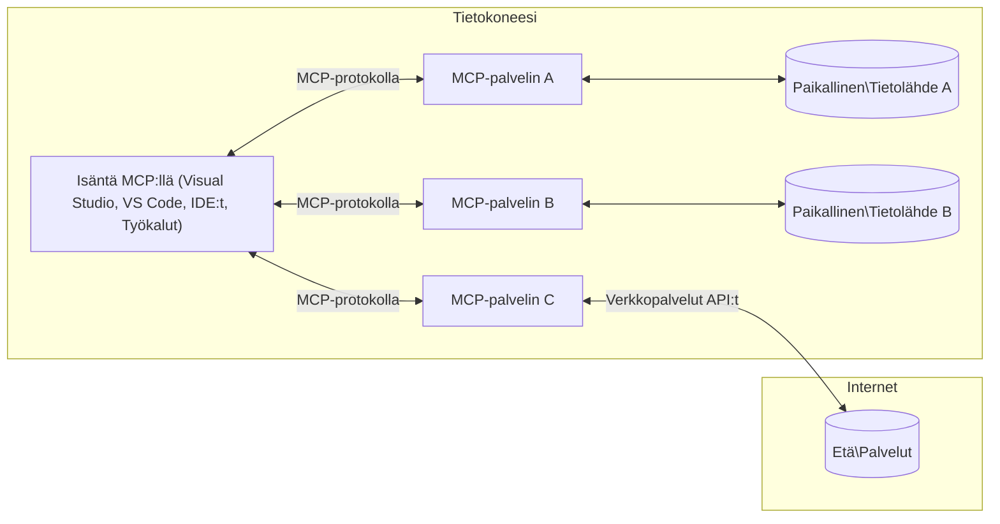

# MCP Core Concepts: Mastering the Model Context Protocol for AI Integration

[](https://youtu.be/earDzWGtE84)

_(Napsauta yllä olevaa kuvaa katsellaksesi tämän oppitunnin videon)_

[Model Context Protocol (MCP)](https://github.com/modelcontextprotocol) on tehokas, standardoitu kehys, joka optimoi viestinnän suurten kielimallien (LLM) sekä ulkoisten työkalujen, sovellusten ja tietolähteiden välillä. 
Tämä opas johdattaa sinut MCP:n ydinkäsitteisiin. Opit sen asiakas-palvelinarkkitehtuurista, keskeisistä komponenteista, viestintämekaniikoista ja toteutuksen parhaista käytännöistä.

- **Selkeä käyttäjän suostumus**: Kaikki datan käyttö ja toiminnot vaativat käyttäjän nimenomaisen hyväksynnän ennen suoritusta. Käyttäjien tulee ymmärtää tarkasti, mitä dataa käytetään ja mitä toimenpiteitä tehdään, tarjoten yksityiskohtainen hallinta oikeuksista ja valtuutuksista.

- **Tietosuojan suojaaminen**: Käyttäjätiedot paljastetaan vain nimenomaisella suostumuksella, ja niitä on suojattava vahvoilla käyttöoikeusvalvonnilla koko vuorovaikutuksen elinkaaren ajan. Toteutusten tulee estää luvaton tiedonsiirto ja ylläpitää tiukkoja tietosuojarajoja.

- **Työkalujen suoritusvarmuus**: Jokainen työkalun kutsu vaatii käyttäjän nimenomaisen suostumuksen, johon liittyy selkeä ymmärrys työkalun toiminnasta, parametreista ja mahdollisista vaikutuksista. Vahvat turvallisuusrajoja estävät tahattoman, epäluotettavan tai haitallisen työkalujen suorituksen.

- **Kuljetuskerroksen turvallisuus**: Kaikkien viestintäkanavien tulee käyttää asianmukaisia salaus- ja todennusmekanismeja. Etäyhteyksissä tulee käyttää suojattuja kuljetusprotokollia ja asianmukaista tunnistetietojen hallintaa.

#### Toteutusohjeet:

- **Oikeuksien hallinta**: Toteuta hienojakoiset oikeusjärjestelmät, jotka sallivat käyttäjien hallita, mitkä palvelimet, työkalut ja resurssit ovat käytettävissä
- **Todennus & valtuutus**: Käytä turvallisia todennusmenetelmiä (OAuth, API-avaimet) asianmukaisella token-hallinnalla ja vanhentumisella  
- **Syötteen validointi**: Varmista kaikkien parametrien ja datasyötteiden oikeellisuus määriteltyjen skeemojen mukaan estääksesi injektiohyökkäykset
- **Tarkastuslokit**: Pidä täydellisiä lokitietoja kaikista toiminnoista turvallisuuden valvontaa ja vaatimustenmukaisuutta varten

## Yleiskatsaus

Tämä oppitunti tutkii Model Context Protocolin (MCP) perustavanlaatuista arkkitehtuuria ja komponentteja. Opit asiakas-palvelinarkkitehtuurista, keskeisistä komponenteista ja viestintämekanismeista, jotka mahdollistavat MCP-vuorovaikutukset.

## Keskeiset oppimistavoitteet

Tämän oppitunnin lopuksi osaat:

- Ymmärtää MCP:n asiakas-palvelinarkkitehtuurin.
- Tunnistaa Hostsien, Clientien ja Serverien roolit ja vastuut.
- Analysoida MCP:n joustavan integraatiokerroksen ydintoiminnot.
- Oppia, miten tieto kulkee MCP-ekosysteemissä.
- Saada käytännön näkemyksiä koodiesimerkkien avulla .NETissä, Javassa, Pythonissa ja JavaScriptissä.

## MCP-arkkitehtuuri: syvällisempi katsaus

MCP-ekosysteemi rakentuu asiakas-palvelinmallin päälle. Tämä modulaarinen rakenne mahdollistaa tekoälysovellusten tehokkaan vuorovaikutuksen työkalujen, tietokantojen, API:en ja kontekstuaalisten resurssien kanssa. Puretaanpa tämä arkkitehtuuri sen ydinkomponenteiksi.

Pohjimmiltaan MCP noudattaa asiakas-palvelinarkkitehtuuria, jossa isäntäohjelma voi yhdistää useisiin palvelimiin:


- **MCP Hosts**: Ohjelmat kuten VSCode, Claude Desktop, IDEt tai tekoälytyökalut, jotka haluavat käyttää dataa MCP:n kautta
- **MCP Clients**: Protokollan asiakkaat, jotka ylläpitävät 1:1-yhteyksiä palvelimiin
- **MCP Servers**: Kevyet ohjelmat, jotka kukin tarjoavat erityisiä toiminnallisuuksia standardoidun Model Context Protocolin kautta
- **Paikalliset tietolähteet**: Tietokoneesi tiedostot, tietokannat ja palvelut, joihin MCP-palvelimet pääsevät turvallisesti käsiksi
- **Etäpalvelut**: Internetin yli saatavilla olevat ulkoiset järjestelmät, joihin MCP-palvelimet voivat yhdistää API:en kautta.

MCP-protokolla on kehittyvä standardi, joka käyttää päivämääräpohjaista versiokoodausta (YYYY-MM-DD-muodossa). Tämänhetkinen protokollaversio on **2025-11-25**. Voit nähdä uusimmat päivitykset [protokollan määrittelyyn](https://modelcontextprotocol.io/specification/2025-11-25/)

### 1. Hosts

Model Context Protocolissa (MCP) **Hosts** ovat tekoälysovelluksia, jotka toimivat ensisijaisena käyttöliittymänä käyttäjien vuorovaikutukselle protokollan kanssa. Hosts koordinoivat ja hallinnoivat useiden MCP-palvelimien yhteyksiä luomalla kullekin palvelinyhteydelle oman MCP-asiakkaan. Esimerkkejä Hostseista ovat:

- **Tekoälysovellukset**: Claude Desktop, Visual Studio Code, Claude Code
- **Kehitysympäristöt**: IDEt ja koodieditorit, joissa on MCP-integraatio  
- **Mukautetut sovellukset**: Tarkoitukseen räätälöidyt tekoälyagentit ja -työkalut

**Hosts** ovat sovelluksia, jotka koordinoivat tekoälymallien vuorovaikutuksia. Ne:

- **Orkestroivat tekoälymalleja**: Suorittavat tai vuorovaikuttavat LLMien kanssa vastauksien luomiseksi ja AI-työnkulkujen koordinoimiseksi
- **Hallinnoivat asiakasyhteyksiä**: Luovat ja ylläpitävät yhden MCP-asiakkaan per MCP-palvelinyhteys
- **Ohjaavat käyttöliittymää**: Käsittelevät keskustelun kulkua, käyttäjän vuorovaikutuksia ja vastausten esittämistä  
- **Valvovat turvallisuutta**: Hallitsevat käyttöoikeuksia, turvallisuusrajoja ja todennusta
- **Käsittelevät käyttäjän suostumuksen**: Hallitsevat käyttäjän hyväksynnän datan jakamiselle ja työkalujen suorittamiselle


### 2. Clients

**Clients** ovat keskeisiä komponentteja, jotka ylläpitävät omistettuja yhden suhteen yhden yhteyksiä Hostsien ja MCP-palvelinten välillä. Jokainen MCP-asiakas luodaan Hostin toimesta yhdistämään tiettyyn MCP-palvelimeen, mikä takaa järjestäytyneet ja turvalliset viestintäkanavat. Useampi asiakas sallii Hostsien yhdistää useisiin palvelimiin samanaikaisesti.

**Clients** ovat liitäntäkomponentteja isäntäohjelmassa. Ne:

- **Viestintä protokollassa**: Lähettävät JSON-RPC 2.0 -pyyntöjä palvelimille kehotteiden ja ohjeiden kanssa
- **Ominaisuuksien neuvottelu**: Neuvottelevat tuetuista ominaisuuksista ja protokollaversioista palvelimien kanssa alustuksessa
- **Työkalujen suoritus**: Hallitsevat työkalujen suorituspyyntöjä malleilta ja käsittelevät vastauksia
- **Reaaliaikaiset päivitykset**: Käsittelevät ilmoituksia ja reaaliaikaisia päivityksiä palvelimilta
- **Vastausten käsittely**: Prosessoivat ja muotoilevat palvelimen vastaukset käyttäjille esitettäväksi

### 3. Servers

**Servers** ovat ohjelmia, jotka tarjoavat kontekstin, työkalut ja toiminnot MCP-asiakkaille. Ne voivat toimia paikallisesti (samalla koneella kuin Host) tai etänä (ulkoisilla alustoilla) ja ovat vastuussa asiakaspyyntöjen käsittelystä ja jäsenneltyjen vastausten tuottamisesta. Palvelimet tarjoavat tiettyjä toiminnallisuuksia standardoidun Model Context Protocolin kautta.

**Servers** ovat palveluita, jotka tarjoavat kontekstia ja toiminnallisuuksia. Ne:

- **Ominaisuuksien rekisteröinti**: Rekisteröivät ja tarjoavat käytettävissä olevat primitiivit (resurssit, kehotteet, työkalut) asiakkaille
- **Pyyntöjen käsittely**: Ottavat vastaan ja suorittavat työkalukutsuja, resurssipyyntöjä ja kehotepyyntöjä asiakkailta
- **Kontekstin tarjoaminen**: Tarjoavat kontekstuaalista tietoa ja dataa parantaakseen mallivastauksia
- **Tilanhallinta**: Ylläpitävät istuntotilaa ja hoitavat tilallisia vuorovaikutuksia tarpeen mukaan
- **Reaaliaikaiset ilmoitukset**: Lähettävät ilmoituksia ominaisuusmuutoksista ja päivityksistä yhdistetyille asiakkaille

Palvelimia voi kehittää kuka tahansa laajentaakseen mallien toiminnallisuutta erikoistuneilla ominaisuuksilla, ja ne tukevat sekä paikallista että etäkäyttöönottoa.

### 4. Server Primitives

Model Context Protocolin (MCP) palvelimet tarjoavat kolme ydintä **primitiiiviä**, jotka määrittelevät perustavanlaatuiset rakennuspalikat monipuoliseen vuorovaikutukseen asiakkaiden, hostsien ja kielimallien välillä. Nämä primitiivit määrittelevät, millaista kontekstuaalista tietoa ja toimintoja protokollan kautta on saatavilla.

MCP-palvelimet voivat tarjota mitä tahansa seuraavista kolmesta ydinalgaisesta primitiivistä:

#### Resources 

**Resurssit** ovat tietolähteitä, jotka tarjoavat kontekstuaalista tietoa tekoälysovelluksille. Ne edustavat staattista tai dynaamista sisältöä, joka voi parantaa mallin ymmärrystä ja päätöksentekoa:

- **Kontekstuaalinen data**: Rakenteellista tietoa ja kontekstia tekoälymallin kulutukseen
- **Tietokannat**: Dokumenttikokoelmat, artikkelit, käsikirjat ja tutkimuspaperit
- **Paikalliset tietolähteet**: Tiedostot, tietokannat ja paikalliset järjestelmätiedot  
- **Ulkoiset tiedot**: API-vastaukset, verkkopalvelut ja etäjärjestelmien data
- **Dynaaminen sisältö**: Reaaliaikaista dataa, joka päivittyy ulkoisten olosuhteiden mukaan

Resurssit tunnistetaan URI:lla ja niitä voidaan löytää `resources/list`-menetelmällä ja hakea `resources/read`-menetelmällä:

```text
file://documents/project-spec.md
database://production/users/schema
api://weather/current
```

#### Prompts

**Kehotteet** ovat uudelleenkäytettäviä malleja, jotka auttavat rakenteistamaan vuorovaikutuksia kielimallien kanssa. Ne tarjoavat standardoituja vuorovaikutusmalleja ja mallipohjaisia työnkulkuja:

- **Mallipohjaiset vuorovaikutukset**: Valmiiksi rakennetut viestit ja keskustelun avaajat
- **Työnkulkujen mallit**: Standardoidut sarjat tavallisille tehtäville ja vuorovaikutuksille
- **Muutama esimerkki**: Esimerkkipohjaiset mallit mallin ohjaukseen
- **Järjestelmäkehoteet**: Perustavat kehotteet, jotka määrittelevät mallin käyttäytymisen ja kontekstin
- **Dynaamiset mallit**: Parametrisoidut kehotteet, jotka mukautuvat erityisiin konteksteihin

Kehotteet tukevat muuttujien korvaamista ja ne voi löytää `prompts/list`-menetelmällä ja hakea `prompts/get`-menetelmällä:

```markdown
Generate a {{task_type}} for {{product}} targeting {{audience}} with the following requirements: {{requirements}}
```

#### Tools

**Työkalut** ovat suoritettavia funktioita, joita tekoälymallit voivat kutsua tiettyjen toimintojen suorittamiseksi. Ne edustavat MCP-ekosysteemin "verbejä", jotka mahdollistavat mallien vuorovaikutuksen ulkoisten järjestelmien kanssa:

- **Suoritettavat toiminnot**: Erottuvat operaatiot, joita mallit voivat kutsua tietyillä parametreilla
- **Ulkoiset järjestelmäintegraatiot**: API-kutsut, tietokantahaut, tiedostotoiminnot, laskelmat
- **Yksilöllinen identiteetti**: Jokaisella työkalulla on selkeä nimi, kuvaus ja parametriskaema
- **Jäsennelty I/O**: Työkalut hyväksyvät validoidut parametrit ja palauttavat rakenteelliset, tyypitetyt vastaukset
- **Toiminnalliset kyvyt**: Mahdollistavat mallien suorittaa todellisen maailman toimia ja hakea reaaliaikaista dataa

Työkalut määritellään JSON Skeeman avulla parametrien validointiin ja ne löytyvät `tools/list`-menetelmällä ja suoritetaan `tools/call`-menetelmällä. Työkalut voivat sisältää myös **ikoneita** lisämetadatana paremman käyttöliittymäesityksen vuoksi.

**Työkalujen annotaatiot**: Työkalut tukevat käyttäytymisselitteitä (esim. `readOnlyHint`, `destructiveHint`), jotka kuvaavat onko työkalu vain-lukuinen tai tuhoava, auttaen asiakkaita tekemään tietoisen päätöksen työkalun suorittamisesta.

Esimerkkityökalun määritelmä:

```typescript
server.tool(
  "search_products", 
  {
    query: z.string().describe("Search query for products"),
    category: z.string().optional().describe("Product category filter"),
    max_results: z.number().default(10).describe("Maximum results to return")
  }, 
  async (params) => {
    // Suorita haku ja palauta jäsennellyt tulokset
    return await productService.search(params);
  }
);
```

## Client Primitives

Model Context Protocolissa (MCP) **asiakkaat** voivat tarjota primitiivejä, jotka mahdollistavat palvelimien pyytää lisäominaisuuksia isäntäohjelmalta. Nämä asiakkaan puolen primitiivit mahdollistavat rikkaampia, vuorovaikutteisempia palvelimen toteutuksia, jotka voivat käyttää tekoälymallien kykyjä ja käyttäjien vuorovaikutuksia.

### Sampling

**Sampling** antaa palvelimille mahdollisuuden pyytää kielimallin täydennyksiä asiakkaan tekoälysovellukselta. Tämä primitiivi mahdollistaa palvelimien käyttää LLM:ien kykyjä ilman, että niiden tarvitsee sisällyttää omia malliriippuvuuksiaan:

- **Mallista riippumaton käyttö**: Palvelimet voivat pyytää täydennyksiä ilman omien LLM-SDK:iden sisällyttämistä tai mallin hallintaa
- **Palvelimien aloittama tekoäly**: Mahdollistaa palvelimien autonomisen sisällön generoinnin asiakkaan mallia käyttäen
- **Rekursiiviset LLM-vuorovaikutukset**: Tukee monimutkaisia tilanteita, joissa palvelimet tarvitsevat tekoälyapua prosessointiin
- **Dynaaminen sisällön luonti**: Mahdollistaa palvelimien luoda kontekstuaalisia vastauksia isännän mallin avulla
- **Työkalukutsujen tuki**: Palvelimet voivat sisällyttää `tools` ja `toolChoice` -parametreja, jotta asiakkaan malli voi kutsua työkaluja näytteenoton aikana

Näytteenotto aloitetaan `sampling/complete`-menetelmällä, jossa palvelimet lähettävät täydennyspyyntöjä asiakkaille.

### Roots

**Roots** tarjoavat standardoidun tavan asiakkaille paljastaa tiedostojärjestelmän rajat palvelimille, auttaen palvelimia ymmärtämään, mihin hakemistoihin ja tiedostoihin niillä on pääsy:

- **Tiedostojärjestelmän rajat**: Määrittelevät, missä rajat palvelimilla on toimia tiedostojärjestelmässä
- **Käyttöoikeuksien hallinta**: Auttaa palvelimia ymmärtämään, mihin hakemistoihin ja tiedostoihin niillä on oikeus päästä
- **Dynaamiset päivitykset**: Asiakkaat voivat ilmoittaa palvelimille, kun roots-lista muuttuu
- **URI-pohjainen tunnistus**: Rootsit tunnistetaan `file://`-URI:lla määrittämään saavutettavat hakemistot ja tiedostot

Roots löydetään `roots/list`-menetelmällä, ja asiakkaat lähettävät `notifications/roots/list_changed`-ilmoituksia, kun rootsit muuttuvat.

### Elicitation  

**Elicitation** mahdollistaa palvelimille pyytää lisätietoja tai vahvistusta käyttäjiltä asiakkaan käyttöliittymän kautta:

- **Käyttäjän syötteen pyynnöt**: Palvelimet voivat pyytää lisätietoja, kun niitä tarvitaan työkalun suorittamiseen
- **Vahvistusikkunat**: Pyydä käyttäjän hyväksyntä arkaluontoisiin tai merkittäviin toimiin
- **Vuorovaikutteiset työnkulut**: Mahdollistaa palvelimille luoda vaiheittaisia käyttäjävuorovaikutuksia
- **Dynaaminen parametrien keruu**: Kokoa puuttuvia tai valinnaisia parametreja työkalun suorittamisen aikana

Elicitation-pyynnöt tehdään `elicitation/request`-menetelmällä käyttäjän syötteen keräämiseksi asiakkaan rajapinnan kautta.

**URL-tilan elicitation**: Palvelimet voivat myös pyytää URL-pohjaisia käyttäjävuorovaikutuksia, jolloin palvelimet voivat ohjata käyttäjät ulkopuolisille verkkosivuille todennusta, vahvistusta tai datan syöttöä varten.

### Logging

**Logging** antaa palvelimille mahdollisuuden lähettää jäsenneltyjä lokiviestejä asiakkaille debuggausta, valvontaa ja operatiivista näkyvyyttä varten:

- **Debuggaustuki**: Mahdollistaa palvelimen tarjota yksityiskohtaisia suorituksen lokeja ongelmanratkaisua varten
- **Operatiivinen valvonta**: Lähettää tilapäivityksiä ja suorituskykymittareita asiakkaille
- **Virheraportointi**: Tarjoaa yksityiskohtaista virhetilan contextia ja diagnostiikkaa
- **Tarkastuspolut**: Luo kattavia lokeja palvelimen toiminnasta ja päätöksistä

Lokiviestit lähetetään asiakkaille tarjoten läpinäkyvyyttä palvelimen toimintaan ja helpottaen debuggausta.

## Informaatio MCP:ssä

Model Context Protocol (MCP) määrittelee rakenteellisen tiedonkulun Hostsien, Clientien, Serverien ja mallien välillä. Tämän tiedonkulun ymmärtäminen selkeyttää, miten käyttäjän pyynnöt käsitellään ja miten ulkoiset työkalut ja data integroidaan mallivastauksiin.
- **Isäntä käynnistää yhteyden**  
  Isäntäohjelma (kuten IDE tai chat-käyttöliittymä) muodostaa yhteyden MCP-palvelimeen, tyypillisesti STDIO:n, WebSocketin tai muun tuetun siirtotavan kautta.

- **Ominaisuuksien neuvottelu**  
  Asiakas (joka on upotettu isäntään) ja palvelin vaihtavat tietoja tukemistaan ominaisuuksista, työkaluista, resursseista ja protokollaversioista. Tämä varmistaa, että molemmat osapuolet ymmärtävät, mitä toimintoja istunnossa on käytettävissä.

- **Käyttäjän pyyntö**  
  Käyttäjä on vuorovaikutuksessa isännän kanssa (esim. antaa kehotteen tai komennon). Isäntä kerää tämän syötteen ja välittää sen asiakkaalle käsiteltäväksi.

- **Resurssin tai työkalun käyttö**  
  - Asiakas saattaa pyytää palvelimelta lisäkontekstia tai resursseja (kuten tiedostoja, tietokanta-alkioita tai tietokannan artikkeleita) mallin ymmärryksen rikastamiseksi.
  - Jos malli päättää, että työkalua tarvitaan (esim. tiedon hakemiseen, laskutoimitukseen tai API-kutsuun), asiakas lähettää palvelimelle työkalukutsupyynnön, jossa määritellään työkalun nimi ja parametrit.

- **Palvelimen suoritus**  
  Palvelin vastaanottaa resurssi- tai työkalupyynnön, suorittaa tarvittavat toiminnot (esim. kutsuu funktiota, kysely tietokantaan tai hakee tiedoston) ja palauttaa tulokset asiakkaalle rakenteellisessa muodossa.

- **Vastauksen luonti**  
  Asiakas yhdistää palvelimen vastaukset (resurssidata, työkalujen tulokset jne.) käynnissä olevaan mallitulokseen. Malli käyttää näitä tietoja luodakseen kattavan ja kontekstuaalisesti relevantin vastauksen.

- **Tuloksen esittäminen**  
  Isäntä vastaanottaa asiakkaalta lopullisen tulosteen ja esittää sen käyttäjälle, sisältäen usein sekä mallin generoiman tekstin että työkalukutsujen tai resurssihakujen tulokset.

Tämä työnkulku mahdollistaa MCP:n tukemaan edistyneitä, interaktiivisia ja kontekstuaalisesti tietoisia tekoälysovelluksia yhdistämällä mallit saumattomasti ulkoisiin työkaluihin ja tietolähteisiin.

## Protokollan arkkitehtuuri ja kerrokset

MCP koostuu kahdesta erillisestä arkkitehtonisesta kerroksesta, jotka toimivat yhdessä tarjoten täydellisen viestintäkehikon:

### Datakerros

**Datakerros** toteuttaa MCP-protokollan ytimen käyttäen pohjanaan **JSON-RPC 2.0**:aa. Tämä kerros määrittelee viestirakenteen, semantiikan ja vuorovaikutuskuviot:

#### Ydinkomponentit:

- **JSON-RPC 2.0 -protokolla**: Kaikki viestintä käyttää standardoitua JSON-RPC 2.0 -viestimuotoa metodikutsuissa, vastauksissa ja ilmoituksissa
- **Elinkaaren hallinta**: Käsittelee yhteyden alustuksen, ominaisuuksien neuvottelun ja istunnon päättämisen asiakkaiden ja palvelimien välillä
- **Palvelimen primitiivit**: Mahdollistaa palvelimille ydintoiminnallisuuden tarjoamisen työkalujen, resurssien ja kehotteiden kautta
- **Asiakkaan primitiivit**: Mahdollistaa palvelimille kielimallin näytteiden pyytämisen, käyttäjäsyötteen keräämisen ja lokiviestien lähettämisen
- **Reaaliaikaiset ilmoitukset**: Tukee asynkronisia ilmoituksia dynaamisia päivityksiä varten ilman kyselyä

#### Keskeiset ominaisuudet:

- **Protokollan version neuvottelu**: Käyttää päivämääräpohjaista versionumeroa (YYYY-MM-DD) yhteensopivuuden varmistamiseksi
- **Ominaisuuksien löytyminen**: Asiakkaat ja palvelimet vaihtavat tietoa tuetuista ominaisuuksista alustuksen aikana
- **Tilalliset istunnot**: Säilyttää yhteystilan useiden vuorovaikutusten ajan kontekstin jatkuvuuden takaamiseksi

### Siirtokerros

**Siirtokerros** hallinnoi viestintäkanavia, viestikehyksiä ja todennusta MCP:n osallistujien välillä:

#### Tuetut siirtomekanismit:

1. **STDIO-siirto**:
   - Käyttää standardisyöte- ja -tulostestreamia suoraan prosessien välisessä viestinnässä
   - Optimaalinen paikallisille prosesseille samalla koneella ilman verkon ylimääräistä kuormitusta
   - Yleisesti käytetty paikallisissa MCP-palvelinvertailutuksissa

2. **Striimattava HTTP-siirto**:
   - Käyttää HTTP POST:ia asiakas-palvelin-viesteihin  
   - Valinnainen Server-Sent Events (SSE) palvelin-asiakas-striimaukseen
   - Mahdollistaa etäpalvelimen kanssa kommunikoinnin verkon yli
   - Tukee standardia HTTP-todennusta (bearer tokenit, API-avaimet, räätälöidyt otsikot)
   - MCP suosittelee OAuthia turvallista token-pohjaista todennusta varten

#### Siirtokerroksen abstraktio:

Siirtokerros abstrahoi viestinnän yksityiskohdat datakerrokselta mahdollistaen saman JSON-RPC 2.0 -viestimuodon käytön kaikissa siirtomekanismeissa. Tämä abstraktio sallii sovellusten vaihtaa saumattomasti paikallisten ja etäpalvelimien välillä.

### Turvallisuusnäkökohdat

MCP-toteutusten on noudatettava useita keskeisiä turvallisuusperiaatteita varmistaakseen turvallisen, luotettavan ja suojatun vuorovaikutuksen kaikissa protokollan toiminnoissa:

- **Käyttäjän suostumus ja hallinta**: Käyttäjän on annettava nimenomainen suostumus ennen minkään datan käyttöä tai toimintojen suorittamista. Käyttäjällä tulee olla selkeä hallinta siitä, mitä tietoja jaetaan ja mitkä toiminnot sallitaan, tuettuna intuitiivisilla käyttöliittymillä toimintojen tarkasteluun ja hyväksymiseen.

- **Datan yksityisyys**: Käyttäjän dataa saa paljastaa vain nimenomaisella suostumuksella, ja sen suojaamiseksi on käytettävä sopivia käyttöoikeuksien valvontamekanismeja. MCP-toteutusten on suojauduttava luvattomalta datansiirrolta ja varmistettava yksityisyyden säilyminen koko vuorovaikutuksen ajan.

- **Työkalujen turvallisuus**: Ennen minkä tahansa työkalun kutsumista tarvitaan käyttäjän selkeä suostumus. Käyttäjällä tulee olla selkeä käsitys kunkin työkalun toiminnallisuudesta, ja vahvat turvallisuusrajat on pakko ylläpitää ei-toivottujen tai turvattomien työkalukäyttöjen estämiseksi.

Noudattamalla näitä turvallisuusperiaatteita MCP takaa käyttäjien luottamuksen, yksityisyyden ja turvallisuuden kaikissa protokollan vuorovaikutuksissa sekä mahdollistaa tehokkaat tekoälyintegraatiot.

## Koodiesimerkit: Keskeiset komponentit

Alla on useissa suosituissa ohjelmointikielissä esimerkkejä, jotka havainnollistavat, miten toteuttaa tärkeitä MCP-palvelinkomponentteja ja työkaluja.

### .NET-esimerkki: Yksinkertaisen MCP-palvelimen luominen työkaluilla

Tässä on käytännön .NET-koodiesimerkki, jossa esitellään yksinkertaisen MCP-palvelimen toteutus omilla työkaluilla. Esimerkki näyttää, miten työkalut määritellään ja rekisteröidään, käsitellään pyyntöjä ja yhdistetään palvelin Model Context Protocoliin.

```csharp
using System;
using System.Threading.Tasks;
using ModelContextProtocol.Server;
using ModelContextProtocol.Server.Transport;
using ModelContextProtocol.Server.Tools;

public class WeatherServer
{
    public static async Task Main(string[] args)
    {
        // Create an MCP server
        var server = new McpServer(
            name: "Weather MCP Server",
            version: "1.0.0"
        );
        
        // Register our custom weather tool
        server.AddTool<string, WeatherData>("weatherTool", 
            description: "Gets current weather for a location",
            execute: async (location) => {
                // Call weather API (simplified)
                var weatherData = await GetWeatherDataAsync(location);
                return weatherData;
            });
        
        // Connect the server using stdio transport
        var transport = new StdioServerTransport();
        await server.ConnectAsync(transport);
        
        Console.WriteLine("Weather MCP Server started");
        
        // Keep the server running until process is terminated
        await Task.Delay(-1);
    }
    
    private static async Task<WeatherData> GetWeatherDataAsync(string location)
    {
        // This would normally call a weather API
        // Simplified for demonstration
        await Task.Delay(100); // Simulate API call
        return new WeatherData { 
            Temperature = 72.5,
            Conditions = "Sunny",
            Location = location
        };
    }
}

public class WeatherData
{
    public double Temperature { get; set; }
    public string Conditions { get; set; }
    public string Location { get; set; }
}
```

### Java-esimerkki: MCP-palvelinkomponentit

Tämä esimerkki näyttää saman MCP-palvelimen ja työkalujen rekisteröinnin kuin edellinen .NET-esimerkki, mutta toteutettuna Javalla.

```java
import io.modelcontextprotocol.server.McpServer;
import io.modelcontextprotocol.server.McpToolDefinition;
import io.modelcontextprotocol.server.transport.StdioServerTransport;
import io.modelcontextprotocol.server.tool.ToolExecutionContext;
import io.modelcontextprotocol.server.tool.ToolResponse;

public class WeatherMcpServer {
    public static void main(String[] args) throws Exception {
        // Luo MCP-palvelin
        McpServer server = McpServer.builder()
            .name("Weather MCP Server")
            .version("1.0.0")
            .build();
            
        // Rekisteröi säätyökalu
        server.registerTool(McpToolDefinition.builder("weatherTool")
            .description("Gets current weather for a location")
            .parameter("location", String.class)
            .execute((ToolExecutionContext ctx) -> {
                String location = ctx.getParameter("location", String.class);
                
                // Hae säädataa (yksinkertaistettu)
                WeatherData data = getWeatherData(location);
                
                // Palauta muotoiltu vastaus
                return ToolResponse.content(
                    String.format("Temperature: %.1f°F, Conditions: %s, Location: %s", 
                    data.getTemperature(), 
                    data.getConditions(), 
                    data.getLocation())
                );
            })
            .build());
        
        // Yhdistä palvelin käyttäen stdio-siirtoa
        try (StdioServerTransport transport = new StdioServerTransport()) {
            server.connect(transport);
            System.out.println("Weather MCP Server started");
            // Pidä palvelin käynnissä prosessin päättymiseen asti
            Thread.currentThread().join();
        }
    }
    
    private static WeatherData getWeatherData(String location) {
        // Toteutus kutsuisi säätiedon rajapintaa
        // Yksinkertaistettu esimerkin vuoksi
        return new WeatherData(72.5, "Sunny", location);
    }
}

class WeatherData {
    private double temperature;
    private String conditions;
    private String location;
    
    public WeatherData(double temperature, String conditions, String location) {
        this.temperature = temperature;
        this.conditions = conditions;
        this.location = location;
    }
    
    public double getTemperature() {
        return temperature;
    }
    
    public String getConditions() {
        return conditions;
    }
    
    public String getLocation() {
        return location;
    }
}
```

### Python-esimerkki: MCP-palvelimen rakentaminen

Tämä esimerkki käyttää fastmcp-kirjastoa, joten asenna se ensin:

```python
pip install fastmcp
```
Koodinäyte:

```python
#!/usr/bin/env python3
import asyncio
from fastmcp import FastMCP
from fastmcp.transports.stdio import serve_stdio

# Luo FastMCP-palvelin
mcp = FastMCP(
    name="Weather MCP Server",
    version="1.0.0"
)

@mcp.tool()
def get_weather(location: str) -> dict:
    """Gets current weather for a location."""
    return {
        "temperature": 72.5,
        "conditions": "Sunny",
        "location": location
    }

# Vaihtoehtoinen lähestymistapa luokan avulla
class WeatherTools:
    @mcp.tool()
    def forecast(self, location: str, days: int = 1) -> dict:
        """Gets weather forecast for a location for the specified number of days."""
        return {
            "location": location,
            "forecast": [
                {"day": i+1, "temperature": 70 + i, "conditions": "Partly Cloudy"}
                for i in range(days)
            ]
        }

# Rekisteröi luokan työkalut
weather_tools = WeatherTools()

# Käynnistä palvelin
if __name__ == "__main__":
    asyncio.run(serve_stdio(mcp))
```

### JavaScript-esimerkki: MCP-palvelimen luominen

Tämä esimerkki näyttää MCP-palvelimen luomisen JavaScriptillä ja kahden säähän liittyvän työkalun rekisteröinnin.

```javascript
// Käytetään virallista Model Context Protocol SDK:ta
import { McpServer } from "@modelcontextprotocol/sdk/server/mcp.js";
import { StdioServerTransport } from "@modelcontextprotocol/sdk/server/stdio.js";
import { z } from "zod"; // Parametrien validointia varten

// Luo MCP-palvelin
const server = new McpServer({
  name: "Weather MCP Server",
  version: "1.0.0"
});

// Määrittele säätiedon työkalu
server.tool(
  "weatherTool",
  {
    location: z.string().describe("The location to get weather for")
  },
  async ({ location }) => {
    // Tämä kutsuisi normaalisti sääkarttapalvelun APIa
    // Yksinkertaistettu demonstraatiota varten
    const weatherData = await getWeatherData(location);
    
    return {
      content: [
        { 
          type: "text", 
          text: `Temperature: ${weatherData.temperature}°F, Conditions: ${weatherData.conditions}, Location: ${weatherData.location}` 
        }
      ]
    };
  }
);

// Määrittele sääennustetyökalu
server.tool(
  "forecastTool",
  {
    location: z.string(),
    days: z.number().default(3).describe("Number of days for forecast")
  },
  async ({ location, days }) => {
    // Tämä kutsuisi normaalisti sääkarttapalvelun APIa
    // Yksinkertaistettu demonstraatiota varten
    const forecast = await getForecastData(location, days);
    
    return {
      content: [
        { 
          type: "text", 
          text: `${days}-day forecast for ${location}: ${JSON.stringify(forecast)}` 
        }
      ]
    };
  }
);

// Apufunktiot
async function getWeatherData(location) {
  // Simuloi API-kutsua
  return {
    temperature: 72.5,
    conditions: "Sunny",
    location: location
  };
}

async function getForecastData(location, days) {
  // Simuloi API-kutsua
  return Array.from({ length: days }, (_, i) => ({
    day: i + 1,
    temperature: 70 + Math.floor(Math.random() * 10),
    conditions: i % 2 === 0 ? "Sunny" : "Partly Cloudy"
  }));
}

// Yhdistä palvelin stdio-siirtoyhteydellä
const transport = new StdioServerTransport();
server.connect(transport).catch(console.error);

console.log("Weather MCP Server started");
```

Tämä JavaScript-esimerkki havainnollistaa, miten luodaan MCP-palvelin Model Context Protocol -SDK:lla. Se näyttää, miten rekisteröidään kaksi työkalua nimeltään `weatherTool` ja `forecastTool` ja tehdään ne saataville MCP-asiakkaille `StdioServerTransport`in kautta.

## Turvallisuus ja valtuutus

MCP sisältää useita sisäänrakennettuja käsitteitä ja mekanismeja turvallisuuden ja valtuutuksen hallintaan protokollan kaikissa vaiheissa:

1. **Työkalujen käyttöoikeuksien hallinta**:  
   Asiakkaat voivat määrittää, mitä työkaluja mallin sallitaan käyttää istunnon aikana. Tämä takaa, että vain nimenomaisesti valtuutetut työkalut ovat käytettävissä, mikä vähentää ei-toivottuja tai turvattomia toimintoja. Käyttöoikeuksia voidaan määrittää dynaamisesti käyttäjäasetusten, organisaatiopolitiikkojen tai vuorovaikutuksen kontekstin perusteella.

2. **Todennus**:  
   Palvelimet voivat vaatia todennusta ennen kuin ne myöntävät pääsyn työkaluihin, resursseihin ja arkaluonteisiin toimintoihin. Tämä voi sisältää API-avaimia, OAuth-tokeneita tai muita todennusmenetelmiä. Asianmukainen todennus varmistaa, että vain luotetut asiakkaat ja käyttäjät voivat kutsua palvelimen toimintoja.

3. **Validointi**:  
   Parametrien validointi on pakollista kaikissa työkalukutsuissa. Jokainen työkalu määrittelee odotetut tyypit, muodot ja rajoitteet parametreilleen, ja palvelin validoi tulevat pyynnöt tämän mukaisesti. Tämä estää vääränlaiset tai haitalliset syötteet saavuttamasta työkalun toteutuksia ja ylläpitää toimintojen eheyttä.

4. **Käyttörajoitukset**:  
   Estääkseen väärinkäytön ja turvatakseen palvelimen resurssien reilun jakamisen MCP-palvelimet voivat toteuttaa käyttörajoituksia työkalukutsuille ja resurssien käytölle. Rajoituksia voidaan soveltaa käyttäjä-, istunto- tai globaalitasolla, ja ne suojaavat palvelinta palvelunestohyökkäyksiltä tai kohtuuttomalta resurssien kulutukselta.

Yhdistämällä nämä mekanismit MCP tarjoaa turvallisen perustan kielimallien integroimiseksi ulkoisten työkalujen ja tietolähteiden kanssa, antaen samalla käyttäjille ja kehittäjille hienojakoisen hallinnan pääsyn ja käytön suhteen.

## Protokollaviestit ja viestinnän työnkulku

MCP-viestintä käyttää rakenteisia **JSON-RPC 2.0** -viestejä selkeiden ja luotettavien vuorovaikutusten mahdollistamiseksi isäntien, asiakkaiden ja palvelimien välillä. Protokolla määrittelee erityisiä viestimalleja eri toimintatyypeille:

### Ydinsanomat:

#### **Alustusviestit**
- **`initialize`-pyyntö**: Muodostaa yhteyden ja neuvottelee protokollaversion ja ominaisuudet
- **`initialize`-vastaus**: Vahvistaa tuetut ominaisuudet ja palvelimen tiedot  
- **`notifications/initialized`**: Ilmentää alustuksen valmistumisen ja istunnon valmiuden

#### **Löytöviestit**
- **`tools/list`-pyyntö**: Palvelimelta saatavilla olevien työkalujen haku
- **`resources/list`-pyyntö**: Saatavilla olevien resurssien (tietolähteiden) listaaminen
- **`prompts/list`-pyyntö**: Saatavilla olevien kehotemallien haku

#### **Suoritusviestit**  
- **`tools/call`-pyyntö**: Suorittaa tietyn työkalun annetuilla parametreilla
- **`resources/read`-pyyntö**: Hakee sisällön tietystä resurssista
- **`prompts/get`-pyyntö**: Hakee kehotemallin valinnaisilla parametreilla

#### **Asiakaspuolen viestit**
- **`sampling/complete`-pyyntö**: Palvelin pyytää LLM:n täydennystä asiakkaalta
- **`elicitation/request`**: Palvelin pyytää käyttäjän syötettä asiakkaan käyttöliittymän kautta
- **Lokiviestit**: Palvelin lähettää rakenteellisia lokiviestejä asiakkaalle

#### **Ilmoitusviestit**
- **`notifications/tools/list_changed`**: Palvelin ilmoittaa asiakkaalle työkalumuutoksista
- **`notifications/resources/list_changed`**: Palvelin ilmoittaa asiakkaalle resurssimuutoksista  
- **`notifications/prompts/list_changed`**: Palvelin ilmoittaa asiakkaalle kehotemuutosista

### Viestin rakenne:

Kaikki MCP-viestit noudattavat JSON-RPC 2.0 -formaattia:
- **Pyyntöviestit**: Sisältävät `id`, `method` ja valinnaiset `params`
- **Vastausviestit**: Sisältävät `id` ja joko `result` tai `error`  
- **Ilmoitusviestit**: Sisältävät `method` ja valinnaiset `params` (ei `id`:tä eikä vastausta odoteta)

Tämä rakenteellinen viestintä takaa luotettavat, jäljitettävät ja laajennettavat vuorovaikutukset, jotka tukevat edistyneitä skenaarioita, kuten reaaliaikaisia päivityksiä, työkaluketjutusta ja vankkaa virheenkäsittelyä.

### Tehtävät (kokeellinen ominaisuus)

**Tehtävät** ovat kokeellinen ominaisuus, joka tarjoaa kestäviä suoritusten kääröjä mahdollistaen tulosten jälkihakemisen ja tilan seurannan MCP-pyyntöihin:

- **Pitkäkestoiset toiminnot**: Seuraa raskaita laskelmia, työnkulkujen automatisointia ja eräajon prosessointia
- **Tulosten lykkääminen**: Mahdollistaa tehtävien tilan kyselyn ja tulosten hakemisen suorituksen valmistuttua
- **Tilan seuranta**: Valvoo tehtävän edistymistä määriteltyjen elinkaaritilojen kautta
- **Monivaiheiset toiminnot**: Tukee monimutkaisia työnkulkuja, jotka kattavat useita vuorovaikutuksia

Tehtävät käärivät tavalliset MCP-pyynnöt mahdollistaen asynkroniset suoritustavat toimintokokeille, jotka eivät voi valmistua välittömästi.

## Tärkeitä opittavia asioita

- **Arkkitehtuuri**: MCP käyttää asiakas-palvelinarkkitehtuuria, jossa isännät hallinnoivat useita asiakasyhteyksiä palvelimiin
- **Osallistujat**: Ekosysteemi sisältää isäntiä (tekoälysovellukset), asiakkaita (protokollan liittimet) ja palvelimia (ominaisuuksien tarjoajat)
- **Siirtomekanismit**: Viestintä tukee STDIO:ta (paikallinen) ja Streamable HTTP:tä valinnaisella SSE:llä (etä)
- **Ydinsovellukset**: Palvelimet tarjoavat työkaluja (suoritettavat funktiot), resursseja (tietolähteet) ja kehotteita (mallit)
- **Asiakasprimitiivit**: Palvelimet voivat pyytää näytteenottoa (LLM-täydennyksiä työkalukutsuilla), elicitaatiota (käyttäjäsyötteitä URL-tilassa), juuria (tiedostojärjestelmän rajat) ja lokitusta asiakkailta
- **Kokeelliset ominaisuudet**: Tehtävät tarjoavat kestäviä suorituksen kääröjä pitkäkestoisille toiminnoille
- **Protokollan perusta**: Rakennettu JSON-RPC 2.0:aan päivämääräpohjaisella versionumerolla (nykyinen: 2025-11-25)
- **Reaaliaikaiset kyvyt**: Tukee ilmoituksia dynaamisille päivityksille ja reaaliaikaiselle synkronoinnille
- **Turvallisuus ensin**: Selkeä käyttäjän suostumus, datan yksityisyyden suojaus ja turvallinen siirto ovat keskeisiä vaatimuksia

## Harjoitus

Suunnittele yksinkertainen MCP-työkalu, joka olisi hyödyllinen omalla alallasi. Määrittele:
1. Mikä työkalun nimi olisi
2. Mitä parametreja se ottaisi
3. Mitä tulostetta se palauttaisi
4. Miten malli voisi käyttää tätä työkalua ratkaistakseen käyttäjän ongelmia


---

## Mitä seuraavaksi

Seuraava: [Luku 2: Turvallisuus](../02-Security/README.md)

---

<!-- CO-OP TRANSLATOR DISCLAIMER START -->
**Vastuuvapauslauseke**:
Tämä asiakirja on käännetty käyttämällä tekoälypohjaista käännöspalvelua [Co-op Translator](https://github.com/Azure/co-op-translator). Vaikka pyrimme tarkkuuteen, otathan huomioon, että automaattikäännöksissä saattaa esiintyä virheitä tai epätarkkuuksia. Alkuperäinen asiakirja sen alkuperäiskielellä on virallinen lähde. Tärkeissä tiedoissa suositellaan ammattimaisen ihmiskääntäjän palveluita. Emme ole vastuussa tämän käännöksen käytöstä aiheutuvista väärinkäsityksistä tai virhetulkinnoista.
<!-- CO-OP TRANSLATOR DISCLAIMER END -->