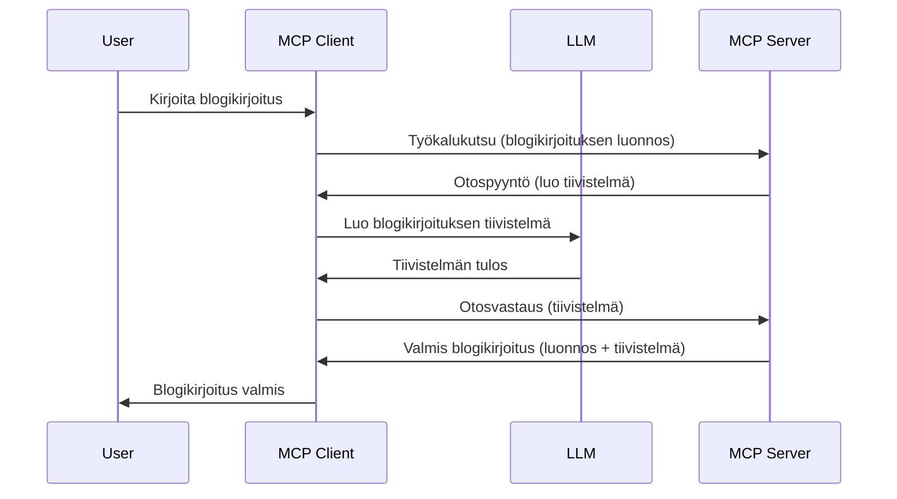

# Näyteotanta – delegoi ominaisuudet asiakkaalle

Joskus MCP Clientin ja MCP Serverin täytyy tehdä yhteistyötä yhteisen tavoitteen saavuttamiseksi. Saatat kohdata tilanteen, jossa Serveri tarvitsee apua asiakkaalla sijaitsevalta LLM:ltä. Tällaisessa tilanteessa näyteotanta on se, mitä sinun tulisi käyttää.

Tutkitaanpa joitakin käyttötapauksia ja kuinka rakentaa ratkaisu, joka sisältää näyteotannan.

## Yleiskatsaus

Tässä oppitunnissa keskitymme selittämään, milloin ja missä näyteotantaa käytetään ja kuinka se konfiguroidaan.

## Oppimistavoitteet

Tässä luvussa:

- Selitämme, mitä näyteotanta on ja milloin sitä käytetään.
- Näytämme, kuinka näyteotanta konfiguroidaan MCP:ssa.
- Annamme esimerkkejä näyteotannasta käytännössä.

## Mikä on näyteotanta ja miksi sitä käyttää?

Näyteotanta on edistynyt ominaisuus, joka toimii seuraavasti:



### Näyteotantapyyntö

Ok, nyt meillä on yleiskuva uskottavasta skenaariosta, puhutaan siitä näyteotantapyynnöstä, jonka serveri lähettää takaisin asiakkaalle. Tässä on esimerkki siitä, miltä tällainen pyyntö voi näyttää JSON-RPC-muodossa:

```json
{
  "jsonrpc": "2.0",
  "id": 1,
  "method": "sampling/createMessage",
  "params": {
    "messages": [
      {
        "role": "user",
        "content": {
          "type": "text",
          "text": "Create a blog post summary of the following blog post: <BLOG POST>"
        }
      }
    ],
    "modelPreferences": {
      "hints": [
        {
          "name": "claude-3-sonnet"
        }
      ],
      "intelligencePriority": 0.8,
      "speedPriority": 0.5
    },
    "systemPrompt": "You are a helpful assistant.",
    "maxTokens": 100
  }
}
```

Tässä on muutama asia, joihin kannattaa kiinnittää huomiota:

- Kehote, content -> text, on meidän kehotteemme, joka on ohje LLM:lle tiivistämään blogikirjoituksen sisältö.

- **modelPreferences**. Tämä osio on nimensä mukaan suositus, ehdotus siitä, mitä asetuksia LLM:lle kannattaa käyttää. Käyttäjä voi päättää, noudattaako näitä suosituksia vai muuttaako niitä. Tässä tapauksessa on suosituksia käytettävästä mallista sekä nopeuden ja älykkyyden priorisoinnista.
- **systemPrompt** on tavallinen järjestelmäkehote, joka antaa LLM:lle persoonallisuuden ja sisältää ohjeistukset.
- **maxTokens** on toinen ominaisuus, joka kertoo, kuinka monta tokenia tälle tehtävälle on suositeltavaa käyttää.

### Näyteotantavastaus

Tämä vastaus on se, jonka MCP Client lopulta lähettää MCP Serverille, ja se on tulos asiakkaan soittaessa LLM:lle, odottaessa vastausta ja koostaen sitten tämän viestin. Tässä on esimerkki JSON-RPC-muodossa:

```json
{
  "jsonrpc": "2.0",
  "id": 1,
  "result": {
    "role": "assistant",
    "content": {
      "type": "text",
      "text": "Here's your abstract <ABSTRACT>"
    },
    "model": "gpt-5",
    "stopReason": "endTurn"
  }
}
```

Huomaa, että vastaus on blogikirjoituksen abstrakti juuri kuten pyysimme. Huomaa myös, että käytetty `model` ei ole se, jota pyysimme, vaan "gpt-5" "claude-3-sonnetin" sijaan. Tämä havainnollistaa, että käyttäjä voi muuttaa mielipidettään käytettävästä mallista ja että näyteotantapyyntö on suositus.

Ok, nyt kun ymmärrämme päävirran ja hyödyllisen tehtävän käyttää sitä varten ”blogikirjoituksen luonnostelu + abstrakti”, katsotaan mitä tarvitsemme saadaksemme tämän toimimaan.

### Viestityypit

Näyteotantaviestit eivät rajoitu vain tekstiin, vaan voit lähettää myös kuvia ja ääntä. Tässä on esimerkki siitä, kuinka JSON-RPC eroaa:

**Teksti**

```json
{
  "type": "text",
  "text": "The message content"
}
```

**Kuvasisältö**

```json
{
  "type": "image",
  "data": "base64-encoded-image-data",
  "mimeType": "image/jpeg"
}
```

**Äänisisältö**

```json
{
  "type": "audio",
  "data": "base64-encoded-audio-data",
  "mimeType": "audio/wav"
}
```

> HUOMAUTUS: saadaksesi yksityiskohtaisempaa tietoa näyteotannasta, tutustu [virallisiin dokumentteihin](https://modelcontextprotocol.io/specification/2025-11-25/client/sampling)

## Kuinka konfiguroida näyteotanta asiakkaalle

> Huom: jos rakennat vain serverin, sinun ei tarvitse tehdä paljoa tässä.

Asiakkaassa sinun tulee määrittää seuraava ominaisuus näin:

```json
{
  "capabilities": {
    "sampling": {}
  }
}
```

Tämä otetaan käyttöön, kun valitsemasi asiakas alustaa yhteyden serveriin.

## Esimerkki näyteotannasta käytännössä – Luo blogikirjoitus

Koodataan yhdessä näyteotantaserveri, meidän tulee tehdä seuraavaa:

1. Luo työkalu Serverille.
2. Työkalun tulee luoda näyteotantapyyntö.
3. Työkalun tulee odottaa asiakkaan vastausta näyteotantapyyntöön.
4. Tämän jälkeen tuotetaan työkalun tulos.

Katsotaan koodi vaihe vaiheelta:

### -1- Luo työkalu

**python**

```python
@mcp.tool()
async def create_blog(title: str, content: str, ctx: Context[ServerSession, None]) -> str:
    """Create a blog post and generate a summary"""

```

### -2- Luo näyteotantapyyntö

Laajenna työkalua seuraavalla koodilla:

**python**

```python
post = BlogPost(
        id=len(posts) + 1,
        title=title,
        content=content,
        abstract=""
    )

prompt = f"Create an abstract of the following blog post: title: {title} and draft: {content} "

result = await ctx.session.create_message(
        messages=[
            SamplingMessage(
                role="user",
                content=TextContent(type="text", text=prompt),
            )
        ],
        max_tokens=100,
)

```

### -3- Odota vastausta ja palauta vastaus

**python**

```python
post.abstract = result.content.text

posts.append(post)

# palauta täydellinen tuote
return json.dumps({
    "id": post.title,
    "abstract": post.abstract
})
```

### -4- Koko koodi

**python**

```python
from starlette.applications import Starlette
from starlette.routing import Mount, Host

from mcp.server.fastmcp import Context, FastMCP

from mcp.server.session import ServerSession
from mcp.types import SamplingMessage, TextContent

import json


from uuid import uuid4
from typing import List
from pydantic import BaseModel


mcp = FastMCP("Blog post generator")

# app = FastAPI()

posts = []

class BlogPost(BaseModel):
    id: int
    title: str
    content: str
    abstract: str

posts: List[BlogPost] = []

@mcp.tool()
async def create_blog(title: str, content: str, ctx: Context[ServerSession, None]) -> str:
    """Create a blog post and generate a summary"""

    post = BlogPost(
        id=len(posts) + 1,
        title=title,
        content=content,
        abstract=""
    )

    prompt = f"Create an abstract of the following blog post: title: {title} and draft: {content} "

    result = await ctx.session.create_message(
        messages=[
            SamplingMessage(
                role="user",
                content=TextContent(type="text", text=prompt),
            )
        ],
        max_tokens=100,
    )

    post.abstract = result.content.text

    posts.append(post)

    # palauttaa koko blogikirjoituksen
    return json.dumps({
        "id": post.title,
        "abstract": post.abstract
    })

if __name__ == "__main__":
    print("Starting server...")
    # mcp.run()
    mcp.run(transport="streamable-http")

# käynnistä sovellus komennolla: python server.py
```

### -5- Testaus Visual Studio Codessa

Testataksesi tätä Visual Studio Codessa, toimi seuraavasti:

1. Käynnistä serveri terminaalissa.
2. Lisää se *mcp.json* -tiedostoon (ja varmista, että se on käynnissä), esim. näin:

   ```json
   "servers": {
      "blog-server": {
        "type": "http",
        "url": "http://localhost:8000/mcp"
      }
   }
   ```

3. Kirjoita kehote:

   ```text
   create a blog post named "Where Python comes from", the content is "Python is actually named after Monty Python Flying Circus"
   ```

4. Salli näyteotanta tapahtua. Ensimmäisellä testikerralla saat lisäikkunan, jonka hyväksyt, sitten näet normaalin ponnahdusikkunan, jossa sinua pyydetään suorittamaan työkalu.

5. Tarkastele tuloksia. Näet tulokset kauniisti renderöityinä GitHub Copilot Chatissa, mutta voit myös tarkastella raakaa JSON-vastausta.

**Bonus**. Visual Studio Coden työkalut tukevat erinomaisesti näyteotantaa. Voit konfiguroida näyteotannan käyttöoikeudet asentamallesi serverille seuraavasti:

1. Mene laajennukset-osioon.
2. Valitse rataskuvake asennetun serverisi kohdalta kohdassa "MCP SERVERS - INSTALLED".
3. Valitse "Configure Model Access". Täällä voit valita, mitä malleja GitHub Copilot saa käyttää näyteotannan yhteydessä. Voit myös nähdä kaikki viimeaikaiset näyteotantapyynnöt valitsemalla "Show Sampling requests".

## Tehtävä

Tässä tehtävässä rakennat hiukan erilaisen näyteotantaintegraation, joka tukee tuotteen kuvauksen generoimista. Tässä on skenaariosi:

**Skenaario**: Verkkokaupan back office -työntekijä tarvitsee apua, tuotteiden kuvauksien luominen vie liikaa aikaa. Sinun tehtäväsi on rakentaa ratkaisu, jossa voit kutsua työkalua "create_product" argumenteilla "title" ja "keywords", ja sen tulisi tuottaa valmis tuote, johon kuuluu "description"-kenttä, jonka täyttää asiakkaan LLM.

VINKKI: käytä aiemmin oppimaasi rakentaaksesi tämä serveri ja sen työkalu näyteotantapyynnöllä.

## Ratkaisu

[Solution](./solution/README.md)

## Tärkeimmät opit

Näyteotanta on tehokas ominaisuus, joka sallii serverin delegoida tehtäviä asiakkaalle, kun se tarvitsee LLM:n apua.

## Mitä seuraavaksi

- [Luku 4 - Käytännön toteutus](../../04-PracticalImplementation/README.md)

---

<!-- CO-OP TRANSLATOR DISCLAIMER START -->
**Vastuuvapauslauseke**:
Tämä asiakirja on käännetty käyttämällä tekoälypohjaista käännöspalvelua [Co-op Translator](https://github.com/Azure/co-op-translator). Vaikka pyrimme tarkkuuteen, otathan huomioon, että automaattiset käännökset saattavat sisältää virheitä tai epätarkkuuksia. Alkuperäinen asiakirja sen alkuperäiskielellä on virallinen lähde. Tärkeissä asioissa suositellaan ammattimaista ihmiskäännöstä. Emme ole vastuussa tämän käännöksen käytöstä aiheutuvista väärinymmärryksistä tai tulkinnoista.
<!-- CO-OP TRANSLATOR DISCLAIMER END -->