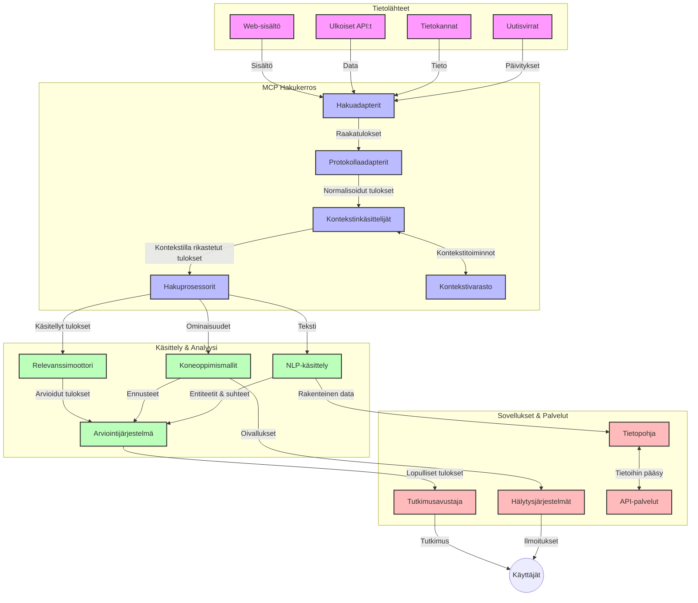
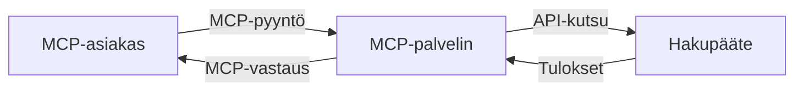
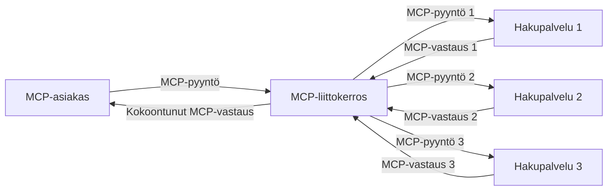
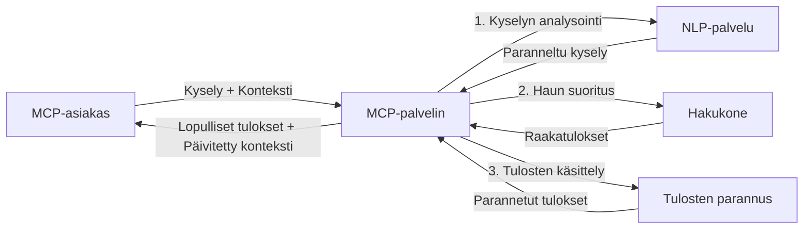

# Mallikontekstiprotokolla reaaliaikaiseen verkkohakuun

## Yleiskatsaus

Reaaliaikainen verkkohaku on nykyisessä tiedonvälitteisessä ympäristössä välttämätöntä, kun sovellusten on saatava välitön pääsy ajan tasalla olevaan tietoon internetissä tarjotakseen olennaisia ja ajankohtaisia vastauksia. Mallikontekstiprotokolla (MCP) edustaa merkittävää edistysaskelta näiden reaaliaikaisten hakuprosessien optimoinnissa, parantaen haun tehokkuutta, säilyttäen kontekstuaalisen eheytensä ja parantaen järjestelmän suorituskykyä kokonaisuudessaan.

Tässä moduulissa tutkitaan, miten MCP muuttaa reaaliaikaista verkkohakua tarjoamalla standardoidun lähestymistavan kontekstinhallintaan tekoälymallien, hakukoneiden ja sovellusten kesken.

### Mitä opit

Tässä kattavassa oppaassa opit:

- Miten MCP luo saumattoman sillan tekoälymallien ja reaaliaikaisten verkkohakutoimintojen välille
- Arkkitehtuurimalleja tehokkaiden ja skaalautuvien hakuratkaisujen toteuttamiseen MCP:llä
- Tekniikoita hakukontekstin säilyttämiseen monen haun ja vuorovaikutusten ajan
- Käytännön kooditoteutuksia Pythonilla ja JavaScriptillä erilaisiin hakutilanteisiin
- Menetelmiä relevanssin, ajankohtaisuuden ja suorituskyvyn tasapainottamiseen MCP-pohjaisissa hakujärjestelmissä

## Johdanto reaaliaikaiseen verkkohakuun

Reaaliaikainen verkkohaku on teknologinen lähestymistapa, joka mahdollistaa jatkuvan hakukyselyjen suorittamisen, käsittelyn ja analysoinnin verkosta saatavasta tiedosta heti, kun sitä julkaistaan tai päivitetään, mahdollistaen järjestelmille tarjota tuoretta ja merkityksellistä tietoa minimaalisen viiveen kanssa. Toisin kuin perinteiset hakujärjestelmät, jotka toimivat indeksoidun datan kanssa, joka voi olla tunteja tai päiviä vanhaa, reaaliaikainen haku käsittelee verkon "live"-dataa ja tarjoaa näkemyksiä sekä tietoa, jotka heijastavat online-sisällön nykytilaa.

### Reaaliaikaisen verkkohakujen keskeiset käsitteet:

- **Jatkuva kyselyiden käsittely**: Hakukyselyt käsitellään jatkuvasti päivittyviä tietolähteitä vasten
- **Ajankohtaisuuden priorisointi**: Järjestelmät on suunniteltu priorisoimaan tuoretta tietoa
- **Relevanssin tasapainottaminen**: Säilyttää tasapaino relevanssin ja ajankohtaisuuden välillä
- **Skaalautuva arkkitehtuuri**: Järjestelmien on käsiteltävä vaihtelevaa kyselykuormaa ja datamääriä
- **Kontekstuaalinen ymmärrys**: Käyttäjän kontekstin ylläpito hakukierrosten välillä on ratkaisevaa merkityksellisten tulosten saamiseksi
- **Dynaaminen kyselyiden uudelleenmuodostus**: Muokataan kyselyitä sopeutuvasti kontekstin ja aiempien tulosten perusteella
- **Monilähteinen integrointi**: Yhdistää tuloksia useilta hakupalveluntarjoajilta ja verkkolähteistä
- **Semanttinen ymmärrys**: Käsittelee kyselyitä ja sisältöä merkityksen eikä pelkkien hakusanojen perusteella
- **Reaaliaikainen järjestäminen**: Säätää jatkuvasti tulosten järjestystä sitä mukaa kun uutta tietoa tulee saataville

### Mallikontekstiprotokolla ja reaaliaikainen verkkohaku

Mallikontekstiprotokolla (MCP) vastaa useisiin kriittisiin haasteisiin reaaliaikaisen verkkohakukontekstissa:

1. **Hakukontekstin säilyttäminen**: MCP standardisoi, miten konteksti säilytetään hajautettujen hakukomponenttien välillä, varmistaen että tekoälymallit ja käsittelysolmut pääsevät käsiksi olennaiseen kyselyhistoriaan ja käyttäjäasetuksiin.

2. **Tehokas kyselyiden hallinta**: Antamalla rakenteelliset mekanismit kontekstin siirtoon, MCP vähentää tarpeettoman kontekstin toistamisen kuormaa jokaisessa hakukierroksessa.

3. **Yhteentoimivuus**: MCP luo yhteisen kielen kontekstin jakamiseen erilaisten hakuteknologioiden ja tekoälymallien välillä, mahdollistaen joustavammat ja laajennettavammat arkkitehtuurit.

4. **Hakuun optimoitu konteksti**: MCP-toteutukset voivat priorisoida ne kontekstielementit, jotka ovat tärkeimpiä tehokkaan haun kannalta, optimoiden suorituskykyä ja tarkkuutta.

5. **Sopeutuva hakuprosessointi**: Oikeanlaisen kontekstinhallinnan avulla MCP:n kautta hakujärjestelmät voivat dynaamisesti mukauttaa prosessointia kehittyvien käyttäjätarpeiden ja tiedonmuutosten perusteella.

Nykyaikaisissa sovelluksissa, kuten uutisten kokoamisessa ja tutkimusavustajissa, MCP:n integrointi verkkohakuteknologioihin mahdollistaa älykkäämmän, kontekstin huomioivan haun, joka tuottaa yhä olennaisempia tuloksia käyttäjävuorovaikutusten jatkuessa.

## Oppimistavoitteet

Oppitunnin lopuksi osaat:

- Ymmärtää reaaliaikaisen verkkohakujen perusteet ja haasteet nykyaikaisissa sovelluksissa
- Selittää, miten Mallikontekstiprotokolla (MCP) parantaa reaaliaikaisen verkkohakujen toiminnallisuuksia
- Toteuttaa MCP-pohjaisia hakuratkaisuja suosituilla kehyksillä ja sovellusrajapinnoilla
- Suunnitella ja ottaa käyttöön skaalautuvia, suorituskykyisiä hakuarkkitehtuureja MCP:llä
- Soveltaa MCP-konsepteja erilaisissa käyttötapauksissa, kuten semanttinen haku, tutkimusapu ja tekoälyllä tehostettu selaaminen
- Arvioida nousevia trendejä ja tulevia innovaatioita MCP-pohjaisissa hakuteknologioissa
- Kehittää kontekstin huomioivia hakujärjestelmiä, jotka oppivat käyttäjävuorovaikutuksista
- Integroida verkkohakutoimintoja tekoälyavustajiin käyttäen standardoituja MCP-protokollia
- Luoda monivaiheisia hakuputkia, jotka asteittain parantavat tuloksia kontekstin perusteella
- Optimoida hakusuorituskykyä samalla kun säilyttää kattava kontekstin hallinta

### Määritelmä ja merkitys

Reaaliaikainen verkkohaku tarkoittaa jatkuvaa kyselyä, haun tulosten hakua ja verkkopohjaisen tiedon toimittamista minimaalisen viiveen kanssa. Toisin kuin perinteiset hakukoneet, jotka säännöllisesti indeksoivat verkkoa, reaaliaikainen haku pyrkii esille tuomaan tietoa heti kun se tulee saataville, mahdollistaen välittömän pääsyn kaikkein ajantasaisimpaan sisältöön.

Reaaliaikaisen verkkohakujen keskeisiä ominaisuuksia ovat:

- **Tuoreus**: Priorisoi viimeisimmät sisällöt ja päivitykset
- **Jatkuva käsittely**: Tarkkailee jatkuvasti uutta tietoa
- **Kyselyiden sopeutuminen**: Hiontaa hakukyselyitä kontekstin ja palautteen perusteella
- **Välitön toimitus**: Toimittaa hakutulokset nopeasti
- **Kontekstin säilyttäminen**: Rakentaa aiempien kyselyiden pohjalta parantaen relevanssia

### Haasteita perinteisessä verkkohakussa

Perinteiset verkkohakumenetelmät kohtaavat runsaasti rajoituksia sovellettaessa reaaliaikaiseen käyttöön:

1. **Kontekstin pirstoutuminen**: Haaste säilyttää hakukonteksti monen kyselyn yli
2. **Tiedon tuoreus**: Vaikeudet saada ja priorisoida kaikkein ajankohtaisin tieto
3. **Integraation monimutkaisuus**: Ongelmia yhteentoimivuudessa hakujärjestelmien ja sovellusten välillä
4. **Viiveongelmat**: Tasapaino laajoihin hakuisiin ja vasteaikavaatimuksiin
5. **Relevanssin hienosäätö**: Tarkkuuden ja relevanssin varmistaminen painottaen ajankohtaisuutta

## Mallikontekstiprotokollan (MCP) ymmärtäminen haussa

### Mikä on MCP hakukonteksteissa?

Mallikontekstiprotokolla (MCP) on standardoitu viestintäprotokolla, joka on suunniteltu helpottamaan tehokasta vuorovaikutusta tekoälymallien ja sovellusten välillä. Reaaliaikaisen verkkohakukontekstissa MCP tarjoaa puitteet:

- Hakukontekstin säilyttämiselle hakukyselyjen sarjassa
- Hakukyselyjen ja tulosten formaattien standardoinnille
- Hakuparametrien ja tulosten siirron optimoinnille
- Malli-hakukone -viestinnän parantamiselle

### Keskeiset komponentit ja arkkitehtuuri

MCP:n arkkitehtuuri reaaliaikaista verkkohakua varten koostuu useista keskeisistä osista:

1. **Kyselykontekstin käsittelijät**: Hallitsevat ja ylläpitävät hakukontekstia useiden kyselyjen välillä
2. **Hakuprosessorit**: Käsittelevät saapuvat hakupyynnöt kontekstia hyödyntäen
3. **Protokollaadapterit**: Muuntavat eri hakupalveluiden rajapinnat säilyttäen kontekstin
4. **Kontekstitietovarasto**: Tallentaa ja hakee tehokkaasti hakuhistorian ja käyttäjäasetukset
5. **Hakulinkit**: Yhdistävät eri hakukoneisiin ja web-rajapintoihin



### Miten MCP parantaa reaaliaikaista verkkohakua

MCP vastaa perinteisen verkkohakujen haasteisiin seuraavasti:

- **Kontekstuaalinen jatkuvuus**: Säilyttää kyselyjen väliset suhteet koko hakusession ajan
- **Optimoitu siirto**: Vähentää tarpeettomuutta hakuparametrien toistossa älykkään kontekstinhallinnan avulla
- **Standardoidut rajapinnat**: Tarjoaa yhtenäiset sovellusrajapinnat hakukomponenteille
- **Vähennetty viive**: Minimoi prosessointikuormaa tehokkaan kontekstinkäsittelyn ansiosta
- **Parannettu relevanssi**: Parantaa haun merkityksellisyyttä säilyttämällä käyttäjän intentiot useiden kyselyjen aikana

## Integrointi ja toteutus

Reaaliaikaisten verkkohakujärjestelmien suunnittelu ja toteutus vaativat huolellista arkkitehtuurin suunnittelua suorituskyvyn ja kontekstuaalisen eheyden säilyttämiseksi. Mallikontekstiprotokolla tarjoaa standardoidun lähestymistavan tekoälymallien ja hakuteknologioiden yhdistämiseen, mahdollistaen kehittyneemmät, kontekstia hyödyntävät hakulinjat.

### MCP:n integrointi hakuarkkitehtuureihin yleiskatsaus

MCP:n käyttöönotto reaaliaikaisessa verkkohakukontekstissa vaatii useiden tärkeiden näkökulmien huomioimista:

1. **Hakukontekstin sarjoittaminen**: MCP tarjoaa tehokkaita mekanismeja kontekstin koodaamiseen hakupyyntöihin, varmistaen että olennainen konteksti kulkee kyselyn mukana prosessointiputkessa. Tämä sisältää standardoidut sarjoitusformaatit, jotka on optimoitu hakuihin liittyvälle metadatalle.

2. **Tilallisesti tietoinen hakuprosessointi**: MCP mahdollistaa älykkäämmän tilapohjaisen prosessoinnin säilyttämällä yhtenäisen kontekstiedustuksen haun eri vaiheissa. Tämä on erityisen arvokasta monivaiheisissa hakuketjuissa, joissa kontekstin hienosäätö parantaa tuloksia.

3. **Kyselyiden laajentaminen ja hienosäätö**: MCP-toteutukset voivat helpottaa kehittynyttä kyselyiden laajentamista ja hienosäätöä kerätyn kontekstin perusteella, mahdollistaen yhä relevantimpia tuloksia hakusession edetessä.

4. **Tulosten välimuisti ja priorisointi**: Standardoimalla kontekstinhallintaa MCP auttaa hallitsemaan tulosten välimuistia ja priorisointia, jolloin komponentit voivat mukautua kehittyvän hakukontekstin mukaan.

5. **Hakufederointi ja koonti**: MCP mahdollistaa kehittyneemmän hakufederoinnin useiden taustajärjestelmien yli tarjoamalla rakenteelliset kontekstin kuvaukset, tukien merkityksellisempää tulosten yhdistämistä monista lähteistä.

MCP:n toteutus erilaisissa hakuteknologioissa luo yhtenäisen lähestymistavan kontekstinhallintaan, vähentäen räätälöityjen integrointikoodien tarvetta ja parantaen järjestelmän kykyä ylläpitää merkityksellistä kontekstia kyselyiden kehittyessä.

### MCP erilaisissa verkkohakutoteutuksissa

Nämä esimerkit noudattavat nykyistä MCP-spesifikaatiota, joka keskittyy JSON-RPC-pohjaiseen protokollaan erillisillä kuljetusmekanismeilla. Koodi demonstroi, miten voit toteuttaa räätälöityjä hakuliitännäisiä säilyttäen täyden yhteensopivuuden MCP-protokollan kanssa.

<details>
<summary>Python-toteutus geneerisellä hakurajapinnalla</summary>

```python
import asyncio
import json
import aiohttp
from typing import Dict, Any, Optional, List
from contextlib import asynccontextmanager
from collections.abc import AsyncIterator

# Tuo standardit MCP-kirjastot
from mcp.client.session import ClientSession
from mcp.client.streamable_http import streamablehttp_client
from mcp.types import TextContent, CreateMessageRequestParams, CreateMessageResult
from mcp.server.fastmcp import FastMCP

# Luo FastMCP-palvelin verkkohakua varten
search_server = FastMCP("WebSearch")

# Luokka verkkohakuoperaatioiden käsittelemiseen
class WebSearchHandler:
    def __init__(self, api_endpoint: str, api_key: str):
        self.api_endpoint = api_endpoint
        self.api_key = api_key
        self.session = None
        
    async def initialize(self):
        """Initialize the HTTP session"""
        self.session = aiohttp.ClientSession(
            headers={"Authorization": f"Bearer {self.api_key}"}
        )
    
    async def close(self):
        """Close the HTTP session"""
        if self.session:
            await self.session.close()
            
    async def perform_search(self, query: str, max_results: int = 5, 
                           include_domains: List[str] = None, 
                           exclude_domains: List[str] = None,
                           time_period: str = "any") -> Dict[str, Any]:
        """Perform web search using the search API"""
        # Rakenna hakukriteerit
        search_params = {
            "q": query,
            "limit": max_results,
            "time": time_period
        }
        
        if include_domains:
            search_params["site"] = ",".join(include_domains)
            
        if exclude_domains:
            search_params["exclude_site"] = ",".join(exclude_domains)
        
        # Suorita hakupyyntö
        try:
            async with self.session.get(
                self.api_endpoint,
                params=search_params
            ) as response:
                if response.status != 200:
                    error_text = await response.text()
                    raise Exception(f"Search API error: {response.status} - {error_text}")
                
                search_data = await response.json()
                
                # Muunna API-spesifinen vastaus standardimuotoon
                results = []
                for item in search_data.get("results", []):
                    results.append({
                        "title": item.get("title", ""),
                        "url": item.get("url", ""),
                        "snippet": item.get("snippet", ""),
                        "date": item.get("published_date", ""),
                        "source": item.get("source", "")
                    })
                
                return {
                    "query": query,
                    "totalResults": len(results),
                    "results": results
                }
        except Exception as e:
            print(f"Search API request error: {e}")
            raise

# Alusta hakukäsittelijä
search_handler = WebSearchHandler(
    api_endpoint="https://api.search-service.example/search",
    api_key="your-api-key-here"
)

# Määritä elinkaari hakukäsittelijän hallitsemiseksi
@asyncio.asynccontextmanager
async def app_lifespan(server: FastMCP):
    """Manage application lifecycle"""
    await search_handler.initialize()
    try:
        yield {"search_handler": search_handler}
    finally:
        await search_handler.close()

# Aseta elinkaari palvelimelle
search_server = FastMCP("WebSearch", lifespan=app_lifespan)

# Rekisteröi verkkohakutyökalu
@search_server.tool()
async def web_search(query: str, max_results: int = 5, 
                   include_domains: List[str] = None,
                   exclude_domains: List[str] = None,
                   time_period: str = "any") -> Dict[str, Any]:
    """
    Search the web for information
    
    Args:
        query: The search query
        max_results: Maximum number of results to return (default: 5)
        include_domains: List of domains to include in search results
        exclude_domains: List of domains to exclude from search results
        time_period: Time period for results ("day", "week", "month", "any")
        
    Returns:
        Dictionary containing search results
    """
    ctx = search_server.get_context()
    search_handler = ctx.request_context.lifespan_context["search_handler"]
    
    results = await search_handler.perform_search(
        query=query,
        max_results=max_results,
        include_domains=include_domains,
        exclude_domains=exclude_domains,
        time_period=time_period
    )
    
    return results

# Esimerkkiasiakkaan käyttö
async def client_example():
    # Yhdistä hakupalvelimeen käyttäen Streamable HTTP -siirtoa
    async with streamablehttp_client("http://localhost:8000/mcp") as (read, write, _):
        async with ClientSession(read, write) as session:
            # Alusta yhteys
            await session.initialize()
            
            # Kutsu web_search-työkalua
            search_results = await session.call_tool(
                "web_search", 
                {
                    "query": "latest developments in AI and Model Context Protocol",
                    "max_results": 5,
                    "time_period": "day",
                    "include_domains": ["github.com", "microsoft.com"]
                }
            )
            
            print(f"Search results: {search_results}")

# Palvelimen ajon esimerkki
if __name__ == "__main__":
    # Aja palvelin Streamable HTTP -siirrolla
    search_server.run(transport="streamable-http")
```
</details> 

<details>
<summary>JavaScript-toteutus selaimessa tapahtuvaan hakuun</summary>

```javascript
// MCP-palvelimen toteutus verkkohakua varten
import { McpServer, ResourceTemplate } from '@modelcontextprotocol/sdk/server/mcp.js';
import { StreamableHTTPServerTransport } from '@modelcontextprotocol/sdk/server/streamableHttp.js';
import { z } from 'zod';

// Luo MCP-palvelin verkkohakua varten
const searchServer = new McpServer({
    name: "BrowserSearch",
    description: "A server that provides web search capabilities"
});

// Hakupalveluluokka
class SearchService {
    constructor(searchApiUrl, apiKey) {
        this.searchApiUrl = searchApiUrl;
        this.apiKey = apiKey;
    }

    async performSearch(parameters) {
        const {
            query = '',
            maxResults = 5,
            includeDomains = [],
            excludeDomains = [],
            timePeriod = 'any'
        } = parameters;
        
        // Rakenna hakulinkki parametrien kanssa
        const url = new URL(this.searchApiUrl);
        url.searchParams.append('q', query);
        url.searchParams.append('limit', maxResults);
        url.searchParams.append('time', timePeriod);
        
        if (includeDomains.length > 0) {
            url.searchParams.append('site', includeDomains.join(','));
        }
        
        if (excludeDomains.length > 0) {
            url.searchParams.append('exclude_site', excludeDomains.join(','));
        }
        
        try {
            const response = await fetch(url.toString(), {
                method: 'GET',
                headers: {
                    'Authorization': `Bearer ${this.apiKey}`,
                    'Content-Type': 'application/json'
                }
            });
            
            if (!response.ok) {
                const errorText = await response.text();
                throw new Error(`Search API error: ${response.status} - ${errorText}`);
            }
            
            const searchData = await response.json();
            
            // Muunna API-spesifinen vastaus standardimuotoon
            const results = searchData.results?.map(item => ({
                title: item.title || '',
                url: item.url || '',
                snippet: item.snippet || '',
                date: item.published_date || '',
                source: item.source || ''
            })) || [];
            
            return {
                query,
                totalResults: results.length,
                results
            };
        } catch (error) {
            console.error('Search API request error:', error);
            throw error;
        }
    }
}

// Alusta hakupalvelu
const searchService = new SearchService(
    'https://api.search-service.example/search',
    'your-api-key-here'
);

// Määritä kontekstin tarjoaja palvelimelle
searchServer.setContextProvider(() => {
    return {
        searchService
    };
});

// Rekisteröi verkkohakutyökalu
searchServer.tool({
    name: 'web_search',
    description: 'Search the web for information',
    parameters: {
        type: 'object',
        properties: {
            query: {
                type: 'string',
                description: 'The search query'
            },
            maxResults: {
                type: 'integer',
                description: 'Maximum number of results to return',
                default: 5
            },
            includeDomains: {
                type: 'array',
                items: { type: 'string' },
                description: 'List of domains to include in search results'
            },
            excludeDomains: {
                type: 'array',
                items: { type: 'string' },
                description: 'List of domains to exclude from search results'
            },
            timePeriod: {
                type: 'string',
                description: 'Time period for results',
                enum: ['day', 'week', 'month', 'any'],
                default: 'any'
            }
        },
        required: ['query']
    },
    handler: async (params, context) => {
        const { searchService } = context;
        return await searchService.performSearch(params);
    }
});

// Esimerkkiasiakasohjelma yhdistymiseen hakupalvelimeen
import { Client } from '@modelcontextprotocol/sdk/client/index.js';
import { StreamableHTTPClientTransport } from '@modelcontextprotocol/sdk/client/streamableHttp.js';

async function connectToSearchServer() {
    // Yhdistä hakupalvelimeen
    const transport = new StreamableHTTPClientTransport(
        new URL('http://localhost:8000/mcp')
    );
    
    const client = new Client({
        name: 'search-client',
        version: '1.0.0'
    });
    
    await client.connect(transport);
    
    // Suorita hakutyökalu
    const searchResults = await client.callTool({
        name: 'web_search',
        arguments: {
            query: 'Model Context Protocol implementation examples',
            maxResults: 10,
            timePeriod: 'week',
            includeDomains: ['github.com', 'docs.microsoft.com']
        }
    });
    
    console.log('Search results:', searchResults);
    
    // Siivoa
    await client.disconnect();
}

// Käynnistä palvelin
const transport = new StreamableHTTPServerTransport();
await searchServer.connect(transport);
console.log('Search server running at http://localhost:8000/mcp');

// Erottuva prosessi tai palvelimen käynnistämisen jälkeen
// connectToSearchServer().catch(console.error);
```
</details> 

## Koodiesimerkkien vastuuvapauslauseke

> **Tärkeä huomio**: Alla olevat koodiesimerkit demonstroivat Mallikontekstiprotokollan (MCP) integrointia verkkohakutoimintoihin. Vaikka ne seuraavat virallisten MCP SDK:iden malleja ja rakenteita, ne on yksinkertaistettu opetustarkoituksiin.
> 
> Nämä esimerkit sisältävät:
> 
> 1. **Python-toteutuksen**: FastMCP-palvelimen toteutuksen, joka tarjoaa verkkohakutyökalun ja yhdistää ulkoiseen hakupalvelun API:in. Tämä esimerkki demonstroi oikean elinkaaren hallinnan, kontekstinkäsittelyn ja työkalun toteuttamisen noudattaen [virallisen MCP Python SDK:n](https://github.com/modelcontextprotocol/python-sdk) malleja. Palvelin käyttää suositeltua Streamable HTTP -kuljetusmekanismia, joka on korvannut vanhemman SSE-kuljetusmenetelmän tuotantokäytössä.
> 
> 2. **JavaScript-toteutuksen**: TypeScript/JavaScript-toteutuksen FastMCP-kuvion avulla [virallisen MCP TypeScript SDK:n](https://github.com/modelcontextprotocol/typescript-sdk) pohjalta, luoden hakupalvelimen asianmukaisine työkalumäärittelyineen ja asiakasyhteyksineen. Toteutus noudattaa uusimpia suositeltuja malleja istunnon hallintaan ja kontekstin säilyttämiseen.
> 
> Näissä esimerkeissä tarvitaan tuotantokäyttöön lisää virheenkäsittelyä, autentikointia ja yksityiskohtaista API-integraatiokoodia. Näytetyt hakupalvelun rajapintapisteet (`https://api.search-service.example/search`) ovat paikkamerkkejä ja ne tulee korvata todellisilla hakupalvelun osoitteilla.
> 
> Tarkkoja toteutustietoja ja ajantasaisia lähestymistapoja löydät [virallisesta MCP-spesifikaatiosta](https://spec.modelcontextprotocol.io/) ja SDK-dokumentaatiosta.

## Keskeiset käsitteet

### Mallikontekstiprotokolla (MCP) -kehys

Mallikontekstiprotokolla tarjoaa pohjimmiltaan standardoidun tavan vaihtaa kontekstia tekoälymallien, sovellusten ja palveluiden kesken. Reaaliaikaisessa verkkohakukontekstissa tämä kehyksen avulla luodaan johdonmukaisia, monikierroksisia hakukokemuksia. Keskeiset osat ovat:

1. **Asiakaspalvelinarkkitehtuuri**: MCP asettaa selkeän eron hakukyselyjen tilaajien (asiakkaiden) ja palveluntarjoajien (palvelimien) välille mahdollistaen joustavat käyttöönotto- ja toiminnallisuusmallit.

2. **JSON-RPC-viestintä**: Protokolla käyttää JSON-RPC:tä viestien vaihdossa, tehden siitä yhteensopivan web-teknologioiden kanssa ja helposti toteutettavan eri alustoilla.

3. **Kontekstinhallinta**: MCP määrittelee rakenteelliset menetelmät hakukontekstin ylläpitämiseen, päivittämiseen ja hyödyntämiseen monissa vuorovaikutuksissa.

4. **Työkalumäärittelyt**: Hakutoiminnot on esitetty standardoituna työkaluna, joilla on selkeästi määritellyt parametrit ja palautusarvot.

5. **Streamaus-tuki**: Protokolla tukee tulosten suoratoistoa, olennainen ominaisuus reaaliaikaisessa haussa, jossa tulokset voivat saapua asteittain.

### Verkkohakujen integraatiomallit

Kun MCP integroidaan verkkohakuihin, esiin nousee useita malleja:

#### 1. Suora hakupalveluntarjoajien integraatio



Tässä mallissa MCP-palvelin kommunikoi suoraan yhden tai useamman hakupalvelun rajapinnan kanssa, muuntaen MCP-pyynnöt palvelukohtaisiksi kutsuiksi ja muotoillen tulokset MCP-vastauksiksi.

#### 2. Hajautettu haku kontekstin säilyttämisellä



Tässä mallissa hakukyselyt jaetaan useille MCP-yhteensopiville hakupalveluntarjoajille, joista jokainen voi erikoistua eri sisältöihin tai hakutoimintoihin, säilyttäen kuitenkaan yhtenäisen kontekstin.

#### 3. Kontekstia rikastava hakuketju



Tässä mallissa hakuprosessi on jaettu useisiin vaiheisiin, joissa kontekstia rikastetaan jokaisessa vaiheessa, tuloksena asteittain relevantimmat hakutulokset.

### Hakukontekstin komponentit

MCP-pohjaisessa verkkohakussa kontekstiin kuuluu tyypillisesti:

- **Kyselyhistoria**: Aiempien hakukyselyjen tiedot sessiossa
- **Käyttäjäasetukset**: Kieli, alue, turvallinen haku -asetukset
- **Vuorovaikutushistoria**: Klikatut tulokset, tulosten parissa vietetty aika
- **Hakuparametrit**: Suodattimet, lajittelujärjestykset ja muut hakumuokkaimet
- **Alueellinen tieto**: Hakua koskeva aihekohtainen konteksti
- **Aikakonsepti**: Aikaan perustuvat relevanssitekijät
- **Lähteen asetukset**: Luotetut tai suosituimmat tietolähteet

## Käyttötapaukset ja sovellukset

### Tutkimus ja tiedonkeruu

MCP tehostaa tutkimustyöskentelyä:

- Säilyttää tutkimuskontekstin useiden hakusessioiden aikana
- Mahdollistaa kehittyneemmät ja kontekstuaalisesti merkitykselliset kyselyt
- Tukee monilähteistä hakufederointia
- Helpottaa tiedon poimintaa hakutuloksista

### Reaaliaikainen uutis- ja trendinseuranta

MCP-pohjainen haku tarjoaa etuja uutisseurannassa:

- Läheltä reaaliaikaista tuoreiden uutisten löytämistä
- Kontekstuaalista suodatusta merkitykselliselle tiedolle
- Aiheiden ja entiteettien seurantaa useilta lähteiltä
- Personoituja uutisvahteja käyttäjän kontekstin mukaan

### Tekoälyn tukema selaaminen ja tutkimus

MCP luo uusia mahdollisuuksia tekoälyllä rikastettuun selaamiseen:

- Kontekstuaalisia hakuehdotuksia selaimen nykyisen toiminnan perusteella
- Verkkohakujen sujuva integrointi suurikielimallien (LLM) avustajiin
- Monivuoroinen hakujen hienosäätö kontekstin säilyttämisen avulla
- Parannettu faktantarkastus ja tiedon varmennus

## Tulevat trendit ja innovaatiot

### MCP:n kehitys verkkohakujen saralla

Tulevaisuudessa odotamme MCP:n kehittyvän vastaamaan:
- **Monimodaalinen haku**: Teksti-, kuva-, ääni- ja videohaku konteksti säilytettynä
- **Hajautettu haku**: Tuetut hajautetut ja liittoutuneet hakuekosysteemit
- **Haun tietosuoja**: Kontekstitietoiset tietosuojaratkaisut haussa
- **Kyselyn ymmärtäminen**: Luonnollisen kielen hakukyselyiden syvä semanttinen jäsentäminen

### Mahdolliset teknologiset edistysaskeleet

Nousevat teknologiat, jotka muokkaavat MCP-haun tulevaisuutta:

1. **Neuraaliset hakurakenteet**: Upotuksiin perustuvat MCP-optimroidut hakujärjestelmät
2. **Henkilökohtainen hakukonteksti**: Käyttäjien hakutottumusten oppiminen ajan kuluessa
3. **Tietografien integrointi**: Toimialakohtaiset tietografit parantavat kontekstuaalista hakua
4. **Ristimodaalinen konteksti**: Kontekstin ylläpito eri hakumodaaliteettien välillä

## Käytännön harjoitukset

### Harjoitus 1: Perus MCP-haun putken perustaminen

Tässä harjoituksessa opit:
- Määrittämään perus MCP-haun ympäristön
- Toteuttamaan kontekstikäsittelijöitä verkkohakua varten
- Testaamaan ja varmistamaan kontekstin säilymistä hakukierrosten välillä

### Harjoitus 2: Tutkimusavustajan luominen MCP-haulla

Luo täydellinen sovellus, joka:
- Käsittelee luonnollisen kielen tutkimuskysymyksiä
- Tekee kontekstitietoisia verkkohakuja
- Yhdistää tietoa useista lähteistä
- Esittää järjestetyt tutkimustulokset

### Harjoitus 3: Monilähteisen hakufederaation toteuttaminen MCP:llä

Edistynyt harjoitus, joka kattaa:
- Kontekstitietoisen kyselyjen lähetyksen useille hakumoottoreille
- Tulosten lajittelun ja yhdistämisen
- Kontekstuaalisen hakutulosten päällekkäisyyden poistamisen
- Lähtekohtaisen metadatan käsittelyn

## Lisäresurssit

- [Model Context Protocol Specification](https://spec.modelcontextprotocol.io/) - Virallinen MCP-määrittely ja yksityiskohtainen protokolladokumentaatio
- [Model Context Protocol Documentation](https://modelcontextprotocol.io/) - Yksityiskohtaiset tutoriaalit ja toteutusoppaat
- [MCP Python SDK](https://github.com/modelcontextprotocol/python-sdk) - Virallinen MCP-protokollan Python-toteutus
- [MCP TypeScript SDK](https://github.com/modelcontextprotocol/typescript-sdk) - Virallinen MCP-protokollan TypeScript-toteutus
- [MCP Reference Servers](https://github.com/modelcontextprotocol/servers) - MCP-palvelinten referenssitoteutukset
- [Bing Web Search API Documentation](https://learn.microsoft.com/en-us/bing/search-apis/bing-web-search/overview) - Microsoftin verkkohaku API
- [Google Custom Search JSON API](https://developers.google.com/custom-search/v1/overview) - Googlen ohjelmoitava hakukone
- [SerpAPI Documentation](https://serpapi.com/search-api) - Hakukoneen tulossivujen API
- [Meilisearch Documentation](https://www.meilisearch.com/docs) - Avoimen lähdekoodin hakukone
- [Elasticsearch Documentation](https://www.elastic.co/guide/index.html) - Hajautettu haku- ja analytiikkamoottori
- [LangChain Documentation](https://python.langchain.com/docs/get_started/introduction) - Sovellusten rakentaminen LLM:illä

## Oppimistavoitteet

Suorittamalla tämän moduulin pystyt:

- Ymmärtämään reaaliaikaisen verkkohakujen perusteet ja haasteet
- Selittämään, miten Model Context Protocol (MCP) parantaa reaaliaikaisia verkkohakuja
- Toteuttamaan MCP-pohjaisia hakuratkaisuja suosituilla kehyksillä ja API:lla
- Suunnittelemaan ja käyttöönotamaan skaalautuvia, suorituskykyisiä hakurakenteita MCP:llä
- Soveltamaan MCP-käsitteitä erilaisiin käyttötapauksiin, mukaan lukien semanttinen haku, tutkimusavustaja ja tekoälyllä tehostettu selaaminen
- Arvioimaan nousevia trendejä ja tulevaisuuden innovaatioita MCP-pohjaisissa hakuteknologioissa

### Luotettavuus- ja turvallisuusnäkökohtia

Kun toteutat MCP-pohjaisia verkkohakuratkaisuja, muista nämä MCP-määrittelyn tärkeät periaatteet:

1. **Käyttäjän suostumus ja kontrolli**: Käyttäjien tulee antaa nimenomainen suostumus ja ymmärtää kaikki tietojen käyttö ja toiminnot. Tämä on erityisen tärkeää verkkohakutoteutuksissa, jotka saattavat käyttää ulkoisia tietolähteitä.

2. **Tietosuoja**: Varmista hakukyselyjen ja -tulosten asianmukainen käsittely, erityisesti kun ne saattavat sisältää arkaluonteista tietoa. Toteuta asianmukaiset pääsynvalvonnat käyttäjätietojen suojaamiseksi.

3. **Työkalujen turvallisuus**: Toteuta asianmukainen valtuutus ja validointi hakutyökaluille, koska ne voivat sisältää turvallisuusriskejä satunnaisen koodin suorittamisen kautta. Työkalujen toiminnan kuvaukset tulee pitää epäluotettavina, ellei ne ole peräisin luotettavalta palvelimelta.

4. **Selkeä dokumentaatio**: Tarjoa selkeät ohjeet MCP-pohjaisen haun kyvykkyyksistä, rajoituksista ja turvallisuusnäkökohtista MCP-määrittelyn toteutusohjeiden mukaisesti.

5. **Vankat suostumusprosessit**: Kehitä vankat suostumus- ja valtuutusprosessit, jotka selkeästi kertovat, mitä kukin työkalu tekee ennen sen käyttöönottoa, erityisesti työkaluille, jotka käyttävät ulkoisia verkkoresursseja.

Lisätietoa MCP:n turvallisuus- ja luotettavuusnäkökohdista löydät [virallisesta dokumentaatiosta](https://modelcontextprotocol.io/specification/2025-11-25/basic/security_best_practices).

## Mitä seuraavaksi

- [5.12 Entra ID -todennus Model Context Protocol -palvelimille](../mcp-security-entra/README.md)

---

<!-- CO-OP TRANSLATOR DISCLAIMER START -->
**Vastuuvapauslauseke**:
Tämä asiakirja on käännetty käyttämällä tekoälypohjaista käännöspalvelua [Co-op Translator](https://github.com/Azure/co-op-translator). Vaikka pyrimme tarkkuuteen, otathan huomioon, että automaattiset käännökset saattavat sisältää virheitä tai epätarkkuuksia. Alkuperäinen asiakirja sen alkuperäiskielellä on virallinen lähde. Tärkeissä asioissa suositellaan ammattimaista ihmiskäännöstä. Emme ole vastuussa tämän käännöksen käytöstä aiheutuvista väärinymmärryksistä tai tulkinnoista.
<!-- CO-OP TRANSLATOR DISCLAIMER END -->