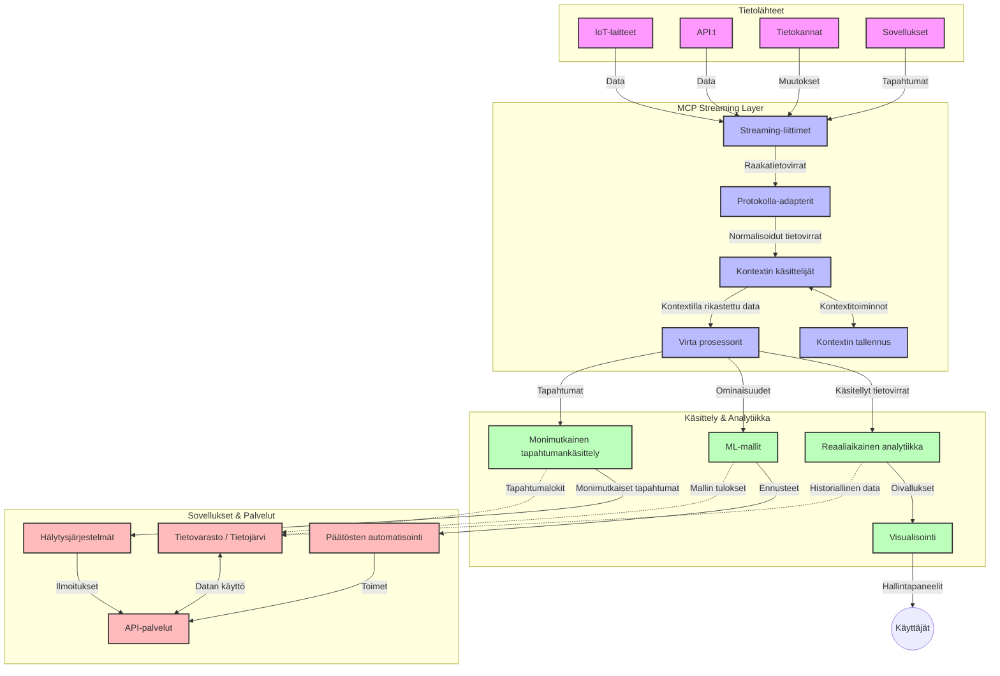

# Mallin kontekstiprotokolla reaaliaikaiseen datavirtaukseen

## Yleiskatsaus

Reaaliaikainen datavirtaus on nykypäivän datavetoisessa maailmassa välttämätöntä, kun yritykset ja sovellukset tarvitsevat välitöntä pääsyä tietoihin tehdäkseen oikea-aikaisia päätöksiä. Mallin kontekstiprotokolla (MCP) edustaa merkittävää edistysaskelta näiden reaaliaikaisten virtaprosessien optimoinnissa, parantaen datankäsittelyn tehokkuutta, säilyttäen kontekstuaalisen eheys ja parantaen koko järjestelmän suorituskykyä.

Tässä moduulissa tarkastellaan, kuinka MCP muuttaa reaaliaikaista datavirtausta tarjoamalla standardoidun lähestymistavan kontekstinhallintaan AI-mallien, suoratoistoalustojen ja sovellusten välillä.

## Johdanto reaaliaikaiseen datavirtaamiseen

Reaaliaikainen datavirtaus on teknologinen paradigma, joka mahdollistaa datan jatkuvan siirron, käsittelyn ja analysoinnin sitä synnytettäessä, antaen järjestelmien reagoida heti uuteen tietoon. Toisin kuin perinteinen eräajoprosessointi, joka toimii staattisilla datasetillä, suoratoisto käsittelee liikkuvaa dataa, tarjoten oivalluksia ja toimintoja minimaalisen viiveen kanssa.

### Reaaliaikaisen datavirtaamisen ydinkäsitteet:

- **Jatkuva datavirta**: Dataa käsitellään jatkuvana, loputtomana tapahtuma- tai tietuevirrana.
- **Pieni viive**: Järjestelmät on suunniteltu minimoimaan aika datan synnyn ja käsittelyn välillä.
- **Skaalautuvuus**: Suoratoistoarkkitehtuurien tulee käsitellä vaihtelevaa datan määrää ja nopeutta.
- **Vikasietoisuus**: Järjestelmien on oltava kestäviä virheitä vastaan varmistaakseen katkeamattoman datavirran.
- **Tilallinen käsittely**: Kontekstin ylläpito tapahtumien välillä on tärkeää merkityksellisen analyysin kannalta.

### Mallin kontekstiprotokolla ja reaaliaikainen suoratoisto

Mallin kontekstiprotokolla (MCP) ottaa käsittelyyn useita keskeisiä haasteita reaaliaikaisten suoravirtaympäristöjen osalta:

1. **Kontekstuaalinen jatkuvuus**: MCP standardisoi kuinka konteksti säilytetään hajautettujen suoratoistokomponenttien välillä, varmistaen että AI-malleilla ja käsittelysolmuilla on käytössään oleellista historiallista ja ympäristökontekstia.

2. **Tehokas tilanhallinta**: Tarjoamalla rakenteellisia mekanismeja kontekstin siirtoon MCP vähentää tilanhallinnan ylikuormitusta suoratoistoputkissa.

3. **Yhteentoimivuus**: MCP luo yhteisen kielen kontekstin jakamiseen eri suoratoistoteknologioiden ja AI-mallien välillä mahdollistaen joustavampia ja laajennettavampia arkkitehtuureja.

4. **Suoratoistoon optimoitu konteksti**: MCP-toteutukset voivat priorisoida, mitkä kontekstielementit ovat merkityksellisintä reaaliaikaista päätöksentekoa varten optimoiden sekä suorituskykyä että tarkkuutta.

5. **Soveltuva käsittely**: Asianmukaisen kontekstinhallinnan avulla MCP:n kautta suoratoistojärjestelmät voivat dynaamisesti mukauttaa käsittelyä datassa esiintyvien muuttuvien olosuhteiden ja mallien perusteella.

Nykyisissä sovelluksissa IoT-antureiden verkoista finanssikauppapaikkoihin MCP:n ja suoratoistoteknologioiden integrointi mahdollistaa älykkäämpää, kontekstitietoista käsittelyä, joka kykenee reagoimaan monimutkaisiin ja muuttuvaan tilanteisiin reaaliajassa.

## Oppimistavoitteet

Tämän oppitunnin lopuksi pystyt:

- Ymmärtämään reaaliaikaisen datavirtaamisen perusteet ja haasteet
- Selittämään, miten Mallin kontekstiprotokolla (MCP) parantaa reaaliaikaista datavirtausta
- Toteuttamaan MCP-pohjaisia suoratoistoratkaisuja suosituilla kehyksillä kuten Kafka ja Pulsar
- Suunnittelemaan ja ottamaan käyttöön vikasietoisia, korkeasuorituskykyisiä suoratoistoarkkitehtuureja MCP:llä
- Soveltamaan MCP-konsepteja IoT:n, finanssikaupan ja AI-pohjaisten analytiikoiden käyttötapauksiin
- Arvioimaan MCP-pohjaisen suoratoistoteknologian nousevia trendejä ja tulevia innovaatioita


### Määritelmä ja merkitys

Reaaliaikainen datavirtaus tarkoittaa datan jatkuvaa synnytystä, käsittelyä ja siirtoa minimaalisen viiveen kanssa. Toisin kuin eräajoprosessointi, jossa data kerätään ja käsitellään ryhmissä, suoratoistodata käsitellään asteittain sitä saapuessaan mahdollistaen välittömät oivallukset ja toimet.

Reaaliaikaisen datavirtaamisen keskeiset ominaisuudet:

- **Pieni viive**: Datan käsittely ja analyysi millisekunneissa sekunteihin
- **Jatkuva virtaus**: Katkeamattomat datavirrat eri lähteistä
- **Välitön käsittely**: Analysointi datan saapuessa, ei erissä
- **Tapahtumapohjainen arkkitehtuuri**: Reagoiminen tapahtumiin niiden tapahtuessa

### Haasteita perinteisessä datavirtaamisessa

Perinteiset suoratoistolähestymistavat kohtaavat useita rajoitteita:

1. **Kontekstin menetys**: Vaikeus ylläpitää kontekstia hajautettujen järjestelmien välillä
2. **Skaalautuvuusongelmat**: Haasteet suuren datavolyymin ja nopeuden käsittelyssä
3. **Integroinnin monimutkaisuus**: Ongelmia eri järjestelmien yhteentoimivuudessa
4. **Viiveen hallinta**: Läpäisyn ja käsittelyajan tasapainottaminen
5. **Datan yhdenmukaisuus**: Datan oikeellisuuden ja täydellisyyden varmistaminen suoratoistossa

## Mallin kontekstiprotokollan (MCP) ymmärtäminen

### Mikä on MCP?

Mallin kontekstiprotokolla (MCP) on standardoitu kommunikointiprotokolla, joka on suunniteltu tehostamaan vuorovaikutusta AI-mallien ja sovellusten välillä. Reaaliaikaisen datavirtaamisen kontekstissa MCP tarjoaa kehyksen:

- Säilyttää konteksti dataputken läpi
- Standardoida datan vaihtomuodot
- Optimoida suurten datasetien siirtoa
- Parantaa malli-malli- ja malli-sovellus -kommunikaatiota

### Keskeiset komponentit ja arkkitehtuuri

MCP-arkkitehtuuri reaaliaikaisessa suoratoistossa koostuu useista avainkomponenteista:

1. **Kontekstit käsittelijät**: Hallitsevat ja ylläpitävät kontekstuaalista tietoa suoratoistoputkessa
2. **Suoratoistoprosessorit**: Käsittelevät saapuvaa datavirtaa kontekstitietoisilla menetelmillä
3. **Protokolla-adapterit**: Muuntavat eri suoratoistoprotokollien välillä säilyttäen kontekstin
4. **Kontekstivarasto**: Tallentaa ja hakee tehokkaasti kontekstuaalista tietoa
5. **Suoratoistoyhdistäjät**: Yhdistävät eri suoratoistoalustoihin (Kafka, Pulsar, Kinesis jne.)



### Kuinka MCP parantaa reaaliaikaista datankäsittelyä

MCP ratkaisee perinteisiä suoratoiston haasteita seuraavasti:

- **Kontekstuaalinen eheys**: Säilyttää suhteet datapisteiden välillä koko putken ajan
- **Optimoitu siirto**: Vähentää datan vaihtoon liittyvää päällekkäisyyttä älykkään kontekstinhallinnan avulla
- **Standardoidut rajapinnat**: Tarjoaa yhtenäiset API-pisteet suoratoistokomponenteille
- **Vähemmän viivettä**: Minimoidut käsittelykustannukset tehokkaalla kontekstin käsittelyllä
- **Parannettu skaalautuvuus**: Tukee vaakasuuntaista laajentamista kontekstin säilyttäen

## Integrointi ja toteutus

Reaaliaikaisten datavirtausten järjestelmät vaativat huolellisen arkkitehtuurisuunnittelun ja toteutuksen suorituskyvyn ja kontekstuaalisen eheyden ylläpitämiseksi. Mallin kontekstiprotokolla tarjoaa standardoidun lähestymistavan AI-mallien ja suoratoistoteknologioiden integrointiin, mahdollistaen monimutkaisempia, kontekstitietoisia prosessointiputkia.

### MCP:n integroinnin yleiskatsaus suoratoistoarkkitehtuureissa

MCP:n toteutus reaaliaikaisissa suoratoistoympäristöissä sisältää useita avaintekijöitä:

1. **Kontekstin sarjallistaminen ja kuljetus**: MCP tarjoaa tehokkaita mekanismeja koodata kontekstuaalinen tieto suoratoistodatapaketeissa varmistaen olennaisen kontekstin kulkevan datan mukana prosessointiputken läpi. Tämä sisältää suoratoistoon optimoidut standardoidut sarjallistamisformaatit.

2. **Tilallinen suoratoistoprosessointi**: MCP mahdollistaa älykkäämmän tilallisen prosessoinnin ylläpitämällä yhdenmukaista kontekstin esitystä käsittelysolmujen välillä. Tämä on erityisen arvokasta hajautetuissa suoratoistoarkkitehtuureissa, joissa tilanhallinta on perinteisesti haastavaa.

3. **Tapahtuma-aika vs. käsittelyaika**: MCP-toteutusten tulee käsitellä yleistä haastetta, erottaa milloin tapahtumat tapahtuivat ja milloin ne prosessoidaan. Protokolla voi sisältää aikakontekstia, joka säilyttää tapahtuma-ajan semantiikan.

4. **Takaiskuvauhdin hallinta**: Standardoimalla kontekstinhallintaa MCP auttaa hallitsemaan suoratoistojärjestelmien takaiskuvauhtia, mahdollistaen komponenttien viestiä käsittelykyvystään ja säätää virtausta sen mukaisesti.

5. **Kontekstin ajallinen ja aggregaattinen ikkunoitus**: MCP mahdollistaa monipuolisemmat ikkunoitustoiminnot tarjoamalla rakenteelliset esitykset ajallisista ja suhteellisista kontekteista, mahdollistaen merkityksellisemmän aggregoinnin tapahtumavirtojen välillä.

6. **Täsmälleen-kerran käsittely**: Suoratoistojärjestelmissä, jotka vaativat täsmälleen-kerran semantiikkaa, MCP voi sisältää käsittelymeta-tietoa auttaakseen seuraamaan ja varmistamaan käsittelyn tilan hajautetuissa komponenteissa.

MCP:n toteuttaminen eri suoratoistoteknologioissa luo yhtenäisen lähestymistavan kontekstinhallintaan, vähentäen räätälöidyn integraatiokoodin tarvetta samalla kun parantaa järjestelmän kykyä säilyttää merkityksellinen konteksti datan kulkiessa putken läpi.

### MCP erilaisissa datavirtauskohteissa

Nämä esimerkit seuraavat nykyistä MCP-spesifikaatiota, joka perustuu JSON-RPC -protokollaan, jossa on erilliset siirtomekanismit. Koodi näyttää, kuinka voit toteuttaa mukautettuja siirtoja, jotka integroivat suoratoistoalustoja kuten Kafka ja Pulsar säilyttäen täydellisen yhteensopivuuden MCP-protokollan kanssa.

Esimerkit on suunniteltu näyttämään, kuinka suoratoistoalustat voidaan integroida MCP:n kanssa tarjoamaan reaaliaikaista datankäsittelyä samalla kun säilytetään MCP:n keskeinen kontekstitietoisuus. Tämä lähestymistapa varmistaa, että koodinäytteet heijastavat tarkasti MCP-spesifikaation nykytilaa kesäkuussa 2025.

MCP voidaan integroida suosittuihin suoratoistokehyksiin, mukaan lukien:

#### Apache Kafka -integrointi

```python
import asyncio
import json
from typing import Dict, Any, Optional
from confluent_kafka import Consumer, Producer, KafkaError
from mcp.client import Client, ClientCapabilities
from mcp.core.message import JsonRpcMessage
from mcp.core.transports import Transport

# Räätälöity siirtoluokka MCP:n ja Kafkan yhdistämiseen
class KafkaMCPTransport(Transport):
    def __init__(self, bootstrap_servers: str, input_topic: str, output_topic: str):
        self.bootstrap_servers = bootstrap_servers
        self.input_topic = input_topic
        self.output_topic = output_topic
        self.producer = Producer({'bootstrap.servers': bootstrap_servers})
        self.consumer = Consumer({
            'bootstrap.servers': bootstrap_servers,
            'group.id': 'mcp-client-group',
            'auto.offset.reset': 'earliest'
        })
        self.message_queue = asyncio.Queue()
        self.running = False
        self.consumer_task = None
        
    async def connect(self):
        """Connect to Kafka and start consuming messages"""
        self.consumer.subscribe([self.input_topic])
        self.running = True
        self.consumer_task = asyncio.create_task(self._consume_messages())
        return self
        
    async def _consume_messages(self):
        """Background task to consume messages from Kafka and queue them for processing"""
        while self.running:
            try:
                msg = self.consumer.poll(1.0)
                if msg is None:
                    await asyncio.sleep(0.1)
                    continue
                
                if msg.error():
                    if msg.error().code() == KafkaError._PARTITION_EOF:
                        continue
                    print(f"Consumer error: {msg.error()}")
                    continue
                
                # Jäsennä viestin arvo JSON-RPC:ksi
                try:
                    message_str = msg.value().decode('utf-8')
                    message_data = json.loads(message_str)
                    mcp_message = JsonRpcMessage.from_dict(message_data)
                    await self.message_queue.put(mcp_message)
                except Exception as e:
                    print(f"Error parsing message: {e}")
            except Exception as e:
                print(f"Error in consumer loop: {e}")
                await asyncio.sleep(1)
    
    async def read(self) -> Optional[JsonRpcMessage]:
        """Read the next message from the queue"""
        try:
            message = await self.message_queue.get()
            return message
        except Exception as e:
            print(f"Error reading message: {e}")
            return None
    
    async def write(self, message: JsonRpcMessage) -> None:
        """Write a message to the Kafka output topic"""
        try:
            message_json = json.dumps(message.to_dict())
            self.producer.produce(
                self.output_topic,
                message_json.encode('utf-8'),
                callback=self._delivery_report
            )
            self.producer.poll(0)  # Käynnistä takaisinkutsut
        except Exception as e:
            print(f"Error writing message: {e}")
    
    def _delivery_report(self, err, msg):
        """Kafka producer delivery callback"""
        if err is not None:
            print(f'Message delivery failed: {err}')
        else:
            print(f'Message delivered to {msg.topic()} [{msg.partition()}]')
    
    async def close(self) -> None:
        """Close the transport"""
        self.running = False
        if self.consumer_task:
            self.consumer_task.cancel()
            try:
                await self.consumer_task
            except asyncio.CancelledError:
                pass
        self.consumer.close()
        self.producer.flush()

# Esimerkki Kafka MCP -siirron käytöstä
async def kafka_mcp_example():
    # Luo MCP-asiakas Kafka-siirrolla
    client = Client(
        {"name": "kafka-mcp-client", "version": "1.0.0"},
        ClientCapabilities({})
    )
    
    # Luo ja yhdistä Kafka-siirto
    transport = KafkaMCPTransport(
        bootstrap_servers="localhost:9092",
        input_topic="mcp-responses",
        output_topic="mcp-requests"
    )
    
    await client.connect(transport)
    
    try:
        # Alusta MCP-istunto
        await client.initialize()
        
        # Esimerkki työkalun suorittamisesta MCP:n kautta
        response = await client.execute_tool(
            "process_data",
            {
                "data": "sample data",
                "metadata": {
                    "source": "sensor-1",
                    "timestamp": "2025-06-12T10:30:00Z"
                }
            }
        )
        
        print(f"Tool execution response: {response}")
        
        # Siisti sulkeminen
        await client.shutdown()
    finally:
        await transport.close()

# Suorita esimerkki
if __name__ == "__main__":
    asyncio.run(kafka_mcp_example())
```

#### Apache Pulsar -toteutus

```python
import asyncio
import json
import pulsar
from typing import Dict, Any, Optional
from mcp.core.message import JsonRpcMessage
from mcp.core.transports import Transport
from mcp.server import Server, ServerOptions
from mcp.server.tools import Tool, ToolExecutionContext, ToolMetadata

# Luo mukautettu MCP-siirto, joka käyttää Pulsaria
class PulsarMCPTransport(Transport):
    def __init__(self, service_url: str, request_topic: str, response_topic: str):
        self.service_url = service_url
        self.request_topic = request_topic
        self.response_topic = response_topic
        self.client = pulsar.Client(service_url)
        self.producer = self.client.create_producer(response_topic)
        self.consumer = self.client.subscribe(
            request_topic,
            "mcp-server-subscription",
            consumer_type=pulsar.ConsumerType.Shared
        )
        self.message_queue = asyncio.Queue()
        self.running = False
        self.consumer_task = None
    
    async def connect(self):
        """Connect to Pulsar and start consuming messages"""
        self.running = True
        self.consumer_task = asyncio.create_task(self._consume_messages())
        return self
    
    async def _consume_messages(self):
        """Background task to consume messages from Pulsar and queue them for processing"""
        while self.running:
            try:
                # Estämätön vastaanotto aikakatkaisulla
                msg = self.consumer.receive(timeout_millis=500)
                
                # Käsittele viesti
                try:
                    message_str = msg.data().decode('utf-8')
                    message_data = json.loads(message_str)
                    mcp_message = JsonRpcMessage.from_dict(message_data)
                    await self.message_queue.put(mcp_message)
                    
                    # Vahvista viesti
                    self.consumer.acknowledge(msg)
                except Exception as e:
                    print(f"Error processing message: {e}")
                    # Negatiivinen vahvistus, jos tapahtui virhe
                    self.consumer.negative_acknowledge(msg)
            except Exception as e:
                # Käsittele aikakatkaisu tai muut poikkeukset
                await asyncio.sleep(0.1)
    
    async def read(self) -> Optional[JsonRpcMessage]:
        """Read the next message from the queue"""
        try:
            message = await self.message_queue.get()
            return message
        except Exception as e:
            print(f"Error reading message: {e}")
            return None
    
    async def write(self, message: JsonRpcMessage) -> None:
        """Write a message to the Pulsar output topic"""
        try:
            message_json = json.dumps(message.to_dict())
            self.producer.send(message_json.encode('utf-8'))
        except Exception as e:
            print(f"Error writing message: {e}")
    
    async def close(self) -> None:
        """Close the transport"""
        self.running = False
        if self.consumer_task:
            self.consumer_task.cancel()
            try:
                await self.consumer_task
            except asyncio.CancelledError:
                pass
        self.consumer.close()
        self.producer.close()
        self.client.close()

# Määrittele esimerkkityökalu MCP:lle, joka käsittelee suoratoistotietoja
@Tool(
    name="process_streaming_data",
    description="Process streaming data with context preservation",
    metadata=ToolMetadata(
        required_capabilities=["streaming"]
    )
)
async def process_streaming_data(
    ctx: ToolExecutionContext,
    data: str,
    source: str,
    priority: str = "medium"
) -> Dict[str, Any]:
    """
    Process streaming data while preserving context
    
    Args:
        ctx: Tool execution context
        data: The data to process
        source: The source of the data
        priority: Priority level (low, medium, high)
        
    Returns:
        Dict containing processed results and context information
    """
    # Esimerkkikäsittely, joka hyödyntää MCP-kontekstia
    print(f"Processing data from {source} with priority {priority}")
    
    # Pääsy keskustelukontekstiin MCP:ssä
    conversation_id = ctx.conversation_id if hasattr(ctx, 'conversation_id') else "unknown"
    
    # Palauta tulokset parannetulla kontekstilla
    return {
        "processed_data": f"Processed: {data}",
        "context": {
            "conversation_id": conversation_id,
            "source": source,
            "priority": priority,
            "processing_timestamp": ctx.get_current_time_iso()
        }
    }

# Esimerkki MCP-palvelimen toteutuksesta, joka käyttää Pulsar-siirtoa
async def run_mcp_server_with_pulsar():
    # Luo MCP-palvelin
    server = Server(
        {"name": "pulsar-mcp-server", "version": "1.0.0"},
        ServerOptions(
            capabilities={"streaming": True}
        )
    )
    
    # Rekisteröi työkalumme
    server.register_tool(process_streaming_data)
    
    # Luo ja yhdistä Pulsar-siirto
    transport = PulsarMCPTransport(
        service_url="pulsar://localhost:6650",
        request_topic="mcp-requests",
        response_topic="mcp-responses"
    )
    
    try:
        # Käynnistä palvelin Pulsar-siirrolla
        await server.run(transport)
    finally:
        await transport.close()

# Suorita palvelin
if __name__ == "__main__":
    asyncio.run(run_mcp_server_with_pulsar())
```

### Parhaat käytännöt käyttöönotossa

Kun toteutat MCP:tä reaaliaikaiseen suoratoistoon:

1. **Suunnittele vikasietoiseksi**:
   - Toteuta asianmukainen virheenkäsittely
   - Käytä dead-letter queueja virheellisille viesteille
   - Suunnittele idempotentit prosessorit

2. **Optimoi suorituskyky**:
   - Määritä sopivat puskurikoot
   - Käytä erään käsittelyä tarvittaessa
   - Ota käyttöön takaiskuvahtimekanismeja

3. **Valvo ja havainnoi**:
   - Seuraa suoratoiston käsittelymittareita
   - Monitoroi kontekstin etenemistä
   - Aseta hälytykset epätavallisista tilanteista

4. **Varmista suoratoistosi turvallisuus**:
   - Toteuta salausta arkaluontoiselle datalle
   - Käytä autentikointia ja valtuutusta
   - Sovella asianmukaisia käyttöoikeusrajoituksia


### MCP IoT:ssa ja reunalaskennassa

MCP parantaa IoT-suoratoistoa:

- Säilyttämällä laitteen kontekstin käsittelyputken läpi
- Mahdollistamalla tehokkaan reunalta pilveen -datavirran
- Tukemalla reaaliaikaista analytiikkaa IoT-datavirroissa
- Mahdollistamalla laite-laite -kommunikaation kontekstin kera

Esimerkki: Älykaupungin anturiverkot
```
Sensors → Edge Gateways → MCP Stream Processors → Real-time Analytics → Automated Responses
```

### Rooli rahoitustransaktioissa ja korkean taajuuden kaupankäynnissä

MCP tarjoaa merkittäviä etuja rahoitusdatan suoratoistoon:

- Erittäin pieni viive kaupankäyntipäätöksissä
- Transaktioiden kontekstin ylläpito koko käsittelyn ajan
- Monimutkaisen tapahtumankäsittelyn tuki kontekstitietoisuudella
- Datan yhdenmukaisuuden varmistaminen hajautetuissa kaupankäyntijärjestelmissä

### AI-ohjatun data-analytiikan tehostaminen

MCP luo uusia mahdollisuuksia suoratoistoanalytiikkaan:

- Reaaliaikainen mallin koulutus ja päättely
- Jatkuva oppiminen suoratoistodatasta
- Kontekstitietoinen piirteiden poiminta
- Monimalliset päättelyputket kontekstin säilyttämisellä

## Tulevaisuuden trendit ja innovaatiot

### MCP:n kehitys reaaliaikaympäristöissä

Tulevaisuutta katsoen odotamme MCP:n kehittyvän seuraaviin asioihin:

- **Kvanttilaskennan integrointi**: Valmistautuminen kvanttipohjaisiin suoratoistojärjestelmiin
- **Reunalähtöinen käsittely**: Enemmän kontekstitietoista käsittelyä reunalaitteissa
- **Autonominen suoratoiston hallinta**: Itseoptimoituvat suoratoistoputket
- **Yhteistoiminnallinen suoratoisto**: Hajautettu käsittely yksityisyys säilyttäen

### Mahdolliset teknologian edistysaskeleet

Nousevat teknologiat, jotka muokkaavat MCP:n suoratoiston tulevaisuutta:

1. **AI-optimoidut suoratoistoprotokollat**: Räätälöidyt protokollat erityisesti AI-kuormituksille
2. **Neuromorfisen laskennan integrointi**: Aivoista inspiroitunut laskenta suoratoistojenkäsittelyyn
3. **Palvelimeton suoratoisto**: Tapahtumapohjainen, skaalautuva suoratoisto ilman infrastruktuurin hallintaa
4. **Hajautetut kontekstivarastot**: Globaalisti hajautettu mutta erittäin yhdenmukainen kontekstinhallinta

## Käytännön harjoitukset

### Harjoitus 1: Perus MCP-suoratoistoputken pystytys

Tässä harjoituksessa opit:
- Määrittämään perustason MCP-suoratoistoympäristön
- Toteuttamaan kontekstit käsittelijät suoratoistokäsittelyssä
- Testaamaan ja validoimaan kontekstin säilymisen

### Harjoitus 2: Reaaliaikaisen analytiikkapaneelin rakentaminen

Luo kokonainen sovellus, joka:
- Ottaa vastaan suoratoistodataa MCP:n avulla
- Käsittelee virtaa konteksti säilyttäen
- Visualisoi tulokset reaaliajassa

### Harjoitus 3: Monimutkaisen tapahtumankäsittelyn toteutus MCP:llä

Edistynyt harjoitus käsittää:
- Mallien tunnistamisen virroissa
- Kontekstuaalisen korrelaation monien virtojen välillä
- Monimutkaisten tapahtumien generoinnin säilyttäen konteksti

## Lisäresurssit

- [Model Context Protocol Specification](https://modelcontextprotocol.io) - Virallinen MCP-spesifikaatio ja dokumentaatio
- [Apache Kafka Documentation](https://kafka.apache.org/documentation/) - Opiskele Kafkaa suoratoiston käsittelyyn
- [Apache Pulsar](https://pulsar.apache.org/) - Yhtenäinen viestintä- ja suoratoistoalusta
- [Streaming Systems: The What, Where, When, and How of Large-Scale Data Processing](https://www.oreilly.com/library/view/streaming-systems/9781491983867/) - Kattava kirja suoratoistoarkkitehtuureista
- [Microsoft Azure Event Hubs](https://learn.microsoft.com/azure/event-hubs/event-hubs-about) - Hallittu tapahtumasuoratoistopalvelu
- [MLflow Documentation](https://mlflow.org/docs/latest/index.html) - Koneoppimismallien seuranta ja käyttöönotto
- [Real-Time Analytics with Apache Storm](https://storm.apache.org/releases/current/index.html) - Reaaliaikaisen laskennan kehys
- [Flink ML](https://nightlies.apache.org/flink/flink-ml-docs-master/) - Koneoppimiskirjasto Apache Flinkille
- [LangChain Documentation](https://python.langchain.com/docs/get_started/introduction) - Sovellusten rakentaminen LLM:illä


## Oppimisen tulokset

Tämän moduulin suorittamalla osaat:

- Ymmärtää reaaliaikaisen datavirtaamisen perusteet ja haasteet
- Selittää, miten Mallin kontekstiprotokolla (MCP) parantaa reaaliaikaista datavirtausta
- Toteuttaa MCP-pohjaisia suoratoistoratkaisuja suosituilla kehyksillä kuten Kafka ja Pulsar
- Suunnitella ja ottaa käyttöön vikasietoisia, korkeasuorituskykyisiä suoratoistoarkkitehtuureja MCP:llä
- Soveltaa MCP-konsepteja IoT:n, finanssikaupan ja AI-pohjaisten analytiikoiden käyttötapauksiin
- Arvioida MCP-pohjaisen suoratoistoteknologian nousevia trendejä ja tulevia innovaatioita

## Mitä seuraavaksi

- [5.11 Reaaliaikahaku](../mcp-realtimesearch/README.md)

---

<!-- CO-OP TRANSLATOR DISCLAIMER START -->
**Vastuuvapauslauseke**:
Tämä asiakirja on käännetty käyttämällä tekoälypohjaista käännöspalvelua [Co-op Translator](https://github.com/Azure/co-op-translator). Vaikka pyrimme tarkkuuteen, otathan huomioon, että automaattiset käännökset saattavat sisältää virheitä tai epätarkkuuksia. Alkuperäinen asiakirja sen alkuperäiskielellä on virallinen lähde. Tärkeissä asioissa suositellaan ammattimaista ihmiskäännöstä. Emme ole vastuussa tämän käännöksen käytöstä aiheutuvista väärinymmärryksistä tai tulkinnoista.
<!-- CO-OP TRANSLATOR DISCLAIMER END -->