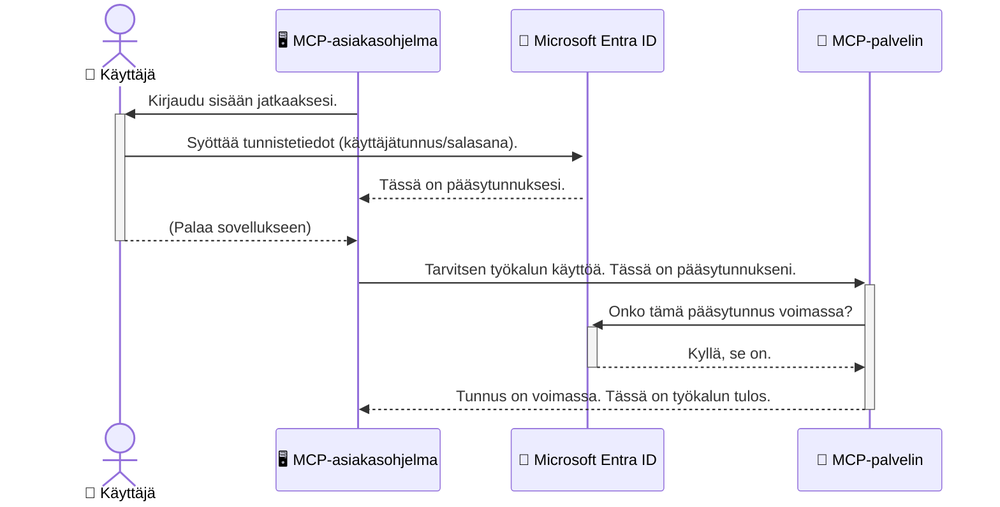

# Tekoälytyönkulkujen suojaaminen: Entra ID -todennus Model Context Protocol -palvelimille

## Johdanto
Model Context Protocol (MCP) -palvelimesi suojaaminen on yhtä tärkeää kuin kotisi pääoven lukitseminen. Jättämällä MCP-palvelimesi avoimeksi altistat työkalusi ja tietosi luvattomalle käytölle, mikä voi johtaa turvallisuusongelmiin. Microsoft Entra ID tarjoaa vahvan pilvipohjaisen identiteetin ja pääsynhallinnan ratkaisun, joka auttaa varmistamaan, että vain valtuutetut käyttäjät ja sovellukset voivat olla vuorovaikutuksessa MCP-palvelimesi kanssa. Tässä osiossa opit suojaamaan tekoälytyönkulkujasi Entra ID -todennuksella.

## Oppimistavoitteet
Tämän osion lopussa osaat:

- Ymmärtää MCP-palvelinten suojaamisen tärkeyden.
- Selittää Microsoft Entra ID:n ja OAuth 2.0 -todennuksen perusteet.
- Tunnistaa julkisen ja luottamuksellisen asiakkaan erot.
- Toteuttaa Entra ID -todennuksen paikallisissa (julkinen asiakas) ja etäkäyttöisissä (luottamuksellinen asiakas) MCP-palvelinympäristöissä.
- Soveltaa tietoturvan parhaita käytäntöjä tekoälytyönkulkujen kehittämisessä.

## Turvallisuus ja MCP

Aivan kuten et jättäisi kotisi pääovea lukitsematta, et myöskään jätä MCP-palvelintasi kenen tahansa käytettäväksi. Tekoälytyönkulkujen suojaaminen on olennaista luotettavien, turvallisten ja vahvojen sovellusten rakentamiseksi. Tässä luvussa tutustut Microsoft Entra ID:n käyttöön MCP-palvelimien suojaamisessa, joka varmistaa, että vain valtuutetut käyttäjät ja sovellukset voivat käyttää työkalujasi ja tietojasi.

## Miksi MCP-palvelinten turvallisuus on tärkeää

Kuvittele, että MCP-palvelimellasi on työkalu, joka voi lähettää sähköposteja tai käyttää asiakasrekisteriä. Suojaamaton palvelin tarkoittaisi, että kuka tahansa voisi käyttää tätä työkalua, mikä johtaa luvattomaan tietojen käyttöön, roskapostiin tai muihin haitallisiin toimintoihin.

Todennuksen avulla varmistat, että jokainen palvelimelle tuleva pyyntö tarkistetaan, ja käyttäjän tai sovelluksen henkilöllisyys vahvistetaan. Tämä on ensimmäinen ja tärkein askel tekoälytyönkulkujesi suojaamisessa.

## Johdanto Microsoft Entra ID:hin

[**Microsoft Entra ID**](https://adoption.microsoft.com/microsoft-security/entra/) on pilvipohjainen identiteetin ja pääsynhallinnan palvelu. Voit ajatella sitä sovellustesi universaalina turvamiehenä. Se hoitaa monimutkaisen käyttäjien identiteetin varmistamisen (todennuksen) ja määrittää, mitä he saavat tehdä (valtuutuksen).

Entra ID:n avulla voit:

- Mahdollistaa käyttäjien turvallisen kirjautumisen.
- Suojata API:t ja palvelut.
- Hallita pääsypolitiikkoja keskitetysti.

MCP-palvelimille Entra ID tarjoaa vahvan ja laajalti luotettavan ratkaisun hallita, kuka voi käyttää palvelimesi toimintoja.

---

## Taika auki: miten Entra ID -todennus toimii

Entra ID käyttää avoimia standardeja, kuten **OAuth 2.0**, todentamiseen. Vaikka yksityiskohdat voivat olla monimutkaisia, peruskäsite on yksinkertainen ja sen voi ymmärtää analogian avulla.

### Pehmeä johdatus OAuth 2.0:aan: Parkkiavaimen vertauskuva

Ajattele OAuth 2.0:aa kuin autonhuoltoapulainen. Kun saavut ravintolaan, et anna huoltajalle auton pääavainta. Sen sijaan annat **parkkiaukon avaimen**, jolla on rajalliset oikeudet — se voi käynnistää auton ja lukita ovet, mutta ei voi avata takaluukkua tai hansikaslokeroa.

Tässä vertauksessa:

- **Sinä** olet **käyttäjä**.
- **Autosi** on **MCP-palvelin** arvokkaine työkaluineen ja tietoineen.
- **Huoltaja** on **Microsoft Entra ID**.
- **Parkkipaikkavalvoja** on **MCP-asiakas** (sovellus, joka yrittää käyttää palvelinta).
- **Parkkiavain** on **valtuutustunnus (Access Token)**.

Valtuutustunnus on turvallinen tekstimuotoinen merkkijono, jonka MCP-asiakas saa Entra ID:ltä kirjautumisen jälkeen. Asiakas esittää tämän tunnuksen palvelimelle jokaisessa pyynnössä. Palvelin voi vahvistaa tunnuksen ja varmistaa, että pyyntö on aito ja asiakkaalla on tarvittavat oikeudet, ilman että sinun tarvitsee koskaan käsitellä varsinaisia kirjautumistietojasi, kuten salasanaasi.

### Todennusprosessi

Näin prosessi toimii käytännössä:



### Microsoft Authentication Libraryn (MSAL) esittely

Ennen kuin siirrymme koodiin, on tärkeää esitellä keskeinen osa, jota näet esimerkeissä: **Microsoft Authentication Library (MSAL)**.

MSAL on Microsoftin kehittämä kirjasto, joka helpottaa kehittäjiä todentamisen käsittelyssä. Sen sijaan, että sinun pitäisi kirjoittaa kaikkea monimutkaista koodia turvatunnuksista, kirjautumisesta ja sessiopäivityksistä, MSAL hoitaa raskaamman työn.

Kirjaston MSAL käyttöä suositellaan, koska:

- **Se on turvallinen:** Se toteuttaa alan standardit protokollat ja tietoturvan parhaat käytännöt, vähentäen haavoittuvuuksia.
- **Se yksinkertaistaa kehitystä:** Se piilottaa OAuth 2.0:n ja OpenID Connectin monimutkaisuudet, mahdollistaen vahvan todentamisen lisäämisen muutamalla koodirivillä.
- **Se on ylläpidetty:** Microsoft päivittää aktiivisesti MSAL:ia vastaamaan uusia tietoturvauhkia ja alustan muutoksia.

MSAL tukee monia kieliä ja sovelluskehyksiä, mukaan lukien .NET, JavaScript/TypeScript, Python, Java, Go sekä mobiilialustat kuten iOS ja Android. Tämä tarkoittaa, että voit käyttää samoja yhtenäisiä todentamiskäytäntöjä koko teknologiakannsassasi.

Lisätietoa MSAL:sta löytyy virallisesta [MSAL-yhteenvetodokumentaatiosta](https://learn.microsoft.com/entra/identity-platform/msal-overview).

---

## MCP-palvelimen suojaaminen Entra ID:llä: askel askeleelta

Käydään nyt läpi kuinka voit suojata paikallisen MCP-palvelimen (joka kommunikoi `stdio`-rajapinnan kautta) Entra ID -todennuksella. Tässä esimerkissä käytetään **julkista asiakasta**, joka sopii käyttäjän koneella suoritettaviin sovelluksiin, kuten työpöytäsovellukseen tai paikalliseen kehityspalvelimeen.

### Tapaus 1: Paikallisen MCP-palvelimen suojaaminen (julkinen asiakas)

Tässä esimerkissä tarkastellaan MCP-palvelinta, joka toimii paikallisesti, käyttää `stdio`-yhteyttä ja hyödyntää Entra ID:tä todennukseen ennen kuin pääsy työkaluihin sallitaan. Palvelimella on yksi työkalu, joka hakee käyttäjän profiilitiedot Microsoft Graph API:sta.

#### 1. Sovelluksen rekisteröinti Entra ID:ssä

Ennen koodin kirjoittamista sinun täytyy rekisteröidä sovelluksesi Microsoft Entra ID:ssä. Tämä kertoo Entra ID:lle sovelluksestasi ja antaa sille oikeuden käyttää todennuspalvelua.

1. Mene osoitteeseen **[Microsoft Entra -portaali](https://entra.microsoft.com/)**.
2. Valitse **App registrations** ja klikkaa **New registration**.
3. Anna sovelluksellesi nimi (esim. "My Local MCP Server").
4. Valitse **Supported account types** -kohdasta **Accounts in this organizational directory only**.
5. Voit jättää **Redirect URI**-kentän tyhjäksi tässä esimerkissä.
6. Klikkaa **Register**.

Kun sovellus on rekisteröity, kirjaa ylös **Application (client) ID** ja **Directory (tenant) ID**. Tarvitset niitä koodissasi.

#### 2. Koodi: pääkohdat

Katsotaan koodin oleelliset osat, jotka hoitavat todennuksen. Täyden esimerkkikoodin löydät [Entra ID - Local - WAM](https://github.com/Azure-Samples/mcp-auth-servers/tree/main/src/entra-id-local-wam) -kansiosta [mcp-auth-servers GitHub -varastosta](https://github.com/Azure-Samples/mcp-auth-servers).

**`AuthenticationService.cs`**

Tämä luokka vastaa vuorovaikutuksesta Entra ID:n kanssa.

- **`CreateAsync`**: Metodi alustaa MSAL:n `PublicClientApplication`-instanssin. Se konfiguroidaan käyttämään sovelluksesi `clientId` ja `tenantId`.
- **`WithBroker`**: Mahdollistaa välittäjän (esim. Windows Web Account Manager) käytön, joka tarjoaa turvallisen ja sujuvan kertakirjautumiskokemuksen.
- **`AcquireTokenAsync`**: Tämä on ydinmetodi. Se yrittää ensin hakea tunnuksen hiljaisesti (eli käyttäjän ei tarvitse kirjautua uudelleen, jos sessio on voimassa). Jos hiljaista tunnusta ei saada, se pyytää käyttäjää kirjautumaan vuorovaikutteisesti.

```csharp
// Simplified for clarity
public static async Task<AuthenticationService> CreateAsync(ILogger<AuthenticationService> logger)
{
    var msalClient = PublicClientApplicationBuilder
        .Create(_clientId) // Your Application (client) ID
        .WithAuthority(AadAuthorityAudience.AzureAdMyOrg)
        .WithTenantId(_tenantId) // Your Directory (tenant) ID
        .WithBroker(new BrokerOptions(BrokerOptions.OperatingSystems.Windows))
        .Build();

    // ... cache registration ...

    return new AuthenticationService(logger, msalClient);
}

public async Task<string> AcquireTokenAsync()
{
    try
    {
        // Try silent authentication first
        var accounts = await _msalClient.GetAccountsAsync();
        var account = accounts.FirstOrDefault();

        AuthenticationResult? result = null;

        if (account != null)
        {
            result = await _msalClient.AcquireTokenSilent(_scopes, account).ExecuteAsync();
        }
        else
        {
            // If no account, or silent fails, go interactive
            result = await _msalClient.AcquireTokenInteractive(_scopes).ExecuteAsync();
        }

        return result.AccessToken;
    }
    catch (Exception ex)
    {
        _logger.LogError(ex, "An error occurred while acquiring the token.");
        throw; // Optionally rethrow the exception for higher-level handling
    }
}
```

**`Program.cs`**

Täällä MCP-palvelin perustetaan ja todennuspalvelu integroidaan.

- **`AddSingleton<AuthenticationService>`**: Rekisteröi `AuthenticationService` riippuvuuden injektiokonttiin, jotta muut sovelluksen osat (kuten työkalu) voivat käyttää sitä.
- **`GetUserDetailsFromGraph`-työkalu**: Tämä työkalu tarvitsee `AuthenticationService`-instanssin. Ennen toimintaa se kutsuu `authService.AcquireTokenAsync()` saadakseen voimassa olevan valtuutustunnuksen. Jos todennus onnistuu, tunnusta käytetään Microsoft Graph API:n kutsussa käyttäjätietojen hakemiseen.

```csharp
// Simplified for clarity
[McpServerTool(Name = "GetUserDetailsFromGraph")]
public static async Task<string> GetUserDetailsFromGraph(
    AuthenticationService authService)
{
    try
    {
        // This will trigger the authentication flow
        var accessToken = await authService.AcquireTokenAsync();

        // Use the token to create a GraphServiceClient
        var graphClient = new GraphServiceClient(
            new BaseBearerTokenAuthenticationProvider(new TokenProvider(authService)));

        var user = await graphClient.Me.GetAsync();

        return System.Text.Json.JsonSerializer.Serialize(user);
    }
    catch (Exception ex)
    {
        return $"Error: {ex.Message}";
    }
}
```

#### 3. Näin se toimii kokonaisuutena

1. Kun MCP-asiakas yrittää käyttää `GetUserDetailsFromGraph`-työkalua, työkalu kutsuu ensin `AcquireTokenAsync`.
2. `AcquireTokenAsync` pyytää MSAL-kirjastoa tarkistamaan voimassa olevan tunnuksen.
3. Jos tunnusta ei löydy, MSAL ohjaa välittäjän kautta käyttäjän kirjautumaan Entra ID -tililleen.
4. Kun käyttäjä kirjautuu, Entra ID myöntää valtuutustunnuksen.
5. Työkalu vastaanottaa tunnuksen ja käyttää sitä turvattuun kutsuun Microsoft Graph API:iin.
6. Käyttäjätiedot palautetaan MCP-asiakkaalle.

Tämä prosessi varmistaa, että vain todennetut käyttäjät voivat käyttää työkalua ja suojaa paikallista MCP-palvelintasi tehokkaasti.

### Tapaus 2: Etä MCP-palvelimen suojaaminen (luottamuksellinen asiakas)

Kun MCP-palvelimesi toimii etäkoneessa (esim. pilvipalvelimella) ja kommunikoi protokollan kuten HTTP Streaming kautta, turvallisuusvaatimukset ovat erilaiset. Tällöin sinun kannattaa käyttää **luottamuksellista asiakasta** ja **Authorization Code Flow** -menetelmää. Tämä on turvallisempi tapa, koska sovelluksen salaisuuksia ei koskaan paljasteta selaimelle.

Tämä esimerkki käyttää TypeScript-pohjaista MCP-palvelinta, joka hyödyntää Express.js:ää HTTP-pyyntöjen käsittelyssä.

#### 1. Sovelluksen rekisteröinti Entra ID:ssä

Asetukset Entra ID:ssä ovat samankaltaiset kuin julkisella asiakkaalla, mutta yksi keskeinen ero: sinun pitää luoda **asiakassalaisuus (client secret)**.

1. Mene kohtaan **[Microsoft Entra -portaali](https://entra.microsoft.com/)**.
2. Sovelluksesi rekisteröinnissä siirry **Certificates & secrets** -välilehdelle.
3. Klikkaa **New client secret**, anna kuvaus ja lisää se.
4. **Tärkeää:** Kopioi salaisuuden arvo heti, et näe sitä enää myöhemmin.
5. Sinun täytyy myös määrittää **Redirect URI**. Siirry **Authentication**-välilehdelle, klikkaa **Add a platform**, valitse **Web** ja syötä sovelluksesi uudelleenohjausosoite (esim. `http://localhost:3001/auth/callback`).

> **⚠️ Tärkeä tietoturvavaroitus:** Tuotantosovelluksissa Microsoft suosittelee vahvasti **salaisuudettomia todennusmenetelmiä**, kuten **Managed Identity** tai **Workload Identity Federation**, sen sijaan, että käytetään asiakassalaisuuksia. Asiakassalaisuudet voivat vaarantua tai vuotaa. Hallitut identiteetit tarjoavat turvallisemman lähestymistavan, koska ne poistavat salasanat ja avaimet koodistasi tai asetuksistasi.
>
> Lisätietoa hallituista identiteeteistä ja niiden käyttöönotosta löytyy [Managed identities for Azure resources overview](https://learn.microsoft.com/entra/identity/managed-identities-azure-resources/overview) -sivulta.

#### 2. Koodi: pääkohdat

Tässä esimerkissä käytetään sessiopohjaista lähestymistapaa. Käyttäjän todennuttua palvelin tallentaa pääsytunnuksen ja virkistystunnuksen sessioon ja antaa käyttäjälle sessiotunnuksen. Tätä sessiotunnusta käytetään myöhemmissä pyynnöissä. Täysi koodi löytyy [Entra ID - Confidential client](https://github.com/Azure-Samples/mcp-auth-servers/tree/main/src/entra-id-cca-session) -kansiosta [mcp-auth-servers GitHub -varastosta](https://github.com/Azure-Samples/mcp-auth-servers).

**`Server.ts`**

Tiedosto perustaa Express-palvelimen ja MCP-siirtokerroksen.

- **`requireBearerAuth`**: Middleware, joka suojaa `/sse` ja `/message` -päätepisteitä. Se tarkistaa pyynnön `Authorization`-otsikosta voimassa olevan bearer-tokenin.
- **`EntraIdServerAuthProvider`**: Räätälöity luokka, joka toteuttaa `McpServerAuthorizationProvider`-rajapinnan. Se käsittelee OAuth 2.0 -virran.
- **`/auth/callback`**: Päätepiste, joka hoitaa uudelleenohjauksen Entra ID:ltä käyttäjän autentikoinnin jälkeen. Se vaihtaa valtuutuskoodin pääsy- ja virkistystunnukseen.

```typescript
// Yksinkertaistettu selkeyden vuoksi
const app = express();
const { server } = createServer();
const provider = new EntraIdServerAuthProvider();

// Suojaa SSE-päätepiste
app.get("/sse", requireBearerAuth({
  provider,
  requiredScopes: ["User.Read"]
}), async (req, res) => {
  // ... yhdistä siirtoon ...
});

// Suojaa viestipäätepiste
app.post("/message", requireBearerAuth({
  provider,
  requiredScopes: ["User.Read"]
}), async (req, res) => {
  // ... käsittele viestiä ...
});

// Käsittele OAuth 2.0 -takaisinkutsu
app.get("/auth/callback", (req, res) => {
  provider.handleCallback(req.query.code, req.query.state)
    .then(result => {
      // ... käsittele onnistuminen tai epäonnistuminen ...
    });
});
```

**`Tools.ts`**

Tiedosto määrittelee MCP-palvelimen tarjoamat työkalut. `getUserDetails`-työkalu on samankaltainen kuin edellisessä esimerkissä, mutta se hakee pääsytunnuksen sessiosta.

```typescript
// Yksinkertaistettu selkeyden vuoksi
server.setRequestHandler(CallToolRequestSchema, async (request) => {
  const { name } = request.params;
  const context = request.params?.context as { token?: string } | undefined;
  const sessionToken = context?.token;

  if (name === ToolName.GET_USER_DETAILS) {
    if (!sessionToken) {
      throw new AuthenticationError("Authentication token is missing or invalid. Ensure the token is provided in the request context.");
    }

    // Hae Entra ID -token istuntovarastosta
    const tokenData = tokenStore.getToken(sessionToken);
    const entraIdToken = tokenData.accessToken;

    const graphClient = Client.init({
      authProvider: (done) => {
        done(null, entraIdToken);
      }
    });

    const user = await graphClient.api('/me').get();

    // ... palauta käyttäjätiedot ...
  }
});
```

**`auth/EntraIdServerAuthProvider.ts`**

Tämä luokka vastaa seuraavasta logiikasta:

- Käyttäjän uudelleenohjaaminen Entra ID:n kirjautumissivulle.
- Valtuutuskoodin vaihtaminen pääsy- ja virkistystunnuksiin.
- Tunnusten tallentaminen `tokenStore`-tietorakenteeseen.
- Pääsytunnuksen virkistäminen sen vanhentuessa.

#### 3. Näin se toimii kokonaisuutena

1. Kun käyttäjä yrittää aluksi yhdistää MCP-palvelimeen, `requireBearerAuth`-middleware havaitsee, ettei käyttäjällä ole voimassa olevaa istuntoa ja ohjaa käyttäjän Entra ID:n kirjautumissivulle.
2. Käyttäjä kirjautuu sisään Entra ID -tilillään.
3. Entra ID ohjaa käyttäjän takaisin `/auth/callback` -päätepisteeseen valtuutuskoodin kanssa.  
4. Palvelin vaihtaa koodin käyttöoikeustunnukseen ja uudistustunnukseen, tallentaa ne ja luo istuntotunnuksen, joka lähetetään asiakkaalle.  
5. Asiakas voi nyt käyttää tätä istuntotunnusta `Authorization`-otsikossa kaikissa tulevissa pyyntöissä MCP-palvelimelle.  
6. Kun `getUserDetails`-työkalua kutsutaan, se käyttää istuntotunnusta etsiäkseen Entra ID:n käyttöoikeustunnuksen ja käyttää sitä Microsoft Graph API:n kutsumiseen.  

Tämä toimintatapa on monimutkaisempi kuin julkisen asiakkaan toimintatapa, mutta se on välttämätön internetiin näkyville päätepisteille. Koska etäiset MCP-palvelimet ovat saatavilla julkisen internetin kautta, ne tarvitsevat vahvempia turvatoimia luvattoman käytön ja mahdollisten hyökkäysten estämiseksi.  


## Turvallisuuden parhaita käytäntöjä  

- **Käytä aina HTTPS-yhteyttä**: Salaa asiakas- ja palvelinvälinen viestintä suojataksesi tunnuksia sieppaamiselta.  
- **Toteuta roolipohjainen käyttöoikeuksien hallinta (RBAC)**: Älä vain tarkista *onko* käyttäjä todennettu, vaan myös *mitä* hän saa tehdä. Voit määrittää rooleja Entra ID:ssä ja tarkistaa ne MCP-palvelimellasi.  
- **Seuraa ja auditoi**: Kirjaa kaikki todennustapahtumat, jotta voit havaita ja reagoida epäilyttäviin aktiviteetteihin.  
- **Käsittele pyynnön rajoittaminen ja kuristus**: Microsoft Graph ja muut API:t sisältävät pyynnön rajoittamisen väärinkäytön estämiseksi. Toteuta eksponentiaalinen takapakkausehto ja uudelleenkäsittelylogiikka MCP-palvelimessasi käsittelemään sujuvasti HTTP 429 (liian monta pyyntöä) -vastauksia. Harkitse usein käytettyjen tietojen välimuistittamista API-kutsujen vähentämiseksi.  
- **Tallenna tunnukset turvallisesti**: Tallenna käyttöoikeus- ja uudistustunnukset turvallisesti. Paikallisissa sovelluksissa käytä järjestelmän turvallisia tallennusmenetelmiä. Palvelinsovelluksissa ota huomioon salattu tallennus tai turvalliset avaimenhallintapalvelut, kuten Azure Key Vault.  
- **Tunnusten vanhentumisen hallinta**: Käyttöoikeustunnuksilla on rajoitettu elinkaari. Toteuta automaattinen tunnuksen uudistaminen uudistustunnuksilla, jotta käyttäjäkokemus säilyy saumattomana ilman uudelleen todentamista.  
- **Harkitse Azure API Managementin käyttöä**: Vaikka turvallisuuden toteuttaminen suoraan MCP-palvelimessasi antaa sinulle tarkemman hallinnan, API-portaalit kuten Azure API Management voivat hoitaa monia näistä turvallisuusasioista automaattisesti, mukaan lukien todennus, valtuutus, pyynnön rajoittaminen ja seuranta. Ne tarjoavat keskitetyn turvallisuuskerroksen, joka sijaitsee asiakkaidesi ja MCP-palvelimiesi välissä. Lisätietoja API-porttien käytöstä MCP:n kanssa löydät [Azure API Management Your Auth Gateway For MCP Servers](https://techcommunity.microsoft.com/blog/integrationsonazureblog/azure-api-management-your-auth-gateway-for-mcp-servers/4402690) -artikkelista.  


## Keskeiset opit  

- MCP-palvelimen suojaaminen on elintärkeää tietojen ja työkalujen suojaamiseksi.  
- Microsoft Entra ID tarjoaa vankan ja skaalautuvan ratkaisun todennukseen ja valtuutukseen.  
- Käytä **julkista asiakasta** paikallisiin sovelluksiin ja **luottamuksellista asiakasta** etäpalvelimille.  
- **Valtuutuskoodin virtaus** on turvallisin vaihtoehto verkkosovelluksille.  


## Harjoitukset  

1. Mieti MCP-palvelinta, jonka saatat rakentaa. Olisiko se paikallinen vai etäpalvelin?  
2. Vastauksesi perusteella, käyttäisitkö julkista vai luottamuksellista asiakasta?  
3. Minkä käyttöoikeuden MCP-palvelimesi pyytäisi suorittaakseen toimia Microsoft Graphissa?  


## Käytännön harjoitukset  

### Harjoitus 1: Rekisteröi sovellus Entra ID:ssä  
Siirry Microsoft Entra -portaaliin.  
Rekisteröi uusi sovellus MCP-palvelimellesi.  
Tallenna Sovelluksen (asiakas) tunnus ja Hakemiston (vuokralaisen) tunnus.  

### Harjoitus 2: Turvaa paikallinen MCP-palvelin (julkinen asiakas)  
- Seuraa koodiesimerkkiä käyttäjän todennuksen integroimiseksi MSAL:lla (Microsoft Authentication Library).  
- Testaa todennusvirta kutsumalla MCP-työkalua, joka hakee käyttäjätiedot Microsoft Graphista.  

### Harjoitus 3: Turvaa etä-MCP-palvelin (luottamuksellinen asiakas)  
- Rekisteröi luottamuksellinen asiakas Entra ID:ssä ja luo asiakassalasana.  
- Määritä Express.js-pohjainen MCP-palvelimesi käyttämään valtuutuskoodin virtausta.  
- Testaa suojattuja päätepisteitä ja varmista tunnukseen perustuva pääsy.  

### Harjoitus 4: Ota käyttöön turvallisuuden parhaita käytäntöjä  
- Ota HTTPS käyttöön paikallisessa tai etäpalvelimessasi.  
- Toteuta roolipohjainen käyttöoikeuksien hallinta (RBAC) palvelinlogiikassasi.  
- Lisää tunnusten vanhentumisen hallinta ja turvallinen tunnusten tallennus.  


## Resurssit  

1. **MSAL yleisesittelydokumentaatio**  
   Opi, kuinka Microsoft Authentication Library (MSAL) mahdollistaa turvallisen tunnusten haun eri alustoilla:  
   [MSAL Overview on Microsoft Learn](https://learn.microsoft.com/en-gb/entra/msal/overview)  

2. **Azure-Samples/mcp-auth-servers GitHub-repositorio**  
   MCP-palvelimien toteutusesimerkkejä, jotka demonstroivat todennusvirtoja:  
   [Azure-Samples/mcp-auth-servers on GitHub](https://github.com/Azure-Samples/mcp-auth-servers)  

3. **Hallitut identiteetit Azure-resursseille yleiskatsaus**  
   Ymmärrä, miten salaisuudet voi poistaa käytöstä järjestelmän tai käyttäjän määrittämillä hallituilla identiteeteillä:  
   [Managed Identities Overview on Microsoft Learn](https://learn.microsoft.com/en-us/entra/identity/managed-identities-azure-resources/)  

4. **Azure API Management: Your Auth Gateway for MCP Servers**  
   Syväsukellus APIM:n käyttöön turvallisena OAuth2-porttina MCP-palvelimille:  
   [Azure API Management Your Auth Gateway For MCP Servers](https://techcommunity.microsoft.com/blog/integrationsonazureblog/azure-api-management-your-auth-gateway-for-mcp-servers/4402690)  

5. **Microsoft Graph -käyttöoikeudet viite**  
   Kattava luettelo Microsoft Graphin valtuutetuista ja sovelluskohtaisista käyttöoikeuksista:  
   [Microsoft Graph Permissions Reference](https://learn.microsoft.com/zh-tw/graph/permissions-reference)  


## Oppimistulokset  
Tämän osion jälkeen osaat:

- Selittää, miksi todennus on kriittistä MCP-palvelimille ja tekoälytyönkulkuille.  
- Määrittää ja konfiguroida Entra ID -todennuksen paikallisille ja etä-MCP-palvelinratkaisuille.  
- Valita sopivan asiakkaan tyypin (julkinen tai luottamuksellinen) palvelimen käyttöönoton perusteella.  
- Toteuttaa turvallisia ohjelmointikäytäntöjä, mukaan lukien tunnusten tallennus ja roolipohjainen valtuutus.  
- Suojata MCP-palvelimesi ja sen työkalut luottamattomalta käytöltä.  

## Mitä seuraavaksi  

- [5.13 Model Context Protocol (MCP) Integration with Microsoft Foundry](../mcp-foundry-agent-integration/README.md)

---

<!-- CO-OP TRANSLATOR DISCLAIMER START -->
**Vastuuvapauslauseke**:
Tämä asiakirja on käännetty käyttämällä tekoälypohjaista käännöspalvelua [Co-op Translator](https://github.com/Azure/co-op-translator). Vaikka pyrimme tarkkuuteen, otathan huomioon, että automaattiset käännökset saattavat sisältää virheitä tai epätarkkuuksia. Alkuperäinen asiakirja sen alkuperäiskielellä on virallinen lähde. Tärkeissä asioissa suositellaan ammattimaista ihmiskäännöstä. Emme ole vastuussa tämän käännöksen käytöstä aiheutuvista väärinymmärryksistä tai tulkinnoista.
<!-- CO-OP TRANSLATOR DISCLAIMER END -->