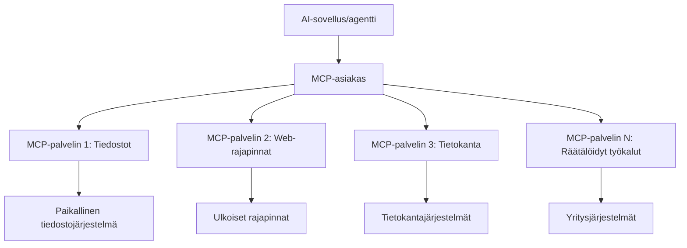

# 🌐 Moduuli 2: MCP Microsoft Foundry Toolkitin perusteilla

[]()
[]()
[]()

## 📋 Oppimistavoitteet

Tämän moduulin lopussa osaat:
- ✅ Ymmärtää Model Context Protocolin (MCP) arkkitehtuurin ja edut
- ✅ Tutustua Microsoftin MCP-palvelin-ekosysteemiin
- ✅ Integroida MCP-palvelimia Microsoft Foundry Toolkit Agent Builderin kanssa
- ✅ Rakentaa toimiva selainautomaatioagentti käyttäen Playwright MCP:tä
- ✅ Konfiguroida ja testata MCP-työkaluja agenteissasi
- ✅ Viedä ja käyttää MCP-vetoisia agenteja tuotannossa

## 🎯 Jatkoa moduuli 1:lle

Moduulissa 1 hallitsimme Microsoft Foundry Toolkitin perusteet ja loimme ensimmäisen Python-agenttimme. Nyt **tehostamme** agenttejasi kytkemällä ne ulkoisiin työkaluihin ja palveluihin vallankumouksellisen **Model Context Protocolin (MCP)** kautta.

Voit ajatella tätä siirtymänä peruslaskimesta koko tietokoneeseen — tekoälyagenttisi saavat kyvyn:
- 🌐 Selailla ja olla vuorovaikutuksessa verkkosivujen kanssa
- 📁 Käyttää ja käsitellä tiedostoja
- 🔧 Integroitua yritysjärjestelmiin
- 📊 Käsitellä reaaliaikaista dataa API:sta

## 🧠 Model Context Protocolin (MCP) ymmärtäminen

### 🔍 Mikä on MCP?

Model Context Protocol (MCP) on **”USB-C tekoälysovelluksille”** — vallankumouksellinen avoin standardi, joka yhdistää suuria kielimalleja (LLM) ulkoisiin työkaluihin, tietolähteisiin ja palveluihin. Aivan kuten USB-C poisti kaoskaapelit tarjoamalla yhden universaalin liittimen, MCP poistaa tekoälyintegraatioiden monimutkaisuuden yhtenäisellä protokollalla.

### 🎯 MCP:n ratkaisema ongelma

**Ennen MCP:tä:**
- 🔧 Räätälöidyt integraatiot joka työkaluun
- 🔄 Toimittajalukkoon jääminen suljetuilla ratkaisuilla  
- 🔒 Turva-aukot ad-hoc-yhteyksistä
- ⏱️ Kuukausien kehitystyö perusintegraatioihin

**MCP:n kanssa:**
- ⚡ Plug-and-play työkalujen integraatio
- 🔄 Toimittajasta riippumaton arkkitehtuuri
- 🛡️ Sisäänrakennetut turvatoiminnot
- 🚀 Minuutit uusien kyvykkyyksien lisäämiseen

### 🏗️ MCP-arkkitehtuurin syväluotaus

MCP seuraa **asiakas-palvelinarkkitehtuuria**, joka luo turvallisen ja skaalautuvan ekosysteemin:



**🔧 Keskeiset komponentit:**

| Komponentti | Rooli | Esimerkkejä |
|-------------|-------|-------------|
| **MCP Hostit** | Sovellukset, jotka käyttävät MCP-palveluja | Claude Desktop, VS Code, Microsoft Foundry Toolkit |
| **MCP Clientit** | Protokollakäsittelijät (1:1 palvelimiin) | Sisäänrakennettu host-sovelluksiin |
| **MCP Palvelimet** | Tarjoavat kyvykkyyksiä standardin protokollan kautta | Playwright, Files, Azure, GitHub |
| **Kuljetuskerros** | Viestintätavat | stdio, HTTP, WebSockets |


## 🏢 Microsoftin MCP-palvelin-ekosysteemi

Microsoft johtaa MCP-ekosysteemiä kattavalla yritysluokan palvelinjoukolla, jotka ratkovat todellisia liiketoiminnan tarpeita.

### 🌟 Esitellyt Microsoft MCP -palvelimet

#### 1. ☁️ Azure MCP -palvelin
**🔗 Repositorio**: [azure/azure-mcp](https://github.com/azure/azure-mcp)
**🎯 Tavoite**: Kattava Azure-resurssien hallinta tekoälyintegraatiolla

**✨ Keskeiset ominaisuudet:**
- Deklaratiivinen infrastruktuurin provisiointi
- Reaaliaikainen resurssien seuranta
- Kustannusoptimointisuositukset
- Turvallisuusvaatimusten tarkistus

**🚀 Käyttötapaukset:**
- Infrastructure-as-Code AI-avusteisesti
- Automaattinen resurssien skaalaus
- Pilvikulujen optimointi
- DevOps-työnkulkujen automaatio

#### 2. 📊 Microsoft Dataverse MCP
**📚 Dokumentaatio**: [Microsoft Dataverse Integration](https://go.microsoft.com/fwlink/?linkid=2320176)
**🎯 Tavoite**: Luonnollisen kielen käyttöliittymä liiketoimintadataan

**✨ Keskeiset ominaisuudet:**
- Luonnollisen kielen tietokantakyselyt
- Liiketoimintaymmärrys kontekstina
- Räätälöidyt prompt-mallit
- Yrityksen datanhallinta

**🚀 Käyttötapaukset:**
- Liiketoimintatiedon raportointi
- Asiakasdatan analysointi
- Myyntiputken näkymät
- Sääntelyn vaatimat datakyselyt

#### 3. 🌐 Playwright MCP -palvelin
**🔗 Repositorio**: [microsoft/playwright-mcp](https://github.com/microsoft/playwright-mcp)
**🎯 Tavoite**: Selainautomaatio ja verkkovuorovaikutus

**✨ Keskeiset ominaisuudet:**
- Moniselainautomaatio (Chrome, Firefox, Safari)
- Älykäs elementtien tunnistus
- Kuvakaappaukset ja PDF:n luonti
- Verkkoliikenteen seuranta

**🚀 Käyttötapaukset:**
- Automaattiset testityönkulut
- Verkkosivujen tietojen keruu ja purku
- Käyttöliittymän valvonta
- Kilpailija-analyysin automaatio

#### 4. 📁 Files MCP -palvelin
**🔗 Repositorio**: [microsoft/files-mcp-server](https://github.com/microsoft/files-mcp-server)
**🎯 Tavoite**: Älykäs tiedostojärjestelmän hallinta

**✨ Keskeiset ominaisuudet:**
- Deklaratiivinen tiedostojen hallinta
- Sisällön synkronointi
- Versiohallinnan integrointi
- Metatietojen poiminta

**🚀 Käyttötapaukset:**
- Dokumentaation hallinta
- Koodivaraston järjestely
- Sisällön julkaisutyönkulut
- Datan putken tiedostokäsittely

#### 5. 📝 MarkItDown MCP -palvelin
**🔗 Repositorio**: [microsoft/markitdown](https://github.com/microsoft/markitdown)
**🎯 Tavoite**: Kehittynyt Markdown-käsittely ja muokkaus

**✨ Keskeiset ominaisuudet:**
- Monipuolinen Markdown-jäsentäminen
- Muotoilun muunnokset (MD ↔ HTML ↔ PDF)
- Sisällön rakenteen analyysi
- Malliprosessointi

**🚀 Käyttötapaukset:**
- Tekninen dokumentaatio
- Sisällönhallintajärjestelmät
- Raporttien automaatio
- Tietopankin ylläpito

#### 6. 📈 Clarity MCP -palvelin
**📦 Paketti**: [@microsoft/clarity-mcp-server](https://www.npmjs.com/package/@microsoft/clarity-mcp-server)
**🎯 Tavoite**: Verkkosivuanalytiikka ja käyttäjäkäyttäytymisen seuranta

**✨ Keskeiset ominaisuudet:**
- Lämpökarttatiedon analyysi
- Käyttäjäistuntojen tallenteet
- Suorituskykymittarit
- Konversiokanavien analyysi

**🚀 Käyttötapaukset:**
- Verkkosivujen optimointi
- Käyttäjäkokemuksen tutkimus
- A/B-testauksen analyysi
- Liiketoiminnan raportointinäkymät

### 🌍 Yhteisön ekosysteemi

Microsoftin palvelimien lisäksi MCP-ekosysteemiin kuuluu:
- **🐙 GitHub MCP**: Varaston hallinta ja koodianalyysi
- **🗄️ TietokantamCP:t**: PostgreSQL, MySQL, MongoDB -integraatiot
- **☁️ Pilvipalveluntarjoajien MCP:t**: AWS, GCP, Digital Ocean työkalut
- **📧 Viestintä MCP:t**: Slack, Teams, Sähköposti-integraatiot

## 🛠️ Käytännön harjoitus: Selainautomaatioagentin rakentaminen

**🎯 Projektin tavoite**: Luo älykäs selainautomaatioagentti Playwright MCP -palvelimella, joka osaa navigoida verkkosivuilla, poimia tietoa ja suorittaa monimutkaista verkkovuorovaikutusta.

### 🚀 Vaihe 1: Agentin perusasetukset

#### Vaihe 1: Aloita agenttisi luominen
1. **Avaa Microsoft Foundry Toolkit Agent Builder**
2. **Luo uusi agentti** seuraavilla määrityksillä:
   - **Nimi**: `BrowserAgent`
   - **Malli**: Valitse GPT-4o 


### 🔧 Vaihe 2: MCP-integraation työnkulku

#### Vaihe 3: Lisää MCP-palvelinintegraatio
1. **Siirry Tools-osioon** Agent Builderissa
2. **Klikkaa "Add Tool"** avataksesi integraatiovalikon
3. **Valitse "MCP Server"** saatavilla olevista vaihtoehdoista


**🔍 Työkalutyyppien ymmärtäminen:**
- **Rakennettu työkalut**: Microsoft Foundry Toolkitin esikonfiguroidut funktiot
- **MCP-palvelimet**: Ulkoiset palveluintegratiot
- **Mukautetut API:t**: Omien palvelupisteiden käyttö
- **Funktiokutsut**: Suora pääsy mallin toimintoihin

#### Vaihe 4: MCP-palvelimen valinta
1. **Valitse "MCP Server"** jatkaaksesi


2. **Selaa MCP-katalogia** tutkiaksesi tarjolla olevia integraatioita


### 🎮 Vaihe 3: Playwright MCP:n konfigurointi

#### Vaihe 5: Valitse ja konfiguroi Playwright
1. **Klikkaa "Use Featured MCP Servers"** päästäksesi Microsoftin hyväksyttyihin palvelimiin
2. **Valitse "Playwright"** esitellyistä vaihtoehdoista
3. **Hyväksy oletus MCP ID** tai muokkaa ympäristöösi sopivaksi


#### Vaihe 6: Ota Playwrightin kyvyt käyttöön
**🔑 Kritiittinen vaihe**: Valitse **KAIKKI** saatavilla olevat Playwright-menetelmät maksimaaliseen toiminnallisuuteen


**🛠️ Oleelliset Playwright-työkalut:**
- **Navigointi**: `goto`, `goBack`, `goForward`, `reload`
- **Vuorovaikutus**: `click`, `fill`, `press`, `hover`, `drag`
- **Uuttaminen**: `textContent`, `innerHTML`, `getAttribute`
- **Vahvistus**: `isVisible`, `isEnabled`, `waitForSelector`
- **Kaappaus**: `screenshot`, `pdf`, `video`
- **Verkko**: `setExtraHTTPHeaders`, `route`, `waitForResponse`

#### Vaihe 7: Tarkista integraation onnistuminen
**✅ Onnistumisen merkit:**
- Kaikki työkalut näkyvät Agent Builderin käyttöliittymässä
- Integraatiopaneelissa ei virheilmoituksia
- Playwright-palvelimen tila näyttää "Connected"


**🔧 Yleisiä ongelmia ja ratkaisuja:**
- **Yhteys epäonnistui**: Tarkista verkkoyhteys ja palomuuriasetukset
- **Työkaluja puuttuu**: Varmista, että kaikki kyvyt valittiin asetuksissa
- **Oikeusongelmat**: Varmista, että VS Code:lla on tarvittavat järjestelmän oikeudet

### 🎯 Vaihe 4: Edistynyt kehotemuotoilu

#### Vaihe 8: Suunnittele älykkäät järjestelmäkehotteet
Luo monipuolisia kehotteita, jotka hyödyntävät Playwrightin kaikkia kykyjä:

```markdown
# Web Automation Expert System Prompt

## Core Identity
You are an advanced web automation specialist with deep expertise in browser automation, web scraping, and user experience analysis. You have access to Playwright tools for comprehensive browser control.

## Capabilities & Approach
### Navigation Strategy
- Always start with screenshots to understand page layout
- Use semantic selectors (text content, labels) when possible
- Implement wait strategies for dynamic content
- Handle single-page applications (SPAs) effectively

### Error Handling
- Retry failed operations with exponential backoff
- Provide clear error descriptions and solutions
- Suggest alternative approaches when primary methods fail
- Always capture diagnostic screenshots on errors

### Data Extraction
- Extract structured data in JSON format when possible
- Provide confidence scores for extracted information
- Validate data completeness and accuracy
- Handle pagination and infinite scroll scenarios

### Reporting
- Include step-by-step execution logs
- Provide before/after screenshots for verification
- Suggest optimizations and alternative approaches
- Document any limitations or edge cases encountered

## Ethical Guidelines
- Respect robots.txt and rate limiting
- Avoid overloading target servers
- Only extract publicly available information
- Follow website terms of service
```

#### Vaihe 9: Luo dynaamisia käyttäjäkehotteita
Muotoile kehotteita, jotka demonstroivat eri kyvykkyyksiä:

**🌐 Verkkosivuanalyysin esimerkki:**
```markdown
Navigate to github.com/kinfey and provide a comprehensive analysis including:
1. Repository structure and organization
2. Recent activity and contribution patterns  
3. Documentation quality assessment
4. Technology stack identification
5. Community engagement metrics
6. Notable projects and their purposes

Include screenshots at key steps and provide actionable insights.
```


### 🚀 Vaihe 5: Suoritus ja testaus

#### Vaihe 10: Käynnistä ensimmäinen automaatiosi
1. **Klikkaa "Run"** käynnistääksesi automaatiojakson
2. **Seuraa reaaliaikaista suorituslogia**:
   - Chrome-selain avautuu automaattisesti
   - Agentti navigoi kohdesivustolle
   - Kuvakaappaukset otetaan jokaisessa merkittävässä vaiheessa
   - Analyysitulokset virtaavat reaaliajassa


#### Vaihe 11: Analysoi tulokset ja näkemykset
Tarkastele kattavaa analyysiä Agent Builderin käyttöliittymässä:


### 🌟 Vaihe 6: Edistyneet kyvykkyydet ja käyttöönotto

#### Vaihe 12: Vienti ja tuotantokäyttöönotto
Agent Builder tukee useita käyttöönottoja:


## 🎓 Moduuli 2 yhteenveto & seuraavat askeleet

### 🏆 Saavutettu: MCP-integraation mestari

**✅ Hallitsemasi taidot:**
- [ ] MCP-arkkitehtuurin ja etujen ymmärtäminen
- [ ] Microsoftin MCP-palvelin-ekosysteemin navigointi
- [ ] Playwright MCP:n integrointi Microsoft Foundry Toolkitin kanssa
- [ ] Monimutkaisten selainautomaatioagenttien rakentaminen
- [ ] Edistynyt kehotemuotoilu web-automaatioon

### 📚 Lisäresurssit

- **🔗 MCP-spesifikaatio**: [Virallinen protokolladokumentaatio](https://modelcontextprotocol.io/)
- **🛠️ Playwright API**: [Täydellinen menetelmäreferenssi](https://playwright.dev/docs/api/class-playwright)
- **🏢 Microsoft MCP -palvelimet**: [Yritysintegrointiohje](https://github.com/microsoft/mcp-servers)
- **🌍 Yhteisön esimerkit**: [MCP Server Gallery](https://github.com/modelcontextprotocol/servers)

**🎉 Onneksi olkoon!** Olet onnistuneesti hallinnut MCP-integraation ja voit nyt rakentaa tuotantovalmiita tekoälyagentteja ulkoisilla työkalukyvykkyyksillä!


### 🔜 Jatka seuraavaan moduuliin

Valmiina viemään MCP-taitosi uudelle tasolle? Siirry **[Moduuli 3: Edistynyt MCP-kehitys Microsoft Foundry Toolkitillä](../lab3/README.md)**, missä opit:
- Luomaan omat räätälöidyt MCP-palvelimet
- Konfiguroimaan ja käyttämään uutta MCP Python SDK:ta
- Asentamaan MCP Inspectorin virheenkorjaukseen
- Hallitsemaan edistyneitä MCP-palvelinten kehitystyönkulkuja
- Rakentamaan Sää MCP -palvelimen alusta alkaen

---

<!-- CO-OP TRANSLATOR DISCLAIMER START -->
**Vastuuvapauslauseke**:
Tämä asiakirja on käännetty käyttämällä tekoälypohjaista käännöspalvelua [Co-op Translator](https://github.com/Azure/co-op-translator). Vaikka pyrimme tarkkuuteen, otathan huomioon, että automaattiset käännökset saattavat sisältää virheitä tai epätarkkuuksia. Alkuperäinen asiakirja sen alkuperäiskielellä on virallinen lähde. Tärkeissä asioissa suositellaan ammattimaista ihmiskäännöstä. Emme ole vastuussa tämän käännöksen käytöstä aiheutuvista väärinymmärryksistä tai tulkinnoista.
<!-- CO-OP TRANSLATOR DISCLAIMER END -->