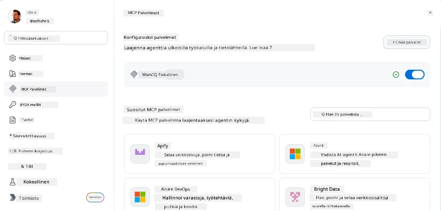
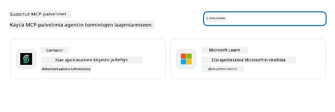
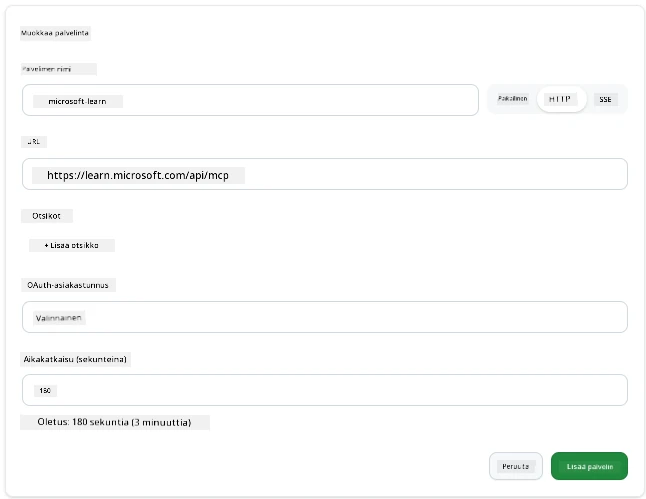
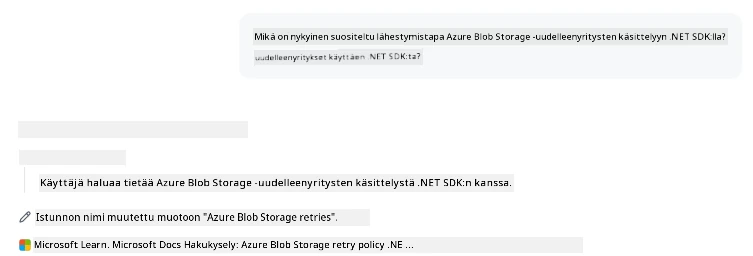
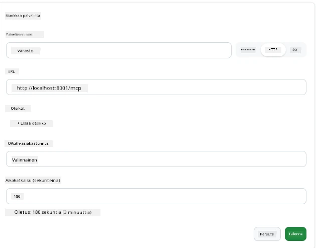
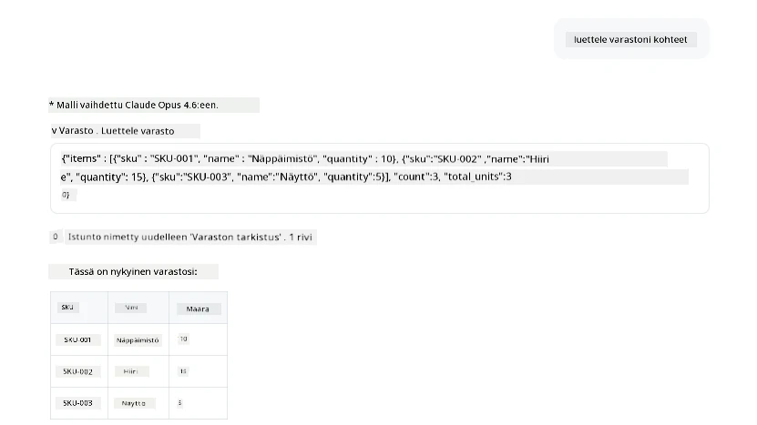
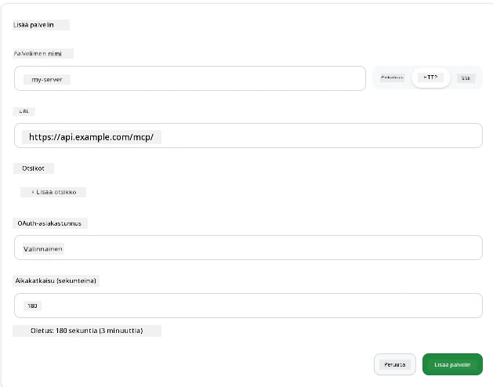
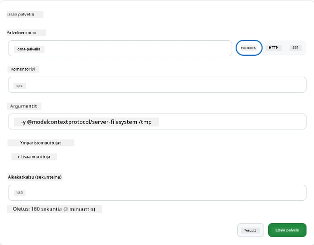

# MCP-palvelimien käyttäminen GitHub Copilot -sovelluksessa

Nyt tiedät, miten MCP toimii. Olet rakentanut palvelimia, määritellyt työkaluja ja resursseja sekä yhdistänyt asiakkaita. Mitä emme ole vielä tehneet, on kääntää näkökulmaa: sen sijaan, että sinä rakennat palvelimen, miltä näyttää olla *kuluttajan* puolella—tekoälyllä varustetun sovelluksen käyttäjänä, joka tukee MCP:tä?

[GitHub Copilot App](https://github.com/github/app) on työpöytäsovellus, joka voi käyttää MCP-palvelimia. Yhdistämällä MCP-palvelimia siihen avaavat sinä uuden tason: Copilot voi nyt päästä käsiksi dokumentaatioosi, kutsua sisäisiä rajapintojasi, kysellä tietokantaasi tai puhua mille tahansa palvelulle, jonka olet kääntänyt palvelimen ympärille. Sovellus toimii isäntänä; MCP-palvelimesi ovat sen työkaluja.

Tässä oppitunnissa kuljetaan tämä kokemus alusta loppuun—löydät MCP-asetukset, yhdistät oikean dokumentaatio-palvelimen ja sen jälkeen määrität oman mukautetun palvelimen.

## Oppimistavoitteet

Tämän oppitunnin jälkeen osaat:

- Löytää ja navigoida MCP-palvelimien asetuspaneeliin Copilot-sovelluksessa.
- Yhdistää isännöidyn dokumentaatio-palvelimen ja käyttää sitä istunnossa.
- Rekisteröidä mukautetun palvelimen ja varmistaa, että Copilot voi kutsua sen työkaluja.
- Määrittää, miten palvelinta kutsutaan antamalla ympäristömuuttujia tai mukautettuja otsikoita (jos HTTP)

## Copilot-sovellus MCP-isäntänä

Perusajatus on tämä: **Copilotin agentit ovat älykkäitä, mutta ne tietävät vain sen, mitä kerrot niille.** Oletuksena agentti voi lukea tiedostoja työtilastasi ja suorittaa komentorivikomentoja, mutta se ei voi kysellä tietokantaasi, kurkistaa kalenteriisi tai kutsua mukautettua rajapintaa ilman apua. Tähän MCP-palvelimet tulevat mukaan. Ne toimivat siltoina Copilotin ja järjestelmiesi—tietokantojen, versionhallinnan, rajapintojen, suunnittelutyökalujen—välillä, antaen agenteille pääsyn tarvitsemaansa tietoon ja toimintoihin työn suorittamiseksi.

Aloitetaan etsimällä asetukset MCP-palvelimien hallintaan.

## Vaihe 1: MCP-asetuspaneelin löytäminen

Avaa Copilot-sovellus ja etsi alakulmasta rataskuvake ja klikkaa sitä.


Varmista, että valitset "MCP Servers" ja näet nyt yläosassa jo määrittämäsi palvelimet, suosittujen palvelimien markkinapaikan alaosassa sekä "Add Server" -painikkeen yläosassa, kuten alla:



Tämä on ohjauskeskuksesi. Täällä voit lisätä, poistaa, ottaa käyttöön ja poistaa käytöstä palvelimia. Muutokset tulevat voimaan uusissa istunnoissa; jos sinulla on avoin istunto, sinun täytyy käynnistää uusi sen jälkeen, kun olet muuttanut tätä listaa.

## Vaihe 2: Dokumentaatiopalvelimen yhdistäminen

Tehdään heti jotain hyödyllistä. Microsoft Docs MCP -palvelin antaa Copilotille pääsyn viralliseen Microsoftin dokumentaatioon. Tämä sisältää Azuren, .NET:n, TypeScriptin ja paljon muuta. Sen sijaan, että agentti luottaisi koulutusdataansa (joka on ennalta määrätty päivämäärä), se voi hakea ajantasaiset dokumentit kyselyn hetkellä.

Näin lisäät sen:

1. Kirjoita suosittujen palvelinten ruutuun **learn** ja valitse palvelin nimeltä "Microsoft Learn".

   

   Klikkauksen jälkeen näet lomakkeen, jossa nimi, tiedonsiirtotyyppi ja URL on valmiiksi täytetty, sinun tarvitsee vain klikata "Add Server".

2. Klikkaa "Add Server", yhteyden muodostamiseen kuluu muutama sekunti.

   

   Kun palvelin on lisätty, se näkyy yläosassa määritettynä palvelimena. Kokeillaan sitä seuraavaksi.

3. Sulje ikkuna ja valitse Quick chat.

4. Kirjoita alla oleva kehotus käynnistääksesi työkalun Microsoft Learn -palvelimelta.

   ```text
   What's the current recommended approach for handling Azure Blob Storage 
   retries using the .NET SDK?
   ```

   

Näet, miten se viittaa juuri lisäämäämme MCP-palvelimeen.

## Vaihe 3: Mukautetun stdio-palvelimen yhdistäminen

Esiasetukset ovat käteviä, mutta todellinen voima on omien palvelimien yhdistämisessä. Oletetaan, että olet rakentanut palvelimen (tai saanut sellaisen), joka tarjoaa pääsyn sisäiseen rajapintaan tai yrityksesi tietopohjaan. Tässä käytämme MCP-palvelinta, jonka rakensimme, ja joka hoitaa yrityksemme varastonhallintaa.

1. Klikkaa rataskuvaketta ja valitse uudelleen "MCP servers".

2. Valitse "Add Server" -painike ja "+ Add Custom server" ja anna seuraavat tiedot:

   - Nimi: `Inventory Server`
   - Valitse tiedonsiirtotapaksi (oikealla), **http**

   Valitse "Add Server" ja se pitäisi ilmestyä palvelinlistallesi.

   

4. Testaa sitä ajamalla tällainen kehotus:

    ```
    list inventory
    ```

   

   Näet nyt luettelon varastoeristä, jotka tulevat sinun itse rakentamastasi palvelimesta.

Hienoa, sinulla pitäisi nyt olla hyvä käsitys siitä, miten lisäät ulkoisia sekä omia MCP-palvelimia Copilot-sovellukseen. Seuraavaksi puhutaan salasanojen ja ympäristömuuttujien käsittelystä.

## Vaihe 4: Edistyneet asetukset

Tähän asti olet nähnyt, miten MCP-palvelimia lisätään ilman muuta kuin nimi ja URL. Mutta entä jos palvelimesi tarvitsee API-avaimen tai jotain muuta arvoa? Riippuen tiedonsiirtotavasta, voimme antaa sen tarvitsemat tiedot.

- **http- tai SSE-tiedonsiirto**: Täällä voimme asettaa otsikoita tarpeen mukaan.

   Todennusta varten voit määrittää Authorization-otsikon esimerkiksi. Arvo voi olla staattinen merkkijono. Jos käytät OAuthia, voit antaa sen sijaan OAuth-asiakastunnuksen.

   

- **stdio-tiedonsiirto**: Voit asettaa ympäristömuuttujia.

   Täällä voit määrittää minkä tahansa määrän ympäristömuuttujia, jotka pitäisi välittää palvelimelle käynnistyksen yhteydessä.

   

## Yhteenveto

Copilot-sovellus käsittelee MCP-palvelimia agentin kykyjen ensiluokkaisina laajennuksina. Olet nähnyt tässä oppitunnissa koko prosessin MCP-palvelimien lisäämisestä niiden käyttämiseen istunnossa. Voit nyt yhdistää julkisia palvelimia, sisäisiä rajapintoja ja mukautettuja työkaluja, antaen agenteillesi kyvyn päästä käsiksi tietoihin ja toimintoihin, joita ne tarvitsevat tehtäviensä suorittamiseksi itsenäisesti.

## 📚 Lisäresurssit

### Viralliset dokumentit

- [GitHub Copilot App](https://github.com/github/app)
- [MCP Specification](https://modelcontextprotocol.io/specification/2025-03-26) - Model Context Protocol -määritelmä

### Yhteisö
- [MCP Community Discord](https://discord.com/invite/ByRwuEEgH4) - Live-keskustelut
- [GitHub Discussions](https://github.com/microsoft/MCP-Server-and-PostgreSQL-Sample-Retail/discussions) - Kysymykset ja jakaminen
- [Stack Overflow](https://stackoverflow.com/questions/tagged/model-context-protocol) - Teknisiä kysymyksiä

---

<!-- CO-OP TRANSLATOR DISCLAIMER START -->
**Vastuuvapauslauseke**:
Tämä asiakirja on käännetty käyttämällä tekoälypohjaista käännöspalvelua [Co-op Translator](https://github.com/Azure/co-op-translator). Vaikka pyrimme tarkkuuteen, otathan huomioon, että automaattiset käännökset saattavat sisältää virheitä tai epätarkkuuksia. Alkuperäinen asiakirja sen alkuperäiskielellä on virallinen lähde. Tärkeissä asioissa suositellaan ammattimaista ihmiskäännöstä. Emme ole vastuussa tämän käännöksen käytöstä aiheutuvista väärinymmärryksistä tai tulkinnoista.
<!-- CO-OP TRANSLATOR DISCLAIMER END -->